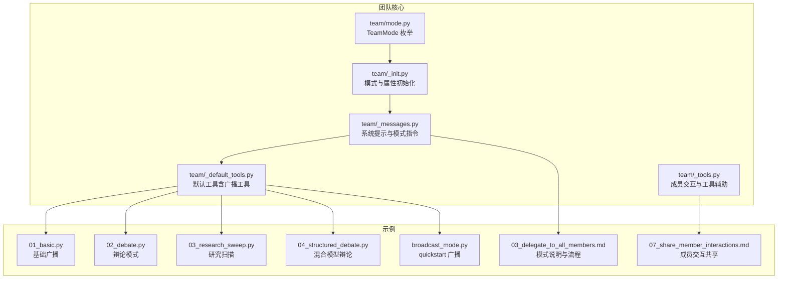
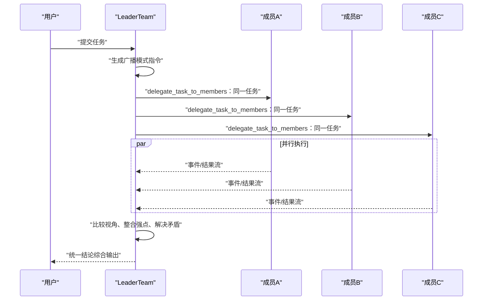
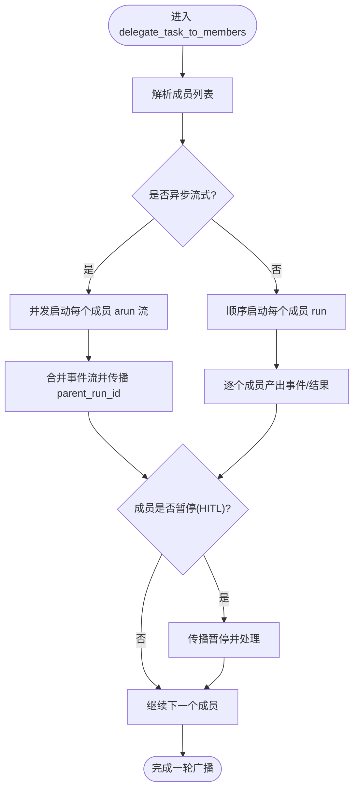
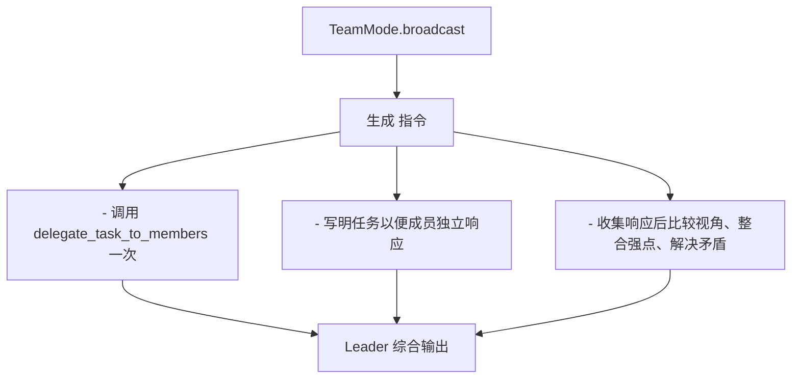
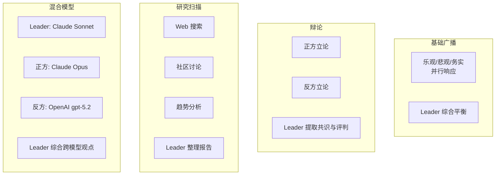
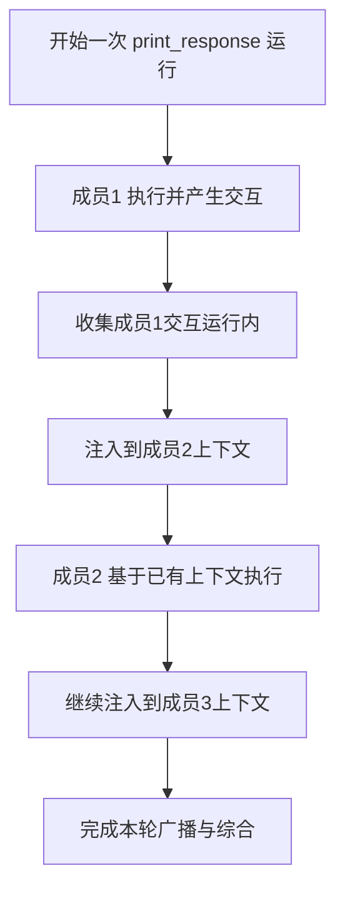
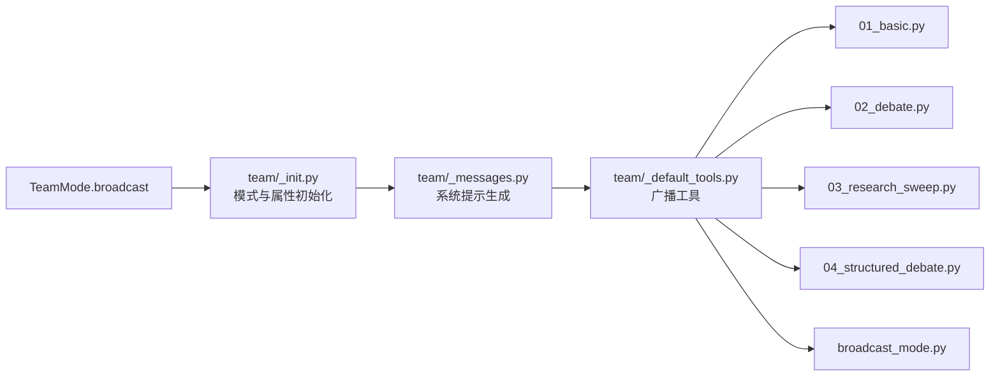

# 广播模式

<cite>
**本文引用的文件**
- [libs/agno/agno/team/mode.py](file://libs/agno/agno/team/mode.py)
- [libs/agno/agno/team/_messages.py](file://libs/agno/agno/team/_messages.py)
- [libs/agno/agno/team/_default_tools.py](file://libs/agno/agno/team/_default_tools.py)
- [libs/agno/agno/team/_init.py](file://libs/agno/agno/team/_init.py)
- [libs/agno/agno/team/_tools.py](file://libs/agno/agno/team/_tools.py)
- [cookbook/03_teams/02_modes/broadcast/01_basic.py](file://cookbook/03_teams/02_modes/broadcast/01_basic.py)
- [cookbook/03_teams/02_modes/broadcast/02_debate.py](file://cookbook/03_teams/02_modes/broadcast/02_debate.py)
- [cookbook/03_teams/02_modes/broadcast/03_research_sweep.py](file://cookbook/03_teams/02_modes/broadcast/03_research_sweep.py)
- [cookbook/03_teams/02_modes/broadcast/04_structured_debate.py](file://cookbook/03_teams/02_modes/broadcast/04_structured_debate.py)
- [cookbook/03_teams/01_quickstart/broadcast_mode.py](file://cookbook/03_teams/01_quickstart/broadcast_mode.py)
- [cookbook/03_teams/01_quickstart/03_delegate_to_all_members.md](file://cookbook/03_teams/01_quickstart/03_delegate_to_all_members.md)
- [cookbook/03_teams/01_quickstart/07_share_member_interactions.md](file://cookbook/03_teams/01_quickstart/07_share_member_interactions.md)
- [libs/agno/tests/unit/team/test_team_mode.py](file://libs/agno/tests/unit/team/test_team_mode.py)
- [libs/agno/tests/unit/team/test_delegate_closure_bug.py](file://libs/agno/tests/unit/team/test_delegate_closure_bug.py)
- [libs/agno/tests/integration/teams/test_team_delegation.py](file://libs/agno/tests/integration/teams/test_team_delegation.py)
</cite>

## 目录
1. [简介](#简介)
2. [项目结构](#项目结构)
3. [核心组件](#核心组件)
4. [架构总览](#架构总览)
5. [详细组件分析](#详细组件分析)
6. [依赖分析](#依赖分析)
7. [性能考量](#性能考量)
8. [故障排查指南](#故障排查指南)
9. [结论](#结论)
10. [附录](#附录)

## 简介
广播模式是一种团队协作范式，其中团队领导者将“同一任务”同时委托给所有成员，收集来自多视角的独立响应，并在会话内进行比较与综合，形成统一的结论。该模式强调并行处理、结果对比与整合，适用于需要多专家视角、快速并行收集信息、或进行结构化辩论的场景。

## 项目结构
与广播模式相关的核心代码分布在以下位置：
- 模式定义与初始化：team/mode.py、team/_init.py
- 系统提示与模式指令：team/_messages.py
- 默认工具（广播工具）：team/_default_tools.py
- 示例与用法：cookbook/03_teams/02_modes/broadcast/* 与 quickstart 广播示例
- 并发与交互共享：team/_tools.py 与相关测试

图表来源
- [libs/agno/agno/team/mode.py:6-24](file://libs/agno/agno/team/mode.py#L6-L24)
- [libs/agno/agno/team/_init.py:194-214](file://libs/agno/agno/team/_init.py#L194-L214)
- [libs/agno/agno/team/_messages.py:160-195](file://libs/agno/agno/team/_messages.py#L160-L195)
- [libs/agno/agno/team/_default_tools.py:813-1009](file://libs/agno/agno/team/_default_tools.py#L813-L1009)
- [libs/agno/agno/team/_tools.py:457-476](file://libs/agno/agno/team/_tools.py#L457-L476)

章节来源
- [libs/agno/agno/team/mode.py:6-24](file://libs/agno/agno/team/mode.py#L6-L24)
- [libs/agno/agno/team/_init.py:194-214](file://libs/agno/agno/team/_init.py#L194-L214)
- [libs/agno/agno/team/_messages.py:160-195](file://libs/agno/agno/team/_messages.py#L160-L195)
- [libs/agno/agno/team/_default_tools.py:813-1009](file://libs/agno/agno/team/_default_tools.py#L813-L1009)
- [libs/agno/agno/team/_tools.py:457-476](file://libs/agno/agno/team/_tools.py#L457-L476)

## 核心组件
- 模式枚举 TeamMode.broadcast：用于标识广播模式，决定团队行为与工具可用性。
- 系统提示生成器 _get_mode_instructions：根据当前模式生成 Leader 的行为指引，广播模式强调“向所有成员同时发送请求并综合其集体响应”。
- 广播工具 delegate_task_to_members：将同一任务并行发送给所有成员，聚合事件流或结果。
- 初始化逻辑：TeamMode.broadcast 会自动启用 delegate_to_all_members 并禁用 respond_directly，确保广播行为的一致性。
- 成员交互共享 share_member_interactions：在一次运行内将前序成员的交互注入后续成员上下文，提升协作效率。

章节来源
- [libs/agno/agno/team/mode.py:6-24](file://libs/agno/agno/team/mode.py#L6-L24)
- [libs/agno/agno/team/_messages.py:160-195](file://libs/agno/agno/team/_messages.py#L160-L195)
- [libs/agno/agno/team/_default_tools.py:813-1009](file://libs/agno/agno/team/_default_tools.py#L813-L1009)
- [libs/agno/agno/team/_init.py:194-214](file://libs/agno/agno/team/_init.py#L194-L214)
- [libs/agno/agno/team/_tools.py:457-476](file://libs/agno/agno/team/_tools.py#L457-L476)

## 架构总览
广播模式的系统架构围绕“模式识别—系统提示—工具调用—并行执行—结果综合”展开。Leader 根据 TeamMode.broadcast 生成相应指令，调用 delegate_task_to_members 将任务广播给所有成员；成员各自独立执行并返回事件或结果；Leader 在会话内对多视角进行比较与综合，输出统一结论。

图表来源
- [libs/agno/agno/team/_messages.py:160-195](file://libs/agno/agno/team/_messages.py#L160-L195)
- [libs/agno/agno/team/_default_tools.py:813-1009](file://libs/agno/agno/team/_default_tools.py#L813-L1009)

## 详细组件分析

### 组件A：广播工具 delegate_task_to_members
- 并行策略：在异步模式下，使用队列与并发协程启动每个成员的 arun 流，合并事件；在同步模式下逐个成员 run 并流式产出事件。
- 事件传播：将成员事件的 parent_run_id 指向团队运行 ID，便于追踪；若成员暂停（人工介入），传播暂停需求并继续流程。
- 结果聚合：在非流式模式下，将每个成员的响应内容或工具结果汇总为字符串，便于 Leader 综合。

图表来源
- [libs/agno/agno/team/_default_tools.py:813-1009](file://libs/agno/agno/team/_default_tools.py#L813-L1009)

章节来源
- [libs/agno/agno/team/_default_tools.py:813-1009](file://libs/agno/agno/team/_default_tools.py#L813-L1009)

### 组件B：系统提示与模式指令
- 广播模式指令：要求一次性调用 delegate_task_to_members，明确“从所有成员收集视角”，并在收到响应后进行比较与综合。
- 指令对比：与 coordinate/route 模式形成对照，突出“全成员广播 vs 单成员路由/协调”的差异。

图表来源
- [libs/agno/agno/team/_messages.py:160-195](file://libs/agno/agno/team/_messages.py#L160-L195)

章节来源
- [libs/agno/agno/team/_messages.py:160-195](file://libs/agno/agno/team/_messages.py#L160-L195)
- [cookbook/03_teams/01_quickstart/03_delegate_to_all_members.md:63-78](file://cookbook/03_teams/01_quickstart/03_delegate_to_all_members.md#L63-L78)

### 组件C：示例与用法
- 基础广播（多视角）：三个角色（乐观、悲观、务实）同时接收同一问题，Leader 综合平衡。
- 辩论模式：正方与反方同时立论，Leader 提取最强论点、共识区域与评判。
- 研究扫描：Web、社区与趋势三路并行收集，Leader 输出综合性报告。
- 混合模型辩论：Leader 与成员使用不同模型提供商，展示跨模型协作能力。

图表来源
- [cookbook/03_teams/02_modes/broadcast/01_basic.py:58-81](file://cookbook/03_teams/02_modes/broadcast/01_basic.py#L58-L81)
- [cookbook/03_teams/02_modes/broadcast/02_debate.py:47-62](file://cookbook/03_teams/02_modes/broadcast/02_debate.py#L47-L62)
- [cookbook/03_teams/02_modes/broadcast/03_research_sweep.py:60-75](file://cookbook/03_teams/02_modes/broadcast/03_research_sweep.py#L60-L75)
- [cookbook/03_teams/02_modes/broadcast/04_structured_debate.py:47-61](file://cookbook/03_teams/02_modes/broadcast/04_structured_debate.py#L47-L61)

章节来源
- [cookbook/03_teams/02_modes/broadcast/01_basic.py:58-81](file://cookbook/03_teams/02_modes/broadcast/01_basic.py#L58-L81)
- [cookbook/03_teams/02_modes/broadcast/02_debate.py:47-62](file://cookbook/03_teams/02_modes/broadcast/02_debate.py#L47-L62)
- [cookbook/03_teams/02_modes/broadcast/03_research_sweep.py:60-75](file://cookbook/03_teams/02_modes/broadcast/03_research_sweep.py#L60-L75)
- [cookbook/03_teams/02_modes/broadcast/04_structured_debate.py:47-61](file://cookbook/03_teams/02_modes/broadcast/04_structured_debate.py#L47-L61)

### 组件D：成员交互共享与上下文注入
- share_member_interactions：在一次运行内将前序成员的请求/响应注入到后续成员上下文，避免重复工作，提升整体效率。
- 与 add_team_history_to_members 的区别：前者是“运行内共享”，后者是“跨轮次历史共享”。

图表来源
- [libs/agno/agno/team/_tools.py:457-476](file://libs/agno/agno/team/_tools.py#L457-L476)
- [cookbook/03_teams/01_quickstart/07_share_member_interactions.md:62-76](file://cookbook/03_teams/01_quickstart/07_share_member_interactions.md#L62-L76)

章节来源
- [libs/agno/agno/team/_tools.py:457-476](file://libs/agno/agno/team/_tools.py#L457-L476)
- [cookbook/03_teams/01_quickstart/07_share_member_interactions.md:62-76](file://cookbook/03_teams/01_quickstart/07_share_member_interactions.md#L62-L76)

## 依赖分析
- 模式与初始化：TeamMode.broadcast 通过初始化逻辑设置 delegate_to_all_members 与 respond_directly，确保广播行为一致性。
- 模式枚举：TeamMode 作为字符串枚举，保证模式名稳定且可序列化。
- 工具依赖：delegate_task_to_members 依赖成员解析、会话状态复制、事件传播与暂停处理。
- 示例依赖：各示例文件依赖 Team、Agent、工具与模型，展示不同应用场景下的广播模式用法。

图表来源
- [libs/agno/agno/team/mode.py:6-24](file://libs/agno/agno/team/mode.py#L6-L24)
- [libs/agno/agno/team/_init.py:194-214](file://libs/agno/agno/team/_init.py#L194-L214)
- [libs/agno/agno/team/_messages.py:160-195](file://libs/agno/agno/team/_messages.py#L160-L195)
- [libs/agno/agno/team/_default_tools.py:813-1009](file://libs/agno/agno/team/_default_tools.py#L813-L1009)

章节来源
- [libs/agno/agno/team/mode.py:6-24](file://libs/agno/agno/team/mode.py#L6-L24)
- [libs/agno/agno/team/_init.py:194-214](file://libs/agno/agno/team/_init.py#L194-L214)
- [libs/agno/agno/team/_messages.py:160-195](file://libs/agno/agno/team/_messages.py#L160-L195)
- [libs/agno/agno/team/_default_tools.py:813-1009](file://libs/agno/agno/team/_default_tools.py#L813-L1009)

## 性能考量
- 并发执行：异步模式下通过并发协程与事件队列合并，提升吞吐；同步模式下顺序执行，便于调试与资源控制。
- 事件传播与取消：在事件流中检查运行取消，避免无效等待；成员暂停（HITL）时及时传播并处理。
- 上下文注入：share_member_interactions 减少重复查询与计算，提高整体效率。
- 资源与延迟：广播模式涉及多成员并行，需关注模型调用次数与并发限制；合理设置流式与非流式以平衡实时性与稳定性。

## 故障排查指南
- 模式选择错误：确认 TeamMode.broadcast 已启用 delegate_to_all_members；可通过单元测试验证模式推断。
- 并发闭包问题：在异步并发广播中，确保循环变量通过默认参数捕获，避免所有任务看到最后一个成员身份。
- 委派工具使用：确保仅调用 delegate_task_to_members（复数）以广播给所有成员，而非 delegate_task_to_member（单数）。
- 成员身份与日志：若出现所有成员响应一致或身份错乱，检查成员初始化与日志级别设置。

章节来源
- [libs/agno/tests/unit/team/test_team_mode.py:77-82](file://libs/agno/tests/unit/team/test_team_mode.py#L77-L82)
- [libs/agno/tests/unit/team/test_delegate_closure_bug.py:88-100](file://libs/agno/tests/unit/team/test_delegate_closure_bug.py#L88-L100)
- [libs/agno/tests/integration/teams/test_team_delegation.py:155-193](file://libs/agno/tests/integration/teams/test_team_delegation.py#L155-L193)

## 结论
广播模式通过“同一任务、全成员并行响应、Leader 综合”实现多视角协同与高效整合。结合系统提示生成、默认工具与成员交互共享，可在多种场景（多视角分析、结构化辩论、并行研究）中发挥显著优势。正确选择模式、合理配置参数与处理并发事件，是获得稳定与高性能的关键。

## 附录

### 配置参数与最佳实践
- TeamMode.broadcast：启用广播模式，自动设置 delegate_to_all_members。
- show_members_responses：在终端显示各成员独立响应，便于审阅与溯源。
- share_member_interactions：在一次运行内共享成员交互，减少重复工作。
- 流式与非流式：根据实时性需求选择 stream=True/False，注意事件传播与取消处理。
- 模型与工具：成员可使用不同模型与工具，Leader 统一综合；注意不同模型 API 差异。

章节来源
- [libs/agno/agno/team/_init.py:194-214](file://libs/agno/agno/team/_init.py#L194-L214)
- [libs/agno/agno/team/_tools.py:457-476](file://libs/agno/agno/team/_tools.py#L457-L476)
- [cookbook/03_teams/01_quickstart/03_delegate_to_all_members.md:93-96](file://cookbook/03_teams/01_quickstart/03_delegate_to_all_members.md#L93-L96)