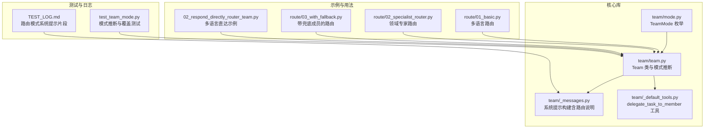
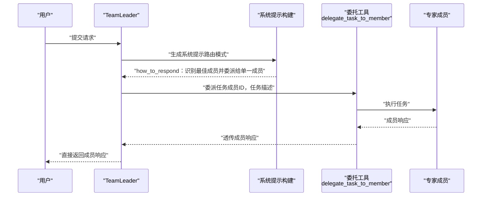
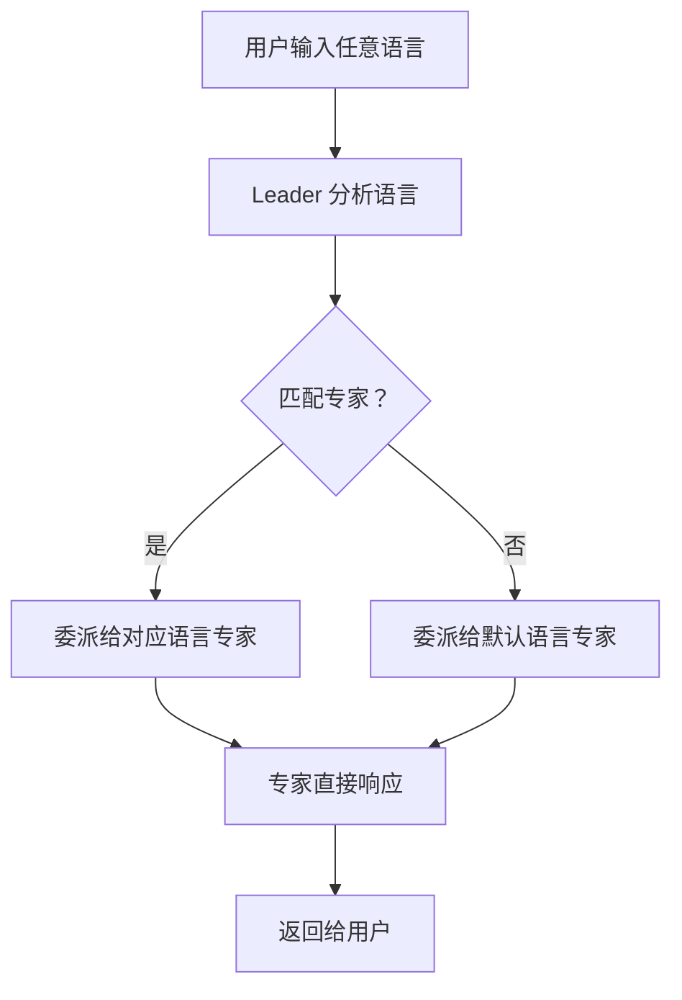
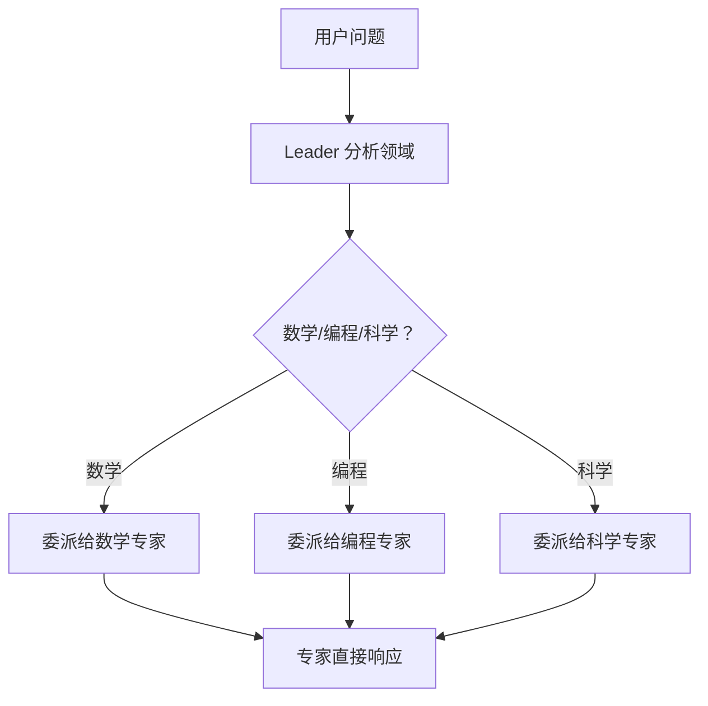
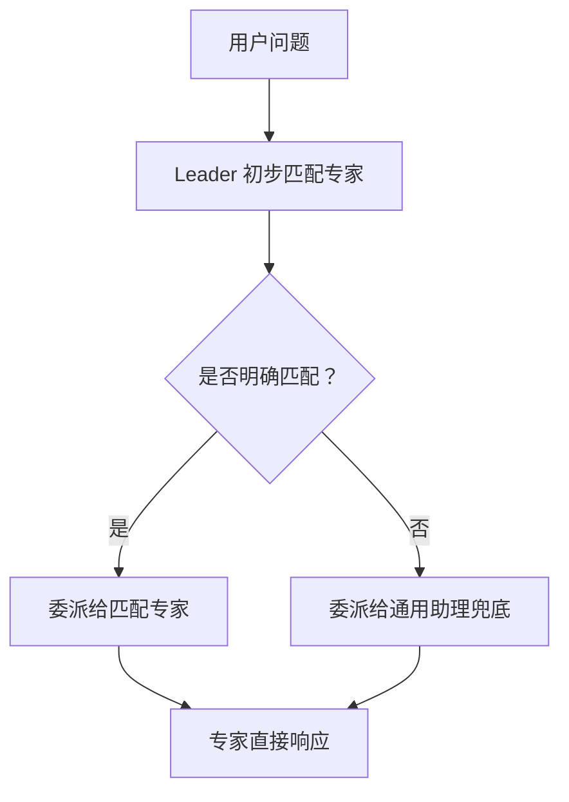
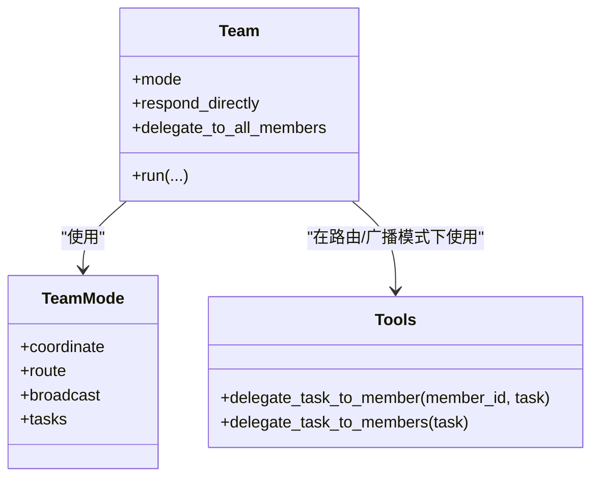
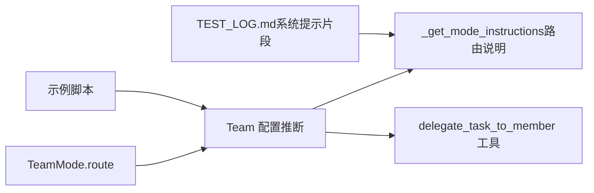

# 路由模式

<cite>
**本文引用的文件**
- [libs/agno/agno/team/mode.py](file://libs/agno/agno/team/mode.py)
- [libs/agno/agno/team/team.py](file://libs/agno/agno/team/team.py)
- [libs/agno/agno/team/_messages.py](file://libs/agno/agno/team/_messages.py)
- [libs/agno/agno/team/_default_tools.py](file://libs/agno/agno/team/_default_tools.py)
- [libs/agno/tests/unit/team/test_team_mode.py](file://libs/agno/tests/unit/team/test_team_mode.py)
- [cookbook/03_teams/02_modes/route/README.md](file://cookbook/03_teams/02_modes/route/README.md)
- [cookbook/03_teams/02_modes/route/01_basic.py](file://cookbook/03_teams/02_modes/route/01_basic.py)
- [cookbook/03_teams/02_modes/route/02_specialist_router.py](file://cookbook/03_teams/02_modes/route/02_specialist_router.py)
- [cookbook/03_teams/02_modes/route/03_with_fallback.py](file://cookbook/03_teams/02_modes/route/03_with_fallback.py)
- [cookbook/03_teams/01_quickstart/02_respond_directly_router_team.py](file://cookbook/03_teams/01_quickstart/02_respond_directly_router_team.py)
- [cookbook/03_teams/02_modes/TEST_LOG.md](file://cookbook/03_teams/02_modes/TEST_LOG.md)
</cite>

## 目录
1. [简介](#简介)
2. [项目结构](#项目结构)
3. [核心组件](#核心组件)
4. [架构总览](#架构总览)
5. [详细组件分析](#详细组件分析)
6. [依赖分析](#依赖分析)
7. [性能考量](#性能考量)
8. [故障排查指南](#故障排查指南)
9. [结论](#结论)
10. [附录](#附录)

## 简介
路由模式（Route Mode）是团队执行的一种模式，其核心思想是“专家直达”。在该模式下，团队领导（Leader）负责识别用户请求所属的专业领域，并将任务精确地委派给最合适的单一专家成员；随后，直接返回该成员的响应给用户，不进行二次合成或汇总。这种模式强调专业化分工、快速响应与专家决策，适用于需要专业技能与即时反馈的任务场景。

## 项目结构
围绕路由模式的相关实现与示例主要分布在以下位置：
- 核心模式定义与推断逻辑：libs/agno/agno/team/mode.py、libs/agno/agno/team/team.py、libs/agno/agno/team/_messages.py
- 默认工具（委托工具）：libs/agno/agno/team/_default_tools.py
- 示例与测试日志：cookbook/03_teams/02_modes/route/*、cookbook/03_teams/01_quickstart/02_respond_directly_router_team.py、cookbook/03_teams/02_modes/TEST_LOG.md
- 单元测试验证模式行为：libs/agno/tests/unit/team/test_team_mode.py

图表来源
- [libs/agno/agno/team/mode.py:1-24](file://libs/agno/agno/team/mode.py#L1-L24)
- [libs/agno/agno/team/team.py:70-112](file://libs/agno/agno/team/team.py#L70-L112)
- [libs/agno/agno/team/_messages.py:150-195](file://libs/agno/agno/team/_messages.py#L150-L195)
- [libs/agno/agno/team/_default_tools.py:538-669](file://libs/agno/agno/team/_default_tools.py#L538-L669)
- [cookbook/03_teams/02_modes/route/01_basic.py:1-77](file://cookbook/03_teams/02_modes/route/01_basic.py#L1-L77)
- [cookbook/03_teams/02_modes/route/02_specialist_router.py:1-79](file://cookbook/03_teams/02_modes/route/02_specialist_router.py#L1-L79)
- [cookbook/03_teams/02_modes/route/03_with_fallback.py:1-90](file://cookbook/03_teams/02_modes/route/03_with_fallback.py#L1-L90)
- [cookbook/03_teams/01_quickstart/02_respond_directly_router_team.py:1-114](file://cookbook/03_teams/01_quickstart/02_respond_directly_router_team.py#L1-L114)
- [cookbook/03_teams/02_modes/TEST_LOG.md:640-692](file://cookbook/03_teams/02_modes/TEST_LOG.md#L640-L692)
- [libs/agno/tests/unit/team/test_team_mode.py:84-115](file://libs/agno/tests/unit/team/test_team_mode.py#L84-L115)

章节来源
- [cookbook/03_teams/02_modes/route/README.md:1-16](file://cookbook/03_teams/02_modes/route/README.md#L1-L16)

## 核心组件
- TeamMode 枚举：定义了 coordinate、route、broadcast、tasks 四种执行模式，其中 route 表示“专家直达”。
- Team 类：承载团队配置，包括 mode、respond_directly、delegate_to_all_members 等布尔标志位；当 mode 显式设置为 route 时，会强制 respond_directly=True、delegate_to_all_members=False。
- 系统提示构建：_get_mode_instructions 在不同模式下生成对应的 how_to_respond 指令；路由模式强调“识别最佳成员并委派给单一成员，直接返回其响应”。
- 委托工具：delegate_task_to_member 是路由模式的核心工具，用于将任务委派给指定成员并直接透传其响应；与广播模式的 delegate_task_to_members（全量成员）形成对比。
- 示例与用法：多语言路由、领域专家路由、带兜底成员的路由等示例展示了路由模式在不同场景下的配置与行为。

章节来源
- [libs/agno/agno/team/mode.py:6-24](file://libs/agno/agno/team/mode.py#L6-L24)
- [libs/agno/agno/team/team.py:70-112](file://libs/agno/agno/team/team.py#L70-L112)
- [libs/agno/agno/team/team.py:193-214](file://libs/agno/agno/team/team.py#L193-L214)
- [libs/agno/agno/team/_messages.py:150-195](file://libs/agno/agno/team/_messages.py#L150-L195)
- [libs/agno/agno/team/_default_tools.py:538-669](file://libs/agno/agno/team/_default_tools.py#L538-L669)
- [cookbook/03_teams/02_modes/route/01_basic.py:46-58](file://cookbook/03_teams/02_modes/route/01_basic.py#L46-L58)
- [cookbook/03_teams/02_modes/route/02_specialist_router.py:54-68](file://cookbook/03_teams/02_modes/route/02_specialist_router.py#L54-L68)
- [cookbook/03_teams/02_modes/route/03_with_fallback.py:55-69](file://cookbook/03_teams/02_modes/route/03_with_fallback.py#L55-L69)

## 架构总览
路由模式的端到端流程如下：
- 用户输入请求
- Team 根据 mode=route 生成系统提示，指示“识别最佳成员并委派给单一成员，直接返回其响应”
- Leader 使用内置工具 delegate_task_to_member 将任务委派给选定成员
- 成员直接执行并返回响应，Leader 不进行二次合成
- 流式或非流式返回给用户

图表来源
- [libs/agno/agno/team/_messages.py:150-195](file://libs/agno/agno/team/_messages.py#L150-L195)
- [libs/agno/agno/team/_default_tools.py:538-669](file://libs/agno/agno/team/_default_tools.py#L538-L669)
- [cookbook/03_teams/02_modes/TEST_LOG.md:666-682](file://cookbook/03_teams/02_modes/TEST_LOG.md#L666-L682)

## 详细组件分析

### 基础路由模式（多语言直达）
- 目标：演示将请求按语言路由到对应语言专家，直接返回专家响应。
- 关键点：
  - Team.mode=route
  - 成员角色限定为“仅以某种语言回复”
  - Leader 的 instructions 明确语言检测与默认策略
- 适用场景：多语言客服、本地化内容服务等

图表来源
- [cookbook/03_teams/02_modes/route/01_basic.py:46-58](file://cookbook/03_teams/02_modes/route/01_basic.py#L46-L58)
- [cookbook/03_teams/01_quickstart/02_respond_directly_router_team.py:51-72](file://cookbook/03_teams/01_quickstart/02_respond_directly_router_team.py#L51-L72)

章节来源
- [cookbook/03_teams/02_modes/route/01_basic.py:1-77](file://cookbook/03_teams/02_modes/route/01_basic.py#L1-L77)
- [cookbook/03_teams/01_quickstart/02_respond_directly_router_team.py:1-114](file://cookbook/03_teams/01_quickstart/02_respond_directly_router_team.py#L1-L114)

### 专家路由器模式（领域专家路由）
- 目标：将用户问题路由到数学/编程/科学等领域的专家，专家直接响应。
- 关键点：
  - Team.mode=route
  - Leader 的 instructions 明确“数学/编程/科学”三类路由规则
  - 成员各自具备领域专长与角色说明
- 适用场景：技术咨询、学术问答、专业解答等

图表来源
- [cookbook/03_teams/02_modes/route/02_specialist_router.py:54-68](file://cookbook/03_teams/02_modes/route/02_specialist_router.py#L54-L68)
- [cookbook/03_teams/02_modes/TEST_LOG.md:684-688](file://cookbook/03_teams/02_modes/TEST_LOG.md#L684-L688)

章节来源
- [cookbook/03_teams/02_modes/route/02_specialist_router.py:1-79](file://cookbook/03_teams/02_modes/route/02_specialist_router.py#L1-L79)

### 带回退的路由模式（兜底成员）
- 目标：当问题无法明确匹配专家时，路由到通用助理兜底，确保不出现路由失败。
- 关键点：
  - Team.mode=route
  - Leader 的 instructions 明确“当不确定时路由到通用助理”
  - 引入通用兜底成员，避免模糊决策
- 适用场景：开发帮助台、通用技术支持、跨域问题初筛等

图表来源
- [cookbook/03_teams/02_modes/route/03_with_fallback.py:55-69](file://cookbook/03_teams/02_modes/route/03_with_fallback.py#L55-L69)

章节来源
- [cookbook/03_teams/02_modes/route/03_with_fallback.py:1-90](file://cookbook/03_teams/02_modes/route/03_with_fallback.py#L1-L90)

### 路由模式与坐标/广播模式对比
- 路由模式（route）：单成员委派，直接返回成员响应，延迟更低，适合单一专业领域问题。
- 坐标模式（coordinate）：Leader 选择成员并合成响应，适合需要综合视角的问题。
- 广播模式（broadcast）：向所有成员同时委派任务并合成响应，适合需要多视角比较与整合的场景。

图表来源
- [libs/agno/agno/team/mode.py:6-24](file://libs/agno/agno/team/mode.py#L6-L24)
- [libs/agno/agno/team/team.py:70-112](file://libs/agno/agno/team/team.py#L70-L112)
- [libs/agno/agno/team/_default_tools.py:538-669](file://libs/agno/agno/team/_default_tools.py#L538-L669)
- [libs/agno/agno/team/_default_tools.py:813-949](file://libs/agno/agno/team/_default_tools.py#L813-L949)

章节来源
- [libs/agno/agno/team/_messages.py:150-195](file://libs/agno/agno/team/_messages.py#L150-L195)
- [libs/agno/agno/team/_default_tools.py:538-669](file://libs/agno/agno/team/_default_tools.py#L538-L669)
- [libs/agno/agno/team/_default_tools.py:813-949](file://libs/agno/agno/team/_default_tools.py#L813-L949)

## 依赖分析
- TeamMode.route 与 Team 配置的关系：当 mode=route 时，respond_directly 自动设为 True，delegate_to_all_members 设为 False，确保“单成员直达”语义。
- 系统提示与工具的耦合：_get_mode_instructions 为路由模式生成 how_to_respond，_default_tools 提供 delegate_task_to_member，二者共同保证“识别→委派→直达”的闭环。
- 示例与核心库的交互：示例通过 Team(mode=TeamMode.route) 驱动核心库的行为，TEST_LOG 展示了实际运行时的系统提示内容。

图表来源
- [libs/agno/agno/team/team.py:193-214](file://libs/agno/agno/team/team.py#L193-L214)
- [libs/agno/agno/team/_messages.py:150-195](file://libs/agno/agno/team/_messages.py#L150-L195)
- [libs/agno/agno/team/_default_tools.py:538-669](file://libs/agno/agno/team/_default_tools.py#L538-L669)
- [cookbook/03_teams/02_modes/TEST_LOG.md:666-682](file://cookbook/03_teams/02_modes/TEST_LOG.md#L666-L682)

章节来源
- [libs/agno/tests/unit/team/test_team_mode.py:84-115](file://libs/agno/tests/unit/team/test_team_mode.py#L84-L115)

## 性能考量
- 延迟优势：路由模式不进行多成员响应的二次合成，减少一次“Leader 合成”的开销，整体延迟更低。
- 并发与流式：示例展示了同步与异步两种执行方式，可根据场景选择以提升吞吐。
- 资源占用：单成员执行避免了广播模式的全量并行开销，适合资源受限或对延迟敏感的场景。

## 故障排查指南
- 未找到成员：当委派成员 ID 不存在时，委托工具会返回提示信息，建议检查成员 ID 与团队成员列表。
- 无响应或空内容：若成员未产生内容或工具调用为空，委托工具会返回相应提示，需检查成员的工具链与权限。
- 模式冲突：若显式设置了 mode=route，即使传入 delegate_to_all_members=True，也会被强制覆盖为 False；请优先使用 mode 字段明确意图。
- 日志定位：TEST_LOG.md 中包含路由模式的系统提示片段，可用于核对 Leader 的行为是否符合预期。

章节来源
- [libs/agno/agno/team/_default_tools.py:538-669](file://libs/agno/agno/team/_default_tools.py#L538-L669)
- [libs/agno/agno/team/team.py:193-214](file://libs/agno/agno/team/team.py#L193-L214)
- [cookbook/03_teams/02_modes/TEST_LOG.md:640-692](file://cookbook/03_teams/02_modes/TEST_LOG.md#L640-L692)

## 结论
路由模式通过“专家直达”实现了专业化分工与快速响应，特别适合单一专业领域问题与需要即时反馈的场景。配合明确的路由规则与兜底成员，可在保证一致性的同时提升用户体验。在团队配置上，优先使用 TeamMode.route 并辅以清晰的成员角色与指令，即可获得稳定高效的路由效果。

## 附录
- 适用场景速查
  - 多语言客服：基础路由模式（多语言直达）
  - 技术/学术咨询：专家路由器模式（数学/编程/科学）
  - 开发支持/通用初筛：带回退的路由模式（SQL/Python + 通用助理）
- 最佳实践
  - 明确路由规则：在 Leader instructions 中列出“条件→成员”的映射
  - 专家纯化：专家仅处理对口问题，避免承担通用职责
  - 兜底策略：为不确定场景设定兜底成员与“当不确定时”的明确规则
  - 模式选择：单一专业领域问题优先 route；需要综合视角用 coordinate；需要多视角比较用 broadcast