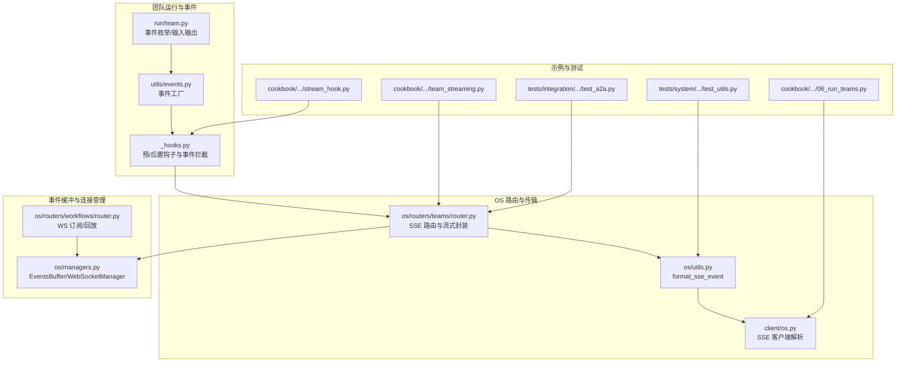
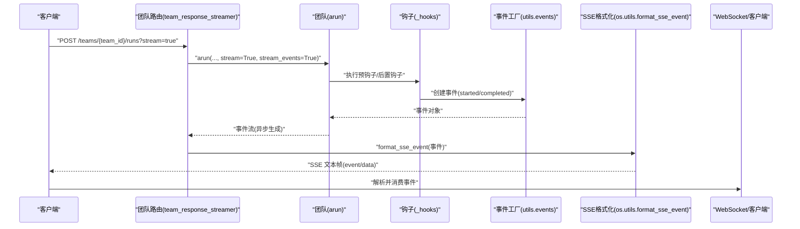
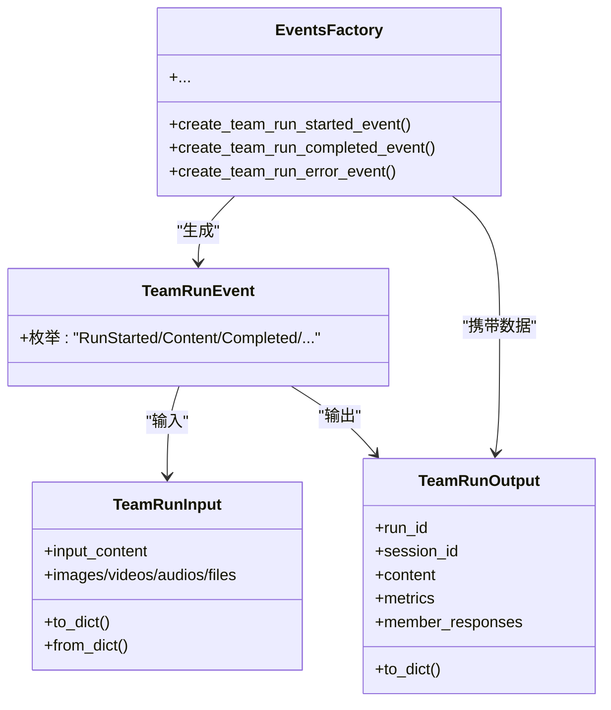
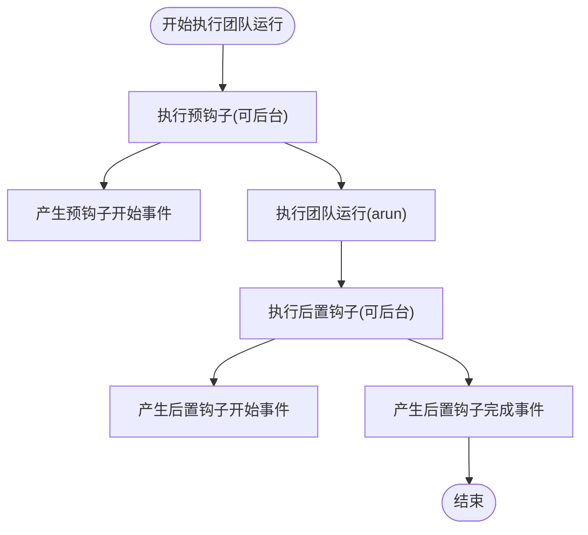
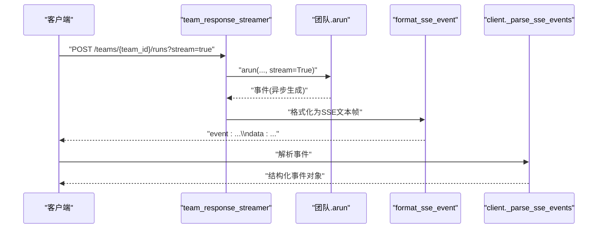
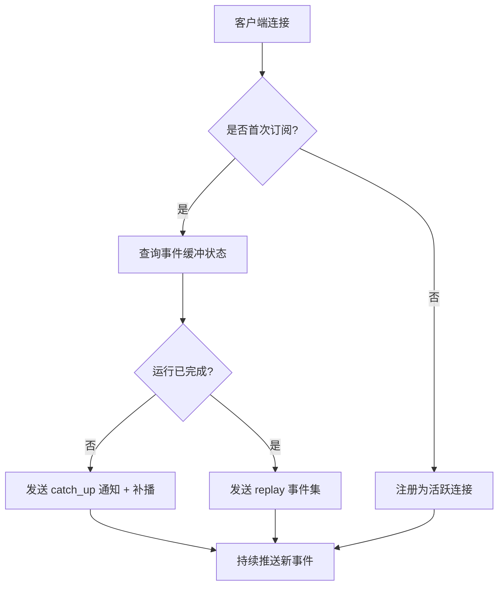
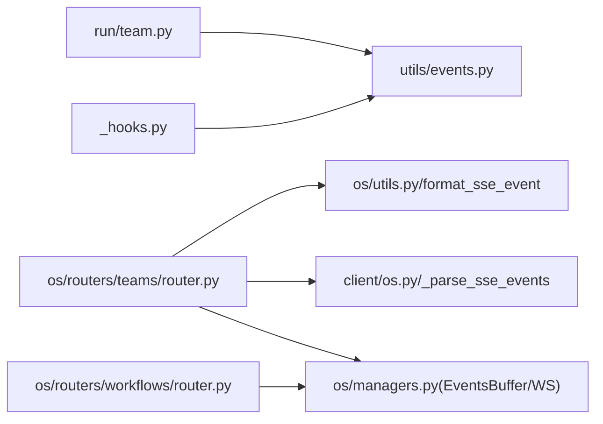

# 团队流式处理

<cite>
**本文引用的文件**
- [libs/agno/agno/team/_hooks.py](file://libs/agno/agno/team/_hooks.py)
- [libs/agno/agno/os/routers/teams/router.py](file://libs/agno/agno/os/routers/teams/router.py)
- [libs/agno/agno/run/team.py](file://libs/agno/agno/run/team.py)
- [libs/agno/agno/utils/events.py](file://libs/agno/agno/utils/events.py)
- [libs/agno/agno/os/managers.py](file://libs/agno/agno/os/managers.py)
- [libs/agno/agno/os/routers/workflows/router.py](file://libs/agno/agno/os/routers/workflows/router.py)
- [libs/agno/agno/os/utils.py](file://libs/agno/agno/os/utils.py)
- [libs/agno/agno/client/os.py](file://libs/agno/agno/client/os.py)
- [cookbook/03_teams/08_streaming/team_streaming.py](file://cookbook/03_teams/08_streaming/team_streaming.py)
- [cookbook/03_teams/13_hooks/stream_hook.py](file://cookbook/03_teams/13_hooks/stream_hook.py)
- [cookbook/05_agent_os/client/06_run_teams.py](file://cookbook/05_agent_os/client/06_run_teams.py)
- [libs/agno/tests/integration/os/interfaces/test_a2a.py](file://libs/agno/tests/integration/os/interfaces/test_a2a.py)
- [libs/agno/tests/system/tests/test_utils.py](file://libs/agno/tests/system/tests/test_utils.py)
</cite>

## 目录
1. [简介](#简介)
2. [项目结构](#项目结构)
3. [核心组件](#核心组件)
4. [架构总览](#架构总览)
5. [详细组件分析](#详细组件分析)
6. [依赖分析](#依赖分析)
7. [性能考虑](#性能考虑)
8. [故障排查指南](#故障排查指南)
9. [结论](#结论)
10. [附录](#附录)

## 简介
本文件系统性阐述团队流式处理的实现与应用，涵盖实时通信机制、状态更新与事件处理、团队事件类型与传播、流式钩子配置与事件拦截、多代理协作中的实时状态同步与响应聚合，以及性能优化、错误处理与调试方法。文档以仓库中的实际代码为依据，提供可追溯的“章节来源”与“图表来源”，并辅以面向非专业读者的渐进式讲解。

## 项目结构
团队流式处理涉及以下关键模块：
- 团队运行与事件模型：定义团队运行事件类型、输入输出结构与事件工厂函数
- 团队钩子与事件拦截：在运行前后注入事件，支持流式事件传播
- OS 路由层：提供 SSE 流式接口，封装团队运行与事件序列化
- 事件缓冲与 WebSocket 管理：支持断线重连、事件回放与订阅
- 客户端与示例：演示同步/异步流式消费、钩子事件通知与远程调用

**图表来源**
- [libs/agno/agno/run/team.py:130-185](file://libs/agno/agno/run/team.py#L130-L185)
- [libs/agno/agno/utils/events.py:86-200](file://libs/agno/agno/utils/events.py#L86-L200)
- [libs/agno/agno/team/_hooks.py:222-321](file://libs/agno/agno/team/_hooks.py#L222-L321)
- [libs/agno/agno/os/routers/teams/router.py:50-112](file://libs/agno/agno/os/routers/teams/router.py#L50-L112)
- [libs/agno/agno/os/utils.py:172-199](file://libs/agno/agno/os/utils.py#L172-L199)
- [libs/agno/agno/client/os.py:366-380](file://libs/agno/agno/client/os.py#L366-L380)
- [libs/agno/agno/os/managers.py:195-327](file://libs/agno/agno/os/managers.py#L195-L327)
- [libs/agno/agno/os/routers/workflows/router.py:126-200](file://libs/agno/agno/os/routers/workflows/router.py#L126-L200)

**章节来源**
- [libs/agno/agno/run/team.py:130-185](file://libs/agno/agno/run/team.py#L130-L185)
- [libs/agno/agno/utils/events.py:86-200](file://libs/agno/agno/utils/events.py#L86-L200)
- [libs/agno/agno/team/_hooks.py:222-321](file://libs/agno/agno/team/_hooks.py#L222-L321)
- [libs/agno/agno/os/routers/teams/router.py:50-112](file://libs/agno/agno/os/routers/teams/router.py#L50-L112)
- [libs/agno/agno/os/utils.py:172-199](file://libs/agno/agno/os/utils.py#L172-L199)
- [libs/agno/agno/client/os.py:366-380](file://libs/agno/agno/client/os.py#L366-L380)
- [libs/agno/agno/os/managers.py:195-327](file://libs/agno/agno/os/managers.py#L195-L327)
- [libs/agno/agno/os/routers/workflows/router.py:126-200](file://libs/agno/agno/os/routers/workflows/router.py#L126-L200)

## 核心组件
- 团队运行事件类型：定义团队运行生命周期内的事件，如启动、内容增量、完成、错误、工具调用、推理、内存更新、会话摘要、模型请求、压缩、暂停/继续、任务迭代与状态更新等
- 事件工厂：根据运行输出生成标准化事件对象，便于统一序列化与传输
- 钩子与事件拦截：在团队运行前/后触发钩子，按需产生“开始/完成”事件，支持后台任务与异常处理
- SSE 路由与格式化：将事件转换为 Server-Sent Events 文本帧，供客户端消费
- 事件缓冲与 WebSocket 管理：维护事件缓冲、运行元信息与连接注册，支持断线重连与补播
- 客户端解析：将原始 SSE 行流解析为结构化事件对象

**章节来源**
- [libs/agno/agno/run/team.py:130-185](file://libs/agno/agno/run/team.py#L130-L185)
- [libs/agno/agno/utils/events.py:86-200](file://libs/agno/agno/utils/events.py#L86-L200)
- [libs/agno/agno/team/_hooks.py:222-321](file://libs/agno/agno/team/_hooks.py#L222-L321)
- [libs/agno/agno/os/routers/teams/router.py:50-112](file://libs/agno/agno/os/routers/teams/router.py#L50-L112)
- [libs/agno/agno/os/utils.py:172-199](file://libs/agno/agno/os/utils.py#L172-L199)
- [libs/agno/agno/os/managers.py:195-327](file://libs/agno/agno/os/managers.py#L195-L327)
- [libs/agno/agno/client/os.py:366-380](file://libs/agno/agno/client/os.py#L366-L380)

## 架构总览
团队流式处理从“请求进入 → 团队运行 → 事件生成 → SSE 序列化 → 客户端消费”的完整链路如下：

**图表来源**
- [libs/agno/agno/os/routers/teams/router.py:50-112](file://libs/agno/agno/os/routers/teams/router.py#L50-L112)
- [libs/agno/agno/team/_hooks.py:222-321](file://libs/agno/agno/team/_hooks.py#L222-L321)
- [libs/agno/agno/utils/events.py:86-200](file://libs/agno/agno/utils/events.py#L86-L200)
- [libs/agno/agno/os/utils.py:172-199](file://libs/agno/agno/os/utils.py#L172-L199)
- [libs/agno/agno/client/os.py:366-380](file://libs/agno/agno/client/os.py#L366-L380)

## 详细组件分析

### 组件一：团队事件类型与事件数据
- 事件类型：涵盖运行生命周期、推理过程、工具调用、内存/会话/模型交互、压缩、暂停/继续、任务模式等
- 事件数据：包含会话ID、运行ID、父运行ID、团队ID/名称、工作流ID/步骤信息、时间戳、内容、引用、指标、成员响应等
- 事件工厂：提供“已开始/已完成/错误/取消/暂停/继续”等事件的构造函数，确保跨组件一致性

**图表来源**
- [libs/agno/agno/run/team.py:26-128](file://libs/agno/agno/run/team.py#L26-L128)
- [libs/agno/agno/run/team.py:130-185](file://libs/agno/agno/run/team.py#L130-L185)
- [libs/agno/agno/utils/events.py:86-200](file://libs/agno/agno/utils/events.py#L86-L200)

**章节来源**
- [libs/agno/agno/run/team.py:130-185](file://libs/agno/agno/run/team.py#L130-L185)
- [libs/agno/agno/utils/events.py:86-200](file://libs/agno/agno/utils/events.py#L86-L200)

### 组件二：流式钩子与事件拦截
- 预钩子/后置钩子：在团队运行前后依次执行，支持后台任务与异常捕获；当开启流式事件时，自动产生“开始/完成”事件
- 事件拦截：通过统一的事件处理函数，将钩子执行状态转化为标准事件，便于前端感知与持久化
- 异步版本：提供异步钩子执行路径，保证在协程环境中正确调度

**图表来源**
- [libs/agno/agno/team/_hooks.py:222-321](file://libs/agno/agno/team/_hooks.py#L222-L321)
- [libs/agno/agno/team/_hooks.py:427-524](file://libs/agno/agno/team/_hooks.py#L427-L524)
- [libs/agno/agno/team/_hooks.py:322-425](file://libs/agno/agno/team/_hooks.py#L322-L425)
- [libs/agno/agno/team/_hooks.py:524-624](file://libs/agno/agno/team/_hooks.py#L524-L624)

**章节来源**
- [libs/agno/agno/team/_hooks.py:222-321](file://libs/agno/agno/team/_hooks.py#L222-L321)
- [libs/agno/agno/team/_hooks.py:427-524](file://libs/agno/agno/team/_hooks.py#L427-L524)
- [libs/agno/agno/team/_hooks.py:322-425](file://libs/agno/agno/team/_hooks.py#L322-L425)
- [libs/agno/agno/team/_hooks.py:524-624](file://libs/agno/agno/team/_hooks.py#L524-L624)

### 组件三：SSE 路由与流式响应
- 路由封装：将团队运行结果转换为事件流，逐条格式化为 SSE 文本帧
- 错误处理：对输入/输出校验异常与通用异常进行标准化错误事件返回
- 客户端解析：异步客户端逐行读取并解析事件，支持错误与超时处理

**图表来源**
- [libs/agno/agno/os/routers/teams/router.py:50-112](file://libs/agno/agno/os/routers/teams/router.py#L50-L112)
- [libs/agno/agno/os/utils.py:172-199](file://libs/agno/agno/os/utils.py#L172-L199)
- [libs/agno/agno/client/os.py:366-380](file://libs/agno/agno/client/os.py#L366-L380)

**章节来源**
- [libs/agno/agno/os/routers/teams/router.py:50-112](file://libs/agno/agno/os/routers/teams/router.py#L50-L112)
- [libs/agno/agno/os/utils.py:172-199](file://libs/agno/agno/os/utils.py#L172-L199)
- [libs/agno/agno/client/os.py:366-380](file://libs/agno/agno/client/os.py#L366-L380)

### 组件四：事件缓冲与 WebSocket 管理（断线重连）
- 事件缓冲：按运行ID维护事件列表与元信息，支持最大事件数限制与过期清理
- WebSocket 管理：记录活动连接与认证状态，支持订阅/重连后的补播与新事件推送
- 工作流示例：提供基于 WebSocket 的订阅/回放逻辑，包含“replay/catch_up/subscribed”等通知

**图表来源**
- [libs/agno/agno/os/managers.py:195-327](file://libs/agno/agno/os/managers.py#L195-L327)
- [libs/agno/agno/os/routers/workflows/router.py:126-200](file://libs/agno/agno/os/routers/workflows/router.py#L126-L200)

**章节来源**
- [libs/agno/agno/os/managers.py:195-327](file://libs/agno/agno/os/managers.py#L195-L327)
- [libs/agno/agno/os/routers/workflows/router.py:126-200](file://libs/agno/agno/os/routers/workflows/router.py#L126-L200)

### 组件五：多代理协作中的实时状态同步与响应聚合
- 多成员协作：团队运行中各成员的推理、工具调用、内容增量均作为独立事件产生
- 状态同步：通过事件缓冲与 WebSocket 管理，确保断线重连后能获取最新事件索引并补播
- 响应聚合：前端可按事件类型聚合展示，如“团队内容增量”、“成员响应”、“推理步骤”等

**章节来源**
- [libs/agno/agno/run/team.py:130-185](file://libs/agno/agno/run/team.py#L130-L185)
- [libs/agno/agno/os/managers.py:195-327](file://libs/agno/agno/os/managers.py#L195-L327)

### 组件六：示例与用法
- 同步/异步流式：提供多种消费方式，包括同步打印、异步生成器消费与异步打印
- 钩子事件通知：通过后置钩子在运行完成后发送通知（如邮件）
- 远程团队流式：客户端通过 SSE 接收事件，区分内容事件与完成事件

**章节来源**
- [cookbook/03_teams/08_streaming/team_streaming.py:1-85](file://cookbook/03_teams/08_streaming/team_streaming.py#L1-L85)
- [cookbook/03_teams/13_hooks/stream_hook.py:1-65](file://cookbook/03_teams/13_hooks/stream_hook.py#L1-L65)
- [cookbook/05_agent_os/client/06_run_teams.py:54-93](file://cookbook/05_agent_os/client/06_run_teams.py#L54-L93)

## 依赖分析
- 组件耦合
  - 团队运行与事件模型：低耦合，事件类型集中定义，便于扩展
  - 钩子与事件：通过统一事件工厂解耦，支持异步与后台任务
  - 路由与传输：路由依赖事件格式化与客户端解析，形成清晰边界
  - 缓冲与连接：事件缓冲与 WebSocket 管理相互独立，职责清晰
- 外部依赖
  - FastAPI：提供路由与 SSE 响应
  - Pydantic/数据类：用于事件与运行输出的序列化
  - 异步运行时：事件流与 WebSocket 基于 asyncio

**图表来源**
- [libs/agno/agno/run/team.py:130-185](file://libs/agno/agno/run/team.py#L130-L185)
- [libs/agno/agno/utils/events.py:86-200](file://libs/agno/agno/utils/events.py#L86-L200)
- [libs/agno/agno/team/_hooks.py:222-321](file://libs/agno/agno/team/_hooks.py#L222-L321)
- [libs/agno/agno/os/routers/teams/router.py:50-112](file://libs/agno/agno/os/routers/teams/router.py#L50-L112)
- [libs/agno/agno/os/utils.py:172-199](file://libs/agno/agno/os/utils.py#L172-L199)
- [libs/agno/agno/client/os.py:366-380](file://libs/agno/agno/client/os.py#L366-L380)
- [libs/agno/agno/os/managers.py:195-327](file://libs/agno/agno/os/managers.py#L195-L327)
- [libs/agno/agno/os/routers/workflows/router.py:126-200](file://libs/agno/agno/os/routers/workflows/router.py#L126-L200)

**章节来源**
- [libs/agno/agno/run/team.py:130-185](file://libs/agno/agno/run/team.py#L130-L185)
- [libs/agno/agno/utils/events.py:86-200](file://libs/agno/agno/utils/events.py#L86-L200)
- [libs/agno/agno/team/_hooks.py:222-321](file://libs/agno/agno/team/_hooks.py#L222-L321)
- [libs/agno/agno/os/routers/teams/router.py:50-112](file://libs/agno/agno/os/routers/teams/router.py#L50-L112)
- [libs/agno/agno/os/utils.py:172-199](file://libs/agno/agno/os/utils.py#L172-L199)
- [libs/agno/agno/client/os.py:366-380](file://libs/agno/agno/client/os.py#L366-L380)
- [libs/agno/agno/os/managers.py:195-327](file://libs/agno/agno/os/managers.py#L195-L327)
- [libs/agno/agno/os/routers/workflows/router.py:126-200](file://libs/agno/agno/os/routers/workflows/router.py#L126-L200)

## 性能考虑
- 事件缓冲大小与清理：通过最大事件数与过期清理避免内存膨胀
- 异步与后台任务：钩子执行支持后台任务，减少主流程阻塞
- SSE 序列化开销：事件序列化与字符串拼接需保持简洁，避免大对象频繁序列化
- WebSocket 并发：连接注册与广播需注意并发安全与资源释放

[本节为通用指导，无需具体文件引用]

## 故障排查指南
- SSE 解析问题：检查事件格式是否符合“event: …\ndata: …\n\n”，参考系统测试工具对事件解析的验证
- 错误事件：路由层对输入/输出校验异常与通用异常进行标准化错误事件返回，客户端应识别并处理
- 断线重连：确认客户端在重连时上报 last_event_index，服务端据此补播
- 事件索引：确保事件对象包含 event_index，以便客户端定位与去重

**章节来源**
- [libs/agno/tests/system/tests/test_utils.py:74-124](file://libs/agno/tests/system/tests/test_utils.py#L74-L124)
- [libs/agno/agno/os/routers/teams/router.py:92-111](file://libs/agno/agno/os/routers/teams/router.py#L92-L111)
- [libs/agno/agno/os/routers/workflows/router.py:126-200](file://libs/agno/agno/os/routers/workflows/router.py#L126-L200)

## 结论
团队流式处理通过“事件驱动 + SSE + 事件缓冲 + WebSocket 管理”的组合，实现了多代理协作场景下的实时状态同步、事件通知与响应聚合。其设计强调事件标准化、钩子可插拔、异步与后台任务支持，以及断线重连的健壮性。结合示例与测试用例，可在不同规模与复杂度的团队协作中稳定落地。

[本节为总结，无需具体文件引用]

## 附录

### A. 团队流式响应示例（路径索引）
- 同步/异步流式消费与运行时覆盖
  - [cookbook/03_teams/08_streaming/team_streaming.py:1-85](file://cookbook/03_teams/08_streaming/team_streaming.py#L1-L85)
- 钩子事件通知（后置钩子）
  - [cookbook/03_teams/13_hooks/stream_hook.py:1-65](file://cookbook/03_teams/13_hooks/stream_hook.py#L1-L65)
- 远程团队流式事件消费
  - [cookbook/05_agent_os/client/06_run_teams.py:54-93](file://cookbook/05_agent_os/client/06_run_teams.py#L54-L93)

### B. 团队事件处理与事件传播（路径索引）
- 事件类型与输入输出
  - [libs/agno/agno/run/team.py:130-185](file://libs/agno/agno/run/team.py#L130-L185)
- 事件工厂
  - [libs/agno/agno/utils/events.py:86-200](file://libs/agno/agno/utils/events.py#L86-L200)
- 钩子与事件拦截
  - [libs/agno/agno/team/_hooks.py:222-321](file://libs/agno/agno/team/_hooks.py#L222-L321)

### C. 流式钩子配置与事件拦截（路径索引）
- 预钩子/后置钩子执行与事件产生
  - [libs/agno/agno/team/_hooks.py:222-321](file://libs/agno/agno/team/_hooks.py#L222-L321)
  - [libs/agno/agno/team/_hooks.py:427-524](file://libs/agno/agno/team/_hooks.py#L427-L524)

### D. 多代理协作中的实时状态同步与响应聚合（路径索引）
- 事件缓冲与 WebSocket 管理
  - [libs/agno/agno/os/managers.py:195-327](file://libs/agno/agno/os/managers.py#L195-L327)
- 工作流订阅/回放（参考）
  - [libs/agno/agno/os/routers/workflows/router.py:126-200](file://libs/agno/agno/os/routers/workflows/router.py#L126-L200)

### E. SSE 与客户端解析（路径索引）
- 路由封装与错误处理
  - [libs/agno/agno/os/routers/teams/router.py:50-112](file://libs/agno/agno/os/routers/teams/router.py#L50-L112)
- SSE 格式化
  - [libs/agno/agno/os/utils.py:172-199](file://libs/agno/agno/os/utils.py#L172-L199)
- 客户端解析
  - [libs/agno/agno/client/os.py:366-380](file://libs/agno/agno/client/os.py#L366-L380)

### F. 测试与验证（路径索引）
- SSE 事件解析与验证
  - [libs/agno/tests/system/tests/test_utils.py:74-124](file://libs/agno/tests/system/tests/test_utils.py#L74-L124)
- 团队流式响应集成测试（A2A）
  - [libs/agno/tests/integration/os/interfaces/test_a2a.py:695-734](file://libs/agno/tests/integration/os/interfaces/test_a2a.py#L695-L734)