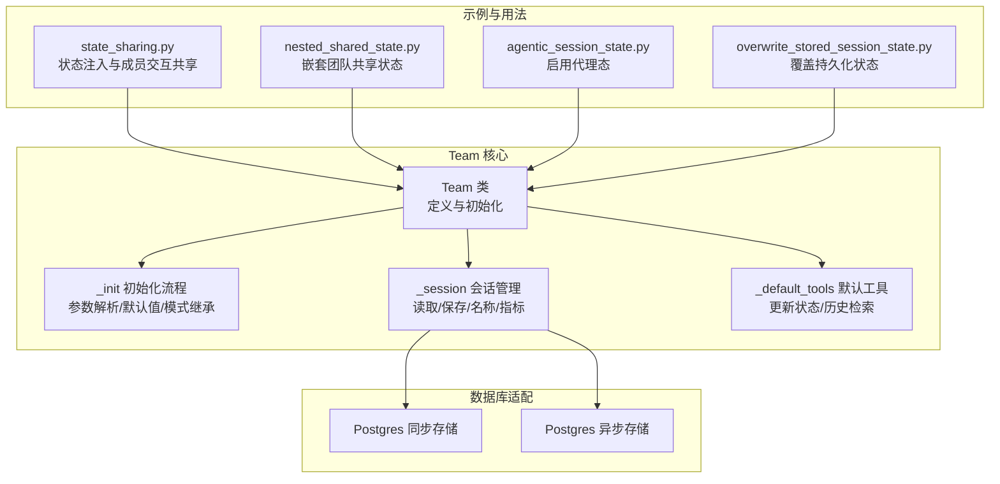
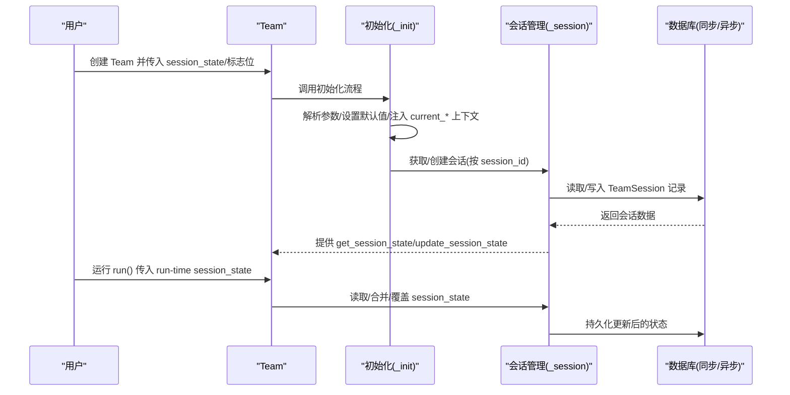
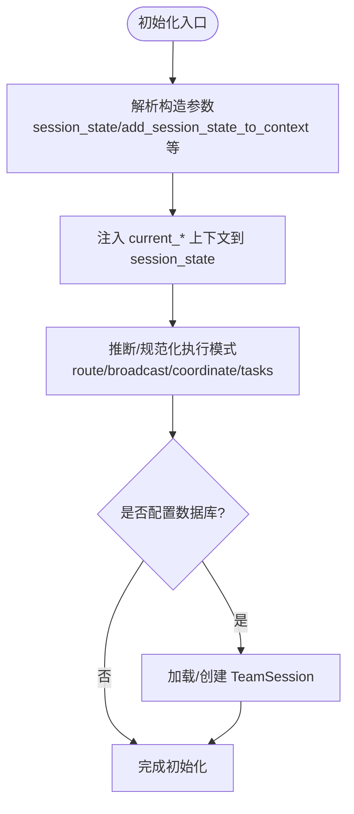
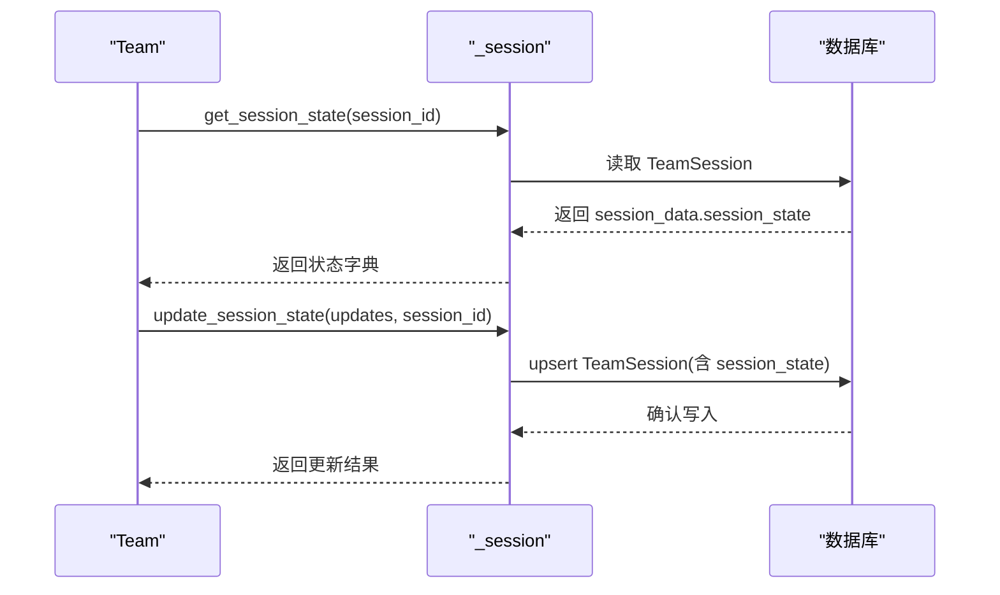
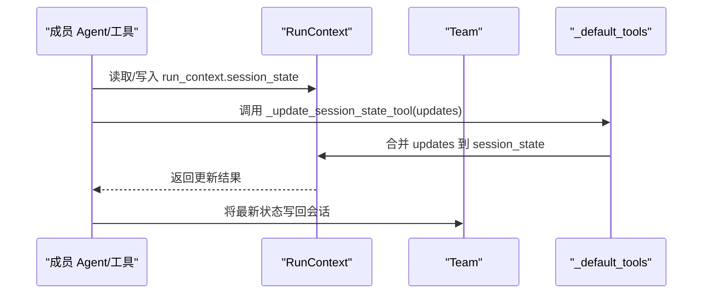
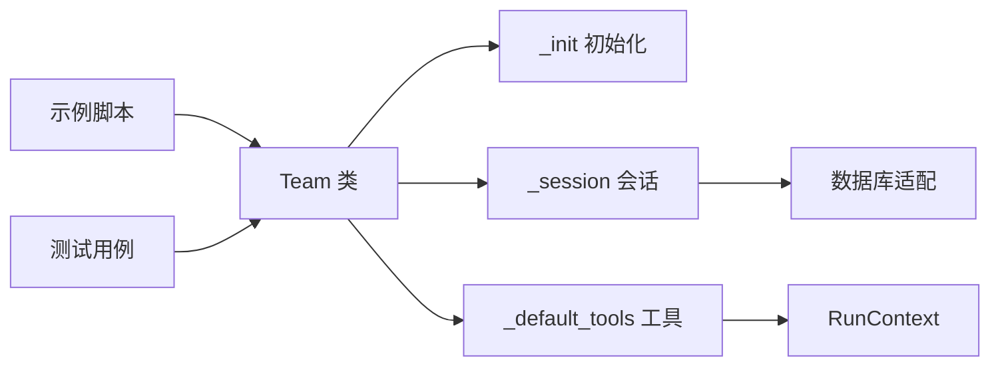

# 团队状态创建

<cite>
**本文引用的文件**
- [team.py](file://libs/agno/agno/team/team.py)
- [_init.py](file://libs/agno/agno/team/_init.py)
- [_default_tools.py](file://libs/agno/agno/team/_default_tools.py)
- [_session.py](file://libs/agno/agno/team/_session.py)
- [state_sharing.py](file://cookbook/03_teams/21_state/state_sharing.py)
- [nested_shared_state.py](file://cookbook/03_teams/21_state/nested_shared_state.py)
- [agentic_session_state.py](file://cookbook/03_teams/21_state/agentic_session_state.py)
- [overwrite_stored_session_state.py](file://cookbook/03_teams/21_state/overwrite_stored_session_state.py)
- [model_inheritance.md](file://cookbook/03_teams/14_run_control/model_inheritance.md)
- [postgres.py](file://libs/agno/agno/db/postgres/postgres.py)
- [async_postgres.py](file://libs/agno/agno/db/postgres/async_postgres.py)
- [test_session_state.py](file://libs/agno/tests/integration/teams/test_session_state.py)
</cite>

## 目录
1. [简介](#简介)
2. [项目结构](#项目结构)
3. [核心组件](#核心组件)
4. [架构总览](#架构总览)
5. [详细组件分析](#详细组件分析)
6. [依赖分析](#依赖分析)
7. [性能考量](#性能考量)
8. [故障排查指南](#故障排查指南)
9. [结论](#结论)
10. [附录](#附录)

## 简介
本文件围绕“团队状态创建”主题，系统性阐述如何在 Agno 的 Team 中完成会话状态的初始化、配置与持久化，以及状态模板的设计与使用。内容涵盖：
- 代理会话状态的创建与管理
- 状态模板（session_state）的字段定义、默认值与校验
- 状态继承与覆盖机制（父子 Team 的状态链维护）
- 具体实现示例与最佳实践
- 常见问题与解决方案

## 项目结构
与团队状态创建直接相关的代码分布在以下模块：
- Team 类与初始化逻辑：team.py、_init.py
- 会话状态读写与会话生命周期管理：_session.py
- 内置工具（更新状态、历史检索等）：_default_tools.py
- 示例与用法：cookbook/03_teams/21_state/*.py
- 数据库存储适配：postgres.py、async_postgres.py
- 测试用例：tests/integration/teams/test_session_state.py

图示来源
- [team.py:70-120](file://libs/agno/agno/team/team.py#L70-L120)
- [_init.py:61-177](file://libs/agno/agno/team/_init.py#L61-L177)
- [_session.py:43-100](file://libs/agno/agno/team/_session.py#L43-L100)
- [_default_tools.py:171-188](file://libs/agno/agno/team/_default_tools.py#L171-L188)
- [state_sharing.py:1-83](file://cookbook/03_teams/21_state/state_sharing.py#L1-L83)
- [nested_shared_state.py:1-250](file://cookbook/03_teams/21_state/nested_shared_state.py#L1-L250)
- [agentic_session_state.py:1-50](file://cookbook/03_teams/21_state/agentic_session_state.py#L1-L50)
- [overwrite_stored_session_state.py:1-42](file://cookbook/03_teams/21_state/overwrite_stored_session_state.py#L1-L42)
- [postgres.py:1040-1062](file://libs/agno/agno/db/postgres/postgres.py#L1040-L1062)
- [async_postgres.py:873-895](file://libs/agno/agno/db/postgres/async_postgres.py#L873-L895)

章节来源
- [team.py:70-120](file://libs/agno/agno/team/team.py#L70-L120)
- [_init.py:61-177](file://libs/agno/agno/team/_init.py#L61-L177)
- [_session.py:43-100](file://libs/agno/agno/team/_session.py#L43-L100)
- [_default_tools.py:171-188](file://libs/agno/agno/team/_default_tools.py#L171-L188)

## 核心组件
- Team 类：定义 session_state、add_session_state_to_context、enable_agentic_state、overwrite_db_session_state 等关键字段，并在初始化中完成参数解析与默认值设置。
- 初始化流程（_init）：负责 session_id 生成、session_state 初始化（注入 current_* 上下文）、模型继承等。
- 会话管理（_session）：提供 get_session/save_session、get_session_state/update_session_state 等接口，支持同步/异步读写。
- 默认工具（_default_tools）：内置 _update_session_state_tool，允许在运行时通过工具更新共享状态。
- 示例脚本：演示状态注入、嵌套共享、代理态、覆盖持久化等场景。

章节来源
- [team.py:117-126](file://libs/agno/agno/team/team.py#L117-L126)
- [_init.py:612-650](file://libs/agno/agno/team/_init.py#L612-L650)
- [_session.py:402-466](file://libs/agno/agno/team/_session.py#L402-L466)
- [_default_tools.py:171-188](file://libs/agno/agno/team/_default_tools.py#L171-L188)

## 架构总览
团队状态创建的端到端流程如下：

图示来源
- [team.py:411-527](file://libs/agno/agno/team/team.py#L411-L527)
- [_init.py:612-650](file://libs/agno/agno/team/_init.py#L612-L650)
- [_session.py:43-100](file://libs/agno/agno/team/_session.py#L43-L100)
- [postgres.py:1040-1062](file://libs/agno/agno/db/postgres/postgres.py#L1040-L1062)
- [async_postgres.py:873-895](file://libs/agno/agno/db/postgres/async_postgres.py#L873-L895)

## 详细组件分析

### 组件A：Team 初始化与状态注入
- 关键点
  - session_state 字段：用于承载共享状态字典
  - add_session_state_to_context：是否将 session_state 注入到系统/用户消息模板中
  - enable_agentic_state：是否启用“代理态”，允许成员工具直接更新共享状态
  - overwrite_db_session_state：是否用运行时提供的 session_state 完全覆盖已持久化的状态
  - 初始化时注入 current_session_id/current_user_id/current_run_id 到 session_state，便于上下文追踪

图示来源
- [_init.py:61-177](file://libs/agno/agno/team/_init.py#L61-L177)
- [_init.py:612-650](file://libs/agno/agno/team/_init.py#L612-L650)

章节来源
- [team.py:117-126](file://libs/agno/agno/team/team.py#L117-L126)
- [_init.py:612-650](file://libs/agno/agno/team/_init.py#L612-L650)

### 组件B：会话状态读写与持久化
- 关键点
  - get_session_state/update_session_state：同步/异步接口，支持按 session_id 读取/更新
  - save_session/asave_session：写回数据库，处理成员响应裁剪与敏感字段清理
  - 支持缓存策略（cache_session），减少重复读取
  - 数据库存储映射：TeamSession 的 team_data/session_data/summary/metadata 等字段

图示来源
- [_session.py:402-466](file://libs/agno/agno/team/_session.py#L402-L466)
- [_session.py:176-243](file://libs/agno/agno/team/_session.py#L176-L243)
- [postgres.py:1040-1062](file://libs/agno/agno/db/postgres/postgres.py#L1040-L1062)
- [async_postgres.py:873-895](file://libs/agno/agno/db/postgres/async_postgres.py#L873-L895)

章节来源
- [_session.py:402-466](file://libs/agno/agno/team/_session.py#L402-L466)
- [_session.py:176-243](file://libs/agno/agno/team/_session.py#L176-L243)

### 组件C：内置工具与状态更新
- 关键点
  - _update_session_state_tool：在运行时通过工具更新共享 session_state
  - 与 RunContext.session_state 协作，确保多成员协作时状态一致
  - 可结合 enable_agentic_state 与 add_session_state_to_context 使用

图示来源
- [_default_tools.py:171-188](file://libs/agno/agno/team/_default_tools.py#L171-L188)

章节来源
- [_default_tools.py:171-188](file://libs/agno/agno/team/_default_tools.py#L171-L188)

### 组件D：状态模板设计与使用
- 字段设计建议
  - 采用分层结构：如 shopping_list、chores 等，便于工具独立维护
  - 为每个字段提供默认值（空列表/空字典），避免 None 导致的异常
  - 对外暴露稳定键名，内部可扩展额外元数据（如时间戳、来源）
- 验证与校验
  - 在工具层对输入进行类型与范围校验（如优先级枚举）
  - 在 run() 期间通过 RunContext 保证状态一致性
- 示例参考
  - 嵌套共享状态：顶层 Team 维护共享状态，子 Team/工具直接读写
  - 状态注入：通过 add_session_state_to_context 将 session_state 注入到指令模板

章节来源
- [nested_shared_state.py:1-250](file://cookbook/03_teams/21_state/nested_shared_state.py#L1-L250)
- [state_sharing.py:1-83](file://cookbook/03_teams/21_state/state_sharing.py#L1-L83)

### 组件E：状态继承与覆盖机制
- 父子 Team 的状态链
  - 顶层 Team 持有 session_state，子 Team 通过 run_context.session_state 共享同一对象
  - 工具函数在任意层级均可直接读写顶层状态，形成“跨层级状态共享”
- 覆盖策略
  - overwrite_db_session_state=True 时，运行时提供的 session_state 将完全替换持久化状态
  - 未开启时，运行时状态与持久化状态合并（由具体实现决定）

章节来源
- [nested_shared_state.py:1-250](file://cookbook/03_teams/21_state/nested_shared_state.py#L1-L250)
- [overwrite_stored_session_state.py:1-42](file://cookbook/03_teams/21_state/overwrite_stored_session_state.py#L1-L42)

### 组件F：模型继承与状态的关系
- 模型继承不影响状态字段本身，但会影响 Team 的行为与上下文注入
- 示例展示了父 Team 的 model 如何被子 Team/成员继承，从而统一上下文格式与提示词风格

章节来源
- [model_inheritance.md:1-45](file://cookbook/03_teams/14_run_control/model_inheritance.md#L1-L45)

## 依赖分析
- Team 与初始化模块耦合度高，初始化负责参数标准化与上下文注入
- 会话管理模块依赖数据库抽象层，提供统一的读写接口
- 默认工具依赖 RunContext 与 TeamSession，实现运行时状态更新
- 示例脚本与测试用例验证状态注入、共享与覆盖的行为

图示来源
- [team.py:411-527](file://libs/agno/agno/team/team.py#L411-L527)
- [_init.py:61-177](file://libs/agno/agno/team/_init.py#L61-L177)
- [_session.py:43-100](file://libs/agno/agno/team/_session.py#L43-L100)
- [_default_tools.py:171-188](file://libs/agno/agno/team/_default_tools.py#L171-L188)

章节来源
- [team.py:411-527](file://libs/agno/agno/team/team.py#L411-L527)
- [_init.py:61-177](file://libs/agno/agno/team/_init.py#L61-L177)
- [_session.py:43-100](file://libs/agno/agno/team/_session.py#L43-L100)
- [_default_tools.py:171-188](file://libs/agno/agno/team/_default_tools.py#L171-L188)

## 性能考量
- 缓存策略：启用 cache_session 可显著降低重复读取数据库的成本
- 存储裁剪：根据 store_member_responses 等标志对成员响应进行裁剪，减少写入体积
- 异步数据库：在异步环境下使用异步存储接口，避免阻塞事件循环
- 状态大小控制：避免在 session_state 中存放过大的中间结果，必要时拆分为多个键或外部存储

## 故障排查指南
- 会话 ID 未提供
  - 现象：调用 get_session 抛出异常
  - 处理：确保传入 session_id 或在 Team 构造时设置 session_id
- 同步/异步混用错误
  - 现象：使用同步接口访问异步数据库时报错
  - 处理：改用异步接口 aget_session/asave_session
- 覆盖持久化状态
  - 现象：运行时 session_state 未生效
  - 处理：确认 overwrite_db_session_state=True，或在运行时明确传入 session_state
- 状态共享不生效
  - 现象：嵌套 Team 无法读写顶层状态
  - 处理：确保顶层 Team 设置了 session_state，并在工具函数中通过 run_context.session_state 直接访问

章节来源
- [_session.py:43-100](file://libs/agno/agno/team/_session.py#L43-L100)
- [_session.py:103-173](file://libs/agno/agno/team/_session.py#L103-L173)
- [overwrite_stored_session_state.py:1-42](file://cookbook/03_teams/21_state/overwrite_stored_session_state.py#L1-L42)
- [test_session_state.py:48-77](file://libs/agno/tests/integration/teams/test_session_state.py#L48-L77)

## 结论
团队状态创建的关键在于：清晰的状态模板设计、可靠的初始化与注入、完善的读写与持久化流程，以及在多层级 Team 场景下的共享与覆盖策略。通过示例与测试用例，可以快速落地并验证状态创建与管理的最佳实践。

## 附录

### 代码示例路径
- 状态注入与成员交互共享
  - [示例入口:66-83](file://cookbook/03_teams/21_state/state_sharing.py#L66-L83)
- 嵌套团队共享状态
  - [顶层 Team 与工具函数:169-190](file://cookbook/03_teams/21_state/nested_shared_state.py#L169-L190)
  - [工具函数读写状态:20-104](file://cookbook/03_teams/21_state/nested_shared_state.py#L20-L104)
- 代理态启用
  - [启用代理态与上下文注入:21-41](file://cookbook/03_teams/21_state/agentic_session_state.py#L21-L41)
- 覆盖持久化状态
  - [覆盖开关与运行时传参:15-34](file://cookbook/03_teams/21_state/overwrite_stored_session_state.py#L15-L34)

### 最佳实践
- 命名规范
  - 状态键使用语义化小驼峰或下划线风格，保持团队内一致
- 字段设计
  - 为每个字段提供合理默认值；对外暴露稳定键名，内部可扩展
- 性能考虑
  - 控制 session_state 体量；启用缓存与裁剪；优先使用异步接口
- 安全与一致性
  - 在工具层做输入校验；通过 RunContext 保证并发安全