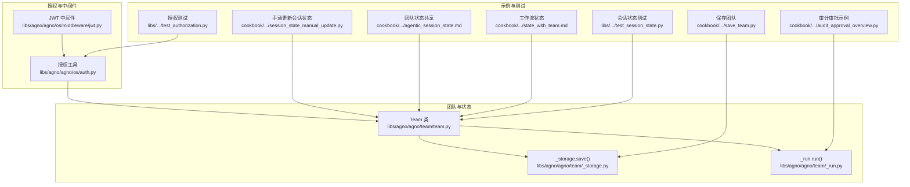
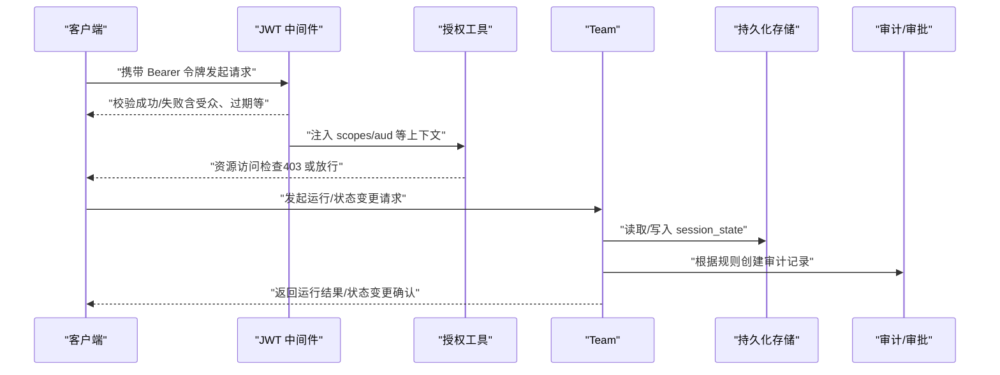
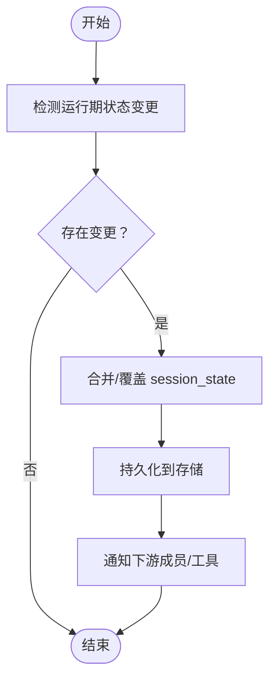
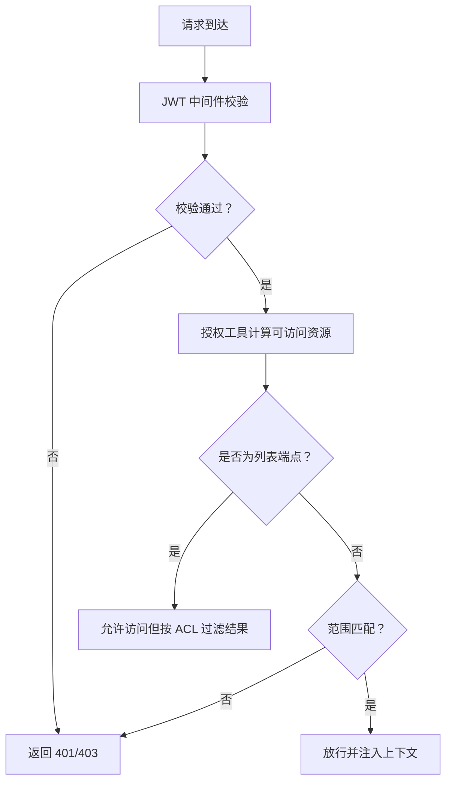
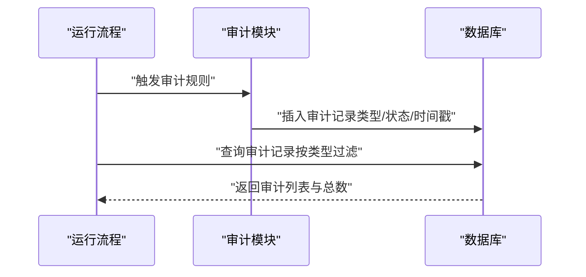
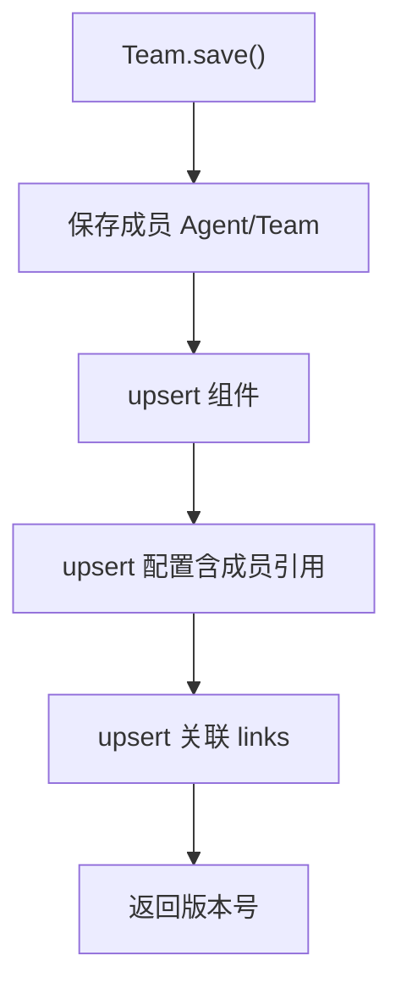
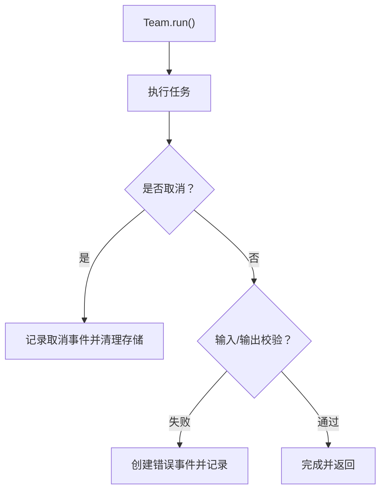
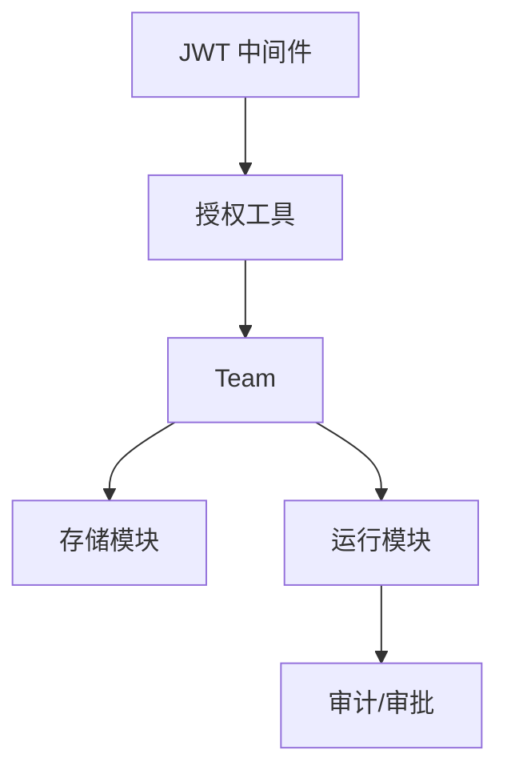

# 团队状态变更控制

<cite>
**本文档引用的文件**
- [libs/agno/agno/os/auth.py](file://libs/agno/agno/os/auth.py)
- [libs/agno/agno/os/middleware/jwt.py](file://libs/agno/agno/os/middleware/jwt.py)
- [libs/agno/agno/team/team.py](file://libs/agno/agno/team/team.py)
- [libs/agno/agno/team/_storage.py](file://libs/agno/agno/team/_storage.py)
- [libs/agno/agno/team/_run.py](file://libs/agno/agno/team/_run.py)
- [libs/agno/tests/integration/os/test_authorization.py](file://libs/agno/tests/integration/os/test_authorization.py)
- [libs/agno/tests/integration/teams/test_session_state.py](file://libs/agno/tests/integration/teams/test_session_state.py)
- [cookbook/02_agents/05_state_and_session/session_state_manual_update.py](file://cookbook/02_agents/05_state_and_session/session_state_manual_update.py)
- [cookbook/02_agents/11_approvals/audit_approval_overview.py](file://cookbook/02_agents/11_approvals/audit_approval_overview.py)
- [cookbook/03_teams/21_state/agentic_session_state.md](file://cookbook/03_teams/21_state/agentic_session_state.md)
- [cookbook/04_workflows/06_advanced_concepts/session_state/state_with_team.md](file://cookbook/04_workflows/06_advanced_concepts/session_state/state_with_team.md)
- [cookbook/93_components/save_team.py](file://cookbook/93_components/save_team.py)
- [cookbook/93_components/save_team.md](file://cookbook/93_components/save_team.md)
- [cookbook/05_agent_os/rbac/README.md](file://cookbook/05_agent_os/rbac/README.md)
</cite>

## 目录
1. [简介](#简介)
2. [项目结构](#项目结构)
3. [核心组件](#核心组件)
4. [架构总览](#架构总览)
5. [详细组件分析](#详细组件分析)
6. [依赖分析](#依赖分析)
7. [性能考量](#性能考量)
8. [故障排查指南](#故障排查指南)
9. [结论](#结论)
10. [附录](#附录)

## 简介
本文件围绕“团队状态变更控制”主题，系统性梳理并说明以下方面：
- 状态变更的触发机制：运行时状态变更与存储状态覆盖
- 权限控制：变更者身份认证、权限验证与访问控制列表
- 审计日志：变更记录、时间戳与操作追踪
- 安全考虑：数据完整性保护、防篡改机制与备份恢复
- 监控与异常处理：运行期监控与异常捕获策略

本说明以仓库中的授权中间件、RBAC 规则、团队状态管理与持久化、审批与审计等模块为依据，结合示例代码路径进行讲解。

## 项目结构
与“团队状态变更控制”直接相关的核心目录与文件：
- 授权与中间件：JWT 中间件、资源访问检查、审批依赖
- 团队与状态：Team 类的状态字段、运行控制、存储与持久化
- 示例与测试：状态手动更新、会话状态共享、权限校验、审计审批

**图表来源**
- [libs/agno/agno/os/middleware/jwt.py:780-868](file://libs/agno/agno/os/middleware/jwt.py#L780-L868)
- [libs/agno/agno/os/auth.py:272-329](file://libs/agno/agno/os/auth.py#L272-L329)
- [libs/agno/agno/team/team.py:114-127](file://libs/agno/agno/team/team.py#L114-L127)
- [libs/agno/agno/team/_storage.py:1008-1047](file://libs/agno/agno/team/_storage.py#L1008-L1047)
- [libs/agno/agno/team/_run.py:3036-3068](file://libs/agno/agno/team/_run.py#L3036-L3068)

**章节来源**
- [libs/agno/agno/os/middleware/jwt.py:780-868](file://libs/agno/agno/os/middleware/jwt.py#L780-L868)
- [libs/agno/agno/os/auth.py:272-329](file://libs/agno/agno/os/auth.py#L272-L329)
- [libs/agno/agno/team/team.py:114-127](file://libs/agno/agno/team/team.py#L114-L127)
- [libs/agno/agno/team/_storage.py:1008-1047](file://libs/agno/agno/team/_storage.py#L1008-L1047)
- [libs/agno/agno/team/_run.py:3036-3068](file://libs/agno/agno/team/_run.py#L3036-L3068)

## 核心组件
- 授权与中间件
  - JWT 中间件负责令牌提取、解码、受众校验、过期处理与范围检查；对列表型端点进行“允许但过滤”的特殊处理。
  - 授权工具提供资源访问检查、可访问资源集合获取、依赖注入式权限校验与审批阻断。
- 团队与状态
  - Team 类维护 session_state、是否启用 agentic 状态、是否覆盖存储状态等关键字段。
  - _storage.save() 实现团队与成员的级联持久化，_run.run() 处理运行期事件与错误。
- 示例与测试
  - 手动更新会话状态示例展示运行时状态变更与存储同步。
  - 团队状态共享示例展示 Team 与成员共享同一数据库并同步状态。
  - 审计审批示例展示运行期自动创建审计记录。
  - 授权测试验证不同 scope 对资源访问的影响。

**章节来源**
- [libs/agno/agno/os/middleware/jwt.py:780-868](file://libs/agno/agno/os/middleware/jwt.py#L780-L868)
- [libs/agno/agno/os/auth.py:148-270](file://libs/agno/agno/os/auth.py#L148-L270)
- [libs/agno/agno/team/team.py:114-127](file://libs/agno/agno/team/team.py#L114-L127)
- [libs/agno/agno/team/_storage.py:1008-1047](file://libs/agno/agno/team/_storage.py#L1008-L1047)
- [libs/agno/agno/team/_run.py:3036-3068](file://libs/agno/agno/team/_run.py#L3036-L3068)
- [cookbook/02_agents/05_state_and_session/session_state_manual_update.py:1-52](file://cookbook/02_agents/05_state_and_session/session_state_manual_update.py#L1-L52)
- [cookbook/03_teams/21_state/agentic_session_state.md:41-82](file://cookbook/03_teams/21_state/agentic_session_state.md#L41-L82)
- [cookbook/02_agents/11_approvals/audit_approval_overview.py:152-177](file://cookbook/02_agents/11_approvals/audit_approval_overview.py#L152-L177)
- [libs/agno/tests/integration/os/test_authorization.py:1122-1290](file://libs/agno/tests/integration/os/test_authorization.py#L1122-L1290)

## 架构总览
下图展示了“团队状态变更控制”的整体交互：客户端经由 JWT 中间件与授权工具进行身份与权限校验，随后进入 Team 运行流程；运行过程中可能触发状态变更与持久化，同时产生审计记录。

**图表来源**
- [libs/agno/agno/os/middleware/jwt.py:780-868](file://libs/agno/agno/os/middleware/jwt.py#L780-L868)
- [libs/agno/agno/os/auth.py:272-329](file://libs/agno/agno/os/auth.py#L272-L329)
- [libs/agno/agno/team/team.py:114-127](file://libs/agno/agno/team/team.py#L114-L127)
- [libs/agno/agno/team/_run.py:3036-3068](file://libs/agno/agno/team/_run.py#L3036-L3068)

## 详细组件分析

### 状态变更触发机制
- 运行时状态变更
  - 通过工具函数或成员代理在运行期修改 session_state，并调用更新接口写回存储，确保后续运行使用最新状态。
  - 示例：手动更新会话状态示例展示了在 Agent 运行后，通过获取当前状态、追加值、再写回的方式实现运行时变更。
- 存储状态覆盖
  - Team 提供覆盖标志位，可在运行时选择将传入的 session_state 覆盖存储中的状态，实现“存储状态覆盖”。

**图表来源**
- [cookbook/02_agents/05_state_and_session/session_state_manual_update.py:14-51](file://cookbook/02_agents/05_state_and_session/session_state_manual_update.py#L14-L51)
- [libs/agno/agno/team/team.py:114-127](file://libs/agno/agno/team/team.py#L114-L127)

**章节来源**
- [cookbook/02_agents/05_state_and_session/session_state_manual_update.py:1-52](file://cookbook/02_agents/05_state_and_session/session_state_manual_update.py#L1-L52)
- [libs/agno/agno/team/team.py:114-127](file://libs/agno/agno/team/team.py#L114-L127)

### 权限控制与访问控制列表
- 身份认证与令牌校验
  - JWT 中间件负责从请求头或 Cookie 提取令牌，校验受众（aud）、过期时间与签名算法，失败时返回相应错误。
- 权限验证与资源过滤
  - 授权工具提供资源访问检查与可访问资源集合计算；对 GET 列表端点采用“允许但过滤”的策略，POST 运行端点进行严格范围匹配。
- 访问控制列表
  - 可访问资源集合由用户 scopes 推导，支持全局资源范围、通配符与管理员范围，形成最终的 ACL。

**图表来源**
- [libs/agno/agno/os/middleware/jwt.py:780-868](file://libs/agno/agno/os/middleware/jwt.py#L780-L868)
- [libs/agno/agno/os/auth.py:148-270](file://libs/agno/agno/os/auth.py#L148-L270)

**章节来源**
- [libs/agno/agno/os/middleware/jwt.py:780-868](file://libs/agno/agno/os/middleware/jwt.py#L780-L868)
- [libs/agno/agno/os/auth.py:148-270](file://libs/agno/agno/os/auth.py#L148-L270)
- [libs/agno/tests/integration/os/test_authorization.py:1122-1290](file://libs/agno/tests/integration/os/test_authorization.py#L1122-L1290)

### 审计日志与操作追踪
- 审计记录创建
  - 在运行期根据规则自动创建审计记录，记录审批类型、状态与时间戳，便于后续查询与核验。
- 查询与分离
  - 支持按审批类型过滤查询，实现“必需审批”与“审计记录”的分离，保证审计数据的独立性与可追溯性。

**图表来源**
- [cookbook/02_agents/11_approvals/audit_approval_overview.py:152-177](file://cookbook/02_agents/11_approvals/audit_approval_overview.py#L152-L177)

**章节来源**
- [cookbook/02_agents/11_approvals/audit_approval_overview.py:152-177](file://cookbook/02_agents/11_approvals/audit_approval_overview.py#L152-L177)

### 团队状态共享与持久化
- 状态共享
  - Team 与成员共享同一数据库实例，状态通过数据库同步，确保跨成员的一致性。
- 级联保存
  - 保存团队时，先保存成员（Agent 或嵌套 Team），再保存团队组件与配置，并建立 Team→成员的关联关系。

**图表来源**
- [libs/agno/agno/team/_storage.py:1008-1047](file://libs/agno/agno/team/_storage.py#L1008-L1047)
- [cookbook/93_components/save_team.md:44-77](file://cookbook/93_components/save_team.md#L44-L77)

**章节来源**
- [libs/agno/agno/team/_storage.py:1008-1047](file://libs/agno/agno/team/_storage.py#L1008-L1047)
- [cookbook/93_components/save_team.py:49-63](file://cookbook/93_components/save_team.py#L49-L63)
- [cookbook/93_components/save_team.md:44-77](file://cookbook/93_components/save_team.md#L44-L77)

### 运行期监控与异常处理
- 运行期事件
  - Team 运行流程捕获取消、输入/输出校验失败等异常，生成运行事件并写入运行响应，便于监控与排障。
- 错误事件
  - 将错误事件附加到运行响应中，包含错误类型、ID 与附加数据，确保可观测性。

**图表来源**
- [libs/agno/agno/team/_run.py:3036-3068](file://libs/agno/agno/team/_run.py#L3036-L3068)

**章节来源**
- [libs/agno/agno/team/_run.py:3036-3068](file://libs/agno/agno/team/_run.py#L3036-L3068)

## 依赖分析
- 组件耦合
  - JWT 中间件与授权工具紧密协作，前者负责令牌与受众校验，后者负责范围解析与资源过滤。
  - Team 依赖存储模块进行状态持久化，运行模块负责事件与错误处理。
- 外部依赖
  - 数据库适配器（如 SQLite、PostgreSQL）用于会话与配置的持久化。
  - 审计/审批模块提供审计记录与审批阻断能力。

**图表来源**
- [libs/agno/agno/os/middleware/jwt.py:780-868](file://libs/agno/agno/os/middleware/jwt.py#L780-L868)
- [libs/agno/agno/os/auth.py:272-329](file://libs/agno/agno/os/auth.py#L272-L329)
- [libs/agno/agno/team/team.py:114-127](file://libs/agno/agno/team/team.py#L114-L127)
- [libs/agno/agno/team/_run.py:3036-3068](file://libs/agno/agno/team/_run.py#L3036-L3068)

**章节来源**
- [libs/agno/agno/os/middleware/jwt.py:780-868](file://libs/agno/agno/os/middleware/jwt.py#L780-L868)
- [libs/agno/agno/os/auth.py:272-329](file://libs/agno/agno/os/auth.py#L272-L329)
- [libs/agno/agno/team/team.py:114-127](file://libs/agno/agno/team/team.py#L114-L127)
- [libs/agno/agno/team/_run.py:3036-3068](file://libs/agno/agno/team/_run.py#L3036-L3068)

## 性能考量
- 状态读写
  - 通过数据库统一管理 session_state，避免重复内存拷贝；合理使用缓存开关以平衡一致性与性能。
- 权限检查
  - 列表端点采用“允许但过滤”，减少鉴权失败导致的网络往返；对通配符与管理员范围进行快速判定。
- 持久化
  - 级联保存时批量 upsert 组件与配置，减少事务次数；建立关联关系时使用最小必要字段。

[本节为通用指导，无需特定文件来源]

## 故障排查指南
- 401 未授权
  - 检查令牌缺失、过期、签名无效或受众不匹配。
- 403 禁止访问
  - 检查用户 scopes 是否满足端点要求；确认资源 ID 是否在可访问集合内。
- 列表为空
  - 用户可能具备全局读权限但无具体资源访问权限，导致过滤后为空。
- 审计记录缺失
  - 确认运行期是否触发审计规则；检查数据库查询是否按类型过滤。

**章节来源**
- [libs/agno/agno/os/middleware/jwt.py:828-851](file://libs/agno/agno/os/middleware/jwt.py#L828-L851)
- [libs/agno/tests/integration/os/test_authorization.py:1122-1290](file://libs/agno/tests/integration/os/test_authorization.py#L1122-L1290)
- [cookbook/02_agents/11_approvals/audit_approval_overview.py:152-177](file://cookbook/02_agents/11_approvals/audit_approval_overview.py#L152-L177)

## 结论
本文件基于仓库现有实现，系统阐述了团队状态变更控制的触发机制、权限控制、审计日志与安全考虑，并提供了相应的可视化与示例路径指引。建议在生产环境中：
- 使用 RS256 非对称密钥与严格的受众校验；
- 通过 RBAC 精细化控制资源访问；
- 在运行期启用审计与审批机制；
- 对状态变更进行必要的备份与回滚策略。

[本节为总结性内容，无需特定文件来源]

## 附录
- 示例与测试参考
  - 手动更新会话状态：[示例路径:1-52](file://cookbook/02_agents/05_state_and_session/session_state_manual_update.py#L1-L52)
  - 团队状态共享：[示例路径:41-82](file://cookbook/03_teams/21_state/agentic_session_state.md#L41-L82)
  - 工作流状态：[示例路径:44-91](file://cookbook/04_workflows/06_advanced_concepts/session_state/state_with_team.md#L44-L91)
  - 保存团队：[示例路径:49-63](file://cookbook/93_components/save_team.py#L49-L63)
  - 授权测试：[测试路径:1122-1290](file://libs/agno/tests/integration/os/test_authorization.py#L1122-L1290)
  - 会话状态测试：[测试路径:300-328](file://libs/agno/tests/integration/teams/test_session_state.py#L300-L328)
  - RBAC 文档：[文档路径:1-348](file://cookbook/05_agent_os/rbac/README.md#L1-L348)

[本节为补充材料，无需特定文件来源]