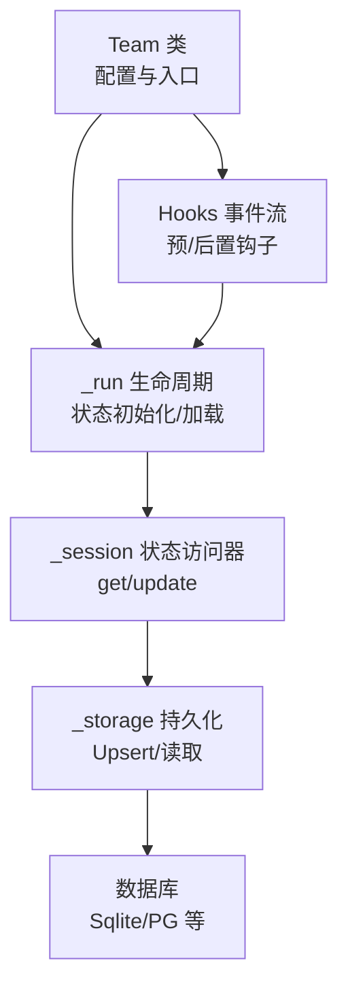
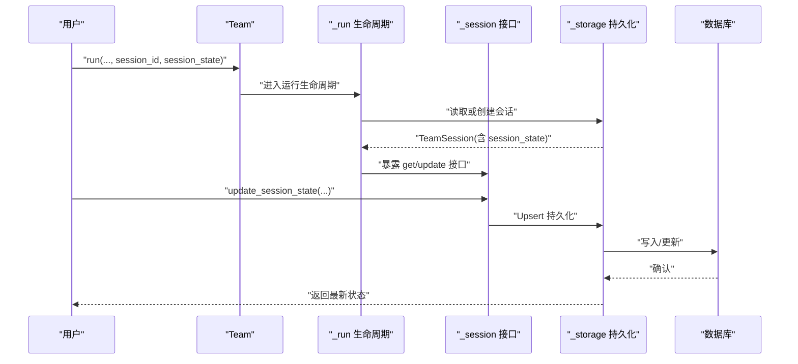
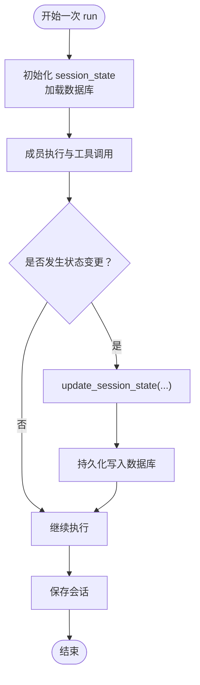
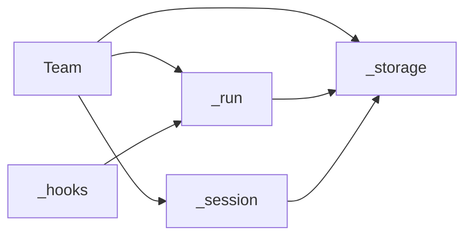

# 团队状态同步

<cite>
**本文档引用的文件**
- [libs/agno/agno/team/_session.py](file://libs/agno/agno/team/_session.py)
- [libs/agno/agno/team/team.py](file://libs/agno/agno/team/team.py)
- [libs/agno/agno/team/_run.py](file://libs/agno/agno/team/_run.py)
- [libs/agno/agno/team/_storage.py](file://libs/agno/agno/team/_storage.py)
- [libs/agno/tests/integration/teams/test_session_state.py](file://libs/agno/tests/integration/teams/test_session_state.py)
- [libs/agno/tests/integration/teams/test_team_convenience_functions.py](file://libs/agno/tests/integration/teams/test_team_convenience_functions.py)
- [cookbook/03_teams/21_state/state_sharing.md](file://cookbook/03_teams/21_state/state_sharing.md)
- [cookbook/03_teams/21_state/agentic_session_state.md](file://cookbook/03_teams/21_state/agentic_session_state.md)
- [cookbook/02_agents/05_state_and_session/session_state_manual_update.md](file://cookbook/02_agents/05_state_and_session/session_state_manual_update.md)
- [cookbook/02_agents/05_state_and_session/session_state_manual_update.py](file://cookbook/02_agents/05_state_and_session/session_state_manual_update.py)
- [libs/agno/tests/integration/teams/test_event_streaming.py](file://libs/agno/tests/integration/teams/test_event_streaming.py)
- [libs/agno/agno/team/_hooks.py](file://libs/agno/agno/team/_hooks.py)
- [libs/agno/tests/integration/teams/test_memory_impact.py](file://libs/agno/tests/integration/teams/test_memory_impact.py)
- [libs/agno/agno/team/_utils.py](file://libs/agno/agno/team/_utils.py)
</cite>

## 目录
1. [简介](#简介)
2. [项目结构](#项目结构)
3. [核心组件](#核心组件)
4. [架构总览](#架构总览)
5. [详细组件分析](#详细组件分析)
6. [依赖分析](#依赖分析)
7. [性能考虑](#性能考虑)
8. [故障排查指南](#故障排查指南)
9. [结论](#结论)
10. [附录](#附录)

## 简介
本文件聚焦于“团队状态同步”能力，系统性阐述团队成员之间状态共享的机制、传播路径与同步策略，覆盖手动同步、自动同步与事件驱动同步的触发条件，并给出冲突检测与解决思路（类型识别、优先级与合并策略）。同时提供可定位的代码示例路径，解释增量同步、批量处理与缓存策略的实践方式，并给出监控与调试方法，帮助读者在真实工程中落地该能力。

## 项目结构
围绕团队状态同步，相关代码主要分布在以下模块：
- 团队会话与状态管理：team/_session.py
- 团队主类与配置：team/team.py
- 运行生命周期与状态初始化：team/_run.py
- 存储与会话持久化：team/_storage.py
- 示例与测试：cookbook 与 tests 目录下的相关文件

图表来源
- [libs/agno/agno/team/team.py:70-200](file://libs/agno/agno/team/team.py#L70-L200)
- [libs/agno/agno/team/_run.py:125-172](file://libs/agno/agno/team/_run.py#L125-L172)
- [libs/agno/agno/team/_session.py:402-466](file://libs/agno/agno/team/_session.py#L402-L466)
- [libs/agno/agno/team/_storage.py:322-355](file://libs/agno/agno/team/_storage.py#L322-L355)

章节来源
- [libs/agno/agno/team/team.py:70-200](file://libs/agno/agno/team/team.py#L70-L200)
- [libs/agno/agno/team/_run.py:125-172](file://libs/agno/agno/team/_run.py#L125-L172)
- [libs/agno/agno/team/_session.py:402-466](file://libs/agno/agno/team/_session.py#L402-L466)
- [libs/agno/agno/team/_storage.py:322-355](file://libs/agno/agno/team/_storage.py#L322-L355)

## 核心组件
- 会话状态读写接口
  - 同步/异步获取：get_session_state、aget_session_state
  - 同步/异步更新：update_session_state、aupdate_session_state
- 会话读取与保存
  - 同步/异步读取：get_session、aget_session
  - 同步/异步保存：save_session、asave_session
- 会话名称与指标
  - 名称生成/设置：generate_session_name、set_session_name、aset_session_name、get_session_name、aget_session_name
  - 指标聚合：update_session_metrics、get_session_metrics、aget_session_metrics
- 生命周期与状态初始化
  - 初始化与加载：_asetup_session、_initialize_session_state、_load_session_state
- 存储与缓存
  - Upsert 与读取：_upsert_session、_read_or_create_session、_load_session_state
  - 缓存开关：cache_session

章节来源
- [libs/agno/agno/team/_session.py:402-466](file://libs/agno/agno/team/_session.py#L402-L466)
- [libs/agno/agno/team/_session.py:473-501](file://libs/agno/agno/team/_session.py#L473-L501)
- [libs/agno/agno/team/_run.py:125-172](file://libs/agno/agno/team/_run.py#L125-L172)
- [libs/agno/agno/team/_storage.py:322-355](file://libs/agno/agno/team/_storage.py#L322-L355)

## 架构总览
团队状态同步贯穿“运行生命周期—会话状态—存储—事件流”的链路。运行开始时，系统根据 session_id 读取或创建会话，加载数据库中的 session_state 并注入上下文；成员执行期间可通过工具或接口更新状态；最终在保存阶段将变更持久化。

图表来源
- [libs/agno/agno/team/_run.py:125-172](file://libs/agno/agno/team/_run.py#L125-L172)
- [libs/agno/agno/team/_session.py:402-466](file://libs/agno/agno/team/_session.py#L402-L466)
- [libs/agno/agno/team/_storage.py:322-355](file://libs/agno/agno/team/_storage.py#L322-L355)

## 详细组件分析

### 1) 状态传播与同步策略
- 手动同步
  - 通过工具或直接调用 update_session_state/aupdate_session_state 触发，立即写入数据库并返回最新状态。
  - 示例路径：[cookbook/02_agents/05_state_and_session/session_state_manual_update.py:1-52](file://cookbook/02_agents/05_state_and_session/session_state_manual_update.py#L1-L52)
- 自动同步
  - 在 run 生命周期内，系统在初始化阶段加载 session_state，并在每次 run 结束保存时写回数据库，实现跨 run 的自动同步。
  - 关键流程参考：[libs/agno/agno/team/_run.py:125-172](file://libs/agno/agno/team/_run.py#L125-L172)、[libs/agno/agno/team/_storage.py:322-355](file://libs/agno/agno/team/_storage.py#L322-L355)
- 事件驱动同步
  - 通过 hooks（如预/后置钩子）在运行过程中对状态进行调整，随后触发保存。
  - 参考：[libs/agno/agno/team/_hooks.py:379-412](file://libs/agno/agno/team/_hooks.py#L379-L412)、[libs/agno/tests/integration/teams/test_event_streaming.py:364-521](file://libs/agno/tests/integration/teams/test_event_streaming.py#L364-L521)

图表来源
- [libs/agno/agno/team/_run.py:125-172](file://libs/agno/agno/team/_run.py#L125-L172)
- [libs/agno/agno/team/_session.py:430-466](file://libs/agno/agno/team/_session.py#L430-L466)
- [libs/agno/agno/team/_storage.py:322-355](file://libs/agno/agno/team/_storage.py#L322-L355)

章节来源
- [libs/agno/agno/team/_session.py:402-466](file://libs/agno/agno/team/_session.py#L402-L466)
- [libs/agno/agno/team/_run.py:125-172](file://libs/agno/agno/team/_run.py#L125-L172)
- [libs/agno/agno/team/_storage.py:322-355](file://libs/agno/agno/team/_storage.py#L322-L355)
- [libs/agno/tests/integration/teams/test_event_streaming.py:364-521](file://libs/agno/tests/integration/teams/test_event_streaming.py#L364-L521)

### 2) 状态共享配置与传播范围
- 占位符注入：通过 add_session_state_to_context 将 session_state 注入成员指令模板，实现“上下文态”共享。
- 成员交互共享：通过 share_member_interactions 在当前 run 内让后续成员看到前序成员的对话，实现“交互态”共享。
- 示例路径：
  - [cookbook/03_teams/21_state/state_sharing.md:1-45](file://cookbook/03_teams/21_state/state_sharing.md#L1-L45)
  - [cookbook/03_teams/21_state/agentic_session_state.md:41-82](file://cookbook/03_teams/21_state/agentic_session_state.md#L41-L82)

章节来源
- [cookbook/03_teams/21_state/state_sharing.md:1-45](file://cookbook/03_teams/21_state/state_sharing.md#L1-L45)
- [cookbook/03_teams/21_state/agentic_session_state.md:41-82](file://cookbook/03_teams/21_state/agentic_session_state.md#L41-L82)

### 3) 冲突检测与解决
- 冲突类型识别
  - 并发写冲突：多成员/多用户在同一 session_id 上并发更新，可能产生覆盖或丢失。
  - 语义冲突：不同成员对同一字段采用不同语义（如计数与列表），导致合并歧义。
- 优先级规则
  - 建议按“时间戳优先 + 字段粒度优先”：以最后写入为准，针对可合并字段（如数组/字典）采用合并策略。
- 合并策略
  - 字典：深度合并（保留非冲突键，冲突键按优先级覆盖）。
  - 数组：去重合并或顺序合并，避免重复。
  - 原子字段：严格覆盖，禁止合并。
- 实践建议
  - 引入“预期版本号/ETag”字段，在写入时校验一致性，失败则重试或报错。
  - 对高冲突场景启用“写入队列/事务”保证原子性。

[本节为通用设计建议，不直接分析具体文件，故无章节来源]

### 4) 代码示例路径
- 手动更新状态（Agent）：[cookbook/02_agents/05_state_and_session/session_state_manual_update.py:1-52](file://cookbook/02_agents/05_state_and_session/session_state_manual_update.py#L1-L52)
- 团队状态更新（测试）：[libs/agno/tests/integration/teams/test_team_convenience_functions.py:235-261](file://libs/agno/tests/integration/teams/test_team_convenience_functions.py#L235-L261)
- 会话状态切换（测试）：[libs/agno/tests/integration/teams/test_session_state.py:48-77](file://libs/agno/tests/integration/teams/test_session_state.py#L48-L77)

章节来源
- [cookbook/02_agents/05_state_and_session/session_state_manual_update.py:1-52](file://cookbook/02_agents/05_state_and_session/session_state_manual_update.py#L1-L52)
- [libs/agno/tests/integration/teams/test_team_convenience_functions.py:235-261](file://libs/agno/tests/integration/teams/test_team_convenience_functions.py#L235-L261)
- [libs/agno/tests/integration/teams/test_session_state.py:48-77](file://libs/agno/tests/integration/teams/test_session_state.py#L48-L77)

## 依赖分析
- 组件耦合
  - Team 通过 _run 负责状态初始化与加载；_session 提供统一的状态读写接口；_storage 负责持久化；hooks 提供事件扩展。
- 外部依赖
  - 数据库抽象（BaseDb/AsyncBaseDb）支持多种后端（SQLite、PostgreSQL 等）。
- 循环依赖
  - 模块间通过函数委派避免循环导入，耦合度低、内聚性强。

图表来源
- [libs/agno/agno/team/team.py:70-200](file://libs/agno/agno/team/team.py#L70-L200)
- [libs/agno/agno/team/_run.py:125-172](file://libs/agno/agno/team/_run.py#L125-L172)
- [libs/agno/agno/team/_session.py:402-466](file://libs/agno/agno/team/_session.py#L402-L466)
- [libs/agno/agno/team/_storage.py:322-355](file://libs/agno/agno/team/_storage.py#L322-L355)
- [libs/agno/agno/team/_hooks.py:379-412](file://libs/agno/agno/team/_hooks.py#L379-L412)

章节来源
- [libs/agno/agno/team/team.py:70-200](file://libs/agno/agno/team/team.py#L70-L200)
- [libs/agno/agno/team/_run.py:125-172](file://libs/agno/agno/team/_run.py#L125-L172)
- [libs/agno/agno/team/_session.py:402-466](file://libs/agno/agno/team/_session.py#L402-L466)
- [libs/agno/agno/team/_storage.py:322-355](file://libs/agno/agno/team/_storage.py#L322-L355)
- [libs/agno/agno/team/_hooks.py:379-412](file://libs/agno/agno/team/_hooks.py#L379-L412)

## 性能考虑
- 增量同步
  - 仅在状态发生变更时触发更新，避免无谓写入。
  - 可引入“脏标记”或浅拷贝比较，减少不必要的持久化。
- 批量处理
  - 多 run 或多用户并发场景下，合并多次小更新为批量写入，降低 IO 压力。
- 缓存策略
  - 开启 cache_session 减少重复读取；注意失效与一致性。
  - 内存缓存与数据库双写，写入成功后再刷新缓存。
- 资源隔离与复制
  - 使用深拷贝隔离可变状态，避免共享资源竞争。
  - 参考：[libs/agno/agno/team/_utils.py:114-148](file://libs/agno/agno/team/_utils.py#L114-L148)

章节来源
- [libs/agno/agno/team/_utils.py:114-148](file://libs/agno/agno/team/_utils.py#L114-L148)
- [libs/agno/tests/integration/teams/test_memory_impact.py:164-223](file://libs/agno/tests/integration/teams/test_memory_impact.py#L164-L223)

## 故障排查指南
- 常见问题
  - 会话未设置：调用 get_session_state/aupdate_session_state 前需确保 session_id 已设定。
  - 数据库类型不匹配：同步/异步混用会抛出异常，需按数据库类型选择对应接口。
  - 并发覆盖：多用户/多线程写入可能导致覆盖，建议引入版本号或串行化。
- 调试方法
  - 使用 debug_mode 输出系统消息与上下文变量解析结果，验证 session_state 注入是否正确。
  - 通过事件流（stream_events）观察 hooks 与 run 生命周期事件，定位状态变更时机。
  - 参考示例：
    - [cookbook/02_agents/05_state_and_session/session_state_manual_update.md:88-90](file://cookbook/02_agents/05_state_and_session/session_state_manual_update.md#L88-L90)
    - [libs/agno/tests/integration/teams/test_event_streaming.py:364-521](file://libs/agno/tests/integration/teams/test_event_streaming.py#L364-L521)

章节来源
- [libs/agno/agno/team/_session.py:402-466](file://libs/agno/agno/team/_session.py#L402-L466)
- [libs/agno/tests/integration/teams/test_event_streaming.py:364-521](file://libs/agno/tests/integration/teams/test_event_streaming.py#L364-L521)
- [cookbook/02_agents/05_state_and_session/session_state_manual_update.md:88-90](file://cookbook/02_agents/05_state_and_session/session_state_manual_update.md#L88-L90)

## 结论
团队状态同步通过“运行生命周期—状态接口—存储持久化—事件扩展”的闭环实现，既支持手动、自动与事件驱动三种触发方式，又能在多成员/多用户场景下保持一致性与可观测性。结合增量同步、批量处理与缓存策略，可在保证正确性的前提下显著提升性能；配合事件流与调试手段，可快速定位问题并优化体验。

## 附录
- 相关配置要点
  - enable_agentic_state：允许成员动态更新状态
  - add_session_state_to_context：将状态注入成员指令
  - share_member_interactions：共享当前 run 的成员交互
  - cache_session：缓存当前会话以加速读取
- 参考文件
  - [libs/agno/agno/team/team.py:114-140](file://libs/agno/agno/team/team.py#L114-L140)

章节来源
- [libs/agno/agno/team/team.py:114-140](file://libs/agno/agno/team/team.py#L114-L140)