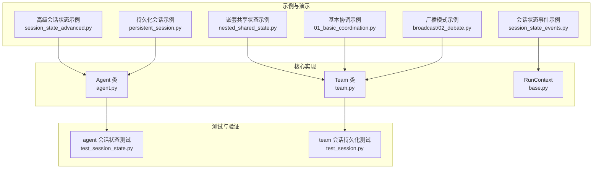
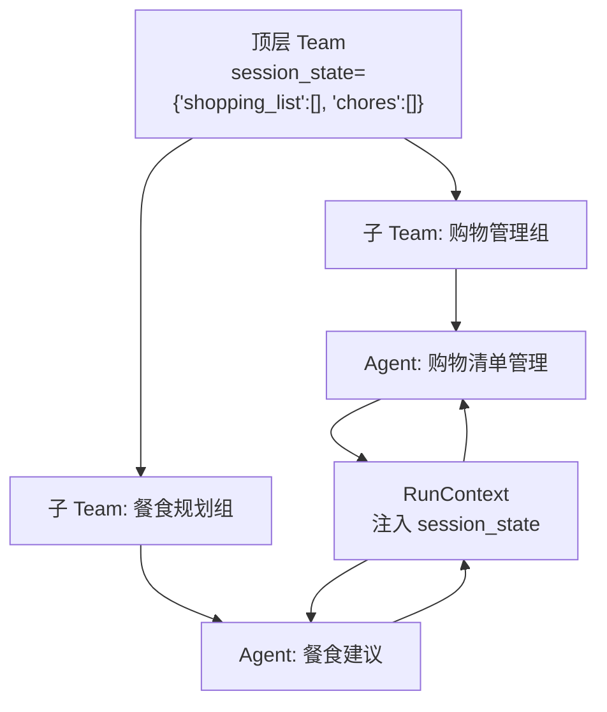
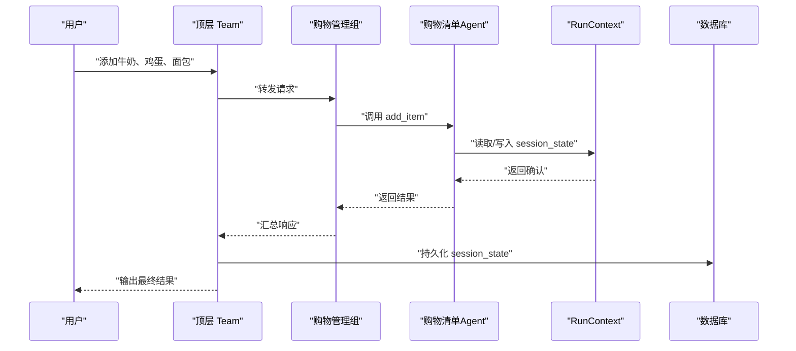
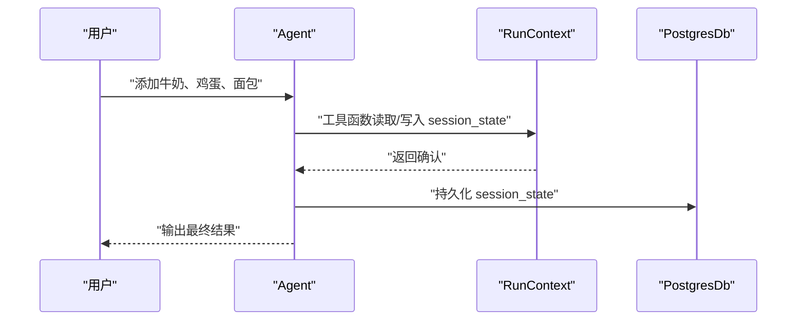
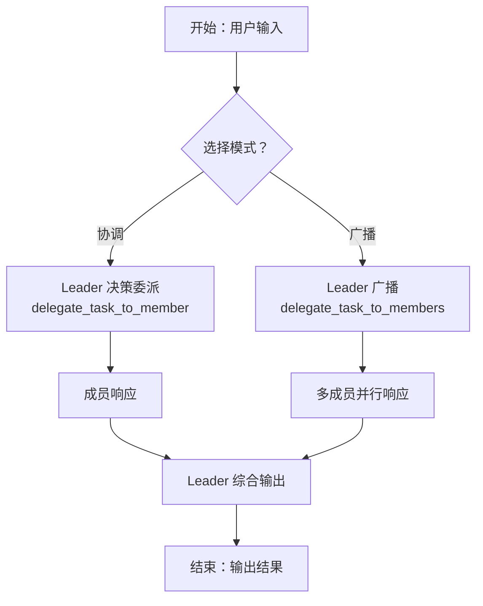
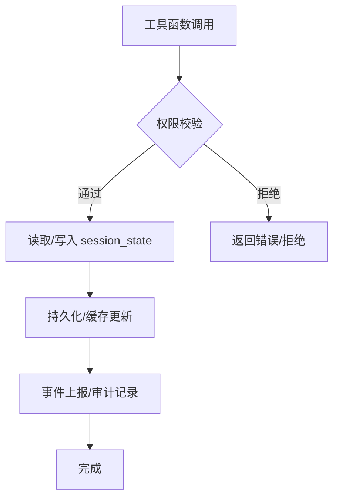
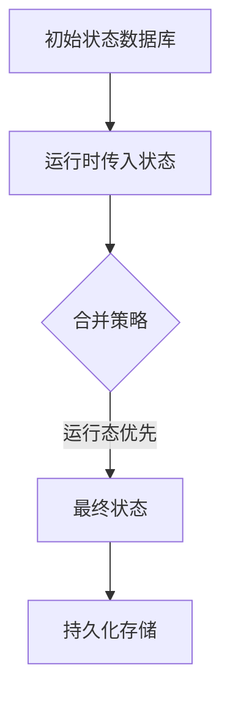
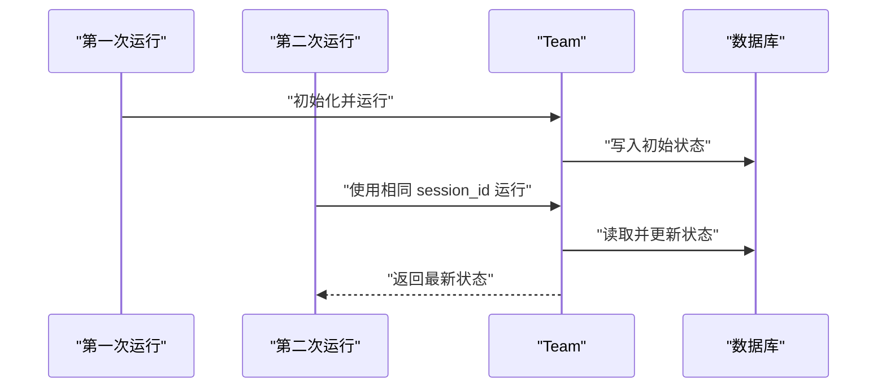
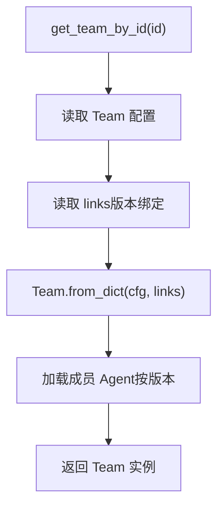
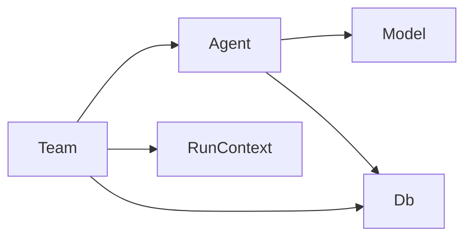

# 团队状态管理

<cite>
**本文引用的文件**
- [nested_shared_state.py](file://cookbook/03_teams/21_state/nested_shared_state.py)
- [nested_shared_state.md](file://cookbook/03_teams/21_state/nested_shared_state.md)
- [session_state_advanced.py](file://cookbook/02_agents/05_state_and_session/session_state_advanced.py)
- [session_state_events.py](file://cookbook/02_agents/05_state_and_session/session_state_events.py)
- [persistent_session.py](file://cookbook/02_agents/05_state_and_session/persistent_session.py)
- [team.py](file://libs/agno/agno/team/team.py)
- [agent.py](file://libs/agno/agno/agent/agent.py)
- [base.py](file://libs/agno/agno/run/base.py)
- [test_session_state.py](file://libs/agno/tests/integration/agent/test_session_state.py)
- [test_session.py](file://libs/agno/tests/integration/teams/test_session.py)
- [01_basic_coordination.py](file://cookbook/03_teams/01_quickstart/01_basic_coordination.py)
- [broadcast/02_debate.py](file://cookbook/03_teams/02_modes/broadcast/02_debate.py)
- [broadcast_mode.md](file://cookbook/03_teams/01_quickstart/broadcast_mode.md)
- [session_state_hooks.md](file://cookbook/02_agents/09_hooks/session_state_hooks.md)
- [get_team.md](file://cookbook/93_components/get_team.md)
</cite>

## 目录
1. [引言](#引言)
2. [项目结构](#项目结构)
3. [核心组件](#核心组件)
4. [架构总览](#架构总览)
5. [详细组件分析](#详细组件分析)
6. [依赖分析](#依赖分析)
7. [性能考虑](#性能考虑)
8. [故障排查指南](#故障排查指南)
9. [结论](#结论)
10. [附录](#附录)

## 引言
本文件系统化阐述团队状态管理的设计与实现，围绕以下目标展开：
- 团队状态的创建、更新与持久化
- 代理状态的集成（获取、修改、同步）
- 嵌套共享状态的处理（层次结构、传播与冲突解决）
- 状态变更的控制（触发、权限与审计）
- 性能优化、数据安全与备份恢复策略
- 最佳实践与一致性保障

文档以仓库中的示例与源码为基础，结合类图、时序图与流程图，帮助读者快速理解并落地团队状态管理方案。

## 项目结构
本主题涉及的关键路径与文件如下：
- 示例：嵌套共享状态（多层级 Team 共享 session_state）
- 示例：代理会话状态（基础、事件、持久化）
- 核心：Team 类与 Agent 类的状态相关属性与行为
- 测试：会话状态覆盖、嵌套优先级、跨运行持久化
- 模式：广播模式与协调模式下的状态传播差异
- 组件：Team 从注册表重建与链接机制

**图表来源**
- [nested_shared_state.py:1-250](file://cookbook/03_teams/21_state/nested_shared_state.py#L1-L250)
- [session_state_advanced.py:1-103](file://cookbook/02_agents/05_state_and_session/session_state_advanced.py#L1-L103)
- [session_state_events.py:1-51](file://cookbook/02_agents/05_state_and_session/session_state_events.py#L1-L51)
- [persistent_session.py:1-31](file://cookbook/02_agents/05_state_and_session/persistent_session.py#L1-L31)
- [01_basic_coordination.py:1-51](file://cookbook/03_teams/01_quickstart/01_basic_coordination.py#L1-L51)
- [broadcast/02_debate.py:43-72](file://cookbook/03_teams/02_modes/broadcast/02_debate.py#L43-L72)
- [team.py:71-1679](file://libs/agno/agno/team/team.py#L71-L1679)
- [agent.py:68-1611](file://libs/agno/agno/agent/agent.py#L68-L1611)
- [base.py:16-33](file://libs/agno/agno/run/base.py#L16-L33)
- [test_session_state.py:242-265](file://libs/agno/tests/integration/agent/test_session_state.py#L242-L265)
- [test_session.py:557-566](file://libs/agno/tests/integration/teams/test_session.py#L557-L566)

**章节来源**
- [nested_shared_state.py:1-250](file://cookbook/03_teams/21_state/nested_shared_state.py#L1-L250)
- [team.py:71-1679](file://libs/agno/agno/team/team.py#L71-L1679)

## 核心组件
- Team 会话状态相关属性
  - session_state：团队级会话状态字典，可持久化
  - add_session_state_to_context：是否将 session_state 注入到上下文
  - enable_agentic_state：是否允许成员通过工具动态更新状态
  - overwrite_db_session_state：是否用本次运行提供的 session_state 覆盖数据库存储
  - cache_session：是否缓存当前团队会话以提升访问速度
- Agent 会话状态相关属性
  - session_state：代理级会话状态字典，可持久化
  - db：持久化存储后端
  - run/get_session_state：读取当前会话状态
- RunContext
  - run_context.session_state：在工具函数中注入的当前会话状态引用（跨层级共享）

这些属性共同构成“团队状态”的创建、更新与持久化能力，并支持嵌套共享与跨成员同步。

**章节来源**
- [team.py:114-127](file://libs/agno/agno/team/team.py#L114-L127)
- [agent.py:68-1611](file://libs/agno/agno/agent/agent.py#L68-L1611)
- [base.py:16-33](file://libs/agno/agno/run/base.py#L16-L33)

## 架构总览
下图展示了“嵌套共享状态”示例中的组件交互：顶层 Team 拥有 session_state，子 Team 通过工具函数直接读写该状态；Agent 作为成员参与具体操作；RunContext 将 session_state 注入工具函数。

**图表来源**
- [nested_shared_state.py:169-190](file://cookbook/03_teams/21_state/nested_shared_state.py#L169-L190)
- [nested_shared_state.py:109-140](file://cookbook/03_teams/21_state/nested_shared_state.py#L109-L140)
- [nested_shared_state.py:20-66](file://cookbook/03_teams/21_state/nested_shared_state.py#L20-L66)

**章节来源**
- [nested_shared_state.py:1-250](file://cookbook/03_teams/21_state/nested_shared_state.py#L1-L250)

## 详细组件分析

### 嵌套共享状态（多层级 Team）
- 设计要点
  - 顶层 Team 初始化 session_state，子 Team 通过工具函数直接读写该状态
  - 工具函数接收 run_context，其中 session_state 指向顶层 Team 的状态对象
  - 支持跨层级状态传播：任一层级的工具均可修改顶层状态
- 关键行为
  - add_item/remove_item/remove_all_items/list_items：对购物清单进行增删改查
  - add_chore：为顶层状态添加任务条目
  - get_ingredients：从购物清单提取食材供餐食建议使用
- 状态持久化
  - 顶层 Team 提供 db 参数，状态变更在运行结束后持久化

**图表来源**
- [nested_shared_state.py:169-190](file://cookbook/03_teams/21_state/nested_shared_state.py#L169-L190)
- [nested_shared_state.py:20-66](file://cookbook/03_teams/21_state/nested_shared_state.py#L20-L66)

**章节来源**
- [nested_shared_state.py:1-250](file://cookbook/03_teams/21_state/nested_shared_state.py#L1-L250)
- [nested_shared_state.md:1-47](file://cookbook/03_teams/21_state/nested_shared_state.md#L1-L47)

### 代理会话状态（基础、事件、持久化）
- 基础会话状态
  - Agent 初始化时提供 session_state，工具函数可直接读写
  - 支持在指令中使用 session_state 变量占位符
- 事件驱动的会话状态
  - 通过 RunCompletedEvent 获取 run 结束后的 session_state
- 持久化会话
  - 使用 PostgresDb 等存储后端，指定 session_id 实现跨运行持久化

**图表来源**
- [session_state_advanced.py:64-79](file://cookbook/02_agents/05_state_and_session/session_state_advanced.py#L64-L79)
- [session_state_events.py:27-36](file://cookbook/02_agents/05_state_and_session/session_state_events.py#L27-L36)
- [persistent_session.py:19-24](file://cookbook/02_agents/05_state_and_session/persistent_session.py#L19-L24)

**章节来源**
- [session_state_advanced.py:1-103](file://cookbook/02_agents/05_state_and_session/session_state_advanced.py#L1-L103)
- [session_state_events.py:1-51](file://cookbook/02_agents/05_state_and_session/session_state_events.py#L1-L51)
- [persistent_session.py:1-31](file://cookbook/02_agents/05_state_and_session/persistent_session.py#L1-L31)

### 团队协作模式与状态传播
- 协调模式（coordinate）
  - Team Leader 决定委派给特定成员，成员响应后由 Leader 综合
- 广播模式（broadcast）
  - Team Leader 将同一任务广播给所有成员，收集响应后再综合
  - 两种模式下，工具函数仍通过 run_context.session_state 访问共享状态

**图表来源**
- [broadcast_mode.md:60-95](file://cookbook/03_teams/01_quickstart/broadcast_mode.md#L60-L95)
- [broadcast/02_debate.py:47-62](file://cookbook/03_teams/02_modes/broadcast/02_debate.py#L47-L62)
- [01_basic_coordination.py:30-40](file://cookbook/03_teams/01_quickstart/01_basic_coordination.py#L30-L40)

**章节来源**
- [broadcast_mode.md:60-95](file://cookbook/03_teams/01_quickstart/broadcast_mode.md#L60-L95)
- [broadcast/02_debate.py:43-72](file://cookbook/03_teams/02_modes/broadcast/02_debate.py#L43-L72)
- [01_basic_coordination.py:1-51](file://cookbook/03_teams/01_quickstart/01_basic_coordination.py#L1-L51)

### 状态变更控制（触发、权限与审计）
- 触发与同步
  - 工具函数在 run_context.session_state 上进行读写，自动同步到顶层 Team
  - enable_agentic_state 可开启成员动态更新能力
- 权限控制
  - 通过工具函数白名单与指令约束，限制可修改的状态字段
  - 使用 hooks 在运行前后拦截与校验状态变更
- 审计日志
  - 通过 pre/post hooks 记录状态变更事件，配合数据库查询与过滤

**图表来源**
- [session_state_hooks.md:24-51](file://cookbook/02_agents/09_hooks/session_state_hooks.md#L24-L51)
- [team.py:256-262](file://libs/agno/agno/team/team.py#L256-L262)

**章节来源**
- [session_state_hooks.md:24-51](file://cookbook/02_agents/09_hooks/session_state_hooks.md#L24-L51)
- [team.py:256-262](file://libs/agno/agno/team/team.py#L256-L262)

### 嵌套共享状态的层次结构与冲突解决
- 层次结构
  - 顶层 Team 拥有 session_state，子 Team 通过工具函数直接访问
  - 工具函数签名接收 run_context，内部统一读写顶层状态对象
- 冲突解决
  - 采用“运行态覆盖 + 数据库存储保留”的策略：运行时传入的 session_state 与数据库存储合并，运行态优先
  - 测试验证了嵌套结构的覆盖优先级与保留字段

**图表来源**
- [test_session_state.py:242-265](file://libs/agno/tests/integration/agent/test_session_state.py#L242-L265)

**章节来源**
- [test_session_state.py:242-265](file://libs/agno/tests/integration/agent/test_session_state.py#L242-L265)

### 团队状态的持久化与跨运行保持
- 顶层 Team 提供 db 参数，状态在运行结束后持久化
- 多次运行共享同一 session_id，状态得以延续
- 测试验证了跨运行状态保持与更新

**图表来源**
- [test_session.py:557-566](file://libs/agno/tests/integration/teams/test_session.py#L557-L566)
- [nested_shared_state.py:169-178](file://cookbook/03_teams/21_state/nested_shared_state.py#L169-L178)

**章节来源**
- [test_session.py:557-566](file://libs/agno/tests/integration/teams/test_session.py#L557-L566)
- [nested_shared_state.py:169-178](file://cookbook/03_teams/21_state/nested_shared_state.py#L169-L178)

### Team 从注册表重建与链接机制
- get_team_by_id 通过 db.get_config 读取 Team 配置与 links
- links 记录 Team 版本与成员 Agent 版本的绑定关系
- Team.from_dict 依据 links 加载匹配版本的成员 Agent

**图表来源**
- [get_team.md:40-81](file://cookbook/93_components/get_team.md#L40-L81)

**章节来源**
- [get_team.md:40-81](file://cookbook/93_components/get_team.md#L40-L81)

## 依赖分析
- 组件耦合
  - Team 依赖 Agent 与 RunContext；Agent 依赖 Model 与 Db；RunContext 提供 session_state 引用
- 外部依赖
  - 存储后端（SQLite、Postgres 等）用于持久化 session_state
- 潜在循环依赖
  - Team 与 Agent 通过成员列表相互引用，但通过字符串或工厂延迟解析避免循环导入

**图表来源**
- [team.py:71-1679](file://libs/agno/agno/team/team.py#L71-L1679)
- [agent.py:68-1611](file://libs/agno/agno/agent/agent.py#L68-L1611)
- [base.py:16-33](file://libs/agno/agno/run/base.py#L16-L33)

**章节来源**
- [team.py:71-1679](file://libs/agno/agno/team/team.py#L71-L1679)
- [agent.py:68-1611](file://libs/agno/agno/agent/agent.py#L68-L1611)
- [base.py:16-33](file://libs/agno/agno/run/base.py#L16-L33)

## 性能考虑
- 缓存策略
  - cache_session：启用内存缓存团队会话，减少重复读取
  - cache_callables：缓存可调用工厂结果，降低工具/知识加载开销
- 并发与流式
  - 广播模式下并行调用成员，缩短响应时间
  - 流式输出与事件流有助于前端实时渲染与状态增量更新
- 存储优化
  - 仅在必要时持久化 session_state，避免频繁写入
  - 合理设置 num_history_runs 与 num_history_messages，控制上下文长度

[本节为通用指导，无需列出具体文件来源]

## 故障排查指南
- 状态未持久化
  - 检查 Team/Agent 是否配置 db 与 session_id
  - 确认运行结束后是否触发持久化流程
- 状态未同步
  - 确认工具函数是否通过 run_context.session_state 访问
  - 检查 enable_agentic_state 是否开启
- 覆盖优先级异常
  - 核对 overwrite_db_session_state 与运行时传入的 session_state
  - 参考嵌套覆盖测试用例验证预期行为
- 广播模式响应缺失
  - 确认 delegate_task_to_members 工具是否被正确调用
  - 检查 show_members_responses 是否开启以便观察成员响应

**章节来源**
- [test_session.py:557-566](file://libs/agno/tests/integration/teams/test_session.py#L557-L566)
- [test_session_state.py:242-265](file://libs/agno/tests/integration/agent/test_session_state.py#L242-L265)
- [broadcast_mode.md:60-95](file://cookbook/03_teams/01_quickstart/broadcast_mode.md#L60-L95)

## 结论
团队状态管理通过“顶层 Team 拥有、子 Team 共享、工具函数直写”的方式，实现了跨层级的一致性与可扩展性。结合持久化、事件钩子与版本链接机制，系统在保证协作一致性的同时，兼顾了性能与可维护性。建议在实际项目中：
- 明确状态边界与权限范围
- 使用 hooks 实施审计与合规
- 合理配置缓存与历史上下文
- 通过测试验证覆盖优先级与跨运行持久化

[本节为总结性内容，无需列出具体文件来源]

## 附录
- 代码示例路径（不含具体代码内容）
  - 嵌套共享状态示例：[nested_shared_state.py:1-250](file://cookbook/03_teams/21_state/nested_shared_state.py#L1-L250)
  - 高级会话状态示例：[session_state_advanced.py:1-103](file://cookbook/02_agents/05_state_and_session/session_state_advanced.py#L1-L103)
  - 会话状态事件示例：[session_state_events.py:1-51](file://cookbook/02_agents/05_state_and_session/session_state_events.py#L1-L51)
  - 持久化会话示例：[persistent_session.py:1-31](file://cookbook/02_agents/05_state_and_session/persistent_session.py#L1-L31)
  - Team 类关键属性：[team.py:114-127](file://libs/agno/agno/team/team.py#L114-L127)
  - Agent 类关键属性：[agent.py:68-1611](file://libs/agno/agno/agent/agent.py#L68-L1611)
  - RunContext：[base.py:16-33](file://libs/agno/agno/run/base.py#L16-L33)
  - 嵌套覆盖测试：[test_session_state.py:242-265](file://libs/agno/tests/integration/agent/test_session_state.py#L242-L265)
  - 团队会话持久化测试：[test_session.py:557-566](file://libs/agno/tests/integration/teams/test_session.py#L557-L566)
  - 广播模式示例：[broadcast/02_debate.py:43-72](file://cookbook/03_teams/02_modes/broadcast/02_debate.py#L43-L72)
  - 广播模式说明：[broadcast_mode.md:60-95](file://cookbook/03_teams/01_quickstart/broadcast_mode.md#L60-L95)
  - Team 从注册表重建：[get_team.md:40-81](file://cookbook/93_components/get_team.md#L40-L81)