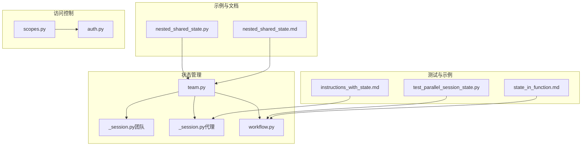
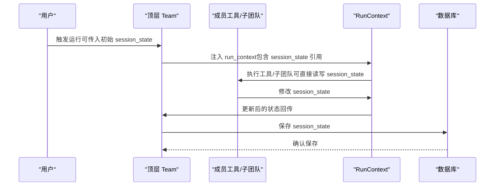
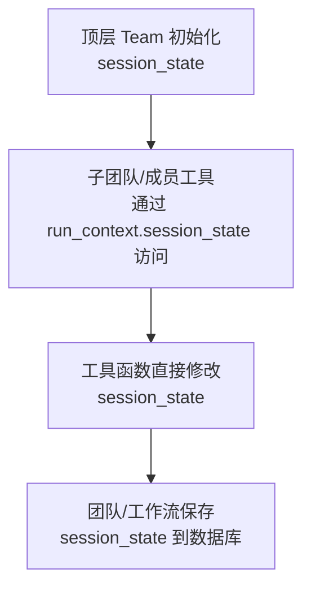
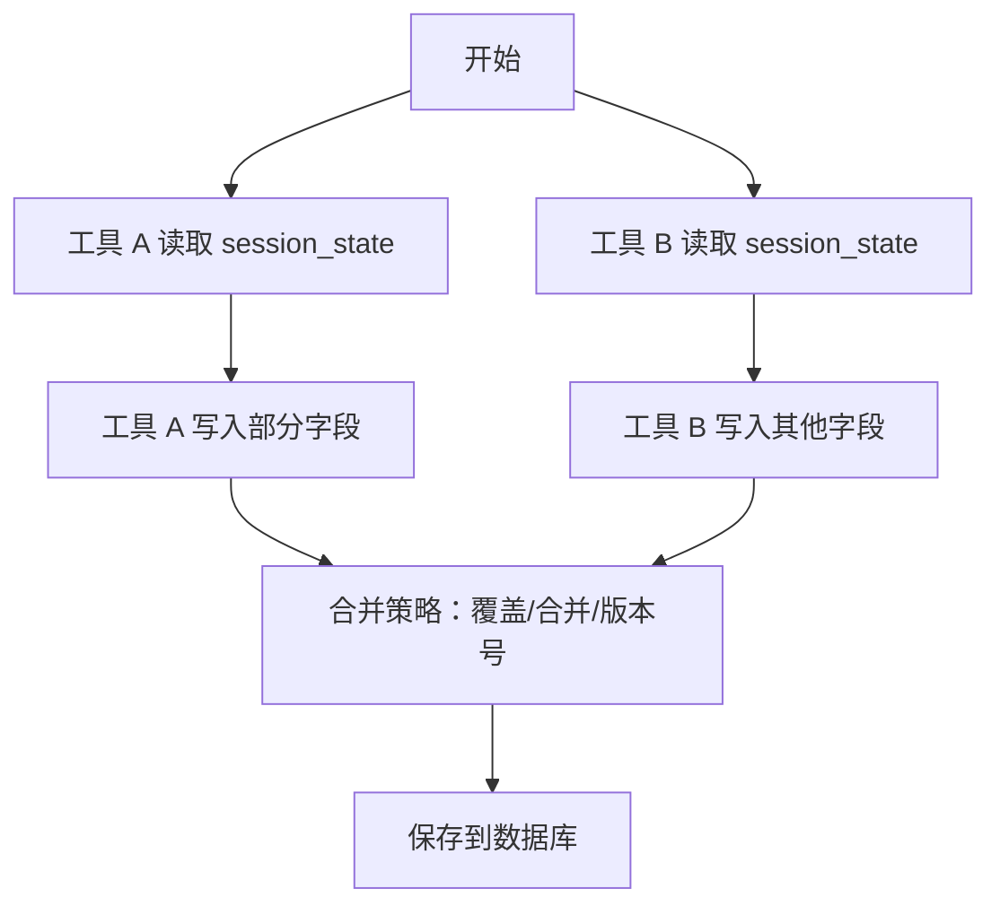
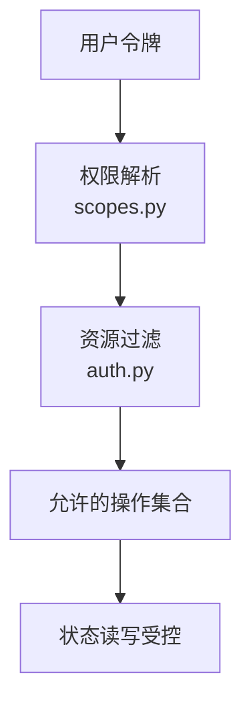
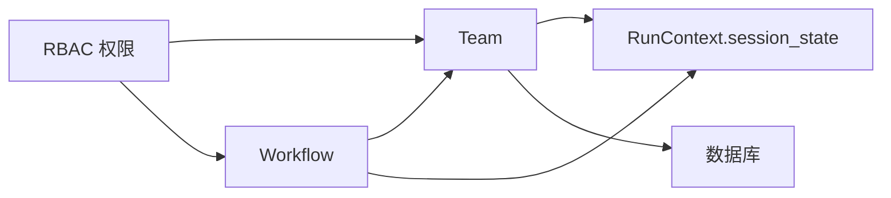

# 嵌套共享状态

<cite>
**本文档引用的文件**
- [nested_shared_state.py](file://cookbook/03_teams/21_state/nested_shared_state.py)
- [nested_shared_state.md](file://cookbook/03_teams/21_state/nested_shared_state.md)
- [team.py](file://libs/agno/agno/team/team.py)
- [_session.py（团队）](file://libs/agno/agno/team/_session.py)
- [_session.py（代理）](file://libs/agno/agno/agent/_session.py)
- [workflow.py](file://libs/agno/agno/workflow/workflow.py)
- [test_parallel_session_state.py](file://libs/agno/tests/integration/workflows/test_parallel_session_state.py)
- [state_in_function.md](file://cookbook/04_workflows/06_advanced_concepts/session_state/state_in_function.md)
- [instructions_with_state.md](file://cookbook/02_agents/03_context_management/instructions_with_state.md)
- [scopes.py](file://libs/agno/agno/os/scopes.py)
- [auth.py](file://libs/agno/agno/os/auth.py)
</cite>

## 目录
1. [简介](#简介)
2. [项目结构](#项目结构)
3. [核心组件](#核心组件)
4. [架构总览](#架构总览)
5. [详细组件分析](#详细组件分析)
6. [依赖分析](#依赖分析)
7. [性能考虑](#性能考虑)
8. [故障排除指南](#故障排除指南)
9. [结论](#结论)
10. [附录](#附录)

## 简介
本文件系统性阐述“嵌套共享状态”的设计与实现，聚焦于多层级团队（Team）中的状态共享机制。顶层团队维护共享的 session_state，其子团队与成员工具均可直接读写该状态，从而实现跨层级的状态一致性与协同。文档将从状态层次组织、传播规则、访问控制、性能影响与调试方法等维度展开，并结合仓库中的示例与测试用例进行说明。

## 项目结构
围绕嵌套共享状态的关键代码分布在以下模块：
- 示例与文档：cookbook 中的嵌套共享状态示例与说明
- 团队与代理状态管理：team 与 agent 的 session 管理接口
- 工作流与并行执行：工作流对 session_state 的处理与并发更新
- 访问控制：RBAC 权限模型与资源过滤

图表来源
- [nested_shared_state.py](file://cookbook/03_teams/21_state/nested_shared_state.py)
- [nested_shared_state.md](file://cookbook/03_teams/21_state/nested_shared_state.md)
- [team.py](file://libs/agno/agno/team/team.py)
- [_session.py（团队）](file://libs/agno/agno/team/_session.py)
- [_session.py（代理）](file://libs/agno/agno/agent/_session.py)
- [workflow.py](file://libs/agno/agno/workflow/workflow.py)
- [test_parallel_session_state.py](file://libs/agno/tests/integration/workflows/test_parallel_session_state.py)
- [state_in_function.md](file://cookbook/04_workflows/06_advanced_concepts/session_state/state_in_function.md)
- [instructions_with_state.md](file://cookbook/02_agents/03_context_management/instructions_with_state.md)
- [scopes.py](file://libs/agno/agno/os/scopes.py)
- [auth.py](file://libs/agno/agno/os/auth.py)

章节来源
- [nested_shared_state.py](file://cookbook/03_teams/21_state/nested_shared_state.py)
- [team.py](file://libs/agno/agno/team/team.py)

## 核心组件
- 顶层团队（Team）：持有 session_state 并作为状态根，向下传递给子团队与成员工具
- 子团队与成员：通过 run_context.session_state 直接读写顶层状态，实现跨层级共享
- 状态管理接口：get_session_state/update_session_state 提供统一的状态读写入口
- 工作流与并行：工作流在步骤执行中复制/共享 session_state，支持并行场景下的状态累积
- 访问控制：基于 RBAC 的资源访问与权限校验，确保状态变更的安全边界

章节来源
- [team.py](file://libs/agno/agno/team/team.py)
- [_session.py（团队）](file://libs/agno/agno/team/_session.py)
- [_session.py（代理）](file://libs/agno/agno/agent/_session.py)
- [workflow.py](file://libs/agno/agno/workflow/workflow.py)
- [nested_shared_state.py](file://cookbook/03_teams/21_state/nested_shared_state.py)

## 架构总览
嵌套共享状态的运行时架构如下：
- 顶层 Team 初始化 session_state
- 子团队与成员在执行期间通过 run_context.session_state 访问与修改状态
- 状态变更由团队或工作流的保存逻辑持久化到数据库
- RBAC 控制不同用户对资源的访问范围，避免越权修改

图表来源
- [team.py](file://libs/agno/agno/team/team.py)
- [nested_shared_state.py](file://cookbook/03_teams/21_state/nested_shared_state.py)
- [_session.py（团队）](file://libs/agno/agno/team/_session.py)

## 详细组件分析

### 1) 状态层次与共享机制
- 顶层 Team 在构造时接收 session_state，作为整个嵌套结构的状态根
- 子团队与成员工具通过 run_context.session_state 获取同一状态对象引用，实现跨层级共享
- 状态读写通过团队/代理的 get_session_state/update_session_state 接口完成，保证一致性

图表来源
- [nested_shared_state.py](file://cookbook/03_teams/21_state/nested_shared_state.py)
- [_session.py（团队）](file://libs/agno/agno/team/_session.py)

章节来源
- [nested_shared_state.py](file://cookbook/03_teams/21_state/nested_shared_state.py)
- [team.py](file://libs/agno/agno/team/team.py)

### 2) 状态传播规则
- 继承：子团队与成员工具继承顶层 Team 的 session_state 引用，无需显式传递
- 属性传递：工具函数签名支持直接接收 session_state 或 run_context.session_state
- 冲突解决：当多个分支/并行步骤同时修改状态时，最终以保存阶段的合并为准；建议在业务层采用幂等写法或版本化字段

图表来源
- [test_parallel_session_state.py](file://libs/agno/tests/integration/workflows/test_parallel_session_state.py)
- [state_in_function.md](file://cookbook/04_workflows/06_advanced_concepts/session_state/state_in_function.md)

章节来源
- [test_parallel_session_state.py](file://libs/agno/tests/integration/workflows/test_parallel_session_state.py)
- [state_in_function.md](file://cookbook/04_workflows/06_advanced_concepts/session_state/state_in_function.md)

### 3) 访问控制与安全边界
- RBAC 范围：通过 scopes.py 定义资源与动作范围，如 agents:*:run、teams:*:run 等
- 资源过滤：auth.py 提供按用户权限过滤资源列表的能力，避免越权访问
- 状态变更边界：仅具备相应权限的用户可对特定资源执行运行/读取，间接约束了状态变更的范围

图表来源
- [scopes.py](file://libs/agno/agno/os/scopes.py)
- [auth.py](file://libs/agno/agno/os/auth.py)

章节来源
- [scopes.py](file://libs/agno/agno/os/scopes.py)
- [auth.py](file://libs/agno/agno/os/auth.py)

### 4) 代码示例路径
- 嵌套共享状态示例：[nested_shared_state.py](file://cookbook/03_teams/21_state/nested_shared_state.py)
- 状态读写接口（团队）：[_session.py（团队）](file://libs/agno/agno/team/_session.py)
- 状态读写接口（代理）：[_session.py（代理）](file://libs/agno/agno/agent/_session.py)
- 工作流中的状态处理：[workflow.py](file://libs/agno/agno/workflow/workflow.py)
- 并行场景下的状态累积：[test_parallel_session_state.py](file://libs/agno/tests/integration/workflows/test_parallel_session_state.py)
- 在函数中使用 session_state：[state_in_function.md](file://cookbook/04_workflows/06_advanced_concepts/session_state/state_in_function.md)
- 在指令中使用 session_state：[instructions_with_state.md](file://cookbook/02_agents/03_context_management/instructions_with_state.md)

章节来源
- [nested_shared_state.py](file://cookbook/03_teams/21_state/nested_shared_state.py)
- [_session.py（团队）](file://libs/agno/agno/team/_session.py)
- [_session.py（代理）](file://libs/agno/agno/agent/_session.py)
- [workflow.py](file://libs/agno/agno/workflow/workflow.py)
- [test_parallel_session_state.py](file://libs/agno/tests/integration/workflows/test_parallel_session_state.py)
- [state_in_function.md](file://cookbook/04_workflows/06_advanced_concepts/session_state/state_in_function.md)
- [instructions_with_state.md](file://cookbook/02_agents/03_context_management/instructions_with_state.md)

## 依赖分析
- 组件耦合
  - Team 与 RunContext：Team 将 session_state 注入 run_context，成员工具通过 run_context.session_state 访问
  - Team 与数据库：通过 _session.py 中的 get_session/save_session 管理持久化
  - 工作流与 Team：工作流在步骤执行前复制 session_state，结束后合并并保存
- 外部依赖
  - RBAC 模块（scopes.py、auth.py）用于权限校验与资源过滤
  - 数据库适配器（BaseDb/AsyncBaseDb）用于状态持久化

图表来源
- [team.py](file://libs/agno/agno/team/team.py)
- [_session.py（团队）](file://libs/agno/agno/team/_session.py)
- [workflow.py](file://libs/agno/agno/workflow/workflow.py)
- [scopes.py](file://libs/agno/agno/os/scopes.py)
- [auth.py](file://libs/agno/agno/os/auth.py)

章节来源
- [team.py](file://libs/agno/agno/team/team.py)
- [_session.py（团队）](file://libs/agno/agno/team/_session.py)
- [workflow.py](file://libs/agno/agno/workflow/workflow.py)
- [scopes.py](file://libs/agno/agno/os/scopes.py)
- [auth.py](file://libs/agno/agno/os/auth.py)

## 性能考虑
- 内存使用
  - session_state 通常为字典结构，建议避免存储超大对象；必要时拆分为多个键或外部引用
  - 并行执行时注意状态复制成本，优先使用不可变数据结构或只读视图
- 查询效率
  - 频繁读取的键应保持扁平化，减少深层嵌套访问
  - 对热点键进行缓存（如应用层缓存），降低重复计算
- 同步开销
  - 并行写入状态时，建议采用幂等写法或版本号，减少锁竞争
  - 批量保存策略：合并多次小更新，降低数据库写入频率

## 故障排除指南
- 症状：状态未持久化
  - 检查是否调用了保存接口（团队：save_session；代理：asave_session）
  - 确认数据库连接与权限正常
- 症状：状态被意外覆盖
  - 并行场景下采用合并策略（如追加数组、合并字典），避免直接覆盖
  - 参考并行测试用例的实现思路
- 症状：权限不足导致无法运行
  - 校验用户令牌的 scope 是否包含所需资源与动作
  - 使用资源过滤函数确认可访问的资源集合

章节来源
- [_session.py（团队）](file://libs/agno/agno/team/_session.py)
- [_session.py（代理）](file://libs/agno/agno/agent/_session.py)
- [test_parallel_session_state.py](file://libs/agno/tests/integration/workflows/test_parallel_session_state.py)
- [scopes.py](file://libs/agno/agno/os/scopes.py)
- [auth.py](file://libs/agno/agno/os/auth.py)

## 结论
嵌套共享状态通过“顶层持有、向下共享”的模式，实现了多层级团队间的一致状态管理。配合工作流的并行处理与 RBAC 的访问控制，既保证了灵活性与扩展性，也确保了安全性与可维护性。实践中建议遵循幂等写法、扁平化结构与合理的缓存策略，以获得更好的性能与稳定性。

## 附录
- 相关示例与测试
  - 嵌套共享状态示例：[nested_shared_state.py](file://cookbook/03_teams/21_state/nested_shared_state.py)
  - 并行状态累积测试：[test_parallel_session_state.py](file://libs/agno/tests/integration/workflows/test_parallel_session_state.py)
  - 在函数中使用 session_state：[state_in_function.md](file://cookbook/04_workflows/06_advanced_concepts/session_state/state_in_function.md)
  - 在指令中使用 session_state：[instructions_with_state.md](file://cookbook/02_agents/03_context_management/instructions_with_state.md)
- 状态管理接口
  - 团队：get_session_state/update_session_state
  - 代理：aget_session_state/aupdate_session_state
- 访问控制
  - RBAC 范围定义：[scopes.py](file://libs/agno/agno/os/scopes.py)
  - 资源过滤：[auth.py](file://libs/agno/agno/os/auth.py)