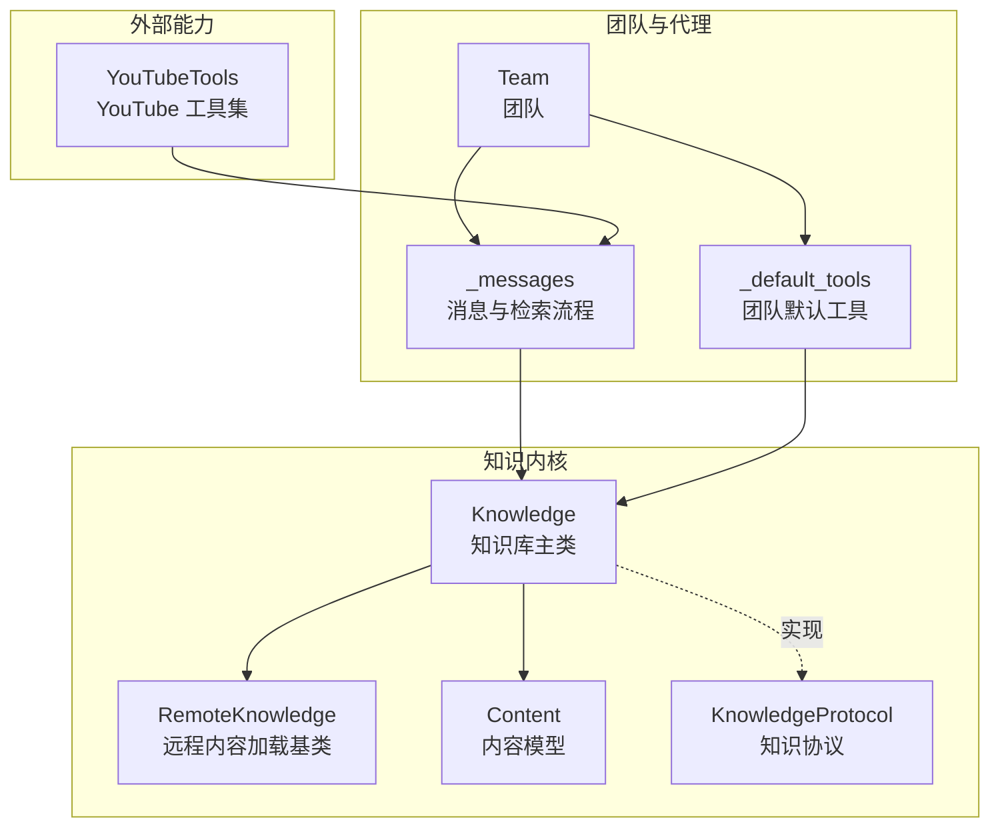
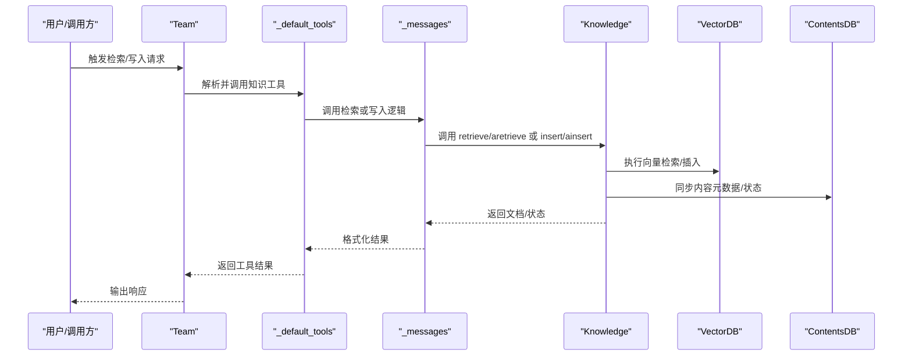
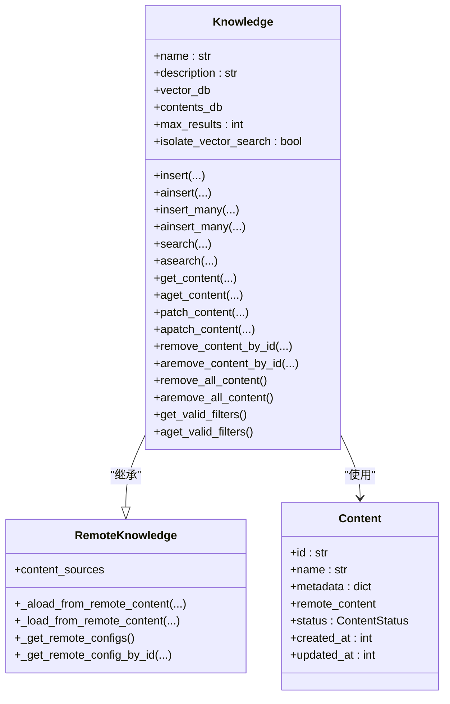
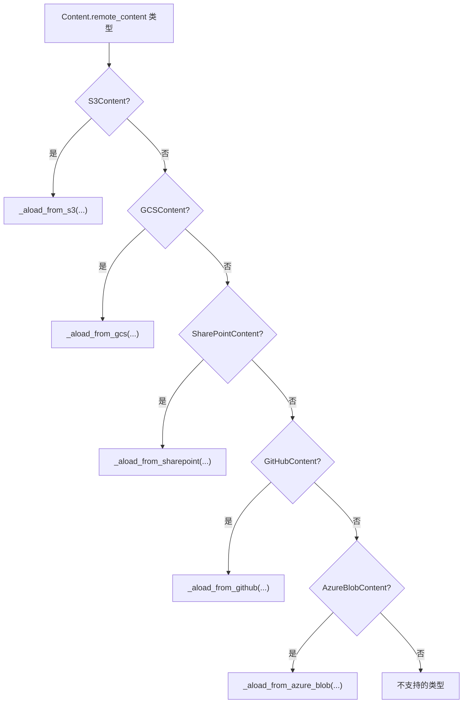
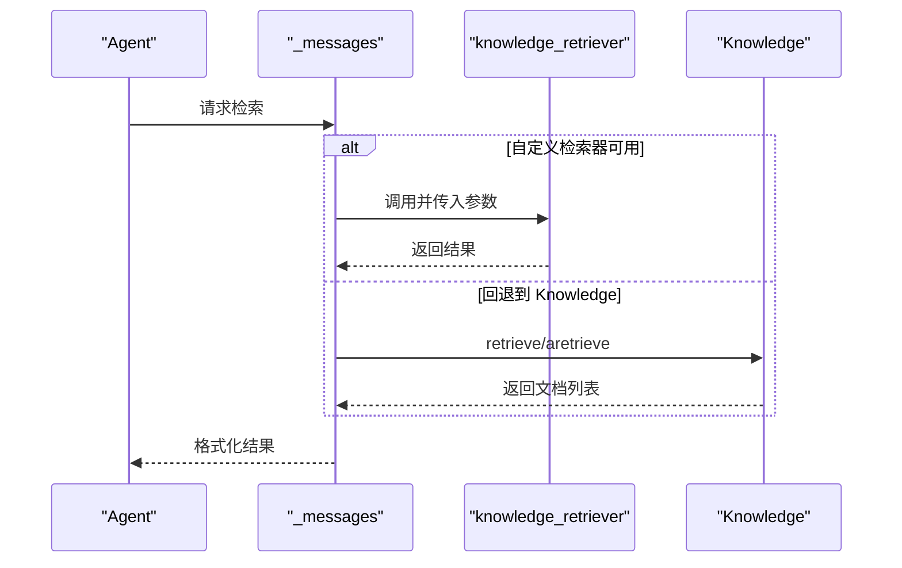
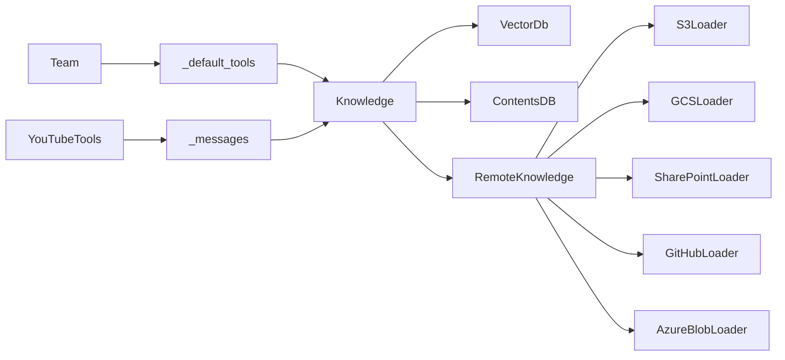

# 团队知识

<cite>
**本文引用的文件**
- [libs/agno/agno/knowledge/knowledge.py](file://libs/agno/agno/knowledge/knowledge.py)
- [libs/agno/agno/knowledge/remote_knowledge.py](file://libs/agno/agno/knowledge/remote_knowledge.py)
- [libs/agno/agno/knowledge/content.py](file://libs/agno/agno/knowledge/content.py)
- [libs/agno/agno/knowledge/protocol.py](file://libs/agno/agno/knowledge/protocol.py)
- [libs/agno/agno/team/team.py](file://libs/agno/agno/team/team.py)
- [libs/agno/agno/team/_default_tools.py](file://libs/agno/agno/team/_default_tools.py)
- [libs/agno/agno/agent/_messages.py](file://libs/agno/agno/agent/_messages.py)
- [libs/agno/agno/tools/youtube.py](file://libs/agno/agno/tools/youtube.py)
- [libs/agno/tests/integration/db/surrealdb/test_surrealdb_knowledge.py](file://libs/agno/tests/integration/db/surrealdb/test_surrealdb_knowledge.py)
- [cookbook/07_knowledge/01_quickstart/05_from_youtube.md](file://cookbook/07_knowledge/01_quickstart/05_from_youtube.md)
- [cookbook/03_teams/05_knowledge/05_team_update_knowledge.md](file://cookbook/03_teams/05_knowledge/05_team_update_knowledge.md)
- [cookbook/05_agent_os/rbac/README.md](file://cookbook/05_agent_os/rbac/README.md)
- [libs/agno/agno/os/scopes.py](file://libs/agno/agno/os/scopes.py)
</cite>

## 目录
1. [简介](#简介)
2. [项目结构](#项目结构)
3. [核心组件](#核心组件)
4. [架构总览](#架构总览)
5. [详细组件分析](#详细组件分析)
6. [依赖分析](#依赖分析)
7. [性能考量](#性能考量)
8. [故障排除指南](#故障排除指南)
9. [结论](#结论)
10. [附录](#附录)

## 简介
本文件系统性地介绍团队知识管理系统的实现与使用，覆盖以下方面：
- 共享知识库的创建、配置与管理
- 知识同步机制（更新传播、缓存与一致性）
- 访问控制策略（权限管理、访问限制与安全）
- 多来源内容加载（路径、URL、主题、YouTube、S3、GCS 等）
- 团队知识的使用示例（配置、过滤器、智能过滤器、自定义检索器、更新机制）
- 多代理协作中的知识应用与优化
- 维护、性能优化与故障排除

## 项目结构
围绕“团队知识”的核心代码主要位于 agno 库的知识域模块，并在示例与测试中体现其在团队与 AgentOS 中的应用。

图表来源
- [libs/agno/agno/knowledge/knowledge.py:40-80](file://libs/agno/agno/knowledge/knowledge.py#L40-L80)
- [libs/agno/agno/knowledge/remote_knowledge.py:30-48](file://libs/agno/agno/knowledge/remote_knowledge.py#L30-L48)
- [libs/agno/agno/knowledge/content.py:31-51](file://libs/agno/agno/knowledge/content.py#L31-L51)
- [libs/agno/agno/knowledge/protocol.py:19-62](file://libs/agno/agno/knowledge/protocol.py#L19-L62)
- [libs/agno/agno/team/team.py:70-120](file://libs/agno/agno/team/team.py#L70-L120)
- [libs/agno/agno/team/_default_tools.py:1417-1563](file://libs/agno/agno/team/_default_tools.py#L1417-L1563)
- [libs/agno/agno/agent/_messages.py:1867-1925](file://libs/agno/agno/agent/_messages.py#L1867-L1925)
- [libs/agno/agno/tools/youtube.py:17-45](file://libs/agno/agno/tools/youtube.py#L17-L45)

章节来源
- [libs/agno/agno/knowledge/knowledge.py:40-80](file://libs/agno/agno/knowledge/knowledge.py#L40-L80)
- [libs/agno/agno/knowledge/remote_knowledge.py:30-48](file://libs/agno/agno/knowledge/remote_knowledge.py#L30-L48)
- [libs/agno/agno/knowledge/content.py:31-51](file://libs/agno/agno/knowledge/content.py#L31-L51)
- [libs/agno/agno/knowledge/protocol.py:19-62](file://libs/agno/agno/knowledge/protocol.py#L19-L62)
- [libs/agno/agno/team/team.py:70-120](file://libs/agno/agno/team/team.py#L70-L120)
- [libs/agno/agno/team/_default_tools.py:1417-1563](file://libs/agno/agno/team/_default_tools.py#L1417-L1563)
- [libs/agno/agno/agent/_messages.py:1867-1925](file://libs/agno/agno/agent/_messages.py#L1867-L1925)
- [libs/agno/agno/tools/youtube.py:17-45](file://libs/agno/agno/tools/youtube.py#L17-L45)

## 核心组件
- Knowledge：知识库主类，负责内容插入、检索、内容管理、过滤与隔离等。支持同步/异步操作，具备向量数据库与内容数据库的协同。
- RemoteKnowledge：远程内容加载基类，统一调度 S3、GCS、SharePoint、GitHub、Azure Blob 等云存储加载。
- Content：内容实体模型，承载元数据、认证、远程内容配置、状态等。
- KnowledgeProtocol：知识协议，定义最小接口，允许自定义知识实现与工具暴露。
- Team 与检索工具链：Team 在运行时通过默认工具或自定义检索器对接 Knowledge，实现上下文注入与检索。

章节来源
- [libs/agno/agno/knowledge/knowledge.py:40-80](file://libs/agno/agno/knowledge/knowledge.py#L40-L80)
- [libs/agno/agno/knowledge/remote_knowledge.py:30-48](file://libs/agno/agno/knowledge/remote_knowledge.py#L30-L48)
- [libs/agno/agno/knowledge/content.py:31-51](file://libs/agno/agno/knowledge/content.py#L31-L51)
- [libs/agno/agno/knowledge/protocol.py:19-62](file://libs/agno/agno/knowledge/protocol.py#L19-L62)
- [libs/agno/agno/team/team.py:70-120](file://libs/agno/agno/team/team.py#L70-L120)
- [libs/agno/agno/team/_default_tools.py:1417-1563](file://libs/agno/agno/team/_default_tools.py#L1417-L1563)
- [libs/agno/agno/agent/_messages.py:1867-1925](file://libs/agno/agno/agent/_messages.py#L1867-L1925)

## 架构总览
下图展示了从内容加载到检索注入的端到端流程，涵盖本地/远程内容、向量检索与上下文注入。

图表来源
- [libs/agno/agno/team/_default_tools.py:1417-1563](file://libs/agno/agno/team/_default_tools.py#L1417-L1563)
- [libs/agno/agno/agent/_messages.py:1867-1925](file://libs/agno/agno/agent/_messages.py#L1867-L1925)
- [libs/agno/agno/knowledge/knowledge.py:507-591](file://libs/agno/agno/knowledge/knowledge.py#L507-L591)

## 详细组件分析

### 知识库主类：Knowledge
- 功能要点
  - 内容插入：支持单个/批量插入，来源包括路径、URL、文本、主题、远程内容；支持 upsert 与跳过已存在。
  - 异步/同步：提供 ainsert/ainsert_many 与 insert/insert_many。
  - 检索：search/asearch 支持过滤与搜索类型切换；支持按知识库名称进行向量隔离。
  - 内容管理：获取/更新/删除内容，支持按 id、名称、元数据批量删除。
  - 过滤：动态获取有效过滤键集合，便于前端/调用侧构建筛选条件。
- 关键行为
  - 内容去重：基于 content_hash 生成 id，避免重复入库。
  - 隔离检索：当启用 isolate_vector_search 且知识库有名称时，自动注入 linked_to 过滤，避免跨库干扰。
  - 一致性：更新内容不会改变 created_at，但会更新 updated_at（见测试）。

图表来源
- [libs/agno/agno/knowledge/knowledge.py:40-80](file://libs/agno/agno/knowledge/knowledge.py#L40-L80)
- [libs/agno/agno/knowledge/remote_knowledge.py:30-48](file://libs/agno/agno/knowledge/remote_knowledge.py#L30-L48)
- [libs/agno/agno/knowledge/content.py:31-51](file://libs/agno/agno/knowledge/content.py#L31-L51)

章节来源
- [libs/agno/agno/knowledge/knowledge.py:90-353](file://libs/agno/agno/knowledge/knowledge.py#L90-L353)
- [libs/agno/agno/knowledge/knowledge.py:507-591](file://libs/agno/agno/knowledge/knowledge.py#L507-L591)
- [libs/agno/agno/knowledge/knowledge.py:596-745](file://libs/agno/agno/knowledge/knowledge.py#L596-L745)
- [libs/agno/agno/knowledge/knowledge.py:777-800](file://libs/agno/agno/knowledge/knowledge.py#L777-L800)

### 远程内容加载：RemoteKnowledge
- 功能要点
  - 统一调度：根据 RemoteContent 类型分派到 S3/GCS/SharePoint/GitHub/Azure Blob 加载器。
  - 配置管理：支持通过 config_id 获取 content_sources 中的存储配置。
- 使用场景
  - 将云存储中的文档、视频、代码仓库等内容统一加载到知识库，再进行向量化与检索。

图表来源
- [libs/agno/agno/knowledge/remote_knowledge.py:57-97](file://libs/agno/agno/knowledge/remote_knowledge.py#L57-L97)

章节来源
- [libs/agno/agno/knowledge/remote_knowledge.py:57-137](file://libs/agno/agno/knowledge/remote_knowledge.py#L57-L137)

### 内容模型：Content
- 字段与职责
  - 标识与元数据：id、name、description、metadata、topics、external_id
  - 来源与认证：path、url、file_data、auth
  - 远程内容：remote_content（用于云存储加载）
  - 状态与时间：status、status_message、created_at、updated_at
- 用途
  - 作为 Knowledge.insert/ainsert 的输入载体，贯穿加载、向量化、入库与检索。

章节来源
- [libs/agno/agno/knowledge/content.py:31-75](file://libs/agno/agno/knowledge/content.py#L31-L75)

### 知识协议：KnowledgeProtocol
- 目标
  - 定义最小接口，允许第三方实现自己的知识系统并与 Agent/Team 无缝集成。
- 必需方法
  - build_context：为系统提示构建上下文说明
  - get_tools / aget_tools：返回可用工具
- 可选方法
  - retrieve / aretrieve：用于上下文注入的预检索
- 价值
  - 保持工具命名与上下文注入的灵活性，同时确保类型安全。

章节来源
- [libs/agno/agno/knowledge/protocol.py:19-62](file://libs/agno/agno/knowledge/protocol.py#L19-L62)
- [libs/agno/agno/knowledge/protocol.py:105-135](file://libs/agno/agno/knowledge/protocol.py#L105-L135)

### 检索与上下文注入：Team 与消息层
- Team 默认工具链
  - 当未提供自定义检索器时，Team 默认通过 _default_tools 调用 Knowledge 的检索方法，并支持传入 filters、run_context 等参数。
- Agent 层检索
  - 若 agent.knowledge_retriever 存在且可调用，则优先使用该自定义检索器；否则回落到 Knowledge 的 retrieve/aretrieve。
- 行为特征
  - 自动处理异步签名兼容（isawaitable）
  - 缺省 max_results 来源于 Knowledge 的 max_results
  - 无结果时返回空并记录调试日志

图表来源
- [libs/agno/agno/agent/_messages.py:1867-1925](file://libs/agno/agno/agent/_messages.py#L1867-L1925)
- [libs/agno/agno/team/_default_tools.py:1417-1563](file://libs/agno/agno/team/_default_tools.py#L1417-L1563)

章节来源
- [libs/agno/agno/team/_default_tools.py:1417-1563](file://libs/agno/agno/team/_default_tools.py#L1417-L1563)
- [libs/agno/agno/agent/_messages.py:1867-1925](file://libs/agno/agno/agent/_messages.py#L1867-L1925)

### YouTube 内容加载
- 工具能力
  - YouTubeTools 提供视频字幕/数据/时间戳提取工具集，支持按需启用。
- 示例参考
  - Cookbook 中的 YouTube 加载示例展示了如何将 YouTube 视频内容插入知识库并进行检索问答。

章节来源
- [libs/agno/agno/tools/youtube.py:17-45](file://libs/agno/agno/tools/youtube.py#L17-L45)
- [cookbook/07_knowledge/01_quickstart/05_from_youtube.md:1-25](file://cookbook/07_knowledge/01_quickstart/05_from_youtube.md#L1-L25)

### 团队运行时知识写入
- 能力说明
  - 通过配置 update_knowledge=True，Team 获得“写入知识库”的工具，支持将新信息持久化到向量数据库。
- 示例参考
  - “05_team_update_knowledge.py”演示了“记住事实”到知识库，随后检索验证的完整流程。

章节来源
- [cookbook/03_teams/05_knowledge/05_team_update_knowledge.md:1-69](file://cookbook/03_teams/05_knowledge/05_team_update_knowledge.md#L1-L69)

### 访问控制与安全
- RBAC 概述
  - AgentOS 提供基于 JWT 的角色访问控制，支持全局资源范围、按资源范围与通配符匹配，以及受众校验。
- 范围枚举
  - AgentOSScope 定义了系统与资源级权限范围，例如读取系统配置、读取/运行特定 Agent/Team/Workflow 等。
- 使用建议
  - 在路由中间件启用 authorization 以强制执行范围校验；生产环境推荐使用非对称密钥（RS256）。

章节来源
- [cookbook/05_agent_os/rbac/README.md:1-147](file://cookbook/05_agent_os/rbac/README.md#L1-L147)
- [libs/agno/agno/os/scopes.py:26-33](file://libs/agno/agno/os/scopes.py#L26-L33)

## 依赖分析
- 组件耦合
  - Knowledge 依赖 VectorDb 与 ContentsDB，二者分别负责向量化检索与内容元数据持久化。
  - RemoteKnowledge 通过多重继承聚合多种云存储加载器，形成统一入口。
  - Team 与 Agent 的检索流程通过协议与工具链解耦，便于替换与扩展。
- 外部依赖
  - YouTube 工具依赖 youtube_transcript_api
  - 异步 HTTP 访问依赖 httpx（在知识加载与远程内容处理中使用）

图表来源
- [libs/agno/agno/knowledge/knowledge.py:57-64](file://libs/agno/agno/knowledge/knowledge.py#L57-L64)
- [libs/agno/agno/knowledge/remote_knowledge.py:30-48](file://libs/agno/agno/knowledge/remote_knowledge.py#L30-L48)
- [libs/agno/agno/team/_default_tools.py:1417-1563](file://libs/agno/agno/team/_default_tools.py#L1417-L1563)
- [libs/agno/agno/agent/_messages.py:1867-1925](file://libs/agno/agno/agent/_messages.py#L1867-L1925)
- [libs/agno/agno/tools/youtube.py:17-45](file://libs/agno/agno/tools/youtube.py#L17-L45)

章节来源
- [libs/agno/agno/knowledge/knowledge.py:57-64](file://libs/agno/agno/knowledge/knowledge.py#L57-L64)
- [libs/agno/agno/knowledge/remote_knowledge.py:30-48](file://libs/agno/agno/knowledge/remote_knowledge.py#L30-L48)
- [libs/agno/agno/team/_default_tools.py:1417-1563](file://libs/agno/agno/team/_default_tools.py#L1417-L1563)
- [libs/agno/agno/agent/_messages.py:1867-1925](file://libs/agno/agno/agent/_messages.py#L1867-L1925)
- [libs/agno/agno/tools/youtube.py:17-45](file://libs/agno/agno/tools/youtube.py#L17-L45)

## 性能考量
- 检索性能
  - 合理设置 max_results，避免一次性返回过多文档导致上下文膨胀。
  - 使用过滤器缩小检索空间，提升命中率与速度。
- 向量库选择
  - 不同 VectorDb 的异步支持不同，若目标库不支持异步搜索，将回退到同步实现。
- 内容隔离
  - 启用 isolate_vector_search 并为知识库命名，可避免跨库干扰，但需重新索引已有数据。
- 远程内容加载
  - 对大文件/大批量内容采用分批插入与异步加载，结合 upsert 与 skip_if_exists 控制重复入库。

## 故障排除指南
- 更新时间戳验证
  - 更新知识内容不会改变 created_at，但会更新 updated_at；可通过数据库查询比对验证。
- 常见问题定位
  - 无向量库：search/asearch 返回空列表并记录警告
  - 未实现异步搜索：自动回退到同步搜索
  - 未提供 contents_db：部分内容管理方法会抛出异常
  - 远程内容类型不受支持：记录警告并跳过

章节来源
- [libs/agno/tests/integration/db/surrealdb/test_surrealdb_knowledge.py:83-106](file://libs/agno/tests/integration/db/surrealdb/test_surrealdb_knowledge.py#L83-L106)
- [libs/agno/agno/knowledge/knowledge.py:527-546](file://libs/agno/agno/knowledge/knowledge.py#L527-L546)
- [libs/agno/agno/knowledge/knowledge.py:584-589](file://libs/agno/agno/knowledge/knowledge.py#L584-L589)
- [libs/agno/agno/knowledge/knowledge.py:603-608](file://libs/agno/agno/knowledge/knowledge.py#L603-L608)

## 结论
团队知识系统以 Knowledge 为核心，结合 RemoteKnowledge 的多云加载能力与 Team/Agent 的检索工具链，实现了从多来源内容到向量化检索再到上下文注入的完整闭环。通过隔离检索、灵活过滤与 RBAC 安全策略，系统在功能与安全之间取得平衡。配合异步加载与批量插入，可在保证一致性的同时提升吞吐与性能。

## 附录
- 使用建议
  - 为每个知识库命名并启用隔离检索，避免跨库污染
  - 在写入前计算 content_hash 并利用 upsert/skip_if_exists 控制重复
  - 利用过滤器与 metadata 键集合，构建高效检索与管理界面
  - 在生产环境启用 RBAC 并使用非对称密钥签发 JWT
- 示例参考
  - YouTube 加载与检索问答
  - 团队运行时写入与检索验证
  - RBAC 权限范围与端点过滤