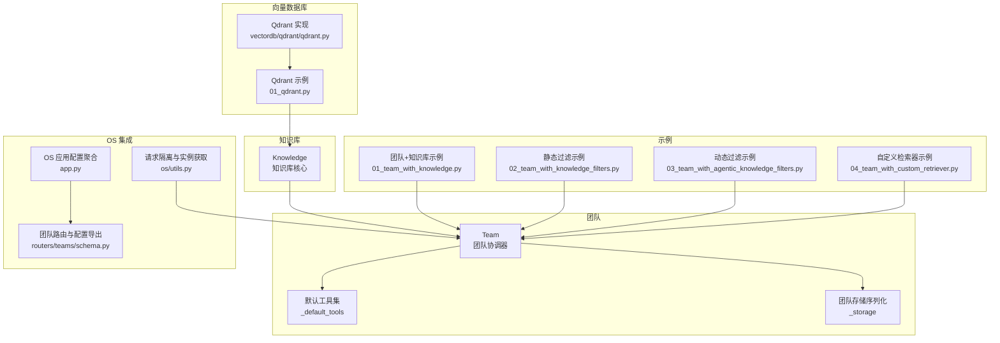
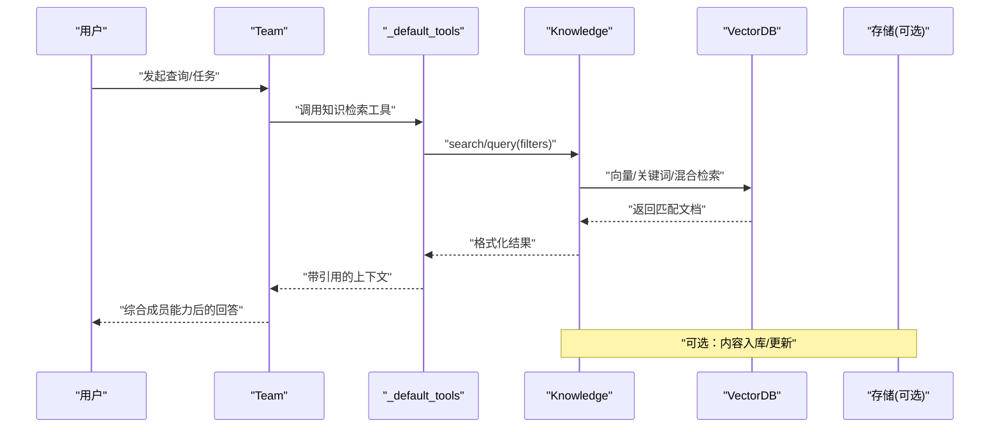
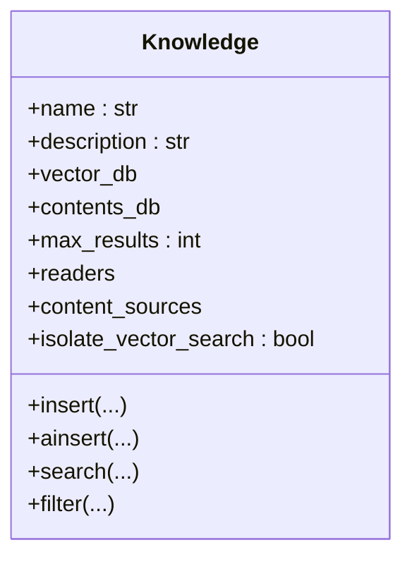
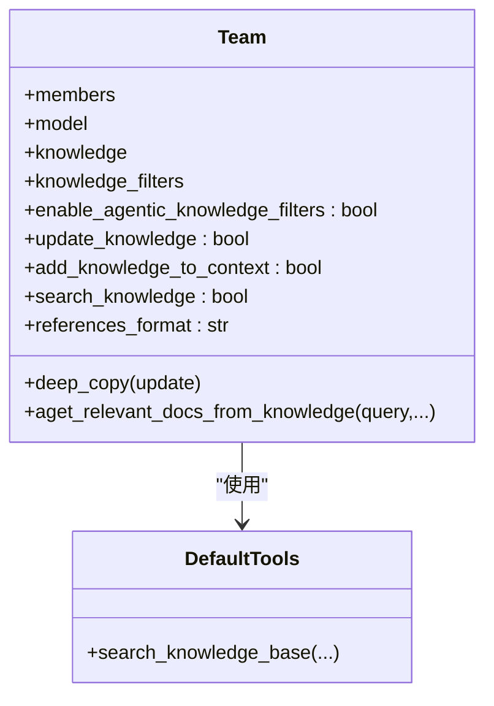
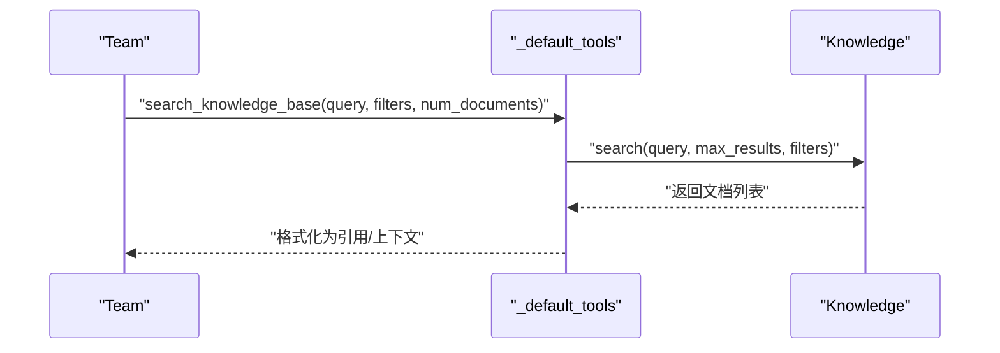
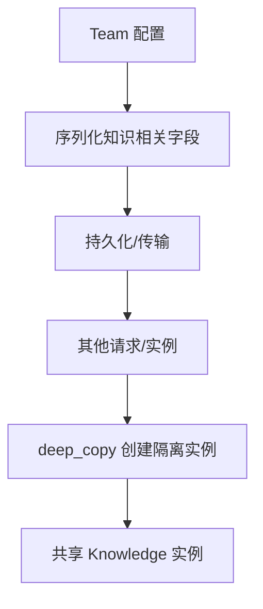
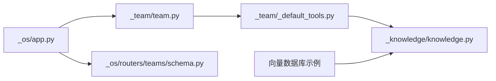

# 团队知识基础

<cite>
**本文引用的文件**
- [libs/agno/agno/knowledge/knowledge.py](file://libs/agno/agno/knowledge/knowledge.py)
- [libs/agno/agno/team/team.py](file://libs/agno/agno/team/team.py)
- [libs/agno/agno/team/_default_tools.py](file://libs/agno/agno/team/_default_tools.py)
- [libs/agno/agno/team/_storage.py](file://libs/agno/agno/team/_storage.py)
- [libs/agno/agno/os/app.py](file://libs/agno/agno/os/app.py)
- [libs/agno/agno/os/routers/teams/schema.py](file://libs/agno/agno/os/routers/teams/schema.py)
- [libs/agno/agno/os/utils.py](file://libs/agno/agno/os/utils.py)
- [libs/agno/agno/db/mongo/schemas.py](file://libs/agno/agno/db/mongo/schemas.py)
- [libs/agno/tests/integration/os/test_per_request_isolation.py](file://libs/agno/tests/integration/os/test_per_request_isolation.py)
- [cookbook/03_teams/05_knowledge/README.md](file://cookbook/03_teams/05_knowledge/README.md)
- [cookbook/03_teams/05_knowledge/01_team_with_knowledge.py](file://cookbook/03_teams/05_knowledge/01_team_with_knowledge.py)
- [cookbook/03_teams/05_knowledge/02_team_with_knowledge_filters.py](file://cookbook/03_teams/05_knowledge/02_team_with_knowledge_filters.py)
- [cookbook/03_teams/05_knowledge/03_team_with_agentic_knowledge_filters.py](file://cookbook/03_teams/05_knowledge/03_team_with_agentic_knowledge_filters.py)
- [cookbook/03_teams/05_knowledge/04_team_with_custom_retriever.py](file://cookbook/03_teams/05_knowledge/04_team_with_custom_retriever.py)
- [cookbook/07_knowledge/05_integrations/vector_dbs/01_qdrant.py](file://cookbook/07_knowledge/05_integrations/vector_dbs/01_qdrant.py)
- [libs/agno/agno/vectordb/qdrant/qdrant.py](file://libs/agno/agno/vectordb/qdrant/qdrant.py)
</cite>

## 目录
1. [简介](#简介)
2. [项目结构](#项目结构)
3. [核心组件](#核心组件)
4. [架构总览](#架构总览)
5. [详细组件分析](#详细组件分析)
6. [依赖分析](#依赖分析)
7. [性能考虑](#性能考虑)
8. [故障排除指南](#故障排除指南)
9. [结论](#结论)
10. [附录](#附录)

## 简介
本章节面向团队协作场景，系统性介绍如何在团队中集成与使用知识库，涵盖团队知识库的创建、配置与基本使用方法；对比团队知识库与单个代理知识库的差异与优势；给出团队环境下的知识库初始化、配置参数与查询操作的示例路径；说明团队知识库的共享机制与多代理访问方式；并总结常见使用场景、最佳实践与基本故障排除方法。

## 项目结构
围绕“团队知识基础”的相关代码主要分布在以下区域：
- 知识库核心实现：libs/agno/agno/knowledge/knowledge.py
- 团队核心实现与知识检索工具：libs/agno/agno/team/team.py、libs/agno/agno/team/_default_tools.py
- 团队配置序列化与知识配置聚合：libs/agno/agno/team/_storage.py、libs/agno/agno/os/app.py
- 团队路由与知识配置导出：libs/agno/agno/os/routers/teams/schema.py
- 示例与用法：cookbook/03_teams/05_knowledge/*.py
- 向量数据库集成示例：cookbook/07_knowledge/05_integrations/vector_dbs/*.py

图表来源
- [libs/agno/agno/knowledge/knowledge.py](file://libs/agno/agno/knowledge/knowledge.py)
- [libs/agno/agno/team/team.py](file://libs/agno/agno/team/team.py)
- [libs/agno/agno/team/_default_tools.py](file://libs/agno/agno/team/_default_tools.py)
- [libs/agno/agno/team/_storage.py](file://libs/agno/agno/team/_storage.py)
- [libs/agno/agno/os/app.py](file://libs/agno/agno/os/app.py)
- [libs/agno/agno/os/routers/teams/schema.py](file://libs/agno/agno/os/routers/teams/schema.py)
- [libs/agno/agno/os/utils.py](file://libs/agno/agno/os/utils.py)
- [cookbook/03_teams/05_knowledge/01_team_with_knowledge.py](file://cookbook/03_teams/05_knowledge/01_team_with_knowledge.py)
- [cookbook/03_teams/05_knowledge/02_team_with_knowledge_filters.py](file://cookbook/03_teams/05_knowledge/02_team_with_knowledge_filters.py)
- [cookbook/03_teams/05_knowledge/03_team_with_agentic_knowledge_filters.py](file://cookbook/03_teams/05_knowledge/03_team_with_agentic_knowledge_filters.py)
- [cookbook/03_teams/05_knowledge/04_team_with_custom_retriever.py](file://cookbook/03_teams/05_knowledge/04_team_with_custom_retriever.py)
- [cookbook/07_knowledge/05_integrations/vector_dbs/01_qdrant.py](file://cookbook/07_knowledge/05_integrations/vector_dbs/01_qdrant.py)
- [libs/agno/agno/vectordb/qdrant/qdrant.py](file://libs/agno/agno/vectordb/qdrant/qdrant.py)

章节来源
- [cookbook/03_teams/05_knowledge/README.md](file://cookbook/03_teams/05_knowledge/README.md)
- [libs/agno/agno/knowledge/knowledge.py](file://libs/agno/agno/knowledge/knowledge.py)
- [libs/agno/agno/team/team.py](file://libs/agno/agno/team/team.py)
- [libs/agno/agno/team/_default_tools.py](file://libs/agno/agno/team/_default_tools.py)
- [libs/agno/agno/team/_storage.py](file://libs/agno/agno/team/_storage.py)
- [libs/agno/agno/os/app.py](file://libs/agno/agno/os/app.py)
- [libs/agno/agno/os/routers/teams/schema.py](file://libs/agno/agno/os/routers/teams/schema.py)
- [libs/agno/agno/os/utils.py](file://libs/agno/agno/os/utils.py)
- [cookbook/03_teams/05_knowledge/01_team_with_knowledge.py](file://cookbook/03_teams/05_knowledge/01_team_with_knowledge.py)
- [cookbook/03_teams/05_knowledge/02_team_with_knowledge_filters.py](file://cookbook/03_teams/05_knowledge/02_team_with_knowledge_filters.py)
- [cookbook/03_teams/05_knowledge/03_team_with_agentic_knowledge_filters.py](file://cookbook/03_teams/05_knowledge/03_team_with_agentic_knowledge_filters.py)
- [cookbook/03_teams/05_knowledge/04_team_with_custom_retriever.py](file://cookbook/03_teams/05_knowledge/04_team_with_custom_retriever.py)
- [cookbook/07_knowledge/05_integrations/vector_dbs/01_qdrant.py](file://cookbook/07_knowledge/05_integrations/vector_dbs/01_qdrant.py)
- [libs/agno/agno/vectordb/qdrant/qdrant.py](file://libs/agno/agno/vectordb/qdrant/qdrant.py)

## 核心组件
- 知识库 Knowledge：负责内容插入、索引、检索与过滤，支持多种向量数据库与嵌入器。
- 团队 Team：负责成员编排、上下文管理、会话持久化与知识检索工具集成。
- 默认工具集 _default_tools：提供团队内通用工具，包括知识检索、会话历史、状态更新等。
- 团队存储序列化 _storage：将团队配置（含知识相关参数）序列化与反序列化。
- OS 集成：应用层聚合知识库实例、构建知识域配置，并在路由层导出团队与知识配置。

章节来源
- [libs/agno/agno/knowledge/knowledge.py](file://libs/agno/agno/knowledge/knowledge.py)
- [libs/agno/agno/team/team.py](file://libs/agno/agno/team/team.py)
- [libs/agno/agno/team/_default_tools.py](file://libs/agno/agno/team/_default_tools.py)
- [libs/agno/agno/team/_storage.py](file://libs/agno/agno/team/_storage.py)
- [libs/agno/agno/os/app.py](file://libs/agno/agno/os/app.py)

## 架构总览
团队知识库在系统中的位置与交互如下：

图表来源
- [libs/agno/agno/team/team.py](file://libs/agno/agno/team/team.py)
- [libs/agno/agno/team/_default_tools.py](file://libs/agno/agno/team/_default_tools.py)
- [libs/agno/agno/knowledge/knowledge.py](file://libs/agno/agno/knowledge/knowledge.py)

## 详细组件分析

### 组件一：知识库 Knowledge（团队共享的核心）
- 职责与能力
  - 内容插入与批量插入（支持路径、URL、文本、远程内容等）
  - 向量数据库集成与检索（支持向量/关键词/混合/重排序）
  - 元数据过滤与动态过滤（静态/动态两种）
  - 可选隔离模式（isolate_vector_search）以避免多知识库共享同一向量库时的交叉影响
- 关键点
  - 支持异步/同步插入与检索
  - 可与多种向量数据库对接（如 Qdrant、LanceDB、PgVector 等）
  - 提供检索接口供团队工具调用

图表来源
- [libs/agno/agno/knowledge/knowledge.py](file://libs/agno/agno/knowledge/knowledge.py)

章节来源
- [libs/agno/agno/knowledge/knowledge.py](file://libs/agno/agno/knowledge/knowledge.py)
- [cookbook/07_knowledge/05_integrations/vector_dbs/01_qdrant.py](file://cookbook/07_knowledge/05_integrations/vector_dbs/01_qdrant.py)
- [libs/agno/agno/vectordb/qdrant/qdrant.py](file://libs/agno/agno/vectordb/qdrant/qdrant.py)

### 组件二：团队 Team（知识检索与编排）
- 职责与能力
  - 成员编排与任务委派
  - 会话状态与历史管理
  - 集成知识检索工具（默认或自定义）
  - 知识过滤策略（静态/动态）、引用格式控制、是否将知识加入上下文
- 关键点
  - 支持异步检索文档：aget_relevant_docs_from_knowledge
  - 支持 deep_copy，用于请求隔离与并发安全
  - 通过 _storage 序列化知识相关配置（如 filters、update_knowledge 等）

图表来源
- [libs/agno/agno/team/team.py](file://libs/agno/agno/team/team.py)
- [libs/agno/agno/team/_default_tools.py](file://libs/agno/agno/team/_default_tools.py)

章节来源
- [libs/agno/agno/team/team.py](file://libs/agno/agno/team/team.py)
- [libs/agno/agno/team/_default_tools.py](file://libs/agno/agno/team/_default_tools.py)
- [libs/agno/agno/team/_storage.py](file://libs/agno/agno/team/_storage.py)

### 组件三：默认工具与检索流程（团队内知识检索）
- 能力概览
  - 提供“搜索知识库”工具，支持传入查询、数量限制、过滤条件与运行上下文
  - 支持从团队配置中读取过滤策略与引用格式
  - 可与自定义检索器配合使用
- 关键流程

图表来源
- [libs/agno/agno/team/_default_tools.py](file://libs/agno/agno/team/_default_tools.py)
- [libs/agno/agno/knowledge/knowledge.py](file://libs/agno/agno/knowledge/knowledge.py)

章节来源
- [libs/agno/agno/team/_default_tools.py](file://libs/agno/agno/team/_default_tools.py)
- [libs/agno/agno/knowledge/knowledge.py](file://libs/agno/agno/knowledge/knowledge.py)

### 组件四：团队知识配置与共享机制
- 配置序列化
  - 团队配置中可包含知识过滤、引用格式、是否更新知识、是否将知识加入上下文等参数
  - 通过 _storage 序列化这些字段，便于持久化与跨进程传递
- 共享与深拷贝
  - 测试显示：团队与其成员的 Knowledge 实例在 deep_copy 前是共享的，以保证多代理访问同一知识库
  - OS 层提供按需创建“新鲜实例”的 deep_copy，避免并发请求间的状态污染
- OS 配置聚合
  - OS 应用层遍历已注册的知识库实例，生成知识域配置与数据库表清单，供路由层导出

图表来源
- [libs/agno/agno/team/_storage.py](file://libs/agno/agno/team/_storage.py)
- [libs/agno/tests/integration/os/test_per_request_isolation.py](file://libs/agno/tests/integration/os/test_per_request_isolation.py)
- [libs/agno/agno/os/utils.py](file://libs/agno/agno/os/utils.py)
- [libs/agno/agno/os/app.py](file://libs/agno/agno/os/app.py)

章节来源
- [libs/agno/agno/team/_storage.py](file://libs/agno/agno/team/_storage.py)
- [libs/agno/tests/integration/os/test_per_request_isolation.py](file://libs/agno/tests/integration/os/test_per_request_isolation.py)
- [libs/agno/agno/os/utils.py](file://libs/agno/agno/os/utils.py)
- [libs/agno/agno/os/app.py](file://libs/agno/agno/os/app.py)

### 组件五：示例与用法（团队知识库实战）
- 团队+知识库（基础）
  - 初始化 Knowledge 并插入内容，创建 Agent 与 Team，启用知识检索与 Markdown 输出
  - 示例路径：cookbook/03_teams/05_knowledge/01_team_with_knowledge.py
- 静态知识过滤
  - 通过 knowledge_filters 对检索结果进行静态元数据过滤
  - 示例路径：cookbook/03_teams/05_knowledge/02_team_with_knowledge_filters.py
- 动态知识过滤
  - 通过 enable_agentic_knowledge_filters 开启 AI 驱动的动态过滤
  - 示例路径：cookbook/03_teams/05_knowledge/03_team_with_agentic_knowledge_filters.py
- 自定义检索器
  - 通过 knowledge_retriever 接收运行时依赖（如项目 ID、角色、团队上下文），实现灵活检索
  - 示例路径：cookbook/03_teams/05_knowledge/04_team_with_custom_retriever.py

章节来源
- [cookbook/03_teams/05_knowledge/01_team_with_knowledge.py](file://cookbook/03_teams/05_knowledge/01_team_with_knowledge.py)
- [cookbook/03_teams/05_knowledge/02_team_with_knowledge_filters.py](file://cookbook/03_teams/05_knowledge/02_team_with_knowledge_filters.py)
- [cookbook/03_teams/05_knowledge/03_team_with_agentic_knowledge_filters.py](file://cookbook/03_teams/05_knowledge/03_team_with_agentic_knowledge_filters.py)
- [cookbook/03_teams/05_knowledge/04_team_with_custom_retriever.py](file://cookbook/03_teams/05_knowledge/04_team_with_custom_retriever.py)

## 依赖分析
- 组件耦合
  - Team 依赖 _default_tools 提供知识检索工具
  - _default_tools 依赖 Knowledge 执行检索
  - OS 层通过 app.py 聚合知识库实例，供路由层导出
- 外部依赖
  - 向量数据库（如 Qdrant、LanceDB、PgVector）作为 Knowledge 的底层存储
- 潜在循环依赖
  - 当前模块划分清晰，Team 与 _default_tools 之间为单向依赖，未见循环

图表来源
- [libs/agno/agno/team/team.py](file://libs/agno/agno/team/team.py)
- [libs/agno/agno/team/_default_tools.py](file://libs/agno/agno/team/_default_tools.py)
- [libs/agno/agno/knowledge/knowledge.py](file://libs/agno/agno/knowledge/knowledge.py)
- [libs/agno/agno/os/app.py](file://libs/agno/agno/os/app.py)
- [libs/agno/agno/os/routers/teams/schema.py](file://libs/agno/agno/os/routers/teams/schema.py)
- [cookbook/07_knowledge/05_integrations/vector_dbs/01_qdrant.py](file://cookbook/07_knowledge/05_integrations/vector_dbs/01_qdrant.py)

章节来源
- [libs/agno/agno/team/team.py](file://libs/agno/agno/team/team.py)
- [libs/agno/agno/team/_default_tools.py](file://libs/agno/agno/team/_default_tools.py)
- [libs/agno/agno/knowledge/knowledge.py](file://libs/agno/agno/knowledge/knowledge.py)
- [libs/agno/agno/os/app.py](file://libs/agno/agno/os/app.py)
- [libs/agno/agno/os/routers/teams/schema.py](file://libs/agno/agno/os/routers/teams/schema.py)
- [cookbook/07_knowledge/05_integrations/vector_dbs/01_qdrant.py](file://cookbook/07_knowledge/05_integrations/vector_dbs/01_qdrant.py)

## 性能考虑
- 检索性能
  - 合理设置 max_results 与向量数据库的搜索类型（向量/关键词/混合/重排序）
  - 使用合适的嵌入器与向量维度，平衡精度与速度
- 并发与隔离
  - 使用 deep_copy 创建请求隔离实例，避免共享状态导致的额外开销与竞态
- 存储与索引
  - 对共享向量库启用 isolate_vector_search，减少不必要的过滤成本
  - 合理选择向量数据库（如 Qdrant 的混合检索与重排序能力）

## 故障排除指南
- 知识库未命中或命中过多
  - 检查 filters 设置（静态/动态）与引用格式
  - 调整 max_results 与向量数据库搜索类型
- 多代理访问异常
  - 确认 deep_copy 的使用，避免共享状态污染
  - 如需严格隔离，确保每次请求创建 fresh 实例
- 向量数据库连接问题
  - 校验连接参数（地址、端口、密钥等）
  - 确认集合/表存在且具备相应权限
- 路由与配置导出
  - 确保 OS 层已正确聚合知识库实例并导出配置

章节来源
- [libs/agno/agno/os/utils.py](file://libs/agno/agno/os/utils.py)
- [libs/agno/agno/os/app.py](file://libs/agno/agno/os/app.py)
- [libs/agno/agno/os/routers/teams/schema.py](file://libs/agno/agno/os/routers/teams/schema.py)
- [libs/agno/agno/db/mongo/schemas.py](file://libs/agno/agno/db/mongo/schemas.py)

## 结论
团队知识库通过“共享知识库 + 多代理访问 + 可插拔检索工具”的方式，实现了低成本、高复用的知识共享与检索。相比单个代理知识库，团队知识库在一致性、可维护性与扩展性方面具有明显优势。结合静态/动态过滤、自定义检索器与请求隔离机制，可在复杂团队协作场景中稳定落地。

## 附录

### A. 团队知识库与单个代理知识库的区别与优势
- 区别
  - 单个代理知识库：每个代理独立维护一份知识库，重复建设与维护成本高
  - 团队知识库：团队共享同一知识库实例，统一治理、统一检索、统一更新
- 优势
  - 降低重复索引与存储成本
  - 统一的过滤与检索策略
  - 更强的可扩展性与可运维性

### B. 常见使用场景与最佳实践
- 场景
  - 跨部门协作：统一知识库支撑多团队问答与决策
  - 产品/研发团队：共享文档与规范，提升检索质量
  - 客户服务：统一 FAQ 与案例库，保障一致回复
- 最佳实践
  - 明确知识库边界与隔离策略（isolate_vector_search）
  - 合理设计过滤规则（静态/动态），兼顾准确性与性能
  - 使用 deep_copy 保障并发安全
  - 选择合适的向量数据库与检索类型

### C. 代码示例路径（不直接展示代码内容）
- 团队+知识库（基础）
  - [示例入口](file://cookbook/03_teams/05_knowledge/01_team_with_knowledge.py)
- 静态知识过滤
  - [示例入口](file://cookbook/03_teams/05_knowledge/02_team_with_knowledge_filters.py)
- 动态知识过滤
  - [示例入口](file://cookbook/03_teams/05_knowledge/03_team_with_agentic_knowledge_filters.py)
- 自定义检索器
  - [示例入口](file://cookbook/03_teams/05_knowledge/04_team_with_custom_retriever.py)
- 向量数据库集成（Qdrant）
  - [示例入口](file://cookbook/07_knowledge/05_integrations/vector_dbs/01_qdrant.py)
  - [实现入口](file://libs/agno/agno/vectordb/qdrant/qdrant.py)