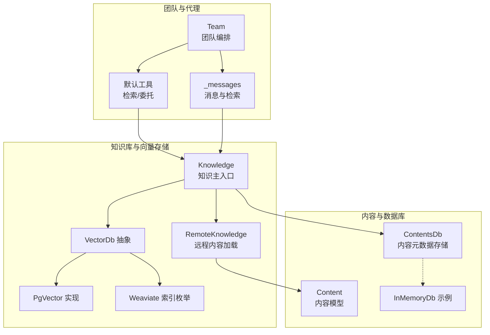
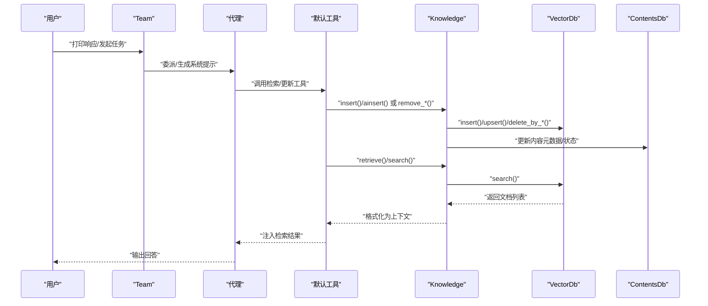
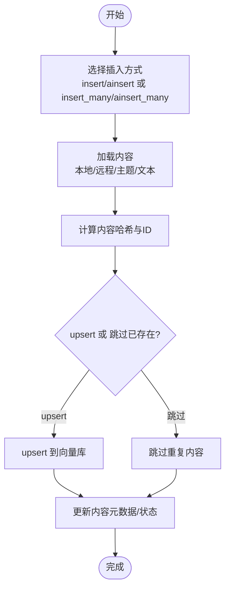
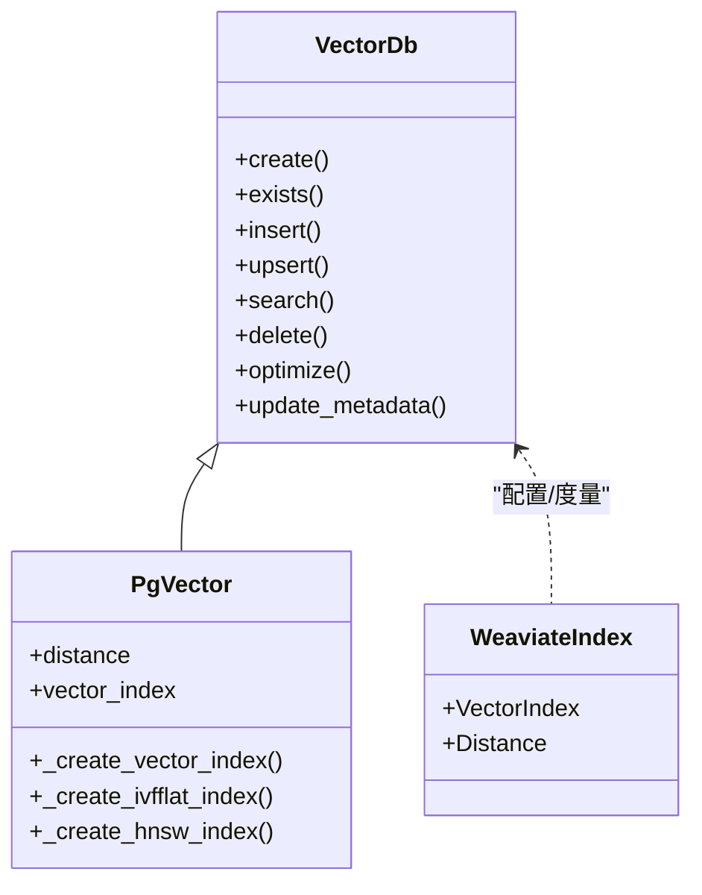
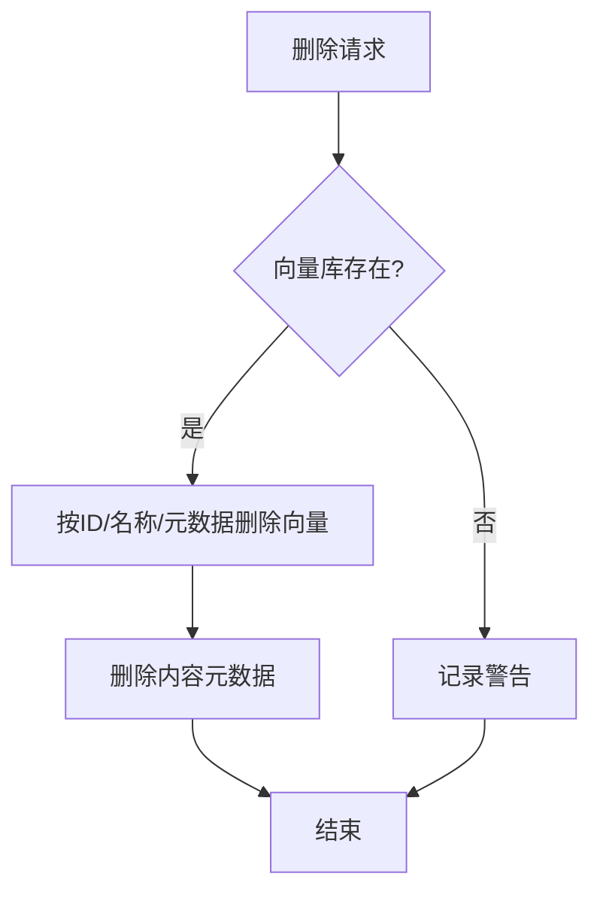
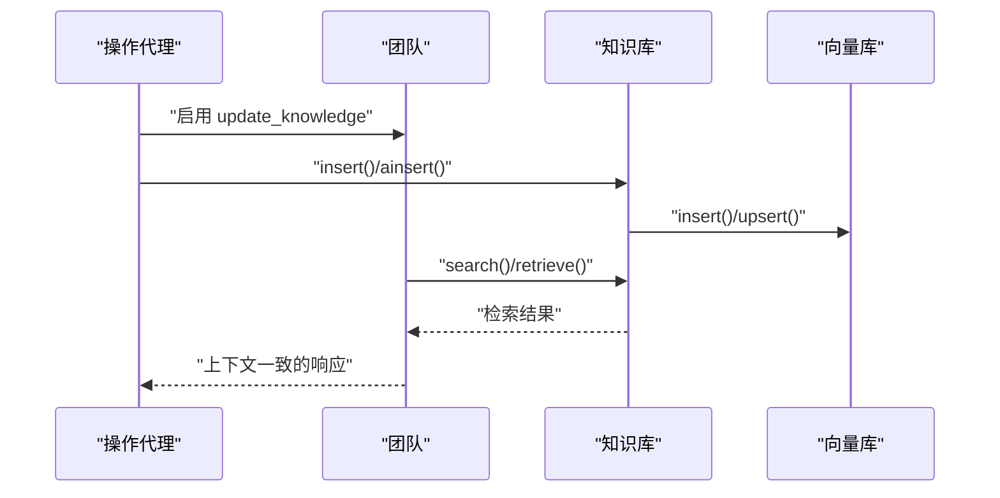
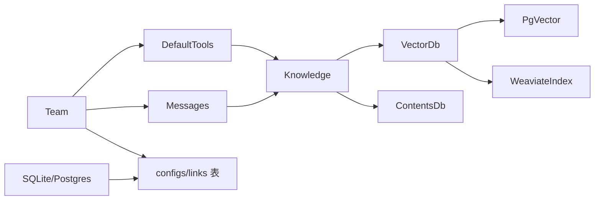

# 团队知识更新

<cite>
**本文引用的文件**
- [libs/agno/agno/knowledge/knowledge.py](file://libs/agno/agno/knowledge/knowledge.py)
- [libs/agno/agno/knowledge/protocol.py](file://libs/agno/agno/knowledge/protocol.py)
- [libs/agno/agno/knowledge/remote_knowledge.py](file://libs/agno/agno/knowledge/remote_knowledge.py)
- [libs/agno/agno/vectordb/base.py](file://libs/agno/agno/vectordb/base.py)
- [libs/agno/agno/vectordb/pgvector/pgvector.py](file://libs/agno/agno/vectordb/pgvector/pgvector.py)
- [libs/agno/agno/vectordb/weaviate/index.py](file://libs/agno/agno/vectordb/weaviate/index.py)
- [libs/agno/agno/db/in_memory/in_memory_db.py](file://libs/agno/agno/db/in_memory/in_memory_db.py)
- [libs/agno/agno/team/_default_tools.py](file://libs/agno/agno/team/_default_tools.py)
- [libs/agno/agno/agent/_messages.py](file://libs/agno/agno/agent/_messages.py)
- [libs/agno/agno/team/team.py](file://libs/agno/agno/team/team.py)
- [cookbook/03_teams/05_knowledge/05_team_update_knowledge.py](file://cookbook/03_teams/05_knowledge/05_team_update_knowledge.py)
- [cookbook/07_knowledge/03_production/02_knowledge_lifecycle.py](file://cookbook/07_knowledge/03_production/02_knowledge_lifecycle.py)
- [cookbook/07_knowledge/09_archive/remove_vectors.py](file://cookbook/07_knowledge/09_archive/remove_vectors.py)
- [libs/agno/tests/unit/knowledge/test_knowledge_insert_many_auth.py](file://libs/agno/tests/unit/knowledge/test_knowledge_insert_many_auth.py)
- [libs/agno/tests/unit/knowledge/test_knowledge_encoding.py](file://libs/agno/tests/unit/knowledge/test_knowledge_encoding.py)
- [libs/agno/agno/db/sqlite/sqlite.py](file://libs/agno/agno/db/sqlite/sqlite.py)
- [libs/agno/agno/db/postgres/postgres.py](file://libs/agno/agno/db/postgres/postgres.py)
</cite>

## 目录
1. [简介](#简介)
2. [项目结构](#项目结构)
3. [核心组件](#核心组件)
4. [架构总览](#架构总览)
5. [详细组件分析](#详细组件分析)
6. [依赖分析](#依赖分析)
7. [性能考量](#性能考量)
8. [故障排查指南](#故障排查指南)
9. [结论](#结论)
10. [附录](#附录)

## 简介
本文件围绕“团队知识更新”主题，系统阐述团队知识库的动态更新机制，覆盖知识内容的添加、删除、修改与版本管理；解释知识更新的触发条件与策略（增量更新、批量更新、实时同步）；给出内容加载、向量化处理、索引更新与缓存清理的实现路径；并讨论在多代理协作场景下如何保证知识一致性，以及最佳实践、性能优化与故障恢复策略。

## 项目结构
本仓库将“知识库”能力抽象为可插拔的向量数据库与内容管理模块，并通过协议接口统一对外暴露检索与工具能力。团队（Team）通过配置启用“更新知识”的能力，使成员在对话过程中可将新事实写入知识库，并被后续检索使用。

图表来源
- [libs/agno/agno/knowledge/knowledge.py:40-65](file://libs/agno/agno/knowledge/knowledge.py#L40-L65)
- [libs/agno/agno/knowledge/remote_knowledge.py:30-48](file://libs/agno/agno/knowledge/remote_knowledge.py#L30-L48)
- [libs/agno/agno/vectordb/base.py:9-153](file://libs/agno/agno/vectordb/base.py#L9-L153)
- [libs/agno/agno/vectordb/pgvector/pgvector.py:1065-1370](file://libs/agno/agno/vectordb/pgvector/pgvector.py#L1065-L1370)
- [libs/agno/agno/vectordb/weaviate/index.py:1-15](file://libs/agno/agno/vectordb/weaviate/index.py#L1-L15)
- [libs/agno/agno/db/in_memory/in_memory_db.py:828-872](file://libs/agno/agno/db/in_memory/in_memory_db.py#L828-L872)
- [libs/agno/agno/team/_default_tools.py:1540-1563](file://libs/agno/agno/team/_default_tools.py#L1540-L1563)
- [libs/agno/agno/agent/_messages.py:1893-1925](file://libs/agno/agno/agent/_messages.py#L1893-L1925)
- [libs/agno/agno/team/team.py:1662-1702](file://libs/agno/agno/team/team.py#L1662-L1702)

章节来源
- [libs/agno/agno/knowledge/knowledge.py:40-65](file://libs/agno/agno/knowledge/knowledge.py#L40-L65)
- [libs/agno/agno/knowledge/remote_knowledge.py:30-48](file://libs/agno/agno/knowledge/remote_knowledge.py#L30-L48)
- [libs/agno/agno/vectordb/base.py:9-153](file://libs/agno/agno/vectordb/base.py#L9-L153)
- [libs/agno/agno/db/in_memory/in_memory_db.py:828-872](file://libs/agno/agno/db/in_memory/in_memory_db.py#L828-L872)
- [libs/agno/agno/team/_default_tools.py:1540-1563](file://libs/agno/agno/team/_default_tools.py#L1540-L1563)
- [libs/agno/agno/agent/_messages.py:1893-1925](file://libs/agno/agno/agent/_messages.py#L1893-L1925)
- [libs/agno/agno/team/team.py:1662-1702](file://libs/agno/agno/team/team.py#L1662-L1702)

## 核心组件
- 知识库主入口（Knowledge）：提供插入、批量插入、检索、内容管理（增删改查）、过滤器支持与隔离搜索等能力。内部协调内容读取器、远程内容加载器与向量数据库。
- 协议（KnowledgeProtocol）：定义最小接口，确保不同知识实现可被代理与团队统一使用。
- 远程知识（RemoteKnowledge）：聚合多种云存储内容加载器，支持从 S3/GCS/SharePoint/GitHub/Azure Blob 等加载内容。
- 向量数据库（VectorDb 抽象 + PgVector 实现）：抽象统一的插入、更新、删除、搜索与索引优化接口；PgVector 提供具体索引类型与距离度量实现。
- 内容与数据库（Content、ContentsDb、InMemoryDb）：内容模型与内容元数据存储，支持按 ID/名称/元数据删除向量与内容。
- 团队与代理（Team、默认工具、消息层）：团队可启用“更新知识”，代理可通过检索工具访问知识库，或在上下文中直接注入检索结果。

章节来源
- [libs/agno/agno/knowledge/knowledge.py:40-65](file://libs/agno/agno/knowledge/knowledge.py#L40-L65)
- [libs/agno/agno/knowledge/protocol.py:18-135](file://libs/agno/agno/knowledge/protocol.py#L18-L135)
- [libs/agno/agno/knowledge/remote_knowledge.py:30-48](file://libs/agno/agno/knowledge/remote_knowledge.py#L30-L48)
- [libs/agno/agno/vectordb/base.py:9-153](file://libs/agno/agno/vectordb/base.py#L9-L153)
- [libs/agno/agno/vectordb/pgvector/pgvector.py:1065-1370](file://libs/agno/agno/vectordb/pgvector/pgvector.py#L1065-L1370)
- [libs/agno/agno/db/in_memory/in_memory_db.py:828-872](file://libs/agno/agno/db/in_memory/in_memory_db.py#L828-L872)
- [libs/agno/agno/team/_default_tools.py:1540-1563](file://libs/agno/agno/team/_default_tools.py#L1540-L1563)
- [libs/agno/agno/agent/_messages.py:1893-1925](file://libs/agno/agno/agent/_messages.py#L1893-L1925)
- [libs/agno/agno/team/team.py:1662-1702](file://libs/agno/agno/team/team.py#L1662-L1702)

## 架构总览
团队知识更新涉及“内容加载—向量化—索引更新—缓存清理—检索注入”的闭环。下图展示从团队启用“更新知识”到代理检索的关键流程。

图表来源
- [libs/agno/agno/team/team.py:1662-1702](file://libs/agno/agno/team/team.py#L1662-L1702)
- [libs/agno/agno/team/_default_tools.py:1540-1563](file://libs/agno/agno/team/_default_tools.py#L1540-L1563)
- [libs/agno/agno/agent/_messages.py:1893-1925](file://libs/agno/agno/agent/_messages.py#L1893-L1925)
- [libs/agno/agno/knowledge/knowledge.py:90-156](file://libs/agno/agno/knowledge/knowledge.py#L90-L156)
- [libs/agno/agno/vectordb/base.py:64-93](file://libs/agno/agno/vectordb/base.py#L64-L93)

章节来源
- [libs/agno/agno/team/team.py:1662-1702](file://libs/agno/agno/team/team.py#L1662-L1702)
- [libs/agno/agno/team/_default_tools.py:1540-1563](file://libs/agno/agno/team/_default_tools.py#L1540-L1563)
- [libs/agno/agno/agent/_messages.py:1893-1925](file://libs/agno/agno/agent/_messages.py#L1893-L1925)
- [libs/agno/agno/knowledge/knowledge.py:90-156](file://libs/agno/agno/knowledge/knowledge.py#L90-L156)
- [libs/agno/agno/vectordb/base.py:64-93](file://libs/agno/agno/vectordb/base.py#L64-L93)

## 详细组件分析

### 知识库动态更新机制
- 插入与批量插入
  - 同步/异步插入：支持文本、路径、URL、主题、远程内容等多种来源；自动计算内容哈希与 ID，可选择 upsert 或跳过已存在。
  - 批量插入：支持传入内容字典列表或分别传入路径/URL/文本数组，统一调度内部 insert/ainsert。
- 删除与修改
  - 按 ID/名称/元数据删除向量；按内容 ID 删除向量与内容元数据；清空全部内容。
  - 修改通过“删除旧内容 + 新增新内容”实现，或在支持的向量库上进行 upsert。
- 检索与上下文注入
  - 支持检索与异步检索；可注入隔离过滤（按知识库名称）；支持检索工具与上下文注入（add_knowledge_to_context）。
- 远程内容加载
  - 自动路由到 S3/GCS/SharePoint/GitHub/Azure Blob 等加载器，统一处理认证与配置。

图表来源
- [libs/agno/agno/knowledge/knowledge.py:90-156](file://libs/agno/agno/knowledge/knowledge.py#L90-L156)
- [libs/agno/agno/knowledge/knowledge.py:246-353](file://libs/agno/agno/knowledge/knowledge.py#L246-L353)
- [libs/agno/agno/knowledge/remote_knowledge.py:57-97](file://libs/agno/agno/knowledge/remote_knowledge.py#L57-L97)

章节来源
- [libs/agno/agno/knowledge/knowledge.py:90-156](file://libs/agno/agno/knowledge/knowledge.py#L90-L156)
- [libs/agno/agno/knowledge/knowledge.py:246-353](file://libs/agno/agno/knowledge/knowledge.py#L246-L353)
- [libs/agno/agno/knowledge/remote_knowledge.py:57-97](file://libs/agno/agno/knowledge/remote_knowledge.py#L57-L97)

### 向量化处理与索引更新
- 向量数据库抽象
  - 统一接口：create/exists/insert/upsert/search/delete 等；支持异步变体；提供优化与元数据更新占位。
- PgVector 实现
  - 支持 L2、余弦、最大内积等距离度量；根据数据规模动态选择索引类型（IVFFLAT/HNSW），并设置 probes/lists 等参数。
- Weaviate 索引枚举
  - 提供 HNSW/FLAT/DYNAMIC 等索引类型与多种距离度量枚举，便于统一配置与扩展。

图表来源
- [libs/agno/agno/vectordb/base.py:9-153](file://libs/agno/agno/vectordb/base.py#L9-L153)
- [libs/agno/agno/vectordb/pgvector/pgvector.py:1065-1370](file://libs/agno/agno/vectordb/pgvector/pgvector.py#L1065-L1370)
- [libs/agno/agno/vectordb/weaviate/index.py:1-15](file://libs/agno/agno/vectordb/weaviate/index.py#L1-L15)

章节来源
- [libs/agno/agno/vectordb/base.py:9-153](file://libs/agno/agno/vectordb/base.py#L9-L153)
- [libs/agno/agno/vectordb/pgvector/pgvector.py:1065-1370](file://libs/agno/agno/vectordb/pgvector/pgvector.py#L1065-L1370)
- [libs/agno/agno/vectordb/weaviate/index.py:1-15](file://libs/agno/agno/vectordb/weaviate/index.py#L1-L15)

### 缓存清理与一致性
- 内容与向量双写一致性
  - 删除内容时，同时删除向量库中的对应记录；删除失败时记录警告并抛出异常，避免脏数据。
- 隔离搜索
  - 当启用隔离搜索时，检索自动注入“链接到当前知识库”的过滤条件，避免跨知识库污染。
- 版本与链接
  - 团队保存时建立“版本 → 成员版本”的固定链接，加载时按链接精确恢复成员版本，确保知识库与成员状态一致。

图表来源
- [libs/agno/agno/knowledge/knowledge.py:698-733](file://libs/agno/agno/knowledge/knowledge.py#L698-L733)
- [libs/agno/agno/db/in_memory/in_memory_db.py:828-872](file://libs/agno/agno/db/in_memory/in_memory_db.py#L828-L872)

章节来源
- [libs/agno/agno/knowledge/knowledge.py:698-733](file://libs/agno/agno/knowledge/knowledge.py#L698-L733)
- [libs/agno/agno/db/in_memory/in_memory_db.py:828-872](file://libs/agno/agno/db/in_memory/in_memory_db.py#L828-L872)

### 团队协作中的知识一致性
- 更新触发与策略
  - 增量更新：代理在对话中调用“记住/更新知识”工具，立即写入知识库并触发向量索引更新。
  - 批量更新：通过批量插入接口一次性导入多条内容，适合初始化或迁移。
  - 实时同步：结合异步检索与上下文注入，确保最新知识在推理时被使用。
- 多代理一致性
  - 团队保存/加载采用“版本 + 链接”机制，确保不同成员在不同版本下仍能引用正确的知识库与工具。
  - 消息层与默认工具统一检索接口，避免因实现差异导致的知识不一致。

图表来源
- [cookbook/03_teams/05_knowledge/05_team_update_knowledge.py:17-58](file://cookbook/03_teams/05_knowledge/05_team_update_knowledge.py#L17-L58)
- [libs/agno/agno/team/team.py:1662-1702](file://libs/agno/agno/team/team.py#L1662-L1702)
- [libs/agno/agno/team/_default_tools.py:1540-1563](file://libs/agno/agno/team/_default_tools.py#L1540-L1563)
- [libs/agno/agno/agent/_messages.py:1893-1925](file://libs/agno/agno/agent/_messages.py#L1893-L1925)

章节来源
- [cookbook/03_teams/05_knowledge/05_team_update_knowledge.py:17-58](file://cookbook/03_teams/05_knowledge/05_team_update_knowledge.py#L17-L58)
- [libs/agno/agno/team/team.py:1662-1702](file://libs/agno/agno/team/team.py#L1662-L1702)
- [libs/agno/agno/team/_default_tools.py:1540-1563](file://libs/agno/agno/team/_default_tools.py#L1540-L1563)
- [libs/agno/agno/agent/_messages.py:1893-1925](file://libs/agno/agno/agent/_messages.py#L1893-L1925)

## 依赖分析
- 组件耦合
  - Knowledge 依赖 VectorDb 抽象与 ContentsDb；RemoteKnowledge 提供远程加载能力；Team 通过默认工具与消息层间接依赖 Knowledge。
- 外部依赖
  - 向量库实现（如 PgVector）依赖数据库驱动与索引配置；Weaviate 索引枚举提供统一配置入口。
- 版本与链接
  - SQLite/Postgres 数据库在 upsert 配置时校验标签唯一性与链接完整性，确保版本与成员关系稳定。

图表来源
- [libs/agno/agno/team/team.py:1662-1702](file://libs/agno/agno/team/team.py#L1662-L1702)
- [libs/agno/agno/team/_default_tools.py:1540-1563](file://libs/agno/agno/team/_default_tools.py#L1540-L1563)
- [libs/agno/agno/agent/_messages.py:1893-1925](file://libs/agno/agno/agent/_messages.py#L1893-L1925)
- [libs/agno/agno/knowledge/knowledge.py:40-65](file://libs/agno/agno/knowledge/knowledge.py#L40-L65)
- [libs/agno/agno/vectordb/base.py:9-153](file://libs/agno/agno/vectordb/base.py#L9-L153)
- [libs/agno/agno/vectordb/pgvector/pgvector.py:1065-1370](file://libs/agno/agno/vectordb/pgvector/pgvector.py#L1065-L1370)
- [libs/agno/agno/vectordb/weaviate/index.py:1-15](file://libs/agno/agno/vectordb/weaviate/index.py#L1-L15)
- [libs/agno/agno/db/sqlite/sqlite.py:3707-3815](file://libs/agno/agno/db/sqlite/sqlite.py#L3707-L3815)
- [libs/agno/agno/db/postgres/postgres.py:3839-3951](file://libs/agno/agno/db/postgres/postgres.py#L3839-L3951)

章节来源
- [libs/agno/agno/db/sqlite/sqlite.py:3707-3815](file://libs/agno/agno/db/sqlite/sqlite.py#L3707-L3815)
- [libs/agno/agno/db/postgres/postgres.py:3839-3951](file://libs/agno/agno/db/postgres/postgres.py#L3839-L3951)

## 性能考量
- 向量索引优化
  - 根据数据规模动态选择索引类型与参数（如 IVFFLAT 的 lists 与 probes、HNSW 的 m/ef_construction），提升检索性能与稳定性。
- 检索阈值与过滤
  - 设置相似度阈值与隔离过滤，减少无关结果，降低上下文膨胀与推理成本。
- 批量与异步
  - 使用批量插入与异步检索，提高吞吐；在高并发场景下建议配合限流与重试策略。
- 缓存与去重
  - 插入前计算内容哈希与 ID，避免重复向量；删除时同步清理向量与元数据，防止碎片与查询开销增长。

## 故障排查指南
- 插入失败或重复
  - 检查 upsert 与 skip_if_exists 参数组合；确认内容哈希是否正确生成；查看日志警告与异常堆栈。
- 删除无效
  - 确认向量库实现是否支持按 ID/名称/元数据删除；若使用特定实现（如 LightRAG），需通过外部 ID 删除。
- 检索不到预期结果
  - 检查隔离搜索是否开启及过滤条件是否正确；确认向量索引是否已创建且参数合理。
- 版本与链接问题
  - 保存/加载团队时检查标签唯一性与链接完整性；确保成员版本与团队版本的映射正确。

章节来源
- [libs/agno/agno/knowledge/knowledge.py:698-733](file://libs/agno/agno/knowledge/knowledge.py#L698-L733)
- [libs/agno/agno/db/sqlite/sqlite.py:3707-3815](file://libs/agno/agno/db/sqlite/sqlite.py#L3707-L3815)
- [libs/agno/agno/db/postgres/postgres.py:3839-3951](file://libs/agno/agno/db/postgres/postgres.py#L3839-L3951)

## 结论
团队知识更新以“协议 + 抽象 + 实现”的方式实现了可插拔的知识库体系：既能满足单代理的即时检索，也能支撑多代理协作下的知识一致性与版本治理。通过合理的更新策略（增量/批量/实时）、向量索引优化与严格的删除/隔离机制，可在保证性能的同时维持知识库的准确性与可用性。

## 附录
- 实战示例
  - 团队启用“更新知识”并进行检索：参见示例脚本路径。
  - 知识生命周期与批量更新：参见示例脚本路径。
  - 向量删除与重新插入：参见示例脚本路径。
- 单元测试参考
  - 批量插入传递认证参数：参见测试文件路径。
  - UTF-8 文本处理与替换：参见测试文件路径。

章节来源
- [cookbook/03_teams/05_knowledge/05_team_update_knowledge.py:17-58](file://cookbook/03_teams/05_knowledge/05_team_update_knowledge.py#L17-L58)
- [cookbook/07_knowledge/03_production/02_knowledge_lifecycle.py](file://cookbook/07_knowledge/03_production/02_knowledge_lifecycle.py)
- [cookbook/07_knowledge/09_archive/remove_vectors.py](file://cookbook/07_knowledge/09_archive/remove_vectors.py)
- [libs/agno/tests/unit/knowledge/test_knowledge_insert_many_auth.py:85-174](file://libs/agno/tests/unit/knowledge/test_knowledge_insert_many_auth.py#L85-L174)
- [libs/agno/tests/unit/knowledge/test_knowledge_encoding.py:140-169](file://libs/agno/tests/unit/knowledge/test_knowledge_encoding.py#L140-L169)