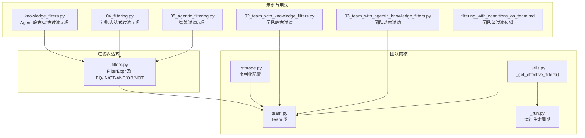
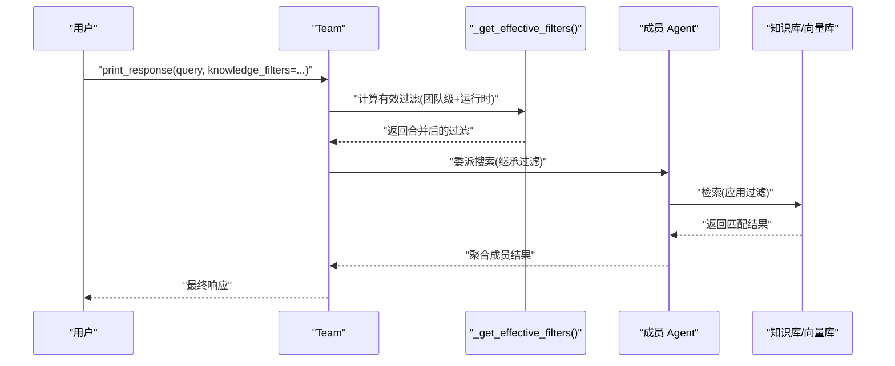
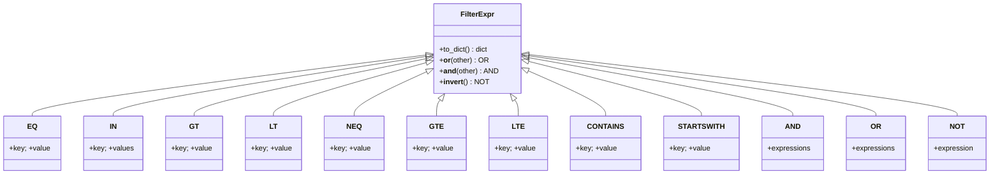
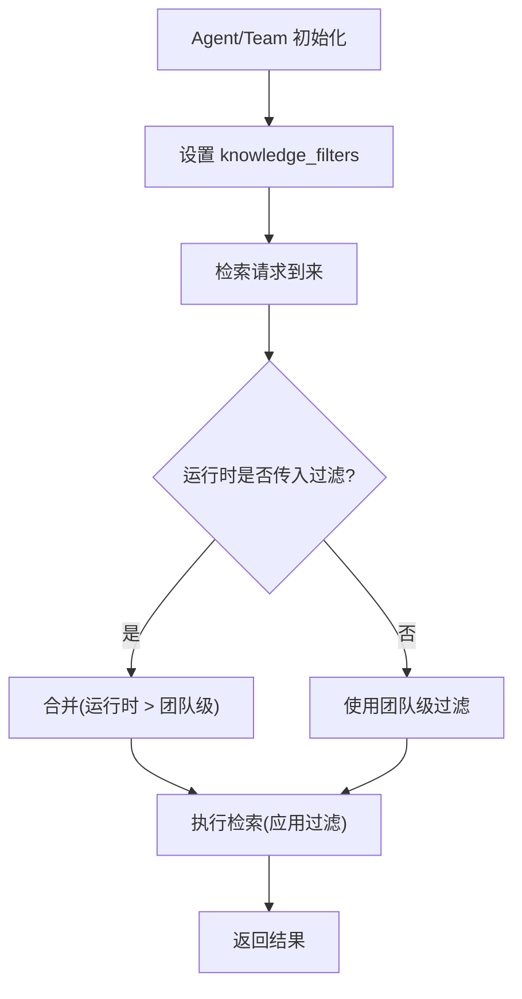
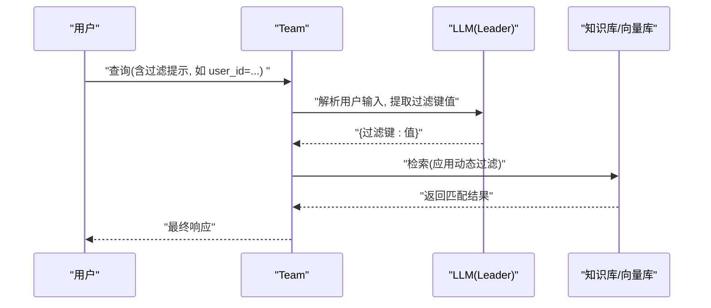
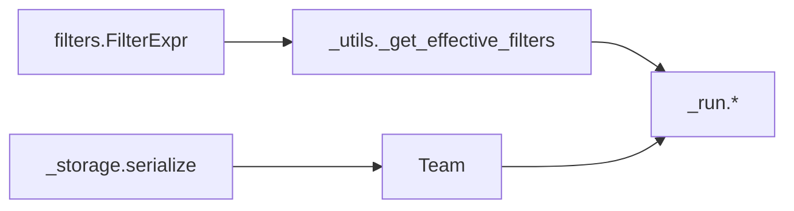

# 团队知识过滤

<cite>
**本文引用的文件**
- [filters.py](file://libs/agno/agno/filters.py)
- [team.py](file://libs/agno/agno/team/team.py)
- [_utils.py](file://libs/agno/agno/team/_utils.py)
- [_run.py](file://libs/agno/agno/team/_run.py)
- [_storage.py](file://libs/agno/agno/team/_storage.py)
- [knowledge_filters.py](file://cookbook/02_agents/07_knowledge/knowledge_filters.py)
- [04_filtering.py](file://cookbook/07_knowledge/02_building_blocks/04_filtering.py)
- [05_agentic_filtering.py](file://cookbook/07_knowledge/02_building_blocks/05_agentic_filtering.py)
- [02_team_with_knowledge_filters.py](file://cookbook/03_teams/05_knowledge/02_team_with_knowledge_filters.py)
- [03_team_with_agentic_knowledge_filters.py](file://cookbook/03_teams/05_knowledge/03_team_with_agentic_knowledge_filters.py)
- [filtering_with_conditions_on_team.md](file://cookbook/07_knowledge/filters/filtering_with_conditions_on_team.md)
</cite>

## 目录
1. [简介](#简介)
2. [项目结构](#项目结构)
3. [核心组件](#核心组件)
4. [架构总览](#架构总览)
5. [详细组件分析](#详细组件分析)
6. [依赖分析](#依赖分析)
7. [性能考虑](#性能考虑)
8. [故障排查指南](#故障排查指南)
9. [结论](#结论)
10. [附录](#附录)

## 简介
本文件系统化阐述团队知识过滤能力，覆盖传统（静态）知识过滤器与智能（动态）知识过滤器两类方案，解释其工作原理、配置方式、组合策略与在团队协作中的应用。重点包括：
- 过滤器类型与表达式体系（比较、包含、逻辑运算）
- 内容匹配、条件筛选与结果排序机制
- 静态过滤（团队级/成员级）、动态过滤（基于用户输入自动抽取过滤条件）
- 过滤器在多代理团队中的传播与优先级
- 性能优化、调试技巧与常见问题

## 项目结构
围绕“知识过滤”的相关代码主要分布在以下位置：
- 过滤表达式定义：libs/agno/agno/filters.py
- 团队运行与过滤传播：libs/agno/agno/team/*.py
- 示例与用法：cookbook/02_agents/07_knowledge、cookbook/03_teams/05_knowledge、cookbook/07_knowledge/02_building_blocks、cookbook/07_knowledge/filters

图表来源
- [filters.py:51-508](file://libs/agno/agno/filters.py#L51-L508)
- [team.py:70-200](file://libs/agno/agno/team/team.py#L70-L200)
- [_utils.py:24-55](file://libs/agno/agno/team/_utils.py#L24-L55)
- [_run.py:1-200](file://libs/agno/agno/team/_run.py#L1-L200)
- [_storage.py:520-537](file://libs/agno/agno/team/_storage.py#L520-L537)
- [knowledge_filters.py:1-71](file://cookbook/02_agents/07_knowledge/knowledge_filters.py#L1-L71)
- [04_filtering.py:1-142](file://cookbook/07_knowledge/02_building_blocks/04_filtering.py#L1-L142)
- [05_agentic_filtering.py:1-90](file://cookbook/07_knowledge/02_building_blocks/05_agentic_filtering.py#L1-L90)
- [02_team_with_knowledge_filters.py:1-111](file://cookbook/03_teams/05_knowledge/02_team_with_knowledge_filters.py#L1-L111)
- [03_team_with_agentic_knowledge_filters.py:1-110](file://cookbook/03_teams/05_knowledge/03_team_with_agentic_knowledge_filters.py#L1-L110)
- [filtering_with_conditions_on_team.md:1-126](file://cookbook/07_knowledge/filters/filtering_with_conditions_on_team.md#L1-L126)

章节来源
- [filters.py:1-508](file://libs/agno/agno/filters.py#L1-L508)
- [team.py:1-200](file://libs/agno/agno/team/team.py#L1-L200)
- [_utils.py:1-250](file://libs/agno/agno/team/_utils.py#L1-L250)
- [_run.py:1-200](file://libs/agno/agno/team/_run.py#L1-L200)
- [_storage.py:520-537](file://libs/agno/agno/team/_storage.py#L520-L537)
- [knowledge_filters.py:1-71](file://cookbook/02_agents/07_knowledge/knowledge_filters.py#L1-L71)
- [04_filtering.py:1-142](file://cookbook/07_knowledge/02_building_blocks/04_filtering.py#L1-L142)
- [05_agentic_filtering.py:1-90](file://cookbook/07_knowledge/02_building_blocks/05_agentic_filtering.py#L1-L90)
- [02_team_with_knowledge_filters.py:1-111](file://cookbook/03_teams/05_knowledge/02_team_with_knowledge_filters.py#L1-L111)
- [03_team_with_agentic_knowledge_filters.py:1-110](file://cookbook/03_teams/05_knowledge/03_team_with_agentic_knowledge_filters.py#L1-L110)
- [filtering_with_conditions_on_team.md:1-126](file://cookbook/07_knowledge/filters/filtering_with_conditions_on_team.md#L1-L126)

## 核心组件
- 过滤表达式体系：提供 EQ、IN、GT、LT、NEQ、GTE、LTE、CONTAINS、STARTSWITH、AND、OR、NOT 等操作符，支持复杂嵌套与序列化/反序列化。
- 团队过滤传播：Team 在运行期将团队级与运行时过滤合并，并在成员检索中继承生效；支持静态过滤与动态过滤两种模式。
- 示例与用法：Agent 与 Team 的静态/动态过滤配置示例，涵盖字典过滤、表达式过滤、组合条件、跨成员传播等。

章节来源
- [filters.py:51-508](file://libs/agno/agno/filters.py#L51-L508)
- [_utils.py:24-55](file://libs/agno/agno/team/_utils.py#L24-L55)
- [team.py:70-200](file://libs/agno/agno/team/team.py#L70-L200)
- [knowledge_filters.py:1-71](file://cookbook/02_agents/07_knowledge/knowledge_filters.py#L1-L71)
- [04_filtering.py:1-142](file://cookbook/07_knowledge/02_building_blocks/04_filtering.py#L1-L142)
- [05_agentic_filtering.py:1-90](file://cookbook/07_knowledge/02_building_blocks/05_agentic_filtering.py#L1-L90)
- [02_team_with_knowledge_filters.py:1-111](file://cookbook/03_teams/05_knowledge/02_team_with_knowledge_filters.py#L1-L111)
- [03_team_with_agentic_knowledge_filters.py:1-110](file://cookbook/03_teams/05_knowledge/03_team_with_agentic_knowledge_filters.py#L1-L110)

## 架构总览
团队知识过滤在“表达式定义—团队传播—成员检索—结果返回”全链路中生效。静态过滤在 Team 初始化时设定，动态过滤由 Team 或 Agent 在运行时从用户输入中抽取并应用。

图表来源
- [_utils.py:24-55](file://libs/agno/agno/team/_utils.py#L24-L55)
- [_run.py:1-200](file://libs/agno/agno/team/_run.py#L1-L200)
- [team.py:70-200](file://libs/agno/agno/team/team.py#L70-L200)
- [02_team_with_knowledge_filters.py:94-102](file://cookbook/03_teams/05_knowledge/02_team_with_knowledge_filters.py#L94-L102)
- [03_team_with_agentic_knowledge_filters.py:93-101](file://cookbook/03_teams/05_knowledge/03_team_with_agentic_knowledge_filters.py#L93-L101)

## 详细组件分析

### 过滤表达式与组合（FilterExpr 体系）
- 支持的运算符
  - 比较：EQ、NEQ、GT、GTE、LT、LTE
  - 包含：IN
  - 字符串：CONTAINS、STARTSWITH
  - 逻辑：AND、OR、NOT
- 表达式特性
  - 支持嵌套组合（最大递归深度限制）
  - 提供 to_dict()/from_dict() 序列化/反序列化，便于跨进程/接口传递
- 使用建议
  - 优先使用 FilterExpr 对象以获得类型安全与可组合性
  - 复杂条件建议先构建表达式树，再转为字典用于传输或持久化

图表来源
- [filters.py:51-508](file://libs/agno/agno/filters.py#L51-L508)

章节来源
- [filters.py:1-508](file://libs/agno/agno/filters.py#L1-L508)

### 静态知识过滤（Agent/Team 级）
- Agent 级静态过滤
  - 通过 knowledge_filters 设置字典或 FilterExpr 列表，对每次检索生效
  - 示例：按 cuisine=thai 过滤、按 category 或 difficulty 组合过滤
- Team 级静态过滤
  - Team.knowledge_filters 在团队协调层与成员检索中均生效
  - 支持运行时覆盖（运行时过滤优先于团队级）

图表来源
- [_utils.py:24-55](file://libs/agno/agno/team/_utils.py#L24-L55)
- [04_filtering.py:74-139](file://cookbook/07_knowledge/02_building_blocks/04_filtering.py#L74-L139)
- [02_team_with_knowledge_filters.py:94-102](file://cookbook/03_teams/05_knowledge/02_team_with_knowledge_filters.py#L94-L102)

章节来源
- [knowledge_filters.py:1-71](file://cookbook/02_agents/07_knowledge/knowledge_filters.py#L1-L71)
- [04_filtering.py:1-142](file://cookbook/07_knowledge/02_building_blocks/04_filtering.py#L1-L142)
- [02_team_with_knowledge_filters.py:1-111](file://cookbook/03_teams/05_knowledge/02_team_with_knowledge_filters.py#L1-L111)
- [_utils.py:24-55](file://libs/agno/agno/team/_utils.py#L24-L55)

### 智能知识过滤（动态过滤）
- Agent/Team 级动态过滤
  - 启用 enable_agentic_knowledge_filters 后，由模型从用户输入中抽取过滤键值
  - 适合用户在消息中直接指定过滤条件（如 user_id=xxx）
- 团队动态过滤传播
  - Team 在协调层与成员检索中均应用动态提取的过滤条件
  - 与静态过滤同样遵循“运行时 > 团队级”的优先级

图表来源
- [03_team_with_agentic_knowledge_filters.py:93-101](file://cookbook/03_teams/05_knowledge/03_team_with_agentic_knowledge_filters.py#L93-L101)
- [filtering_with_conditions_on_team.md:28-82](file://cookbook/07_knowledge/filters/filtering_with_conditions_on_team.md#L28-L82)

章节来源
- [05_agentic_filtering.py:1-90](file://cookbook/07_knowledge/02_building_blocks/05_agentic_filtering.py#L1-L90)
- [03_team_with_agentic_knowledge_filters.py:1-110](file://cookbook/03_teams/05_knowledge/03_team_with_agentic_knowledge_filters.py#L1-L110)
- [filtering_with_conditions_on_team.md:1-126](file://cookbook/07_knowledge/filters/filtering_with_conditions_on_team.md#L1-L126)

### 过滤器在团队中的传播与优先级
- 传播路径
  - Team 协调层：应用过滤后进行任务委派
  - 成员 Agent：继承并复用过滤条件
- 优先级规则
  - 运行时过滤 > 团队级过滤
  - 字典与表达式混合时，会进行合并（字典与列表的组合处理）

章节来源
- [_utils.py:24-55](file://libs/agno/agno/team/_utils.py#L24-L55)
- [_run.py:1-200](file://libs/agno/agno/team/_run.py#L1-L200)
- [_storage.py:520-537](file://libs/agno/agno/team/_storage.py#L520-L537)

### 结果排序与参考格式
- 排序机制
  - 过滤器本身不改变检索排序；排序通常由向量检索或数据库原生排序决定
  - 若需自定义排序，可在检索前通过过滤器缩小候选集，再在上层逻辑中二次排序
- 参考输出格式
  - Team 支持将检索到的文档转换为 JSON/YAML 等格式作为引用输出

章节来源
- [_utils.py:58-104](file://libs/agno/agno/team/_utils.py#L58-L104)

## 依赖分析
- 过滤表达式依赖
  - filters.FilterExpr 为所有过滤器的基础类，提供 to_dict 与逻辑重载
- 团队模块依赖
  - _utils._get_effective_filters：负责合并团队级与运行时过滤
  - _run：团队运行生命周期，贯穿过滤传播
  - _storage：序列化 Team 的过滤配置（如 knowledge_filters、enable_agentic_knowledge_filters）

图表来源
- [filters.py:51-508](file://libs/agno/agno/filters.py#L51-L508)
- [_utils.py:24-55](file://libs/agno/agno/team/_utils.py#L24-L55)
- [_run.py:1-200](file://libs/agno/agno/team/_run.py#L1-L200)
- [_storage.py:520-537](file://libs/agno/agno/team/_storage.py#L520-L537)

章节来源
- [filters.py:1-508](file://libs/agno/agno/filters.py#L1-L508)
- [_utils.py:1-250](file://libs/agno/agno/team/_utils.py#L1-L250)
- [_run.py:1-200](file://libs/agno/agno/team/_run.py#L1-L200)
- [_storage.py:520-537](file://libs/agno/agno/team/_storage.py#L520-L537)

## 性能考虑
- 过滤表达式深度控制
  - 通过 MAX_FILTER_DEPTH 限制嵌套深度，避免过深表达式导致栈溢出
- 向量检索前置过滤
  - 在入库时为文档添加高区分度元数据，检索时先用过滤器缩小候选集，再进行向量相似度计算
- 运行时过滤优先
  - 优先使用运行时过滤减少不必要的全局扫描
- 输出格式选择
  - 大量引用时可选择更紧凑的 JSON/YAML 输出格式，降低上下文长度

章节来源
- [filters.py:43-44](file://libs/agno/agno/filters.py#L43-L44)
- [04_filtering.py:1-142](file://cookbook/07_knowledge/02_building_blocks/04_filtering.py#L1-L142)

## 故障排查指南
- 过滤表达式反序列化失败
  - 检查字典结构是否包含 op 键，以及各操作符所需的字段是否存在
  - 注意最大嵌套深度限制，避免过深表达式
- 过滤条件无效或未生效
  - 确认运行时过滤是否覆盖了团队级过滤
  - 检查向量库是否正确索引元数据字段
- 动态过滤提取不准确
  - 适当增强系统提示词，明确从用户输入中抽取哪些键值
  - 为知识库元数据 schema 提供清晰的描述，辅助模型理解

章节来源
- [filters.py:397-508](file://libs/agno/agno/filters.py#L397-L508)
- [_utils.py:24-55](file://libs/agno/agno/team/_utils.py#L24-L55)
- [03_team_with_agentic_knowledge_filters.py:93-101](file://cookbook/03_teams/05_knowledge/03_team_with_agentic_knowledge_filters.py#L93-L101)

## 结论
团队知识过滤通过“表达式驱动 + 团队传播 + 动态提取”的组合，实现了在多代理协作场景下的高效、可控知识检索。静态过滤适合已知条件的稳定场景，动态过滤则适应用户意图多变的交互式检索。配合合理的元数据设计与排序策略，可在保证性能的同时提升检索质量与用户体验。

## 附录
- 快速配置清单
  - 静态过滤（Agent/Team）：设置 knowledge_filters（字典或 FilterExpr 列表）
  - 动态过滤（Agent/Team）：启用 enable_agentic_knowledge_filters
  - 团队传播：运行时过滤优先于团队级过滤
  - 参考输出：通过 references_format 控制引用格式
- 相关示例路径
  - Agent 静态/动态过滤：[knowledge_filters.py:1-71](file://cookbook/02_agents/07_knowledge/knowledge_filters.py#L1-L71)
  - 字典/表达式过滤示例：[04_filtering.py:1-142](file://cookbook/07_knowledge/02_building_blocks/04_filtering.py#L1-L142)
  - 智能过滤示例：[05_agentic_filtering.py:1-90](file://cookbook/07_knowledge/02_building_blocks/05_agentic_filtering.py#L1-L90)
  - 团队静态过滤示例：[02_team_with_knowledge_filters.py:1-111](file://cookbook/03_teams/05_knowledge/02_team_with_knowledge_filters.py#L1-L111)
  - 团队动态过滤示例：[03_team_with_agentic_knowledge_filters.py:1-110](file://cookbook/03_teams/05_knowledge/03_team_with_agentic_knowledge_filters.py#L1-L110)
  - 团队级过滤传播说明：[filtering_with_conditions_on_team.md:1-126](file://cookbook/07_knowledge/filters/filtering_with_conditions_on_team.md#L1-L126)