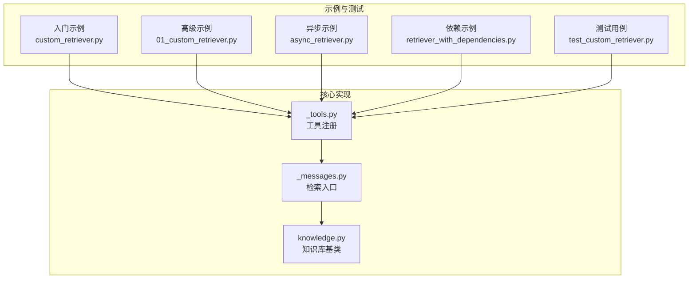
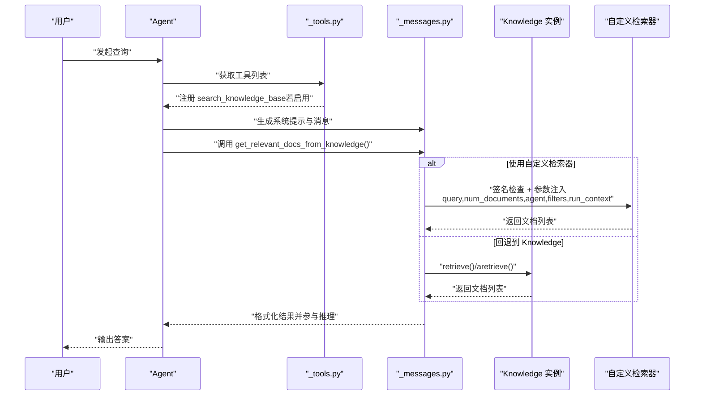
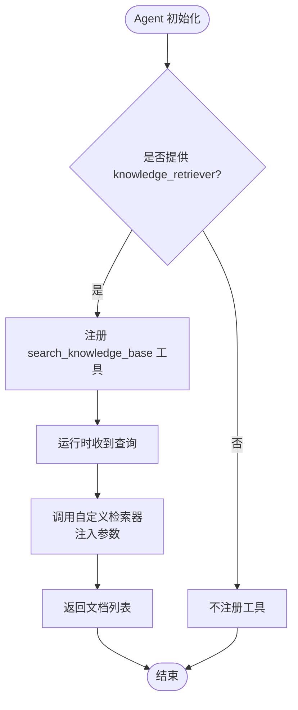
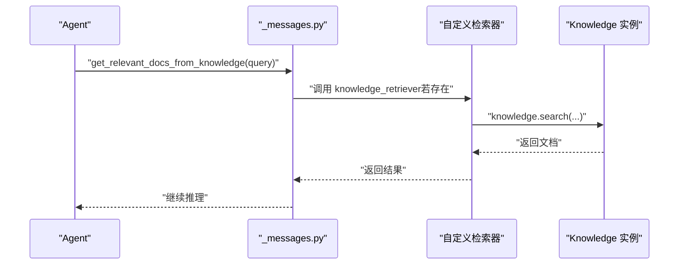
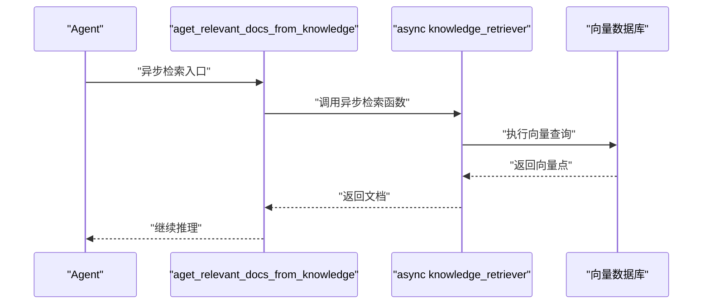
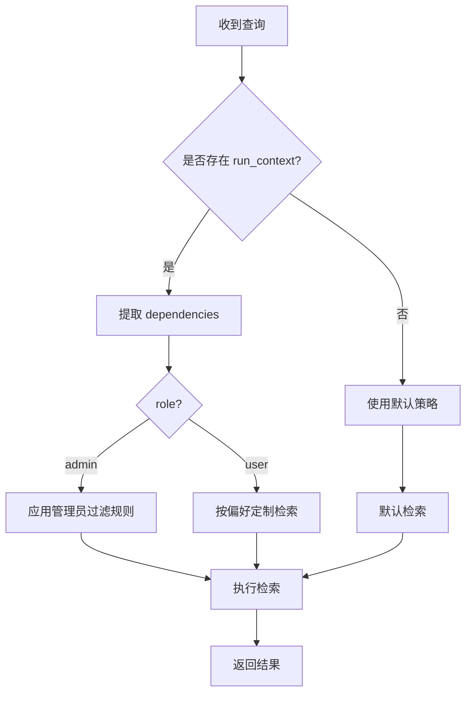
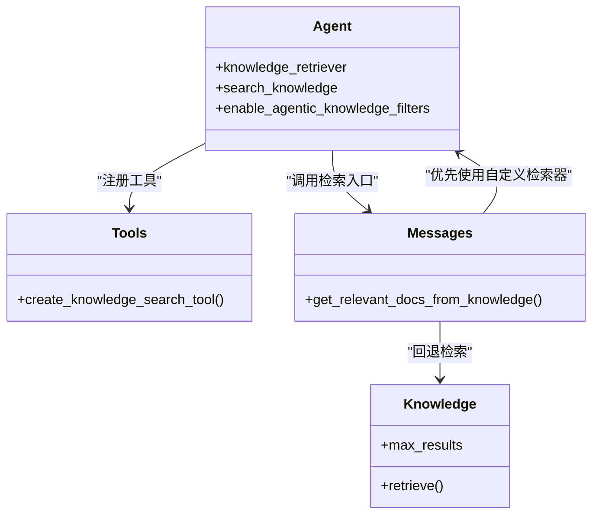
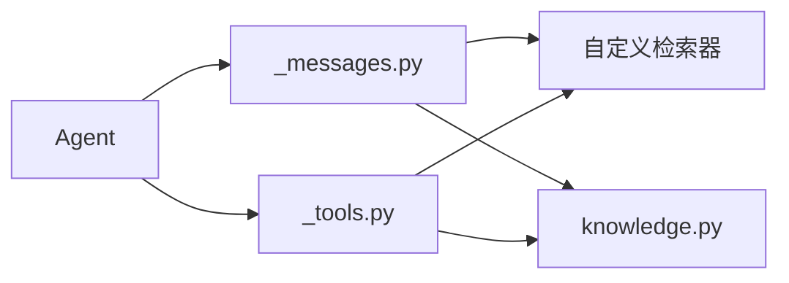

# 团队自定义检索器

<cite>
**本文引用的文件**
- [custom_retriever.py](file://cookbook/02_agents/07_knowledge/custom_retriever.py)
- [custom_retriever.md](file://cookbook/02_agents/07_knowledge/custom_retriever.md)
- [01_custom_retriever.py](file://cookbook/07_knowledge/04_advanced/01_custom_retriever.py)
- [async_retriever.py](file://cookbook/07_knowledge/09_archive/custom_retriever/async_retriever.py)
- [retriever_with_dependencies.py](file://cookbook/07_knowledge/09_archive/custom_retriever/retriever_with_dependencies.py)
- [_tools.py](file://libs/agno/agno/agent/_tools.py)
- [_messages.py](file://libs/agno/agno/agent/_messages.py)
- [knowledge.py](file://libs/agno/agno/knowledge/knowledge.py)
- [test_custom_retriever.py](file://libs/agno/tests/integration/agent/test_custom_retriever.py)
</cite>

## 目录
1. [简介](#简介)
2. [项目结构](#项目结构)
3. [核心组件](#核心组件)
4. [架构总览](#架构总览)
5. [详细组件分析](#详细组件分析)
6. [依赖分析](#依赖分析)
7. [性能考虑](#性能考虑)
8. [故障排除指南](#故障排除指南)
9. [结论](#结论)
10. [附录](#附录)

## 简介
本文件面向团队知识库场景，系统性阐述“自定义检索器”的设计原则、实现方法与集成方式，并结合仓库中的示例与测试，给出可直接落地的实践指南。自定义检索器允许团队绕过默认的知识库检索流程，以完全可控的检索函数作为“search_knowledge_base”工具的后端，从而满足特定业务需求、性能优化与定制化搜索策略。

## 项目结构
围绕“自定义检索器”，本仓库提供了多层级的示例与测试：
- 入门示例：在 Agent 上直接注入自定义检索函数，无需 Knowledge 实例
- 高级示例：基于 Knowledge 实例，自定义检索函数覆盖默认检索逻辑
- 异步示例：异步检索函数对接向量数据库
- 运行时依赖示例：从 RunContext 获取依赖，动态定制检索行为
- 测试用例：验证检索器注册、错误处理与工具调用链路

**图表来源**
- [custom_retriever.py:1-71](file://cookbook/02_agents/07_knowledge/custom_retriever.py#L1-L71)
- [01_custom_retriever.py:1-93](file://cookbook/07_knowledge/04_advanced/01_custom_retriever.py#L1-L93)
- [async_retriever.py:1-88](file://cookbook/07_knowledge/09_archive/custom_retriever/async_retriever.py#L1-L88)
- [retriever_with_dependencies.py:1-116](file://cookbook/07_knowledge/09_archive/custom_retriever/retriever_with_dependencies.py#L1-L116)
- [test_custom_retriever.py:1-48](file://libs/agno/tests/integration/agent/test_custom_retriever.py#L1-L48)
- [_tools.py:176-196](file://libs/agno/agno/agent/_tools.py#L176-L196)
- [_messages.py:1730-1827](file://libs/agno/agno/agent/_messages.py#L1730-L1827)
- [knowledge.py:40-65](file://libs/agno/agno/knowledge/knowledge.py#L40-L65)

**章节来源**
- [custom_retriever.py:1-71](file://cookbook/02_agents/07_knowledge/custom_retriever.py#L1-L71)
- [01_custom_retriever.py:1-93](file://cookbook/07_knowledge/04_advanced/01_custom_retriever.py#L1-L93)
- [async_retriever.py:1-88](file://cookbook/07_knowledge/09_archive/custom_retriever/async_retriever.py#L1-L88)
- [retriever_with_dependencies.py:1-116](file://cookbook/07_knowledge/09_archive/custom_retriever/retriever_with_dependencies.py#L1-L116)
- [test_custom_retriever.py:1-48](file://libs/agno/tests/integration/agent/test_custom_retriever.py#L1-L48)
- [_tools.py:176-196](file://libs/agno/agno/agent/_tools.py#L176-L196)
- [_messages.py:1730-1827](file://libs/agno/agno/agent/_messages.py#L1730-L1827)
- [knowledge.py:40-65](file://libs/agno/agno/knowledge/knowledge.py#L40-L65)

## 核心组件
- 自定义检索函数：接收 query、num_documents 等参数，返回文档列表或字符串列表；可选注入 agent、filters、run_context 或 dependencies
- 工具注册：当存在 knowledge_retriever 或 knowledge 且开启 search_knowledge 时，注册 search_knowledge_base 工具
- 检索入口：统一通过 get_relevant_docs_from_knowledge（同步）或 aget_relevant_docs_from_knowledge（异步）调度
- 知识库协议：若未提供自定义检索器，则回退到 Knowledge 实例的 retrieve/aretrieve 协议

关键要点：
- knowledge_retriever 优先级高于 Knowledge 实例的检索逻辑
- 支持同步与异步检索函数
- 可通过 run_context.dependencies 或 dependencies（兼容）传递上下文信息

**章节来源**
- [_tools.py:176-196](file://libs/agno/agno/agent/_tools.py#L176-L196)
- [_messages.py:1730-1827](file://libs/agno/agno/agent/_messages.py#L1730-L1827)
- [knowledge.py:40-65](file://libs/agno/agno/knowledge/knowledge.py#L40-L65)

## 架构总览
下图展示了从 Agent 到检索器的完整调用链，以及工具注册与系统提示的组装过程。

**图表来源**
- [_tools.py:176-196](file://libs/agno/agno/agent/_tools.py#L176-L196)
- [_messages.py:1730-1827](file://libs/agno/agno/agent/_messages.py#L1730-L1827)
- [knowledge.py:40-65](file://libs/agno/agno/knowledge/knowledge.py#L40-L65)

## 详细组件分析

### 组件A：入门级自定义检索器（无需 Knowledge 实例）
- 设计原则：最小化接入成本，直接在 Agent 上注入检索函数即可启用 search_knowledge_base 工具
- 实现要点：
  - 自定义检索函数签名灵活，支持 query、num_documents、agent、filters、run_context 或 dependencies
  - 工具注册条件为 knowledge_retriever 不为空，无需 Knowledge 实例
- 适用场景：快速原型、内部知识库、简单关键词匹配或外部 API 调用
- 示例路径：
  - [custom_retriever.py:37-49](file://cookbook/02_agents/07_knowledge/custom_retriever.py#L37-L49)
  - [custom_retriever.md:55-71](file://cookbook/02_agents/07_knowledge/custom_retriever.md#L55-L71)

**图表来源**
- [custom_retriever.py:55-61](file://cookbook/02_agents/07_knowledge/custom_retriever.py#L55-L61)
- [_tools.py:176-196](file://libs/agno/agno/agent/_tools.py#L176-L196)
- [_messages.py:1781-1797](file://libs/agno/agno/agent/_messages.py#L1781-L1797)

**章节来源**
- [custom_retriever.py:1-71](file://cookbook/02_agents/07_knowledge/custom_retriever.py#L1-L71)
- [custom_retriever.md:55-113](file://cookbook/02_agents/07_knowledge/custom_retriever.md#L55-L113)

### 组件B：高级自定义检索器（基于 Knowledge 实例）
- 设计原则：在保留 Knowledge 能力的同时，自定义检索逻辑，覆盖默认检索
- 实现要点：
  - 仍可通过 knowledge_retriever 注入自定义检索函数
  - 该函数可直接调用 knowledge.search 或其他数据源
- 适用场景：需要结合向量检索与自定义过滤、排序或多源融合
- 示例路径：
  - [01_custom_retriever.py:26-64](file://cookbook/07_knowledge/04_advanced/01_custom_retriever.py#L26-L64)

**图表来源**
- [_messages.py:1730-1827](file://libs/agno/agno/agent/_messages.py#L1730-L1827)
- [01_custom_retriever.py:26-64](file://cookbook/07_knowledge/04_advanced/01_custom_retriever.py#L26-L64)

**章节来源**
- [01_custom_retriever.py:1-93](file://cookbook/07_knowledge/04_advanced/01_custom_retriever.py#L1-L93)
- [_messages.py:1730-1827](file://libs/agno/agno/agent/_messages.py#L1730-L1827)

### 组件C：异步自定义检索器（对接向量数据库）
- 设计原则：在异步环境下进行向量检索，提升吞吐与响应速度
- 实现要点：
  - 自定义检索函数声明为 async
  - 在 Agent 中同时提供 Knowledge 实例与 knowledge_retriever，后者覆盖默认检索
- 适用场景：高并发、低延迟的检索服务
- 示例路径：
  - [async_retriever.py:31-61](file://cookbook/07_knowledge/09_archive/custom_retriever/async_retriever.py#L31-L61)

**图表来源**
- [_messages.py:1829-1891](file://libs/agno/agno/agent/_messages.py#L1829-L1891)
- [async_retriever.py:31-61](file://cookbook/07_knowledge/09_archive/custom_retriever/async_retriever.py#L31-L61)

**章节来源**
- [async_retriever.py:1-88](file://cookbook/07_knowledge/09_archive/custom_retriever/async_retriever.py#L1-L88)
- [_messages.py:1829-1891](file://libs/agno/agno/agent/_messages.py#L1829-L1891)

### 组件D：带运行时依赖的检索器
- 设计原则：利用 RunContext 传递用户角色、偏好等上下文，动态定制检索策略
- 实现要点：
  - 在检索函数签名中加入 run_context 或 dependencies（兼容）
  - 从 run_context 中提取 dependencies 并据此调整检索
- 适用场景：多租户、个性化推荐、权限控制
- 示例路径：
  - [retriever_with_dependencies.py:41-89](file://cookbook/07_knowledge/09_archive/custom_retriever/retriever_with_dependencies.py#L41-L89)

**图表来源**
- [_messages.py:1755-1796](file://libs/agno/agno/agent/_messages.py#L1755-L1796)
- [retriever_with_dependencies.py:41-89](file://cookbook/07_knowledge/09_archive/custom_retriever/retriever_with_dependencies.py#L41-L89)

**章节来源**
- [retriever_with_dependencies.py:1-116](file://cookbook/07_knowledge/09_archive/custom_retriever/retriever_with_dependencies.py#L1-L116)
- [_messages.py:1755-1796](file://libs/agno/agno/agent/_messages.py#L1755-L1796)

### 组件E：检索器注册与工具优先级
- 注册条件：当 resolved_knowledge 或 knowledge_retriever 存在且 search_knowledge 为真时，注册 search_knowledge_base 工具
- 优先级：knowledge_retriever 优先于 Knowledge 实例的检索协议
- 示例路径：
  - [_tools.py:176-196](file://libs/agno/agno/agent/_tools.py#L176-L196)
  - [_messages.py:1781-1801](file://libs/agno/agno/agent/_messages.py#L1781-L1801)

**图表来源**
- [_tools.py:176-196](file://libs/agno/agno/agent/_tools.py#L176-L196)
- [_messages.py:1730-1827](file://libs/agno/agno/agent/_messages.py#L1730-L1827)
- [knowledge.py:40-65](file://libs/agno/agno/knowledge/knowledge.py#L40-L65)

**章节来源**
- [_tools.py:176-196](file://libs/agno/agno/agent/_tools.py#L176-L196)
- [_messages.py:1730-1827](file://libs/agno/agno/agent/_messages.py#L1730-L1827)
- [knowledge.py:40-65](file://libs/agno/agno/knowledge/knowledge.py#L40-L65)

## 依赖分析
- 组件耦合：
  - Agent 与 _tools 的耦合体现在工具注册逻辑
  - 检索入口与知识库协议解耦，通过统一接口适配自定义与默认实现
- 外部依赖：
  - 异步检索示例依赖向量数据库客户端
  - 运行时依赖示例依赖 Knowledge 实例与嵌入器

**图表来源**
- [_tools.py:176-196](file://libs/agno/agno/agent/_tools.py#L176-L196)
- [_messages.py:1730-1827](file://libs/agno/agno/agent/_messages.py#L1730-L1827)
- [knowledge.py:40-65](file://libs/agno/agno/knowledge/knowledge.py#L40-L65)

**章节来源**
- [_tools.py:176-196](file://libs/agno/agno/agent/_tools.py#L176-L196)
- [_messages.py:1730-1827](file://libs/agno/agno/agent/_messages.py#L1730-L1827)
- [knowledge.py:40-65](file://libs/agno/agno/knowledge/knowledge.py#L40-L65)

## 性能考虑
- 异步检索：在高并发场景下采用异步检索函数，减少阻塞
- 结果裁剪：合理设置 num_documents，避免返回过多无关内容
- 缓存策略：对检索结果或嵌入进行缓存，降低重复查询开销
- 过滤与排序：在检索函数内尽早应用过滤与排序，缩小候选集
- 向量化与索引：结合向量数据库的索引与查询优化策略

[本节为通用指导，无需具体文件引用]

## 故障排除指南
- 工具未注册
  - 检查是否设置了 knowledge_retriever 或提供了 Knowledge 实例且开启了 search_knowledge
  - 参考：[_tools.py:176-196](file://libs/agno/agno/agent/_tools.py#L176-L196)
- 检索失败
  - 自定义检索器抛出异常时，系统会记录警告并中断检索
  - 参考：[_messages.py:1798-1800](file://libs/agno/agno/agent/_messages.py#L1798-L1800)
- 无结果返回
  - 检查检索函数是否正确返回文档列表
  - 参考：[_messages.py:1818-1821](file://libs/agno/agno/agent/_messages.py#L1818-L1821)
- 异步检索未生效
  - 确认检索函数为 async，并在 Agent 中正确传入 knowledge_retriever
  - 参考：[async_retriever.py:31-61](file://cookbook/07_knowledge/09_archive/custom_retriever/async_retriever.py#L31-L61)
- 运行时依赖未生效
  - 确保检索函数签名包含 run_context 或 dependencies，并在 run 时传入 dependencies
  - 参考：[retriever_with_dependencies.py:41-89](file://cookbook/07_knowledge/09_archive/custom_retriever/retriever_with_dependencies.py#L41-L89)

**章节来源**
- [_tools.py:176-196](file://libs/agno/agno/agent/_tools.py#L176-L196)
- [_messages.py:1798-1800](file://libs/agno/agno/agent/_messages.py#L1798-L1800)
- [async_retriever.py:31-61](file://cookbook/07_knowledge/09_archive/custom_retriever/async_retriever.py#L31-L61)
- [retriever_with_dependencies.py:41-89](file://cookbook/07_knowledge/09_archive/custom_retriever/retriever_with_dependencies.py#L41-L89)

## 结论
通过自定义检索器，团队可以在不改变现有知识库基础设施的前提下，灵活地注入定制化的检索逻辑。其优势在于：
- 解耦检索与知识库：优先使用自定义检索器，必要时回退到 Knowledge 协议
- 易于扩展：支持同步与异步、多数据源、运行时依赖
- 可观测性：统一的检索入口便于埋点与性能监控

建议在团队实践中：
- 明确检索器职责边界，避免过度复杂化
- 建立检索器契约（参数、返回值、异常处理）
- 将检索器纳入测试矩阵，确保稳定性与一致性

[本节为总结性内容，无需具体文件引用]

## 附录
- 快速开始
  - 入门示例：[custom_retriever.py:55-61](file://cookbook/02_agents/07_knowledge/custom_retriever.py#L55-L61)
  - 高级示例：[01_custom_retriever.py:71-75](file://cookbook/07_knowledge/04_advanced/01_custom_retriever.py#L71-L75)
  - 异步示例：[async_retriever.py:64-74](file://cookbook/07_knowledge/09_archive/custom_retriever/async_retriever.py#L64-L74)
  - 依赖示例：[retriever_with_dependencies.py:92-99](file://cookbook/07_knowledge/09_archive/custom_retriever/retriever_with_dependencies.py#L92-L99)
- 测试参考
  - [test_custom_retriever.py:5-16](file://libs/agno/tests/integration/agent/test_custom_retriever.py#L5-L16)
  - [test_custom_retriever.py:19-31](file://libs/agno/tests/integration/agent/test_custom_retriever.py#L19-L31)
  - [test_custom_retriever.py:33-47](file://libs/agno/tests/integration/agent/test_custom_retriever.py#L33-L47)