# 团队系统

<cite>
**本文引用的文件**
- [cookbook/03_teams/README.md](file://cookbook/03_teams/README.md)
- [cookbook/03_teams/TEST_LOG.md](file://cookbook/03_teams/TEST_LOG.md)
- [cookbook/03_teams/01_quickstart/02_respond_directly_router_team.py](file://cookbook/03_teams/01_quickstart/02_respond_directly_router_team.py)
- [cookbook/03_teams/01_quickstart/broadcast_mode.py](file://cookbook/03_teams/01_quickstart/broadcast_mode.py)
- [cookbook/03_teams/01_quickstart/nested_teams.py](file://cookbook/03_teams/01_quickstart/nested_teams.py)
- [cookbook/03_teams/06_memory/01_team_with_memory_manager.py](file://cookbook/03_teams/06_memory/01_team_with_memory_manager.py)
- [cookbook/03_teams/12_learning/01_team_always_learn.py](file://cookbook/03_teams/12_learning/01_team_always_learn.py)
- [cookbook/03_teams/13_hooks/stream_hook.py](file://cookbook/03_teams/13_hooks/stream_hook.py)
- [cookbook/03_teams/05_knowledge/04_team_with_custom_retriever.py](file://cookbook/03_teams/05_knowledge/04_team_with_custom_retriever.py)
- [cookbook/03_teams/05_knowledge/05_team_update_knowledge.py](file://cookbook/03_teams/05_knowledge/05_team_update_knowledge.py)
- [cookbook/03_teams/08_streaming/team_streaming.py](file://cookbook/03_teams/08_streaming/team_streaming.py)
- [cookbook/03_teams/08_streaming/team_events.py](file://cookbook/03_teams/08_streaming/team_events.py)
- [cookbook/03_teams/09_context_management/introduction.py](file://cookbook/03_teams/09_context_management/introduction.py)
- [cookbook/03_teams/09_context_management/few_shot_learning.py](file://cookbook/03_teams/09_context_management/few_shot_learning.py)
- [cookbook/03_teams/09_context_management/filter_tool_calls_from_history.py](file://cookbook/03_teams/09_context_management/filter_tool_calls_from_history.py)
- [cookbook/03_teams/10_context_compression/tool_call_compression.py](file://cookbook/03_teams/10_context_compression/tool_call_compression.py)
- [cookbook/03_teams/10_context_compression/tool_call_compression_with_manager.py](file://cookbook/03_teams/10_context_compression/tool_call_compression_with_manager.py)
- [cookbook/03_teams/11_reasoning/reasoning_multi_purpose_team.py](file://cookbook/03_teams/11_reasoning/reasoning_multi_purpose_team.py)
- [cookbook/03_teams/14_run_control/cancellation_and_retry.py](file://cookbook/03_teams/14_run_control/cancellation_and_retry.py)
- [cookbook/03_teams/14_run_control/background_execution.py](file://cookbook/03_teams/14_run_control/background_execution.py)
- [cookbook/03_teams/15_distributed_rag/01_distributed_rag_pgvector.py](file://cookbook/03_teams/15_distributed_rag/01_distributed_rag_pgvector.py)
- [cookbook/03_teams/16_search_coordination/01_coordinated_search.py](file://cookbook/03_teams/16_search_coordination/01_coordinated_search.py)
- [cookbook/03_teams/17_dependencies/dependencies_in_context.py](file://cookbook/03_teams/17_dependencies/dependencies_in_context.py)
- [cookbook/03_teams/17_dependencies/dependencies_in_tools.py](file://cookbook/03_teams/17_dependencies/dependencies_in_tools.py)
- [cookbook/03_teams/17_dependencies/dependencies_to_members.py](file://cookbook/03_teams/17_dependencies/dependencies_to_members.py)
- [cookbook/03_teams/18_guardrails/openai_moderation.py](file://cookbook/03_teams/18_guardrails/openai_moderation.py)
- [cookbook/03_teams/18_guardrails/prompt_injection.py](file://cookbook/03_teams/18_guardrails/prompt_injection.py)
- [cookbook/03_teams/18_guardrails/pii_detection.py](file://cookbook/03_teams/18_guardrails/pii_detection.py)
- [cookbook/03_teams/19_multimodal/audio_to_text.py](file://cookbook/03_teams/19_multimodal/audio_to_text.py)
- [cookbook/03_teams/19_multimodal/image_to_text.py](file://cookbook/03_teams/19_multimodal/image_to_text.py)
- [cookbook/03_teams/19_multimodal/video_caption.py](file://cookbook/03_teams/19_multimodal/video_caption.py)
- [cookbook/03_teams/20_human_in_the_loop/confirmation_required.py](file://cookbook/03_teams/20_human_in_the_loop/confirmation_required.py)
- [cookbook/03_teams/20_human_in_the_loop/external_tool_execution.py](file://cookbook/03_teams/20_human_in_the_loop/external_tool_execution.py)
- [cookbook/03_teams/21_state/session_state_basic.py](file://cookbook/03_teams/21_state/session_state_basic.py)
- [cookbook/03_teams/21_state/session_state_advanced.py](file://cookbook/03_teams/21_state/session_state_advanced.py)
- [cookbook/03_teams/22_metrics/01_team_metrics.py](file://cookbook/03_teams/22_metrics/01_team_metrics.py)
</cite>

## 目录
1. [简介](#简介)
2. [项目结构](#项目结构)
3. [核心组件](#核心组件)
4. [架构总览](#架构总览)
5. [详细组件分析](#详细组件分析)
6. [依赖分析](#依赖分析)
7. [性能考虑](#性能考虑)
8. [故障排查指南](#故障排查指南)
9. [结论](#结论)
10. [附录](#附录)

## 简介
本文件面向 Agno Learn 的“团队系统”，系统性梳理多代理团队的创建、配置与管理方法，覆盖团队组织结构、成员管理与协调机制；详解三种运行模式（动态路由、广播、任务）的特性与适用场景；阐述团队工具系统（成员工具、组合与权限）、结构化输入输出（输入校验、输出格式化、数据传递）、知识管理（共享知识库、同步与访问控制）、内存系统（共享记忆、同步与冲突解决）、会话管理（状态同步、历史管理、状态更新），以及高级能力如流式处理、上下文管理、推理、自学习、钩子、运行控制、分布式 RAG、搜索协调、依赖管理、护栏、多模态、人机协作、状态管理与指标监控等，并提供可定位到源码路径的最佳实践指引。

## 项目结构
Agno Learn 的团队系统以“食谱（cookbook）”形式组织，团队相关主题分布在 cookbook/03_teams 下的多个子目录中，涵盖从基础编排到高级能力的完整路径。下图给出与团队系统直接相关的顶层结构与职责映射。

```mermaid
graph TB
A["cookbook/03_teams/README.md<br/>团队系统概览与主题索引"] --> B["01_quickstart<br/>基础编排：路由/广播/任务/嵌套团队"]
A --> C["02_modes<br/>执行模式：路由/广播/任务/协调"]
A --> D["03_tools<br/>工具与钩子模式"]
A --> E["04_structured_input_output<br/>结构化输入输出与流式"]
A --> F["05_knowledge<br/>知识库与检索"]
A --> G["06_memory<br/>内存与学习"]
A --> H["07_session<br/>会话持久化与历史"]
A --> I["08_streaming<br/>响应流式与事件监控"]
A --> J["09_context_management<br/>上下文过滤与引入"]
A --> K["10_context_compression<br/>上下文压缩与管理器"]
A --> L["11_reasoning<br/>多用途推理团队"]
A --> M["12_learning<br/>团队学习模式"]
A --> N["13_hooks<br/>输入/输出/流钩子"]
A --> O["14_run_control<br/>取消/重试/远程/后台执行"]
A --> P["15_distributed_rag<br/>分布式向量检索"]
A --> Q["16_search_coordination<br/>跨成员搜索协调"]
A --> R["17_dependencies<br/>上下文/工具/成员依赖"]
A --> S["18_guardrails<br/>护栏与合规"]
A --> T["19_multimodal<br/>音频/图像/视频工作流"]
A --> U["20_human_in_the_loop<br/>人机协作与确认"]
A --> V["21_state<br/>共享会话状态"]
A --> W["22_metrics<br/>团队/会话/成员指标"]
```

图表来源
- [cookbook/03_teams/README.md:1-35](file://cookbook/03_teams/README.md#L1-L35)

章节来源
- [cookbook/03_teams/README.md:1-35](file://cookbook/03_teams/README.md#L1-L35)

## 核心组件
- 团队编排与模式
  - 路由模式：根据输入特征选择特定成员进行直接响应，适合多语言、专业化分工场景。
  - 广播模式：将同一任务同时委托给所有成员，适合多方评审、风险评估等。
  - 任务模式：按依赖与并发策略执行子任务，适合流水线式工作流。
  - 协调模式：通过高层团队协调多个子团队，形成嵌套团队。
- 成员与工具
  - 成员为 Agent 实例，可配置角色、模型与指令。
  - 工具通过工具钩子与权限控制集成，支持外部服务与本地函数。
- 结构化输入输出
  - 输入模式与输出模式可定义严格 schema，结合流式输出提升交互体验。
- 知识与检索
  - 支持传统 RAG、代理式 RAG、自定义检索器、知识过滤与更新。
- 内存与学习
  - MemoryManager 提供持久化记忆；LearningMachine 自动抽取用户画像与记忆。
- 会话与状态
  - 会话 ID、用户 ID、历史记录与状态事件可被统一管理与查询。
- 高级能力
  - 流式处理、上下文压缩、推理、钩子、运行控制、分布式 RAG、搜索协调、护栏、多模态、人机协作、指标监控等。

章节来源
- [cookbook/03_teams/README.md:11-35](file://cookbook/03_teams/README.md#L11-L35)

## 架构总览
下图展示一个典型“路由模式”的团队运行时交互：客户端请求进入 Team，Team 根据模式与成员配置进行路由，成员执行工具调用与推理，最终返回结构化或流式结果，并可触发后置钩子。

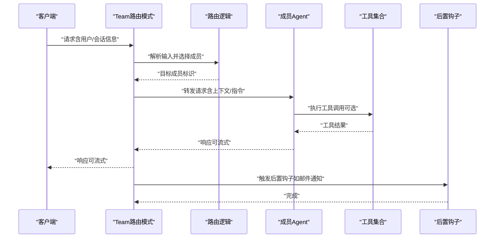

图表来源
- [cookbook/03_teams/01_quickstart/02_respond_directly_router_team.py:51-72](file://cookbook/03_teams/01_quickstart/02_respond_directly_router_team.py#L51-L72)
- [cookbook/03_teams/13_hooks/stream_hook.py:25-48](file://cookbook/03_teams/13_hooks/stream_hook.py#L25-L48)

## 详细组件分析

### 组件A：团队模式与编排
- 路由模式（Route）
  - 特点：单点路由，直接响应，适合多语言、专业化分工。
  - 示例路径：[路由团队示例:51-72](file://cookbook/03_teams/01_quickstart/02_respond_directly_router_team.py#L51-L72)
- 广播模式（Broadcast）
  - 特点：全员参与，独立评估，适合评审、风险评估。
  - 示例路径：[广播团队示例:36-48](file://cookbook/03_teams/01_quickstart/broadcast_mode.py#L36-L48)
- 嵌套团队（Nested Teams）
  - 特点：高层团队协调多个子团队，形成分层编排。
  - 示例路径：[嵌套团队示例:62-72](file://cookbook/03_teams/01_quickstart/nested_teams.py#L62-L72)

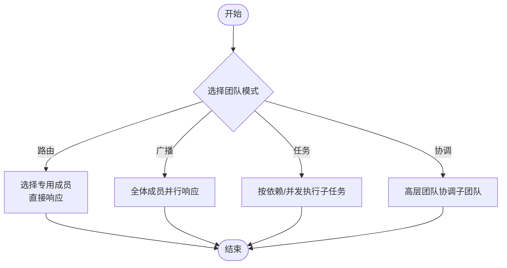

章节来源
- [cookbook/03_teams/01_quickstart/02_respond_directly_router_team.py:51-72](file://cookbook/03_teams/01_quickstart/02_respond_directly_router_team.py#L51-L72)
- [cookbook/03_teams/01_quickstart/broadcast_mode.py:36-48](file://cookbook/03_teams/01_quickstart/broadcast_mode.py#L36-L48)
- [cookbook/03_teams/01_quickstart/nested_teams.py:62-72](file://cookbook/03_teams/01_quickstart/nested_teams.py#L62-L72)

### 组件B：工具系统与权限控制
- 工具集成
  - 可在 Team 层注入工具，成员在推理过程中按需调用。
  - 示例路径：[钩子与工具示例:37-48](file://cookbook/03_teams/13_hooks/stream_hook.py#L37-L48)
- 权限与钩子
  - 通过 pre/post 钩子对输入/输出与流事件进行拦截与扩展。
  - 示例路径：[流钩子示例:25-48](file://cookbook/03_teams/13_hooks/stream_hook.py#L25-L48)

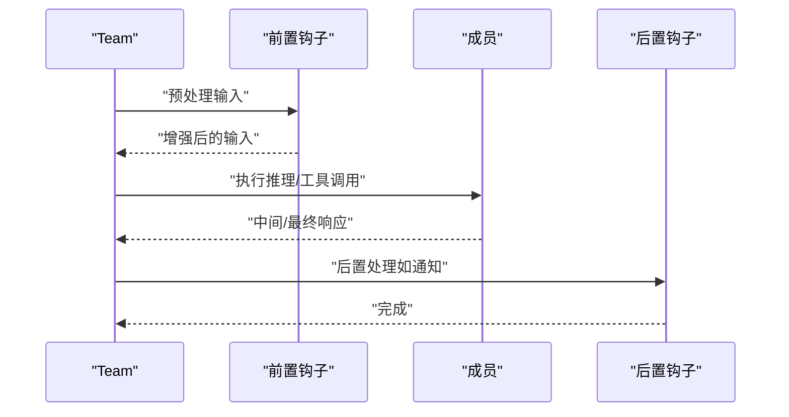

图表来源
- [cookbook/03_teams/13_hooks/stream_hook.py:25-48](file://cookbook/03_teams/13_hooks/stream_hook.py#L25-L48)

章节来源
- [cookbook/03_teams/13_hooks/stream_hook.py:25-48](file://cookbook/03_teams/13_hooks/stream_hook.py#L25-L48)

### 组件C：结构化输入输出与流式处理
- 结构化输出
  - 通过输出 schema 控制响应结构，确保下游消费稳定。
  - 示例路径：[结构化输出示例](file://cookbook/03_teams/04_structured_input_output/structured_output_streaming.py)
- 流式输出
  - 支持增量输出与事件监听，提升交互实时性。
  - 示例路径：[团队流式示例](file://cookbook/03_teams/08_streaming/team_streaming.py)

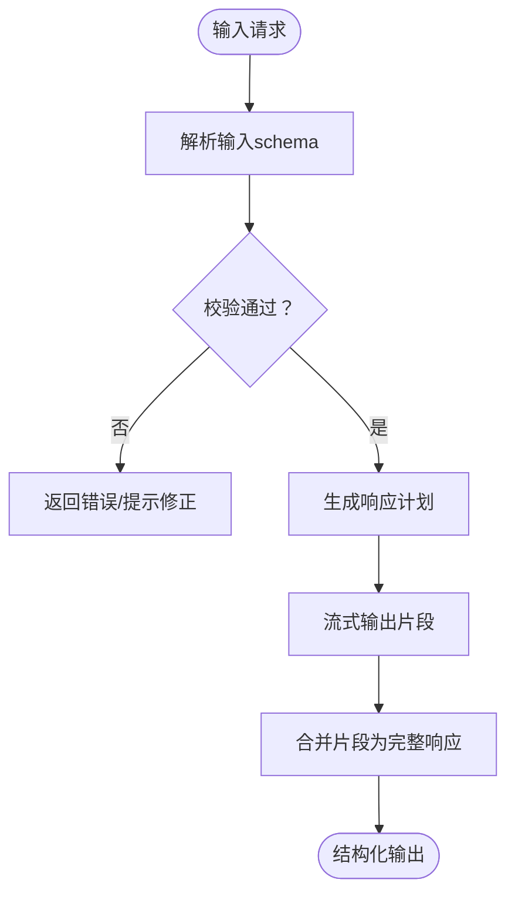

章节来源
- [cookbook/03_teams/08_streaming/team_streaming.py](file://cookbook/03_teams/08_streaming/team_streaming.py)
- [cookbook/03_teams/08_streaming/team_events.py](file://cookbook/03_teams/08_streaming/team_events.py)

### 组件D：知识管理与分布式检索
- 知识库与检索
  - 支持传统 RAG、代理式 RAG、自定义检索器与知识过滤。
  - 示例路径：[自定义检索器](file://cookbook/03_teams/05_knowledge/04_team_with_custom_retriever.py)，[更新知识](file://cookbook/03_teams/05_knowledge/05_team_update_knowledge.py)
- 分布式 RAG
  - 多成员分布式检索与重排序，支持 PgVector、LanceDB 等。
  - 示例路径：[PgVector 分布式 RAG](file://cookbook/03_teams/15_distributed_rag/01_distributed_rag_pgvector.py)

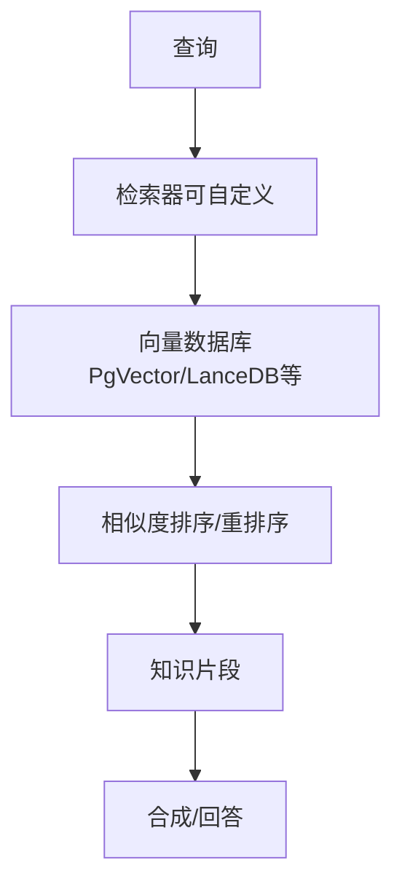

图表来源
- [cookbook/03_teams/05_knowledge/04_team_with_custom_retriever.py](file://cookbook/03_teams/05_knowledge/04_team_with_custom_retriever.py)
- [cookbook/03_teams/05_knowledge/05_team_update_knowledge.py](file://cookbook/03_teams/05_knowledge/05_team_update_knowledge.py)
- [cookbook/03_teams/15_distributed_rag/01_distributed_rag_pgvector.py](file://cookbook/03_teams/15_distributed_rag/01_distributed_rag_pgvector.py)

章节来源
- [cookbook/03_teams/05_knowledge/04_team_with_custom_retriever.py](file://cookbook/03_teams/05_knowledge/04_team_with_custom_retriever.py)
- [cookbook/03_teams/05_knowledge/05_team_update_knowledge.py](file://cookbook/03_teams/05_knowledge/05_team_update_knowledge.py)
- [cookbook/03_teams/15_distributed_rag/01_distributed_rag_pgvector.py](file://cookbook/03_teams/15_distributed_rag/01_distributed_rag_pgvector.py)

### 组件E：内存系统与自学习
- 内存管理
  - 使用 MemoryManager 进行持久化记忆更新，支持用户维度的记忆查询。
  - 示例路径：[团队内存管理:39-67](file://cookbook/03_teams/06_memory/01_team_with_memory_manager.py#L39-L67)
- 自学习
  - 开启 learning=True 后自动抽取用户画像与记忆，支持跨会话记忆。
  - 示例路径：[总是学习模式:41-89](file://cookbook/03_teams/12_learning/01_team_always_learn.py#L41-L89)

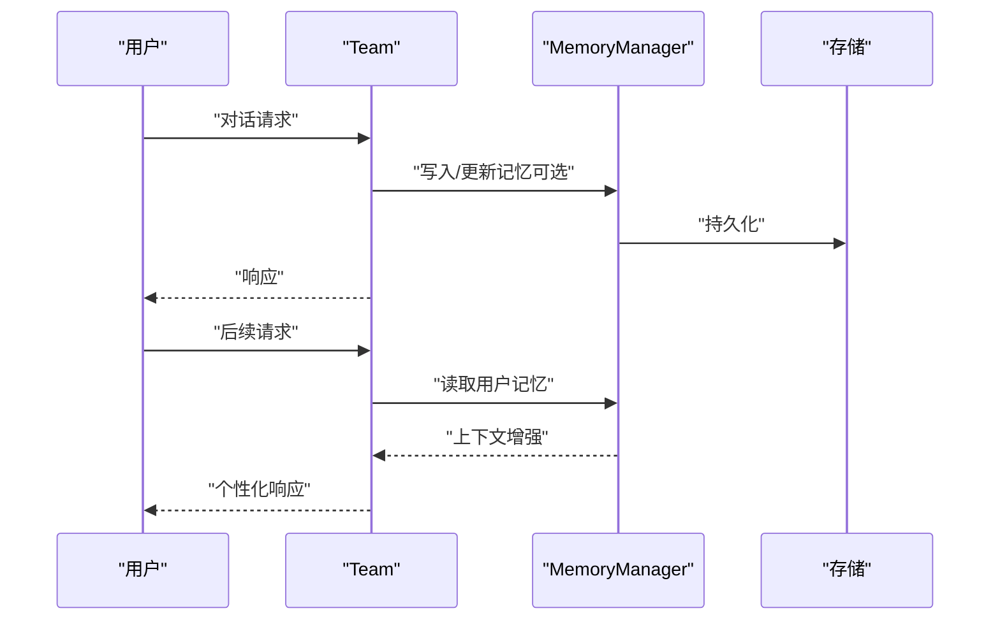

图表来源
- [cookbook/03_teams/06_memory/01_team_with_memory_manager.py:39-67](file://cookbook/03_teams/06_memory/01_team_with_memory_manager.py#L39-L67)
- [cookbook/03_teams/12_learning/01_team_always_learn.py:41-89](file://cookbook/03_teams/12_learning/01_team_always_learn.py#L41-L89)

章节来源
- [cookbook/03_teams/06_memory/01_team_with_memory_manager.py:39-67](file://cookbook/03_teams/06_memory/01_team_with_memory_manager.py#L39-L67)
- [cookbook/03_teams/12_learning/01_team_always_learn.py:41-89](file://cookbook/03_teams/12_learning/01_team_always_learn.py#L41-L89)

### 组件F：会话管理与状态同步
- 会话状态
  - 通过 user_id、session_id 管理会话状态与历史，支持事件驱动的状态变更。
  - 示例路径：[基础会话状态](file://cookbook/03_teams/21_state/session_state_basic.py)，[高级会话状态](file://cookbook/03_teams/21_state/session_state_advanced.py)
- 历史与上下文
  - 上下文引入、少样本学习、历史过滤与工具调用过滤等。
  - 示例路径：[上下文引入](file://cookbook/03_teams/09_context_management/introduction.py)，[少样本学习](file://cookbook/03_teams/09_context_management/few_shot_learning.py)，[历史过滤](file://cookbook/03_teams/09_context_management/filter_tool_calls_from_history.py)

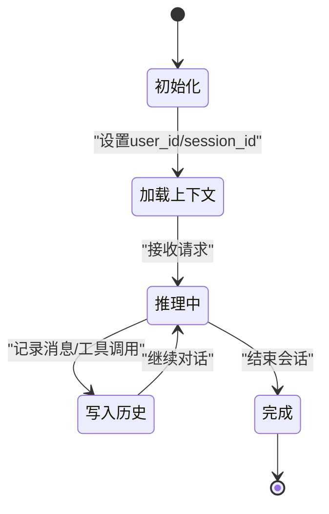

章节来源
- [cookbook/03_teams/21_state/session_state_basic.py](file://cookbook/03_teams/21_state/session_state_basic.py)
- [cookbook/03_teams/21_state/session_state_advanced.py](file://cookbook/03_teams/21_state/session_state_advanced.py)
- [cookbook/03_teams/09_context_management/introduction.py](file://cookbook/03_teams/09_context_management/introduction.py)
- [cookbook/03_teams/09_context_management/few_shot_learning.py](file://cookbook/03_teams/09_context_management/few_shot_learning.py)
- [cookbook/03_teams/09_context_management/filter_tool_calls_from_history.py](file://cookbook/03_teams/09_context_management/filter_tool_calls_from_history.py)

### 组件G：推理、上下文压缩与搜索协调
- 多用途推理
  - 通过团队协作实现复杂推理任务分解与协同。
  - 示例路径：[多用途推理团队](file://cookbook/03_teams/11_reasoning/reasoning_multi_purpose_team.py)
- 上下文压缩
  - 对工具调用结果进行压缩，减少上下文开销。
  - 示例路径：[工具调用压缩](file://cookbook/03_teams/10_context_compression/tool_call_compression.py)，[压缩管理器](file://cookbook/03_teams/10_context_compression/tool_call_compression_with_manager.py)
- 搜索协调
  - 多成员协同搜索，统一结果与引用。
  - 示例路径：[协调搜索](file://cookbook/03_teams/16_search_coordination/01_coordinated_search.py)

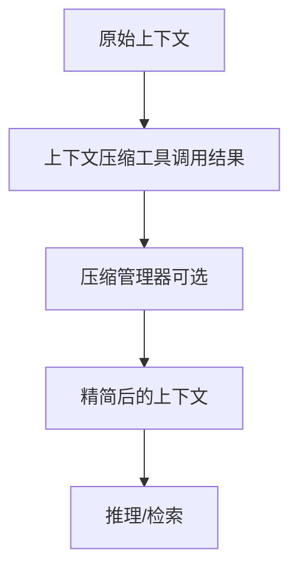

章节来源
- [cookbook/03_teams/11_reasoning/reasoning_multi_purpose_team.py](file://cookbook/03_teams/11_reasoning/reasoning_multi_purpose_team.py)
- [cookbook/03_teams/10_context_compression/tool_call_compression.py](file://cookbook/03_teams/10_context_compression/tool_call_compression.py)
- [cookbook/03_teams/10_context_compression/tool_call_compression_with_manager.py](file://cookbook/03_teams/10_context_compression/tool_call_compression_with_manager.py)
- [cookbook/03_teams/16_search_coordination/01_coordinated_search.py](file://cookbook/03_teams/16_search_coordination/01_coordinated_search.py)

### 组件H：护栏与合规
- 护栏系统
  - 包括提示注入检测、PII 检测、OpenAI Moderation 等。
  - 示例路径：[提示注入检测](file://cookbook/03_teams/18_guardrails/prompt_injection.py)，[PII 检测](file://cookbook/03_teams/18_guardrails/pii_detection.py)，[OpenAI Moderation](file://cookbook/03_teams/18_guardrails/openai_moderation.py)

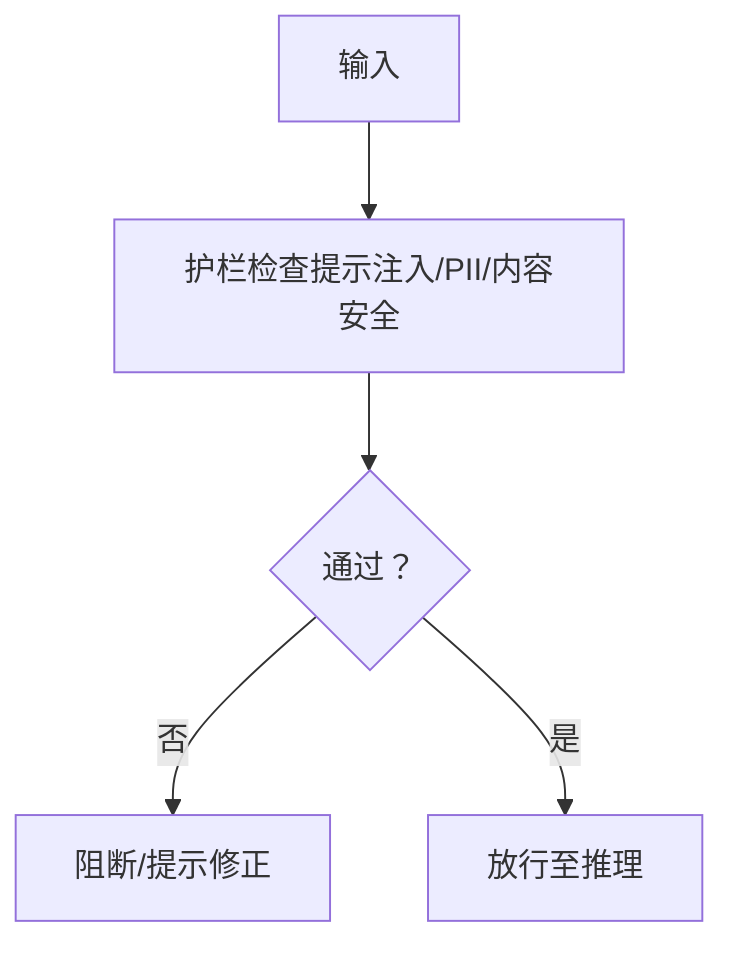

章节来源
- [cookbook/03_teams/18_guardrails/prompt_injection.py](file://cookbook/03_teams/18_guardrails/prompt_injection.py)
- [cookbook/03_teams/18_guardrails/pii_detection.py](file://cookbook/03_teams/18_guardrails/pii_detection.py)
- [cookbook/03_teams/18_guardrails/openai_moderation.py](file://cookbook/03_teams/18_guardrails/openai_moderation.py)

### 组件I：多模态支持
- 多模态输入/输出
  - 支持音频转文本、图像识别、视频字幕等。
  - 示例路径：[音频转文本](file://cookbook/03_teams/19_multimodal/audio_to_text.py)，[图像识别](file://cookbook/03_teams/19_multimodal/image_to_text.py)，[视频字幕](file://cookbook/03_teams/19_multimodal/video_caption.py)

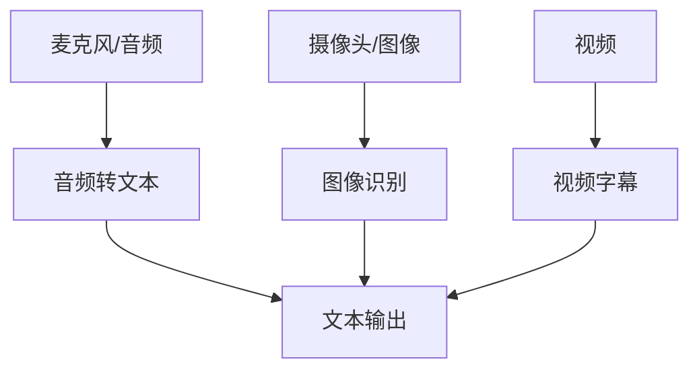

章节来源
- [cookbook/03_teams/19_multimodal/audio_to_text.py](file://cookbook/03_teams/19_multimodal/audio_to_text.py)
- [cookbook/03_teams/19_multimodal/image_to_text.py](file://cookbook/03_teams/19_multimodal/image_to_text.py)
- [cookbook/03_teams/19_multimodal/video_caption.py](file://cookbook/03_teams/19_multimodal/video_caption.py)

### 组件J：人机协作与运行控制
- 人机协作
  - 用户确认、外部工具执行、用户输入必填等。
  - 示例路径：[用户确认](file://cookbook/03_teams/20_human_in_the_loop/confirmation_required.py)，[外部工具执行](file://cookbook/03_teams/20_human_in_the_loop/external_tool_execution.py)
- 运行控制
  - 取消、重试、模型继承、远程团队、后台执行等。
  - 示例路径：[取消与重试](file://cookbook/03_teams/14_run_control/cancellation_and_retry.py)，[后台执行](file://cookbook/03_teams/14_run_control/background_execution.py)

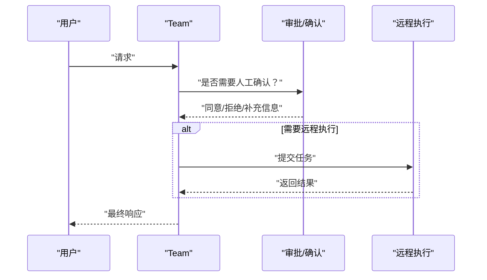

章节来源
- [cookbook/03_teams/20_human_in_the_loop/confirmation_required.py](file://cookbook/03_teams/20_human_in_the_loop/confirmation_required.py)
- [cookbook/03_teams/20_human_in_the_loop/external_tool_execution.py](file://cookbook/03_teams/20_human_in_the_loop/external_tool_execution.py)
- [cookbook/03_teams/14_run_control/cancellation_and_retry.py](file://cookbook/03_teams/14_run_control/cancellation_and_retry.py)
- [cookbook/03_teams/14_run_control/background_execution.py](file://cookbook/03_teams/14_run_control/background_execution.py)

### 组件K：依赖管理与指标监控
- 依赖
  - 上下文依赖、工具依赖、成员间依赖，支持显式声明与约束。
  - 示例路径：[上下文依赖](file://cookbook/03_teams/17_dependencies/dependencies_in_context.py)，[工具依赖](file://cookbook/03_teams/17_dependencies/dependencies_in_tools.py)，[成员依赖](file://cookbook/03_teams/17_dependencies/dependencies_to_members.py)
- 指标
  - 团队/会话/成员指标观测与导出。
  - 示例路径：[团队指标](file://cookbook/03_teams/22_metrics/01_team_metrics.py)

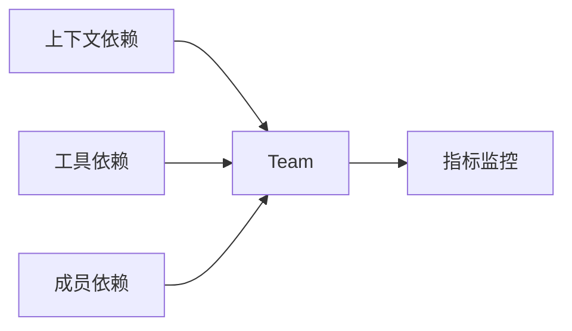

章节来源
- [cookbook/03_teams/17_dependencies/dependencies_in_context.py](file://cookbook/03_teams/17_dependencies/dependencies_in_context.py)
- [cookbook/03_teams/17_dependencies/dependencies_in_tools.py](file://cookbook/03_teams/17_dependencies/dependencies_in_tools.py)
- [cookbook/03_teams/17_dependencies/dependencies_to_members.py](file://cookbook/03_teams/17_dependencies/dependencies_to_members.py)
- [cookbook/03_teams/22_metrics/01_team_metrics.py](file://cookbook/03_teams/22_metrics/01_team_metrics.py)

## 依赖分析
- 组件耦合
  - Team 与 Agent、MemoryManager、工具、钩子、存储之间存在清晰边界；通过接口解耦，便于替换与扩展。
- 外部依赖
  - 向量数据库（PgVector/LanceDB）、外部 API（如 yfinance）、数据库（Postgres）等。
- 循环依赖
  - 示例未见循环依赖迹象；各模块通过回调与事件进行松耦合通信。

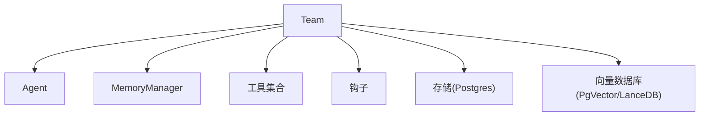

图表来源
- [cookbook/03_teams/06_memory/01_team_with_memory_manager.py:39-67](file://cookbook/03_teams/06_memory/01_team_with_memory_manager.py#L39-L67)
- [cookbook/03_teams/13_hooks/stream_hook.py:37-48](file://cookbook/03_teams/13_hooks/stream_hook.py#L37-L48)
- [cookbook/03_teams/15_distributed_rag/01_distributed_rag_pgvector.py](file://cookbook/03_teams/15_distributed_rag/01_distributed_rag_pgvector.py)

章节来源
- [cookbook/03_teams/06_memory/01_team_with_memory_manager.py:39-67](file://cookbook/03_teams/06_memory/01_team_with_memory_manager.py#L39-L67)
- [cookbook/03_teams/13_hooks/stream_hook.py:37-48](file://cookbook/03_teams/13_hooks/stream_hook.py#L37-L48)
- [cookbook/03_teams/15_distributed_rag/01_distributed_rag_pgvector.py](file://cookbook/03_teams/15_distributed_rag/01_distributed_rag_pgvector.py)

## 性能考虑
- 流式输出与事件监听可降低首字节延迟，提升交互体验。
- 上下文压缩与历史过滤有助于控制上下文长度，避免昂贵推理成本。
- 分布式 RAG 中合理选择向量库与重排序策略，平衡召回质量与延迟。
- 内存与学习的异步抽取可避免阻塞主流程，提高吞吐。

## 故障排查指南
- 测试日志与常见问题
  - 测试日志显示部分示例存在样式或运行时问题，建议优先参考已通过的示例路径进行对照。
  - 示例路径：[测试日志:1-120](file://cookbook/03_teams/TEST_LOG.md#L1-L120)
- 环境依赖缺失
  - 分布式 RAG 示例可能因缺少第三方库导致导入失败，需按提示安装依赖。
  - 示例路径：[LanceDB 依赖问题:250-294](file://cookbook/03_teams/TEST_LOG.md#L250-L294)
- 参数不匹配
  - 示例中出现参数名称不匹配的情况，需核对最新 API 文档与示例。
  - 示例路径：[参数不匹配示例:44-56](file://cookbook/03_teams/TEST_LOG.md#L44-L56)

章节来源
- [cookbook/03_teams/TEST_LOG.md:1-120](file://cookbook/03_teams/TEST_LOG.md#L1-L120)
- [cookbook/03_teams/TEST_LOG.md:250-294](file://cookbook/03_teams/TEST_LOG.md#L250-L294)
- [cookbook/03_teams/TEST_LOG.md:44-56](file://cookbook/03_teams/TEST_LOG.md#L44-L56)

## 结论
Agno Learn 的团队系统提供了从基础编排到高级能力的完整能力矩阵：通过路由/广播/任务/协调四种模式满足多样化协作需求；借助工具钩子与权限控制实现灵活扩展；通过结构化输入输出与流式处理优化交互体验；通过知识库、分布式检索与搜索协调强化信息获取；通过内存与学习实现长期记忆与个性化；通过护栏与合规保障安全；通过多模态与人机协作拓展应用场景；通过会话状态与指标监控实现可观测性与可维护性。建议在实际落地中优先从路由/广播模式入手，逐步引入上下文压缩、分布式 RAG、自学习与护栏等能力，以渐进方式构建稳健的多代理团队系统。

## 附录
- 最佳实践清单
  - 明确团队模式选择：路由用于专业化，广播用于评审，任务用于流水线，协调用于分层治理。
  - 严格输入输出 schema：保证结构化与一致性，便于下游消费与审计。
  - 合理使用流式输出：在长响应场景中显著改善用户体验。
  - 重视上下文管理：引入上下文压缩与历史过滤，控制成本与噪声。
  - 强化护栏与合规：在高风险场景启用提示注入检测、PII 检测与内容审核。
  - 注入工具与钩子：通过工具钩子实现权限控制与审计，通过后置钩子实现通知与归档。
  - 管理会话与状态：明确 user_id/session_id，利用事件驱动的状态更新。
  - 监控与度量：建立团队/会话/成员指标体系，持续优化性能与稳定性。