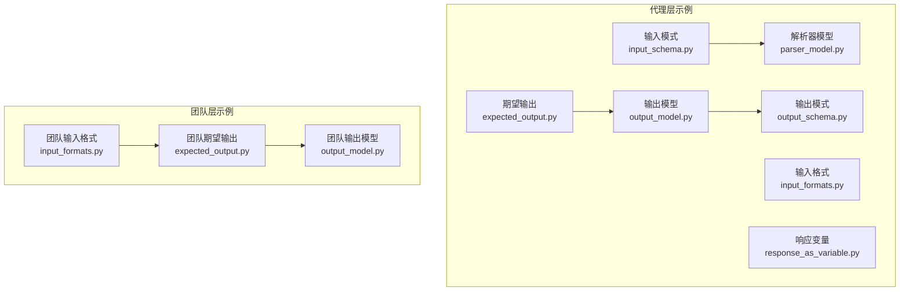
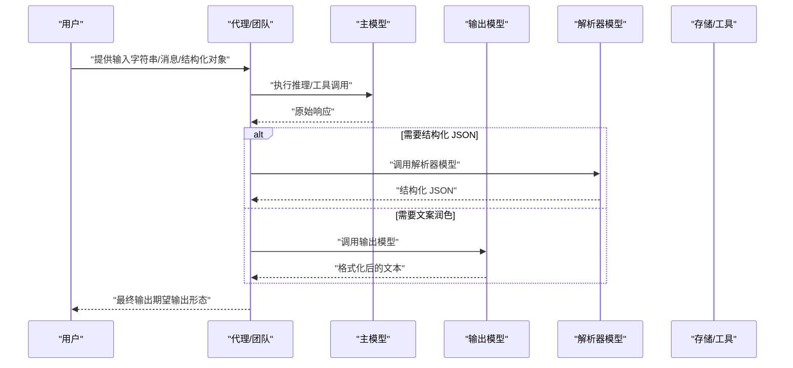
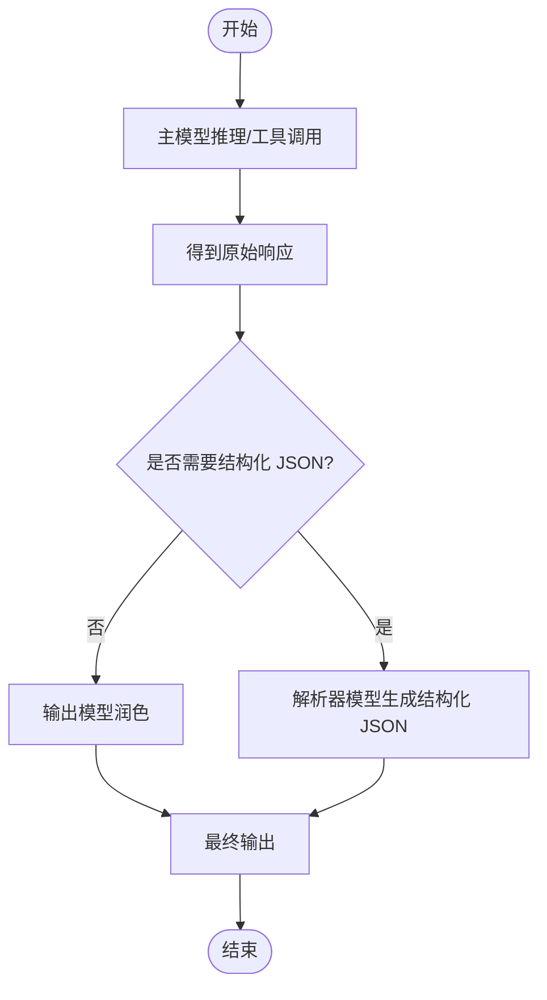
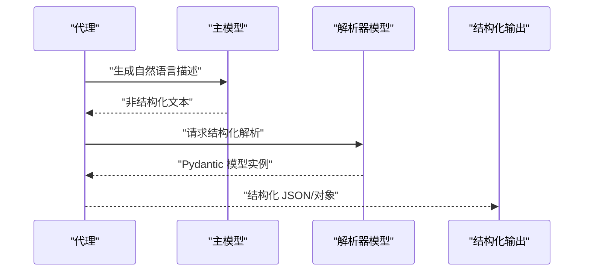
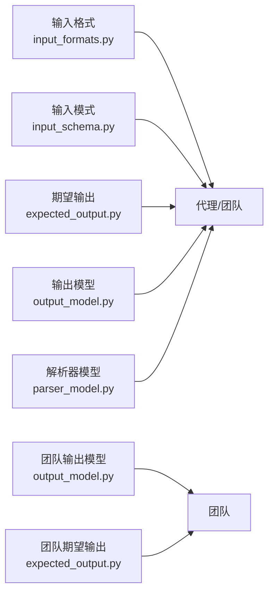

# 团队结构化输入输出

<cite>
**本文档引用的文件**
- [cookbook/02_agents/02_input_output/expected_output.py](file://cookbook/02_agents/02_input_output/expected_output.py)
- [cookbook/02_agents/02_input_output/input_formats.py](file://cookbook/02_agents/02_input_output/input_formats.py)
- [cookbook/02_agents/02_input_output/input_schema.py](file://cookbook/02_agents/02_input_output/input_schema.py)
- [cookbook/02_agents/02_input_output/output_model.py](file://cookbook/02_agents/02_input_output/output_model.py)
- [cookbook/02_agents/02_input_output/output_schema.py](file://cookbook/02_agents/02_input_output/output_schema.py)
- [cookbook/02_agents/02_input_output/parser_model.py](file://cookbook/02_agents/02_input_output/parser_model.py)
- [cookbook/02_agents/02_input_output/response_as_variable.py](file://cookbook/02_agents/02_input_output/response_as_variable.py)
- [cookbook/03_teams/04_structured_input_output/expected_output.py](file://cookbook/03_teams/04_structured_input_output/expected_output.py)
- [cookbook/03_teams/04_structured_input_output/input_formats.py](file://cookbook/03_teams/04_structured_input_output/input_formats.py)
- [cookbook/03_teams/04_structured_input_output/output_model.py](file://cookbook/03_teams/04_structured_input_output/output_model.py)
</cite>

## 目录
1. 引言
2. 项目结构
3. 核心组件
4. 架构总览
5. 组件详解
6. 依赖关系分析
7. 性能考量
8. 故障排查指南
9. 结论
10. 附录

## 引言
本文件系统性梳理团队在结构化输入输出方面的实践与实现，围绕以下主题展开：输入格式验证、输出模式定义、数据传递机制；期望输出的配置（格式、约束与验证）；输入格式处理（多类型解析与转换）；输入模式定义（JSON 模式、Pydantic 模型与自定义模式）；输出模型创建与使用（结构化输出生成与格式化）；以及在团队协作中的应用价值与场景。

## 项目结构
本项目的结构化输入输出示例主要分布在两个层次：
- 代理（Agent）层：单体智能体的输入输出控制与模式化处理
- 团队（Team）层：多智能体协作下的结构化输入输出编排

示例文件分布如下：
- 代理层示例：期望输出、输入格式、输入模式（Pydantic）、输出模型、解析器模型、响应变量
- 团队层示例：期望输出、输入格式、输出模型

图表来源
- [cookbook/02_agents/02_input_output/expected_output.py:1-29](file://cookbook/02_agents/02_input_output/expected_output.py#L1-L29)
- [cookbook/02_agents/02_input_output/input_formats.py:1-35](file://cookbook/02_agents/02_input_output/input_formats.py#L1-L35)
- [cookbook/02_agents/02_input_output/input_schema.py:1-60](file://cookbook/02_agents/02_input_output/input_schema.py#L1-L60)
- [cookbook/02_agents/02_input_output/output_model.py:1-35](file://cookbook/02_agents/02_input_output/output_model.py#L1-L35)
- [cookbook/02_agents/02_input_output/output_schema.py:1-26](file://cookbook/02_agents/02_input_output/output_schema.py#L1-L26)
- [cookbook/02_agents/02_input_output/parser_model.py:1-99](file://cookbook/02_agents/02_input_output/parser_model.py#L1-L99)
- [cookbook/02_agents/02_input_output/response_as_variable.py:1-34](file://cookbook/02_agents/02_input_output/response_as_variable.py#L1-L34)
- [cookbook/03_teams/04_structured_input_output/expected_output.py:1-55](file://cookbook/03_teams/04_structured_input_output/expected_output.py#L1-L55)
- [cookbook/03_teams/04_structured_input_output/input_formats.py:1-51](file://cookbook/03_teams/04_structured_input_output/input_formats.py#L1-L51)
- [cookbook/03_teams/04_structured_input_output/output_model.py:1-37](file://cookbook/03_teams/04_structured_input_output/output_model.py#L1-L37)

章节来源
- [cookbook/02_agents/02_input_output/expected_output.py:1-29](file://cookbook/02_agents/02_input_output/expected_output.py#L1-L29)
- [cookbook/03_teams/04_structured_input_output/expected_output.py:1-55](file://cookbook/03_teams/04_structured_input_output/expected_output.py#L1-L55)

## 核心组件
- 期望输出（Expected Output）
  - 作用：通过明确的描述性指令引导模型生成符合预期的输出形态（如分段、字数、格式等），提升一致性与可读性。
  - 应用：代理与团队均可设置，团队级期望输出用于统一多成员协作的最终呈现风格。
- 输入格式（Input Formats）
  - 作用：支持多种输入形式（字符串、消息列表、工具调用消息等），确保调用接口对不同数据形态具备兼容性。
  - 应用：代理与团队均支持字典、列表、消息数组等多种输入。
- 输入模式（Input Schema）
  - 作用：以 Pydantic 模型定义输入结构，实现强类型校验与自动补全，便于跨模块传递与工具消费。
  - 应用：将输入参数规范化为结构化对象，降低歧义与错误。
- 输出模型（Output Model）
  - 作用：使用更强能力的模型对主模型输出进行二次润色与格式化，适用于成本与效果平衡的场景。
  - 应用：主模型负责推理/工具调用，输出模型负责最终文案质量。
- 解析器模型（Parser Model）
  - 作用：专门用于结构化 JSON 的解析与重建，保证输出严格符合预设模式。
  - 应用：当需要稳定、可验证的结构化 JSON 时优先选择解析器模型。
- 响应变量（Response As Variable）
  - 作用：将运行结果保存为可操作的对象，便于后续处理、流式事件订阅或调试。
  - 应用：run 接口返回 RunOutput，print_response 仅打印。

章节来源
- [cookbook/02_agents/02_input_output/output_model.py:1-35](file://cookbook/02_agents/02_input_output/output_model.py#L1-L35)
- [cookbook/02_agents/02_input_output/parser_model.py:1-99](file://cookbook/02_agents/02_input_output/parser_model.py#L1-L99)
- [cookbook/02_agents/02_input_output/response_as_variable.py:1-34](file://cookbook/02_agents/02_input_output/response_as_variable.py#L1-L34)

## 架构总览
下图展示了从“输入到结构化输出”的整体流程，涵盖期望输出、输入格式、输入模式、输出模型与解析器模型之间的协同关系。

图表来源
- [cookbook/02_agents/02_input_output/output_model.py:1-35](file://cookbook/02_agents/02_input_output/output_model.py#L1-L35)
- [cookbook/02_agents/02_input_output/parser_model.py:1-99](file://cookbook/02_agents/02_input_output/parser_model.py#L1-L99)
- [cookbook/03_teams/04_structured_input_output/expected_output.py:1-55](file://cookbook/03_teams/04_structured_input_output/expected_output.py#L1-L55)

## 组件详解

### 期望输出（Expected Output）
- 配置方式
  - 代理：在构造函数中传入期望输出描述，配合 markdown 控制输出格式。
  - 团队：在团队构造函数中设置，统一多成员输出风格。
- 约束与验证
  - 通过自然语言约束输出结构（如分段、字数、术语风格），减少歧义。
  - 可结合团队级 instructions 进一步规范表达风格。
- 使用建议
  - 在复杂任务中先明确“期望输出”，再设计输入模式与工具链。
  - 对于团队协作，建议在团队层面统一期望输出，避免成员风格不一致。

章节来源
- [cookbook/02_agents/02_input_output/expected_output.py:1-29](file://cookbook/02_agents/02_input_output/expected_output.py#L1-L29)
- [cookbook/03_teams/04_structured_input_output/expected_output.py:1-55](file://cookbook/03_teams/04_structured_input_output/expected_output.py#L1-L55)

### 输入格式（Input Formats）
- 支持类型
  - 字符串：简洁问答或简短提示。
  - 列表：交替消息或要点清单。
  - 消息数组：包含 role/content 的标准对话消息。
- 处理逻辑
  - 内部统一转为消息数组，确保后续处理一致性。
  - 多媒体输入（如图像）通过复合内容结构传递。
- 最佳实践
  - 明确输入边界，避免混杂格式导致解析歧义。
  - 在团队场景中，建议统一输入格式以降低编排复杂度。

章节来源
- [cookbook/02_agents/02_input_output/input_formats.py:1-35](file://cookbook/02_agents/02_input_output/input_formats.py#L1-L35)
- [cookbook/03_teams/04_structured_input_output/input_formats.py:1-51](file://cookbook/03_teams/04_structured_input_output/input_formats.py#L1-L51)

### 输入模式（Input Schema）
- 定义与使用
  - 使用 Pydantic 模型定义输入字段、默认值与描述，实现强类型校验。
  - 支持直接传入字典或 Pydantic 实例，内部自动校验与转换。
- 约束与验证
  - 字段必填/可选、范围限制（如 ge/le）、默认值等由模型声明。
  - 工具与下游模块可直接消费结构化输入，减少重复校验。
- 典型场景
  - 研究任务的结构化输入（主题、关注点、受众、资源数量等）。

章节来源
- [cookbook/02_agents/02_input_output/input_schema.py:1-60](file://cookbook/02_agents/02_input_output/input_schema.py#L1-L60)

### 输出模型（Output Model）
- 设计思路
  - 主模型专注推理与工具调用，输出模型负责最终文案的润色与格式化。
  - 适合对成本与质量有平衡需求的任务。
- 配置要点
  - 通过 output_model 与 output_model_prompt 指定替代模型与提示词。
- 流程示意

图表来源
- [cookbook/02_agents/02_input_output/output_model.py:1-35](file://cookbook/02_agents/02_input_output/output_model.py#L1-L35)

章节来源
- [cookbook/02_agents/02_input_output/output_model.py:1-35](file://cookbook/02_agents/02_input_output/output_model.py#L1-L35)

### 解析器模型（Parser Model）
- 适用场景
  - 需要稳定、可验证的结构化 JSON 输出时优先使用。
- 模式定义
  - 使用 Pydantic 模型定义输出字段、约束与默认值，确保解析后数据一致性。
- 流程示意

图表来源
- [cookbook/02_agents/02_input_output/parser_model.py:1-99](file://cookbook/02_agents/02_input_output/parser_model.py#L1-L99)

章节来源
- [cookbook/02_agents/02_input_output/parser_model.py:1-99](file://cookbook/02_agents/02_input_output/parser_model.py#L1-L99)

### 响应变量（Response As Variable）
- 作用
  - 将运行结果保存为可操作对象，便于后续处理、流式事件订阅或调试。
- 使用方式
  - run 接口返回 RunOutput，print_response 仅打印。
  - 支持流式与非流式两种模式。

章节来源
- [cookbook/02_agents/02_input_output/response_as_variable.py:1-34](file://cookbook/02_agents/02_input_output/response_as_variable.py#L1-L34)

### 团队协作中的结构化输入输出
- 期望输出
  - 团队级期望输出统一多成员的最终呈现风格，避免风格漂移。
- 输入格式
  - 团队支持多种输入形式，便于不同来源的数据接入。
- 输出模型
  - 团队可指定独立的输出模型，确保最终报告的质量与一致性。

章节来源
- [cookbook/03_teams/04_structured_input_output/expected_output.py:1-55](file://cookbook/03_teams/04_structured_input_output/expected_output.py#L1-L55)
- [cookbook/03_teams/04_structured_input_output/input_formats.py:1-51](file://cookbook/03_teams/04_structured_input_output/input_formats.py#L1-L51)
- [cookbook/03_teams/04_structured_input_output/output_model.py:1-37](file://cookbook/03_teams/04_structured_input_output/output_model.py#L1-L37)

## 依赖关系分析
- 组件耦合
  - 期望输出与输出模型/解析器模型存在“目标一致性”耦合：期望输出决定最终形态，输出模型负责润色，解析器模型负责结构化。
  - 输入模式与工具链存在“契约一致性”耦合：输入模式定义了工具消费的结构，降低上游/下游的适配成本。
- 外部依赖
  - OpenAIResponses 作为模型提供方，贯穿示例中的主模型、输出模型与解析器模型。
  - Pydantic 用于输入/输出模式的定义与校验。
- 循环依赖
  - 示例未见循环依赖，各组件职责清晰。

图表来源
- [cookbook/02_agents/02_input_output/input_formats.py:1-35](file://cookbook/02_agents/02_input_output/input_formats.py#L1-L35)
- [cookbook/02_agents/02_input_output/input_schema.py:1-60](file://cookbook/02_agents/02_input_output/input_schema.py#L1-L60)
- [cookbook/02_agents/02_input_output/expected_output.py:1-29](file://cookbook/02_agents/02_input_output/expected_output.py#L1-L29)
- [cookbook/02_agents/02_input_output/output_model.py:1-35](file://cookbook/02_agents/02_input_output/output_model.py#L1-L35)
- [cookbook/02_agents/02_input_output/parser_model.py:1-99](file://cookbook/02_agents/02_input_output/parser_model.py#L1-L99)
- [cookbook/03_teams/04_structured_input_output/output_model.py:1-37](file://cookbook/03_teams/04_structured_input_output/output_model.py#L1-L37)
- [cookbook/03_teams/04_structured_input_output/expected_output.py:1-55](file://cookbook/03_teams/04_structured_input_output/expected_output.py#L1-L55)

## 性能考量
- 成本优化
  - 使用低成本主模型进行推理与工具调用，高成本模型仅用于最终润色（输出模型）。
- 速度与稳定性
  - 解析器模型可显著提升结构化输出的稳定性与可解析性，减少重试与修正成本。
- 并发与流式
  - 建议在团队协作中采用流式输出，结合响应变量进行增量处理与监控。

## 故障排查指南
- 输出不符合期望
  - 检查期望输出描述是否清晰、具体；必要时增加约束与示例。
  - 若使用团队，确认团队级期望输出与成员角色说明一致。
- 输入格式报错
  - 确认输入为字符串、列表或消息数组之一；多媒体输入需遵循复合内容结构。
  - 在团队场景中统一输入格式，避免混杂导致解析失败。
- 输入模式校验失败
  - 检查 Pydantic 字段类型、必填项与范围约束；确保传入值与模型一致。
- 输出模型无效
  - 确认输出模型提示词与任务目标匹配；必要时调整输出模型参数。
- 解析器模型解析失败
  - 检查输出模式字段与约束；确保主模型输出可被解析器稳定还原。

章节来源
- [cookbook/02_agents/02_input_output/parser_model.py:1-99](file://cookbook/02_agents/02_input_output/parser_model.py#L1-L99)
- [cookbook/02_agents/02_input_output/output_model.py:1-35](file://cookbook/02_agents/02_input_output/output_model.py#L1-L35)

## 结论
通过期望输出、输入格式、输入模式、输出模型与解析器模型的组合，团队能够在多智能体协作中实现“输入可控、过程可管、输出可预期”。建议在实际落地中：
- 先定义期望输出，再设计输入模式与工具链；
- 在代理与团队层面分别配置输出模型与解析器模型，以满足不同场景的成本与质量要求；
- 统一输入格式与响应变量处理，提升可观测性与可维护性。

## 附录
- 代码示例路径（不含具体代码内容）
  - 期望输出（代理）：[expected_output.py:1-29](file://cookbook/02_agents/02_input_output/expected_output.py#L1-L29)
  - 输入格式（代理）：[input_formats.py:1-35](file://cookbook/02_agents/02_input_output/input_formats.py#L1-L35)
  - 输入模式（代理）：[input_schema.py:1-60](file://cookbook/02_agents/02_input_output/input_schema.py#L1-L60)
  - 输出模型（代理）：[output_model.py:1-35](file://cookbook/02_agents/02_input_output/output_model.py#L1-L35)
  - 输出模式（代理）：[output_schema.py:1-26](file://cookbook/02_agents/02_input_output/output_schema.py#L1-L26)
  - 解析器模型（代理）：[parser_model.py:1-99](file://cookbook/02_agents/02_input_output/parser_model.py#L1-L99)
  - 响应变量（代理）：[response_as_variable.py:1-34](file://cookbook/02_agents/02_input_output/response_as_variable.py#L1-L34)
  - 期望输出（团队）：[expected_output.py:1-55](file://cookbook/03_teams/04_structured_input_output/expected_output.py#L1-L55)
  - 输入格式（团队）：[input_formats.py:1-51](file://cookbook/03_teams/04_structured_input_output/input_formats.py#L1-L51)
  - 输出模型（团队）：[output_model.py:1-37](file://cookbook/03_teams/04_structured_input_output/output_model.py#L1-L37)