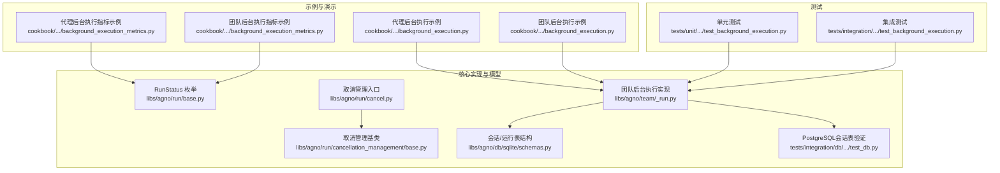
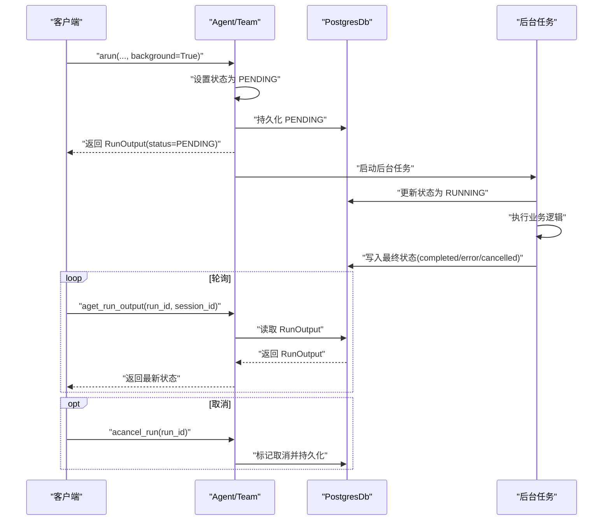
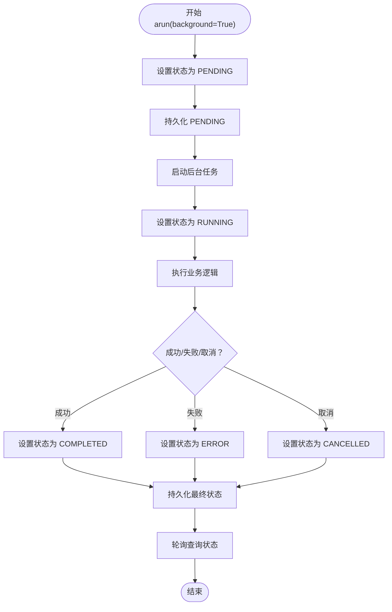
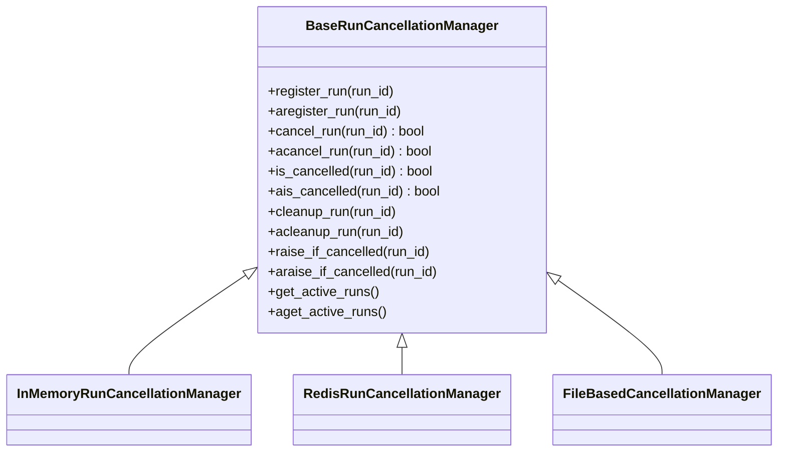
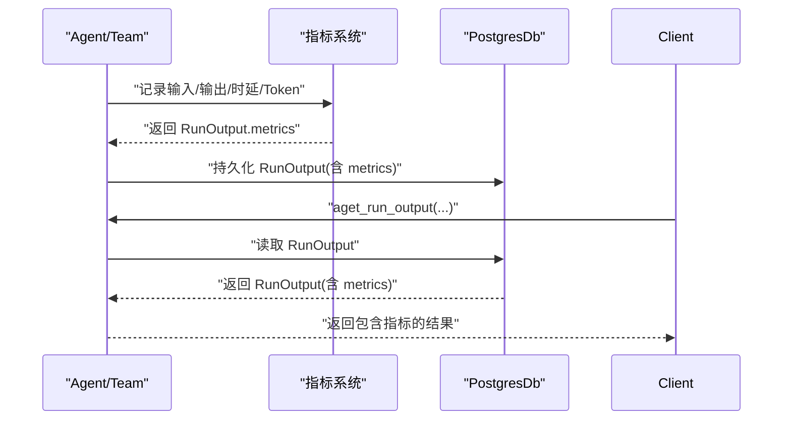
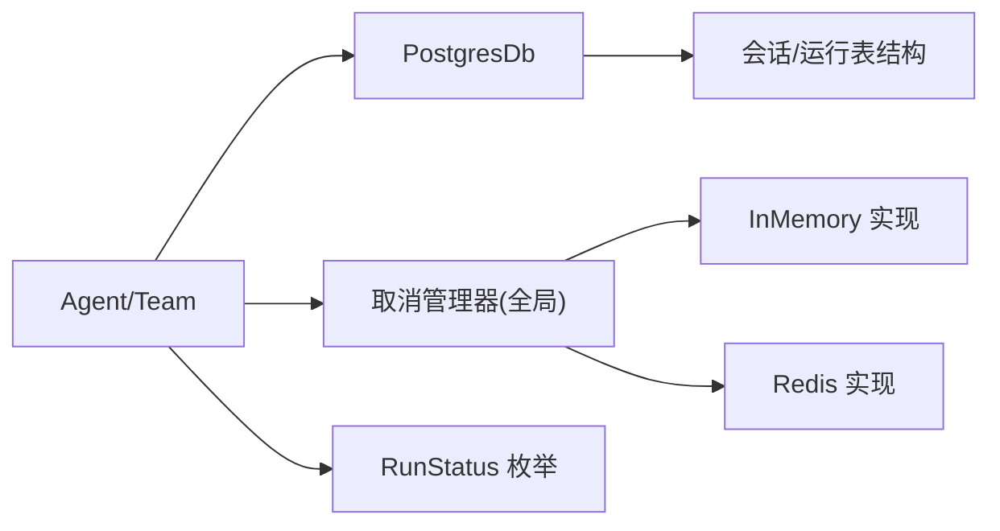

# 后台执行

<cite>
**本文引用的文件**
- [background_execution.py（代理示例）](file://cookbook/02_agents/14_advanced/background_execution.py)
- [background_execution_metrics.py（代理指标示例）](file://cookbook/02_agents/14_advanced/background_execution_metrics.py)
- [background_execution.py（团队示例）](file://cookbook/03_teams/14_run_control/background_execution.py)
- [background_execution_metrics.py（团队指标示例）](file://cookbook/03_teams/14_run_control/background_execution_metrics.py)
- [test_background_execution.py（集成测试）](file://libs/agno/tests/integration/workflows/test_background_execution.py)
- [test_background_execution.py（单元测试）](file://libs/agno/tests/unit/agent/test_background_execution.py)
- [background_execution.md（代理说明）](file://cookbook/02_agents/14_advanced/background_execution.md)
- [background_execution.md（团队说明）](file://cookbook/03_teams/14_run_control/background_execution.md)
- [base.py（运行状态枚举）](file://libs/agno/agno/run/base.py)
- [_run.py（团队后台执行实现）](file://libs/agno/agno/team/_run.py)
- [cancel.py（取消管理入口）](file://libs/agno/agno/run/cancel.py)
- [base.py（取消管理基类）](file://libs/agno/agno/run/cancellation_management/base.py)
- [schemas.py（会话/运行表结构）](file://libs/agno/agno/db/sqlite/schemas.py)
- [test_db.py（PostgreSQL会话表验证）](file://libs/agno/tests/integration/db/async_postgres/test_db.py)
- [background_execution_structured.md（并发与会话隔离）](file://cookbook/02_agents/14_advanced/background_execution_structured.md)
</cite>

## 目录
1. [简介](#简介)
2. [项目结构](#项目结构)
3. [核心组件](#核心组件)
4. [架构总览](#架构总览)
5. [详细组件分析](#详细组件分析)
6. [依赖分析](#依赖分析)
7. [性能考虑](#性能考虑)
8. [故障排查指南](#故障排查指南)
9. [结论](#结论)
10. [附录](#附录)

## 简介
本文件面向团队后台执行系统，系统性阐述基于异步后台执行的实现原理、任务调度与状态管理、配置选项、指标采集与分析，并提供可直接参考的代码示例路径与最佳实践。后台执行通过在调用端立即返回“待处理”状态，将实际计算放入后台异步执行，最终将结果持久化至数据库，供轮询查询或取消控制。该机制显著提升吞吐量、降低请求延迟、改善资源利用率，同时保持与同步执行一致的指标与可观测性。

## 项目结构
围绕后台执行的关键文件与示例如下：
- 示例与演示
  - 代理后台执行示例：cookbook/02_agents/14_advanced/background_execution.py
  - 团队后台执行示例：cookbook/03_teams/14_run_control/background_execution.py
  - 代理后台执行指标示例：cookbook/02_agents/14_advanced/background_execution_metrics.py
  - 团队后台执行指标示例：cookbook/03_teams/14_run_control/background_execution_metrics.py
- 单元/集成测试
  - libs/agno/tests/unit/agent/test_background_execution.py
  - libs/agno/tests/integration/workflows/test_background_execution.py
- 核心实现与模型
  - libs/agno/agno/run/base.py（RunStatus 枚举）
  - libs/agno/agno/team/_run.py（团队后台执行实现）
  - libs/agno/agno/run/cancel.py（取消管理入口）
  - libs/agno/agno/run/cancellation_management/base.py（取消管理基类）
  - libs/agno/agno/db/sqlite/schemas.py（会话/运行表结构）
  - libs/agno/tests/integration/db/async_postgres/test_db.py（PostgreSQL会话表验证）

**图表来源**
- [background_execution.py（代理示例）:1-186](file://cookbook/02_agents/14_advanced/background_execution.py#L1-L186)
- [background_execution.py（团队示例）:1-169](file://cookbook/03_teams/14_run_control/background_execution.py#L1-L169)
- [background_execution_metrics.py（代理指标示例）:1-97](file://cookbook/02_agents/14_advanced/background_execution_metrics.py#L1-L97)
- [background_execution_metrics.py（团队指标示例）:1-116](file://cookbook/03_teams/14_run_control/background_execution_metrics.py#L1-L116)
- [test_background_execution.py（单元测试）:1-269](file://libs/agno/tests/unit/agent/test_background_execution.py#L1-L269)
- [test_background_execution.py（集成测试）:1-306](file://libs/agno/tests/integration/workflows/test_background_execution.py#L1-L306)
- [base.py（运行状态枚举）:289-297](file://libs/agno/agno/run/base.py#L289-L297)
- [_run.py（团队后台执行实现）:3157-3174](file://libs/agno/agno/team/_run.py#L3157-L3174)
- [cancel.py（取消管理入口）:1-44](file://libs/agno/agno/run/cancel.py#L1-L44)
- [base.py（取消管理基类）:1-40](file://libs/agno/agno/run/cancellation_management/base.py#L1-L40)
- [schemas.py（会话/运行表结构）:263-270](file://libs/agno/agno/db/sqlite/schemas.py#L263-L270)
- [test_db.py（PostgreSQL会话表验证）:36-157](file://libs/agno/tests/integration/db/async_postgres/test_db.py#L36-L157)

**章节来源**
- [background_execution.py（代理示例）:1-186](file://cookbook/02_agents/14_advanced/background_execution.py#L1-L186)
- [background_execution.py（团队示例）:1-169](file://cookbook/03_teams/14_run_control/background_execution.py#L1-L169)
- [background_execution_metrics.py（代理指标示例）:1-97](file://cookbook/02_agents/14_advanced/background_execution_metrics.py#L1-L97)
- [background_execution_metrics.py（团队指标示例）:1-116](file://cookbook/03_teams/14_run_control/background_execution_metrics.py#L1-L116)
- [test_background_execution.py（单元测试）:1-269](file://libs/agno/tests/unit/agent/test_background_execution.py#L1-L269)
- [test_background_execution.py（集成测试）:1-306](file://libs/agno/tests/integration/workflows/test_background_execution.py#L1-L306)

## 核心组件
- 异步后台执行与状态管理
  - 调用端通过 arun(background=True) 立即返回 RunStatus.pending；后台任务在事件循环中执行，完成后写入数据库，状态从 pending → running → completed/error/cancelled。
  - 支持取消：运行中取消（acancel_run）与运行前取消（cancel_run），取消前注册语义保证幂等。
- 数据持久化与轮询
  - 使用 PostgresDb 或其他持久化存储，保存会话与运行状态；轮询接口 aget_run_output 或 get_run 读取最新状态。
- 指标采集与分析
  - 后台执行与同步执行共享指标体系：token 计数、模型明细、时延、首次 token 时间、步骤级指标、成员级指标等。
- 并发与隔离
  - 多任务并发需为每个任务分配独立 session_id，避免会话状态冲突。

**章节来源**
- [background_execution.md（代理说明）:1-38](file://cookbook/02_agents/14_advanced/background_execution.md#L1-L38)
- [background_execution.md（团队说明）:1-80](file://cookbook/03_teams/14_run_control/background_execution.md#L1-L80)
- [base.py（运行状态枚举）:289-297](file://libs/agno/agno/run/base.py#L289-L297)
- [background_execution_structured.md（并发与会话隔离）:41-74](file://cookbook/02_agents/14_advanced/background_execution_structured.md#L41-L74)

## 架构总览
后台执行的总体流程：调用端发起后台运行 → 立即返回 PENDING → 后台任务写入 PENDING → 进入 RUNNING → 完成后写入最终状态 → 轮询查询 → 取消控制。

**图表来源**
- [background_execution.py（代理示例）:38-86](file://cookbook/02_agents/14_advanced/background_execution.py#L38-L86)
- [background_execution.py（团队示例）:36-100](file://cookbook/03_teams/14_run_control/background_execution.py#L36-L100)
- [_run.py（团队后台执行实现）:3157-3174](file://libs/agno/agno/team/_run.py#L3157-L3174)
- [base.py（运行状态枚举）:289-297](file://libs/agno/agno/run/base.py#L289-L297)

## 详细组件分析

### 组件A：后台执行生命周期与状态流转
- 关键行为
  - 立即返回 PENDING，确保调用不阻塞
  - 后台任务先写 RUNNING 再写最终状态，保证轮询可见性
  - 错误与取消均持久化为 error/cancelled
- 验证要点
  - 单元测试覆盖：后台返回 PENDING、PENDING 先持久化、错误持久化为 ERROR
  - 集成测试覆盖：多步骤、团队、条件、并行、路由、循环等场景的后台执行

**图表来源**
- [_run.py（团队后台执行实现）:3157-3174](file://libs/agno/agno/team/_run.py#L3157-L3174)
- [base.py（运行状态枚举）:289-297](file://libs/agno/agno/run/base.py#L289-L297)
- [test_background_execution.py（单元测试）:138-269](file://libs/agno/tests/unit/agent/test_background_execution.py#L138-L269)
- [test_background_execution.py（集成测试）:14-48](file://libs/agno/tests/integration/workflows/test_background_execution.py#L14-L48)

**章节来源**
- [test_background_execution.py（单元测试）:138-269](file://libs/agno/tests/unit/agent/test_background_execution.py#L138-L269)
- [test_background_execution.py（集成测试）:14-48](file://libs/agno/tests/integration/workflows/test_background_execution.py#L14-L48)

### 组件B：取消管理与取消前注册语义
- 取消管理器
  - 提供 register_run、cancel_run、is_cancelled、cleanup_run 等接口
  - 默认内存实现，支持自定义（如文件/Redis）
- 取消前注册
  - 先取消后注册仍保留取消意图，注册后不会覆盖取消状态
- 使用建议
  - 对于后台执行，推荐使用全局取消管理器并确保后台任务定期检查取消状态

**图表来源**
- [base.py（取消管理基类）:1-40](file://libs/agno/agno/run/cancellation_management/base.py#L1-L40)
- [cancel.py（取消管理入口）:1-44](file://libs/agno/agno/run/cancel.py#L1-L44)

**章节来源**
- [base.py（取消管理基类）:1-40](file://libs/agno/agno/run/cancellation_management/base.py#L1-L40)
- [cancel.py（取消管理入口）:1-44](file://libs/agno/agno/run/cancel.py#L1-L44)

### 组件C：指标采集与分析
- 代理后台执行指标
  - 包含 token 数、模型明细、时延、首次 token 时间等
- 团队后台执行指标
  - 包含团队级指标与成员级指标，支持按模型类型拆解
- 采集方式
  - 后台执行与同步执行共享指标采集逻辑，完成后写入数据库，轮询时一并返回

**图表来源**
- [background_execution_metrics.py（代理指标示例）:44-93](file://cookbook/02_agents/14_advanced/background_execution_metrics.py#L44-L93)
- [background_execution_metrics.py（团队指标示例）:54-112](file://cookbook/03_teams/14_run_control/background_execution_metrics.py#L54-L112)

**章节来源**
- [background_execution_metrics.py（代理指标示例）:1-97](file://cookbook/02_agents/14_advanced/background_execution_metrics.py#L1-L97)
- [background_execution_metrics.py（团队指标示例）:1-116](file://cookbook/03_teams/14_run_control/background_execution_metrics.py#L1-L116)

### 组件D：并发与会话隔离
- 并发后台任务
  - 为每个任务生成独立 session_id，避免会话状态竞争
- 轮询策略
  - 指定 run_id 与 session_id 轮询，直到状态为 completed/error

**章节来源**
- [background_execution_structured.md（并发与会话隔离）:41-74](file://cookbook/02_agents/14_advanced/background_execution_structured.md#L41-L74)
- [background_execution.py（代理示例）:44-86](file://cookbook/02_agents/14_advanced/background_execution.py#L44-L86)
- [background_execution.py（团队示例）:36-100](file://cookbook/03_teams/14_run_control/background_execution.py#L36-L100)

## 依赖分析
- 组件耦合
  - Agent/Team 与数据库（PostgresDb）强耦合，用于持久化会话与运行状态
  - 取消管理器通过全局实例注入，便于替换实现
- 外部依赖
  - PostgreSQL 作为后台执行结果的持久化介质
  - 运行状态枚举 RunStatus 统一状态语义

**图表来源**
- [background_execution.py（代理示例）:27-30](file://cookbook/02_agents/14_advanced/background_execution.py#L27-L30)
- [background_execution.py（团队示例）:27-30](file://cookbook/03_teams/14_run_control/background_execution.py#L27-L30)
- [cancel.py（取消管理入口）:1-44](file://libs/agno/agno/run/cancel.py#L1-L44)
- [base.py（运行状态枚举）:289-297](file://libs/agno/agno/run/base.py#L289-L297)
- [schemas.py（会话/运行表结构）:263-270](file://libs/agno/agno/db/sqlite/schemas.py#L263-L270)

**章节来源**
- [background_execution.py（代理示例）:27-30](file://cookbook/02_agents/14_advanced/background_execution.py#L27-L30)
- [background_execution.py（团队示例）:27-30](file://cookbook/03_teams/14_run_control/background_execution.py#L27-L30)
- [cancel.py（取消管理入口）:1-44](file://libs/agno/agno/run/cancel.py#L1-L44)
- [base.py（运行状态枚举）:289-297](file://libs/agno/agno/run/base.py#L289-L297)
- [schemas.py（会话/运行表结构）:263-270](file://libs/agno/agno/db/sqlite/schemas.py#L263-L270)

## 性能考虑
- 吞吐量提升
  - 后台执行使请求立即返回，避免长尾阻塞；结合并发任务与独立 session_id，最大化并发度。
- 延迟优化
  - 调用端获得 PENDING 状态后即可返回，前端可采用指数退避轮询策略，减少无效请求。
- 资源利用率
  - 后台任务在事件循环中执行，避免主线程阻塞；数据库持久化仅在状态变更时写入，降低写放大。
- 最佳实践
  - 为长任务设置合理的轮询间隔与超时上限
  - 对高频任务进行限流与重试退避
  - 使用独立 session_id 避免会话竞争

[本节为通用性能讨论，无需特定文件分析]

## 故障排查指南
- 常见问题
  - 后台执行未返回 PENDING：确认已传入 background=True 且已配置数据库
  - 轮询不到结果：检查 run_id 与 session_id 是否匹配，数据库是否正常
  - 取消无效：确认取消管理器实现与后台任务定期检查取消状态
- 排查步骤
  - 核验数据库连接与会话表结构
  - 查看后台任务日志与状态持久化
  - 使用单元/集成测试用例对照行为
- 相关测试参考
  - 单元测试：后台返回 PENDING、PENDING 先持久化、错误持久化为 ERROR
  - 集成测试：多步骤、团队、条件、并行、路由、循环等场景的后台执行

**章节来源**
- [test_background_execution.py（单元测试）:104-133](file://libs/agno/tests/unit/agent/test_background_execution.py#L104-L133)
- [test_background_execution.py（集成测试）:159-162](file://libs/agno/tests/integration/workflows/test_background_execution.py#L159-L162)
- [test_db.py（PostgreSQL会话表验证）:36-157](file://libs/agno/tests/integration/db/async_postgres/test_db.py#L36-L157)

## 结论
后台执行通过“立即返回 + 后台执行 + 持久化状态 + 轮询查询”的模式，显著提升系统吞吐量与响应性，同时保持与同步执行一致的指标与可观测性。配合取消管理与并发隔离策略，可在团队协作与复杂工作流中稳定落地。建议在生产环境启用独立 session_id、合理轮询策略与取消管理器，并结合指标监控持续优化。

[本节为总结性内容，无需特定文件分析]

## 附录

### A. 配置与使用示例（代码路径）
- 代理后台执行（轮询与取消）
  - [示例入口与轮询:38-86](file://cookbook/02_agents/14_advanced/background_execution.py#L38-L86)
  - [取消运行:90-129](file://cookbook/02_agents/14_advanced/background_execution.py#L90-L129)
  - [取消前注册:132-174](file://cookbook/02_agents/14_advanced/background_execution.py#L132-L174)
- 团队后台执行（轮询与取消）
  - [示例入口与轮询:36-100](file://cookbook/03_teams/14_run_control/background_execution.py#L36-L100)
  - [取消运行:102-156](file://cookbook/03_teams/14_run_control/background_execution.py#L102-L156)
- 后台执行指标（代理/团队）
  - [代理指标采集与打印:44-93](file://cookbook/02_agents/14_advanced/background_execution_metrics.py#L44-L93)
  - [团队指标采集与打印:54-112](file://cookbook/03_teams/14_run_control/background_execution_metrics.py#L54-L112)
- 并发与会话隔离
  - [并发任务与独立 session_id:41-74](file://cookbook/02_agents/14_advanced/background_execution_structured.md#L41-L74)

**章节来源**
- [background_execution.py（代理示例）:38-174](file://cookbook/02_agents/14_advanced/background_execution.py#L38-L174)
- [background_execution.py（团队示例）:36-156](file://cookbook/03_teams/14_run_control/background_execution.py#L36-L156)
- [background_execution_metrics.py（代理指标示例）:44-93](file://cookbook/02_agents/14_advanced/background_execution_metrics.py#L44-L93)
- [background_execution_metrics.py（团队指标示例）:54-112](file://cookbook/03_teams/14_run_control/background_execution_metrics.py#L54-L112)
- [background_execution_structured.md（并发与会话隔离）:41-74](file://cookbook/02_agents/14_advanced/background_execution_structured.md#L41-L74)

### B. 运行状态与取消语义
- 运行状态
  - PENDING → RUNNING → COMPLETED/ERROR/CANCELLED
- 取消语义
  - 取消前注册：先取消后注册仍保留取消意图
  - 注册后取消：正常标记取消
  - 清理：移除跟踪条目，防止状态泄漏

**章节来源**
- [base.py（运行状态枚举）:289-297](file://libs/agno/agno/run/base.py#L289-L297)
- [test_background_execution.py（单元测试）:58-100](file://libs/agno/tests/unit/agent/test_background_execution.py#L58-L100)
- [base.py（取消管理基类）:1-40](file://libs/agno/agno/run/cancellation_management/base.py#L1-L40)