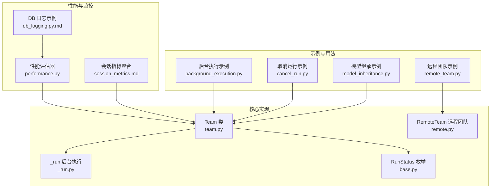
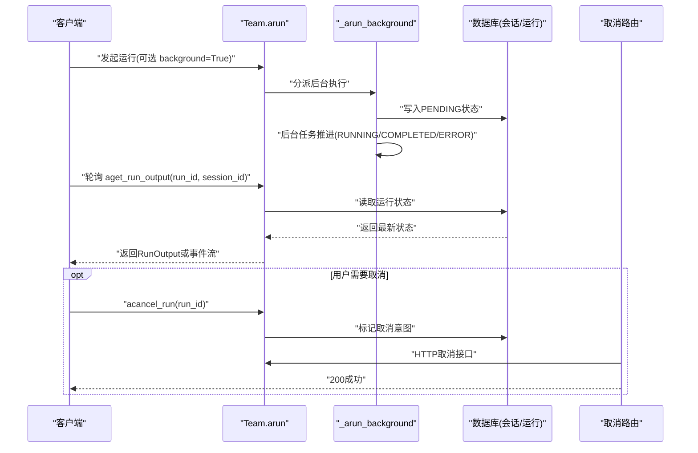
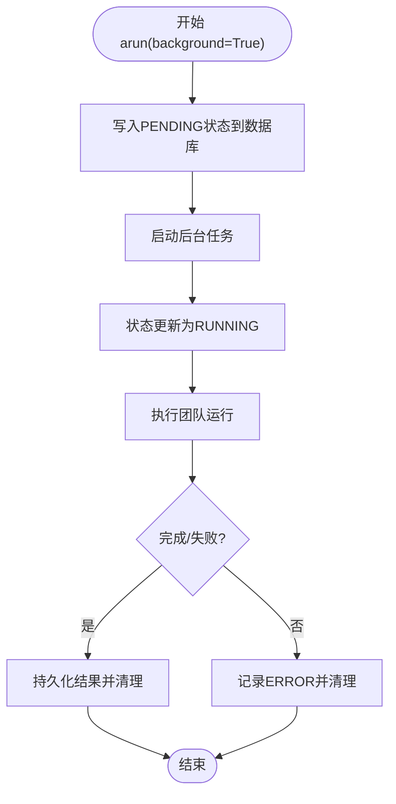
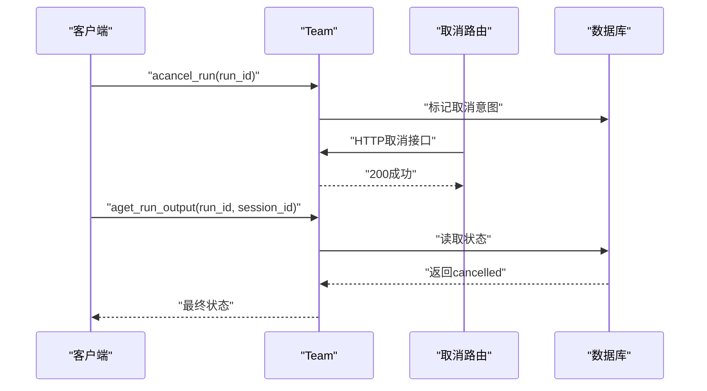
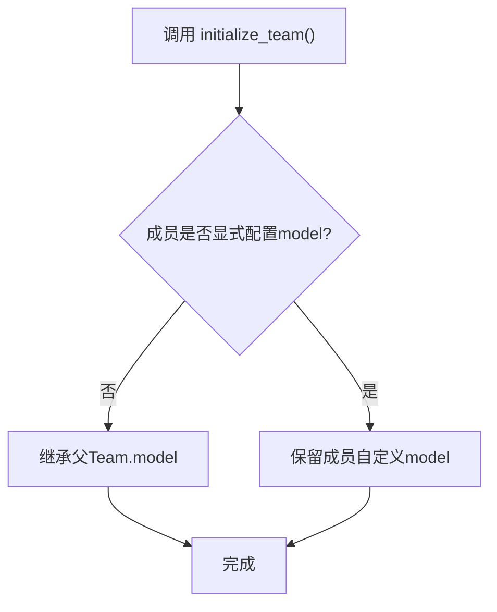
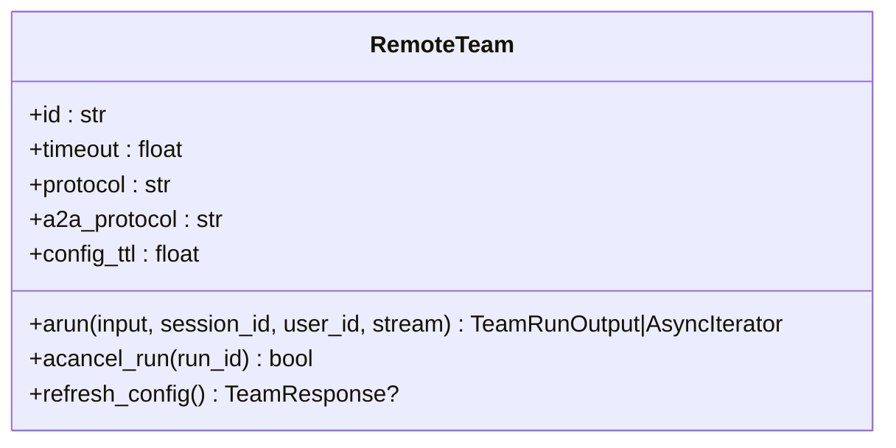
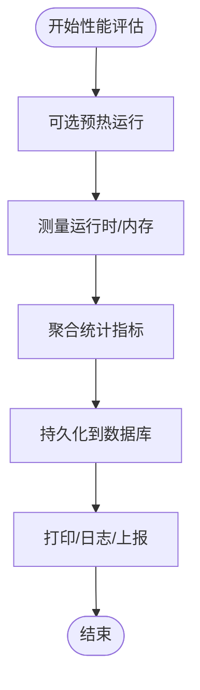
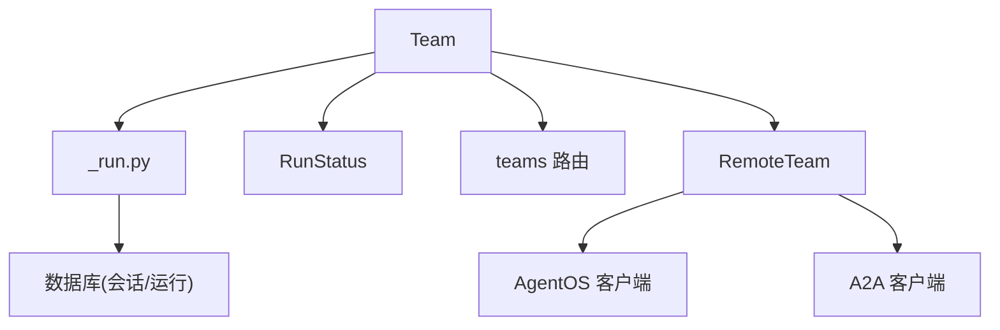

# 团队运行控制

<cite>
**本文引用的文件**
- [background_execution.py](file://cookbook/03_teams/14_run_control/background_execution.py)
- [background_execution.md](file://cookbook/03_teams/14_run_control/background_execution.md)
- [cancel_run.py](file://cookbook/03_teams/14_run_control/cancel_run.py)
- [model_inheritance.py](file://cookbook/03_teams/14_run_control/model_inheritance.py)
- [model_inheritance.md](file://cookbook/03_teams/14_run_control/model_inheritance.md)
- [remote_team.py](file://cookbook/03_teams/14_run_control/remote_team.py)
- [team.py](file://libs/agno/agno/team/team.py)
- [_run.py](file://libs/agno/agno/team/_run.py)
- [remote.py](file://libs/agno/agno/team/remote.py)
- [base.py](file://libs/agno/agno/run/base.py)
- [performance.py](file://libs/agno/agno/eval/performance.py)
- [db_logging.py.md](file://cookbook/09_evals/performance/db_logging.py.md)
- [session_metrics.md](file://cookbook/02_agents/14_advanced/session_metrics.md)
- [router.py](file://libs/agno/agno/os/routers/teams/router.py)
</cite>

## 目录
1. [简介](#简介)
2. [项目结构](#项目结构)
3. [核心组件](#核心组件)
4. [架构总览](#架构总览)
5. [详细组件分析](#详细组件分析)
6. [依赖分析](#依赖分析)
7. [性能考量](#性能考量)
8. [故障排查指南](#故障排查指南)
9. [结论](#结论)
10. [附录](#附录)

## 简介
本文件系统化阐述团队运行控制系统的设计与实现，覆盖以下关键主题：
- 执行控制：同步、异步、后台执行与轮询机制
- 调试模式与事件流：调试开关、事件过滤与中间步骤输出
- 性能监控：运行时长、内存峰值、指标聚合与持久化
- 后台执行：异步执行、进度跟踪、状态管理与清理
- 取消运行：触发条件、状态清理与资源回收
- 模型继承：模型选择、参数传递与兼容性处理
- 远程团队：网络通信协议、状态同步与故障处理
- 最佳实践：稳定性保障、运维建议与常见问题定位

## 项目结构
围绕团队运行控制的相关代码主要分布在以下位置：
- 示例与用法：cookbook/03_teams/14_run_control 下的后台执行、取消、模型继承、远程团队示例
- 核心实现：libs/agno/agno/team 下的 Team 类、_run.py 后台执行与运行管理、remote.py 远程团队
- 运行状态与事件：libs/agno/agno/run/base.py 中的 RunStatus 枚举
- 性能评估与指标：libs/agno/agno/eval/performance.py 与相关示例

**图表来源**
- [background_execution.py:1-169](file://cookbook/03_teams/14_run_control/background_execution.py#L1-L169)
- [cancel_run.py:1-201](file://cookbook/03_teams/14_run_control/cancel_run.py#L1-L201)
- [model_inheritance.py:1-72](file://cookbook/03_teams/14_run_control/model_inheritance.py#L1-L72)
- [remote_team.py:1-73](file://cookbook/03_teams/14_run_control/remote_team.py#L1-L73)
- [team.py:881-933](file://libs/agno/agno/team/team.py#L881-L933)
- [_run.py:3130-3208](file://libs/agno/agno/team/_run.py#L3130-L3208)
- [remote.py:1-200](file://libs/agno/agno/team/remote.py#L1-L200)
- [base.py:289-297](file://libs/agno/agno/run/base.py#L289-L297)
- [performance.py:109-656](file://libs/agno/agno/eval/performance.py#L109-L656)
- [db_logging.py.md:1-54](file://cookbook/09_evals/performance/db_logging.py.md#L1-L54)
- [session_metrics.md:44-64](file://cookbook/02_agents/14_advanced/session_metrics.md#L44-L64)

**章节来源**
- [background_execution.py:1-169](file://cookbook/03_teams/14_run_control/background_execution.py#L1-L169)
- [team.py:881-933](file://libs/agno/agno/team/team.py#L881-L933)

## 核心组件
- Team 类：团队运行的入口与控制中心，支持同步/异步运行、流式输出、事件钩子、调试模式、重试与遥测等
- 后台执行引擎：_arun_background 将运行注册为 PENDING，随后在后台任务中推进至 RUNNING/COMPLETED/ERROR，并持久化状态
- 运行状态：RunStatus 提供 pending/running/completed/error/cancelled 等状态枚举
- 取消机制：acancel_run 注册取消意图，远程路由提供统一取消接口
- 远程团队：RemoteTeam 支持 AgentOS 与 A2A 协议，提供远程运行与取消
- 性能监控：PerformanceEval 提供运行时与内存测量，并可将结果持久化到数据库

**章节来源**
- [team.py:881-933](file://libs/agno/agno/team/team.py#L881-L933)
- [_run.py:3130-3208](file://libs/agno/agno/team/_run.py#L3130-L3208)
- [base.py:289-297](file://libs/agno/agno/run/base.py#L289-L297)
- [remote.py:1-200](file://libs/agno/agno/team/remote.py#L1-L200)
- [performance.py:109-656](file://libs/agno/agno/eval/performance.py#L109-L656)

## 架构总览
下图展示了团队运行控制的关键交互：客户端通过 Team.arun 发起运行；后台执行将状态持久化并异步推进；调用方通过 aget_run_output 轮询；必要时通过 acancel_run 或远程取消接口触发取消。

**图表来源**
- [team.py:881-933](file://libs/agno/agno/team/team.py#L881-L933)
- [_run.py:3130-3208](file://libs/agno/agno/team/_run.py#L3130-L3208)
- [router.py:345-376](file://libs/agno/agno/os/routers/teams/router.py#L345-L376)

## 详细组件分析

### 后台执行与状态管理
- 后台执行：调用 Team.arun(background=True) 立即返回 PENDING 的 RunOutput；后台任务将状态推进为 RUNNING 并最终持久化为 COMPLETED/ERROR
- 轮询查询：通过 aget_run_output(run_id, session_id) 获取最新状态
- 状态枚举：RunStatus 包含 pending/running/completed/error/cancelled

**图表来源**
- [_run.py:3130-3208](file://libs/agno/agno/team/_run.py#L3130-L3208)
- [base.py:289-297](file://libs/agno/agno/run/base.py#L289-L297)

**章节来源**
- [background_execution.py:36-100](file://cookbook/03_teams/14_run_control/background_execution.py#L36-L100)
- [background_execution.md:1-53](file://cookbook/03_teams/14_run_control/background_execution.md#L1-L53)
- [_run.py:3130-3208](file://libs/agno/agno/team/_run.py#L3130-L3208)
- [base.py:289-297](file://libs/agno/agno/run/base.py#L289-L297)

### 取消运行机制
- 触发方式：Team.acancel_run(run_id) 注册取消意图；远程通过 HTTP 接口 /teams/{team_id}/runs/{run_id}/cancel 触发
- 状态清理：后台执行在 finally 分支中清理运行跟踪与连接工具，确保资源回收
- 结果验证：示例中在取消后再次查询最终状态，确认变为 cancelled

**图表来源**
- [team.py:715-716](file://libs/agno/agno/team/team.py#L715-L716)
- [router.py:345-376](file://libs/agno/agno/os/routers/teams/router.py#L345-L376)
- [_run.py:3100-3127](file://libs/agno/agno/team/_run.py#L3100-L3127)

**章节来源**
- [cancel_run.py:98-117](file://cookbook/03_teams/14_run_control/cancel_run.py#L98-L117)
- [team.py:715-716](file://libs/agno/agno/team/team.py#L715-L716)
- [router.py:345-376](file://libs/agno/agno/os/routers/teams/router.py#L345-L376)
- [_run.py:3100-3127](file://libs/agno/agno/team/_run.py#L3100-L3127)

### 模型继承配置
- 继承规则：未显式配置 model 的成员自动继承父 Team 的 model；显式配置的成员保持自身 model；嵌套 Team 同理
- 初始化：调用 Team.initialize_team() 触发继承逻辑，可在运行前检查成员最终使用的模型
- 适用场景：集中式模型管理，减少重复配置，同时允许个别成员覆盖

**图表来源**
- [model_inheritance.py:63-72](file://cookbook/03_teams/14_run_control/model_inheritance.py#L63-L72)

**章节来源**
- [model_inheritance.md:1-45](file://cookbook/03_teams/14_run_control/model_inheritance.md#L1-L45)
- [model_inheritance.py:1-72](file://cookbook/03_teams/14_run_control/model_inheritance.py#L1-L72)

### 远程团队管理
- 通信协议：支持 AgentOS（默认）与 A2A（跨框架）两种协议；A2A 不暴露详细配置端点
- 运行与取消：RemoteTeam.arun(...) 支持流式与非流式；提供远程取消接口
- 故障处理：示例中捕获连接异常与服务器不可用错误，提示启动远程实例后再试

**图表来源**
- [remote.py:20-200](file://libs/agno/agno/team/remote.py#L20-L200)
- [remote_team.py:1-73](file://cookbook/03_teams/14_run_control/remote_team.py#L1-L73)

**章节来源**
- [remote_team.py:1-73](file://cookbook/03_teams/14_run_control/remote_team.py#L1-L73)
- [remote.py:1-200](file://libs/agno/agno/team/remote.py#L1-L200)

### 调试模式与事件流
- 调试模式：Team 支持 debug_mode 与 show_members_responses 等调试开关，便于观察中间响应与事件
- 事件流：TeamRunEvent/RunEvent 提供 run_content、run_cancelled 等事件类型，可用于流式输出与状态感知
- 事件过滤：可通过 events_to_skip 控制事件跳过，避免噪声

**章节来源**
- [team.py:350-357](file://libs/agno/agno/team/team.py#L350-L357)
- [cancel_run.py:38-62](file://cookbook/03_teams/14_run_control/cancel_run.py#L38-L62)

### 性能监控与指标持久化
- 运行时与内存测量：PerformanceEval 支持同步与异步运行，记录平均/最小/最大/标准差/中位数/95分位等指标
- 指标聚合：示例中通过会话级聚合函数读取历史运行指标
- DB 持久化：将评估结果写入 PostgreSQL 表，便于长期追踪与报表生成

**图表来源**
- [performance.py:481-656](file://libs/agno/agno/eval/performance.py#L481-L656)
- [db_logging.py.md:1-54](file://cookbook/09_evals/performance/db_logging.py.md#L1-L54)
- [session_metrics.md:44-64](file://cookbook/02_agents/14_advanced/session_metrics.md#L44-L64)

**章节来源**
- [performance.py:109-656](file://libs/agno/agno/eval/performance.py#L109-L656)
- [db_logging.py.md:1-54](file://cookbook/09_evals/performance/db_logging.py.md#L1-L54)
- [session_metrics.md:44-64](file://cookbook/02_agents/14_advanced/session_metrics.md#L44-L64)

## 依赖分析
- Team 对运行状态的依赖：RunStatus 枚举贯穿后台执行与轮询查询
- 后台执行对数据库的依赖：_arun_background 在持久化 PENDING 后启动后台任务
- 取消接口对路由层的依赖：/teams/{team_id}/runs/{run_id}/cancel 统一处理取消
- 远程团队对协议栈的依赖：AgentOS 与 A2A 两套客户端与配置缓存策略

**图表来源**
- [team.py:881-933](file://libs/agno/agno/team/team.py#L881-L933)
- [_run.py:3130-3208](file://libs/agno/agno/team/_run.py#L3130-L3208)
- [base.py:289-297](file://libs/agno/agno/run/base.py#L289-L297)
- [router.py:345-376](file://libs/agno/agno/os/routers/teams/router.py#L345-L376)
- [remote.py:1-200](file://libs/agno/agno/team/remote.py#L1-L200)

**章节来源**
- [team.py:881-933](file://libs/agno/agno/team/team.py#L881-L933)
- [_run.py:3130-3208](file://libs/agno/agno/team/_run.py#L3130-L3208)
- [router.py:345-376](file://libs/agno/agno/os/routers/teams/router.py#L345-L376)
- [remote.py:1-200](file://libs/agno/agno/team/remote.py#L1-L200)

## 性能考量
- 异步与并发：后台执行采用 asyncio.create_task 管理后台任务，避免阻塞主线程
- 资源回收：finally 分支中断开连接工具与清理运行跟踪，防止资源泄漏
- 指标采集：运行时与内存测量结合 tracemalloc 与统计聚合，支持高并发下的稳定观测
- 存储与查询：数据库表设计支持快速查询运行状态与历史指标，降低轮询开销

[本节为通用指导，无需具体文件分析]

## 故障排查指南
- 后台执行无结果：确认已配置数据库且会话表存在；检查轮询间隔与超时设置
- 取消无效：确认取消接口返回 200；检查运行是否已进入不可取消阶段
- 远程团队连接失败：检查 base_url 与端口；确认远程实例已启动；捕获并记录连接/超时/服务器不可用异常
- 指标缺失：确认 PerformanceEval 的数据库配置与表名正确；检查日志输出与持久化流程

**章节来源**
- [background_execution.py:1-169](file://cookbook/03_teams/14_run_control/background_execution.py#L1-L169)
- [remote_team.py:58-73](file://cookbook/03_teams/14_run_control/remote_team.py#L58-L73)
- [performance.py:109-656](file://libs/agno/agno/eval/performance.py#L109-L656)

## 结论
团队运行控制系统通过“后台执行 + 状态持久化 + 轮询查询 + 统一取消接口”的组合，实现了高可用、可观测、可扩展的运行控制能力。配合调试模式、事件流与性能监控，能够在复杂场景下保障稳定性与可维护性。模型继承与远程团队进一步提升了配置灵活性与部署弹性。建议在生产环境中结合合理的超时与重试策略、完善的指标采集与告警体系，持续优化运行效率与用户体验。

[本节为总结性内容，无需具体文件分析]

## 附录
- 代码示例路径（不含代码内容，仅路径）：
  - 后台执行与轮询：[background_execution.py:36-100](file://cookbook/03_teams/14_run_control/background_execution.py#L36-L100)
  - 取消运行处理（线程与事件）：[cancel_run.py:19-96](file://cookbook/03_teams/14_run_control/cancel_run.py#L19-L96)
  - 模型继承设置与初始化：[model_inheritance.py:48-72](file://cookbook/03_teams/14_run_control/model_inheritance.py#L48-L72)
  - 远程团队运行与取消：[remote_team.py:17-44](file://cookbook/03_teams/14_run_control/remote_team.py#L17-L44)
  - 核心运行接口与后台执行：[team.py:881-933](file://libs/agno/agno/team/team.py#L881-L933), [_run.py:3130-3208](file://libs/agno/agno/team/_run.py#L3130-L3208)
  - 运行状态枚举：[base.py:289-297](file://libs/agno/agno/run/base.py#L289-L297)
  - 性能评估与持久化：[performance.py:481-656](file://libs/agno/agno/eval/performance.py#L481-L656), [db_logging.py.md:1-54](file://cookbook/09_evals/performance/db_logging.py.md#L1-L54)
  - 会话指标聚合：[session_metrics.md:44-64](file://cookbook/02_agents/14_advanced/session_metrics.md#L44-L64)
  - 取消路由接口：[router.py:345-376](file://libs/agno/agno/os/routers/teams/router.py#L345-L376)