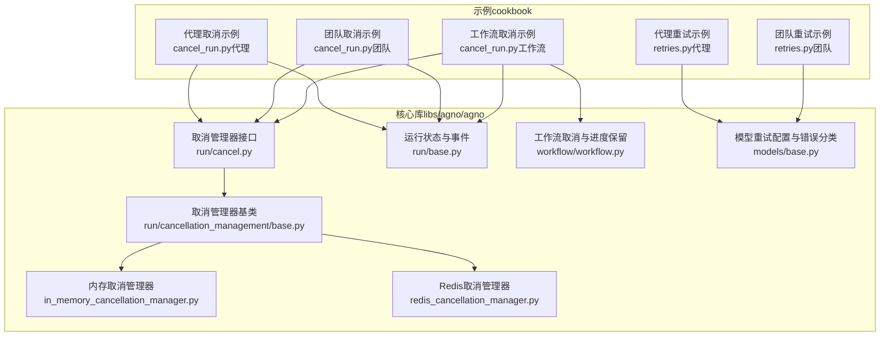
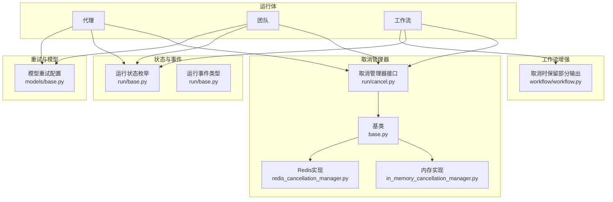
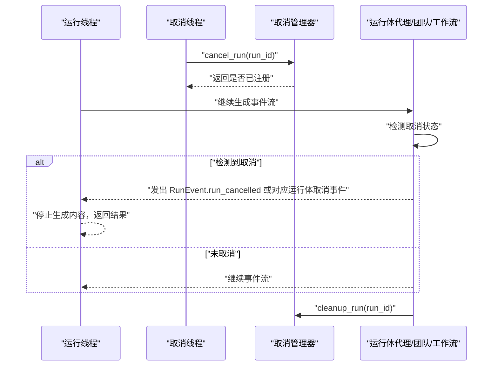
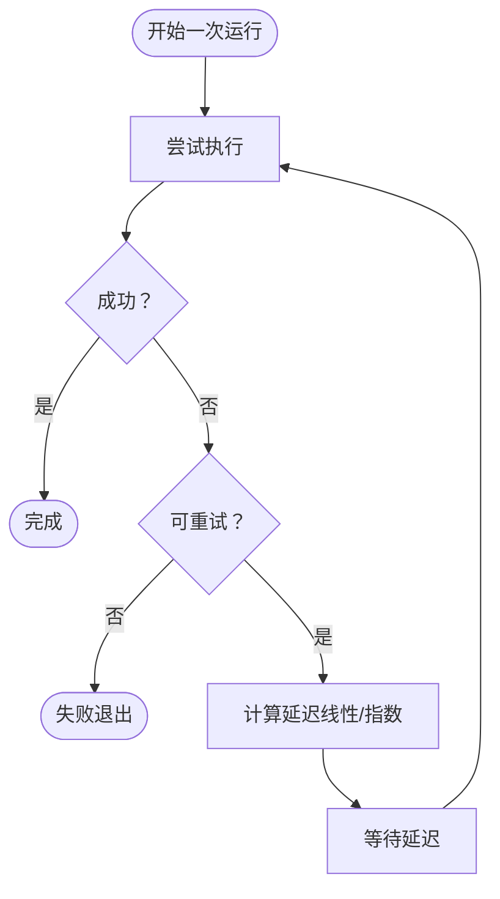
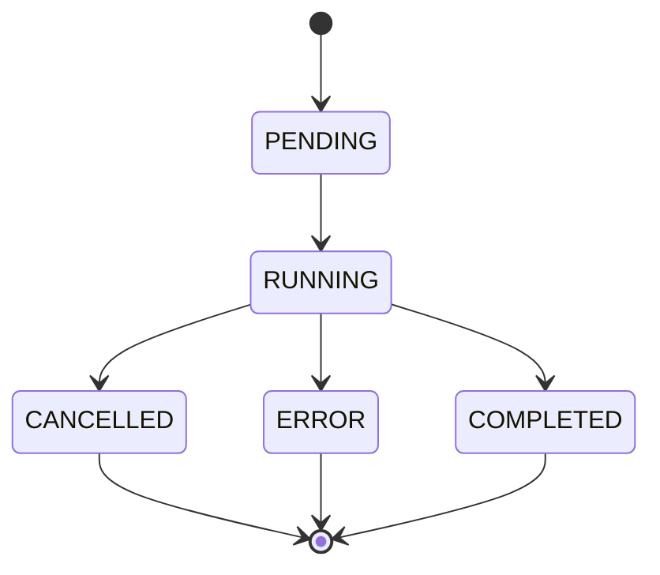
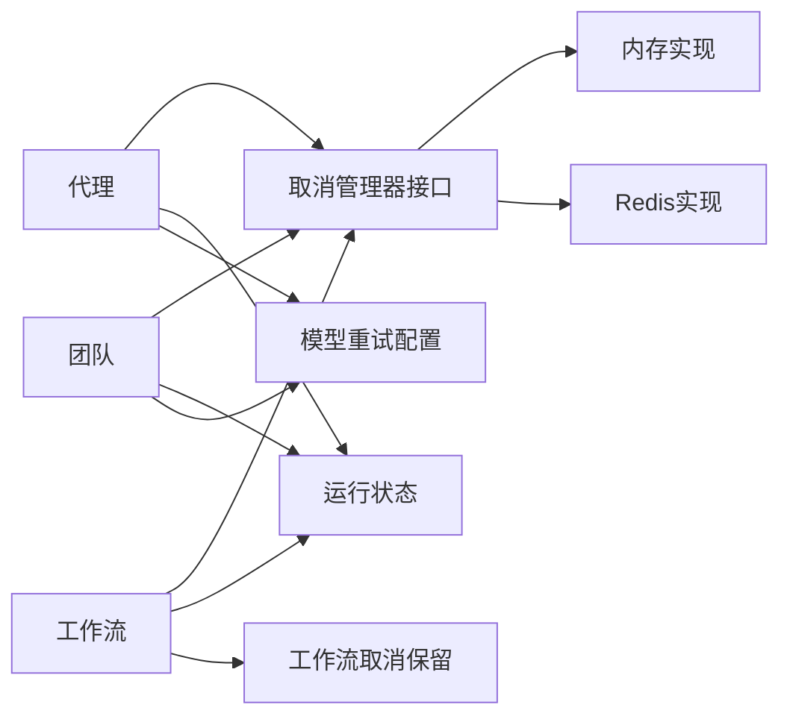

# 执行控制

<cite>
**本文引用的文件**   
- [cancel_run.py（代理示例）](file://cookbook/02_agents/14_advanced/cancel_run.py)
- [cancel_run.py（团队示例）](file://cookbook/03_teams/14_run_control/cancel_run.py)
- [cancel_run.py（工作流示例）](file://cookbook/04_workflows/06_advanced_concepts/run_control/cancel_run.py)
- [retries.py（代理示例）](file://cookbook/02_agents/14_advanced/retries.py)
- [retries.py（团队示例）](file://cookbook/03_teams/14_run_control/retries.py)
- [取消管理器基类](file://libs/agno/agno/run/cancellation_management/base.py)
- [取消管理器接口](file://libs/agno/agno/run/cancel.py)
- [内存取消管理器](file://libs/agno/agno/run/cancellation_management/in_memory_cancellation_manager.py)
- [Redis取消管理器](file://libs/agno/agno/run/cancellation_management/redis_cancellation_manager.py)
- [运行状态与事件](file://libs/agno/agno/run/base.py)
- [工作流取消与进度保留](file://libs/agno/agno/workflow/workflow.py)
- [测试：代理重试（指数退避）](file://libs/agno/tests/integration/agent/test_retries.py)
- [测试：团队重试（指数退避）](file://libs/agno/tests/integration/teams/test_retries.py)
- [模型重试配置与错误分类](file://libs/agno/agno/models/base.py)
- [SQLite运行状态字段](file://libs/agno/agno/db/sqlite/schemas.py)
</cite>

## 目录
1. [简介](#简介)
2. [项目结构](#项目结构)
3. [核心组件](#核心组件)
4. [架构总览](#架构总览)
5. [详细组件分析](#详细组件分析)
6. [依赖关系分析](#依赖关系分析)
7. [性能考量](#性能考量)
8. [故障排查指南](#故障排查指南)
9. [结论](#结论)
10. [附录](#附录)

## 简介
本文件围绕“执行控制”主题，系统化阐述以下能力与机制：
- 运行取消：取消触发逻辑、状态清理流程、资源回收策略
- 重试机制：重试策略、失败处理、幂等性保障
- 执行控制核心概念：运行状态管理、异常处理与错误恢复
- 实战示例：如何在代理、团队、工作流中实现运行取消与重试
- 团队稳定性与可靠性：最佳实践与常见问题解决方案

## 项目结构
执行控制相关代码分布在示例脚本与核心库两部分：
- 示例脚本位于 cookbook 中，覆盖代理、团队、工作流三类运行体的取消与重试用法
- 核心库位于 libs/agno/agno 下，提供取消管理器抽象、内存与Redis实现、运行状态与事件、以及模型层重试配置

**图表来源**
- [取消管理器接口:1-95](file://libs/agno/agno/run/cancel.py#L1-L95)
- [取消管理器基类:1-87](file://libs/agno/agno/run/cancellation_management/base.py#L1-L87)
- [内存取消管理器:1-117](file://libs/agno/agno/run/cancellation_management/in_memory_cancellation_manager.py#L1-L117)
- [Redis取消管理器:1-279](file://libs/agno/agno/run/cancellation_management/redis_cancellation_manager.py#L1-L279)
- [运行状态与事件:289-297](file://libs/agno/agno/run/base.py#L289-L297)
- [工作流取消与进度保留:2988-3010](file://libs/agno/agno/workflow/workflow.py#L2988-L3010)
- [模型重试配置与错误分类:164-197](file://libs/agno/agno/models/base.py#L164-L197)

**章节来源**
- [取消管理器接口:1-95](file://libs/agno/agno/run/cancel.py#L1-L95)
- [取消管理器基类:1-87](file://libs/agno/agno/run/cancellation_management/base.py#L1-L87)
- [内存取消管理器:1-117](file://libs/agno/agno/run/cancellation_management/in_memory_cancellation_manager.py#L1-L117)
- [Redis取消管理器:1-279](file://libs/agno/agno/run/cancellation_management/redis_cancellation_manager.py#L1-L279)
- [运行状态与事件:289-297](file://libs/agno/agno/run/base.py#L289-L297)
- [工作流取消与进度保留:2988-3010](file://libs/agno/agno/workflow/workflow.py#L2988-L3010)
- [模型重试配置与错误分类:164-197](file://libs/agno/agno/models/base.py#L164-L197)

## 核心组件
- 取消管理器接口与全局实例：提供注册、取消、查询、清理、抛出取消异常等统一入口，并支持同步与异步方法
- 取消管理器实现：
  - 内存实现：线程安全字典存储，适合单进程场景
  - Redis实现：分布式键值存储，支持跨进程/服务的取消广播与TTL过期
- 运行状态与事件：定义运行状态枚举与事件类型，用于取消信号传播与结果回传
- 工作流取消：在取消时保留已完成步骤与部分输出，确保可观测性与可恢复性
- 模型层重试：统一的重试配置、指数退避、错误可重试性判定

**章节来源**
- [取消管理器接口:1-95](file://libs/agno/agno/run/cancel.py#L1-L95)
- [取消管理器基类:1-87](file://libs/agno/agno/run/cancellation_management/base.py#L1-L87)
- [内存取消管理器:1-117](file://libs/agno/agno/run/cancellation_management/in_memory_cancellation_manager.py#L1-L117)
- [Redis取消管理器:1-279](file://libs/agno/agno/run/cancellation_management/redis_cancellation_manager.py#L1-L279)
- [运行状态与事件:289-297](file://libs/agno/agno/run/base.py#L289-L297)
- [工作流取消与进度保留:2988-3010](file://libs/agno/agno/workflow/workflow.py#L2988-L3010)
- [模型重试配置与错误分类:164-197](file://libs/agno/agno/models/base.py#L164-L197)

## 架构总览
执行控制的总体架构由“运行体（代理/团队/工作流）—取消管理器—状态与事件—持久化/观测”构成。

**图表来源**
- [取消管理器接口:1-95](file://libs/agno/agno/run/cancel.py#L1-L95)
- [取消管理器基类:1-87](file://libs/agno/agno/run/cancellation_management/base.py#L1-L87)
- [内存取消管理器:1-117](file://libs/agno/agno/run/cancellation_management/in_memory_cancellation_manager.py#L1-L117)
- [Redis取消管理器:1-279](file://libs/agno/agno/run/cancellation_management/redis_cancellation_manager.py#L1-L279)
- [运行状态与事件:289-297](file://libs/agno/agno/run/base.py#L289-L297)
- [工作流取消与进度保留:2988-3010](file://libs/agno/agno/workflow/workflow.py#L2988-L3010)
- [模型重试配置与错误分类:164-197](file://libs/agno/agno/models/base.py#L164-L197)

## 详细组件分析

### 运行取消机制（取消触发、状态清理与资源回收）
- 取消触发逻辑
  - 运行体在独立线程中持续产生事件流；另一线程按设定延时调用取消接口
  - 取消接口将取消意图写入取消管理器（内存或Redis），并返回是否已注册
  - 运行体在事件循环中检测取消状态，遇到取消事件时停止生成新内容并返回结果
- 状态清理流程
  - 完成或取消后，清理跟踪记录，避免状态泄漏
  - Redis实现提供TTL，防止键无限增长
- 资源回收策略
  - 取消时释放阻塞IO与网络连接
  - 工作流在取消时保留已完成步骤与部分输出，便于审计与后续恢复

**图表来源**
- [取消管理器接口:47-74](file://libs/agno/agno/run/cancel.py#L47-L74)
- [内存取消管理器:36-94](file://libs/agno/agno/run/cancellation_management/in_memory_cancellation_manager.py#L36-L94)
- [Redis取消管理器:134-210](file://libs/agno/agno/run/cancellation_management/redis_cancellation_manager.py#L134-L210)
- [运行状态与事件:289-297](file://libs/agno/agno/run/base.py#L289-L297)
- [工作流取消与进度保留:2988-3010](file://libs/agno/agno/workflow/workflow.py#L2988-L3010)

**章节来源**
- [cancel_run.py（代理示例）:93-117](file://cookbook/02_agents/14_advanced/cancel_run.py#L93-L117)
- [cancel_run.py（团队示例）:98-117](file://cookbook/03_teams/14_run_control/cancel_run.py#L98-L117)
- [cancel_run.py（工作流示例）:99-117](file://cookbook/04_workflows/06_advanced_concepts/run_control/cancel_run.py#L99-L117)
- [取消管理器接口:47-74](file://libs/agno/agno/run/cancel.py#L47-L74)
- [内存取消管理器:36-94](file://libs/agno/agno/run/cancellation_management/in_memory_cancellation_manager.py#L36-L94)
- [Redis取消管理器:134-210](file://libs/agno/agno/run/cancellation_management/redis_cancellation_manager.py#L134-L210)
- [工作流取消与进度保留:2988-3010](file://libs/agno/agno/workflow/workflow.py#L2988-L3010)

### 重试机制（策略、失败处理与幂等性）
- 策略配置
  - 在代理/团队构造时设置重试次数、每次重试间隔、是否启用指数退避
  - 模型层提供统一的重试配置与错误可重试性判定
- 失败处理
  - 指数退避：延迟按 2^attempt 计算，避免雪崩
  - 键盘中断等不可重试异常直接终止重试
- 幂等性保障
  - 通过“仅在未存在时设置”的NX语义（Redis）或setdefault（内存）保留取消前意图
  - 重试应尽量无副作用，必要时在业务层补充去重与幂等键

**图表来源**
- [模型重试配置与错误分类:164-197](file://libs/agno/agno/models/base.py#L164-L197)
- [retries.py（代理示例）:14-21](file://cookbook/02_agents/14_advanced/retries.py#L14-L21)
- [retries.py（团队示例）:31-36](file://cookbook/03_teams/14_run_control/retries.py#L31-L36)

**章节来源**
- [retries.py（代理示例）:14-21](file://cookbook/02_agents/14_advanced/retries.py#L14-L21)
- [retries.py（团队示例）:31-36](file://cookbook/03_teams/14_run_control/retries.py#L31-L36)
- [模型重试配置与错误分类:164-197](file://libs/agno/agno/models/base.py#L164-L197)
- [测试：代理重试（指数退避）:42-72](file://libs/agno/tests/integration/agent/test_retries.py#L42-L72)
- [测试：团队重试（指数退避）:45-76](file://libs/agno/tests/integration/teams/test_retries.py#L45-L76)

### 执行控制核心概念（状态管理、异常处理与恢复）
- 运行状态管理
  - 使用运行状态枚举表示 PENDING/RUNNING/COMPLETED/PAUSED/CANCELLED/ERROR
  - 运行事件驱动状态流转，取消事件作为特殊分支插入
- 异常处理与恢复
  - 取消时抛出统一异常，上层捕获并进行资源回收
  - 工作流在取消时保留已完成步骤与部分输出，便于恢复
- 数据一致性
  - Redis实现提供原子管道操作与TTL，确保跨节点一致性与健壮性

**图表来源**
- [运行状态与事件:289-297](file://libs/agno/agno/run/base.py#L289-L297)
- [工作流取消与进度保留:2988-3010](file://libs/agno/agno/workflow/workflow.py#L2988-L3010)

**章节来源**
- [运行状态与事件:289-297](file://libs/agno/agno/run/base.py#L289-L297)
- [工作流取消与进度保留:2988-3010](file://libs/agno/agno/workflow/workflow.py#L2988-L3010)

### 示例：如何实现运行取消与重试
- 运行取消
  - 在独立线程中启动运行体，另一个线程按延时调用取消接口
  - 在事件循环中监听取消事件，及时停止生成内容并返回结果
  - 完成后清理跟踪记录
- 重试
  - 在代理/团队构造时设置重试次数、间隔与指数退避
  - 对于不可重试异常（如键盘中断）立即终止重试
  - 通过测试验证指数退避延迟递增

**章节来源**
- [cancel_run.py（代理示例）:17-117](file://cookbook/02_agents/14_advanced/cancel_run.py#L17-L117)
- [cancel_run.py（团队示例）:22-117](file://cookbook/03_teams/14_run_control/cancel_run.py#L22-L117)
- [cancel_run.py（工作流示例）:24-117](file://cookbook/04_workflows/06_advanced_concepts/run_control/cancel_run.py#L24-L117)
- [retries.py（代理示例）:14-21](file://cookbook/02_agents/14_advanced/retries.py#L14-L21)
- [retries.py（团队示例）:31-36](file://cookbook/03_teams/14_run_control/retries.py#L31-L36)
- [测试：代理重试（指数退避）:42-72](file://libs/agno/tests/integration/agent/test_retries.py#L42-L72)
- [测试：团队重试（指数退避）:45-76](file://libs/agno/tests/integration/teams/test_retries.py#L45-L76)

## 依赖关系分析
- 运行体（代理/团队/工作流）依赖取消管理器接口进行取消与状态查询
- 取消管理器实现依赖运行状态与事件类型以正确传播取消信号
- 工作流在取消时依赖运行响应结构以保留已完成步骤与部分输出
- 模型层重试配置为运行体提供统一的失败处理策略

**图表来源**
- [取消管理器接口:1-95](file://libs/agno/agno/run/cancel.py#L1-L95)
- [内存取消管理器:1-117](file://libs/agno/agno/run/cancellation_management/in_memory_cancellation_manager.py#L1-L117)
- [Redis取消管理器:1-279](file://libs/agno/agno/run/cancellation_management/redis_cancellation_manager.py#L1-L279)
- [运行状态与事件:289-297](file://libs/agno/agno/run/base.py#L289-L297)
- [工作流取消与进度保留:2988-3010](file://libs/agno/agno/workflow/workflow.py#L2988-L3010)
- [模型重试配置与错误分类:164-197](file://libs/agno/agno/models/base.py#L164-L197)

**章节来源**
- [取消管理器接口:1-95](file://libs/agno/agno/run/cancel.py#L1-L95)
- [运行状态与事件:289-297](file://libs/agno/agno/run/base.py#L289-L297)
- [工作流取消与进度保留:2988-3010](file://libs/agno/agno/workflow/workflow.py#L2988-L3010)
- [模型重试配置与错误分类:164-197](file://libs/agno/agno/models/base.py#L164-L197)

## 性能考量
- 取消传播
  - 内存实现适合低延迟、单进程场景；Redis实现适合分布式场景，需关注网络开销与TTL设置
- 重试策略
  - 指数退避可缓解瞬时峰值，但需结合最大重试次数与总超时时间，避免长时间阻塞
- 资源回收
  - 取消时尽快释放阻塞IO与网络连接；工作流取消保留部分输出会增加序列化成本，建议按需裁剪

## 故障排查指南
- 取消无效
  - 检查是否在运行前调用了注册接口；确认取消管理器实现（内存/Redis）是否正确初始化
  - 核对运行体事件循环是否监听取消事件
- 重试未生效
  - 确认错误类型是否可重试；检查指数退避参数与最大重试次数
  - 对于键盘中断等不可重试异常，重试逻辑会提前终止
- 状态不一致
  - Redis实现需确保键前缀与TTL配置一致；清理逻辑应在完成或取消后调用

**章节来源**
- [取消管理器接口:13-34](file://libs/agno/agno/run/cancel.py#L13-L34)
- [内存取消管理器:18-53](file://libs/agno/agno/run/cancellation_management/in_memory_cancellation_manager.py#L18-L53)
- [Redis取消管理器:49-66](file://libs/agno/agno/run/cancellation_management/redis_cancellation_manager.py#L49-L66)
- [模型重试配置与错误分类:181-197](file://libs/agno/agno/models/base.py#L181-L197)
- [测试：代理重试（指数退避）:42-72](file://libs/agno/tests/integration/agent/test_retries.py#L42-L72)
- [测试：团队重试（指数退避）:45-76](file://libs/agno/tests/integration/teams/test_retries.py#L45-L76)

## 结论
执行控制通过“统一的取消管理器接口 + 多实现（内存/Redis）+ 明确的运行状态与事件 + 工作流取消保留 + 模型层重试配置”，为代理、团队与工作流提供了高可靠、可观测、可恢复的运行控制能力。团队在实践中应根据部署形态选择合适的取消管理器实现，并结合指数退避与幂等性设计，确保系统在复杂场景下的稳定性与可靠性。

## 附录
- 取消触发条件
  - 运行体在事件循环中检测到取消事件
  - 取消线程在指定延时后调用取消接口
- 重试次数配置
  - 代理/团队构造时设置 retries、delay_between_retries、exponential_backoff
- 超时处理
  - 结合重试总时长与外部超时限制，避免无限等待