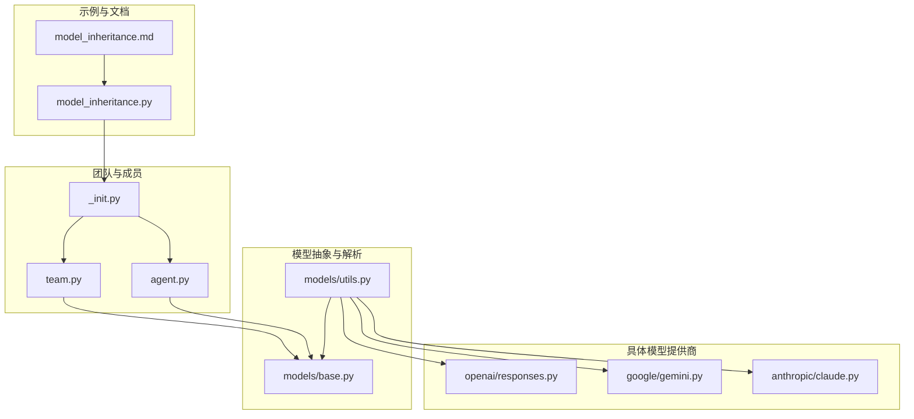
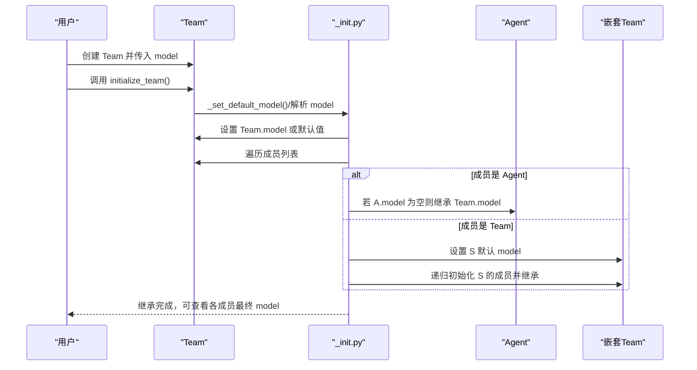
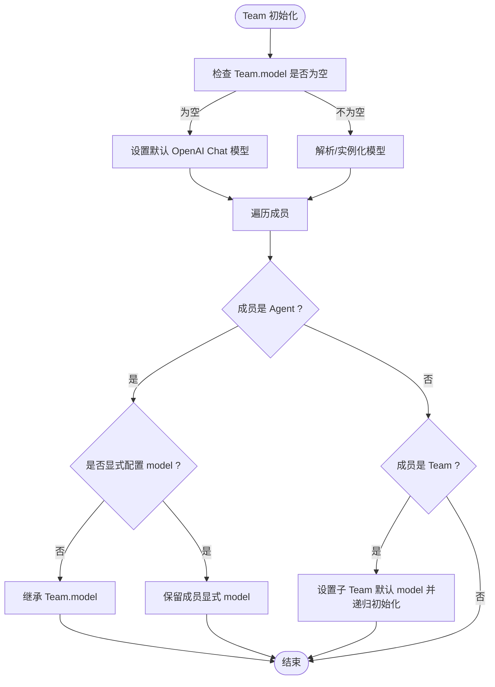
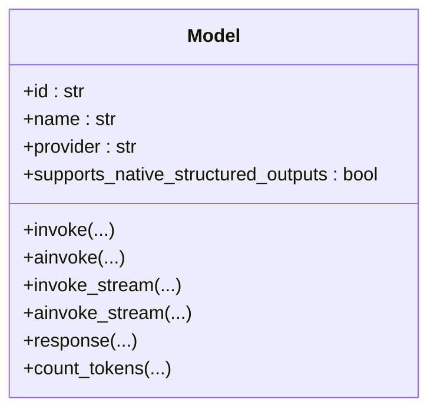
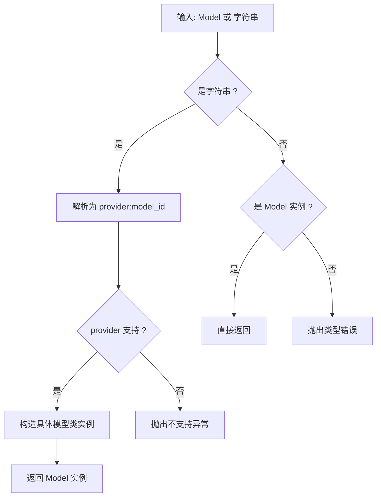
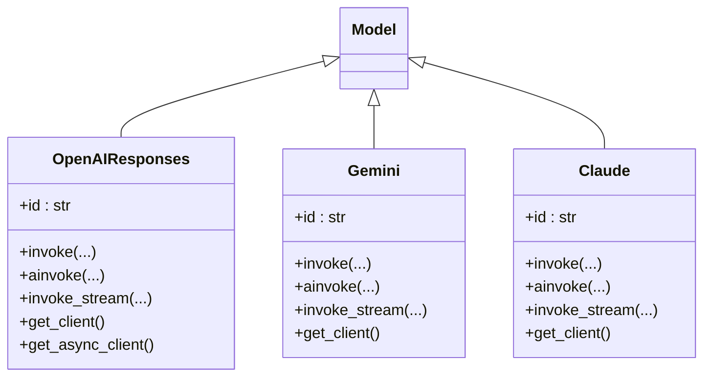
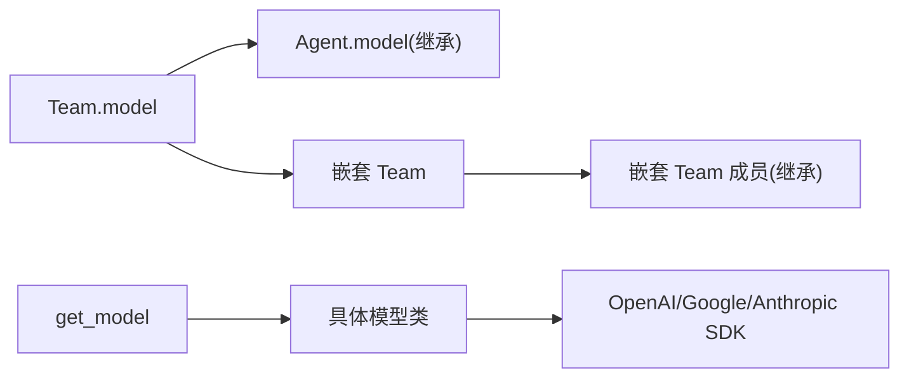

# 模型继承

<cite>
**本文引用的文件**
- [model_inheritance.py](file://cookbook/03_teams/14_run_control/model_inheritance.py)
- [model_inheritance.md](file://cookbook/03_teams/14_run_control/model_inheritance.md)
- [_init.py](file://libs/agno/agno/team/_init.py)
- [team.py](file://libs/agno/agno/team/team.py)
- [base.py](file://libs/agno/agno/models/base.py)
- [utils.py](file://libs/agno/agno/models/utils.py)
- [responses.py](file://libs/agno/agno/models/openai/responses.py)
- [gemini.py](file://libs/agno/agno/models/google/gemini.py)
- [claude.py](file://libs/agno/agno/models/anthropic/claude.py)
- [agent.py](file://libs/agno/agno/agent/agent.py)
</cite>

## 目录
1. [简介](#简介)
2. [项目结构](#项目结构)
3. [核心组件](#核心组件)
4. [架构总览](#架构总览)
5. [详细组件分析](#详细组件分析)
6. [依赖关系分析](#依赖关系分析)
7. [性能考量](#性能考量)
8. [故障排查指南](#故障排查指南)
9. [结论](#结论)
10. [附录](#附录)

## 简介
本文件系统化阐述团队模型继承机制的设计与实现，围绕以下目标展开：
- 解释模型继承的概念与运行时生效点（Team 初始化阶段）
- 详述模型选择策略、参数传递与兼容性处理
- 说明配置方法：基础模型设置、继承链管理、覆盖规则
- 覆盖主流模型提供商：OpenAI、Anthropic、Google 等的集成方式
- 提供可操作的配置与使用示例路径，涵盖模型切换、参数继承与性能优化
- 讨论模型继承对团队灵活性与成本控制的影响，并给出最佳实践（兼容性检查、版本管理与迁移）

## 项目结构
与模型继承直接相关的代码分布在如下模块：
- 示例与文档：cookbook 中的模型继承示例与说明
- 团队初始化与继承逻辑：team/_init.py
- Team 与 Agent 的模型字段与默认值处理：team/team.py、agent/agent.py
- 模型抽象与通用能力：models/base.py
- 模型字符串解析与实例化：models/utils.py
- 具体模型提供商实现：openai/responses.py、google/gemini.py、anthropic/claude.py

**图表来源**
- [model_inheritance.py:1-72](file://cookbook/03_teams/14_run_control/model_inheritance.py#L1-L72)
- [model_inheritance.md:1-45](file://cookbook/03_teams/14_run_control/model_inheritance.md#L1-L45)
- [_init.py:460-488](file://libs/agno/agno/team/_init.py#L460-L488)
- [team.py:71-120](file://libs/agno/agno/team/team.py#L71-L120)
- [agent.py:68-120](file://libs/agno/agno/agent/agent.py#L68-L120)
- [base.py:121-180](file://libs/agno/agno/models/base.py#L121-L180)
- [utils.py:268-277](file://libs/agno/agno/models/utils.py#L268-L277)
- [responses.py:30-120](file://libs/agno/agno/models/openai/responses.py#L30-L120)
- [gemini.py:61-120](file://libs/agno/agno/models/google/gemini.py#L61-L120)
- [claude.py:66-120](file://libs/agno/agno/models/anthropic/claude.py#L66-L120)

**章节来源**
- [model_inheritance.py:1-72](file://cookbook/03_teams/14_run_control/model_inheritance.py#L1-L72)
- [model_inheritance.md:1-45](file://cookbook/03_teams/14_run_control/model_inheritance.md#L1-L45)

## 核心组件
- Team 初始化与继承
  - Team 在初始化时触发模型解析与默认模型设置，并遍历成员执行“继承”逻辑
  - 成员 Agent 若未显式配置 model，则从 Team.model 继承；嵌套 Team 先设置自身 model 再递归初始化其成员
- 模型抽象与通用能力
  - Model 抽象定义统一接口、重试与缓存、令牌计数、流式与非流式调用等
- 模型解析与实例化
  - 支持字符串格式 "<provider>:<model_id>" 的解析，映射到具体模型类
- 具体模型提供商
  - OpenAI Responses、Google Gemini、Anthropic Claude 等均继承自 Model，具备统一的调用与错误处理能力

**章节来源**
- [_init.py:460-488](file://libs/agno/agno/team/_init.py#L460-L488)
- [team.py:71-120](file://libs/agno/agno/team/team.py#L71-L120)
- [base.py:121-180](file://libs/agno/agno/models/base.py#L121-L180)
- [utils.py:268-277](file://libs/agno/agno/models/utils.py#L268-L277)
- [responses.py:30-120](file://libs/agno/agno/models/openai/responses.py#L30-L120)
- [gemini.py:61-120](file://libs/agno/agno/models/google/gemini.py#L61-L120)
- [claude.py:66-120](file://libs/agno/agno/models/anthropic/claude.py#L66-L120)

## 架构总览
模型继承在 Team.initialize_team() 期间生效，流程如下：
- Team 初始化时解析 model 字段（字符串会被解析为具体模型实例）
- 若 Team.model 为空，设置默认 OpenAI Chat 模型
- 遍历成员：若成员是 Agent 且未显式配置 model，则继承 Team.model
- 若成员是 Team（嵌套团队），先设置其默认 model，再递归初始化其成员
- 所有成员最终都拥有可用的 model 实例

**图表来源**
- [_init.py:460-488](file://libs/agno/agno/team/_init.py#L460-L488)
- [_init.py:517-531](file://libs/agno/agno/team/_init.py#L517-L531)
- [_init.py:670-708](file://libs/agno/agno/team/_init.py#L670-L708)

**章节来源**
- [_init.py:460-488](file://libs/agno/agno/team/_init.py#L460-L488)
- [_init.py:517-531](file://libs/agno/agno/team/_init.py#L517-L531)
- [_init.py:670-708](file://libs/agno/agno/team/_init.py#L670-L708)

## 详细组件分析

### 组件一：Team 初始化与模型继承
- 关键点
  - Team.model 可为 Model 实例或字符串；字符串通过 get_model 解析
  - 若 Team.model 为空，设置默认 OpenAI Chat 模型
  - 对成员进行初始化：Agent 无显式 model 则继承 Team.model；嵌套 Team 先设置自身 model 再递归
- 参数传递与覆盖
  - 成员显式配置 model 将覆盖继承值
  - 嵌套 Team 的成员同样遵循“先设置子 Team 的 model，再由子 Team 继承”的规则
- 兼容性处理
  - 当默认模型缺失时，会提示安装对应包并退出，避免运行期空模型

**图表来源**
- [_init.py:460-488](file://libs/agno/agno/team/_init.py#L460-L488)
- [_init.py:517-531](file://libs/agno/agno/team/_init.py#L517-L531)
- [_init.py:670-708](file://libs/agno/agno/team/_init.py#L670-L708)

**章节来源**
- [_init.py:460-488](file://libs/agno/agno/team/_init.py#L460-L488)
- [_init.py:517-531](file://libs/agno/agno/team/_init.py#L517-L531)
- [_init.py:670-708](file://libs/agno/agno/team/_init.py#L670-L708)

### 组件二：模型抽象与通用能力（Model）
- 统一接口
  - 定义 invoke/ainvoke/invoke_stream/ainvoke_stream 等抽象方法
- 重试与缓存
  - 提供 _invoke_with_retry/_ainvoke_with_retry 等带重试的封装
  - 支持响应缓存与流式缓存，基于消息与关键参数生成缓存键
- 令牌计数与上下文压缩
  - 提供 count_tokens/acount_tokens 与压缩工具集成入口
- 结构化输出与工具调用
  - 统一工具格式化、函数调用执行与结果回填流程

**图表来源**
- [base.py:121-180](file://libs/agno/agno/models/base.py#L121-L180)
- [base.py:539-554](file://libs/agno/agno/models/base.py#L539-L554)
- [base.py:626-780](file://libs/agno/agno/models/base.py#L626-L780)

**章节来源**
- [base.py:121-180](file://libs/agno/agno/models/base.py#L121-L180)
- [base.py:539-554](file://libs/agno/agno/models/base.py#L539-L554)
- [base.py:626-780](file://libs/agno/agno/models/base.py#L626-L780)

### 组件三：模型解析与实例化（get_model）
- 字符串格式
  - 使用 "<provider>:<model_id>" 的字符串形式
- 解析流程
  - 按 provider 分派到具体模型类构造器，返回 Model 实例
- 兼容性
  - 不支持的 provider 将抛出异常，便于早期发现配置问题

**图表来源**
- [utils.py:241-266](file://libs/agno/agno/models/utils.py#L241-L266)
- [utils.py:268-277](file://libs/agno/agno/models/utils.py#L268-L277)

**章节来源**
- [utils.py:241-266](file://libs/agno/agno/models/utils.py#L241-L266)
- [utils.py:268-277](file://libs/agno/agno/models/utils.py#L268-L277)

### 组件四：主流模型提供商集成
- OpenAI Responses
  - 支持结构化输出、工具调用、推理参数、向量存储与文件搜索等高级特性
  - 提供同步/异步客户端与请求参数构建
- Google Gemini
  - 支持 Vertex AI 与 API Key 两种接入方式，提供检索、思考、语音等能力
  - 支持本地与云端多种部署形态
- Anthropic Claude
  - 支持思维模式、结构化输出能力检测、工具调用与流式事件
  - 提供客户端参数与超时、头信息等配置

**图表来源**
- [responses.py:30-120](file://libs/agno/agno/models/openai/responses.py#L30-L120)
- [gemini.py:61-120](file://libs/agno/agno/models/google/gemini.py#L61-L120)
- [claude.py:66-120](file://libs/agno/agno/models/anthropic/claude.py#L66-L120)

**章节来源**
- [responses.py:30-120](file://libs/agno/agno/models/openai/responses.py#L30-L120)
- [gemini.py:61-120](file://libs/agno/agno/models/google/gemini.py#L61-L120)
- [claude.py:66-120](file://libs/agno/agno/models/anthropic/claude.py#L66-L120)

### 组件五：示例与使用（模型继承配置）
- 示例要点
  - Team 与嵌套 Team 均设置 model
  - 成员 Agent 未显式配置 model 的将继承 Team.model
  - 显式配置 model 的成员将覆盖继承值
- 运行时验证
  - initialize_team() 后可打印各成员最终使用的 model.id，确认继承结果

**章节来源**
- [model_inheritance.py:15-72](file://cookbook/03_teams/14_run_control/model_inheritance.py#L15-L72)
- [model_inheritance.md:1-45](file://cookbook/03_teams/14_run_control/model_inheritance.md#L1-L45)

## 依赖关系分析
- 继承链
  - Team.model 为根，Agent.model 与嵌套 Team.model 依次向下传递
  - 嵌套 Team 的成员继承自该子 Team.model
- 外部依赖
  - OpenAI、Google GenAI、Anthropic SDK 用于具体模型调用
  - 工具与媒体处理依赖于通用工具与媒体模块
- 循环依赖
  - Team 初始化过程中对成员的递归初始化可能形成“父子”链路，但无直接循环导入

**图表来源**
- [_init.py:460-488](file://libs/agno/agno/team/_init.py#L460-L488)
- [utils.py:268-277](file://libs/agno/agno/models/utils.py#L268-L277)
- [responses.py:147-185](file://libs/agno/agno/models/openai/responses.py#L147-L185)
- [gemini.py:140-177](file://libs/agno/agno/models/google/gemini.py#L140-L177)
- [claude.py:155-177](file://libs/agno/agno/models/anthropic/claude.py#L155-L177)

**章节来源**
- [_init.py:460-488](file://libs/agno/agno/team/_init.py#L460-L488)
- [utils.py:268-277](file://libs/agno/agno/models/utils.py#L268-L277)

## 性能考量
- 继承带来的收益
  - 减少重复配置，提升一致性与可维护性
  - 通过统一 model 实例共享连接与资源，降低初始化开销
- 性能优化建议
  - 使用字符串形式的模型标识，借助 get_model 的解析与缓存机制
  - 合理设置重试与指数退避，避免突发流量放大
  - 在需要时启用响应缓存与令牌计数，减少重复调用与上下文膨胀
- 成本控制
  - 通过继承统一高成本模型的使用范围，避免多处重复配置
  - 在测试与开发环境开启缓存，降低真实调用次数

[本节为通用指导，无需特定文件引用]

## 故障排查指南
- 常见问题与定位
  - Team.model 为空导致默认模型设置失败：检查是否安装对应 SDK 或显式传入 model
  - 成员未继承到预期模型：确认 Team.initialize_team() 是否已调用，以及成员是否为 Agent 或 Team
  - 模型字符串格式错误：确保使用 "<provider>:<model_id>" 格式
- 错误处理机制
  - Model 抽象内置重试与非重试错误识别，避免无效重试
  - 具体模型类捕获 SDK 异常并转换为统一的 ModelProviderError
- 日志与调试
  - Team 初始化阶段会记录继承日志，便于核对最终 model

**章节来源**
- [_init.py:517-531](file://libs/agno/agno/team/_init.py#L517-L531)
- [base.py:187-228](file://libs/agno/agno/models/base.py#L187-L228)
- [responses.py:700-736](file://libs/agno/agno/models/openai/responses.py#L700-L736)

## 结论
模型继承通过 Team.initialize_team() 在运行前完成，实现了“一处配置、多处继承、按需覆盖”的灵活模型管理。结合统一的 Model 抽象与字符串解析机制，团队可以在 OpenAI、Google、Anthropic 等多家模型提供商之间自由切换与复用。配合重试、缓存与令牌计数等通用能力，既能提升稳定性，也能有效控制成本。建议在团队层统一模型策略，仅在必要时对个别成员进行覆盖，以获得最佳的灵活性与一致性。

[本节为总结，无需特定文件引用]

## 附录

### A. 配置清单与最佳实践
- 基础模型设置
  - Team 层设置 model（推荐使用字符串 "<provider>:<model_id>"）
  - 若不设置，将尝试默认 OpenAI Chat 模型
- 继承链管理
  - 嵌套 Team 的成员优先继承子 Team.model，再由子 Team 继承父 Team.model
- 覆盖规则
  - 成员显式配置 model 将覆盖继承值
- 兼容性检查
  - 确认所需 SDK 已安装（如 openai、google-genai、anthropic）
  - 检查环境变量（如 OPENAI_API_KEY、GOOGLE_API_KEY、ANTHROPIC_API_KEY）
- 版本管理与迁移
  - 逐步将硬编码模型迁移到字符串标识，便于跨环境与跨团队复用
  - 迁移后统一通过 get_model 解析，减少分支判断与导入耦合

**章节来源**
- [utils.py:268-277](file://libs/agno/agno/models/utils.py#L268-L277)
- [_init.py:517-531](file://libs/agno/agno/team/_init.py#L517-L531)

### B. 示例路径参考
- 模型继承示例脚本与说明
  - [model_inheritance.py:15-72](file://cookbook/03_teams/14_run_control/model_inheritance.py#L15-L72)
  - [model_inheritance.md:1-45](file://cookbook/03_teams/14_run_control/model_inheritance.md#L1-L45)
- 具体模型类实现
  - [openai/responses.py:30-120](file://libs/agno/agno/models/openai/responses.py#L30-L120)
  - [google/gemini.py:61-120](file://libs/agno/agno/models/google/gemini.py#L61-L120)
  - [anthropic/claude.py:66-120](file://libs/agno/agno/models/anthropic/claude.py#L66-L120)

**章节来源**
- [model_inheritance.py:15-72](file://cookbook/03_teams/14_run_control/model_inheritance.py#L15-L72)
- [model_inheritance.md:1-45](file://cookbook/03_teams/14_run_control/model_inheritance.md#L1-L45)
- [responses.py:30-120](file://libs/agno/agno/models/openai/responses.py#L30-L120)
- [gemini.py:61-120](file://libs/agno/agno/models/google/gemini.py#L61-L120)
- [claude.py:66-120](file://libs/agno/agno/models/anthropic/claude.py#L66-L120)