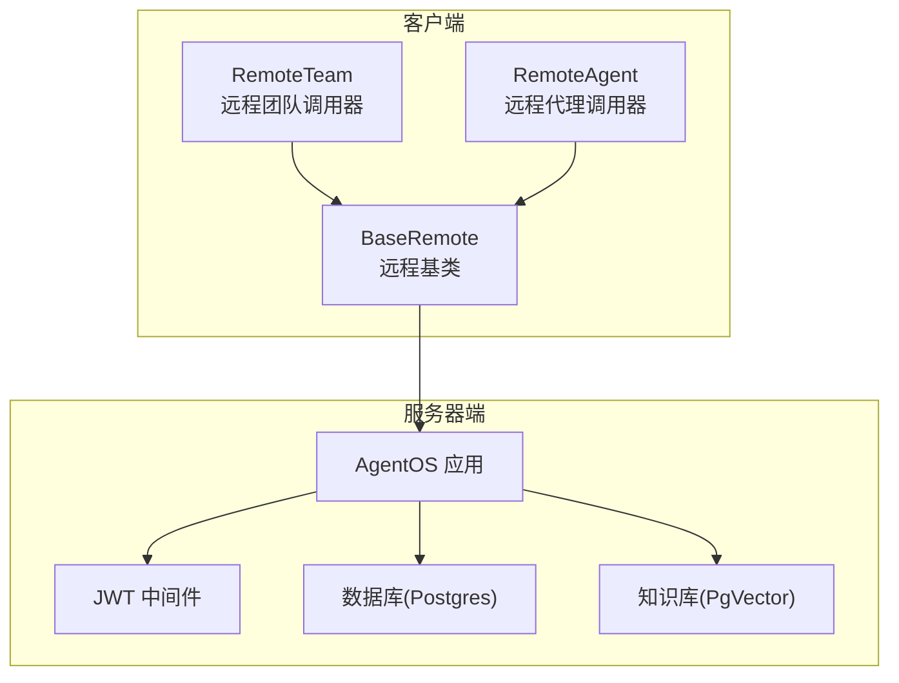
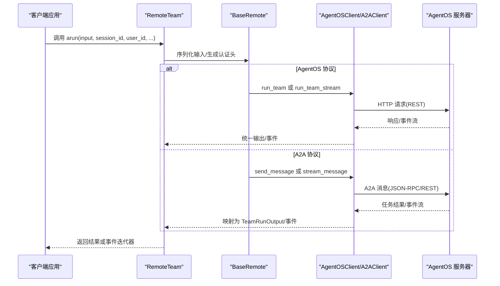
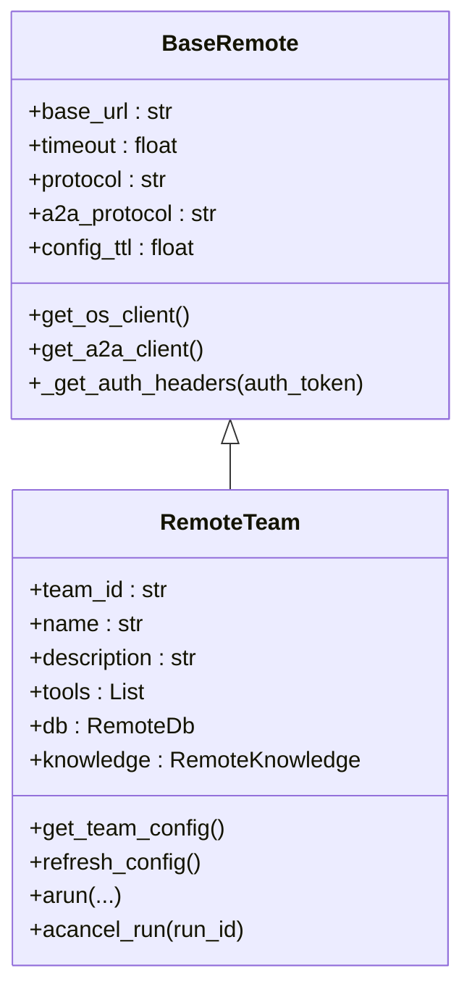
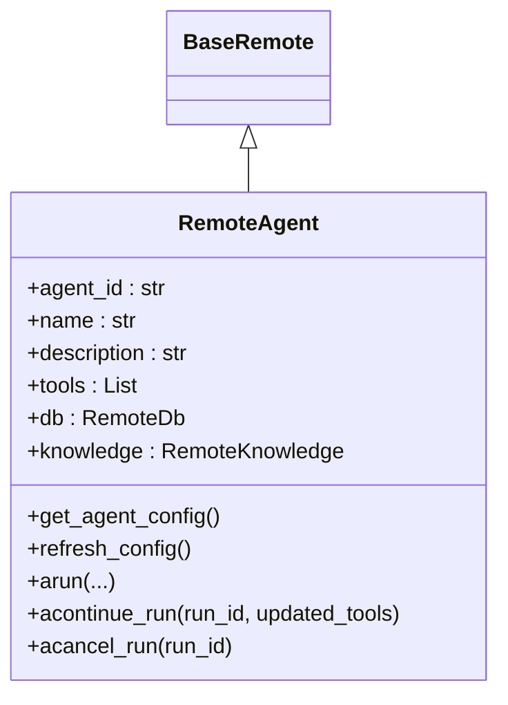
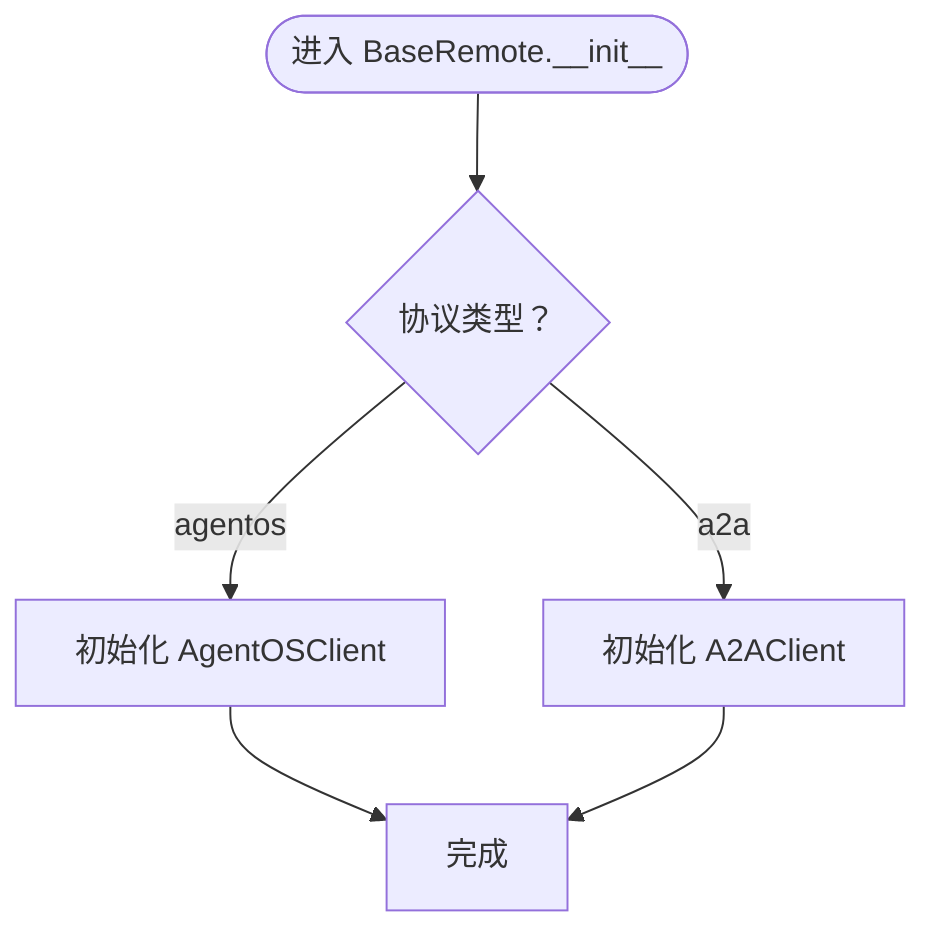
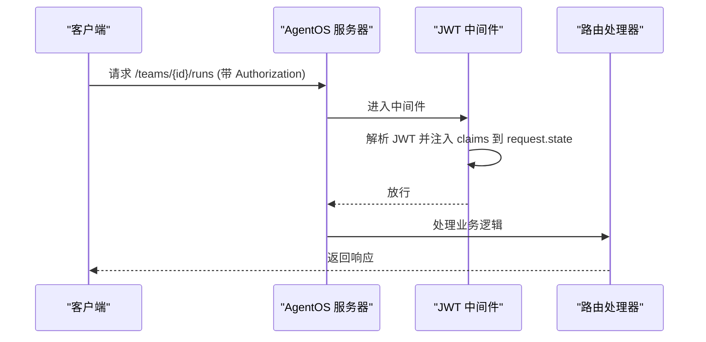
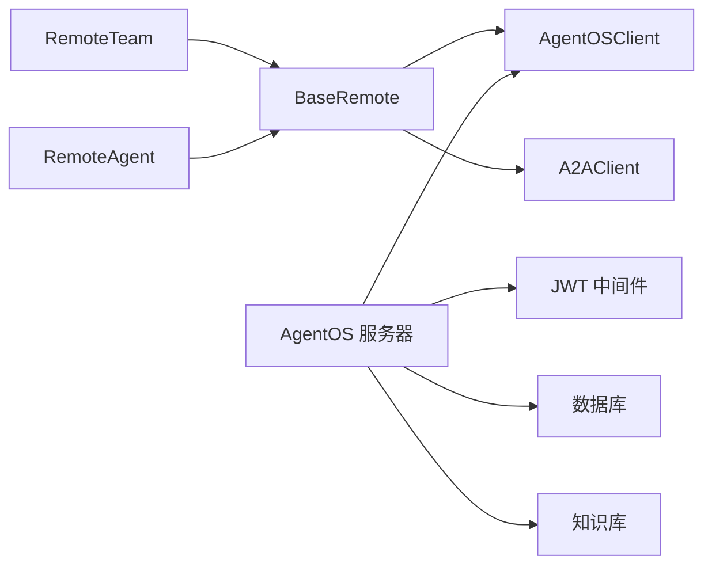

# 远程管理

<cite>
**本文引用的文件**   
- [remote_team.py](file://cookbook/03_teams/14_run_control/remote_team.py)
- [remote_team.py](file://cookbook/05_agent_os/remote/02_remote_team.py)
- [remote.py](file://libs/agno/agno/team/remote.py)
- [remote.py](file://libs/agno/agno/agent/remote.py)
- [base.py](file://libs/agno/agno/remote/base.py)
- [remote_server.py](file://libs/agno/tests/system/remote_server.py)
- [agent_os_with_jwt_middleware.py](file://cookbook/05_agent_os/middleware/agent_os_with_jwt_middleware.py)
- [auth.py](file://libs/agno/agno/os/auth.py)
- [basic.py](file://cookbook/05_agent_os/basic.py)
</cite>

## 目录
1. [简介](#简介)
2. [项目结构](#项目结构)
3. [核心组件](#核心组件)
4. [架构总览](#架构总览)
5. [详细组件分析](#详细组件分析)
6. [依赖关系分析](#依赖关系分析)
7. [性能考量](#性能考量)
8. [故障排除指南](#故障排除指南)
9. [结论](#结论)
10. [附录](#附录)

## 简介
本文件面向“远程团队管理系统”的使用者与维护者，系统化阐述远程团队在本仓库中的概念、架构与实现要点，重点覆盖以下方面：
- 远程团队的网络通信机制：支持两种协议（AgentOS 原生 REST 与 A2A 协议），以及认证与超时控制。
- 状态同步与分布式协调：通过会话（session）与运行（run）状态在远程实例间保持一致。
- 配置与部署：服务器端（AgentOS 实例）与客户端（RemoteTeam/RemoteAgent）的连接与认证。
- 核心功能：远程执行、流式输出、取消运行、知识检索与存储、数据库与指标追踪等。
- 扩展性与可用性：跨地域部署、高可用与灾难恢复策略建议。
- 安全、性能与运维最佳实践及故障排除。

## 项目结构
围绕远程团队与远程代理的关键文件组织如下：
- 示例入口：两个 cookbook 中的远程团队示例脚本，演示如何创建 RemoteTeam 并进行远程调用与流式输出。
- 远程实现：RemoteTeam 与 RemoteAgent 的核心实现，封装了协议选择、输入序列化、认证头注入、流式/非流式调用路径。
- 基类抽象：BaseRemote 提供统一的客户端初始化、配置缓存、认证头生成、A2A/AgentOS 协议切换。
- 服务器端示例：系统测试用的远程 AgentOS 服务器，包含 JWT 中间件、数据库、知识库与工作负载配置。
- 认证与中间件：JWT 中间件示例与安全校验逻辑，支撑远程访问的安全控制。

**图表来源**
- [remote.py:20-448](file://libs/agno/agno/team/remote.py#L20-L448)
- [remote.py:21-527](file://libs/agno/agno/agent/remote.py#L21-L527)
- [base.py:363-600](file://libs/agno/agno/remote/base.py#L363-L600)
- [remote_server.py:138-178](file://libs/agno/tests/system/remote_server.py#L138-L178)
- [agent_os_with_jwt_middleware.py:61-73](file://cookbook/05_agent_os/middleware/agent_os_with_jwt_middleware.py#L61-L73)

**章节来源**
- [remote_team.py:17-32](file://cookbook/03_teams/14_run_control/remote_team.py#L17-L32)
- [remote_team.py:19-28](file://cookbook/05_agent_os/remote/02_remote_team.py#L19-L28)
- [remote.py:20-448](file://libs/agno/agno/team/remote.py#L20-L448)
- [remote.py:21-527](file://libs/agno/agno/agent/remote.py#L21-L527)
- [base.py:363-600](file://libs/agno/agno/remote/base.py#L363-L600)
- [remote_server.py:138-178](file://libs/agno/tests/system/remote_server.py#L138-L178)
- [agent_os_with_jwt_middleware.py:61-73](file://cookbook/05_agent_os/middleware/agent_os_with_jwt_middleware.py#L61-L73)

## 核心组件
- RemoteTeam/RemoteAgent：远程调用器，负责将本地输入序列化后通过指定协议发送到远端 AgentOS/A2A 服务，并处理流式或非流式的响应。
- BaseRemote：远程基类，统一管理客户端初始化、配置缓存（TTL）、认证头生成、A2A/AgentOS 协议切换。
- AgentOS 服务器：提供 REST API、JWT 中间件、数据库与知识库集成，承载实际的 agents、teams、workflows。
- 认证与授权：支持基于 JWT 的中间件注入与安全密钥校验，保障远程访问安全。

**章节来源**
- [remote.py:20-448](file://libs/agno/agno/team/remote.py#L20-L448)
- [remote.py:21-527](file://libs/agno/agno/agent/remote.py#L21-L527)
- [base.py:363-600](file://libs/agno/agno/remote/base.py#L363-L600)
- [remote_server.py:138-178](file://libs/agno/tests/system/remote_server.py#L138-L178)
- [auth.py:109-145](file://libs/agno/agno/os/auth.py#L109-L145)

## 架构总览
远程团队的调用链路分为两条主要路径：
- AgentOS 协议：通过 AgentOSClient 发送请求，支持非流式与流式两种模式；可选地携带用户标识、会话状态、依赖工具、元数据等上下文信息。
- A2A 协议：通过 A2AClient 发送消息，映射为事件流并转换为统一的运行输出事件类型。

**图表来源**
- [remote.py:249-341](file://libs/agno/agno/team/remote.py#L249-L341)
- [remote.py:259-351](file://libs/agno/agno/agent/remote.py#L259-L351)
- [base.py:412-443](file://libs/agno/agno/remote/base.py#L412-L443)

## 详细组件分析

### RemoteTeam 组件分析
- 初始化参数：base_url、team_id、timeout、协议选择（agentos/a2a）、A2A 子协议（json-rpc/rest）、配置缓存 TTL。
- 配置获取：支持从 AgentOS 获取完整 TeamResponse，或在 A2A 下使用最小化配置。
- arun 流程：输入校验与序列化、认证头生成、根据协议分发至 AgentOSClient 或 A2AClient；支持流式与非流式两种返回类型。
- 取消运行：通过 AgentOSClient 调用取消接口，返回布尔值表示是否成功标记取消。

**图表来源**
- [base.py:363-600](file://libs/agno/agno/remote/base.py#L363-L600)
- [remote.py:20-448](file://libs/agno/agno/team/remote.py#L20-L448)

**章节来源**
- [remote.py:24-49](file://libs/agno/agno/team/remote.py#L24-L49)
- [remote.py:55-129](file://libs/agno/agno/team/remote.py#L55-L129)
- [remote.py:249-341](file://libs/agno/agno/team/remote.py#L249-L341)
- [remote.py:428-448](file://libs/agno/agno/team/remote.py#L428-L448)

### RemoteAgent 组件分析
- 功能与 RemoteTeam 类似，但面向单个代理；支持继续运行（acontinue_run）与取消运行。
- A2A 路径：将事件流映射为 RunOutput/事件，便于统一处理。

**图表来源**
- [base.py:363-600](file://libs/agno/agno/remote/base.py#L363-L600)
- [remote.py:21-527](file://libs/agno/agno/agent/remote.py#L21-L527)

**章节来源**
- [remote.py:39-64](file://libs/agno/agno/agent/remote.py#L39-L64)
- [remote.py:259-351](file://libs/agno/agno/agent/remote.py#L259-L351)
- [remote.py:463-503](file://libs/agno/agno/agent/remote.py#L463-L503)

### BaseRemote 组件分析
- 客户端初始化：按协议选择 AgentOSClient 或 A2AClient，延迟初始化以节省资源。
- 配置缓存：对 OS 配置与 A2A AgentCard 使用 TTL 缓存，减少重复请求。
- 认证头：支持 Bearer Token 注入，兼容无认证场景。
- 抽象方法：arun、acontinue_run、acancel_run 由子类实现具体协议细节。

**图表来源**
- [base.py:370-411](file://libs/agno/agno/remote/base.py#L370-L411)

**章节来源**
- [base.py:370-411](file://libs/agno/agno/remote/base.py#L370-L411)
- [base.py:445-472](file://libs/agno/agno/remote/base.py#L445-L472)
- [base.py:488-499](file://libs/agno/agno/remote/base.py#L488-L499)
- [base.py:501-553](file://libs/agno/agno/remote/base.py#L501-L553)

### 服务器端与认证
- 服务器端示例：构建包含代理、团队、工作流、知识库与数据库的 AgentOS 实例，启用 JWT 中间件与健康检查端点白名单。
- JWT 中间件示例：演示如何将 JWT 声明注入到请求上下文中，便于工具与路由使用。
- 安全校验：支持传统安全密钥与 JWT 两种校验方式，避免在启用 JWT 时重复校验。

**图表来源**
- [remote_server.py:152-169](file://libs/agno/tests/system/remote_server.py#L152-L169)
- [agent_os_with_jwt_middleware.py:61-73](file://cookbook/05_agent_os/middleware/agent_os_with_jwt_middleware.py#L61-L73)
- [auth.py:109-145](file://libs/agno/agno/os/auth.py#L109-L145)

**章节来源**
- [remote_server.py:138-178](file://libs/agno/tests/system/remote_server.py#L138-L178)
- [agent_os_with_jwt_middleware.py:61-73](file://cookbook/05_agent_os/middleware/agent_os_with_jwt_middleware.py#L61-L73)
- [auth.py:109-145](file://libs/agno/agno/os/auth.py#L109-L145)

## 依赖关系分析
- RemoteTeam/RemoteAgent 依赖 BaseRemote 提供的统一远程能力。
- BaseRemote 在不同协议下分别依赖 AgentOSClient 或 A2AClient。
- 服务器端示例依赖数据库、知识库与 JWT 中间件，形成完整的运行环境。

**图表来源**
- [remote.py:20-448](file://libs/agno/agno/team/remote.py#L20-L448)
- [remote.py:21-527](file://libs/agno/agno/agent/remote.py#L21-L527)
- [base.py:412-443](file://libs/agno/agno/remote/base.py#L412-L443)
- [remote_server.py:138-178](file://libs/agno/tests/system/remote_server.py#L138-L178)

**章节来源**
- [remote.py:20-448](file://libs/agno/agno/team/remote.py#L20-L448)
- [remote.py:21-527](file://libs/agno/agno/agent/remote.py#L21-L527)
- [base.py:412-443](file://libs/agno/agno/remote/base.py#L412-L443)
- [remote_server.py:138-178](file://libs/agno/tests/system/remote_server.py#L138-L178)

## 性能考量
- 配置缓存（TTL）：BaseRemote 对 OS 配置与 A2A AgentCard 使用缓存，降低频繁请求带来的网络开销。
- 输入序列化与校验：统一的输入验证与序列化流程，减少无效请求与错误重试。
- 流式输出：在支持的协议中采用流式传输，提升用户体验与资源利用率。
- 超时控制：通过 timeout 参数限制请求等待时间，避免阻塞与资源浪费。
- 数据库与知识库：合理配置数据库连接池与向量索引参数，确保检索与写入性能。

[本节为通用指导，无需特定文件来源]

## 故障排除指南
- 连接失败或超时：检查服务器地址与端口、防火墙与网络连通性；确认服务器已启动且健康检查端点可达。
- 认证失败：确认 Authorization 头中的 Bearer Token 正确；若启用 JWT 中间件，请确保签名算法与密钥匹配。
- 运行取消无效：确认服务器端支持取消接口并正确处理异常；检查运行 ID 是否有效。
- 配置未更新：如需强制刷新配置，使用 refresh_config 或 refresh_os_config 方法。
- 日志与追踪：开启服务器端追踪与日志，结合客户端事件流定位问题。

**章节来源**
- [remote_team.py:58-73](file://cookbook/03_teams/14_run_control/remote_team.py#L58-L73)
- [remote.py:428-448](file://libs/agno/agno/team/remote.py#L428-L448)
- [base.py:466-472](file://libs/agno/agno/remote/base.py#L466-L472)

## 结论
本远程管理系统通过统一的 RemoteTeam/RemoteAgent 抽象与 BaseRemote 基类，实现了对 AgentOS 与 A2A 两种协议的无缝支持。配合服务器端的 JWT 中间件、数据库与知识库，能够满足跨地域、高可用与灾难恢复场景下的远程协作需求。通过合理的配置缓存、超时控制与流式输出，系统在性能与可用性上具备良好表现。建议在生产环境中强化认证与审计、完善监控与告警，并制定跨区域部署与故障切换策略。

[本节为总结性内容，无需特定文件来源]

## 附录

### 快速开始示例（路径参考）
- 创建远程团队并调用：
  - [示例脚本:17-32](file://cookbook/03_teams/14_run_control/remote_team.py#L17-L32)
  - [示例脚本:19-28](file://cookbook/05_agent_os/remote/02_remote_team.py#L19-L28)
- 启动远程 AgentOS 服务器：
  - [服务器脚本:138-178](file://libs/agno/tests/system/remote_server.py#L138-L178)
- JWT 中间件示例：
  - [中间件示例:61-73](file://cookbook/05_agent_os/middleware/agent_os_with_jwt_middleware.py#L61-L73)

### 关键参数与配置清单
- RemoteTeam/RemoteAgent
  - base_url：远程 AgentOS 地址
  - team_id/agent_id：目标团队/代理标识
  - timeout：请求超时（秒）
  - protocol：协议选择（agentos/a2a）
  - a2a_protocol：A2A 子协议（json-rpc/rest）
  - config_ttl：配置缓存 TTL（秒）
- 服务器端
  - 数据库：Postgres/AsyncPostgresDb
  - 知识库：PgVector + Embedder
  - JWT 中间件：HS256 签名，声明注入
  - 健康检查与配置端点白名单

**章节来源**
- [remote.py:24-49](file://libs/agno/agno/team/remote.py#L24-L49)
- [remote.py:39-64](file://libs/agno/agno/agent/remote.py#L39-L64)
- [base.py:370-411](file://libs/agno/agno/remote/base.py#L370-L411)
- [remote_server.py:138-178](file://libs/agno/tests/system/remote_server.py#L138-L178)
- [agent_os_with_jwt_middleware.py:61-73](file://cookbook/05_agent_os/middleware/agent_os_with_jwt_middleware.py#L61-L73)