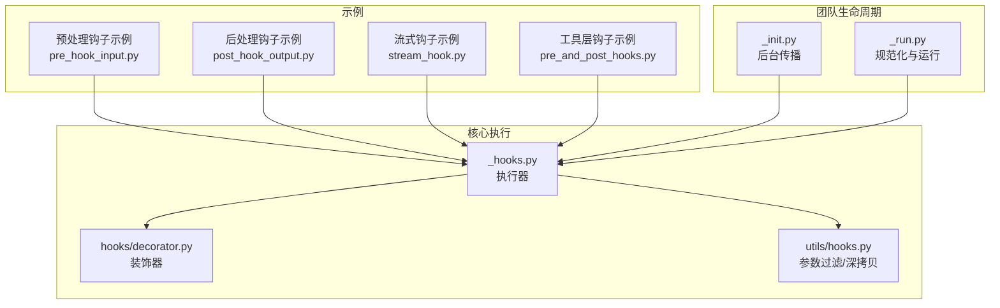
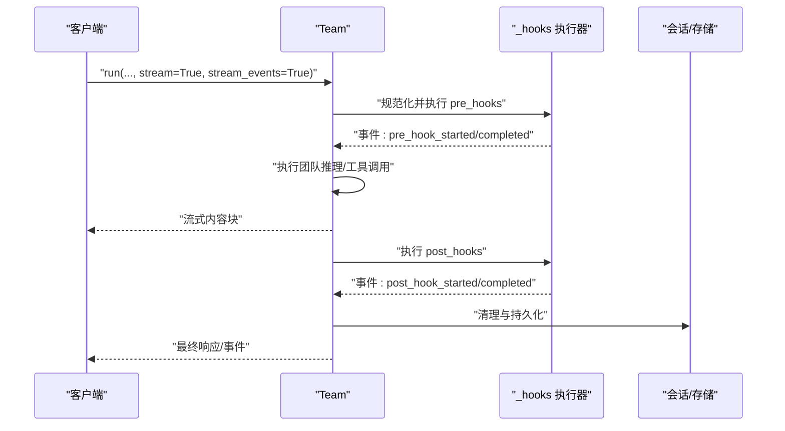
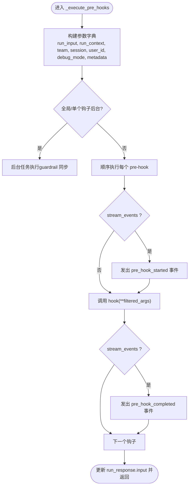
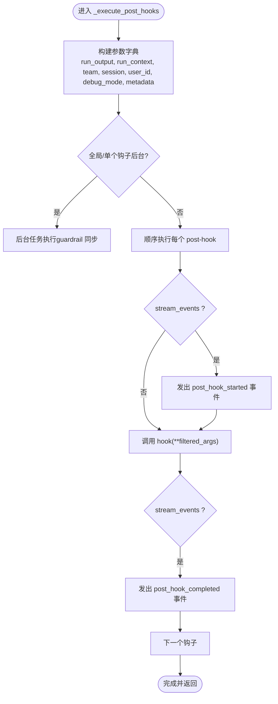
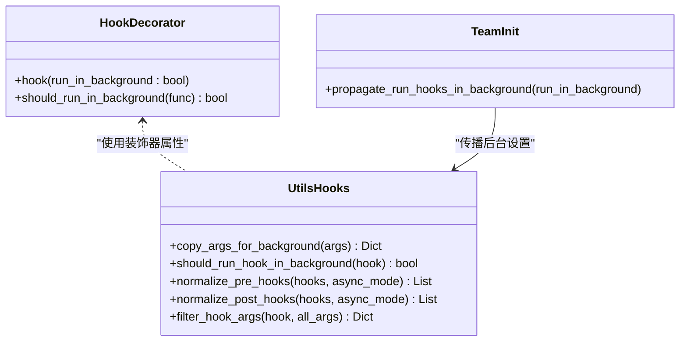
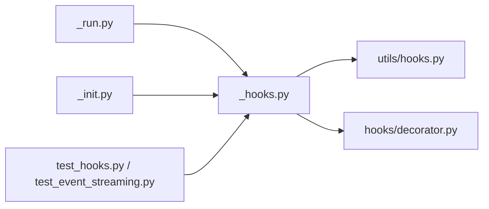

# 团队钩子

<cite>
**本文引用的文件**
- [cookbook/03_teams/13_hooks/pre_hook_input.py](file://cookbook/03_teams/13_hooks/pre_hook_input.py)
- [cookbook/03_teams/13_hooks/post_hook_output.py](file://cookbook/03_teams/13_hooks/post_hook_output.py)
- [cookbook/03_teams/13_hooks/stream_hook.py](file://cookbook/03_teams/13_hooks/stream_hook.py)
- [libs/agno/agno/team/_hooks.py](file://libs/agno/agno/team/_hooks.py)
- [libs/agno/agno/team/_init.py](file://libs/agno/agno/team/_init.py)
- [libs/agno/agno/team/_run.py](file://libs/agno/agno/team/_run.py)
- [libs/agno/agno/hooks/decorator.py](file://libs/agno/agno/hooks/decorator.py)
- [libs/agno/agno/utils/hooks.py](file://libs/agno/agno/utils/hooks.py)
- [libs/agno/tests/integration/teams/test_hooks.py](file://libs/agno/tests/integration/teams/test_hooks.py)
- [libs/agno/tests/integration/teams/test_event_streaming.py](file://libs/agno/tests/integration/teams/test_event_streaming.py)
- [cookbook/05_agent_os/background_tasks/background_hooks_example.py](file://cookbook/05_agent_os/background_tasks/background_hooks_example.py)
- [cookbook/05_agent_os/background_tasks/background_hooks_decorator.py](file://cookbook/05_agent_os/background_tasks/background_hooks_decorator.py)
- [cookbook/91_tools/tool_hooks/pre_and_post_hooks.py](file://cookbook/91_tools/tool_hooks/pre_and_post_hooks.py)
</cite>

## 目录
1. [简介](#简介)
2. [项目结构](#项目结构)
3. [核心组件](#核心组件)
4. [架构总览](#架构总览)
5. [详细组件分析](#详细组件分析)
6. [依赖关系分析](#依赖关系分析)
7. [性能考量](#性能考量)
8. [故障排查指南](#故障排查指南)
9. [结论](#结论)
10. [附录](#附录)

## 简介
本文件系统性阐述团队钩子（Team Hooks）的设计与使用，覆盖预处理钩子（pre-hooks）、后处理钩子（post-hooks）与流式钩子（stream hooks）的配置、执行时机、数据传递与事件流。文档结合示例与源码路径，帮助读者快速掌握团队协作中输入预处理、输出后处理与实时事件处理的实现方式，并提供钩子链、条件钩子、异常处理、后台任务、调试与性能优化等高级主题。

## 项目结构
围绕团队钩子的关键位置如下：
- 示例与用法：cookbook/03_teams/13_hooks 下的输入预处理、输出后处理与流式通知示例
- 核心执行逻辑：libs/agno/agno/team/_hooks.py 中的钩子执行器
- 钩子装饰器与参数过滤：libs/agno/agno/hooks/decorator.py、libs/agno/agno/utils/hooks.py
- 团队初始化与后台传播：libs/agno/agno/team/_init.py、libs/agno/agno/team/_run.py
- 事件与测试：libs/agno/tests/integration/teams/test_hooks.py、libs/agno/tests/integration/teams/test_event_streaming.py
- 工具层钩子：cookbook/91_tools/tool_hooks/pre_and_post_hooks.py
- AgentOS 后台任务示例：cookbook/05_agent_os/background_tasks/*

**图表来源**
- [cookbook/03_teams/13_hooks/pre_hook_input.py:1-295](file://cookbook/03_teams/13_hooks/pre_hook_input.py#L1-L295)
- [cookbook/03_teams/13_hooks/post_hook_output.py:1-497](file://cookbook/03_teams/13_hooks/post_hook_output.py#L1-L497)
- [cookbook/03_teams/13_hooks/stream_hook.py:1-65](file://cookbook/03_teams/13_hooks/stream_hook.py#L1-L65)
- [libs/agno/agno/team/_hooks.py:1-624](file://libs/agno/agno/team/_hooks.py#L1-L624)
- [libs/agno/agno/hooks/decorator.py:1-165](file://libs/agno/agno/hooks/decorator.py#L1-L165)
- [libs/agno/agno/utils/hooks.py:1-179](file://libs/agno/agno/utils/hooks.py#L1-L179)
- [libs/agno/agno/team/_init.py:490-495](file://libs/agno/agno/team/_init.py#L490-L495)
- [libs/agno/agno/team/_run.py:1765-1800](file://libs/agno/agno/team/_run.py#L1765-L1800)

**章节来源**
- [cookbook/03_teams/13_hooks/pre_hook_input.py:1-295](file://cookbook/03_teams/13_hooks/pre_hook_input.py#L1-L295)
- [cookbook/03_teams/13_hooks/post_hook_output.py:1-497](file://cookbook/03_teams/13_hooks/post_hook_output.py#L1-L497)
- [cookbook/03_teams/13_hooks/stream_hook.py:1-65](file://cookbook/03_teams/13_hooks/stream_hook.py#L1-L65)
- [libs/agno/agno/team/_hooks.py:1-624](file://libs/agno/agno/team/_hooks.py#L1-L624)
- [libs/agno/agno/hooks/decorator.py:1-165](file://libs/agno/agno/hooks/decorator.py#L1-L165)
- [libs/agno/agno/utils/hooks.py:1-179](file://libs/agno/agno/utils/hooks.py#L1-L179)
- [libs/agno/agno/team/_init.py:490-495](file://libs/agno/agno/team/_init.py#L490-L495)
- [libs/agno/agno/team/_run.py:1765-1800](file://libs/agno/agno/team/_run.py#L1765-L1800)

## 核心组件
- 预处理钩子（pre-hooks）
  - 作用：在团队运行开始前进行输入校验、转换与准备，支持同步/异步、事件流与后台任务
  - 关键点：可抛出 InputCheckError 阻断执行；可修改 TeamRunInput；支持 RunContext、session、user_id、debug_mode 等上下文参数
- 后处理钩子（post-hooks）
  - 作用：在团队生成最终结果后进行质量/合规检查、格式化、元数据增强与副作用（如通知）
  - 关键点：可抛出 OutputCheckError；可修改 TeamRunOutput；支持 RunContext.metadata 透传
- 流式钩子（stream hooks）
  - 作用：在流式响应期间或结束后，基于 RunContext.metadata 触发非阻断式副作用（如发送通知）
  - 关键点：即使 stream=True，post-hook 在全部流块完成后执行，确保 run_output.content 完整
- 钩子装饰器与后台任务
  - 作用：统一控制钩子是否后台执行；深拷贝敏感参数避免竞态；规范化 guardrail/eval 钩子
  - 关键点：@hook(run_in_background=True)；should_run_hook_in_background；copy_args_for_background；filter_hook_args

**章节来源**
- [libs/agno/agno/team/_hooks.py:222-320](file://libs/agno/agno/team/_hooks.py#L222-L320)
- [libs/agno/agno/team/_hooks.py:427-522](file://libs/agno/agno/team/_hooks.py#L427-L522)
- [libs/agno/agno/team/_hooks.py:379-412](file://libs/agno/agno/team/_hooks.py#L379-L412)
- [libs/agno/agno/hooks/decorator.py:56-135](file://libs/agno/agno/hooks/decorator.py#L56-L135)
- [libs/agno/agno/utils/hooks.py:15-54](file://libs/agno/agno/utils/hooks.py#L15-L54)
- [libs/agno/agno/utils/hooks.py:156-179](file://libs/agno/agno/utils/hooks.py#L156-L179)

## 架构总览
团队钩子贯穿一次团队运行的生命周期：规范化 → 预处理 → 运行 → 后处理 → 存储/事件。支持事件流与后台任务，保证非阻断式扩展能力。

**图表来源**
- [libs/agno/agno/team/_run.py:1765-1800](file://libs/agno/agno/team/_run.py#L1765-L1800)
- [libs/agno/agno/team/_hooks.py:222-320](file://libs/agno/agno/team/_hooks.py#L222-L320)
- [libs/agno/agno/team/_hooks.py:427-522](file://libs/agno/agno/team/_hooks.py#L427-L522)
- [libs/agno/tests/integration/teams/test_event_streaming.py:364-626](file://libs/agno/tests/integration/teams/test_event_streaming.py#L364-L626)

## 详细组件分析

### 预处理钩子（输入验证与转换）
- 典型用法
  - 输入验证：拒绝不安全、无关或细节不足的请求，抛出 InputCheckError 阻断执行
  - 输入转换：将用户输入改写为更利于团队协作的结构，直接修改 run_input.input_content
- 关键签名与上下文
  - 支持多种参数组合（run_input, run_context, team, session, user_id, debug_mode, metadata）
  - 可选择性接受参数，通过 filter_hook_args 自动筛选
- 事件与后台
  - 支持 stream_events=true 时发出 pre_hook_started/completed 事件
  - 可与后台任务配合，但后台模式下不能修改 run_input

**图表来源**
- [libs/agno/agno/team/_hooks.py:222-320](file://libs/agno/agno/team/_hooks.py#L222-L320)
- [libs/agno/agno/utils/hooks.py:156-179](file://libs/agno/agno/utils/hooks.py#L156-L179)

**章节来源**
- [cookbook/03_teams/13_hooks/pre_hook_input.py:33-93](file://cookbook/03_teams/13_hooks/pre_hook_input.py#L33-L93)
- [libs/agno/agno/team/_hooks.py:222-320](file://libs/agno/agno/team/_hooks.py#L222-L320)
- [libs/agno/tests/integration/teams/test_event_streaming.py:364-484](file://libs/agno/tests/integration/teams/test_event_streaming.py#L364-L484)

### 后处理钩子（输出验证与增强）
- 典型用法
  - 输出质量校验：长度、专业性、安全性、一致性等维度
  - 输出增强：添加元数据、协作摘要、结构化格式
  - 副作用：基于 RunContext.metadata 发送通知（非阻断式）
- 关键签名与上下文
  - 接收 run_output, run_context, team, session, user_id, debug_mode, metadata
  - 可修改 run_output.content 或附加信息
- 事件与后台
  - 支持 stream_events=true 时发出 post_hook_started/completed 事件
  - 可与后台任务配合，异常仅记录不中断响应

**图表来源**
- [libs/agno/agno/team/_hooks.py:427-522](file://libs/agno/agno/team/_hooks.py#L427-L522)
- [libs/agno/agno/utils/hooks.py:156-179](file://libs/agno/agno/utils/hooks.py#L156-L179)

**章节来源**
- [cookbook/03_teams/13_hooks/post_hook_output.py:41-129](file://cookbook/03_teams/13_hooks/post_hook_output.py#L41-L129)
- [cookbook/03_teams/13_hooks/stream_hook.py:25-32](file://cookbook/03_teams/13_hooks/stream_hook.py#L25-L32)
- [libs/agno/agno/team/_hooks.py:427-522](file://libs/agno/agno/team/_hooks.py#L427-L522)
- [libs/agno/tests/integration/teams/test_event_streaming.py:487-600](file://libs/agno/tests/integration/teams/test_event_streaming.py#L487-L600)

### 流式钩子（通知与事件）
- 使用场景
  - 在流式响应结束后，基于 RunContext.metadata 执行非阻断式副作用（如发送邮件）
  - 即使 stream=True，post-hook 在所有流块完成后执行，run_output.content 为完整响应
- 关键点
  - 通过 metadata 传递上下文（如用户邮箱）
  - 非阻断式执行，异常仅记录

**章节来源**
- [cookbook/03_teams/13_hooks/stream_hook.py:17-32](file://cookbook/03_teams/13_hooks/stream_hook.py#L17-L32)
- [cookbook/03_teams/13_hooks/stream_hook.py:54-60](file://cookbook/03_teams/13_hooks/stream_hook.py#L54-L60)
- [libs/agno/tests/integration/teams/test_event_streaming.py:364-400](file://libs/agno/tests/integration/teams/test_event_streaming.py#L364-L400)

### 钩子装饰器与后台任务
- 装饰器 @hook
  - 控制单个钩子是否后台执行（run_in_background=True）
  - 统一属性标记，便于 should_run_hook_in_background 检测
- 参数过滤与深拷贝
  - filter_hook_args：按函数签名筛选参数
  - copy_args_for_background：对敏感对象进行深拷贝，避免并发竞态
- 后台传播
  - propagate_run_hooks_in_background：递归设置团队及其成员的后台执行策略

**图表来源**
- [libs/agno/agno/hooks/decorator.py:56-135](file://libs/agno/agno/hooks/decorator.py#L56-L135)
- [libs/agno/agno/utils/hooks.py:15-54](file://libs/agno/agno/utils/hooks.py#L15-L54)
- [libs/agno/agno/utils/hooks.py:113-153](file://libs/agno/agno/utils/hooks.py#L113-L153)
- [libs/agno/agno/team/_init.py:490-495](file://libs/agno/agno/team/_init.py#L490-L495)

**章节来源**
- [libs/agno/agno/hooks/decorator.py:56-135](file://libs/agno/agno/hooks/decorator.py#L56-L135)
- [libs/agno/agno/utils/hooks.py:15-54](file://libs/agno/agno/utils/hooks.py#L15-L54)
- [libs/agno/agno/utils/hooks.py:113-153](file://libs/agno/agno/utils/hooks.py#L113-L153)
- [libs/agno/agno/team/_init.py:490-495](file://libs/agno/agno/team/_init.py#L490-L495)

### 工具层钩子（补充视角）
- 工具级 pre/post 钩子用于单个工具调用前后，与团队钩子互补
- 支持同步/异步、迭代器/异步迭代器

**章节来源**
- [cookbook/91_tools/tool_hooks/pre_and_post_hooks.py:21-50](file://cookbook/91_tools/tool_hooks/pre_and_post_hooks.py#L21-L50)
- [cookbook/91_tools/tool_hooks/pre_and_post_hooks.py:74-93](file://cookbook/91_tools/tool_hooks/pre_and_post_hooks.py#L74-L93)

## 依赖关系分析
- 钩子执行器依赖
  - utils/hooks：参数过滤、深拷贝、规范化
  - hooks/decorator：后台标记与检测
  - team/_init：后台设置传播
  - team/_run：规范化入口与运行流程
- 事件与测试
  - 事件流测试验证 pre/post 钩子事件顺序与内容
  - 钩子序列执行测试验证多钩子顺序与参数传递

**图表来源**
- [libs/agno/agno/team/_run.py:1765-1800](file://libs/agno/agno/team/_run.py#L1765-L1800)
- [libs/agno/agno/team/_hooks.py:1-624](file://libs/agno/agno/team/_hooks.py#L1-L624)
- [libs/agno/agno/utils/hooks.py:1-179](file://libs/agno/agno/utils/hooks.py#L1-L179)
- [libs/agno/agno/hooks/decorator.py:1-165](file://libs/agno/agno/hooks/decorator.py#L1-L165)
- [libs/agno/agno/team/_init.py:490-495](file://libs/agno/agno/team/_init.py#L490-L495)
- [libs/agno/tests/integration/teams/test_hooks.py:258-298](file://libs/agno/tests/integration/teams/test_hooks.py#L258-L298)
- [libs/agno/tests/integration/teams/test_event_streaming.py:364-626](file://libs/agno/tests/integration/teams/test_event_streaming.py#L364-L626)

**章节来源**
- [libs/agno/agno/team/_run.py:1765-1800](file://libs/agno/agno/team/_run.py#L1765-L1800)
- [libs/agno/agno/team/_hooks.py:1-624](file://libs/agno/agno/team/_hooks.py#L1-L624)
- [libs/agno/tests/integration/teams/test_hooks.py:258-298](file://libs/agno/tests/integration/teams/test_hooks.py#L258-L298)
- [libs/agno/tests/integration/teams/test_event_streaming.py:364-626](file://libs/agno/tests/integration/teams/test_event_streaming.py#L364-L626)

## 性能考量
- 后台执行
  - 使用 @hook(run_in_background=True) 或设置 run_hooks_in_background=True，将非关键副作用移至后台，降低主流程延迟
  - 注意：后台模式下不能修改 run_input；敏感对象通过深拷贝避免竞态
- 事件流
  - 开启 stream_events 会产生额外事件开销；仅在需要可观测性时启用
- 异步与并发
  - 异步钩子需配合异步运行接口；避免在同步 run() 中使用异步钩子
- 资源与幂等
  - 副作用钩子应具备幂等性，避免重复执行造成副作用叠加

[本节为通用指导，无需特定文件引用]

## 故障排查指南
- 钩子异常
  - InputCheckError/OutputCheckError：用于阻断执行与质量控制，可在上层捕获并处理
  - 其他异常：默认记录日志但不中断响应（post-hook 非阻断式）
- 事件顺序
  - 通过事件流测试验证 pre_hook_started/completed 与 post_hook_started/completed 的顺序与内容
- 参数传递
  - 使用 filter_hook_args 确保只传递钩子签名允许的参数；必要时在钩子内部访问 run_context.metadata
- 后台任务
  - 确认 run_hooks_in_background 设置或 @hook(run_in_background=True) 生效；检查深拷贝是否成功

**章节来源**
- [libs/agno/agno/team/_hooks.py:311-318](file://libs/agno/agno/team/_hooks.py#L311-L318)
- [libs/agno/agno/team/_hooks.py:514-522](file://libs/agno/agno/team/_hooks.py#L514-L522)
- [libs/agno/tests/integration/teams/test_event_streaming.py:364-626](file://libs/agno/tests/integration/teams/test_event_streaming.py#L364-L626)
- [libs/agno/tests/integration/teams/test_hooks.py:271-287](file://libs/agno/tests/integration/teams/test_hooks.py#L271-L287)

## 结论
团队钩子提供了强大的扩展点，能够在不侵入核心推理流程的前提下实现输入预处理、输出后处理与实时事件处理。通过事件流与后台任务，既能满足可观测性与非阻断式扩展，又能保持系统性能与稳定性。建议在生产环境中结合 guardrail 钩子、后台任务与严格的参数过滤，形成安全、可靠且高性能的团队协作流水线。

[本节为总结，无需特定文件引用]

## 附录

### 快速参考：钩子配置与调用路径
- 预处理钩子（团队）
  - 示例：[pre_hook_input.py:33-93](file://cookbook/03_teams/13_hooks/pre_hook_input.py#L33-L93)
  - 执行器：[_execute_pre_hooks:222-320](file://libs/agno/agno/team/_hooks.py#L222-L320)
- 后处理钩子（团队）
  - 示例：[post_hook_output.py:41-129](file://cookbook/03_teams/13_hooks/post_hook_output.py#L41-L129)
  - 执行器：[_execute_post_hooks:427-522](file://libs/agno/agno/team/_hooks.py#L427-L522)
- 流式钩子（团队）
  - 示例：[stream_hook.py:25-32](file://cookbook/03_teams/13_hooks/stream_hook.py#L25-L32)
  - 行为：流式结束后执行，run_output.content 完整
- 工具层钩子
  - 示例：[pre_and_post_hooks.py:21-50](file://cookbook/91_tools/tool_hooks/pre_and_post_hooks.py#L21-L50)
- 后台任务示例
  - [background_hooks_example.py:57-75](file://cookbook/05_agent_os/background_tasks/background_hooks_example.py#L57-L75)
  - [background_hooks_decorator.py:52-63](file://cookbook/05_agent_os/background_tasks/background_hooks_decorator.py#L52-L63)

**章节来源**
- [cookbook/03_teams/13_hooks/pre_hook_input.py:33-93](file://cookbook/03_teams/13_hooks/pre_hook_input.py#L33-L93)
- [cookbook/03_teams/13_hooks/post_hook_output.py:41-129](file://cookbook/03_teams/13_hooks/post_hook_output.py#L41-L129)
- [cookbook/03_teams/13_hooks/stream_hook.py:25-32](file://cookbook/03_teams/13_hooks/stream_hook.py#L25-L32)
- [cookbook/91_tools/tool_hooks/pre_and_post_hooks.py:21-50](file://cookbook/91_tools/tool_hooks/pre_and_post_hooks.py#L21-L50)
- [cookbook/05_agent_os/background_tasks/background_hooks_example.py:57-75](file://cookbook/05_agent_os/background_tasks/background_hooks_example.py#L57-L75)
- [cookbook/05_agent_os/background_tasks/background_hooks_decorator.py:52-63](file://cookbook/05_agent_os/background_tasks/background_hooks_decorator.py#L52-L63)