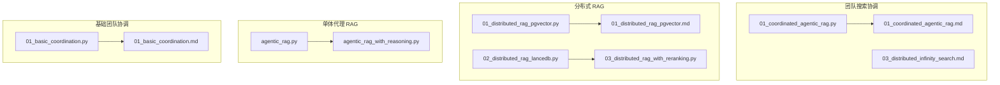
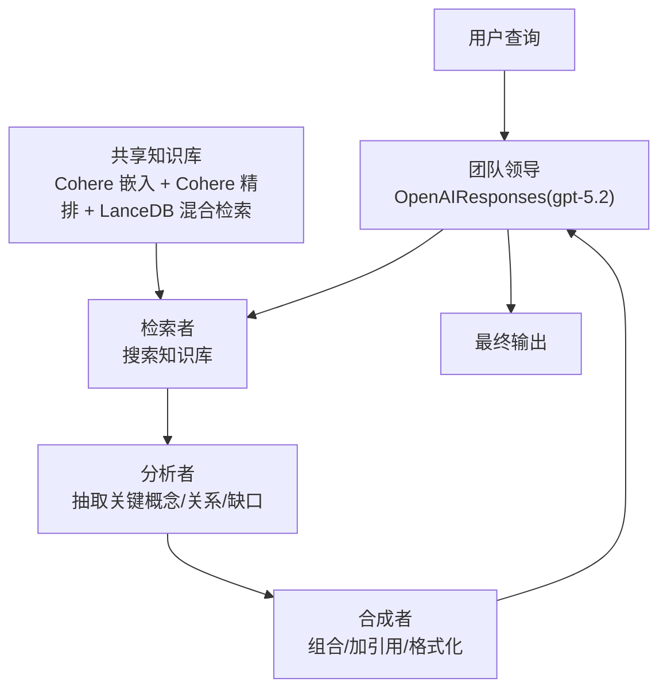
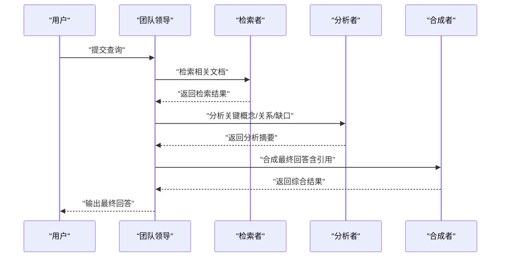
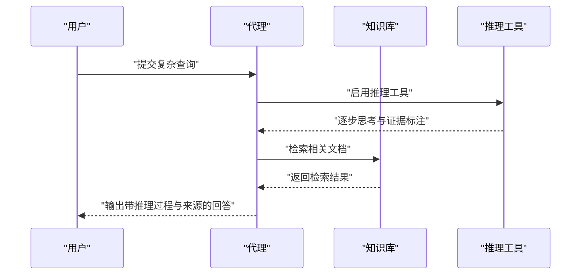
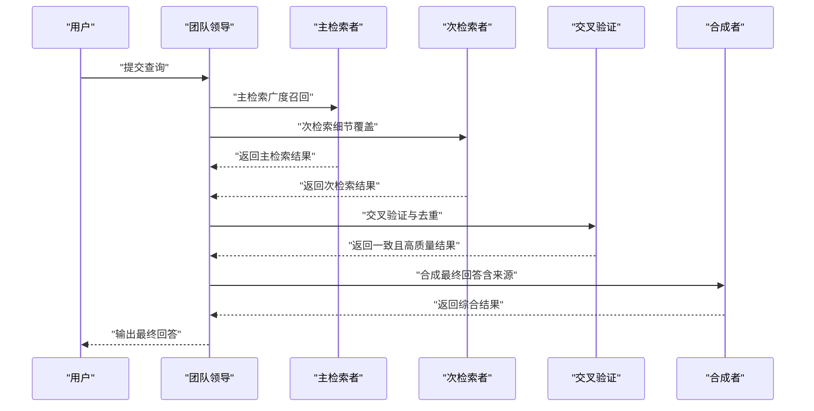
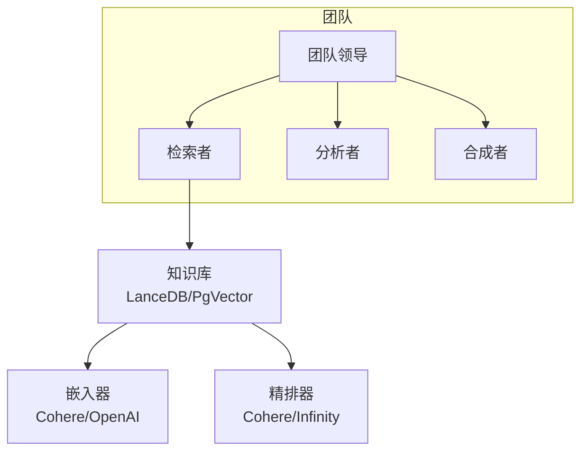

# 搜索协调

<cite>
**本文引用的文件**
- [01_coordinated_agentic_rag.py](file://cookbook/03_teams/16_search_coordination/01_coordinated_agentic_rag.py)
- [01_coordinated_agentic_rag.md](file://cookbook/03_teams/16_search_coordination/01_coordinated_agentic_rag.md)
- [03_distributed_infinity_search.md](file://cookbook/03_teams/16_search_coordination/03_distributed_infinity_search.md)
- [01_distributed_rag_pgvector.py](file://cookbook/03_teams/15_distributed_rag/01_distributed_rag_pgvector.py)
- [01_distributed_rag_pgvector.md](file://cookbook/03_teams/15_distributed_rag/01_distributed_rag_pgvector.md)
- [02_distributed_rag_lancedb.py](file://cookbook/03_teams/15_distributed_rag/02_distributed_rag_lancedb.py)
- [03_distributed_rag_with_reranking.py](file://cookbook/03_teams/15_distributed_rag/03_distributed_rag_with_reranking.py)
- [agentic_rag.py](file://cookbook/02_agents/07_knowledge/agentic_rag.py)
- [agentic_rag_with_reasoning.py](file://cookbook/02_agents/07_knowledge/agentic_rag_with_reasoning.py)
- [01_basic_coordination.py](file://cookbook/03_teams/01_quickstart/01_basic_coordination.py)
- [01_basic_coordination.md](file://cookbook/03_teams/01_quickstart/01_basic_coordination.md)
</cite>

## 目录
1. [简介](#简介)
2. [项目结构](#项目结构)
3. [核心组件](#核心组件)
4. [架构总览](#架构总览)
5. [详细组件分析](#详细组件分析)
6. [依赖分析](#依赖分析)
7. [性能考虑](#性能考虑)
8. [故障排查指南](#故障排查指南)
9. [结论](#结论)
10. [附录](#附录)

## 简介
本文件面向“搜索协调系统”的实现与应用，围绕团队协作下的搜索策略展开，重点覆盖以下主题：
- 协调式代理 RAG：通过共享知识库与角色分工，实现“检索—分析—合成”的流水线式协作。
- 协调式推理 RAG：在检索基础上引入显式推理工具，提升复杂问题的解释与溯源能力。
- 分布式无限搜索（Infinity）：以自托管精排服务为核心，构建双路检索与交叉验证的分布式搜索体系。
- 搜索策略协调机制：任务分配、结果聚合、性能优化与质量保障。
- 复杂查询场景：多轮搜索、交叉验证、结果融合的最佳实践。

## 项目结构
本仓库中与“搜索协调”直接相关的示例主要位于 cookbook/03_teams/16_search_coordination 与 cookbook/03_teams/15_distributed_rag，以及部分基础示例位于 cookbook/03_teams/01_quickstart 与 cookbook/02_agents/07_knowledge。下图给出与本文相关的文件组织概览：

图表来源
- [01_coordinated_agentic_rag.py:1-107](file://cookbook/03_teams/16_search_coordination/01_coordinated_agentic_rag.py#L1-L107)
- [01_distributed_rag_pgvector.py:1-200](file://cookbook/03_teams/15_distributed_rag/01_distributed_rag_pgvector.py#L1-L200)
- [02_distributed_rag_lancedb.py:1-187](file://cookbook/03_teams/15_distributed_rag/02_distributed_rag_lancedb.py#L1-L187)
- [03_distributed_rag_with_reranking.py:1-195](file://cookbook/03_teams/15_distributed_rag/03_distributed_rag_with_reranking.py#L1-L195)
- [agentic_rag.py:1-50](file://cookbook/02_agents/07_knowledge/agentic_rag.py#L1-L50)
- [agentic_rag_with_reasoning.py:1-62](file://cookbook/02_agents/07_knowledge/agentic_rag_with_reasoning.py#L1-L62)
- [01_basic_coordination.py:1-51](file://cookbook/03_teams/01_quickstart/01_basic_coordination.py#L1-L51)

章节来源
- [01_coordinated_agentic_rag.py:1-107](file://cookbook/03_teams/16_search_coordination/01_coordinated_agentic_rag.py#L1-L107)
- [01_distributed_rag_pgvector.py:1-200](file://cookbook/03_teams/15_distributed_rag/01_distributed_rag_pgvector.py#L1-L200)
- [02_distributed_rag_lancedb.py:1-187](file://cookbook/03_teams/15_distributed_rag/02_distributed_rag_lancedb.py#L1-L187)
- [03_distributed_rag_with_reranking.py:1-195](file://cookbook/03_teams/15_distributed_rag/03_distributed_rag_with_reranking.py#L1-L195)
- [agentic_rag.py:1-50](file://cookbook/02_agents/07_knowledge/agentic_rag.py#L1-L50)
- [agentic_rag_with_reasoning.py:1-62](file://cookbook/02_agents/07_knowledge/agentic_rag_with_reasoning.py#L1-L62)
- [01_basic_coordination.py:1-51](file://cookbook/03_teams/01_quickstart/01_basic_coordination.py#L1-L51)

## 核心组件
- 协调式代理 RAG（共享知识库 + 角色分工）
  - 共享知识库：统一向量化与精排，避免重复检索；仅检索者挂载知识库，分析与合成者专注逻辑处理。
  - 角色链路：检索者 → 分析者 → 合成者，层层递进，确保准确性与可溯源性。
- 协调式推理 RAG（检索 + 显式推理工具）
  - 在检索前/中加入推理工具，支持逐步思考与证据标注，增强复杂问题的解释力。
- 分布式无限搜索（Infinity 自托管精排）
  - 双路检索：主检索与次检索分别聚焦“广度召回”与“细节覆盖”，交叉验证后融合输出。
  - 自托管精排：使用 Infinity 服务替代云端精排，满足私有化部署与数据安全需求。

章节来源
- [01_coordinated_agentic_rag.py:19-91](file://cookbook/03_teams/16_search_coordination/01_coordinated_agentic_rag.py#L19-L91)
- [01_coordinated_agentic_rag.md:18-71](file://cookbook/03_teams/16_search_coordination/01_coordinated_agentic_rag.md#L18-L71)
- [agentic_rag_with_reasoning.py:21-48](file://cookbook/02_agents/07_knowledge/agentic_rag_with_reasoning.py#L21-L48)
- [03_distributed_infinity_search.md:17-44](file://cookbook/03_teams/16_search_coordination/03_distributed_infinity_search.md#L17-L44)

## 架构总览
下图展示了“协调式代理 RAG”的端到端流程：用户查询经由团队领导分派给检索者，检索者返回原始文档，分析者抽取关键信息并识别缺口，合成者整合并生成带引用的最终回答。

图表来源
- [01_coordinated_agentic_rag.py:78-102](file://cookbook/03_teams/16_search_coordination/01_coordinated_agentic_rag.py#L78-L102)
- [01_coordinated_agentic_rag.md:56-71](file://cookbook/03_teams/16_search_coordination/01_coordinated_agentic_rag.md#L56-L71)

## 详细组件分析

### 协调式代理 RAG（共享知识库 + 角色分工）
- 设计要点
  - 共享知识库：统一的向量数据库与精排器，避免重复检索与数据冗余。
  - 角色分工：检索者负责“全量检索”，分析者负责“结构化提炼”，合成者负责“最终呈现与溯源”。
  - 输出质量：通过“展示成员响应”与“Markdown 格式化”提升可解释性。
- 关键配置
  - 向量数据库：LanceDB，混合检索。
  - 嵌入器与精排器：CohereEmbedder 与 CohereReranker。
  - 团队指令：明确各成员职责与协作顺序。
- 运行流程（序列图）

图表来源
- [01_coordinated_agentic_rag.py:34-91](file://cookbook/03_teams/16_search_coordination/01_coordinated_agentic_rag.py#L34-L91)

章节来源
- [01_coordinated_agentic_rag.py:19-91](file://cookbook/03_teams/16_search_coordination/01_coordinated_agentic_rag.py#L19-L91)
- [01_coordinated_agentic_rag.md:18-71](file://cookbook/03_teams/16_search_coordination/01_coordinated_agentic_rag.md#L18-L71)

### 协调式推理 RAG（检索 + 显式推理工具）
- 设计要点
  - 在检索前后引入推理工具，支持逐步思考与证据标注，提升复杂问题的解释力与可信度。
  - 使用 Cohere 嵌入与精排，结合团队指令强调“先检索再回答”与“包含来源”。
- 关键配置
  - 向量数据库：LanceDB，混合检索。
  - 嵌入器与精排器：CohereEmbedder 与 CohereReranker。
  - 工具：ReasoningTools（显式推理）。
- 运行流程（序列图）

图表来源
- [agentic_rag_with_reasoning.py:35-61](file://cookbook/02_agents/07_knowledge/agentic_rag_with_reasoning.py#L35-L61)

章节来源
- [agentic_rag_with_reasoning.py:21-61](file://cookbook/02_agents/07_knowledge/agentic_rag_with_reasoning.py#L21-L61)

### 分布式无限搜索（Infinity 自托管精排）
- 设计要点
  - 双路检索：主检索侧重“广度召回”，次检索侧重“细节覆盖”；交叉验证消除偏差。
  - 自托管精排：使用 Infinity 服务替代云端精排，支持私有化部署与数据安全。
  - 结果融合：由交叉验证与合成模块统一输出，确保质量与一致性。
- 关键配置
  - 精排器：InfinityReranker（自托管）。
  - 嵌入器：CohereEmbedder。
  - 检索类型：混合检索。
- 运行流程（序列图）

图表来源
- [03_distributed_infinity_search.md:17-44](file://cookbook/03_teams/16_search_coordination/03_distributed_infinity_search.md#L17-L44)

章节来源
- [03_distributed_infinity_search.md:17-44](file://cookbook/03_teams/16_search_coordination/03_distributed_infinity_search.md#L17-L44)

### 分布式 RAG（PgVector/LanceDB + 多阶段检索）
- PgVector 示例（向量/混合检索 + 数据验证 + 响应组合）
  - 双知识库分工：向量检索与混合检索互补，数据验证与响应组合由无知识库成员完成，职责分离。
  - 流程：向量检索 → 混合检索 → 数据验证 → 响应组合。
- LanceDB 示例（主检索 + 上下文扩展 + 合成 + 质量验证）
  - 主检索优先获取核心信息，上下文扩展补充背景与关联信息，最终由合成与质量验证环节统一输出。
- Reranking 示例（广度检索 → 精排优化 → 上下文分析 → 最终合成）
  - 初始广度检索 → 专用精排优化 → 上下文分析 → 最终合成，突出精排在质量上的优势。

章节来源
- [01_distributed_rag_pgvector.py:20-117](file://cookbook/03_teams/15_distributed_rag/01_distributed_rag_pgvector.py#L20-L117)
- [01_distributed_rag_pgvector.md:18-73](file://cookbook/03_teams/15_distributed_rag/01_distributed_rag_pgvector.md#L18-L73)
- [02_distributed_rag_lancedb.py:20-121](file://cookbook/03_teams/15_distributed_rag/02_distributed_rag_lancedb.py#L20-L121)
- [03_distributed_rag_with_reranking.py:22-126](file://cookbook/03_teams/15_distributed_rag/03_distributed_rag_with_reranking.py#L22-L126)

## 依赖分析
- 组件耦合
  - 协调式代理 RAG：团队领导与成员之间通过指令与响应流耦合；检索者与知识库耦合，分析者与合成者与领导耦合。
  - 分布式 RAG：多知识库实例与多成员职责分离，通过团队领导串联；精排器与嵌入器作为外部依赖。
- 外部依赖
  - 向量数据库：LanceDB、PgVector。
  - 精排器：CohereReranker、InfinityReranker。
  - 嵌入器：CohereEmbedder、OpenAIEmbedder。
- 潜在循环依赖
  - 示例代码未见循环导入；团队内部通过指令与响应流协调，不构成循环依赖。

图表来源
- [01_coordinated_agentic_rag.py:19-91](file://cookbook/03_teams/16_search_coordination/01_coordinated_agentic_rag.py#L19-L91)
- [01_distributed_rag_pgvector.py:20-117](file://cookbook/03_teams/15_distributed_rag/01_distributed_rag_pgvector.py#L20-L117)
- [02_distributed_rag_lancedb.py:20-121](file://cookbook/03_teams/15_distributed_rag/02_distributed_rag_lancedb.py#L20-L121)
- [03_distributed_rag_with_reranking.py:22-126](file://cookbook/03_teams/15_distributed_rag/03_distributed_rag_with_reranking.py#L22-L126)

## 性能考虑
- 检索策略优化
  - 混合检索：在召回与相关性之间取得平衡，适合通用场景。
  - 向量检索：强调语义相关性，适合意图理解；文本检索：强调关键词匹配，适合精确查询。
  - 精排优化：在广度检索后进行精排，显著提升最终相关性。
- 并发与异步
  - 异步写入与异步查询可减少等待时间，提升吞吐。
- 资源隔离
  - 多知识库实例与职责分离，避免单点瓶颈；交叉验证与合成环节可并行或串行按需调整。
- 质量保障
  - 交叉验证与上下文分析降低噪声；最终合成时统一格式与引用，提升可解释性。

## 故障排查指南
- 环境变量与服务
  - 确保 API 密钥等环境变量已加载；如使用 PostgreSQL + pgvector，需确认服务已启动。
- 知识库写入
  - 同步/异步写入失败时检查网络与权限；分布式示例中注意多知识库的一致性。
- 精排服务
  - 使用 Infinity 时需确认服务地址与模型可用；若失败，检查本地服务是否启动。
- 团队模式
  - 基础协调示例默认 coordinate 模式，必要时根据需要调整最大迭代次数与模式参数。

章节来源
- [01_basic_coordination.py:46-50](file://cookbook/03_teams/01_quickstart/01_basic_coordination.py#L46-L50)
- [01_distributed_rag_pgvector.py:123-162](file://cookbook/03_teams/15_distributed_rag/01_distributed_rag_pgvector.py#L123-L162)
- [03_distributed_infinity_search.md:30-35](file://cookbook/03_teams/16_search_coordination/03_distributed_infinity_search.md#L30-L35)

## 结论
搜索协调系统通过“共享知识库 + 角色分工”“推理增强”“分布式双路检索 + 交叉验证”三大路径，实现了从“检索—分析—合成”的高效闭环。在复杂查询场景中，该体系能够：
- 提升召回与精排质量，减少噪声与偏差；
- 通过交叉验证与上下文分析保障结果一致性；
- 通过职责分离与异步处理提升整体吞吐与稳定性；
- 通过自托管精排满足私有化部署与数据安全需求。

## 附录
- 快速上手建议
  - 从协调式代理 RAG 示例入手，理解共享知识库与角色分工；
  - 尝试推理增强版本，观察显式推理工具对复杂问题的改善；
  - 在具备 Infinity 服务的环境中运行分布式无限搜索示例，体验双路检索与交叉验证；
  - 对于大规模场景，参考分布式 RAG 示例，结合向量/混合检索与精排优化。
- 最佳实践
  - 明确团队指令与成员职责，确保协作有序；
  - 在广度检索后进行精排优化，优先保证最终相关性；
  - 使用交叉验证与上下文分析消除歧义，统一格式与引用；
  - 私有化部署时选择自托管精排服务，确保数据安全与可控性。