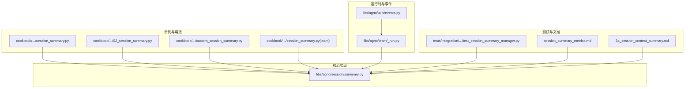
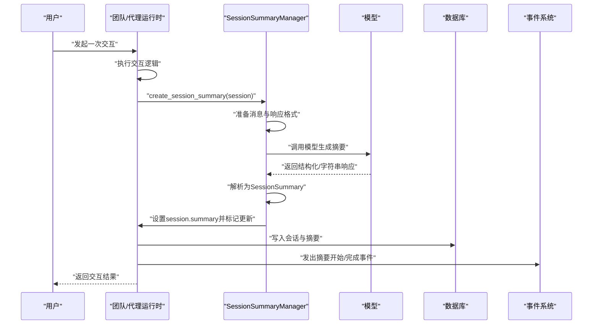
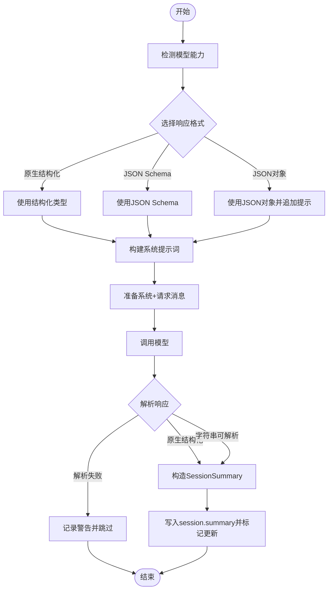
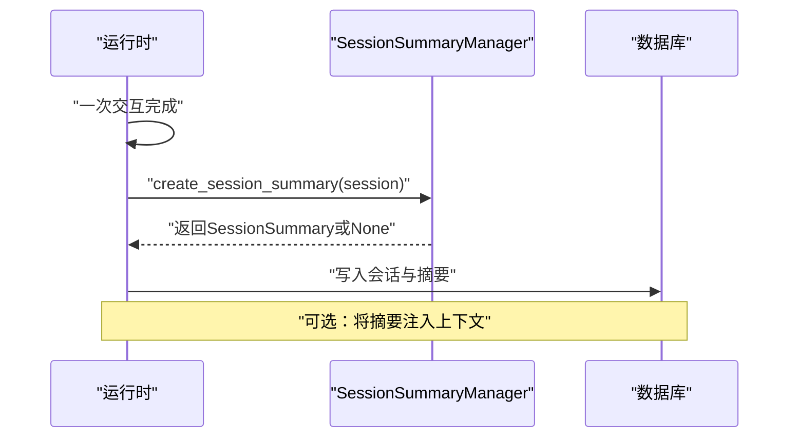
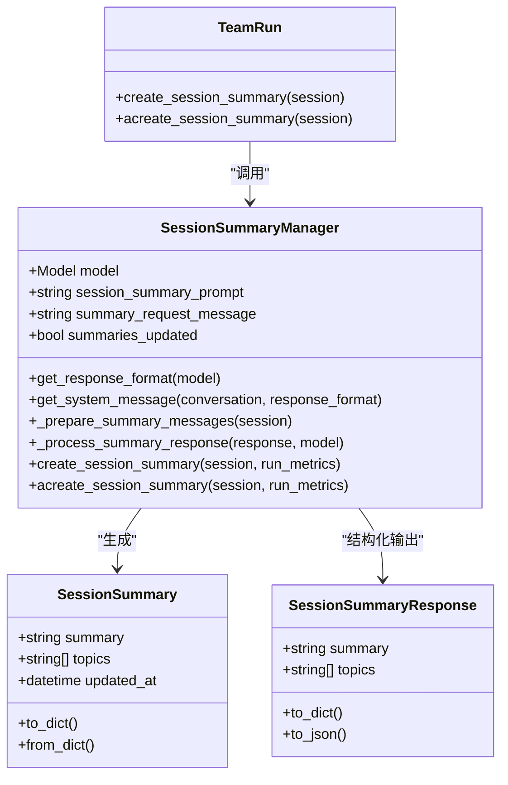

# 会话摘要

<cite>
**本文引用的文件**
- [libs/agno/agno/session/summary.py](file://libs/agno/agno/session/summary.py)
- [cookbook/02_agents/05_state_and_session/session_summary.py](file://cookbook/02_agents/05_state_and_session/session_summary.py)
- [cookbook/06_storage/02_session_summary.py](file://cookbook/06_storage/02_session_summary.py)
- [cookbook/03_teams/07_session/session_summary.py](file://cookbook/03_teams/07_session/session_summary.py)
- [cookbook/03_teams/07_session/custom_session_summary.py](file://cookbook/03_teams/07_session/custom_session_summary.py)
- [libs/agno/agno/team/_run.py](file://libs/agno/agno/team/_run.py)
- [libs/agno/agno/utils/events.py](file://libs/agno/agno/utils/events.py)
- [libs/agno/tests/integration/managers/test_session_summary_manager.py](file://libs/agno/tests/integration/managers/test_session_summary_manager.py)
- [cookbook/02_agents/14_advanced/session_summary_metrics.md](file://cookbook/02_agents/14_advanced/session_summary_metrics.md)
- [cookbook/08_learning/01_basics/3a_session_context_summary.md](file://cookbook/08_learning/01_basics/3a_session_context_summary.md)
</cite>

## 目录
1. [简介](#简介)
2. [项目结构](#项目结构)
3. [核心组件](#核心组件)
4. [架构总览](#架构总览)
5. [组件详解](#组件详解)
6. [依赖关系分析](#依赖关系分析)
7. [性能考量](#性能考量)
8. [故障排查指南](#故障排查指南)
9. [结论](#结论)
10. [附录](#附录)

## 简介
本文件系统性阐述 Agno Learn 的“会话摘要”能力：从自动摘要算法、内容提取策略、质量评估，到触发条件与时机、摘要结构与格式、存储与检索机制、配置项说明、使用示例与代码路径、性能优化与大数据策略，以及与其他组件的集成关系。目标是帮助开发者快速理解并高效集成会话摘要功能。

## 项目结构
围绕会话摘要的关键代码与示例分布在以下位置：
- 核心实现：libs/agno/agno/session/summary.py
- 示例与用法：cookbook/02_agents/05_state_and_session/session_summary.py、cookbook/06_storage/02_session_summary.py、cookbook/03_teams/07_session/*.py
- 团队运行时触发：libs/agno/agno/team/_run.py
- 事件与指标：libs/agno/agno/utils/events.py、cookbook/02_agents/14_advanced/session_summary_metrics.md
- 单元测试与行为验证：libs/agno/tests/integration/managers/test_session_summary_manager.py
- 会话上下文与摘要复用：cookbook/08_learning/01_basics/3a_session_context_summary.md

**图表来源**
- [libs/agno/agno/session/summary.py:1-283](file://libs/agno/agno/session/summary.py#L1-L283)
- [cookbook/02_agents/05_state_and_session/session_summary.py:1-51](file://cookbook/02_agents/05_state_and_session/session_summary.py#L1-L51)
- [cookbook/06_storage/02_session_summary.py:1-50](file://cookbook/06_storage/02_session_summary.py#L1-L50)
- [cookbook/03_teams/07_session/session_summary.py:1-95](file://cookbook/03_teams/07_session/session_summary.py#L1-L95)
- [cookbook/03_teams/07_session/custom_session_summary.py:1-80](file://cookbook/03_teams/07_session/custom_session_summary.py#L1-L80)
- [libs/agno/agno/team/_run.py:1594-1615](file://libs/agno/agno/team/_run.py#L1594-L1615)
- [libs/agno/agno/utils/events.py:417-446](file://libs/agno/agno/utils/events.py#L417-L446)
- [libs/agno/tests/integration/managers/test_session_summary_manager.py:1-523](file://libs/agno/tests/integration/managers/test_session_summary_manager.py#L1-L523)
- [cookbook/02_agents/14_advanced/session_summary_metrics.md:1-72](file://cookbook/02_agents/14_advanced/session_summary_metrics.md#L1-L72)
- [cookbook/08_learning/01_basics/3a_session_context_summary.md:78-127](file://cookbook/08_learning/01_basics/3a_session_context_summary.md#L78-L127)

**章节来源**
- [libs/agno/agno/session/summary.py:1-283](file://libs/agno/agno/session/summary.py#L1-L283)
- [cookbook/02_agents/05_state_and_session/session_summary.py:1-51](file://cookbook/02_agents/05_state_and_session/session_summary.py#L1-L51)
- [cookbook/06_storage/02_session_summary.py:1-50](file://cookbook/06_storage/02_session_summary.py#L1-L50)
- [cookbook/03_teams/07_session/session_summary.py:1-95](file://cookbook/03_teams/07_session/session_summary.py#L1-L95)
- [cookbook/03_teams/07_session/custom_session_summary.py:1-80](file://cookbook/03_teams/07_session/custom_session_summary.py#L1-L80)
- [libs/agno/agno/team/_run.py:1594-1615](file://libs/agno/agno/team/_run.py#L1594-L1615)
- [libs/agno/agno/utils/events.py:417-446](file://libs/agno/agno/utils/events.py#L417-L446)
- [libs/agno/tests/integration/managers/test_session_summary_manager.py:1-523](file://libs/agno/tests/integration/managers/test_session_summary_manager.py#L1-L523)
- [cookbook/02_agents/14_advanced/session_summary_metrics.md:1-72](file://cookbook/02_agents/14_advanced/session_summary_metrics.md#L1-L72)
- [cookbook/08_learning/01_basics/3a_session_context_summary.md:78-127](file://cookbook/08_learning/01_basics/3a_session_context_summary.md#L78-L127)

## 核心组件
- SessionSummary：摘要数据模型，包含摘要文本、讨论主题列表、更新时间，并提供 to_dict/from_dict 序列化支持。
- SessionSummaryResponse：用于结构化输出的 Pydantic 模型，定义摘要与主题字段，支持 to_dict/to_json。
- SessionSummaryManager：摘要生成的核心管理器，负责：
  - 自动检测模型能力并选择合适的响应格式（原生结构化、JSON Schema、JSON 对象回退）。
  - 构建系统提示词，将对话消息转为结构化输入。
  - 调用模型生成摘要，解析响应为 SessionSummary。
  - 将摘要写入会话对象并标记更新状态。
  - 提供同步与异步摘要生成方法。
- 触发与事件：团队运行时在每次运行完成后触发摘要生成，并通过事件进行可观测性追踪；指标系统单独统计摘要模型的用量。

**章节来源**
- [libs/agno/agno/session/summary.py:21-93](file://libs/agno/agno/session/summary.py#L21-L93)
- [libs/agno/agno/session/summary.py:62-93](file://libs/agno/agno/session/summary.py#L62-L93)
- [libs/agno/agno/session/summary.py:212-283](file://libs/agno/agno/session/summary.py#L212-L283)
- [libs/agno/agno/team/_run.py:1594-1615](file://libs/agno/agno/team/_run.py#L1594-L1615)
- [libs/agno/agno/utils/events.py:417-446](file://libs/agno/agno/utils/events.py#L417-L446)

## 架构总览
下图展示了从一次交互到摘要生成与存储的整体流程，以及与数据库、事件系统、指标系统的交互。

**图表来源**
- [libs/agno/agno/team/_run.py:1594-1615](file://libs/agno/agno/team/_run.py#L1594-L1615)
- [libs/agno/agno/session/summary.py:212-283](file://libs/agno/agno/session/summary.py#L212-L283)
- [libs/agno/agno/utils/events.py:417-446](file://libs/agno/agno/utils/events.py#L417-L446)

## 组件详解

### 1) 摘要生成算法与内容提取策略
- 响应格式选择：
  - 若模型支持原生结构化输出，则直接返回结构化类型。
  - 否则若支持 JSON Schema 输出，则以 JSON Schema 形式约束输出。
  - 否则回退为 JSON 对象格式，并附加 JSON 输出提示。
- 系统提示词构建：
  - 默认提示词要求从对话中抽取摘要与主题，强调简洁与重点。
  - 将对话逐条拼接为“User/Assistant”格式，避免空消息（媒体场景会标注媒体数量）。
  - 当回退为 JSON 对象时，追加 JSON 输出提示。
- 消息准备：
  - 返回系统消息与一条请求摘要的用户消息，作为摘要生成的完整输入。
- 响应解析：
  - 若为原生结构化输出，直接构造 SessionSummary。
  - 若为字符串输出，尝试解析为结构化对象；失败则记录警告并返回 None。
  - 解析成功后设置 session.summary 并标记已更新。

**图表来源**
- [libs/agno/agno/session/summary.py:77-93](file://libs/agno/agno/session/summary.py#L77-L93)
- [libs/agno/agno/session/summary.py:92-137](file://libs/agno/agno/session/summary.py#L92-L137)
- [libs/agno/agno/session/summary.py:139-164](file://libs/agno/agno/session/summary.py#L139-L164)
- [libs/agno/agno/session/summary.py:166-210](file://libs/agno/agno/session/summary.py#L166-L210)
- [libs/agno/agno/session/summary.py:212-246](file://libs/agno/agno/session/summary.py#L212-L246)

**章节来源**
- [libs/agno/agno/session/summary.py:77-93](file://libs/agno/agno/session/summary.py#L77-L93)
- [libs/agno/agno/session/summary.py:92-137](file://libs/agno/agno/session/summary.py#L92-L137)
- [libs/agno/agno/session/summary.py:139-164](file://libs/agno/agno/session/summary.py#L139-L164)
- [libs/agno/agno/session/summary.py:166-210](file://libs/agno/agno/session/summary.py#L166-L210)
- [libs/agno/agno/session/summary.py:212-246](file://libs/agno/agno/session/summary.py#L212-L246)

### 2) 触发条件与时机
- 自动触发：
  - 团队运行时在每次交互完成后，调用 SessionSummaryManager 生成或更新摘要。
  - 支持同步与异步两种方式，分别对应 create_session_summary 与 acreate_session_summary。
- 手动触发：
  - 可通过 Agent/Team 的接口主动获取或生成摘要（示例见各 cookbook 文件）。
- 上下文注入：
  - 可配置将摘要注入到系统提示词中，以便后续交互复用摘要上下文。

**图表来源**
- [libs/agno/agno/team/_run.py:1594-1615](file://libs/agno/agno/team/_run.py#L1594-L1615)
- [libs/agno/agno/team/_run.py:3537-3558](file://libs/agno/agno/team/_run.py#L3537-L3558)
- [libs/agno/agno/team/_run.py:5256-5280](file://libs/agno/agno/team/_run.py#L5256-L5280)

**章节来源**
- [libs/agno/agno/team/_run.py:1594-1615](file://libs/agno/agno/team/_run.py#L1594-L1615)
- [libs/agno/agno/team/_run.py:3537-3558](file://libs/agno/agno/team/_run.py#L3537-L3558)
- [libs/agno/agno/team/_run.py:5256-5280](file://libs/agno/agno/team/_run.py#L5256-L5280)

### 3) 摘要内容结构与格式
- 数据模型：
  - SessionSummary：summary、topics、updated_at。
  - SessionSummaryResponse：summary、topics（可选）。
- 序列化：
  - 提供 to_dict/from_dict、to_json 等序列化方法，便于持久化与传输。
- 上下文复用：
  - 可将摘要注入到系统提示词中，形成“会话上下文”，提升后续交互的一致性与效率。

**章节来源**
- [libs/agno/agno/session/summary.py:21-93](file://libs/agno/agno/session/summary.py#L21-L93)
- [libs/agno/agno/session/summary.py:29-42](file://libs/agno/agno/session/summary.py#L29-L42)
- [libs/agno/agno/session/summary.py:54-58](file://libs/agno/agno/session/summary.py#L54-L58)
- [cookbook/08_learning/01_basics/3a_session_context_summary.md:78-127](file://cookbook/08_learning/01_basics/3a_session_context_summary.md#L78-L127)

### 4) 存储与检索机制
- 存储位置：
  - 摘要写入会话对象的 summary 字段，并由数据库层统一持久化（示例使用 PostgresDb/SqliteDb/AsyncPostgresDb 等）。
- 检索方式：
  - 通过 Agent/Team 的 get_session_summary 接口获取摘要；也可在运行时直接访问 session.summary。
- 索引与查询：
  - 数据库层提供按会话 ID、用户 ID、组件 ID、时间范围等维度的查询能力（不同存储后端实现略有差异）。

**章节来源**
- [cookbook/02_agents/05_state_and_session/session_summary.py:32-36](file://cookbook/02_agents/05_state_and_session/session_summary.py#L32-L36)
- [cookbook/06_storage/02_session_summary.py:35-42](file://cookbook/06_storage/02_session_summary.py#L35-L42)
- [cookbook/03_teams/07_session/session_summary.py:84-94](file://cookbook/03_teams/07_session/session_summary.py#L84-L94)
- [cookbook/03_teams/07_session/custom_session_summary.py:69-79](file://cookbook/03_teams/07_session/custom_session_summary.py#L69-L79)

### 5) 配置选项说明
- enable_session_summaries：启用自动摘要生成（每次交互完成后触发）。
- add_session_summary_to_context：是否将摘要注入到系统提示词中。
- session_summary_manager：自定义摘要管理器，可指定不同的模型与提示词。
- session_summary_prompt：自定义摘要生成提示词（覆盖默认提示词）。
- summary_request_message：摘要请求消息，默认为“请提供本次对话的摘要”。

**章节来源**
- [cookbook/06_storage/02_session_summary.py:35-42](file://cookbook/06_storage/02_session_summary.py#L35-L42)
- [libs/agno/agno/session/summary.py:62-75](file://libs/agno/agno/session/summary.py#L62-L75)

### 6) 使用示例与代码片段路径
- 最简配置（自动摘要 + 注入上下文）：[cookbook/06_storage/02_session_summary.py:51-58](file://cookbook/06_storage/02_session_summary.py#L51-L58)
- 自定义摘要管理器（指定模型）：[cookbook/06_storage/02_session_summary.py:35-42](file://cookbook/06_storage/02_session_summary.py#L35-L42)
- 团队场景自动摘要与异步检索：[cookbook/03_teams/07_session/session_summary.py:33-54](file://cookbook/03_teams/07_session/session_summary.py#L33-L54)
- 团队场景自定义摘要管理器与上下文注入：[cookbook/03_teams/07_session/custom_session_summary.py:41-48](file://cookbook/03_teams/07_session/custom_session_summary.py#L41-L48)
- 代理场景自动摘要与获取：[cookbook/02_agents/05_state_and_session/session_summary.py:22-36](file://cookbook/02_agents/05_state_and_session/session_summary.py#L22-L36)

**章节来源**
- [cookbook/06_storage/02_session_summary.py:35-58](file://cookbook/06_storage/02_session_summary.py#L35-L58)
- [cookbook/03_teams/07_session/session_summary.py:33-54](file://cookbook/03_teams/07_session/session_summary.py#L33-L54)
- [cookbook/03_teams/07_session/custom_session_summary.py:41-48](file://cookbook/03_teams/07_session/custom_session_summary.py#L41-L48)
- [cookbook/02_agents/05_state_and_session/session_summary.py:22-36](file://cookbook/02_agents/05_state_and_session/session_summary.py#L22-L36)

### 7) 摘要质量评估与稳定性
- 行为验证：
  - 测试覆盖了响应格式选择、系统提示词构建、消息准备、响应解析、序列化、异步生成、指标累加等关键路径。
  - 包含解析失败、无模型、无有意义消息等边界情况的处理与断言。
- 指标追踪：
  - 摘要模型用量单独记录在 metrics.details["session_summary_model"] 中，便于成本与效果分析。

**章节来源**
- [libs/agno/tests/integration/managers/test_session_summary_manager.py:105-140](file://libs/agno/tests/integration/managers/test_session_summary_manager.py#L105-L140)
- [libs/agno/tests/integration/managers/test_session_summary_manager.py:142-183](file://libs/agno/tests/integration/managers/test_session_summary_manager.py#L142-L183)
- [libs/agno/tests/integration/managers/test_session_summary_manager.py:185-193](file://libs/agno/tests/integration/managers/test_session_summary_manager.py#L185-L193)
- [libs/agno/tests/integration/managers/test_session_summary_manager.py:195-214](file://libs/agno/tests/integration/managers/test_session_summary_manager.py#L195-L214)
- [libs/agno/tests/integration/managers/test_session_summary_manager.py:216-237](file://libs/agno/tests/integration/managers/test_session_summary_manager.py#L216-L237)
- [libs/agno/tests/integration/managers/test_session_summary_manager.py:239-265](file://libs/agno/tests/integration/managers/test_session_summary_manager.py#L239-L265)
- [libs/agno/tests/integration/managers/test_session_summary_manager.py:267-324](file://libs/agno/tests/integration/managers/test_session_summary_manager.py#L267-L324)
- [libs/agno/tests/integration/managers/test_session_summary_manager.py:337-358](file://libs/agno/tests/integration/managers/test_session_summary_manager.py#L337-L358)
- [libs/agno/tests/integration/managers/test_session_summary_manager.py:360-417](file://libs/agno/tests/integration/managers/test_session_summary_manager.py#L360-L417)
- [libs/agno/tests/integration/managers/test_session_summary_manager.py:419-454](file://libs/agno/tests/integration/managers/test_session_summary_manager.py#L419-L454)
- [libs/agno/tests/integration/managers/test_session_summary_manager.py:456-509](file://libs/agno/tests/integration/managers/test_session_summary_manager.py#L456-L509)
- [libs/agno/tests/integration/managers/test_session_summary_manager.py:511-523](file://libs/agno/tests/integration/managers/test_session_summary_manager.py#L511-L523)
- [cookbook/02_agents/14_advanced/session_summary_metrics.md:1-72](file://cookbook/02_agents/14_advanced/session_summary_metrics.md#L1-L72)

## 依赖关系分析
- 组件耦合：
  - SessionSummaryManager 依赖模型抽象（Model）、消息类型（Message）、日志工具与指标累加器。
  - 运行时（Team/Agent）在交互完成后调用摘要管理器，并将摘要写入会话对象。
  - 事件系统在摘要生成前后发出事件，便于可观测性与审计。
- 外部依赖：
  - 数据库层提供统一的会话读写接口，支持多种存储后端。
  - 指标系统对摘要模型用量进行独立统计。

**图表来源**
- [libs/agno/agno/session/summary.py:21-93](file://libs/agno/agno/session/summary.py#L21-L93)
- [libs/agno/agno/session/summary.py:62-93](file://libs/agno/agno/session/summary.py#L62-L93)
- [libs/agno/agno/session/summary.py:212-283](file://libs/agno/agno/session/summary.py#L212-L283)
- [libs/agno/agno/team/_run.py:1594-1615](file://libs/agno/agno/team/_run.py#L1594-L1615)
- [libs/agno/agno/team/_run.py:3537-3558](file://libs/agno/agno/team/_run.py#L3537-L3558)
- [libs/agno/agno/team/_run.py:5256-5280](file://libs/agno/agno/team/_run.py#L5256-L5280)

**章节来源**
- [libs/agno/agno/session/summary.py:21-93](file://libs/agno/agno/session/summary.py#L21-L93)
- [libs/agno/agno/session/summary.py:62-93](file://libs/agno/agno/session/summary.py#L62-L93)
- [libs/agno/agno/session/summary.py:212-283](file://libs/agno/agno/session/summary.py#L212-L283)
- [libs/agno/agno/team/_run.py:1594-1615](file://libs/agno/agno/team/_run.py#L1594-L1615)
- [libs/agno/agno/team/_run.py:3537-3558](file://libs/agno/agno/team/_run.py#L3537-L3558)
- [libs/agno/agno/team/_run.py:5256-5280](file://libs/agno/agno/team/_run.py#L5256-L5280)

## 性能考量
- 摘要生成频率：
  - 默认每次交互完成后生成摘要；对于高频对话，可考虑合并多次交互后再生成，减少模型调用次数。
- 模型能力适配：
  - 优先使用支持原生结构化输出的模型，降低解析开销与错误率。
- 异步生成：
  - 团队场景支持异步摘要生成，避免阻塞主线程。
- 存储与索引：
  - 使用数据库层提供的过滤与分页能力，结合会话 ID、时间范围等条件进行高效检索。
- 指标监控：
  - 通过 metrics.details["session_summary_model"] 分离统计摘要模型用量，便于成本优化与容量规划。

[本节为通用指导，无需特定文件来源]

## 故障排查指南
- 常见问题与定位：
  - 无模型：当未配置模型时，摘要生成会直接返回 None。检查 session_summary_manager 的 model 配置。
  - 无有意义消息：当会话中没有可摘要的消息（如仅媒体且为空内容）时，会跳过摘要生成。检查会话消息是否有效。
  - 解析失败：当模型返回字符串但无法解析为结构化对象时，会记录警告并返回 None。检查模型输出格式与 JSON 提示。
  - 指标缺失：确认运行时是否传入 run_metrics，以便正确累加摘要模型指标。
- 单元测试参考：
  - 可对照测试用例定位问题：响应格式选择、系统提示词构建、消息准备、解析失败、异步生成、指标累加等。

**章节来源**
- [libs/agno/tests/integration/managers/test_session_summary_manager.py:105-140](file://libs/agno/tests/integration/managers/test_session_summary_manager.py#L105-L140)
- [libs/agno/tests/integration/managers/test_session_summary_manager.py:142-183](file://libs/agno/tests/integration/managers/test_session_summary_manager.py#L142-L183)
- [libs/agno/tests/integration/managers/test_session_summary_manager.py:185-193](file://libs/agno/tests/integration/managers/test_session_summary_manager.py#L185-L193)
- [libs/agno/tests/integration/managers/test_session_summary_manager.py:195-214](file://libs/agno/tests/integration/managers/test_session_summary_manager.py#L195-L214)
- [libs/agno/tests/integration/managers/test_session_summary_manager.py:216-237](file://libs/agno/tests/integration/managers/test_session_summary_manager.py#L216-L237)
- [libs/agno/tests/integration/managers/test_session_summary_manager.py:239-265](file://libs/agno/tests/integration/managers/test_session_summary_manager.py#L239-L265)
- [libs/agno/tests/integration/managers/test_session_summary_manager.py:267-324](file://libs/agno/tests/integration/managers/test_session_summary_manager.py#L267-L324)
- [libs/agno/tests/integration/managers/test_session_summary_manager.py:337-358](file://libs/agno/tests/integration/managers/test_session_summary_manager.py#L337-L358)
- [libs/agno/tests/integration/managers/test_session_summary_manager.py:360-417](file://libs/agno/tests/integration/managers/test_session_summary_manager.py#L360-L417)
- [libs/agno/tests/integration/managers/test_session_summary_manager.py:419-454](file://libs/agno/tests/integration/managers/test_session_summary_manager.py#L419-L454)
- [libs/agno/tests/integration/managers/test_session_summary_manager.py:456-509](file://libs/agno/tests/integration/managers/test_session_summary_manager.py#L456-L509)
- [libs/agno/tests/integration/managers/test_session_summary_manager.py:511-523](file://libs/agno/tests/integration/managers/test_session_summary_manager.py#L511-L523)

## 结论
会话摘要通过结构化的提示词与响应格式、完善的解析与容错、以及与运行时、事件与指标系统的深度集成，实现了高可用、可观测、可扩展的摘要能力。开发者可通过简单配置实现自动摘要与上下文注入，亦可通过自定义管理器灵活控制摘要模型与提示词，满足不同业务场景的需求。

## 附录
- 会话上下文复用示例（摘要注入到系统提示词）：[cookbook/08_learning/01_basics/3a_session_context_summary.md:78-127](file://cookbook/08_learning/01_basics/3a_session_context_summary.md#L78-L127)
- 事件与摘要生成的可观测性：[libs/agno/agno/utils/events.py:417-446](file://libs/agno/agno/utils/events.py#L417-L446)