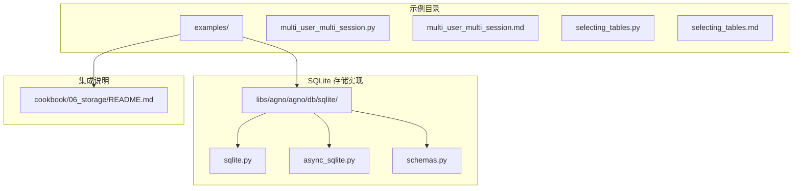
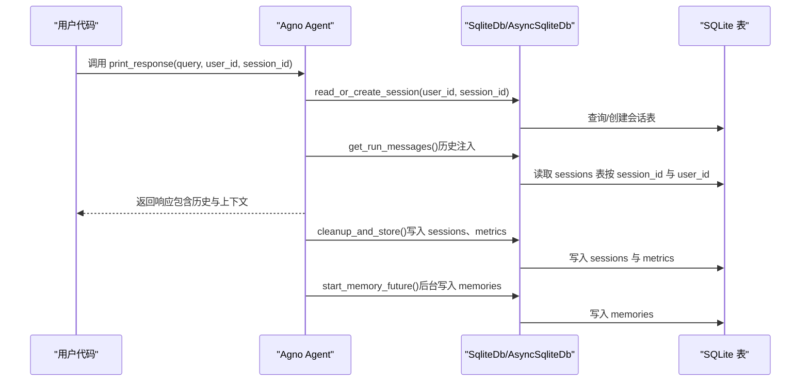
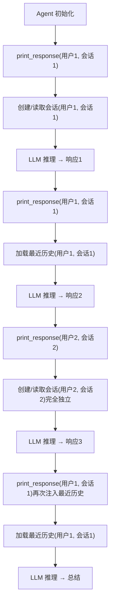
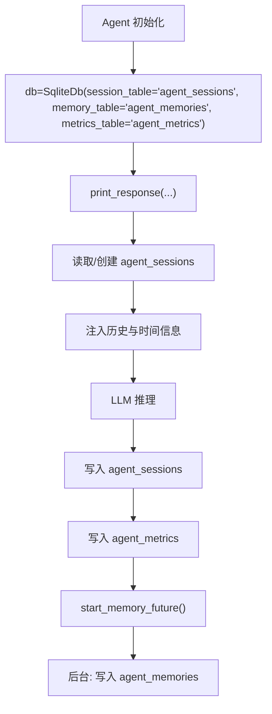
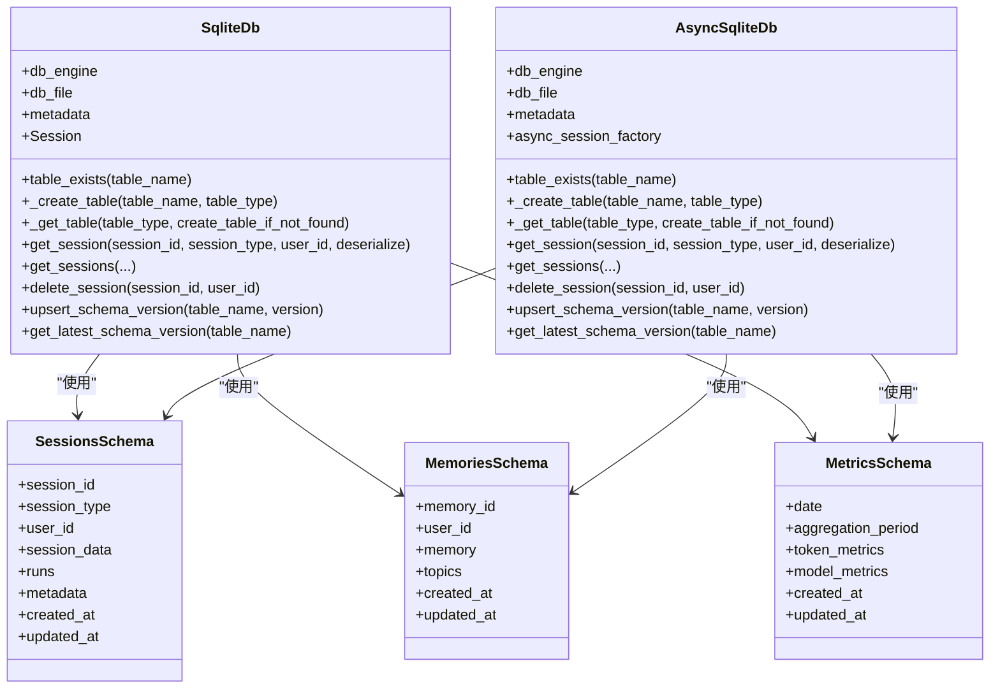
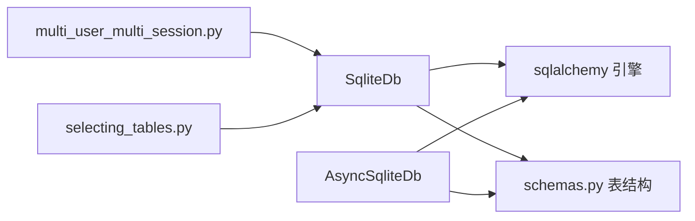

# 存储示例

<cite>
**本文引用的文件**
- [multi_user_multi_session.py](file://cookbook/06_storage/examples/multi_user_multi_session.py)
- [multi_user_multi_session.md](file://cookbook/06_storage/examples/multi_user_multi_session.md)
- [selecting_tables.py](file://cookbook/06_storage/examples/selecting_tables.py)
- [selecting_tables.md](file://cookbook/06_storage/examples/selecting_tables.md)
- [sqlite.py](file://libs/agno/agno/db/sqlite/sqlite.py)
- [schemas.py](file://libs/agno/agno/db/sqlite/schemas.py)
- [async_sqlite.py](file://libs/agno/agno/db/sqlite/async_sqlite.py)
- [README.md](file://cookbook/06_storage/README.md)
</cite>

## 目录
1. [简介](#简介)
2. [项目结构](#项目结构)
3. [核心组件](#核心组件)
4. [架构总览](#架构总览)
5. [详细组件分析](#详细组件分析)
6. [依赖关系分析](#依赖关系分析)
7. [性能考量](#性能考量)
8. [故障排查指南](#故障排查指南)
9. [结论](#结论)
10. [附录](#附录)

## 简介
本示例面向多用户多会话场景，基于 Agno 的 SQLite 存储后端，演示以下关键能力：
- 单实例多用户多会话：通过运行时传入 user_id 与 session_id，在同一 Agent 实例中隔离不同用户的会话与记忆
- 会话管理与数据一致性：会话表按 session_id 与 user_id 双维隔离；历史消息注入受 num_history_runs 限制，避免上下文膨胀
- 表格选择与分区策略：通过自定义表名实现三类核心表（会话、记忆、指标）的独立命名，便于多组件并存与运维管理
- 异步与同步双栈：同时提供同步与异步 SQLite 存储实现，满足不同并发与性能需求
- 错误处理与可维护性：完善的表存在性检查、索引创建、版本记录与异常日志，确保系统稳定

## 项目结构
示例位于 cookbook/06_storage/examples 下，包含两个核心示例与配套说明文档：
- 多用户多会话示例：multi_user_multi_session.py 与 multi_user_multi_session.md
- 自定义表名示例：selecting_tables.py 与 selecting_tables.md
- 数据库集成总览：cookbook/06_storage/README.md

**图表来源**
- [multi_user_multi_session.py:1-64](file://cookbook/06_storage/examples/multi_user_multi_session.py#L1-L64)
- [selecting_tables.py:1-38](file://cookbook/06_storage/examples/selecting_tables.py#L1-L38)
- [sqlite.py:1-120](file://libs/agno/agno/db/sqlite/sqlite.py#L1-L120)
- [async_sqlite.py:1-120](file://libs/agno/agno/db/sqlite/async_sqlite.py#L1-L120)
- [schemas.py:1-60](file://libs/agno/agno/db/sqlite/schemas.py#L1-L60)
- [README.md:1-55](file://cookbook/06_storage/README.md#L1-L55)

**章节来源**
- [README.md:1-55](file://cookbook/06_storage/README.md#L1-L55)

## 核心组件
- 多用户多会话示例
  - 使用 SQLite 作为后端，Agent 在运行时接收 user_id 与 session_id，实现跨用户会话隔离
  - 通过 num_history_runs 控制历史消息长度，避免上下文过长
- 自定义表名示例
  - 通过 session_table、memory_table、metrics_table 等参数为三类核心表指定自定义名称
  - 结合 update_memory_on_run 开启自动记忆提取，后台线程写入记忆表
- SQLite 存储实现
  - 同步与异步两套实现，均支持表创建、索引、版本记录与会话 CRUD
  - 会话表 schema 包含 session_id、user_id、session_data、runs、metadata 等字段
  - 记忆表 schema 包含 memory_id、user_id、memory、topics 等字段
  - 指标表 schema 包含日期聚合、token 与模型指标等字段

**章节来源**
- [multi_user_multi_session.py:1-64](file://cookbook/06_storage/examples/multi_user_multi_session.py#L1-L64)
- [multi_user_multi_session.md:1-156](file://cookbook/06_storage/examples/multi_user_multi_session.md#L1-L156)
- [selecting_tables.py:1-38](file://cookbook/06_storage/examples/selecting_tables.py#L1-L38)
- [selecting_tables.md:1-123](file://cookbook/06_storage/examples/selecting_tables.md#L1-L123)
- [sqlite.py:44-123](file://libs/agno/agno/db/sqlite/sqlite.py#L44-L123)
- [schemas.py:11-96](file://libs/agno/agno/db/sqlite/schemas.py#L11-L96)

## 架构总览
下图展示了示例运行时的调用链与数据流，从用户代码层到 Agno Agent 层，再到 SQLite 存储层。

**图表来源**
- [multi_user_multi_session.py:35-63](file://cookbook/06_storage/examples/multi_user_multi_session.py#L35-L63)
- [sqlite.py:713-800](file://libs/agno/agno/db/sqlite/sqlite.py#L713-L800)
- [async_sqlite.py:544-760](file://libs/agno/agno/db/sqlite/async_sqlite.py#L544-L760)
- [schemas.py:11-96](file://libs/agno/agno/db/sqlite/schemas.py#L11-L96)

## 详细组件分析

### 多用户多会话实现
- 运行时注入 user_id 与 session_id
  - 示例通过两次 print_response 调用分别模拟用户 1 与用户 2 的独立会话
  - 第三次调用时，系统仅注入最近 num_history_runs 条历史，控制上下文长度
- 用户级数据隔离
  - 会话历史按 session_id 隔离
  - 用户记忆按 user_id 存储与提取
  - session_state 为每个 session 独立维护
- 历史长度控制
  - num_history_runs=3 限制每次注入的历史条目数量，避免上下文窗口过大

**图表来源**
- [multi_user_multi_session.py:35-63](file://cookbook/06_storage/examples/multi_user_multi_session.py#L35-L63)
- [multi_user_multi_session.md:125-144](file://cookbook/06_storage/examples/multi_user_multi_session.md#L125-L144)

**章节来源**
- [multi_user_multi_session.py:1-64](file://cookbook/06_storage/examples/multi_user_multi_session.py#L1-L64)
- [multi_user_multi_session.md:1-156](file://cookbook/06_storage/examples/multi_user_multi_session.md#L1-L156)

### 自定义表名与三表分离
- 表名自定义
  - session_table="agent_sessions"
  - memory_table="agent_memories"
  - metrics_table="agent_metrics"
- 三表职责分离
  - sessions：会话历史与状态
  - memories：用户记忆（update_memory_on_run 后台写入）
  - metrics：运行指标（token 使用等）
- 自动记忆提取
  - update_memory_on_run=True 时，后台线程启动记忆提取，写入 memory_table

**图表来源**
- [selecting_tables.py:12-28](file://cookbook/06_storage/examples/selecting_tables.py#L12-L28)
- [selecting_tables.md:97-114](file://cookbook/06_storage/examples/selecting_tables.md#L97-L114)
- [schemas.py:11-96](file://libs/agno/agno/db/sqlite/schemas.py#L11-L96)

**章节来源**
- [selecting_tables.py:1-38](file://cookbook/06_storage/examples/selecting_tables.py#L1-L38)
- [selecting_tables.md:1-123](file://cookbook/06_storage/examples/selecting_tables.md#L1-L123)

### SQLite 存储实现（类图）

**图表来源**
- [sqlite.py:44-123](file://libs/agno/agno/db/sqlite/sqlite.py#L44-L123)
- [async_sqlite.py:45-115](file://libs/agno/agno/db/sqlite/async_sqlite.py#L45-L115)
- [schemas.py:11-96](file://libs/agno/agno/db/sqlite/schemas.py#L11-L96)

**章节来源**
- [sqlite.py:1-800](file://libs/agno/agno/db/sqlite/sqlite.py#L1-L800)
- [async_sqlite.py:1-800](file://libs/agno/agno/db/sqlite/async_sqlite.py#L1-L800)
- [schemas.py:1-343](file://libs/agno/agno/db/sqlite/schemas.py#L1-L343)

## 依赖关系分析
- 示例对存储后端的依赖
  - multi_user_multi_session.py 依赖 SqliteDb 与 Agent
  - selecting_tables.py 依赖 SqliteDb 并配置三张表名
- 存储后端内部依赖
  - SqliteDb/AsyncSqliteDb 依赖 SQLAlchemy 引擎与元数据
  - 通过 get_table_schema_definition 获取各表 schema，按逻辑表名映射到实际表名
  - 支持复合主键、外键约束、唯一约束与索引
- 版本与迁移
  - upsert_schema_version 与 get_latest_schema_version 用于记录与查询表版本，保障 schema 兼容性

**图表来源**
- [multi_user_multi_session.py:8-30](file://cookbook/06_storage/examples/multi_user_multi_session.py#L8-L30)
- [selecting_tables.py:6-28](file://cookbook/06_storage/examples/selecting_tables.py#L6-L28)
- [sqlite.py:34-42](file://libs/agno/agno/db/sqlite/sqlite.py#L34-L42)
- [async_sqlite.py:36-43](file://libs/agno/agno/db/sqlite/async_sqlite.py#L36-L43)
- [schemas.py:1-9](file://libs/agno/agno/db/sqlite/schemas.py#L1-L9)

**章节来源**
- [sqlite.py:194-227](file://libs/agno/agno/db/sqlite/sqlite.py#L194-L227)
- [async_sqlite.py:150-182](file://libs/agno/agno/db/sqlite/async_sqlite.py#L150-L182)
- [schemas.py:299-343](file://libs/agno/agno/db/sqlite/schemas.py#L299-L343)

## 性能考量
- 表与索引
  - 会话表与记忆表的关键列（如 user_id、created_at）建立索引，提升查询效率
  - 指标表按日期与聚合周期建立唯一约束，避免重复统计
- 历史注入控制
  - num_history_runs 限制历史消息数量，降低上下文长度，提高响应速度
- 异步写入
  - AsyncSqliteDb 提供异步接口，适合高并发场景；同步 SqliteDb 则适用于轻量或简单部署
- 表名分离
  - 将 sessions、memories、metrics 分离到不同表，便于按需查询与维护，减少锁竞争

**章节来源**
- [schemas.py:11-96](file://libs/agno/agno/db/sqlite/schemas.py#L11-L96)
- [multi_user_multi_session.md:73-86](file://cookbook/06_storage/examples/multi_user_multi_session.md#L73-L86)
- [selecting_tables.md:43-77](file://cookbook/06_storage/examples/selecting_tables.md#L43-L77)

## 故障排查指南
- 表不存在或 schema 不匹配
  - 使用 table_exists 检查表是否存在；若不存在且 create_table_if_not_found=True，则自动创建
  - 若表已存在但 schema 不匹配，抛出异常提示，需检查版本或迁移
- 删除与查询失败
  - delete_session/delete_sessions 在执行失败时记录错误日志并抛出异常
  - get_session/get_sessions 支持 user_id 过滤与分页排序，便于定位问题
- 异步连接池
  - AsyncSqliteDb 提供 close 方法释放连接池；在应用关闭时务必调用
- 日志与调试
  - 各方法均包含 log_debug/log_error，便于定位问题

**章节来源**
- [sqlite.py:653-711](file://libs/agno/agno/db/sqlite/sqlite.py#L653-L711)
- [sqlite.py:713-800](file://libs/agno/agno/db/sqlite/sqlite.py#L713-L800)
- [async_sqlite.py:482-543](file://libs/agno/agno/db/sqlite/async_sqlite.py#L482-L543)
- [async_sqlite.py:544-702](file://libs/agno/agno/db/sqlite/async_sqlite.py#L544-L702)

## 结论
本示例通过 SQLite 存储后端，完整展示了多用户多会话的实现路径：运行时注入 user_id 与 session_id 实现用户级隔离；通过 num_history_runs 控制上下文长度；通过自定义表名实现三表分离与精细化管理；同步与异步双栈满足不同场景需求。配合完善的表结构、索引与版本管理，确保了数据一致性与可维护性。

## 附录

### 运行环境与依赖
- Python 依赖
  - SQLAlchemy（同步与异步均需）
  - 示例中涉及的驱动安装参考数据库集成总览
- 示例运行
  - 多用户多会话：直接运行示例脚本，Agent 会在 SQLite 中创建/读取会话
  - 自定义表名：直接运行示例脚本，SqliteDb 将按自定义表名创建三张表

**章节来源**
- [README.md:7-17](file://cookbook/06_storage/README.md#L7-L17)
- [multi_user_multi_session.py:15-30](file://cookbook/06_storage/examples/multi_user_multi_session.py#L15-L30)
- [selecting_tables.py:12-28](file://cookbook/06_storage/examples/selecting_tables.py#L12-L28)

### 配置与最佳实践
- 表名自定义
  - 为不同组件或租户使用不同的表名，避免冲突
- 历史长度控制
  - 根据模型上下文窗口与业务需求调整 num_history_runs
- 异步化
  - 在高并发场景优先考虑 AsyncSqliteDb
- 版本管理
  - 使用 upsert_schema_version 与 get_latest_schema_version 管理 schema 版本

**章节来源**
- [selecting_tables.md:43-77](file://cookbook/06_storage/examples/selecting_tables.md#L43-L77)
- [multi_user_multi_session.md:73-86](file://cookbook/06_storage/examples/multi_user_multi_session.md#L73-L86)
- [sqlite.py:615-650](file://libs/agno/agno/db/sqlite/sqlite.py#L615-L650)
- [async_sqlite.py:443-478](file://libs/agno/agno/db/sqlite/async_sqlite.py#L443-L478)

### 扩展与定制建议
- 新增表类型
  - 在 get_table_schema_definition 中添加新表 schema，并在 _get_table 中注册
- 自定义过滤器
  - 在 get_sessions 中扩展过滤条件（如按 session_name、时间范围等）
- 自定义索引
  - 在 schemas.py 中为新表增加索引与唯一约束，提升查询性能

**章节来源**
- [schemas.py:299-343](file://libs/agno/agno/db/sqlite/schemas.py#L299-L343)
- [sqlite.py:434-577](file://libs/agno/agno/db/sqlite/sqlite.py#L434-L577)
- [async_sqlite.py:291-400](file://libs/agno/agno/db/sqlite/async_sqlite.py#L291-L400)