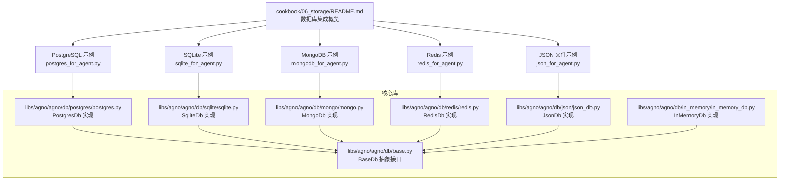
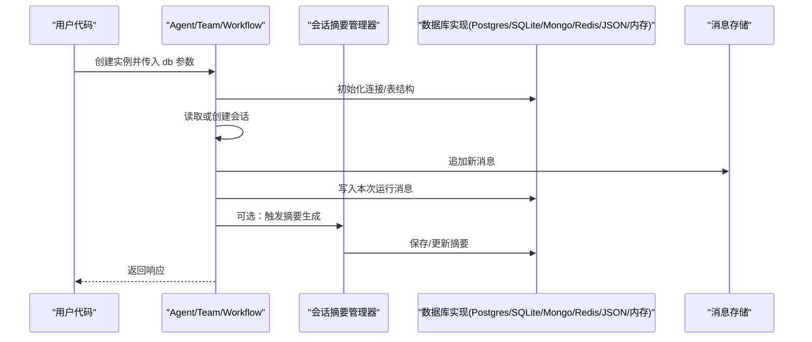
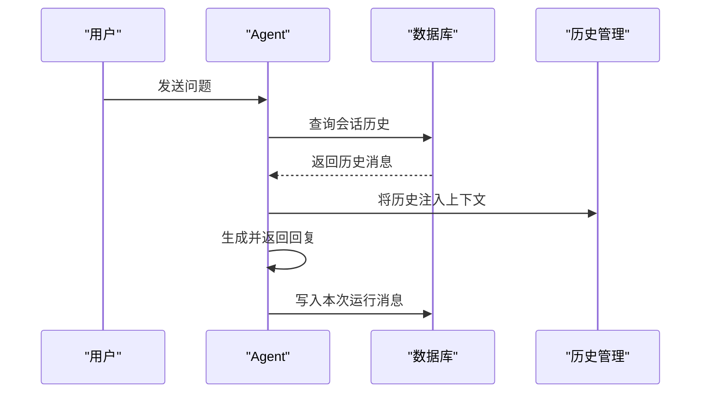
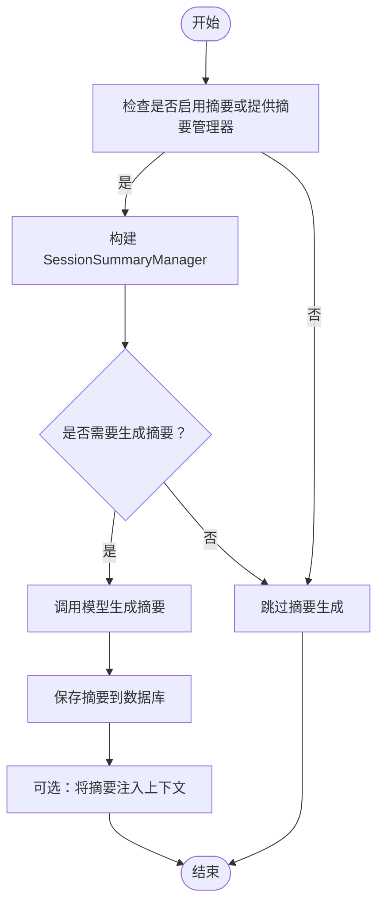
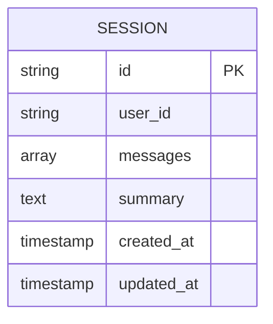
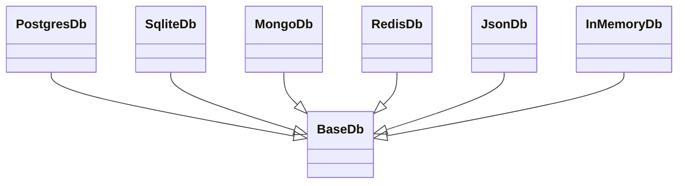

# 存储系统

<cite>
**本文引用的文件**
- [cookbook/06_storage/README.md](file://cookbook/06_storage/README.md)
- [cookbook/06_storage/01_persistent_session_storage.py](file://cookbook/06_storage/01_persistent_session_storage.py)
- [cookbook/06_storage/02_session_summary.py](file://cookbook/06_storage/02_session_summary.py)
- [cookbook/06_storage/03_chat_history.py](file://cookbook/06_storage/03_chat_history.py)
- [cookbook/06_storage/postgres/postgres_for_agent.py](file://cookbook/06_storage/postgres/postgres_for_agent.py)
- [cookbook/06_storage/sqlite/sqlite_for_agent.py](file://cookbook/06_storage/sqlite/sqlite_for_agent.py)
- [cookbook/06_storage/mongo/mongodb_for_agent.py](file://cookbook/06_storage/mongo/mongodb_for_agent.py)
- [cookbook/06_storage/redis/redis_for_agent.py](file://cookbook/06_storage/redis/redis_for_agent.py)
- [cookbook/06_storage/json_db/json_for_agent.py](file://cookbook/06_storage/json_db/json_for_agent.py)
- [libs/agno/agno/db/base.py](file://libs/agno/agno/db/base.py)
- [libs/agno/agno/db/postgres/postgres.py](file://libs/agno/agno/db/postgres/postgres.py)
- [libs/agno/agno/db/sqlite/sqlite.py](file://libs/agno/agno/db/sqlite/sqlite.py)
- [libs/agno/agno/db/mongo/mongo.py](file://libs/agno/agno/db/mongo/mongo.py)
- [libs/agno/agno/db/redis/redis.py](file://libs/agno/agno/db/redis/redis.py)
- [libs/agno/agno/db/json/json_db.py](file://libs/agno/agno/db/json/json_db.py)
- [libs/agno/agno/db/in_memory/in_memory_db.py](file://libs/agno/agno/db/in_memory/in_memory_db.py)
- [libs/agno/agno/session/summary.py](file://libs/agno/agno/session/summary.py)
- [cookbook/00_quickstart/agent_with_storage.md](file://cookbook/00_quickstart/agent_with_storage.md)
</cite>

## 目录
1. [简介](#简介)
2. [项目结构](#项目结构)
3. [核心组件](#核心组件)
4. [架构总览](#架构总览)
5. [详细组件分析](#详细组件分析)
6. [依赖关系分析](#依赖关系分析)
7. [性能考量](#性能考量)
8. [故障排查指南](#故障排查指南)
9. [结论](#结论)
10. [附录](#附录)

## 简介
本文件面向 Agno Learn 的存储系统，聚焦于会话持久化、会话摘要生成与聊天历史管理，并系统梳理多种数据库实现（SQLite、PostgreSQL、MongoDB、Redis、JSON 文件、内存存储等）的集成方式、配置要点、优缺点与适用场景。文档同时提供架构设计、数据模型与访问模式说明，以及可操作的配置示例与最佳实践建议，帮助开发者按需选择与落地合适的存储方案。

## 项目结构
Agno Learn 的存储系统以“统一的数据库接口 + 多后端实现”的方式组织，核心位于 libs/agno/agno/db 下，示例与用法集中在 cookbook/06_storage 中。该目录提供了 PostgreSQL、SQLite、MongoDB、Redis、JSON 文件、内存存储等多数据库的使用示例与基础集成说明。

图表来源
- [cookbook/06_storage/README.md:1-55](file://cookbook/06_storage/README.md#L1-L55)
- [cookbook/06_storage/postgres/postgres_for_agent.py:1-30](file://cookbook/06_storage/postgres/postgres_for_agent.py#L1-L30)
- [cookbook/06_storage/sqlite/sqlite_for_agent.py:1-33](file://cookbook/06_storage/sqlite/sqlite_for_agent.py#L1-L33)
- [cookbook/06_storage/mongo/mongodb_for_agent.py:1-45](file://cookbook/06_storage/mongo/mongodb_for_agent.py#L1-L45)
- [cookbook/06_storage/redis/redis_for_agent.py:1-44](file://cookbook/06_storage/redis/redis_for_agent.py#L1-L44)
- [cookbook/06_storage/json_db/json_for_agent.py:1-36](file://cookbook/06_storage/json_db/json_for_agent.py#L1-L36)
- [libs/agno/agno/db/base.py:29-1100](file://libs/agno/agno/db/base.py#L29-L1100)
- [libs/agno/agno/db/postgres/postgres.py:59](file://libs/agno/agno/db/postgres/postgres.py#L59)
- [libs/agno/agno/db/sqlite/sqlite.py:43](file://libs/agno/agno/db/sqlite/sqlite.py#L43)
- [libs/agno/agno/db/mongo/mongo.py:47](file://libs/agno/agno/db/mongo/mongo.py#L47)
- [libs/agno/agno/db/redis/redis.py:39](file://libs/agno/agno/db/redis/redis.py#L39)
- [libs/agno/agno/db/json/json_db.py:29](file://libs/agno/agno/db/json/json_db.py#L29)
- [libs/agno/agno/db/in_memory/in_memory_db.py:26](file://libs/agno/agno/db/in_memory/in_memory_db.py#L26)

章节来源
- [cookbook/06_storage/README.md:1-55](file://cookbook/06_storage/README.md#L1-L55)

## 核心组件
- 统一抽象接口：所有数据库实现均继承自 BaseDb（同步）或 AsyncBaseDb（异步），确保上层 Agent/Team/Workflow 使用一致的存储 API。
- 具体实现：
  - PostgresDb：关系型数据库，适合结构化会话与复杂查询。
  - SqliteDb：轻量嵌入式数据库，适合本地开发与小规模部署。
  - MongoDb：文档型数据库，适合非结构化消息与灵活扩展。
  - RedisDb：内存键值存储，适合高并发读写与短期会话缓存。
  - JsonDb：文件化 JSON 存储，适合演示与简单场景。
  - InMemoryDb：纯内存存储，适合临时会话与快速原型。
- 会话摘要：通过 SessionSummaryManager 驱动摘要生成，支持在上下文中注入摘要以减少长上下文开销。
- 聊天历史：Agent 提供获取历史的方法，结合数据库实现进行持久化与检索。

章节来源
- [libs/agno/agno/db/base.py:29-1100](file://libs/agno/agno/db/base.py#L29-L1100)
- [libs/agno/agno/session/summary.py](file://libs/agno/agno/session/summary.py)
- [cookbook/06_storage/01_persistent_session_storage.py:1-35](file://cookbook/06_storage/01_persistent_session_storage.py#L1-L35)
- [cookbook/06_storage/02_session_summary.py:1-50](file://cookbook/06_storage/02_session_summary.py#L1-L50)
- [cookbook/06_storage/03_chat_history.py:1-38](file://cookbook/06_storage/03_chat_history.py#L1-L38)

## 架构总览
下图展示了从用户代码到数据库实现的整体调用链与职责边界：

图表来源
- [cookbook/06_storage/postgres/postgres_for_agent.py:18-22](file://cookbook/06_storage/postgres/postgres_for_agent.py#L18-L22)
- [cookbook/06_storage/sqlite/sqlite_for_agent.py:18-23](file://cookbook/06_storage/sqlite/sqlite_for_agent.py#L18-L23)
- [cookbook/06_storage/mongo/mongodb_for_agent.py:33-37](file://cookbook/06_storage/mongo/mongodb_for_agent.py#L33-L37)
- [cookbook/06_storage/redis/redis_for_agent.py:27-31](file://cookbook/06_storage/redis/redis_for_agent.py#L27-L31)
- [cookbook/06_storage/json_db/json_for_agent.py:20-27](file://cookbook/06_storage/json_db/json_for_agent.py#L20-L27)
- [libs/agno/agno/session/summary.py](file://libs/agno/agno/session/summary.py)

## 详细组件分析

### 会话持久化与历史管理
- 会话创建与恢复：Agent/Team 在运行前会尝试从数据库恢复现有会话；若不存在则创建新会话。
- 历史注入：当启用 add_history_to_context 时，系统会在每次请求中将历史消息拼接到上下文。
- 历史检索：Agent 提供获取历史的方法，便于调试与审计。
- 示例路径：
  - [持久化会话示例:1-35](file://cookbook/06_storage/01_persistent_session_storage.py#L1-L35)
  - [聊天历史示例:1-38](file://cookbook/06_storage/03_chat_history.py#L1-L38)

图表来源
- [cookbook/06_storage/03_chat_history.py:21-27](file://cookbook/06_storage/03_chat_history.py#L21-L27)
- [cookbook/06_storage/01_persistent_session_storage.py:22-28](file://cookbook/06_storage/01_persistent_session_storage.py#L22-L28)

章节来源
- [cookbook/06_storage/01_persistent_session_storage.py:1-35](file://cookbook/06_storage/01_persistent_session_storage.py#L1-L35)
- [cookbook/06_storage/03_chat_history.py:1-38](file://cookbook/06_storage/03_chat_history.py#L1-L38)

### 会话摘要生成机制
- 触发方式：可通过开启 enable_session_summaries 或显式传入 SessionSummaryManager 控制摘要生成。
- 摘要算法：摘要由 SessionSummaryManager 驱动，底层使用指定模型生成，结果写入数据库。
- 上下文注入：可将摘要注入到后续上下文中，降低上下文长度与延迟。
- 示例路径：
  - [会话摘要示例:1-50](file://cookbook/06_storage/02_session_summary.py#L1-L50)

图表来源
- [cookbook/06_storage/02_session_summary.py:35-42](file://cookbook/06_storage/02_session_summary.py#L35-L42)
- [libs/agno/agno/session/summary.py](file://libs/agno/agno/session/summary.py)

章节来源
- [cookbook/06_storage/02_session_summary.py:1-50](file://cookbook/06_storage/02_session_summary.py#L1-L50)

### 数据库实现与对比

#### PostgreSQL
- 适用场景：生产级关系型数据存储，支持复杂查询、事务与高一致性。
- 配置要点：提供数据库连接字符串，初始化后自动维护会话表。
- 示例路径：
  - [PostgreSQL 示例:12-22](file://cookbook/06_storage/postgres/postgres_for_agent.py#L12-L22)

章节来源
- [cookbook/06_storage/postgres/postgres_for_agent.py:1-30](file://cookbook/06_storage/postgres/postgres_for_agent.py#L1-L30)

#### SQLite
- 适用场景：本地开发、单机应用、资源受限环境。
- 配置要点：指定本地文件路径，零安装即可使用。
- 示例路径：
  - [SQLite 示例:13-23](file://cookbook/06_storage/sqlite/sqlite_for_agent.py#L13-L23)

章节来源
- [cookbook/06_storage/sqlite/sqlite_for_agent.py:1-33](file://cookbook/06_storage/sqlite/sqlite_for_agent.py#L1-L33)

#### MongoDB
- 适用场景：非结构化消息、灵活字段扩展、高写入吞吐。
- 配置要点：提供连接字符串，注意集合命名与索引策略。
- 示例路径：
  - [MongoDB 示例:27-37](file://cookbook/06_storage/mongo/mongodb_for_agent.py#L27-L37)

章节来源
- [cookbook/06_storage/mongo/mongodb_for_agent.py:1-45](file://cookbook/06_storage/mongo/mongodb_for_agent.py#L1-L45)

#### Redis
- 适用场景：高并发读写、短期会话缓存、键值快速检索。
- 配置要点：提供连接 URL，注意键空间规划与过期策略。
- 示例路径：
  - [Redis 示例:22-31](file://cookbook/06_storage/redis/redis_for_agent.py#L22-L31)

章节来源
- [cookbook/06_storage/redis/redis_for_agent.py:1-44](file://cookbook/06_storage/redis/redis_for_agent.py#L1-L44)

#### JSON 文件存储
- 适用场景：演示、小规模数据、无需数据库服务器。
- 配置要点：指定目录路径，注意文件权限与磁盘空间。
- 示例路径：
  - [JSON 文件示例:15-27](file://cookbook/06_storage/json_db/json_for_agent.py#L15-L27)

章节来源
- [cookbook/06_storage/json_db/json_for_agent.py:1-36](file://cookbook/06_storage/json_db/json_for_agent.py#L1-L36)

#### 内存存储
- 适用场景：临时会话、快速原型、无持久化需求。
- 配置要点：直接实例化 InMemoryDb，重启即丢失。
- 示例路径：
  - [InMemoryDb 概览:1-117](file://cookbook/06_storage/in_memory/README.md#L1-L117)

章节来源
- [cookbook/06_storage/in_memory/README.md:1-117](file://cookbook/06_storage/in_memory/README.md#L1-L117)

### 数据模型与访问模式
- 会话模型（概念性）：包含会话标识、用户标识、消息列表、摘要、元信息（创建时间、更新时间等）。
- 访问模式：
  - 读取：按会话 ID 获取历史消息，必要时合并摘要。
  - 写入：追加新消息，周期性生成摘要并回写。
  - 清理：定期清理过期会话或归档旧会话。

图表来源
- [libs/agno/agno/db/postgres/postgres.py:59](file://libs/agno/agno/db/postgres/postgres.py#L59)
- [libs/agno/agno/db/sqlite/sqlite.py:43](file://libs/agno/agno/db/sqlite/sqlite.py#L43)
- [libs/agno/agno/db/mongo/mongo.py:47](file://libs/agno/agno/db/mongo/mongo.py#L47)
- [libs/agno/agno/db/redis/redis.py:39](file://libs/agno/agno/db/redis/redis.py#L39)
- [libs/agno/agno/db/json/json_db.py:29](file://libs/agno/agno/db/json/json_db.py#L29)
- [libs/agno/agno/db/in_memory/in_memory_db.py:26](file://libs/agno/agno/db/in_memory/in_memory_db.py#L26)

## 依赖关系分析
- 继承关系：各数据库实现均继承自 BaseDb（或 AsyncBaseDb），统一了接口契约。
- 依赖方向：Agent/Team/Workflow 仅依赖抽象接口，不直接耦合具体数据库实现，便于替换与扩展。
- 外部依赖：不同数据库实现依赖各自驱动（如 psycopg2、pymongo、redis 等），示例文档已给出安装指引。

图表来源
- [libs/agno/agno/db/base.py:29-1100](file://libs/agno/agno/db/base.py#L29-L1100)
- [libs/agno/agno/db/postgres/postgres.py:59](file://libs/agno/agno/db/postgres/postgres.py#L59)
- [libs/agno/agno/db/sqlite/sqlite.py:43](file://libs/agno/agno/db/sqlite/sqlite.py#L43)
- [libs/agno/agno/db/mongo/mongo.py:47](file://libs/agno/agno/db/mongo/mongo.py#L47)
- [libs/agno/agno/db/redis/redis.py:39](file://libs/agno/agno/db/redis/redis.py#L39)
- [libs/agno/agno/db/json/json_db.py:29](file://libs/agno/agno/db/json/json_db.py#L29)
- [libs/agno/agno/db/in_memory/in_memory_db.py:26](file://libs/agno/agno/db/in_memory/in_memory_db.py#L26)

章节来源
- [libs/agno/agno/db/base.py:29-1100](file://libs/agno/agno/db/base.py#L29-L1100)

## 性能考量
- 上下文长度控制：通过会话摘要减少历史消息长度，显著降低大模型推理成本与延迟。
- 读写分离与索引：对高频查询字段建立索引（如会话 ID、用户 ID、时间戳），提升检索效率。
- 缓存策略：Redis 可用于热点会话的短期缓存，降低后端压力。
- 批量写入：批量提交消息可减少网络往返与事务开销。
- 异步实现：对于高并发场景，优先考虑 Async* 实现以提升吞吐。

## 故障排查指南
- 连接失败
  - 检查数据库连接字符串与凭据。
  - 确认网络可达与防火墙设置。
  - 参考示例中的安装与启动命令。
- 表结构缺失
  - 确保首次运行时完成初始化（如创建会话表）。
- 性能异常
  - 启用摘要以缩短上下文。
  - 对查询字段建立索引。
  - 使用 Redis 缓存热点数据。
- 数据丢失
  - 生产环境避免使用 InMemoryDb。
  - 对 JSON/SQLite 等方案做好备份与迁移策略。

章节来源
- [cookbook/06_storage/README.md:7-17](file://cookbook/06_storage/README.md#L7-L17)
- [cookbook/06_storage/redis/redis_for_agent.py:6-12](file://cookbook/06_storage/redis/redis_for_agent.py#L6-L12)
- [cookbook/06_storage/mongo/mongodb_for_agent.py:5-18](file://cookbook/06_storage/mongo/mongodb_for_agent.py#L5-L18)

## 结论
Agno Learn 的存储系统通过统一抽象接口与多数据库实现，为会话持久化、摘要生成与历史管理提供了灵活且可扩展的解决方案。开发者可根据业务规模、性能要求与运维能力选择合适的数据库，并结合摘要与缓存策略优化整体体验。建议在生产环境中优先采用关系型数据库或文档型数据库，并配套完善的索引、备份与监控机制。

## 附录

### 数据库选择指南
- 开发/演示：JSON 文件或 SQLite
- 单机/小规模：SQLite 或 Redis（短期）
- 生产级：PostgreSQL 或 MongoDB
- 高并发/低延迟：Redis（配合其他数据库作为缓存层）

### 配置示例与最佳实践
- PostgreSQL
  - 连接字符串格式参考示例文件。
  - 建议开启事务与只读副本用于查询扩展。
- SQLite
  - 使用绝对路径避免相对路径问题。
  - 定期备份与迁移策略。
- MongoDB
  - 合理设置集合与索引，避免全表扫描。
  - 注意副本集与分片策略。
- Redis
  - 设置合理的过期策略与内存淘汰。
  - 使用连接池与异步客户端。
- JSON 文件
  - 使用独立目录并设置写权限。
  - 定期压缩与归档。
- 内存存储
  - 仅用于测试与原型，切勿用于生产。

章节来源
- [cookbook/06_storage/README.md:35-48](file://cookbook/06_storage/README.md#L35-L48)
- [cookbook/06_storage/postgres/postgres_for_agent.py:12-13](file://cookbook/06_storage/postgres/postgres_for_agent.py#L12-L13)
- [cookbook/06_storage/sqlite/sqlite_for_agent.py:13](file://cookbook/06_storage/sqlite/sqlite_for_agent.py#L13)
- [cookbook/06_storage/mongo/mongodb_for_agent.py:27](file://cookbook/06_storage/mongo/mongodb_for_agent.py#L27)
- [cookbook/06_storage/redis/redis_for_agent.py:22](file://cookbook/06_storage/redis/redis_for_agent.py#L22)
- [cookbook/06_storage/json_db/json_for_agent.py:15](file://cookbook/06_storage/json_db/json_for_agent.py#L15)