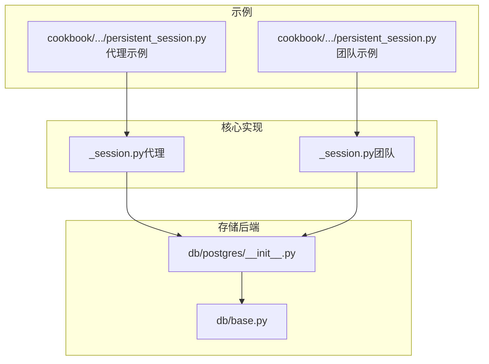
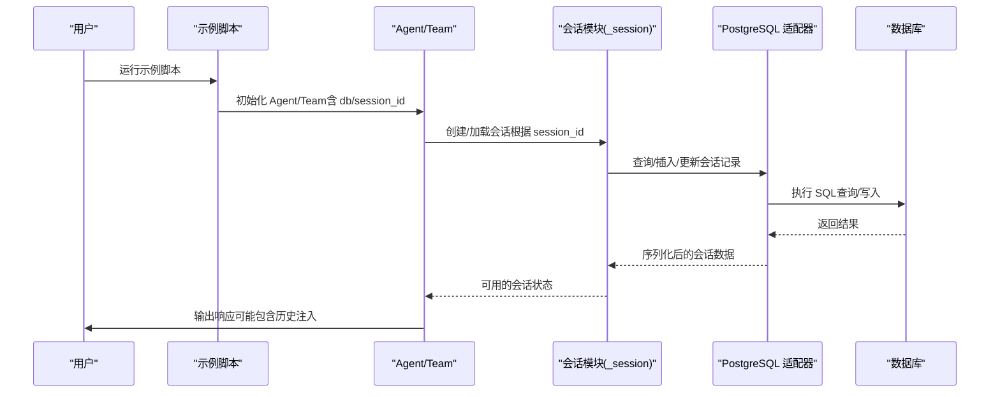
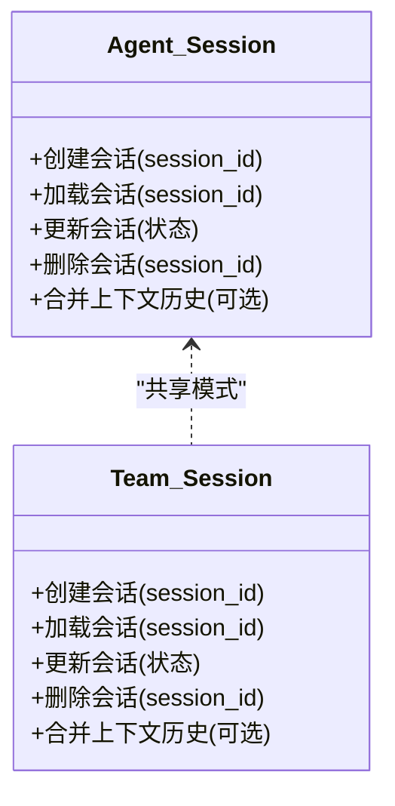
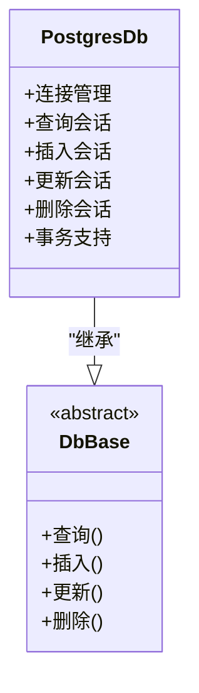
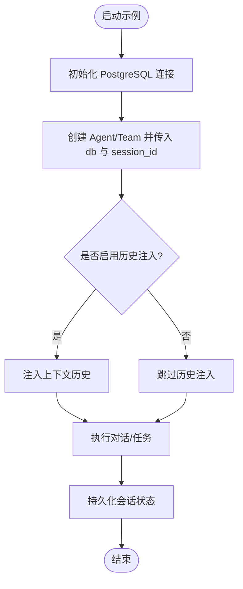
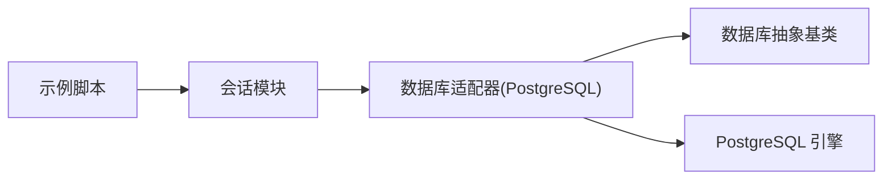

# 持久化会话存储

<cite>
**本文引用的文件**
- [persistent_session.py（代理示例）](file://cookbook/02_agents/05_state_and_session/persistent_session.py)
- [_session.py（代理会话实现）](file://libs/agno/agno/agent/_session.py)
- [postgres/__init__.py（PostgreSQL 数据库适配器）](file://libs/agno/agno/db/postgres/__init__.py)
- [base.py（数据库抽象基类）](file://libs/agno/agno/db/base.py)
- [persistent_session.py（团队示例）](file://cookbook/03_teams/07_session/persistent_session.py)
- [team/_session.py（团队会话实现）](file://libs/agno/agno/team/_session.py)
</cite>

## 目录
1. [简介](#简介)
2. [项目结构](#项目结构)
3. [核心组件](#核心组件)
4. [架构总览](#架构总览)
5. [详细组件分析](#详细组件分析)
6. [依赖关系分析](#依赖关系分析)
7. [性能考量](#性能考量)
8. [故障排除指南](#故障排除指南)
9. [结论](#结论)
10. [附录：配置与使用示例](#附录配置与使用示例)

## 简介
本文件系统性阐述 Agno Learn 的“持久化会话存储”能力，围绕以下主题展开：
- 会话状态持久化的实现机制：序列化、存储与恢复
- 配置选项：存储位置、数据格式、可选的加密机制
- 生命周期管理：创建、更新、过期与清理策略
- 会话数据结构与字段含义：用户信息、状态数据、元数据
- 性能优化技巧与最佳实践
- 安全考虑：数据保护与访问控制
- 故障排除与常见问题解决方案

## 项目结构
与持久化会话存储直接相关的关键文件与模块如下：
- 示例入口：代理与团队示例脚本
- 核心实现：代理与团队的会话模块
- 存储后端：PostgreSQL 数据库适配器与抽象基类

**图表来源**
- [persistent_session.py（代理示例）:1-31](file://cookbook/02_agents/05_state_and_session/persistent_session.py#L1-L31)
- [persistent_session.py（团队示例）:1-50](file://cookbook/03_teams/07_session/persistent_session.py#L1-L50)
- [_session.py（代理会话实现）](file://libs/agno/agno/agent/_session.py)
- [postgres/__init__.py（PostgreSQL 数据库适配器）](file://libs/agno/agno/db/postgres/__init__.py)
- [base.py（数据库抽象基类）](file://libs/agno/agno/db/base.py)

**章节来源**
- [persistent_session.py（代理示例）:1-31](file://cookbook/02_agents/05_state_and_session/persistent_session.py#L1-L31)
- [persistent_session.py（团队示例）:1-50](file://cookbook/03_teams/07_session/persistent_session.py#L1-L50)

## 核心组件
- 会话存储接口与实现
  - 代理与团队均通过会话模块管理会话状态，并将状态持久化到数据库。
  - PostgreSQL 适配器负责连接与操作会话表；抽象基类定义统一的数据访问接口。

- 示例脚本
  - 代理示例：创建 Agent 并指定数据库与会话 ID，启用上下文历史注入。
  - 团队示例：创建基础团队与带历史注入的团队，演示不同历史注入策略。

- 关键职责划分
  - 会话模块：负责会话的创建、读取、更新与删除；在运行时维护状态并按需写入存储。
  - 数据库适配器：封装 SQL 操作、连接管理与事务处理。
  - 示例脚本：演示如何初始化 Agent/Team、配置数据库与会话参数。

**章节来源**
- [_session.py（代理会话实现）](file://libs/agno/agno/agent/_session.py)
- [postgres/__init__.py（PostgreSQL 数据库适配器）](file://libs/agno/agno/db/postgres/__init__.py)
- [base.py（数据库抽象基类）](file://libs/agno/agno/db/base.py)
- [persistent_session.py（代理示例）:1-31](file://cookbook/02_agents/05_state_and_session/persistent_session.py#L1-L31)
- [persistent_session.py（团队示例）:1-50](file://cookbook/03_teams/07_session/persistent_session.py#L1-L50)

## 架构总览
下图展示了从示例脚本到会话模块再到数据库适配器的整体调用链路与数据流向。

**图表来源**
- [persistent_session.py（代理示例）:12-24](file://cookbook/02_agents/05_state_and_session/persistent_session.py#L12-L24)
- [persistent_session.py（团队示例）:16-39](file://cookbook/03_teams/07_session/persistent_session.py#L16-L39)
- [_session.py（代理会话实现）](file://libs/agno/agno/agent/_session.py)
- [postgres/__init__.py（PostgreSQL 数据库适配器）](file://libs/agno/agno/db/postgres/__init__.py)

## 详细组件分析

### 组件一：会话模块（代理与团队）
- 职责
  - 以 session_id 为键管理会话状态，支持创建、读取、更新与删除。
  - 在运行过程中合并上下文历史（可选），并在必要时将状态写回存储。
- 关键交互
  - 与数据库适配器协作完成持久化读写。
  - 对外暴露统一的状态访问与更新接口。

**图表来源**
- [_session.py（代理会话实现）](file://libs/agno/agno/agent/_session.py)
- [team/_session.py（团队会话实现）](file://libs/agno/agno/team/_session.py)

**章节来源**
- [_session.py（代理会话实现）](file://libs/agno/agno/agent/_session.py)
- [team/_session.py（团队会话实现）](file://libs/agno/agno/team/_session.py)

### 组件二：PostgreSQL 数据库适配器
- 职责
  - 提供与 PostgreSQL 的连接与操作封装，包括查询、插入、更新等。
  - 通过抽象基类定义统一接口，便于扩展其他存储后端。
- 关键点
  - 使用会话表存储会话数据，字段由适配器与业务逻辑共同决定。
  - 支持事务与错误处理，保证数据一致性。

**图表来源**
- [postgres/__init__.py（PostgreSQL 数据库适配器）](file://libs/agno/agno/db/postgres/__init__.py)
- [base.py（数据库抽象基类）](file://libs/agno/agno/db/base.py)

**章节来源**
- [postgres/__init__.py（PostgreSQL 数据库适配器）](file://libs/agno/agno/db/postgres/__init__.py)
- [base.py（数据库抽象基类）](file://libs/agno/agno/db/base.py)

### 组件三：示例脚本（代理与团队）
- 代理示例
  - 初始化 PostgresDb 并指定会话表名。
  - 创建 Agent，传入 db 与 session_id，并启用上下文历史注入。
- 团队示例
  - 创建基础团队与带历史注入的团队，演示不同历史注入策略（如注入最近 N 次运行的历史）。

**图表来源**
- [persistent_session.py（代理示例）:12-24](file://cookbook/02_agents/05_state_and_session/persistent_session.py#L12-L24)
- [persistent_session.py（团队示例）:16-39](file://cookbook/03_teams/07_session/persistent_session.py#L16-L39)

**章节来源**
- [persistent_session.py（代理示例）:1-31](file://cookbook/02_agents/05_state_and_session/persistent_session.py#L1-L31)
- [persistent_session.py（团队示例）:1-50](file://cookbook/03_teams/07_session/persistent_session.py#L1-L50)

## 依赖关系分析
- 组件耦合
  - 示例脚本依赖会话模块；会话模块依赖数据库适配器；适配器继承自抽象基类。
- 外部依赖
  - PostgreSQL 驱动与连接字符串配置。
- 可扩展性
  - 通过抽象基类与适配器模式，易于替换或扩展其他存储后端（如 MySQL、MongoDB 等）。

**图表来源**
- [persistent_session.py（代理示例）:8-24](file://cookbook/02_agents/05_state_and_session/persistent_session.py#L8-L24)
- [persistent_session.py（团队示例）:8-39](file://cookbook/03_teams/07_session/persistent_session.py#L8-L39)
- [_session.py（代理会话实现）](file://libs/agno/agno/agent/_session.py)
- [postgres/__init__.py（PostgreSQL 数据库适配器）](file://libs/agno/agno/db/postgres/__init__.py)
- [base.py（数据库抽象基类）](file://libs/agno/agno/db/base.py)

**章节来源**
- [persistent_session.py（代理示例）:8-24](file://cookbook/02_agents/05_state_and_session/persistent_session.py#L8-L24)
- [persistent_session.py（团队示例）:8-39](file://cookbook/03_teams/07_session/persistent_session.py#L8-L39)
- [_session.py（代理会话实现）](file://libs/agno/agno/agent/_session.py)
- [postgres/__init__.py（PostgreSQL 数据库适配器）](file://libs/agno/agno/db/postgres/__init__.py)
- [base.py（数据库抽象基类）](file://libs/agno/agno/db/base.py)

## 性能考量
- 读写策略
  - 延迟写入：在会话状态发生显著变化时再写入，减少频繁 I/O。
  - 批量更新：对连续多次更新进行合并，降低数据库压力。
- 索引与查询
  - 为 session_id 与时间戳建立索引，加速查询与过期清理。
- 缓存与分页
  - 对热点会话进行内存缓存；对历史消息采用分页读取，避免一次性加载过多数据。
- 连接池
  - 合理配置连接池大小与超时，提升并发场景下的吞吐量。
- 压缩与精简
  - 对历史消息进行压缩存储；仅保留必要的元数据字段，降低存储体积。

## 故障排除指南
- 连接失败
  - 检查数据库连接字符串与凭据；确认目标数据库与网络可达。
- 表不存在
  - 确认会话表已创建且名称正确；检查迁移脚本或初始化流程。
- 写入异常
  - 查看事务日志与错误码；确保字段类型与长度满足要求。
- 历史注入不生效
  - 确认启用历史注入的开关与参数设置；检查会话记录中是否存在历史数据。
- 性能瓶颈
  - 分析慢查询与锁等待；优化索引与批量写入策略；评估缓存命中率。

## 结论
Agno Learn 的持久化会话存储通过清晰的模块划分与适配器模式，实现了会话状态的可靠持久化与灵活扩展。结合合理的配置与优化策略，可在保证安全与一致性的前提下，获得良好的性能表现。建议在生产环境中进一步完善监控、备份与审计机制，持续优化存储与查询路径。

## 附录：配置与使用示例
- 代理示例配置要点
  - 数据库连接：提供有效的 PostgreSQL 连接字符串与会话表名。
  - 会话标识：为每个会话设置唯一 session_id。
  - 历史注入：根据需求开启上下文历史注入，提升对话连贯性。
- 团队示例配置要点
  - 成员与模型：为团队成员配置合适的模型与工具。
  - 历史注入策略：选择是否注入历史以及注入次数（如最近 N 次运行）。
- 最佳实践
  - 明确会话生命周期：在合适时机创建、更新与清理会话。
  - 控制数据规模：限制历史消息数量与单条消息长度。
  - 加强安全：对敏感字段进行脱敏或加密存储；严格控制访问权限。

**章节来源**
- [persistent_session.py（代理示例）:12-24](file://cookbook/02_agents/05_state_and_session/persistent_session.py#L12-L24)
- [persistent_session.py（团队示例）:16-39](file://cookbook/03_teams/07_session/persistent_session.py#L16-L39)