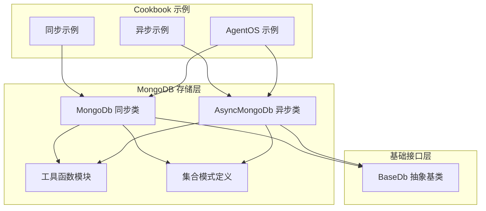
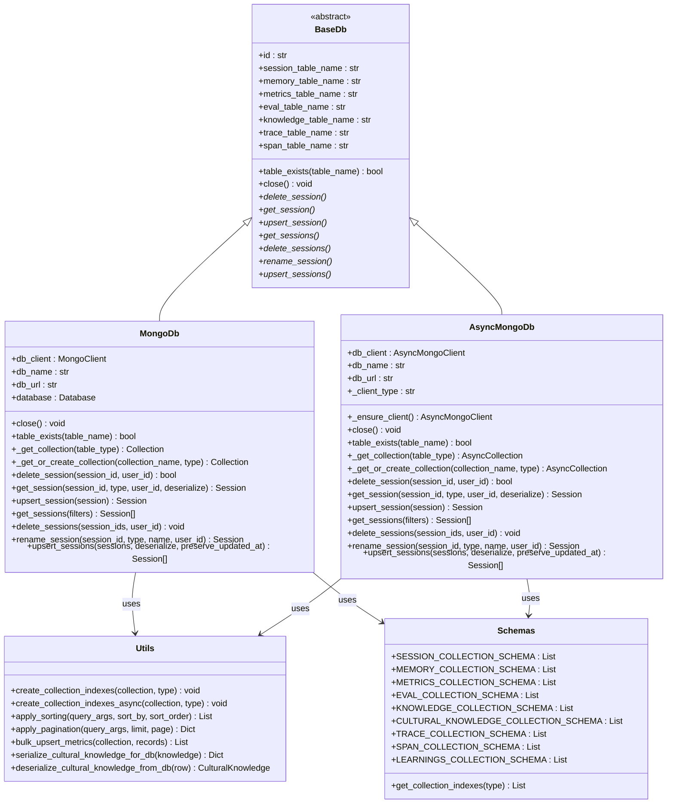
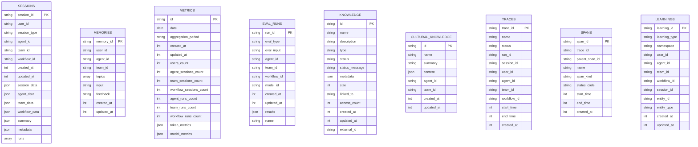
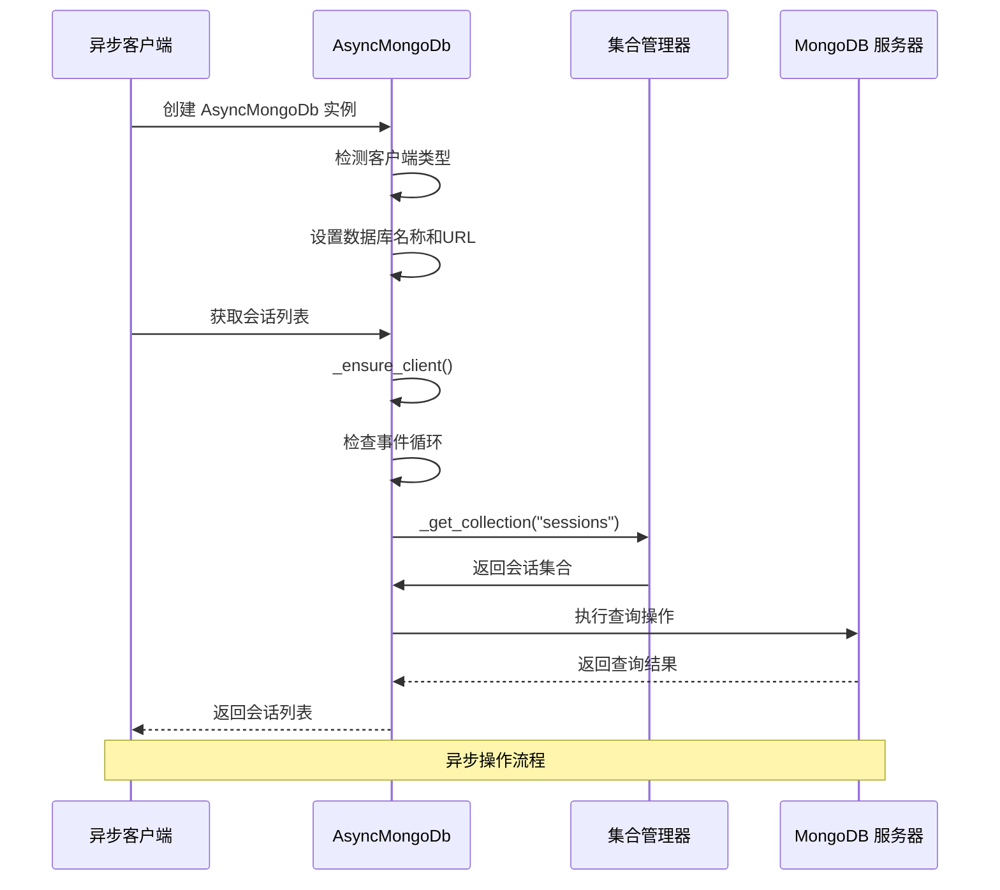
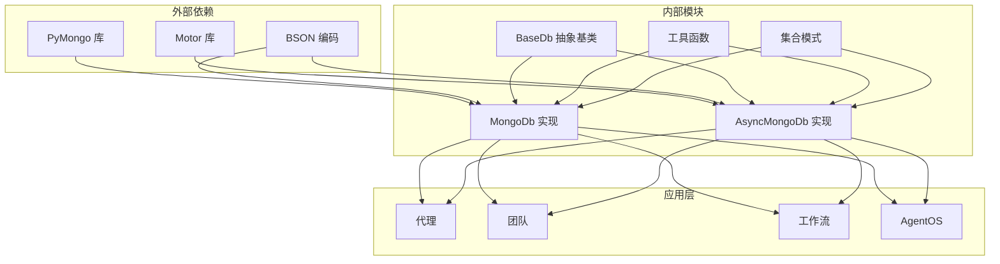

# MongoDB 存储实现

<cite>
**本文档引用的文件**
- [mongo.py](file://libs/agno/agno/db/mongo/mongo.py)
- [async_mongo.py](file://libs/agno/agno/db/mongo/async_mongo.py)
- [utils.py](file://libs/agno/agno/db/mongo/utils.py)
- [schemas.py](file://libs/agno/agno/db/mongo/schemas.py)
- [base.py](file://libs/agno/agno/db/base.py)
- [mongodb_for_agent.py](file://cookbook/06_storage/mongo/mongodb_for_agent.py)
- [async_mongodb_for_agent.py](file://cookbook/06_storage/mongo/async_mongo/async_mongodb_for_agent.py)
- [async_mongodb_for_team.py](file://cookbook/06_storage/mongo/async_mongo/async_mongodb_for_team.py)
- [mongo.py](file://cookbook/05_agent_os/dbs/mongo.py)
- [run_mongodb.sh](file://cookbook/scripts/run_mongodb.sh)
</cite>

## 目录
1. [简介](#简介)
2. [项目结构](#项目结构)
3. [核心组件](#核心组件)
4. [架构概览](#架构概览)
5. [详细组件分析](#详细组件分析)
6. [依赖关系分析](#依赖关系分析)
7. [性能考虑](#性能考虑)
8. [故障排除指南](#故障排除指南)
9. [结论](#结论)

## 简介

Agno Learn 项目中的 MongoDB 存储实现提供了灵活的文档数据库解决方案，支持同步和异步两种操作模式。该实现充分利用了 MongoDB 的 BSON 文档存储特性，为代理会话、团队协作、工作流执行等场景提供了高效的数据持久化能力。

MongoDB 在 Agno Learn 中的应用展现了现代文档数据库的核心优势：灵活的数据模型、水平扩展能力、丰富的查询语言以及强大的聚合功能。通过合理的集合设计和索引策略，系统能够支持大规模的并发访问和复杂的数据检索需求。

## 项目结构

Agno Learn 项目中 MongoDB 存储实现采用模块化设计，主要包含以下核心组件：

**图表来源**
- [mongo.py:48-127](file://libs/agno/agno/db/mongo/mongo.py#L48-L127)
- [async_mongo.py:138-232](file://libs/agno/agno/db/mongo/async_mongo.py#L138-L232)
- [base.py:30-137](file://libs/agno/agno/db/base.py#L30-L137)

**章节来源**
- [mongo.py:1-100](file://libs/agno/agno/db/mongo/mongo.py#L1-L100)
- [async_mongo.py:1-100](file://libs/agno/agno/db/mongo/async_mongo.py#L1-L100)

## 核心组件

### MongoDb 同步存储类

MongoDb 类是 Agno Learn 中 MongoDB 存储的核心实现，提供了完整的同步数据库操作接口。该类继承自 BaseDb 抽象基类，实现了所有必要的数据库操作方法。

**主要特性：**
- 支持多种集合类型：会话、记忆、指标、评估、知识、文化、追踪、跨度等
- 自动集合管理和索引创建
- 完整的 CRUD 操作支持
- 批量操作优化
- 错误处理和日志记录

**章节来源**
- [mongo.py:48-127](file://libs/agno/agno/db/mongo/mongo.py#L48-L127)
- [mongo.py:161-260](file://libs/agno/agno/db/mongo/mongo.py#L161-L260)

### AsyncMongoDb 异步存储类

AsyncMongoDb 类提供了基于 Motor 和 PyMongo 异步客户端的异步数据库操作能力。该类支持事件循环感知的客户端管理，确保在多线程和异步环境中正确运行。

**主要特性：**
- 支持 Motor 和 PyMongo 两种异步客户端
- 事件循环感知的客户端管理
- 异步集合操作和索引创建
- 完整的异步 CRUD 操作
- 自动客户端类型检测

**章节来源**
- [async_mongo.py:138-232](file://libs/agno/agno/db/mongo/async_mongo.py#L138-L232)
- [async_mongo.py:271-327](file://libs/agno/agno/db/mongo/async_mongo.py#L271-L327)

### 工具函数模块

utils.py 模块提供了 MongoDB 存储实现所需的各种工具函数，包括索引创建、排序、分页等功能。

**核心功能：**
- 集合索引自动创建
- 查询条件构建
- 分页参数处理
- 数据序列化和反序列化
- 指标计算和批量操作

**章节来源**
- [utils.py:19-74](file://libs/agno/agno/db/mongo/utils.py#L19-L74)
- [utils.py:186-218](file://libs/agno/agno/db/mongo/utils.py#L186-L218)

## 架构概览

MongoDB 存储实现采用了清晰的分层架构设计，确保了代码的可维护性和扩展性：

**图表来源**
- [base.py:30-800](file://libs/agno/agno/db/base.py#L30-L800)
- [mongo.py:48-800](file://libs/agno/agno/db/mongo/mongo.py#L48-L800)
- [async_mongo.py:138-800](file://libs/agno/agno/db/mongo/async_mongo.py#L138-L800)
- [utils.py:1-277](file://libs/agno/agno/db/mongo/utils.py#L1-L277)
- [schemas.py:1-136](file://libs/agno/agno/db/mongo/schemas.py#L1-L136)

## 详细组件分析

### 集合设计和文档结构

MongoDB 存储实现为不同的数据类型设计了专门的集合，每个集合都有其特定的文档结构和索引策略：

**图表来源**
- [schemas.py:5-114](file://libs/agno/agno/db/mongo/schemas.py#L5-L114)

**章节来源**
- [schemas.py:1-136](file://libs/agno/agno/db/mongo/schemas.py#L1-L136)

### 索引策略和优化

MongoDB 存储实现采用了精心设计的索引策略来优化查询性能：

| 集合类型 | 主要索引键 | 索引类型 | 用途 |
|---------|-----------|----------|------|
| sessions | session_id | 唯一索引 | 快速查找会话 |
| sessions | user_id | 普通索引 | 用户过滤 |
| sessions | session_type | 普通索引 | 类型过滤 |
| sessions | created_at | 普通索引 | 时间范围查询 |
| sessions | agent_id, team_id, workflow_id | 复合索引 | 组件关联查询 |
| memories | memory_id | 唯一索引 | 记忆快速定位 |
| memories | user_id, agent_id, team_id | 复合索引 | 用户和组件过滤 |
| metrics | id | 唯一索引 | 指标记录定位 |
| metrics | date, aggregation_period | 唯一复合索引 | 唯一性保证 |
| evals | run_id | 唯一索引 | 评估运行识别 |
| knowledge | id | 唯一索引 | 知识内容定位 |
| knowledge | name, type, status | 复合索引 | 内容检索 |
| traces | trace_id | 唯一索引 | 追踪记录定位 |
| spans | span_id | 唯一索引 | 跨度记录定位 |

**章节来源**
- [utils.py:19-52](file://libs/agno/agno/db/mongo/utils.py#L19-L52)
- [schemas.py:117-135](file://libs/agno/agno/db/mongo/schemas.py#L117-L135)

### 异步操作实现

AsyncMongoDb 类提供了完整的异步数据库操作能力，支持 Motor 和 PyMongo 两种异步客户端：

**图表来源**
- [async_mongo.py:271-327](file://libs/agno/agno/db/mongo/async_mongo.py#L271-L327)
- [async_mongo.py:357-474](file://libs/agno/agno/db/mongo/async_mongo.py#L357-L474)

**章节来源**
- [async_mongo.py:138-232](file://libs/agno/agno/db/mongo/async_mongo.py#L138-L232)
- [async_mongo.py:271-327](file://libs/agno/agno/db/mongo/async_mongo.py#L271-L327)

### 批量操作和事务处理

MongoDB 存储实现支持高效的批量操作和事务处理：

**批量 Upsert 操作：**
- 支持大量会话数据的批量插入和更新
- 保持更新时间戳的一致性
- 提供错误处理和回滚机制

**事务处理：**
- 支持跨多个集合的原子操作
- 提供一致性保证
- 支持读写隔离级别

**章节来源**
- [mongo.py:731-790](file://libs/agno/agno/db/mongo/mongo.py#L731-L790)
- [async_mongo.py:739-800](file://libs/agno/agno/db/mongo/async_mongo.py#L739-L800)

## 依赖关系分析

MongoDB 存储实现具有清晰的依赖关系结构，确保了模块间的松耦合：

**图表来源**
- [mongo.py:36-44](file://libs/agno/agno/db/mongo/mongo.py#L36-L44)
- [async_mongo.py:36-44](file://libs/agno/agno/db/mongo/async_mongo.py#L36-L44)
- [base.py:30-137](file://libs/agno/agno/db/base.py#L30-L137)

**章节来源**
- [mongo.py:1-50](file://libs/agno/agno/db/mongo/mongo.py#L1-L50)
- [async_mongo.py:1-50](file://libs/agno/agno/db/mongo/async_mongo.py#L1-L50)

## 性能考虑

### 连接池管理

MongoDB 存储实现提供了高效的连接池管理机制：

**连接配置选项：**
- 最大连接池大小：根据应用负载动态调整
- 连接超时设置：避免长时间阻塞
- 重试机制：自动处理临时连接失败
- 连接验证：定期检查连接有效性

**章节来源**
- [mongo.py:102-110](file://libs/agno/agno/db/mongo/mongo.py#L102-L110)

### 查询优化策略

**索引优化：**
- 为常用查询条件创建复合索引
- 避免全表扫描的查询模式
- 使用适当的索引顺序

**查询模式优化：**
- 使用投影只返回必要字段
- 实施分页机制避免大数据集传输
- 利用聚合管道进行复杂查询

**章节来源**
- [utils.py:54-74](file://libs/agno/agno/db/mongo/utils.py#L54-L74)
- [schemas.py:117-135](file://libs/agno/agno/db/mongo/schemas.py#L117-L135)

### 缓存策略

**多级缓存架构：**
- 应用层缓存热点数据
- 数据库层面的查询结果缓存
- 连接级别的结果集缓存

**缓存失效策略：**
- 基于时间的缓存过期
- 基于访问频率的LRU淘汰
- 写操作触发的缓存更新

## 故障排除指南

### 常见连接问题

**连接超时问题：**
- 检查网络连接稳定性
- 验证 MongoDB 服务器状态
- 调整连接超时参数

**认证失败问题：**
- 确认用户名和密码正确性
- 验证用户权限配置
- 检查数据库访问控制设置

**章节来源**
- [run_mongodb.sh:1-6](file://cookbook/scripts/run_mongodb.sh#L1-L6)

### 性能问题诊断

**慢查询识别：**
- 使用 MongoDB Profiler 分析查询性能
- 监控索引使用情况
- 分析查询计划执行

**内存使用优化：**
- 调整集合预分配策略
- 优化文档大小和结构
- 实施适当的分片策略

**章节来源**
- [mongo.py:119-127](file://libs/agno/agno/db/mongo/mongo.py#L119-L127)
- [async_mongo.py:260-270](file://libs/agno/agno/db/mongo/async_mongo.py#L260-L270)

### 数据一致性问题

**事务冲突处理：**
- 实施重试机制处理并发冲突
- 使用适当的隔离级别
- 设计幂等的操作逻辑

**数据完整性验证：**
- 实施数据验证规则
- 使用数据库约束保证数据质量
- 定期执行数据一致性检查

**章节来源**
- [mongo.py:646-648](file://libs/agno/agno/db/mongo/mongo.py#L646-L648)
- [async_mongo.py:779-786](file://libs/agno/agno/db/mongo/async_mongo.py#L779-L786)

## 结论

Agno Learn 项目中的 MongoDB 存储实现展现了现代文档数据库的最佳实践。通过精心设计的集合结构、完善的索引策略、高效的异步操作能力和全面的性能优化措施，该实现为代理系统提供了可靠的数据持久化解决方案。

**主要优势：**
- 灵活的文档模型适应代理系统的多样化需求
- 高效的异步操作支持大规模并发访问
- 完善的索引和查询优化确保良好的性能表现
- 清晰的架构设计便于维护和扩展

**未来改进方向：**
- 实施更精细的分片策略支持更大规模数据
- 优化批量操作的性能和可靠性
- 增强监控和诊断工具
- 提供更多的配置选项和调优参数

该实现为基于 MongoDB 的代理系统开发提供了坚实的基础，能够满足从原型开发到生产环境的各种需求。