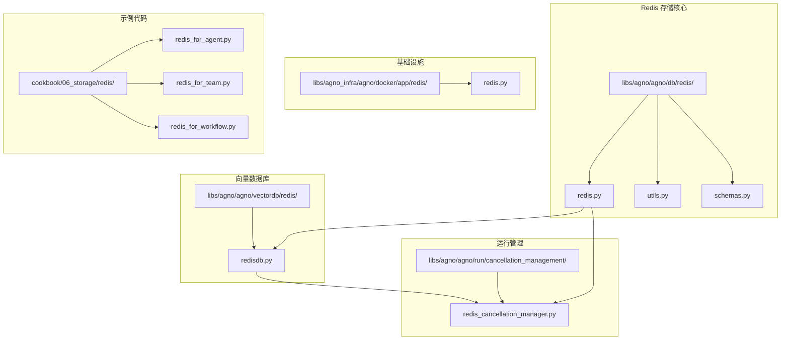
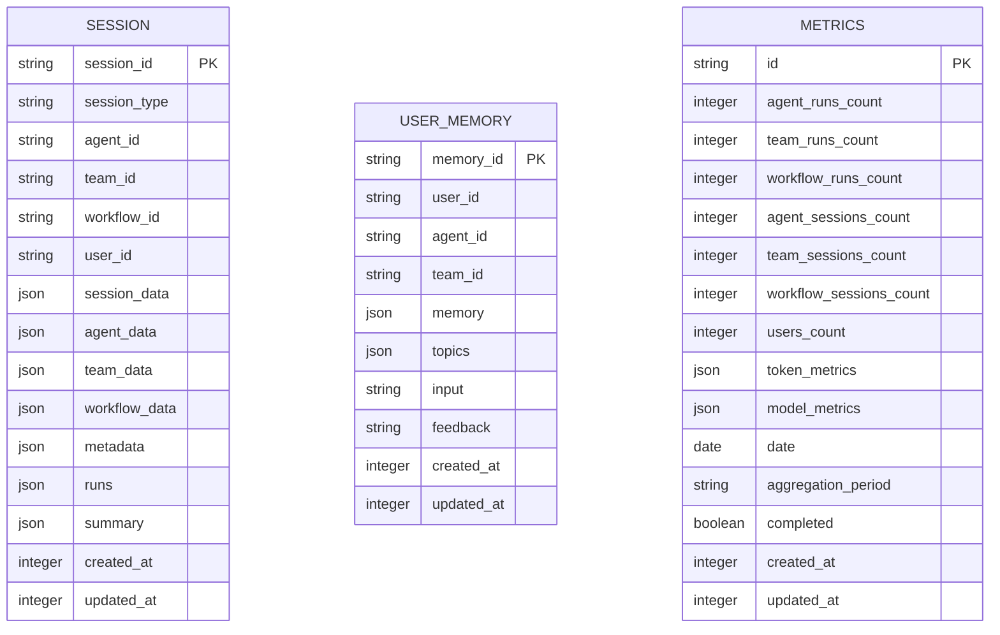
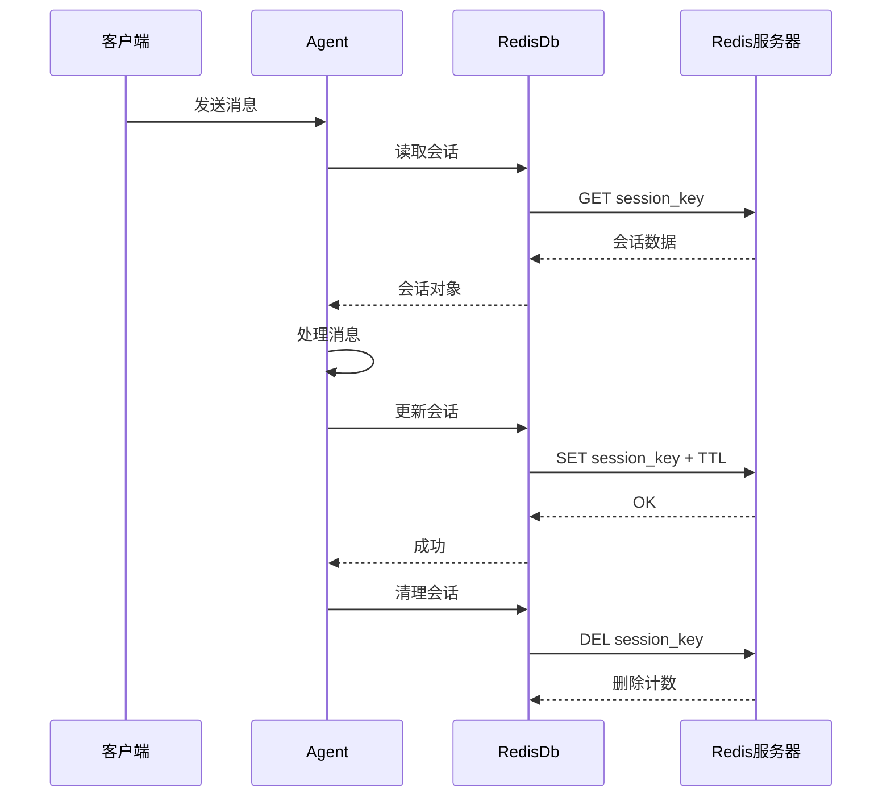
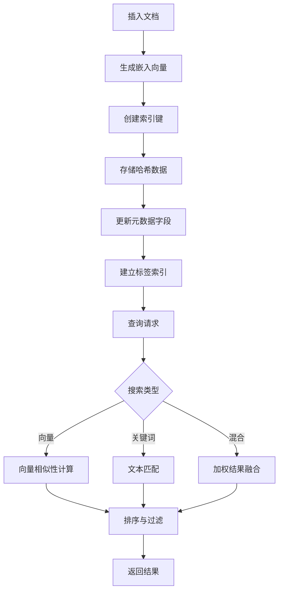
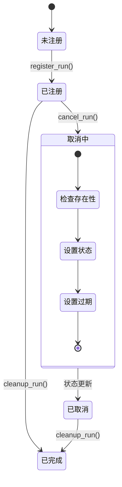
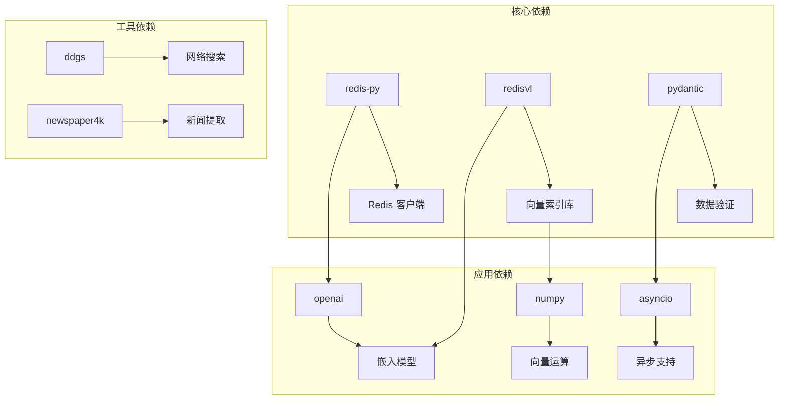
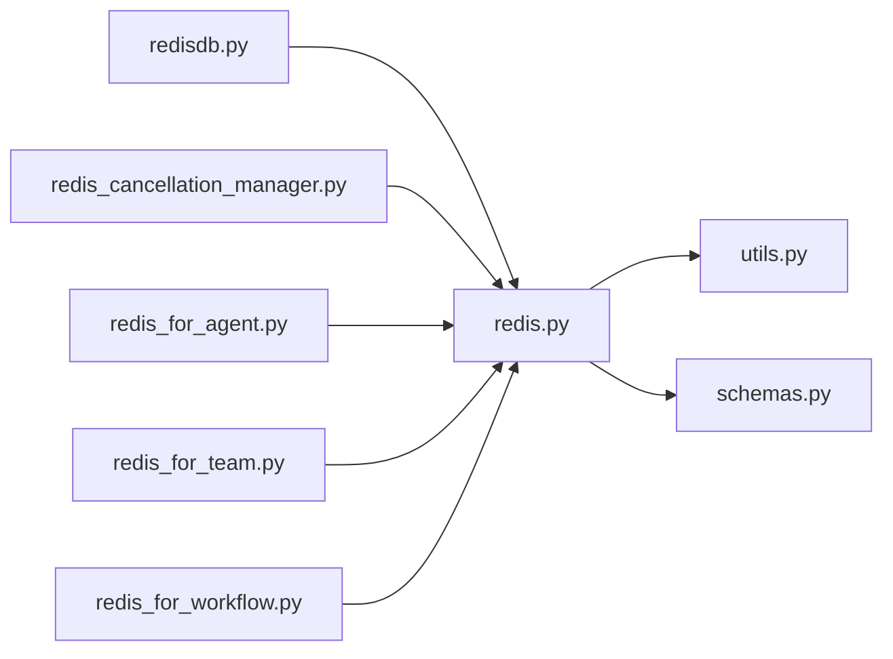

# Redis 存储实现

<cite>
**本文档引用的文件**
- [redis.py](file://libs/agno/agno/db/redis/redis.py)
- [utils.py](file://libs/agno/agno/db/redis/utils.py)
- [schemas.py](file://libs/agno/agno/db/redis/schemas.py)
- [redisdb.py](file://libs/agno/agno/vectordb/redis/redisdb.py)
- [redis_cancellation_manager.py](file://libs/agno/agno/run/cancellation_management/redis_cancellation_manager.py)
- [redis.py](file://libs/agno_infra/agno/docker/app/redis/redis.py)
- [redis_for_agent.py](file://cookbook/06_storage/redis/redis_for_agent.py)
- [redis_for_team.py](file://cookbook/06_storage/redis/redis_for_team.py)
- [redis_for_workflow.py](file://cookbook/06_storage/redis/redis_for_workflow.py)
</cite>

## 目录
1. [简介](#简介)
2. [项目结构](#项目结构)
3. [核心组件](#核心组件)
4. [架构概览](#架构概览)
5. [详细组件分析](#详细组件分析)
6. [依赖关系分析](#依赖关系分析)
7. [性能考虑](#性能考虑)
8. [故障排除指南](#故障排除指南)
9. [结论](#结论)
10. [附录](#附录)

## 简介

Agno Learn 项目中的 Redis 存储实现是一个基于高性能内存数据库的完整解决方案，专为 AI 代理系统设计。该实现提供了多种存储后端选择，包括会话存储、向量数据库、运行取消管理和知识管理等功能。

Redis 作为内存数据库的核心优势在于其超低延迟的键值存储能力和丰富的数据结构支持。在 Agno Learn 中，Redis 不仅用于传统的会话状态管理，还扩展到向量相似性搜索、分布式运行取消控制等高级功能。

## 项目结构

Agno Learn 项目中的 Redis 存储实现采用模块化设计，主要分布在以下几个核心目录中：



**图表来源**
- [redis.py:1-800](file://libs/agno/agno/db/redis/redis.py#L1-L800)
- [redisdb.py:1-200](file://libs/agno/agno/vectordb/redis/redisdb.py#L1-L200)
- [redis_cancellation_manager.py:1-100](file://libs/agno/agno/run/cancellation_management/redis_cancellation_manager.py#L1-L100)

**章节来源**
- [redis.py:1-100](file://libs/agno/agno/db/redis/redis.py#L1-L100)
- [redisdb.py:1-100](file://libs/agno/agno/vectordb/redis/redisdb.py#L1-L100)

## 核心组件

### RedisDb 主类

RedisDb 是整个存储系统的核心类，继承自 BaseDb 基类，提供了完整的数据库操作接口。该类支持多种数据表类型，包括会话、记忆、指标、评估、知识、文化知识、追踪和跨度等。

#### 主要特性

1. **多表支持**: 支持 8 种不同的数据表类型，每种都有特定的数据结构和索引策略
2. **灵活连接**: 支持通过 URL 或直接客户端实例进行连接
3. **命名空间**: 所有键都带有前缀，确保多租户隔离
4. **TTL 支持**: 可配置键的过期时间，自动清理过期数据

#### 关键配置参数

| 参数名 | 类型 | 默认值 | 描述 |
|--------|------|--------|------|
| db_prefix | str | "agno" | Redis 键前缀，用于命名空间隔离 |
| expire | Optional[int] | None | 键过期时间（秒） |
| session_table | Optional[str] | None | 会话表名称 |
| memory_table | Optional[str] | None | 记忆表名称 |
| metrics_table | Optional[str] | None | 指标表名称 |

**章节来源**
- [redis.py:40-110](file://libs/agno/agno/db/redis/redis.py#L40-L110)

### Redis 向量数据库

RedisDB 向量数据库类专门用于处理向量相似性搜索，集成了 RedisVL 库以提供高级搜索功能。

#### 支持的搜索类型

1. **向量搜索**: 基于嵌入向量的相似性搜索
2. **关键词搜索**: 基于文本内容的全文搜索
3. **混合搜索**: 结合向量和关键词搜索的优势

#### 索引配置

| 字段名 | 类型 | 描述 |
|--------|------|------|
| id | tag | 文档唯一标识符 |
| name | tag | 文档名称 |
| content | text | 文档内容 |
| embedding | vector | 嵌入向量字段 |
| content_hash | tag | 内容哈希值 |
| 元数据字段 | tag | 自定义元数据 |

**章节来源**
- [redisdb.py:26-100](file://libs/agno/agno/vectordb/redis/redisdb.py#L26-L100)

### Redis 运行取消管理器

RedisRunCancellationManager 提供了分布式运行取消功能，支持跨多个进程或服务的协调。

#### 核心功能

1. **原子操作**: 使用管道确保取消状态的一致性
2. **TTL 过期**: 自动清理过期的运行状态
3. **集群支持**: 支持 Redis 集群模式
4. **异步支持**: 提供同步和异步两种操作模式

**章节来源**
- [redis_cancellation_manager.py:32-100](file://libs/agno/agno/run/cancellation_management/redis_cancellation_manager.py#L32-L100)

## 架构概览

Agno Learn 的 Redis 存储架构采用了分层设计，确保了系统的可扩展性和维护性。

```mermaid
graph TB
subgraph "应用层"
A[Agent]
B[Team]
C[Workflow]
D[工具]
end
subgraph "存储抽象层"
E[BaseDb]
F[RedisDb]
G[RedisDB(Vector)]
H[RedisRunCancellationManager]
end
subgraph "Redis 实例"
I[会话存储]
J[向量索引]
K[取消状态]
L[配置数据]
end
subgraph "基础设施"
M[Docker Redis]
N[连接池]
O[哨兵模式]
P[集群配置]
end
A --> E
B --> E
C --> E
D --> E
E --> F
E --> G
E --> H
F --> I
G --> J
H --> K
I --> M
J --> M
K --> M
M --> N
M --> O
M --> P
```

**图表来源**
- [redis.py:1-200](file://libs/agno/agno/db/redis/redis.py#L1-L200)
- [redisdb.py:1-150](file://libs/agno/agno/vectordb/redis/redisdb.py#L1-L150)
- [redis_cancellation_manager.py:1-100](file://libs/agno/agno/run/cancellation_management/redis_cancellation_manager.py#L1-L100)

## 详细组件分析

### 会话存储系统

会话存储是 Redis 在 Agno Learn 中最重要的应用场景之一，负责保存 AI 代理的交互历史和状态信息。

#### 数据结构设计



**图表来源**
- [schemas.py:5-160](file://libs/agno/agno/db/redis/schemas.py#L5-L160)

#### 会话生命周期管理



**图表来源**
- [redis.py:342-386](file://libs/agno/agno/db/redis/redis.py#L342-L386)
- [redis.py:527-653](file://libs/agno/agno/db/redis/redis.py#L527-L653)

**章节来源**
- [redis.py:282-653](file://libs/agno/agno/db/redis/redis.py#L282-L653)

### 向量数据库实现

Redis 向量数据库提供了强大的相似性搜索能力，支持多种搜索算法和过滤条件。

#### 搜索算法对比

| 搜索类型 | 算法 | 适用场景 | 性能特征 |
|----------|------|----------|----------|
| 向量搜索 | FLAT | 精确相似性 | 高精度，中等性能 |
| 关键词搜索 | TF-IDF | 文本匹配 | 快速，中等精度 |
| 混合搜索 | 加权组合 | 综合需求 | 平衡性能与精度 |

#### 索引优化策略



**图表来源**
- [redisdb.py:276-350](file://libs/agno/agno/vectordb/redis/redisdb.py#L276-L350)

**章节来源**
- [redisdb.py:120-200](file://libs/agno/agno/vectordb/redis/redisdb.py#L120-L200)

### 分布式运行取消管理

RedisRunCancellationManager 提供了可靠的分布式运行取消机制，确保在复杂的多进程环境中能够正确协调取消操作。

#### 原子取消流程



**图表来源**
- [redis_cancellation_manager.py:134-174](file://libs/agno/agno/run/cancellation_management/redis_cancellation_manager.py#L134-L174)

**章节来源**
- [redis_cancellation_manager.py:84-174](file://libs/agno/agno/run/cancellation_management/redis_cancellation_manager.py#L84-L174)

## 依赖关系分析

### 外部依赖

Agno Learn 的 Redis 实现依赖于多个外部库，形成了完整的生态系统：



**图表来源**
- [redisdb.py:4-13](file://libs/agno/agno/vectordb/redis/redisdb.py#L4-L13)
- [redis.py:34-37](file://libs/agno/agno/db/redis/redis.py#L34-L37)

### 内部模块依赖



**图表来源**
- [redis.py:9-31](file://libs/agno/agno/db/redis/redis.py#L9-L31)
- [redisdb.py:1-25](file://libs/agno/agno/vectordb/redis/redisdb.py#L1-L25)

**章节来源**
- [redis.py:1-50](file://libs/agno/agno/db/redis/redis.py#L1-L50)

## 性能考虑

### 内存优化策略

1. **TTL 策略**: 合理设置键的过期时间，避免内存泄漏
2. **数据压缩**: 对大型 JSON 数据进行压缩存储
3. **批量操作**: 使用管道减少网络往返次数
4. **连接池**: 复用 Redis 连接，减少连接开销

### 网络优化

1. **本地连接**: 在同一主机上优先使用 Unix Socket
2. **异步操作**: 对非阻塞操作使用异步客户端
3. **批量查询**: 合并多个查询为单个命令
4. **缓存策略**: 对热点数据设置合理的缓存时间

### 持久化配置

虽然 Redis 主要用于内存存储，但可以通过以下方式实现持久化：

1. **RDB 快照**: 定期创建数据快照
2. **AOF 日志**: 记录所有写操作
3. **混合持久化**: 结合 RDB 和 AOF 的优点

**章节来源**
- [redis.py:165-181](file://libs/agno/agno/db/redis/redis.py#L165-L181)
- [redisdb.py:164-174](file://libs/agno/agno/vectordb/redis/redisdb.py#L164-L174)

## 故障排除指南

### 常见问题及解决方案

#### 连接问题

| 问题症状 | 可能原因 | 解决方案 |
|----------|----------|----------|
| 连接超时 | 网络延迟过高 | 检查网络配置，使用本地连接 |
| 认证失败 | 密码错误 | 验证密码配置，检查权限设置 |
| 连接池耗尽 | 并发过高 | 调整连接池大小，优化并发策略 |
| 集群连接失败 | 主节点故障 | 检查集群状态，配置自动故障转移 |

#### 性能问题

| 问题症状 | 可能原因 | 解决方案 |
|----------|----------|----------|
| 响应缓慢 | 键过多 | 使用命名空间隔离，定期清理过期数据 |
| 内存不足 | 缺少 TTL | 设置合理的过期时间，启用内存回收 |
| 查询慢 | 缺少索引 | 为常用查询字段建立索引 |
| 写入阻塞 | 管道使用不当 | 优化批量操作，减少网络往返 |

#### 数据一致性问题

| 问题症状 | 可能原因 | 解决方案 |
|----------|----------|----------|
| 数据丢失 | 持久化配置错误 | 配置合适的持久化策略 |
| 重复数据 | 并发写入冲突 | 使用原子操作，实现分布式锁 |
| 数据不一致 | 网络分区 | 实现重试机制，使用幂等操作 |

**章节来源**
- [redis.py:180-205](file://libs/agno/agno/db/redis/redis.py#L180-L205)
- [redis_cancellation_manager.py:106-133](file://libs/agno/agno/run/cancellation_management/redis_cancellation_manager.py#L106-L133)

### 监控和调试

#### Redis 监控指标

1. **连接状态**: 当前连接数、连接池使用率
2. **内存使用**: 已用内存、内存峰值、内存碎片率
3. **性能指标**: QPS、延迟分布、命中率
4. **持久化状态**: RDB/AOF 状态、同步延迟

#### 调试工具

1. **Redis CLI**: 基础的命令行工具
2. **RedisInsight**: 图形化监控界面
3. **日志分析**: 分析应用日志中的 Redis 操作
4. **性能剖析**: 使用性能分析工具识别瓶颈

**章节来源**
- [redis.py:1-50](file://libs/agno/agno/db/redis/redis.py#L1-L50)

## 结论

Agno Learn 项目的 Redis 存储实现展现了现代内存数据库在 AI 应用中的强大能力。通过精心设计的架构和优化策略，该实现不仅提供了高性能的存储服务，还具备了良好的可扩展性和可靠性。

### 主要优势

1. **高性能**: 内存存储确保了极低的延迟
2. **灵活性**: 支持多种数据结构和查询模式
3. **可扩展性**: 支持集群和分片部署
4. **易用性**: 提供简洁的 API 接口
5. **可靠性**: 完善的错误处理和恢复机制

### 未来发展方向

1. **智能缓存策略**: 实现更智能的缓存淘汰算法
2. **自动故障转移**: 增强集群的自动恢复能力
3. **监控增强**: 提供更详细的性能监控和告警
4. **安全加固**: 加强访问控制和数据加密
5. **成本优化**: 提供更灵活的资源管理和计费模式

## 附录

### 配置示例

#### 基础连接配置

```yaml
# 单机 Redis 配置
redis:
  host: localhost
  port: 6379
  db: 0
  password: null
  prefix: agno
  expire: 86400

# 集群 Redis 配置
redis_cluster:
  hosts:
    - host: redis-node1
      port: 6379
    - host: redis-node2  
      port: 6379
    - host: redis-node3
      port: 6379
  prefix: agno
  expire: 86400
```

#### 性能调优建议

1. **内存调优**: 根据数据量设置合理的内存限制
2. **网络调优**: 使用 Keep-Alive 和连接复用
3. **持久化调优**: 平衡数据安全和性能
4. **索引调优**: 为高频查询字段建立合适索引
5. **监控调优**: 设置合理的告警阈值和监控频率

### 最佳实践

1. **命名规范**: 使用清晰的键命名约定
2. **错误处理**: 实现完善的异常处理和重试机制
3. **资源管理**: 合理管理连接池和内存使用
4. **安全配置**: 实施适当的访问控制和数据保护
5. **备份策略**: 建立定期的数据备份和恢复流程

**章节来源**
- [redis.py:105-110](file://libs/agno/agno/db/redis/redis.py#L105-L110)
- [redisdb.py:68-74](file://libs/agno/agno/vectordb/redis/redisdb.py#L68-L74)