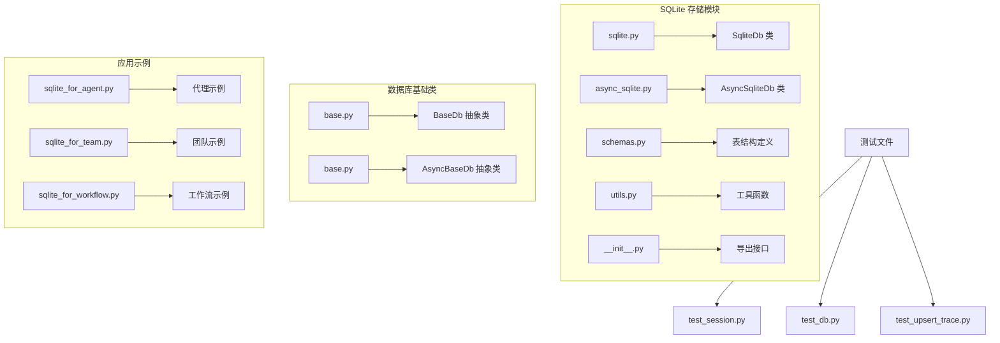
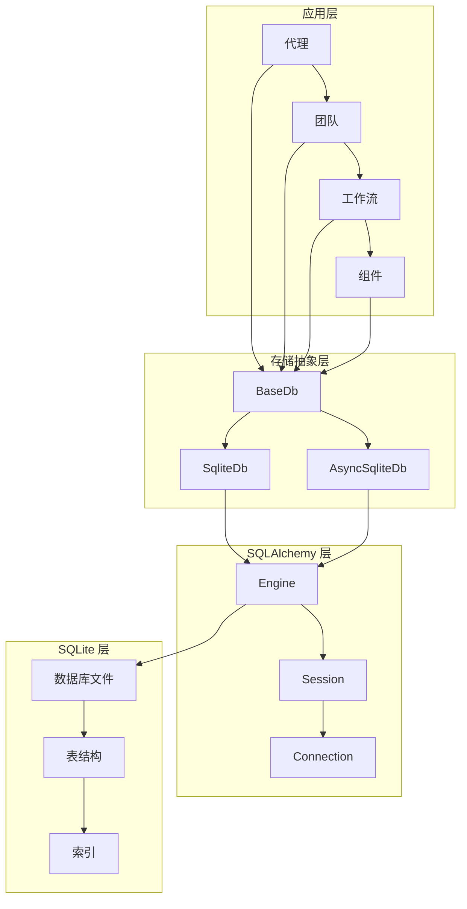
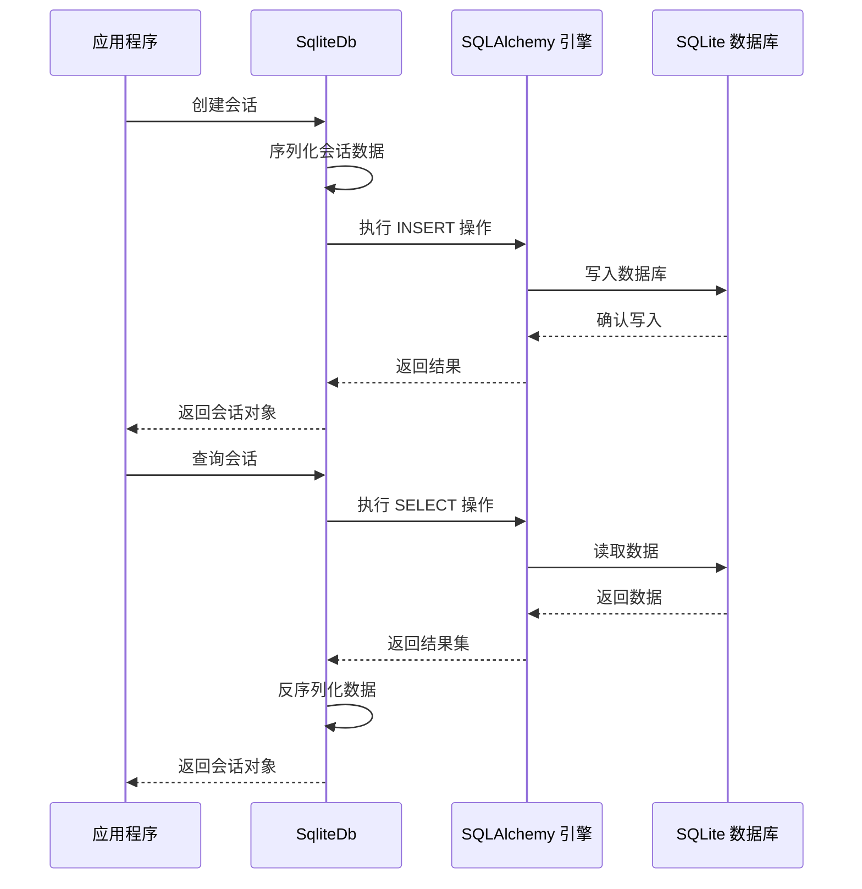
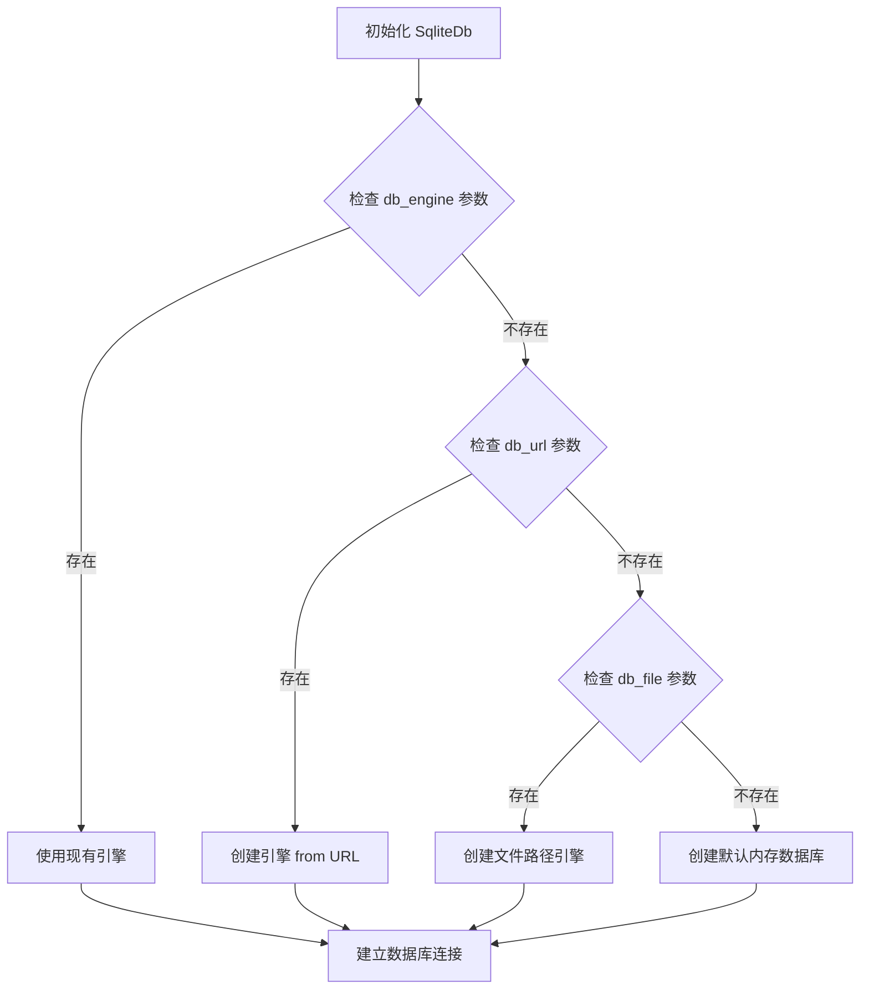
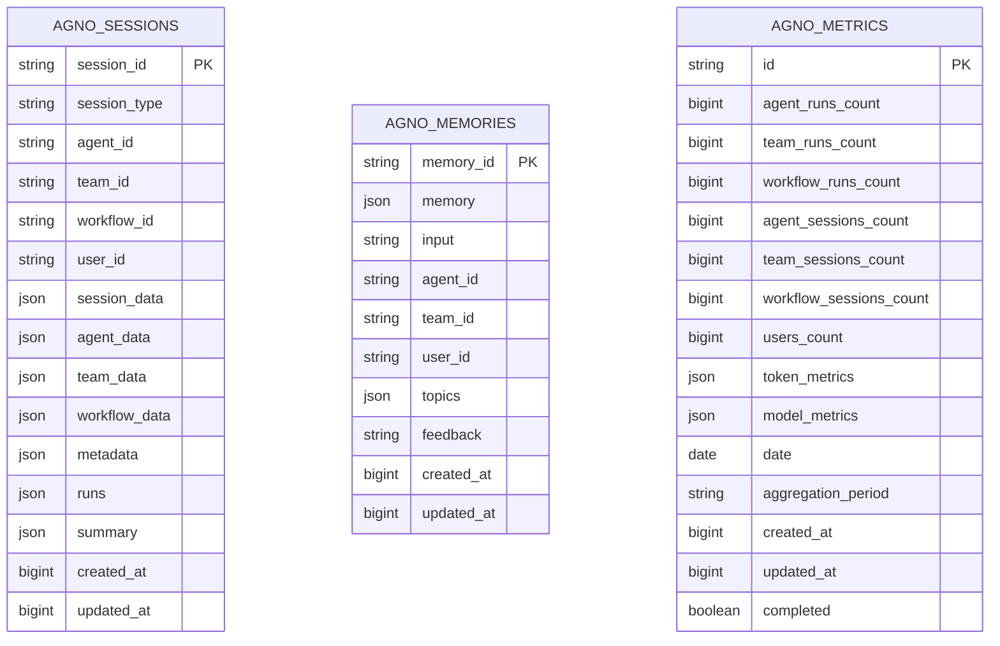
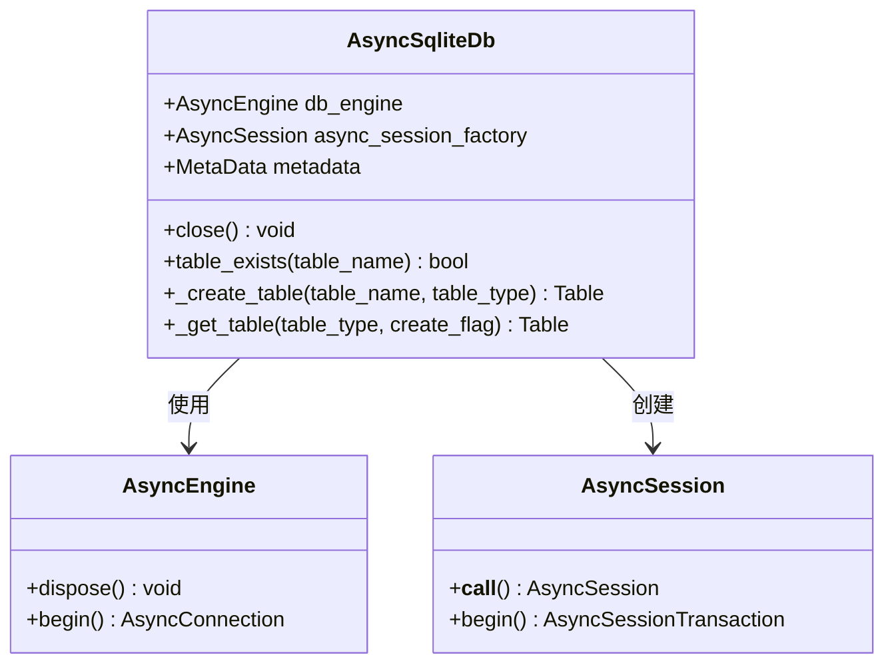
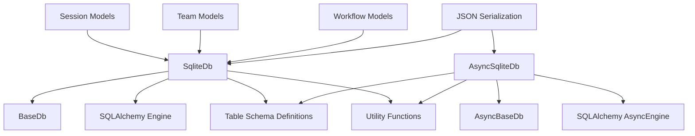

# SQLite 存储实现

<cite>
**本文档引用的文件**
- [sqlite.py](file://libs/agno/agno/db/sqlite/sqlite.py)
- [async_sqlite.py](file://libs/agno/agno/db/sqlite/async_sqlite.py)
- [schemas.py](file://libs/agno/agno/db/sqlite/schemas.py)
- [utils.py](file://libs/agno/agno/db/sqlite/utils.py)
- [__init__.py](file://libs/agno/agno/db/sqlite/__init__.py)
- [base.py](file://libs/agno/agno/db/base.py)
- [sqlite_for_agent.py](file://cookbook/06_storage/sqlite/sqlite_for_agent.py)
- [sqlite_for_team.py](file://cookbook/06_storage/sqlite/sqlite_for_team.py)
- [sqlite_for_workflow.py](file://cookbook/06_storage/sqlite/sqlite_for_workflow.py)
- [test_session.py](file://libs/agno/tests/integration/db/sqlite/test_session.py)
- [test_db.py](file://libs/agno/tests/integration/db/sqlite/test_db.py)
- [test_upsert_trace.py](file://libs/agno/tests/integration/db/sqlite/test_upsert_trace.py)
</cite>

## 目录
1. [简介](#简介)
2. [项目结构](#项目结构)
3. [核心组件](#核心组件)
4. [架构概览](#架构概览)
5. [详细组件分析](#详细组件分析)
6. [依赖关系分析](#依赖关系分析)
7. [性能考虑](#性能考虑)
8. [故障排除指南](#故障排除指南)
9. [结论](#结论)

## 简介

Agno Learn 项目中的 SQLite 存储实现是一个基于 SQLAlchemy 的本地数据库解决方案，专为代理学习系统设计。该实现提供了同步和异步两种访问模式，支持会话管理、内存存储、指标收集、评估运行、知识管理等多种功能。

SQLite 在 Agno Learn 中的主要优势包括：
- **本地化存储**：无需外部数据库服务器，适合开发和测试环境
- **零配置部署**：开箱即用，减少部署复杂度
- **数据持久性**：确保会话状态和学习数据的长期保存
- **ACID 事务**：保证数据一致性和完整性
- **跨平台兼容**：支持多种操作系统和 Python 环境

## 项目结构

Agno Learn 的 SQLite 存储实现采用模块化设计，主要包含以下核心模块：



**图表来源**
- [sqlite.py:1-100](file://libs/agno/agno/db/sqlite/sqlite.py#L1-L100)
- [async_sqlite.py:1-100](file://libs/agno/agno/db/sqlite/async_sqlite.py#L1-L100)
- [schemas.py:1-50](file://libs/agno/agno/db/sqlite/schemas.py#L1-L50)

**章节来源**
- [sqlite.py:1-200](file://libs/agno/agno/db/sqlite/sqlite.py#L1-L200)
- [async_sqlite.py:1-200](file://libs/agno/agno/db/sqlite/async_sqlite.py#L1-L200)
- [schemas.py:1-100](file://libs/agno/agno/db/sqlite/schemas.py#L1-L100)

## 核心组件

### SqliteDb 类

SqliteDb 是 SQLite 存储的核心实现，继承自 BaseDb 抽象基类。它提供了完整的数据库操作接口，包括表管理、数据 CRUD 操作、事务处理等。

**主要特性**：
- 支持多种数据库连接方式（文件路径、URL、现有引擎）
- 自动表创建和验证
- 完整的会话管理功能
- 多种数据类型的 JSON 序列化支持
- 事务安全的数据操作

### AsyncSqliteDb 类

AsyncSqliteDb 提供了异步数据库访问能力，基于 SQLAlchemy 的异步引擎实现。它完全兼容 SqliteDb 的 API，但使用异步方法进行数据库操作。

**主要特性**：
- 基于 aiosqlite 的异步连接
- 与同步版本相同的 API 接口
- 支持高并发场景下的数据库操作
- 异步事务管理

### 表结构定义

项目定义了完整的数据库表结构，涵盖会话、内存、指标、评估、知识等多个方面：

**核心表结构**：
- 会话表（sessions）：存储代理、团队、工作流的会话数据
- 内存表（memories）：用户记忆和上下文信息
- 指标表（metrics）：运行统计和性能指标
- 评估表（evals）：评估运行结果
- 知识表（knowledge）：知识库文档
- 跟踪表（traces）：分布式追踪数据
- 版本表（versions）：数据库模式版本管理

**章节来源**
- [sqlite.py:44-200](file://libs/agno/agno/db/sqlite/sqlite.py#L44-L200)
- [async_sqlite.py:45-200](file://libs/agno/agno/db/sqlite/async_sqlite.py#L45-L200)
- [schemas.py:11-343](file://libs/agno/agno/db/sqlite/schemas.py#L11-L343)

## 架构概览

Agno Learn 的 SQLite 存储架构采用了分层设计，确保了良好的可维护性和扩展性：



**图表来源**
- [base.py:30-200](file://libs/agno/agno/db/base.py#L30-L200)
- [sqlite.py:125-150](file://libs/agno/agno/db/sqlite/sqlite.py#L125-L150)
- [async_sqlite.py:117-140](file://libs/agno/agno/db/sqlite/async_sqlite.py#L117-L140)

### 数据流架构



**图表来源**
- [sqlite.py:749-800](file://libs/agno/agno/db/sqlite/sqlite.py#L749-L800)
- [async_sqlite.py:749-800](file://libs/agno/agno/db/sqlite/async_sqlite.py#L749-L800)

## 详细组件分析

### 数据库连接配置

#### 同步连接配置

SqliteDb 支持三种数据库连接方式，按优先级顺序选择：



**图表来源**
- [sqlite.py:125-140](file://libs/agno/agno/db/sqlite/sqlite.py#L125-L140)

#### 异步连接配置

AsyncSqliteDb 使用相同的连接优先级策略，但基于异步引擎：

**章节来源**
- [sqlite.py:45-140](file://libs/agno/agno/db/sqlite/sqlite.py#L45-L140)
- [async_sqlite.py:46-140](file://libs/agno/agno/db/sqlite/async_sqlite.py#L46-L140)

### 表结构设计

#### 会话表设计

会话表是存储代理交互历史的核心表，设计考虑了多类型会话的支持：



**图表来源**
- [schemas.py:11-96](file://libs/agno/agno/db/sqlite/schemas.py#L11-L96)

#### 索引策略

项目实现了智能的索引策略来优化查询性能：

**章节来源**
- [schemas.py:11-343](file://libs/agno/agno/db/sqlite/schemas.py#L11-L343)
- [sqlite.py:346-390](file://libs/agno/agno/db/sqlite/sqlite.py#L346-L390)

### 数据模型映射

#### 会话数据模型

会话数据通过 JSON 字段进行序列化存储，支持灵活的数据结构：

**章节来源**
- [sqlite.py:749-800](file://libs/agno/agno/db/sqlite/sqlite.py#L749-L800)
- [async_sqlite.py:749-800](file://libs/agno/agno/db/sqlite/async_sqlite.py#L749-L800)

### 异步操作实现

#### 连接池管理

AsyncSqliteDb 使用 SQLAlchemy 的异步连接池管理机制：



**图表来源**
- [async_sqlite.py:133-140](file://libs/agno/agno/db/sqlite/async_sqlite.py#L133-L140)

#### 并发控制策略

异步实现提供了以下并发控制机制：

**章节来源**
- [async_sqlite.py:138-149](file://libs/agno/agno/db/sqlite/async_sqlite.py#L138-L149)
- [sqlite.py:185-193](file://libs/agno/agno/db/sqlite/sqlite.py#L185-L193)

## 依赖关系分析

### 核心依赖关系



**图表来源**
- [base.py:30-200](file://libs/agno/agno/db/base.py#L30-L200)
- [sqlite.py:10-42](file://libs/agno/agno/db/sqlite/sqlite.py#L10-L42)
- [async_sqlite.py:12-43](file://libs/agno/agno/db/sqlite/async_sqlite.py#L12-L43)

### 外部依赖

项目对外部依赖的管理：

**章节来源**
- [sqlite.py:34-42](file://libs/agno/agno/db/sqlite/sqlite.py#L34-L42)
- [async_sqlite.py:36-43](file://libs/agno/agno/db/sqlite/async_sqlite.py#L36-L43)

## 性能考虑

### 索引优化策略

项目实现了多层次的索引优化策略：

#### 单列索引
- `session_type`: 支持按会话类型快速过滤
- `user_id`: 支持用户级别的数据隔离
- `created_at`: 支持时间范围查询
- `date`: 指标表的时间维度索引

#### 复合索引
- 指标表的 `(date, aggregation_period)` 复合索引
- 调度表的 `(enabled, next_run_at)` 复合索引

#### 唯一约束
- 指标表的日期聚合唯一约束
- 版本表的表名主键约束

### 查询优化技术

#### 分页查询
```python
# 限制查询结果数量
stmt = stmt.limit(limit)
# 计算偏移量
if page is not None:
    stmt = stmt.offset((page - 1) * limit)
```

#### 排序优化
```python
# 对 updated_at 使用 COALESCE 回退到 created_at
# 处理 2.0 版本前的 NULL 值
sort_column = func.coalesce(table.c.updated_at, table.c.created_at)
```

### 事务处理

#### 同步事务
- 使用 `with self.Session() as sess, sess.begin():` 确保事务边界
- 自动提交和回滚机制

#### 异步事务
- 使用 `async with self.async_session_factory() as sess, sess.begin():`
- 支持异步事务的完整生命周期管理

**章节来源**
- [utils.py:27-61](file://libs/agno/agno/db/sqlite/utils.py#L27-L61)
- [sqlite.py:595-614](file://libs/agno/agno/db/sqlite/sqlite.py#L595-L614)
- [async_sqlite.py:418-441](file://libs/agno/agno/db/sqlite/async_sqlite.py#L418-441)

## 故障排除指南

### 常见问题及解决方案

#### 数据库连接问题

**问题症状**：
- 初始化时无法连接数据库
- 连接超时或拒绝

**解决方案**：
1. 检查数据库文件路径权限
2. 验证数据库文件是否存在
3. 确认 SQLite 版本兼容性

#### 表结构不匹配

**问题症状**：
- 表已存在但列定义不正确
- 数据库迁移失败

**解决方案**：
1. 检查表的当前结构
2. 手动删除并重新创建表
3. 使用版本管理机制

#### 并发冲突

**问题症状**：
- 插入操作抛出 UNIQUE 约束错误
- 并发更新导致数据不一致

**解决方案**：
1. 使用 ON CONFLICT 子句处理重复插入
2. 实施适当的锁机制
3. 重试逻辑处理临时冲突

### 性能诊断

#### 查询性能监控

**章节来源**
- [test_upsert_trace.py:46-120](file://libs/agno/tests/integration/db/sqlite/test_upsert_trace.py#L46-L120)
- [test_db.py:110-138](file://libs/agno/tests/integration/db/sqlite/test_db.py#L110-L138)

#### 内存使用优化

**章节来源**
- [sqlite.py:185-193](file://libs/agno/agno/db/sqlite/sqlite.py#L185-L193)
- [async_sqlite.py:141-149](file://libs/agno/agno/db/sqlite/async_sqlite.py#L141-L149)

## 结论

Agno Learn 项目的 SQLite 存储实现展现了现代 Python 数据库应用的最佳实践：

### 主要优势

1. **设计优雅**：基于 SQLAlchemy 的 ORM 设计，提供了类型安全和良好的开发体验
2. **功能完整**：涵盖了从基本 CRUD 到高级特性的完整数据库功能
3. **性能优化**：实现了多层次的索引和查询优化策略
4. **并发支持**：同时支持同步和异步两种并发模式
5. **易于使用**：简洁的 API 设计，降低了数据库使用的复杂度

### 适用场景

SQLite 存储特别适用于以下场景：
- 开发和测试环境
- 小规模生产部署
- 数据量相对较小的应用
- 需要零配置部署的场景

### 扩展建议

对于需要更高性能或更大数据量的场景，建议考虑：
- 使用 PostgreSQL 或 MySQL 等关系型数据库
- 实施数据库集群和读写分离
- 添加缓存层以提高查询性能
- 考虑数据分区和归档策略

通过合理的架构设计和持续的性能优化，SQLite 存储实现能够为 Agno Learn 提供稳定可靠的数据持久化服务。