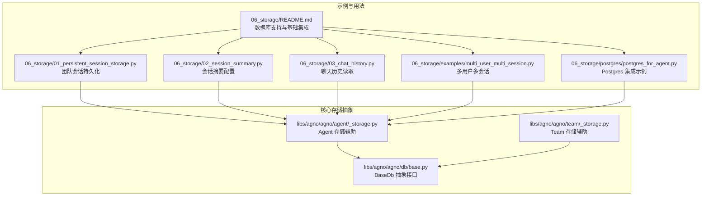
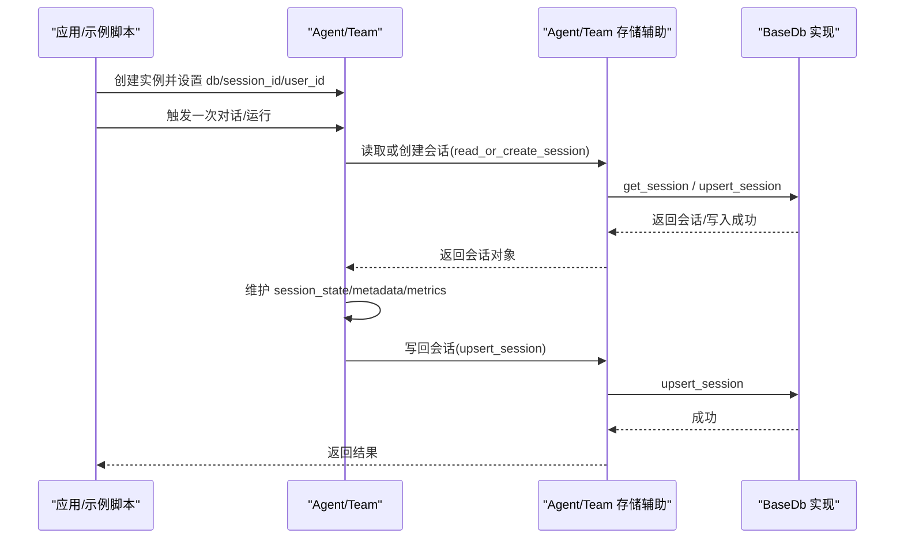
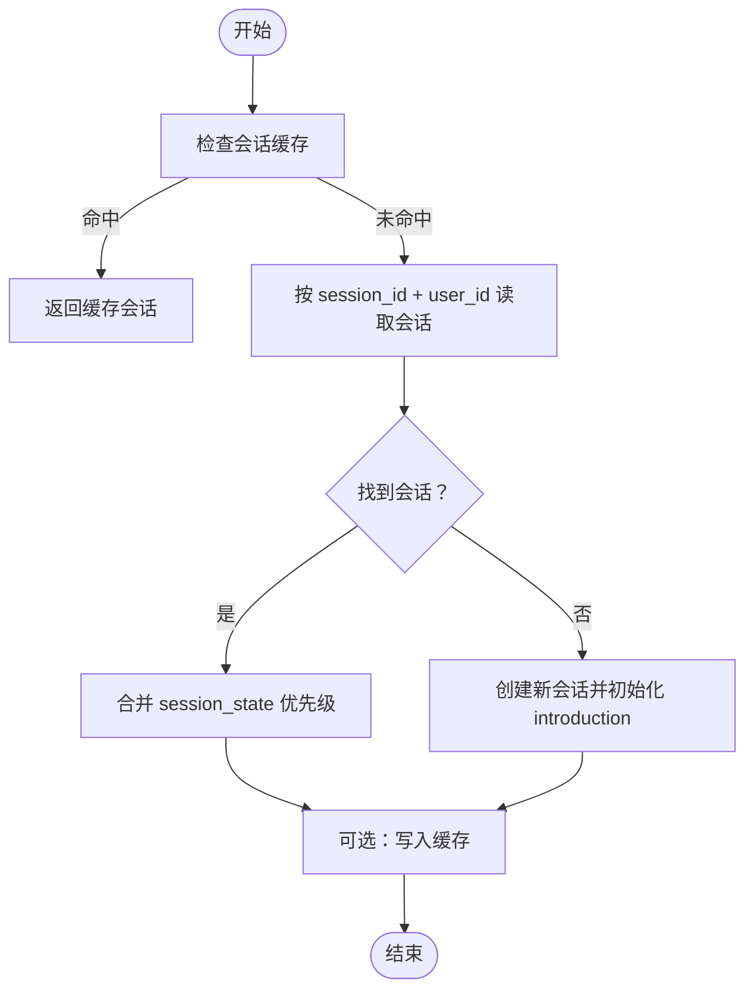
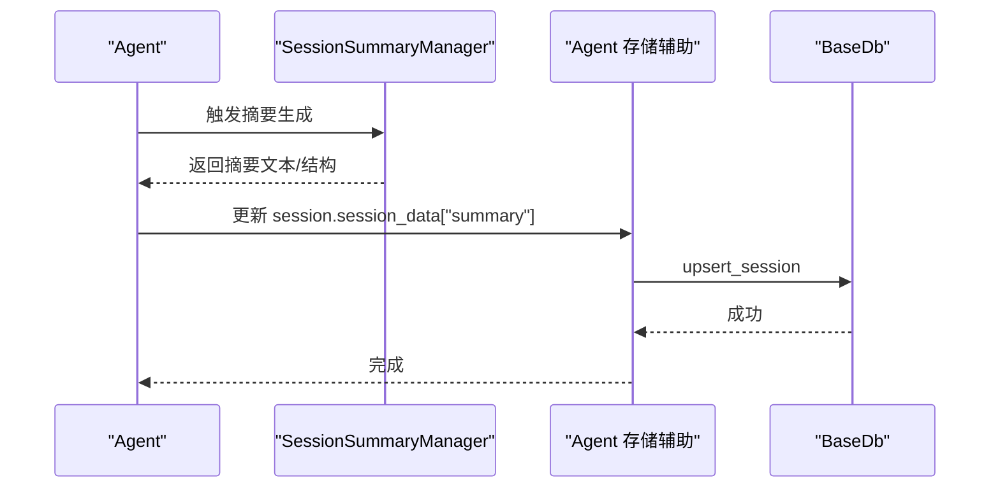
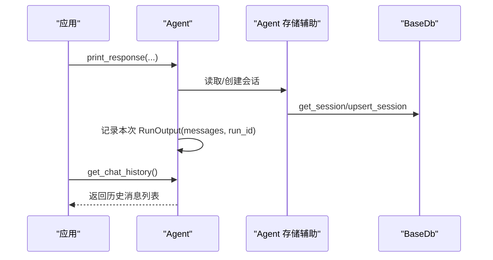
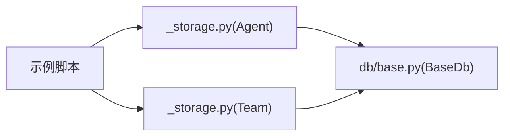

# 存储示例和最佳实践

<cite>
**本文引用的文件**
- [cookbook/06_storage/README.md](file://cookbook/06_storage/README.md)
- [cookbook/06_storage/01_persistent_session_storage.py](file://cookbook/06_storage/01_persistent_session_storage.py)
- [cookbook/06_storage/02_session_summary.py](file://cookbook/06_storage/02_session_summary.py)
- [cookbook/06_storage/03_chat_history.py](file://cookbook/06_storage/03_chat_history.py)
- [cookbook/06_storage/examples/multi_user_multi_session.py](file://cookbook/06_storage/examples/multi_user_multi_session.py)
- [cookbook/06_storage/postgres/postgres_for_agent.py](file://cookbook/06_storage/postgres/postgres_for_agent.py)
- [libs/agno/agno/db/base.py](file://libs/agno/agno/db/base.py)
- [libs/agno/agno/agent/_storage.py](file://libs/agno/agno/agent/_storage.py)
- [libs/agno/agno/team/_storage.py](file://libs/agno/agno/team/_storage.py)
</cite>

## 目录
1. [简介](#简介)
2. [项目结构](#项目结构)
3. [核心组件](#核心组件)
4. [架构总览](#架构总览)
5. [详细组件分析](#详细组件分析)
6. [依赖分析](#依赖分析)
7. [性能考虑](#性能考虑)
8. [故障排查指南](#故障排查指南)
9. [结论](#结论)
10. [附录](#附录)

## 简介
本文件面向“存储示例与最佳实践”，围绕多用户多会话存储、会话摘要生成与聊天历史管理等实际场景，系统梳理了基于多种数据库（PostgreSQL、SQLite、MongoDB、Redis 等）的持久化方案与实现要点。内容覆盖：
- 多用户多会话存储：用户隔离、会话管理与数据一致性保障
- 会话摘要生成：摘要算法与存储策略（内容提取、压缩与检索优化）
- 聊天历史存储与查询：消息格式、时间戳管理与历史检索
- 性能优化：索引策略、查询优化与缓存机制
- 监控与维护：性能指标、容量规划与故障恢复
- 迁移与升级：数据格式转换与兼容性处理
- 完整示例与部署指南

## 项目结构
本项目的存储示例主要集中在 cookbook 的 06_storage 目录中，并通过统一的数据库抽象层对接不同后端。

图表来源
- [cookbook/06_storage/README.md:1-55](file://cookbook/06_storage/README.md#L1-L55)
- [cookbook/06_storage/01_persistent_session_storage.py:1-35](file://cookbook/06_storage/01_persistent_session_storage.py#L1-L35)
- [cookbook/06_storage/02_session_summary.py:1-50](file://cookbook/06_storage/02_session_summary.py#L1-L50)
- [cookbook/06_storage/03_chat_history.py:1-38](file://cookbook/06_storage/03_chat_history.py#L1-L38)
- [cookbook/06_storage/examples/multi_user_multi_session.py:1-64](file://cookbook/06_storage/examples/multi_user_multi_session.py#L1-L64)
- [cookbook/06_storage/postgres/postgres_for_agent.py:1-30](file://cookbook/06_storage/postgres/postgres_for_agent.py#L1-L30)
- [libs/agno/agno/db/base.py:1-800](file://libs/agno/agno/db/base.py#L1-L800)
- [libs/agno/agno/agent/_storage.py:1-800](file://libs/agno/agno/agent/_storage.py#L1-L800)
- [libs/agno/agno/team/_storage.py:1-800](file://libs/agno/agno/team/_storage.py#L1-L800)

章节来源
- [cookbook/06_storage/README.md:1-55](file://cookbook/06_storage/README.md#L1-L55)

## 核心组件
- 数据库抽象层 BaseDb：定义统一的会话、记忆、指标、评估、追踪等表接口与方法，支持多数据库适配。
- Agent/Team 存储辅助：封装会话读写、状态合并、元数据更新、指标累加等逻辑，屏蔽具体数据库差异。
- 示例与工具：Postgres、SQLite、MongoDB、Redis 等数据库的使用示例，以及多用户多会话演示脚本。

章节来源
- [libs/agno/agno/db/base.py:30-210](file://libs/agno/agno/db/base.py#L30-L210)
- [libs/agno/agno/agent/_storage.py:122-403](file://libs/agno/agno/agent/_storage.py#L122-L403)
- [libs/agno/agno/team/_storage.py:162-351](file://libs/agno/agno/team/_storage.py#L162-L351)

## 架构总览
下图展示了从应用到数据库的调用链路与职责分工：

图表来源
- [libs/agno/agno/agent/_storage.py:280-403](file://libs/agno/agno/agent/_storage.py#L280-L403)
- [libs/agno/agno/team/_storage.py:224-351](file://libs/agno/agno/team/_storage.py#L224-L351)
- [libs/agno/agno/db/base.py:158-210](file://libs/agno/agno/db/base.py#L158-L210)

## 详细组件分析

### 多用户多会话存储
- 用户隔离：通过 user_id 与 session_id 双键进行隔离，确保不同用户的会话互不干扰。
- 会话管理：首次访问时自动创建会话；后续读取时按 session_id 与 user_id 恢复；支持缓存以减少重复 IO。
- 数据一致性：会话状态合并策略遵循“运行参数 > 数据库状态 > 默认值”的优先级，避免覆盖。

图表来源
- [libs/agno/agno/agent/_storage.py:280-338](file://libs/agno/agno/agent/_storage.py#L280-L338)
- [libs/agno/agno/team/_storage.py:224-284](file://libs/agno/agno/team/_storage.py#L224-L284)

章节来源
- [cookbook/06_storage/examples/multi_user_multi_session.py:1-64](file://cookbook/06_storage/examples/multi_user_multi_session.py#L1-L64)
- [libs/agno/agno/agent/_storage.py:202-226](file://libs/agno/agno/agent/_storage.py#L202-L226)
- [libs/agno/agno/team/_storage.py:354-378](file://libs/agno/agno/team/_storage.py#L354-L378)

### 会话摘要生成与存储
- 启用方式：通过 enable_session_summaries 或 session_summary_manager 配置，自动在合适时机生成摘要并写入会话数据。
- 摘要策略：建议采用“内容抽取 + 压缩 + 关键词索引”组合，提升检索效率与上下文质量。
- 存储位置：摘要通常保存在 session.session_data 中的专用字段，便于检索与上下文注入。

图表来源
- [cookbook/06_storage/02_session_summary.py:35-42](file://cookbook/06_storage/02_session_summary.py#L35-L42)
- [libs/agno/agno/agent/_storage.py:267-278](file://libs/agno/agno/agent/_storage.py#L267-L278)

章节来源
- [cookbook/06_storage/02_session_summary.py:1-50](file://cookbook/06_storage/02_session_summary.py#L1-L50)

### 聊天历史管理
- 历史读取：通过 Agent.get_chat_history 获取当前会话的历史消息列表。
- 时间戳管理：会话创建时记录 created_at；运行输出包含 run_id、messages 等，便于排序与检索。
- 历史查询：可结合 user_id、session_id、时间范围等条件进行筛选与分页。

图表来源
- [cookbook/06_storage/03_chat_history.py:32-38](file://cookbook/06_storage/03_chat_history.py#L32-L38)
- [libs/agno/agno/agent/_storage.py:122-194](file://libs/agno/agno/agent/_storage.py#L122-L194)

章节来源
- [cookbook/06_storage/03_chat_history.py:1-38](file://cookbook/06_storage/03_chat_history.py#L1-L38)

### 数据库集成与适配
- 支持数据库：PostgreSQL、SQLite、MongoDB、MySQL、Redis、SingleStore、Firestore、DynamoDB、GCS、JSON 文件等。
- 基础集成：通过构造对应 Db 实例（如 PostgresDb），传入 Agent/Team 的 db 参数即可启用持久化。
- 表结构约定：BaseDb 统一定义会话、文化知识、记忆、指标、评估、知识、追踪、跨度、版本、组件、学习计划、审批等表名与接口。

章节来源
- [cookbook/06_storage/README.md:35-48](file://cookbook/06_storage/README.md#L35-L48)
- [cookbook/06_storage/postgres/postgres_for_agent.py:12-22](file://cookbook/06_storage/postgres/postgres_for_agent.py#L12-L22)
- [libs/agno/agno/db/base.py:36-73](file://libs/agno/agno/db/base.py#L36-L73)

## 依赖分析
- 组件耦合：Agent/Team 存储辅助仅依赖 BaseDb 抽象接口，耦合度低，便于替换数据库实现。
- 直接依赖：Agent/Team 存储辅助直接调用 BaseDb 的 get_session/upsert_session 等方法。
- 间接依赖：示例脚本依赖 Agent/Team 与具体数据库实现类（如 PostgresDb）。

图表来源
- [libs/agno/agno/agent/_storage.py:122-194](file://libs/agno/agno/agent/_storage.py#L122-L194)
- [libs/agno/agno/team/_storage.py:162-221](file://libs/agno/agno/team/_storage.py#L162-L221)
- [libs/agno/agno/db/base.py:158-210](file://libs/agno/agno/db/base.py#L158-L210)

章节来源
- [libs/agno/agno/agent/_storage.py:122-194](file://libs/agno/agno/agent/_storage.py#L122-L194)
- [libs/agno/agno/team/_storage.py:162-221](file://libs/agno/agno/team/_storage.py#L162-L221)
- [libs/agno/agno/db/base.py:158-210](file://libs/agno/agno/db/base.py#L158-L210)

## 性能考虑
- 索引策略
  - 会话表：对 session_id、user_id、created_at 建立复合索引，加速读取与分页。
  - 运行输出表：对 session_id、run_id、timestamp 建立索引，支持快速检索最近 N 条。
  - 知识/记忆表：对 user_id、agent_id、topic、content 建立索引，提升检索效率。
- 查询优化
  - 分页与限制：使用 limit/page 控制返回数量，避免一次性加载过多数据。
  - 条件过滤：结合时间范围、用户/会话标识进行过滤，减少扫描。
- 缓存机制
  - 会话缓存：在 Agent/Team 存储辅助中实现短时缓存，降低重复读取开销。
  - 元数据与指标：将 session_data 中的 session_state/metrics 合理缓存，避免频繁序列化/反序列化。
- 批量写入
  - upsert_sessions/upsert_memories 等批量接口用于大规模数据导入，显著提升吞吐。

章节来源
- [libs/agno/agno/db/base.py:196-210](file://libs/agno/agno/db/base.py#L196-L210)
- [libs/agno/agno/agent/_storage.py:335-338](file://libs/agno/agno/agent/_storage.py#L335-L338)
- [libs/agno/agno/team/_storage.py:280-283](file://libs/agno/agno/team/_storage.py#L280-L283)

## 故障排查指南
- 会话读取失败
  - 现象：读取会话时报错或返回空。
  - 排查：确认 db 初始化是否正确、session_id 与 user_id 是否匹配、表是否存在。
- 会话写入失败
  - 现象：upsert_session 返回 None 或异常。
  - 排查：检查表结构版本、序列化/反序列化过程、并发写入冲突。
- 摘要生成异常
  - 现象：启用摘要后报错或上下文未生效。
  - 排查：确认 session_summary_manager 配置、模型可用性、摘要字段写入路径。
- 历史查询为空
  - 现象：get_chat_history 返回空列表。
  - 排查：确认 session_id 正确、store_history_messages 已开启、消息已写入。

章节来源
- [libs/agno/agno/agent/_storage.py:122-156](file://libs/agno/agno/agent/_storage.py#L122-L156)
- [libs/agno/agno/team/_storage.py:162-193](file://libs/agno/agno/team/_storage.py#L162-L193)

## 结论
通过统一的数据库抽象层与完善的 Agent/Team 存储辅助，系统实现了跨数据库的多用户多会话存储、会话摘要生成与聊天历史管理。配合合理的索引、查询与缓存策略，可在生产环境中获得稳定且高性能的存储体验。建议在上线前完成容量规划、监控指标设计与故障演练，确保系统可运维与可扩展。

## 附录

### 部署与示例清单
- 安装依赖（以 PostgreSQL 为例）
  - 使用包管理器安装数据库驱动与相关依赖。
- 基础集成步骤
  - 构造数据库实例并传入 Agent/Team 的 db 参数。
  - 设置 session_id 与 user_id，启用 add_history_to_context 等选项。
- 示例参考
  - 团队会话持久化：[01_persistent_session_storage.py:1-35](file://cookbook/06_storage/01_persistent_session_storage.py#L1-L35)
  - 会话摘要：[02_session_summary.py:1-50](file://cookbook/06_storage/02_session_summary.py#L1-L50)
  - 聊天历史：[03_chat_history.py:1-38](file://cookbook/06_storage/03_chat_history.py#L1-L38)
  - 多用户多会话：[multi_user_multi_session.py:1-64](file://cookbook/06_storage/examples/multi_user_multi_session.py#L1-L64)
  - Postgres 集成：[postgres_for_agent.py:1-30](file://cookbook/06_storage/postgres/postgres_for_agent.py#L1-L30)

章节来源
- [cookbook/06_storage/README.md:5-17](file://cookbook/06_storage/README.md#L5-L17)
- [cookbook/06_storage/README.md:21-33](file://cookbook/06_storage/README.md#L21-L33)
- [cookbook/06_storage/01_persistent_session_storage.py:16-28](file://cookbook/06_storage/01_persistent_session_storage.py#L16-L28)
- [cookbook/06_storage/02_session_summary.py:36-42](file://cookbook/06_storage/02_session_summary.py#L36-L42)
- [cookbook/06_storage/03_chat_history.py:21-27](file://cookbook/06_storage/03_chat_history.py#L21-L27)
- [cookbook/06_storage/examples/multi_user_multi_session.py:24-30](file://cookbook/06_storage/examples/multi_user_multi_session.py#L24-L30)
- [cookbook/06_storage/postgres/postgres_for_agent.py:12-22](file://cookbook/06_storage/postgres/postgres_for_agent.py#L12-L22)