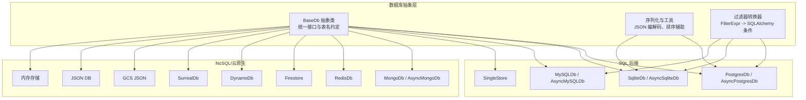
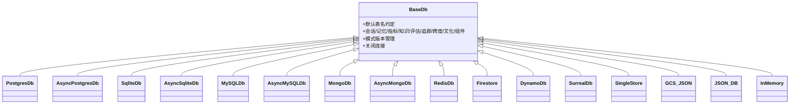
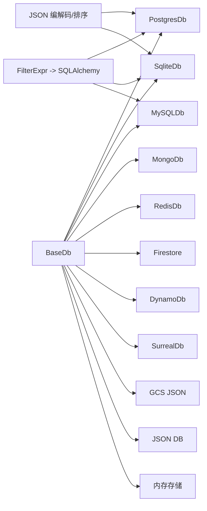

# 数据库实现

<cite>
**本文引用的文件**
- [libs/agno/agno/db/base.py](file://libs/agno/agno/db/base.py)
- [libs/agno/agno/db/__init__.py](file://libs/agno/agno/db/__init__.py)
- [libs/agno/agno/db/utils.py](file://libs/agno/agno/db/utils.py)
- [libs/agno/agno/db/filter_converter.py](file://libs/agno/agno/db/filter_converter.py)
- [libs/agno/agno/db/postgres/__init__.py](file://libs/agno/agno/db/postgres/__init__.py)
- [libs/agno/agno/db/sqlite/__init__.py](file://libs/agno/agno/db/sqlite/__init__.py)
- [libs/agno/agno/db/mongo/__init__.py](file://libs/agno/agno/db/mongo/__init__.py)
- [libs/agno/agno/db/redis/__init__.py](file://libs/agno/agno/db/redis/__init__.py)
- [libs/agno/agno/db/mysql/__init__.py](file://libs/agno/agno/db/mysql/__init__.py)
- [libs/agno/migrations/README.md](file://libs/agno/migrations/README.md)
- [libs/agno/migrations/migrate_sqlite.py](file://libs/agno/migrations/migrate_sqlite.py)
- [libs/agno/migrations/migrate_postgres.py](file://libs/agno/migrations/migrate_postgres.py)
- [libs/agno/migrations/migrate_singlestore.py](file://libs/agno/migrations/migrate_singlestore.py)
- [libs/agno/migrations/migrate_mysql.py](file://libs/agno/migrations/migrate_mysql.py)
- [cookbook/06_storage/redis/redis_storage_example.py](file://cookbook/06_storage/redis/redis_storage_example.py)
- [cookbook/06_storage/json_db/json_db_example.py](file://cookbook/06_storage/json_db/json_db_example.py)
- [cookbook/06_storage/in_memory/in_memory_storage_example.py](file://cookbook/06_storage/in_memory/in_memory_storage_example.py)
- [cookbook/06_storage/firestore/firestore_storage_example.py](file://cookbook/06_storage/firestore/firestore_storage_example.py)
- [cookbook/06_storage/dynamodb/dynamodb_storage_example.py](file://cookbook/06_storage/dynamodb/dynamodb_storage_example.py)
- [cookbook/06_storage/gcs/gcs_storage_example.py](file://cookbook/06_storage/gcs/gcs_storage_example.py)
- [cookbook/06_storage/mongo/mongodb_storage_example.py](file://cookbook/06_storage/mongo/mongodb_storage_example.py)
- [cookbook/06_storage/postgres/postgres_storage_example.py](file://cookbook/06_storage/postgres/postgres_storage_example.py)
- [cookbook/06_storage/surrealdb/surrealdb_storage_example.py](file://cookbook/06_storage/surrealdb/surrealdb_storage_example.py)
- [cookbook/06_storage/singlestore/singlestore_storage_example.py](file://cookbook/06_storage/singlestore/singlestore_storage_example.py)
- [cookbook/06_storage/mysql/mysql_storage_example.py](file://cookbook/06_storage/mysql/mysql_storage_example.py)
</cite>

## 目录
1. [简介](#简介)
2. [项目结构](#项目结构)
3. [核心组件](#核心组件)
4. [架构总览](#架构总览)
5. [详细组件分析](#详细组件分析)
6. [依赖分析](#依赖分析)
7. [性能考量](#性能考量)
8. [故障排除指南](#故障排除指南)
9. [结论](#结论)
10. [附录](#附录)

## 简介
本文件系统化梳理 Agno Learn 的多数据库实现，覆盖 SQLite、PostgreSQL、MongoDB、Redis、MySQL、Firestore、DynamoDB、SurrealDB、SingleStore、GCS、JSON DB、内存存储等后端。内容包括：各数据库的特性与适用场景、配置与连接要点（含连接串、认证、超时）、数据模型映射与 ORM 配置、异步操作与连接池管理、迁移与版本升级、备份与灾难恢复策略、选型决策与最佳实践、以及故障排除与性能调优建议。

## 项目结构
Agno 的数据库抽象以统一接口定义，具体后端通过模块化实现接入，支持同步与异步两种模式，并提供过滤器转换器与序列化工具，便于在不同数据库间复用通用逻辑。

图表来源
- [libs/agno/agno/db/base.py:30-800](file://libs/agno/agno/db/base.py#L30-L800)
- [libs/agno/agno/db/utils.py:166-196](file://libs/agno/agno/db/utils.py#L166-L196)
- [libs/agno/agno/db/filter_converter.py:47-145](file://libs/agno/agno/db/filter_converter.py#L47-L145)
- [libs/agno/agno/db/postgres/__init__.py:1-5](file://libs/agno/agno/db/postgres/__init__.py#L1-L5)
- [libs/agno/agno/db/sqlite/__init__.py:1-5](file://libs/agno/agno/db/sqlite/__init__.py#L1-L5)
- [libs/agno/agno/db/mongo/__init__.py:1-18](file://libs/agno/agno/db/mongo/__init__.py#L1-L18)
- [libs/agno/agno/db/redis/__init__.py:1-4](file://libs/agno/agno/db/redis/__init__.py#L1-L4)
- [libs/agno/agno/db/mysql/__init__.py:1-5](file://libs/agno/agno/db/mysql/__init__.py#L1-L5)

章节来源
- [libs/agno/agno/db/base.py:30-800](file://libs/agno/agno/db/base.py#L30-L800)
- [libs/agno/agno/db/utils.py:1-196](file://libs/agno/agno/db/utils.py#L1-L196)
- [libs/agno/agno/db/filter_converter.py:1-145](file://libs/agno/agno/db/filter_converter.py#L1-L145)

## 核心组件
- 统一抽象接口：定义会话、记忆、指标、知识、评估、追踪/跨度、文化知识、组件与配置等全量 CRUD 与查询能力，确保不同后端行为一致。
- 表命名约定：通过构造函数注入表名，避免硬编码，便于多租户与隔离部署。
- 序列化工具：处理日期时间、UUID、消息对象、指标对象等非标准 JSON 类型，保证跨后端持久化一致性。
- 过滤器转换器：将 FilterExpr 转换为 SQLAlchemy WHERE 条件，支持 AND/OR/NOT、比较与模糊匹配等，限制递归深度防止攻击。
- 懒加载后端：按需导入具体数据库实现，减少启动时依赖开销。

章节来源
- [libs/agno/agno/db/base.py:30-800](file://libs/agno/agno/db/base.py#L30-L800)
- [libs/agno/agno/db/utils.py:16-101](file://libs/agno/agno/db/utils.py#L16-L101)
- [libs/agno/agno/db/filter_converter.py:47-145](file://libs/agno/agno/db/filter_converter.py#L47-L145)
- [libs/agno/agno/db/__init__.py:9-24](file://libs/agno/agno/db/__init__.py#L9-L24)

## 架构总览
下图展示数据库抽象与各后端的关系，以及过滤器转换与序列化在 SQL 后端中的应用。

图表来源
- [libs/agno/agno/db/base.py:30-800](file://libs/agno/agno/db/base.py#L30-L800)
- [libs/agno/agno/db/postgres/__init__.py:1-5](file://libs/agno/agno/db/postgres/__init__.py#L1-L5)
- [libs/agno/agno/db/sqlite/__init__.py:1-5](file://libs/agno/agno/db/sqlite/__init__.py#L1-L5)
- [libs/agno/agno/db/mongo/__init__.py:1-18](file://libs/agno/agno/db/mongo/__init__.py#L1-L18)
- [libs/agno/agno/db/redis/__init__.py:1-4](file://libs/agno/agno/db/redis/__init__.py#L1-L4)
- [libs/agno/agno/db/mysql/__init__.py:1-5](file://libs/agno/agno/db/mysql/__init__.py#L1-L5)

## 详细组件分析

### 统一数据库接口（BaseDb）
- 职责：定义所有数据库操作契约，包含表名注入、模式版本管理、会话与记忆 CRUD、分页与排序、追踪/跨度、文化知识、组件与配置等。
- 特性：支持批量 upsert 提升大体量写入性能；提供关闭连接钩子用于资源释放。
- 复杂度：接口方法众多，但职责清晰，便于按需实现与测试替身。

章节来源
- [libs/agno/agno/db/base.py:30-800](file://libs/agno/agno/db/base.py#L30-L800)

### 序列化与 JSON 工具（utils）
- 自定义 JSON 编码器：支持 UUID、date/datetime、Message、各类 Metrics 对象与类型对象转字符串。
- 会话字段序列化/反序列化：对 session_data、agent_data、team_data、workflow_data、metadata、chat_history、summary、runs 等字段进行安全编解码。
- 通用重建：根据字典重建数据库实例（当前支持 postgres 与 sqlite）。

章节来源
- [libs/agno/agno/db/utils.py:37-196](file://libs/agno/agno/db/utils.py#L37-L196)

### 过滤器表达式转换器（filter_converter）
- 将 FilterExpr 字典转换为 SQLAlchemy WHERE 条件，支持 EQ/NEQ/GT/GTE/LT/LTE/CONTAINS/STARTSWITH/IN 与 AND/OR/NOT 组合。
- 列名校验与最大递归深度限制，防止注入与栈溢出。
- 当前支持 SQLAlchemy 后端（SQLite、PostgreSQL、MySQL、SingleStore）。

章节来源
- [libs/agno/agno/db/filter_converter.py:47-145](file://libs/agno/agno/db/filter_converter.py#L47-L145)

### SQL 后端（PostgreSQL、SQLite、MySQL、SingleStore）
- 共同点：均通过 SQLAlchemy 驱动访问，使用过滤器转换器生成 WHERE 条件；利用自定义 JSON 编解码处理复杂字段。
- 异步支持：Postgres、SQLite、MySQL 均提供 Async* 实现，适合高并发与长连接场景。
- 连接与超时：建议在驱动层或连接池层设置 connect_timeout、command_timeout、pool_recycle 等参数，结合业务峰值合理配置。
- 索引策略：对常用过滤字段（如 user_id、agent_id、team_id、session_id、status、created_at）建立复合索引；对文本搜索使用 LIKE 或全文索引（PG 可用 gin/gist）。
- 查询优化：优先使用带索引的过滤条件；分页使用基于游标或基于 LIMIT/OFFSET 的方案；避免 SELECT *，仅取必要字段。

章节来源
- [libs/agno/agno/db/postgres/__init__.py:1-5](file://libs/agno/agno/db/postgres/__init__.py#L1-L5)
- [libs/agno/agno/db/sqlite/__init__.py:1-5](file://libs/agno/agno/db/sqlite/__init__.py#L1-L5)
- [libs/agno/agno/db/mysql/__init__.py:1-5](file://libs/agno/agno/db/mysql/__init__.py#L1-L5)
- [libs/agno/agno/db/filter_converter.py:47-145](file://libs/agno/agno/db/filter_converter.py#L47-L145)
- [libs/agno/agno/db/utils.py:55-101](file://libs/agno/agno/db/utils.py#L55-L101)

### MongoDB
- 支持同步与异步实现；通过懒加载导入异步版本，避免不必要的依赖。
- 适配：将 FilterExpr 转换为 MongoDB 查询语句（$eq/$ne/$gt/$gte/$lt/$lte/$regex/$in/$and/$or/$not），注意大小写不敏感与正则转义。
- 连接与认证：支持用户名密码、IAM、SCRAM 等认证方式；建议启用 TLS；设置连接池大小与超时。
- 索引与查询：对高频过滤字段建立索引；文本搜索使用 $text 索引或聚合管道；分页使用游标或偏移。

章节来源
- [libs/agno/agno/db/mongo/__init__.py:1-18](file://libs/agno/agno/db/mongo/__init__.py#L1-L18)

### Redis
- 适配：键空间采用统一命名规范，支持字符串、哈希、列表、集合等结构存储会话与记忆片段。
- 连接与超时：设置连接超时、命令超时、重连策略；生产环境建议使用哨兵/集群模式。
- 并发控制：使用单线程模型与 Lua 脚本保证原子性；对批量写入使用 pipeline。

章节来源
- [libs/agno/agno/db/redis/__init__.py:1-4](file://libs/agno/agno/db/redis/__init__.py#L1-L4)

### Firestore/DynamoDB/SurrealDB/GCS/JSON DB/内存存储
- Firestore：文档型存储，适合灵活 schema；注意事务与批处理限制；合理设计文档层级与索引。
- DynamoDB：宽表模型，适合高吞吐低延迟；设计好分区键与排序键；开启自动扩展与压缩。
- SurrealDB：混合模型（文档+图形），支持 SQL/DSL；注意版本兼容与迁移策略。
- GCS（JSON 存储）：对象存储 + JSON 文档；适合日志与审计数据归档；注意访问权限与生命周期策略。
- JSON DB：轻量级文件存储，适合开发与小规模部署；注意并发写入与崩溃恢复。
- 内存存储：纯内存，适合测试与临时会话；重启即丢失，不可用于生产持久化。

章节来源
- [cookbook/06_storage/firestore/firestore_storage_example.py](file://cookbook/06_storage/firestore/firestore_storage_example.py)
- [cookbook/06_storage/dynamodb/dynamodb_storage_example.py](file://cookbook/06_storage/dynamodb/dynamodb_storage_example.py)
- [cookbook/06_storage/gcs/gcs_storage_example.py](file://cookbook/06_storage/gcs/gcs_storage_example.py)
- [cookbook/06_storage/json_db/json_db_example.py](file://cookbook/06_storage/json_db/json_db_example.py)
- [cookbook/06_storage/in_memory/in_memory_storage_example.py](file://cookbook/06_storage/in_memory/in_memory_storage_example.py)
- [cookbook/06_storage/surrealdb/surrealdb_storage_example.py](file://cookbook/06_storage/surrealdb/surrealdb_storage_example.py)

### 异步数据库操作与连接池
- 异步实现：Postgres、SQLite、MySQL、Mongo 均提供 Async* 版本，推荐在高并发服务中使用。
- 连接池：设置最小/最大连接数、空闲回收时间、超时与重试；监控连接池利用率与等待队列长度。
- 并发控制：避免阻塞操作；使用上下文管理器确保连接释放；对批量写入使用事务或批处理。

章节来源
- [libs/agno/agno/db/postgres/__init__.py:1-5](file://libs/agno/agno/db/postgres/__init__.py#L1-L5)
- [libs/agno/agno/db/sqlite/__init__.py:1-5](file://libs/agno/agno/db/sqlite/__init__.py#L1-L5)
- [libs/agno/agno/db/mysql/__init__.py:1-5](file://libs/agno/agno/db/mysql/__init__.py#L1-L5)
- [libs/agno/agno/db/mongo/__init__.py:1-18](file://libs/agno/agno/db/mongo/__init__.py#L1-L18)

### 数据模型映射与 ORM 配置
- 表结构设计：遵循 BaseDb 的表名约定；为每个实体定义主键、时间戳、索引与约束。
- 字段类型：日期时间统一为 UTC；JSON 字段使用自定义编码器；枚举与状态字段使用受限集合。
- 查询优化：使用过滤器转换器生成 WHERE 条件；对高频查询建立复合索引；避免 N+1 查询。

章节来源
- [libs/agno/agno/db/base.py:56-72](file://libs/agno/agno/db/base.py#L56-L72)
- [libs/agno/agno/db/filter_converter.py:47-145](file://libs/agno/agno/db/filter_converter.py#L47-L145)
- [libs/agno/agno/db/utils.py:37-101](file://libs/agno/agno/db/utils.py#L37-L101)

### 数据库迁移与版本升级
- v1 到 v2：提供脚本迁移“Storage/内存”与“向量库”，保持幂等，不清理旧表。
- 迁移管理器：支持 up()/down() 到指定版本，强制升级与查看当前版本。
- 后端迁移脚本：针对 SQLite、PostgreSQL、SingleStore、MySQL 提供独立迁移脚本，建议在维护窗口执行。

章节来源
- [libs/agno/migrations/README.md:1-60](file://libs/agno/migrations/README.md#L1-L60)
- [libs/agno/migrations/migrate_sqlite.py](file://libs/agno/migrations/migrate_sqlite.py)
- [libs/agno/migrations/migrate_postgres.py](file://libs/agno/migrations/migrate_postgres.py)
- [libs/agno/migrations/migrate_singlestore.py](file://libs/agno/migrations/migrate_singlestore.py)
- [libs/agno/migrations/migrate_mysql.py](file://libs/agno/migrations/migrate_mysql.py)

### 备份、恢复与灾难恢复
- 备份策略：定期导出关键表（会话、记忆、追踪、跨度、组件与配置）；对 SQL 后端可使用逻辑备份；对 NoSQL 后端使用快照或导出工具。
- 恢复流程：验证备份完整性；在隔离环境预演恢复；灰度切换到新数据库；回滚路径准备。
- DR 策略：跨可用区/区域复制；自动化故障转移；RPO/RTO 指标明确；演练与监控告警。

[本节为通用指导，无需特定文件引用]

### 数据库选择决策因素与最佳实践
- 选择因素：数据一致性需求、读写比例、扩展性要求、运维能力、成本与许可。
- 最佳实践：先在开发环境验证；对生产采用最小权限与加密；建立变更评审与回滚机制；持续监控与容量规划。

[本节为通用指导，无需特定文件引用]

## 依赖分析
- 模块耦合：BaseDb 作为中心抽象，SQL 后端依赖 SQLAlchemy 与过滤器转换器；NoSQL 后端各自独立实现。
- 外部依赖：SQL 后端依赖 SQLAlchemy；Mongo 后端依赖 PyMongo；Redis 后端依赖 redis 客户端；云服务后端依赖对应 SDK。
- 循环依赖：未见循环导入；懒加载避免了初始化时的强耦合。

图表来源
- [libs/agno/agno/db/base.py:30-800](file://libs/agno/agno/db/base.py#L30-L800)
- [libs/agno/agno/db/filter_converter.py:47-145](file://libs/agno/agno/db/filter_converter.py#L47-L145)
- [libs/agno/agno/db/utils.py:16-101](file://libs/agno/agno/db/utils.py#L16-L101)

章节来源
- [libs/agno/agno/db/base.py:30-800](file://libs/agno/agno/db/base.py#L30-L800)
- [libs/agno/agno/db/filter_converter.py:47-145](file://libs/agno/agno/db/filter_converter.py#L47-L145)
- [libs/agno/agno/db/utils.py:16-101](file://libs/agno/agno/db/utils.py#L16-L101)

## 性能考量
- 连接池：根据 QPS 与并发连接数设置池大小；启用空闲回收与健康检查。
- 索引：为过滤与排序字段建立复合索引；避免过多索引影响写入性能。
- 批处理：批量 upsert、批量写入 pipeline；减少网络往返。
- 异步：高并发场景使用异步客户端；避免阻塞事件循环。
- 监控：记录慢查询、连接池等待、错误率与资源使用；设置阈值告警。

[本节为通用指导，无需特定文件引用]

## 故障排除指南
- 连接失败：检查连接串、认证凭据、网络连通性与超时设置；确认防火墙与安全组放行。
- 查询缓慢：核对 WHERE 条件是否命中索引；避免全表扫描；拆分复杂过滤表达式。
- JSON 解析错误：确认字段已正确序列化；检查自定义编码器是否覆盖所需类型。
- 迁移异常：使用迁移管理器强制升级；核对版本表状态；必要时手动修复版本号。
- 异常堆栈：定位到具体后端实现与调用链；结合日志级别与追踪 ID 排查。

章节来源
- [libs/agno/agno/db/utils.py:103-163](file://libs/agno/agno/db/utils.py#L103-L163)
- [libs/agno/migrations/README.md:20-60](file://libs/agno/migrations/README.md#L20-L60)

## 结论
Agno 的数据库层通过统一抽象与工具集实现了多后端的一致体验，SQL 与 NoSQL 后端分别满足关系型与灵活 schema 场景。配合过滤器转换器、JSON 编解码与迁移管理，可在不同规模与预算下灵活选型。建议在生产中结合监控与容量规划，制定完善的备份与灾难恢复策略，并通过异步与连接池提升性能与稳定性。

[本节为总结，无需特定文件引用]

## 附录
- 配置示例与连接参数：参考各后端示例脚本与 README 中的迁移说明，结合实际环境调整连接串、认证与超时。
- 选型建议：根据一致性、扩展性、运维与成本综合评估；小规模优先内存/JSON/SQLite；中大型优先 PostgreSQL/MySQL；高并发/低延迟可考虑异步 SQL 或 Redis；文档型场景可选 MongoDB/Firestore；云原生可选 DynamoDB/SurrealDB/GCS。

[本节为通用指导，无需特定文件引用]