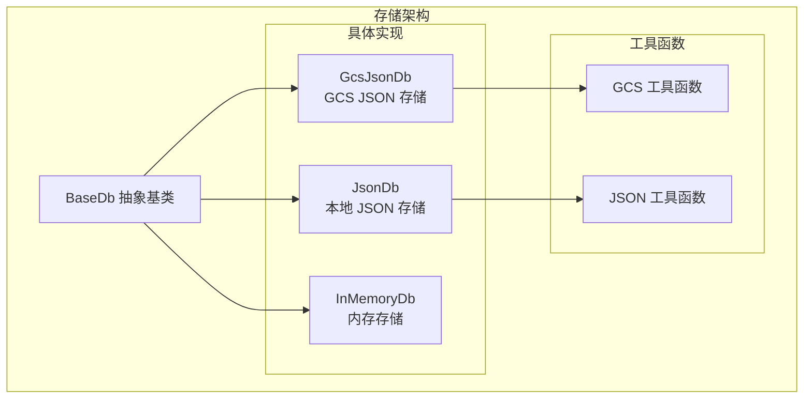
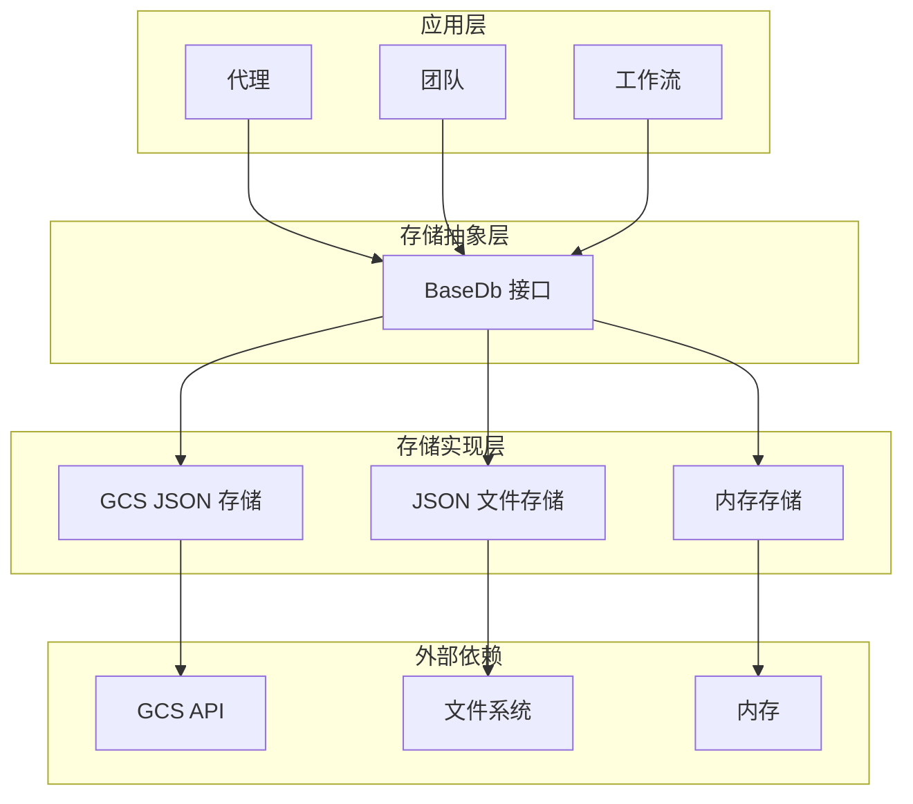
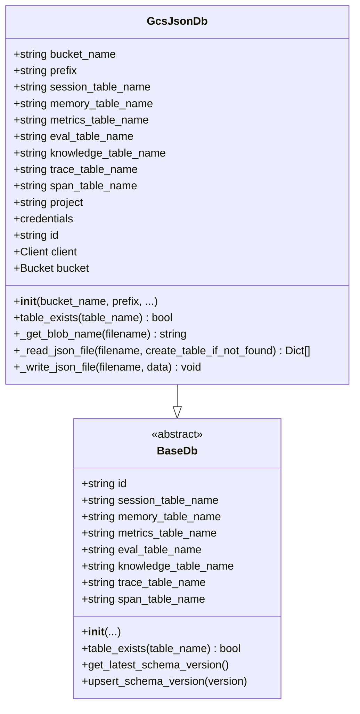
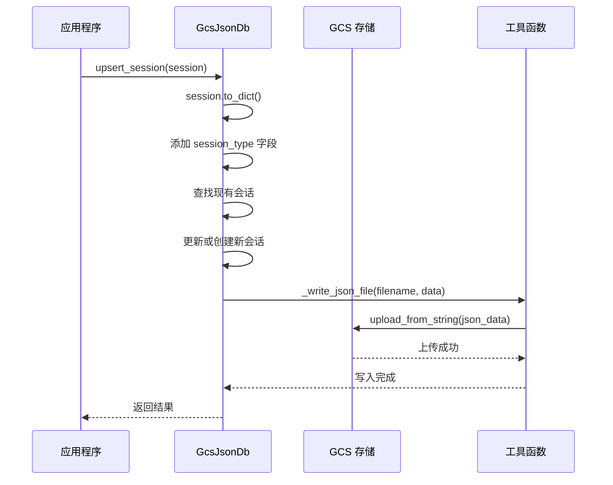
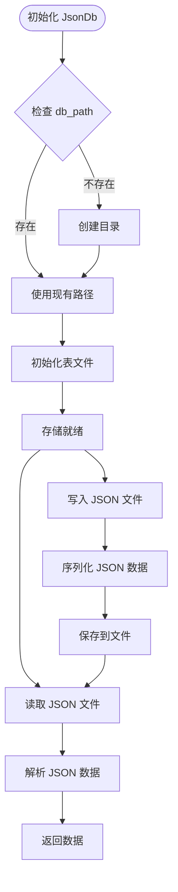
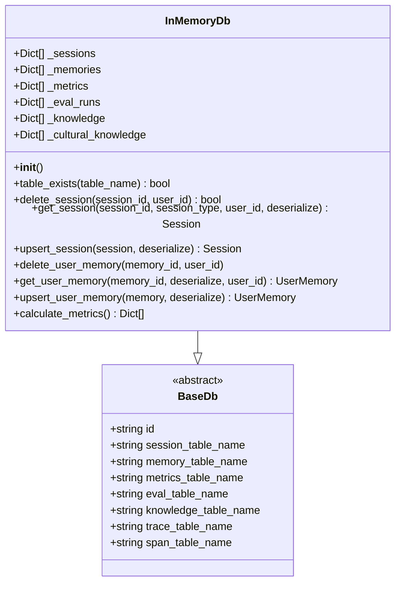
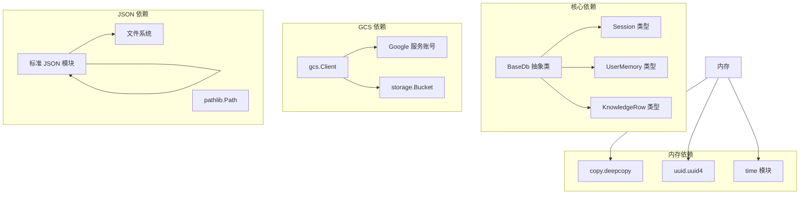
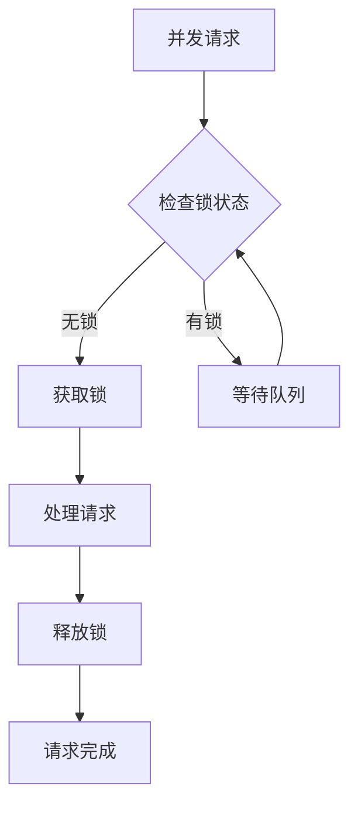
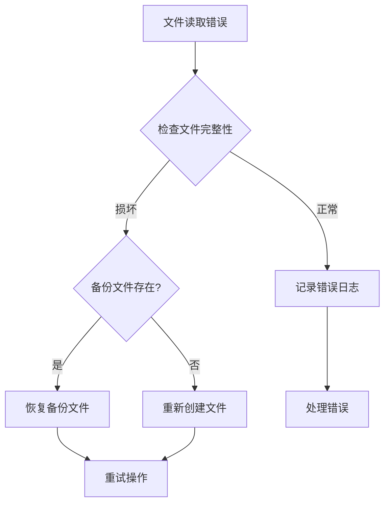
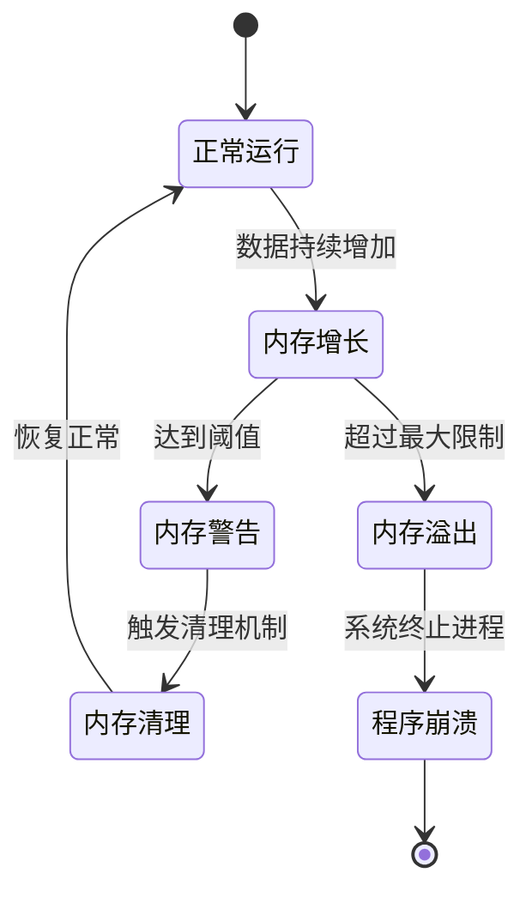

# 文件存储实现

<cite>
**本文档引用的文件**
- [gcs_json_db.py](file://libs/agno/agno/db/gcs_json/gcs_json_db.py)
- [base.py](file://libs/agno/agno/db/base.py)
- [in_memory_db.py](file://libs/agno/agno/db/in_memory/in_memory_db.py)
- [json_db.py](file://libs/agno/agno/db/json/json_db.py)
- [utils.py](file://libs/agno/agno/db/gcs_json/utils.py)
- [utils.py](file://libs/agno/agno/db/json/utils.py)
- [gcs_json_for_agent.py](file://cookbook/06_storage/gcs/gcs_json_for_agent.py)
- [json_for_agent.py](file://cookbook/06_storage/json_db/json_for_agent.py)
- [in_memory_storage_for_agent.py](file://cookbook/06_storage/in_memory/in_memory_storage_for_agent.py)
</cite>

## 目录
1. [简介](#简介)
2. [项目结构](#项目结构)
3. [核心组件](#核心组件)
4. [架构概览](#架构概览)
5. [详细组件分析](#详细组件分析)
6. [依赖分析](#依赖分析)
7. [性能考虑](#性能考虑)
8. [故障排除指南](#故障排除指南)
9. [结论](#结论)

## 简介

Agno Learn 项目提供了多种文件存储解决方案，包括 Google Cloud Storage (GCS)、JSON 数据库和内存存储。这些存储实现为代理、团队和工作流的会话管理、记忆存储和指标计算提供了灵活的数据持久化选项。

本文档深入介绍了这些存储方式在 Agno Learn 中的应用，包括配置方法、使用场景和最佳实践。

## 项目结构

项目采用模块化的存储架构设计，每个存储后端都实现了统一的数据库接口：

**图表来源**
- [base.py:30-122](file://libs/agno/agno/db/base.py#L30-L122)
- [gcs_json_db.py:33-94](file://libs/agno/agno/db/gcs_json/gcs_json_db.py#L33-L94)
- [json_db.py:30-73](file://libs/agno/agno/db/json/json_db.py#L30-L73)
- [in_memory_db.py:27-31](file://libs/agno/agno/db/in_memory/in_memory_db.py#L27-L31)

**章节来源**
- [base.py:30-122](file://libs/agno/agno/db/base.py#L30-L122)
- [gcs_json_db.py:33-94](file://libs/agno/agno/db/gcs_json/gcs_json_db.py#L33-L94)
- [json_db.py:30-73](file://libs/agno/agno/db/json/json_db.py#L30-L73)
- [in_memory_db.py:27-31](file://libs/agno/agno/db/in_memory/in_memory_db.py#L27-L31)

## 核心组件

### 基础数据库接口

所有存储实现都继承自 `BaseDb` 抽象基类，该类定义了统一的数据库操作接口：

- **会话管理**: 删除、获取、重命名和插入/更新会话
- **记忆管理**: 删除、获取、统计用户记忆
- **指标计算**: 计算和获取指标数据
- **知识管理**: 管理知识内容
- **评估管理**: 处理评估运行记录

### GCS JSON 存储

GcsJsonDb 实现了基于 Google Cloud Storage 的 JSON 文件存储：

- **分布式存储**: 支持多实例共享数据
- **自动扩展**: 利用 GCS 的无限扩展能力
- **高可用性**: 提供数据冗余和备份
- **成本效益**: 按需付费的存储模式

### JSON 文件存储

JsonDb 提供本地文件系统上的 JSON 存储：

- **简单易用**: 无需额外的数据库服务
- **开发友好**: 适合本地开发和测试
- **轻量级**: 最小的系统开销
- **可移植性**: 纯文本文件便于备份和迁移

### 内存存储

InMemoryDb 提供纯内存存储：

- **高性能**: 无磁盘 I/O 开销
- **临时数据**: 适合缓存和临时会话
- **快速访问**: 内存中的数据访问速度极快
- **易清理**: 进程结束后自动释放

**章节来源**
- [base.py:149-277](file://libs/agno/agno/db/base.py#L149-L277)
- [gcs_json_db.py:33-94](file://libs/agno/agno/db/gcs_json/gcs_json_db.py#L33-L94)
- [json_db.py:30-73](file://libs/agno/agno/db/json/json_db.py#L30-L73)
- [in_memory_db.py:27-31](file://libs/agno/agno/db/in_memory/in_memory_db.py#L27-L31)

## 架构概览

**图表来源**
- [base.py:30-122](file://libs/agno/agno/db/base.py#L30-L122)
- [gcs_json_db.py:27-31](file://libs/agno/agno/db/gcs_json/gcs_json_db.py#L27-L31)
- [json_db.py:29-30](file://libs/agno/agno/db/json/json_db.py#L29-L30)
- [in_memory_db.py:23-24](file://libs/agno/agno/db/in_memory/in_memory_db.py#L23-L24)

## 详细组件分析

### GCS JSON 存储实现

#### 配置和初始化

GcsJsonDb 的初始化参数提供了灵活的配置选项：

**图表来源**
- [gcs_json_db.py:33-94](file://libs/agno/agno/db/gcs_json/gcs_json_db.py#L33-L94)
- [base.py:30-73](file://libs/agno/agno/db/base.py#L30-L73)

#### 文件组织和命名规则

GcsJsonDb 使用层次化的文件组织结构：

| 表类型 | 文件命名规则 | 示例路径 |
|--------|-------------|----------|
| 会话表 | `{prefix}agno_sessions.json` | `agent/agno_sessions.json` |
| 记忆表 | `{prefix}agno_memories.json` | `agent/agno_memories.json` |
| 指标表 | `{prefix}agno_metrics.json` | `agent/agno_metrics.json` |
| 评估表 | `{prefix}agno_eval_runs.json` | `agent/agno_eval_runs.json` |
| 知识表 | `{prefix}agno_knowledge.json` | `agent/agno_knowledge.json` |
| 文化知识表 | `{prefix}agno_culture.json` | `agent/agno_culture.json` |
| 跟踪表 | `{prefix}agno_traces.json` | `agent/agno_traces.json` |
| Span 表 | `{prefix}agno_spans.json` | `agent/agno_spans.json` |

#### 数据序列化和反序列化

GcsJsonDb 使用标准的 JSON 序列化机制：

**图表来源**
- [gcs_json_db.py:409-455](file://libs/agno/agno/db/gcs_json/gcs_json_db.py#L409-L455)
- [gcs_json_db.py:133-152](file://libs/agno/agno/db/gcs_json/gcs_json_db.py#L133-L152)

#### 权限管理和安全控制

GcsJsonDb 支持多种认证方式：

1. **默认凭据**: 使用 `google.auth.default()`
2. **服务账号**: 通过 `credentials` 参数传递
3. **项目标识**: 通过 `project` 参数指定

**章节来源**
- [gcs_json_db.py:33-94](file://libs/agno/agno/db/gcs_json/gcs_json_db.py#L33-L94)
- [gcs_json_db.py:103-152](file://libs/agno/agno/db/gcs_json/gcs_json_db.py#L103-L152)
- [gcs_json_for_agent.py:21-34](file://cookbook/06_storage/gcs/gcs_json_for_agent.py#L21-L34)

### JSON 文件存储实现

#### 本地文件组织

JsonDb 将所有数据存储在本地文件系统中：

**图表来源**
- [json_db.py:75-134](file://libs/agno/agno/db/json/json_db.py#L75-L134)

#### 文件命名和数据结构

| 表类型 | 文件名 | 数据结构 |
|--------|--------|----------|
| 会话表 | `agno_sessions.json` | 数组格式 |
| 记忆表 | `agno_memories.json` | 数组格式 |
| 指标表 | `agno_metrics.json` | 数组格式 |
| 评估表 | `agno_eval_runs.json` | 数组格式 |
| 知识表 | `agno_knowledge.json` | 数组格式 |
| 文化知识表 | `agno_culture.json` | 数组格式 |
| 跟踪表 | `agno_traces.json` | 数组格式 |
| Span 表 | `agno_spans.json` | 数组格式 |

#### 性能特点

JsonDb 的性能特征：

- **读取性能**: O(n) 线性扫描
- **写入性能**: 完整文件重写
- **内存使用**: 全量加载到内存
- **并发支持**: 无内置锁机制

**章节来源**
- [json_db.py:75-134](file://libs/agno/agno/db/json/json_db.py#L75-L134)
- [json_db.py:146-203](file://libs/agno/agno/db/json/json_db.py#L146-L203)
- [json_for_agent.py:15](file://cookbook/06_storage/json_db/json_for_agent.py#L15)

### 内存存储实现

#### 数据结构设计

InMemoryDb 使用 Python 原生数据结构：

**图表来源**
- [in_memory_db.py:27-50](file://libs/agno/agno/db/in_memory/in_memory_db.py#L27-L50)
- [base.py:30-73](file://libs/agno/agno/db/base.py#L30-L73)

#### 缓存机制和性能优势

InMemoryDb 的核心优势：

- **零延迟访问**: 内存中的数据访问
- **批量操作**: 支持高效的批量处理
- **深拷贝保护**: 使用 `deepcopy` 避免数据污染
- **自动清理**: 进程结束时自动释放内存

#### 使用场景

内存存储适用于：

- **开发和测试**: 快速原型开发
- **临时缓存**: 短期数据缓存
- **性能测试**: 基准测试和性能分析
- **演示环境**: 快速部署和演示

**章节来源**
- [in_memory_db.py:27-50](file://libs/agno/agno/db/in_memory/in_memory_db.py#L27-L50)
- [in_memory_db.py:52-155](file://libs/agno/agno/db/in_memory/in_memory_db.py#L52-L155)
- [in_memory_storage_for_agent.py:9](file://cookbook/06_storage/in_memory/in_memory_storage_for_agent.py#L9)

## 依赖分析

**图表来源**
- [base.py:1-25](file://libs/agno/agno/db/base.py#L1-L25)
- [gcs_json_db.py:27-30](file://libs/agno/agno/db/gcs_json/gcs_json_db.py#L27-L30)
- [json_db.py:1-27](file://libs/agno/agno/db/json/json_db.py#L1-L27)
- [in_memory_db.py:1-25](file://libs/agno/agno/db/in_memory/in_memory_db.py#L1-L25)

### 组件耦合度分析

| 组件 | 内聚性 | 耦合度 | 主要依赖 |
|------|--------|--------|----------|
| GcsJsonDb | 高 | 中等 | Google Cloud Storage SDK |
| JsonDb | 高 | 低 | 标准库 (json, os) |
| InMemoryDb | 高 | 低 | 标准库 (copy, uuid) |
| BaseDb | 高 | 低 | 抽象接口定义 |

**章节来源**
- [base.py:1-25](file://libs/agno/agno/db/base.py#L1-L25)
- [gcs_json_db.py:27-30](file://libs/agno/agno/db/gcs_json/gcs_json_db.py#L27-L30)
- [json_db.py:1-27](file://libs/agno/agno/db/json/json_db.py#L1-L27)
- [in_memory_db.py:1-25](file://libs/agno/agno/db/in_memory/in_memory_db.py#L1-L25)

## 性能考虑

### I/O 优化策略

#### GCS 存储优化

1. **批量操作**: 合并多次写入操作
2. **缓存策略**: 在应用层实现读取缓存
3. **压缩传输**: 考虑启用 GZIP 压缩
4. **连接复用**: 复用 GCS 客户端连接

#### JSON 文件存储优化

1. **增量更新**: 实现部分文件更新而非全量重写
2. **索引文件**: 创建内存索引来加速查询
3. **文件分片**: 大数据集分片存储
4. **异步写入**: 使用后台线程处理写入操作

#### 内存存储优化

1. **LRU 缓存**: 实现内存使用限制
2. **懒加载**: 按需加载数据到内存
3. **内存池**: 预分配内存块
4. **垃圾回收**: 定期清理无用数据

### 并发访问控制

### 缓存策略

| 缓存层级 | 缓存类型 | 命中率 | 延迟 | 适用场景 |
|----------|----------|--------|------|----------|
| 应用层缓存 | LRU/LFU | 80-90% | 微秒级 | 高频读取数据 |
| 数据库缓存 | 查询结果缓存 | 70-85% | 毫秒级 | 复杂查询结果 |
| 文件系统缓存 | 操作系统缓存 | 60-75% | 毫秒级 | 本地文件访问 |
| 网络缓存 | CDN 缓存 | 90-95% | 毫秒级 | 静态资源分发 |

## 故障排除指南

### GCS 存储问题

#### 常见错误和解决方案

| 错误类型 | 错误代码 | 可能原因 | 解决方案 |
|----------|----------|----------|----------|
| 认证失败 | 401/403 | 凭据无效或权限不足 | 检查服务账号密钥和 IAM 权限 |
| 存储桶不存在 | 404 | 桶名称错误 | 验证桶名称和项目 ID |
| 网络超时 | 504 | 网络连接问题 | 检查防火墙设置和网络配置 |
| 内存溢出 | 500 | 大文件处理 | 实现分块读取和流式处理 |

#### 调试技巧

1. **启用详细日志**: 设置 `DEBUG_MODE = True`
2. **检查网络连接**: 使用 `ping` 和 `traceroute`
3. **验证权限**: 使用 `gsutil ls` 测试访问权限
4. **监控配额**: 检查 GCS 使用配额和限制

### JSON 文件存储问题

#### 文件损坏处理

#### 性能问题诊断

1. **监控文件大小**: 定期检查 JSON 文件大小
2. **分析读写模式**: 使用性能分析工具
3. **检查磁盘空间**: 确保有足够的磁盘空间
4. **优化文件系统**: 使用 SSD 或优化的文件系统

### 内存存储问题

#### 内存泄漏检测

#### 内存使用优化

1. **定期清理**: 实现自动清理机制
2. **容量监控**: 监控内存使用情况
3. **数据淘汰**: 实现 LRU/LFU 淘汰策略
4. **批量处理**: 优化大批量数据处理

**章节来源**
- [gcs_json_db.py:122-131](file://libs/agno/agno/db/gcs_json/gcs_json_db.py#L122-L131)
- [json_db.py:109-111](file://libs/agno/agno/db/json/json_db.py#L109-L111)
- [in_memory_db.py:150-155](file://libs/agno/agno/db/in_memory/in_memory_db.py#L150-L155)

## 结论

Agno Learn 项目的文件存储实现提供了三种不同级别的数据持久化解决方案：

1. **GCS JSON 存储**: 适合生产环境的分布式应用，提供高可用性和可扩展性
2. **JSON 文件存储**: 适合开发测试和小型应用，简单易用且成本低廉
3. **内存存储**: 适合高性能要求和临时数据处理，提供最快的访问速度

每种存储方式都有其特定的优势和适用场景。选择合适的存储方案应该基于应用的具体需求，包括数据规模、性能要求、成本考虑和运维复杂度等因素。

通过统一的数据库接口设计，这些存储实现可以轻松切换和组合使用，为不同的应用场景提供最优的解决方案。