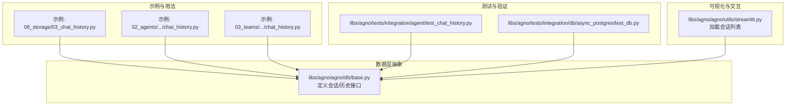
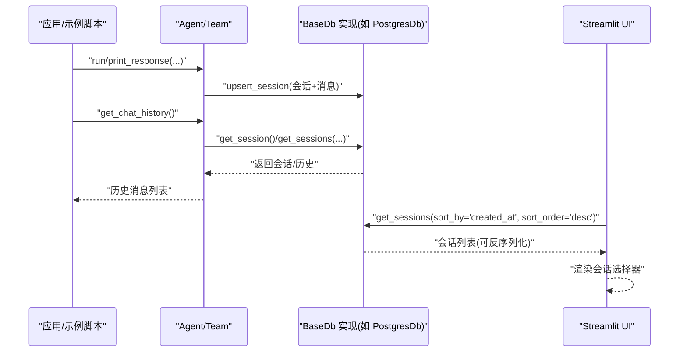
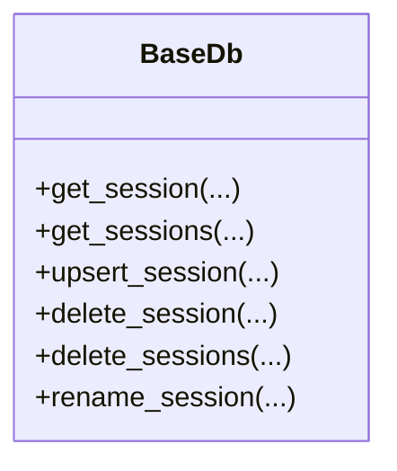
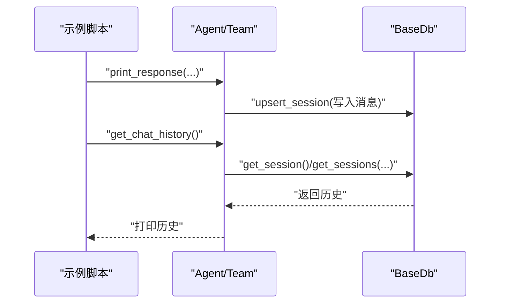
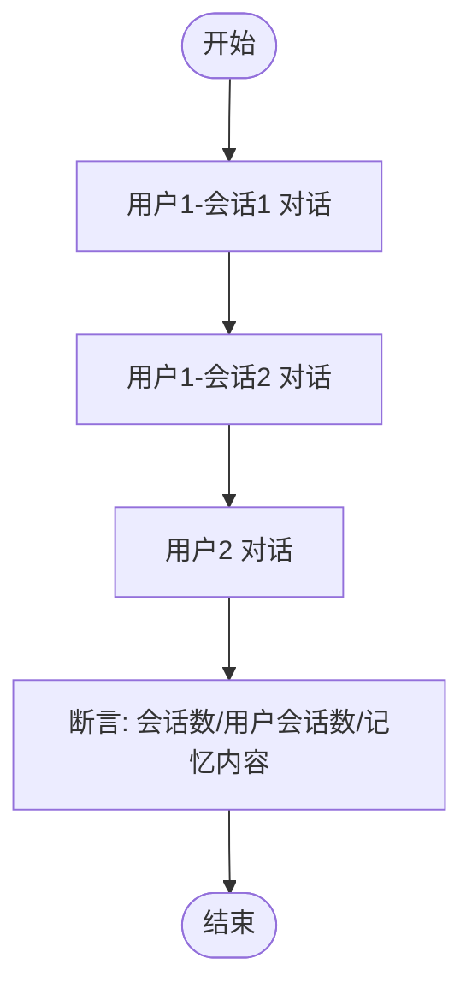
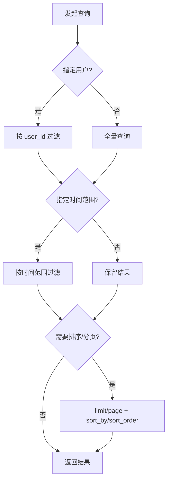
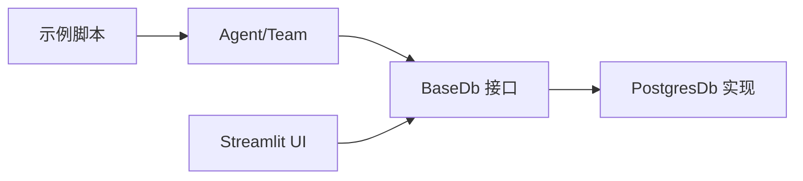

# 聊天历史

<cite>
**本文引用的文件**
- [cookbook/06_storage/03_chat_history.py](file://cookbook/06_storage/03_chat_history.py)
- [cookbook/02_agents/05_state_and_session/chat_history.py](file://cookbook/02_agents/05_state_and_session/chat_history.py)
- [cookbook/03_teams/07_session/chat_history.py](file://cookbook/03_teams/07_session/chat_history.py)
- [libs/agno/agno/db/base.py](file://libs/agno/agno/db/base.py)
- [libs/agno/tests/integration/agent/test_chat_history.py](file://libs/agno/tests/integration/agent/test_chat_history.py)
- [libs/agno/agno/utils/streamlit.py](file://libs/agno/agno/utils/streamlit.py)
- [libs/agno/tests/integration/db/async_postgres/test_db.py](file://libs/agno/tests/integration/db/async_postgres/test_db.py)
- [cookbook/06_storage/README.md](file://cookbook/06_storage/README.md)
</cite>

## 目录
1. [简介](#简介)
2. [项目结构](#项目结构)
3. [核心组件](#核心组件)
4. [架构总览](#架构总览)
5. [详细组件分析](#详细组件分析)
6. [依赖分析](#依赖分析)
7. [性能考量](#性能考量)
8. [故障排查指南](#故障排查指南)
9. [结论](#结论)
10. [附录](#附录)

## 简介
本章节面向 Agno Learn 的“聊天历史”管理能力，系统性说明历史存储结构、消息格式、时间戳与元数据字段；详述增删改查（CRUD）流程、历史检索与过滤（按用户、时间范围、关键词）、导出与导入机制、性能优化策略（索引、缓存、分页）、备份与恢复方案、数据隐私与安全（敏感信息处理与访问控制），并提供可直接参考的实现示例与 API 使用方法。

## 项目结构
围绕聊天历史的关键位置与职责如下：
- 示例与用法：cookbook 中多处演示如何通过 Agent/Team 读取与限制历史消息
- 数据层抽象：BaseDb 定义了会话与历史相关的统一接口（增删改查、过滤、分页等）
- 测试与验证：集成测试覆盖多用户/多会话场景与历史一致性
- 可视化与交互：Streamlit 工具函数从数据库加载会话列表，支持排序与筛选
- 存储实现：PostgresDb 等具体实现负责表结构与列类型约束（如 created_at、session_data）

**图示来源**
- [cookbook/06_storage/03_chat_history.py:1-38](file://cookbook/06_storage/03_chat_history.py#L1-L38)
- [cookbook/02_agents/05_state_and_session/chat_history.py:1-36](file://cookbook/02_agents/05_state_and_session/chat_history.py#L1-L36)
- [cookbook/03_teams/07_session/chat_history.py:1-55](file://cookbook/03_teams/07_session/chat_history.py#L1-L55)
- [libs/agno/agno/db/base.py:149-200](file://libs/agno/agno/db/base.py#L149-L200)
- [libs/agno/tests/integration/agent/test_chat_history.py:1-107](file://libs/agno/tests/integration/agent/test_chat_history.py#L1-L107)
- [libs/agno/tests/integration/db/async_postgres/test_db.py:36-66](file://libs/agno/tests/integration/db/async_postgres/test_db.py#L36-L66)
- [libs/agno/agno/utils/streamlit.py:63-99](file://libs/agno/agno/utils/streamlit.py#L63-L99)

**章节来源**
- [cookbook/06_storage/README.md:49-55](file://cookbook/06_storage/README.md#L49-L55)
- [cookbook/06_storage/03_chat_history.py:1-38](file://cookbook/06_storage/03_chat_history.py#L1-L38)
- [cookbook/02_agents/05_state_and_session/chat_history.py:1-36](file://cookbook/02_agents/05_state_and_session/chat_history.py#L1-L36)
- [cookbook/03_teams/07_session/chat_history.py:1-55](file://cookbook/03_teams/07_session/chat_history.py#L1-L55)
- [libs/agno/agno/db/base.py:149-200](file://libs/agno/agno/db/base.py#L149-L200)
- [libs/agno/tests/integration/agent/test_chat_history.py:1-107](file://libs/agno/tests/integration/agent/test_chat_history.py#L1-L107)
- [libs/agno/agno/utils/streamlit.py:63-99](file://libs/agno/agno/utils/streamlit.py#L63-L99)
- [libs/agno/tests/integration/db/async_postgres/test_db.py:36-66](file://libs/agno/tests/integration/db/async_postgres/test_db.py#L36-L66)

## 核心组件
- 会话与历史接口（BaseDb）
  - 提供会话 CRUD、分页、排序、过滤（用户、时间范围、名称）等能力
  - 统一的 upsert_session/get_session/get_sessions/delete_session 等方法签名
- Agent/Team 与历史读取
  - 示例展示了如何在运行后打印当前会话的历史消息
  - 支持限制上下文中的历史消息数量（num_history_messages）
- Streamlit 集成
  - 从数据库拉取会话列表，支持按 created_at 排序、反序列化、提取会话名
- Postgres 实现与表结构
  - 集成测试验证 session 表存在、列类型与约束（如 created_at 为整型时间戳、session_data 为 JSON/JSONB）

**章节来源**
- [libs/agno/agno/db/base.py:149-200](file://libs/agno/agno/db/base.py#L149-L200)
- [cookbook/06_storage/03_chat_history.py:21-38](file://cookbook/06_storage/03_chat_history.py#L21-L38)
- [cookbook/02_agents/05_state_and_session/chat_history.py:19-36](file://cookbook/02_agents/05_state_and_session/chat_history.py#L19-L36)
- [cookbook/03_teams/07_session/chat_history.py:27-55](file://cookbook/03_teams/07_session/chat_history.py#L27-L55)
- [libs/agno/agno/utils/streamlit.py:63-99](file://libs/agno/agno/utils/streamlit.py#L63-L99)
- [libs/agno/tests/integration/db/async_postgres/test_db.py:36-66](file://libs/agno/tests/integration/db/async_postgres/test_db.py#L36-L66)

## 架构总览
下图展示从应用到数据库的典型调用链：Agent/Team 在运行时写入会话与消息，随后通过 BaseDb 接口进行查询、过滤与分页；Streamlit 侧从数据库加载会话列表用于界面选择。

**图示来源**
- [cookbook/06_storage/03_chat_history.py:21-38](file://cookbook/06_storage/03_chat_history.py#L21-L38)
- [cookbook/02_agents/05_state_and_session/chat_history.py:19-36](file://cookbook/02_agents/05_state_and_session/chat_history.py#L19-L36)
- [cookbook/03_teams/07_session/chat_history.py:27-55](file://cookbook/03_teams/07_session/chat_history.py#L27-L55)
- [libs/agno/agno/db/base.py:149-200](file://libs/agno/agno/db/base.py#L149-L200)
- [libs/agno/agno/utils/streamlit.py:63-99](file://libs/agno/agno/utils/streamlit.py#L63-L99)

## 详细组件分析

### 会话与历史接口（BaseDb）
- 关键方法族
  - 读取：get_session、get_sessions（支持用户过滤、时间范围、分页、排序、反序列化）
  - 写入/更新：upsert_session
  - 删除：delete_session、delete_sessions
  - 重命名：rename_session
- 典型参数
  - session_type、user_id、component_id、session_name、start_timestamp、end_timestamp、limit、page、sort_by、sort_order、deserialize
- 设计要点
  - 抽象接口确保不同存储后端（Postgres、Mongo、Redis 等）的一致行为
  - 分页与排序参数便于大规模历史检索

**图示来源**
- [libs/agno/agno/db/base.py:149-200](file://libs/agno/agno/db/base.py#L149-L200)

**章节来源**
- [libs/agno/agno/db/base.py:149-200](file://libs/agno/agno/db/base.py#L149-L200)

### 历史消息读取与限制
- 示例用法
  - Agent/Team 运行后调用 get_chat_history 获取当前会话历史
  - Team 支持通过 num_history_messages 限制上下文历史条数
- 实现要点
  - 历史读取由 Agent/Team 层封装，底层委托 BaseDb
  - 限制历史数量可降低上下文开销，提升响应速度

**图示来源**
- [cookbook/06_storage/03_chat_history.py:32-38](file://cookbook/06_storage/03_chat_history.py#L32-L38)
- [cookbook/02_agents/05_state_and_session/chat_history.py:30-36](file://cookbook/02_agents/05_state_and_session/chat_history.py#L30-L36)
- [cookbook/03_teams/07_session/chat_history.py:44-55](file://cookbook/03_teams/07_session/chat_history.py#L44-L55)

**章节来源**
- [cookbook/06_storage/03_chat_history.py:21-38](file://cookbook/06_storage/03_chat_history.py#L21-L38)
- [cookbook/02_agents/05_state_and_session/chat_history.py:19-36](file://cookbook/02_agents/05_state_and_session/chat_history.py#L19-L36)
- [cookbook/03_teams/07_session/chat_history.py:27-55](file://cookbook/03_teams/07_session/chat_history.py#L27-L55)

### 多用户/多会话与历史一致性（测试验证）
- 场景覆盖
  - 多用户、多会话并发聊天
  - 每个用户拥有独立会话集合
  - 记忆（memories）与会话（sessions）分别存储与查询
- 断言要点
  - 会话总数、用户会话数量与会话 ID 正确
  - 记忆内容包含预期文本片段
- 指标意义
  - 证明历史与记忆的分离存储与正确检索

**图示来源**
- [libs/agno/tests/integration/agent/test_chat_history.py:42-107](file://libs/agno/tests/integration/agent/test_chat_history.py#L42-L107)

**章节来源**
- [libs/agno/tests/integration/agent/test_chat_history.py:1-107](file://libs/agno/tests/integration/agent/test_chat_history.py#L1-L107)

### 历史检索与过滤（按用户、时间范围、关键词）
- 用户过滤：get_sessions 支持 user_id 参数
- 时间范围：start_timestamp/end_timestamp
- 名称过滤：session_name
- 分页与排序：limit/page、sort_by、sort_order
- 关键词搜索
  - 当前接口未直接暴露“关键词搜索”参数
  - 建议在上层对返回的历史消息进行二次过滤（如基于消息内容或元数据字段）

**图示来源**
- [libs/agno/agno/db/base.py:168-183](file://libs/agno/agno/db/base.py#L168-L183)

**章节来源**
- [libs/agno/agno/db/base.py:168-183](file://libs/agno/agno/db/base.py#L168-L183)

### 导出与导入机制
- 导出
  - 通过 get_sessions/get_session 获取历史数据
  - 将 session_data 与消息列表序列化为 JSON/CSV 等格式
- 导入
  - 将外部历史数据转换为 session_data 结构
  - 调用 upsert_session 写回数据库
- 批量操作
  - 使用 get_sessions(limit, page) 进行分页遍历
  - 在上层循环调用 upsert_session 完成批量导入

**章节来源**
- [libs/agno/agno/db/base.py:196-200](file://libs/agno/agno/db/base.py#L196-L200)

### 存储结构与数据模型
- 表与列（以 Postgres 为例）
  - 表名：默认“agno_sessions”，可通过构造函数配置
  - 关键列：session_id（非空）、created_at（整型时间戳）、session_data（JSON/JSONB）
- 消息与元数据
  - 历史消息通常嵌入在 session_data 中
  - 元数据字段建议包含：角色（role）、内容（content）、时间戳（timestamp）、工具调用信息（tool_calls）等
- 字段复杂度
  - 查询与过滤：O(log N) 到 O(N) 视索引与条件而定
  - 写入：单条 upsert_session 为 O(1)，批量导入需注意事务与索引写入成本

**章节来源**
- [libs/agno/tests/integration/db/async_postgres/test_db.py:36-66](file://libs/agno/tests/integration/db/async_postgres/test_db.py#L36-L66)
- [libs/agno/agno/db/base.py:36-73](file://libs/agno/agno/db/base.py#L36-L73)

### 增删改查操作
- 插入新消息
  - Agent/Team 运行时自动触发 upsert_session 写入会话与消息
- 查询历史
  - get_session 获取单一会话
  - get_sessions 支持多维过滤与分页
- 删除过期记录
  - delete_session/delete_sessions 按会话维度清理
  - 结合时间范围过滤与批量删除实现“过期清理”

**章节来源**
- [libs/agno/agno/db/base.py:150-200](file://libs/agno/agno/db/base.py#L150-L200)
- [cookbook/06_storage/03_chat_history.py:32-38](file://cookbook/06_storage/03_chat_history.py#L32-L38)

### Streamlit 会话列表加载
- 功能：从数据库获取会话列表，按创建时间倒序，提取会话名并生成选择器
- 关键点：deserialize 控制是否反序列化；异常时记录日志并提示

**章节来源**
- [libs/agno/agno/utils/streamlit.py:63-99](file://libs/agno/agno/utils/streamlit.py#L63-L99)

## 依赖分析
- 组件耦合
  - 示例脚本依赖 Agent/Team 与 BaseDb 接口
  - UI 依赖数据库的 get_sessions 能力
- 外部依赖
  - PostgresDb 作为具体实现，遵循 BaseDb 接口契约
- 循环依赖
  - 未见明显循环依赖；接口层清晰隔离

**图示来源**
- [cookbook/06_storage/03_chat_history.py:21-38](file://cookbook/06_storage/03_chat_history.py#L21-L38)
- [libs/agno/agno/db/base.py:149-200](file://libs/agno/agno/db/base.py#L149-L200)
- [libs/agno/agno/utils/streamlit.py:63-99](file://libs/agno/agno/utils/streamlit.py#L63-L99)

**章节来源**
- [cookbook/06_storage/03_chat_history.py:21-38](file://cookbook/06_storage/03_chat_history.py#L21-L38)
- [libs/agno/agno/db/base.py:149-200](file://libs/agno/agno/db/base.py#L149-L200)
- [libs/agno/agno/utils/streamlit.py:63-99](file://libs/agno/agno/utils/streamlit.py#L63-L99)

## 性能考量
- 索引设计
  - 为 session_id、user_id、created_at 建立复合索引，加速过滤与排序
  - 对 JSON/JSONB 字段中的常用键（如消息角色、时间戳）建立表达式索引
- 缓存机制
  - 对热点会话使用内存缓存（如 LRU），减少数据库往返
  - 缓存失效策略：会话写入后主动失效对应键
- 分页查询
  - 使用 page/limit 与游标分页（基于 created_at 或主键）避免全表扫描
- 历史裁剪
  - 通过 num_history_messages 限制上下文长度，降低模型输入成本
- 批量导入
  - 使用事务批量 upsert_session，减少锁竞争与日志刷盘

[本节为通用性能建议，不直接分析特定文件]

## 故障排查指南
- 无法加载会话列表
  - 检查数据库连接与表是否存在
  - 查看日志输出，确认异常捕获与错误提示
- 历史为空或不完整
  - 确认运行时是否触发 upsert_session
  - 检查 session_id 是否正确传递
- 时间范围查询无效
  - 确认传入的时间戳单位与 created_at 一致（整型时间戳）
- 导入失败
  - 校验 session_data 结构与字段完整性
  - 使用事务保证批量导入一致性

**章节来源**
- [libs/agno/agno/utils/streamlit.py:63-99](file://libs/agno/agno/utils/streamlit.py#L63-L99)
- [libs/agno/tests/integration/db/async_postgres/test_db.py:36-66](file://libs/agno/tests/integration/db/async_postgres/test_db.py#L36-L66)

## 结论
Agno Learn 的聊天历史管理以 BaseDb 抽象为核心，结合多种存储实现（如 PostgresDb）提供统一的会话与历史接口。示例与测试覆盖了多用户/多会话场景、历史读取与限制、以及 UI 加载会话列表等关键路径。通过合理的索引、缓存与分页策略，可在大规模历史数据下保持良好性能。建议在上层补充关键词搜索与更细粒度的元数据过滤，并完善导出/导入的批处理与校验流程。

[本节为总结性内容，不直接分析特定文件]

## 附录

### API 使用方法速查
- 获取会话列表（按创建时间倒序）
  - get_sessions(sort_by="created_at", sort_order="desc", deserialize=True)
- 按用户过滤
  - get_sessions(user_id="xxx")
- 按时间范围过滤
  - get_sessions(start_timestamp=..., end_timestamp=...)
- 分页与排序
  - get_sessions(limit=..., page=..., sort_by="...", sort_order="...")
- 读取单一会话
  - get_session(session_id="xxx", session_type=..., deserialize=True)
- 写入/更新会话
  - upsert_session(Session(...))
- 删除会话
  - delete_session("xxx") / delete_sessions([...])

**章节来源**
- [libs/agno/agno/db/base.py:158-200](file://libs/agno/agno/db/base.py#L158-L200)

### 备份与恢复策略
- 备份
  - 导出所有会话：get_sessions(limit=..., page=...) 分页拉取
  - 序列化为 JSON/CSV，定期归档
- 恢复
  - 逐条调用 upsert_session 写回目标库
  - 使用事务保证一致性，失败时回滚

**章节来源**
- [libs/agno/agno/db/base.py:196-200](file://libs/agno/agno/db/base.py#L196-L200)

### 数据隐私与安全
- 敏感信息处理
  - 在 session_data 中避免存储明文敏感字段；必要时脱敏或加密
  - 对消息内容进行 PII 检测与过滤
- 访问控制
  - 通过 user_id 严格隔离用户会话
  - 在 UI 与 API 层实施最小权限原则，仅允许访问授权会话

**章节来源**
- [libs/agno/agno/db/base.py:168-183](file://libs/agno/agno/db/base.py#L168-L183)