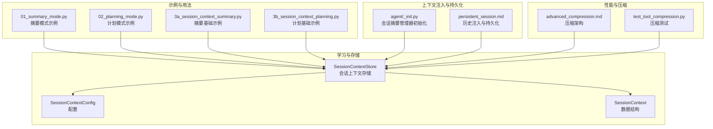
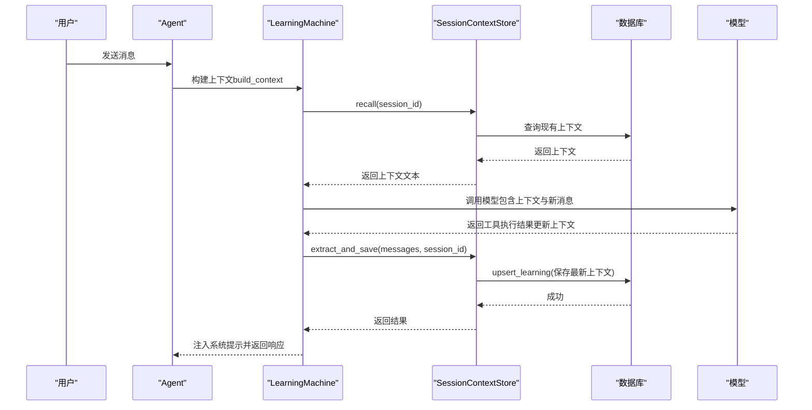
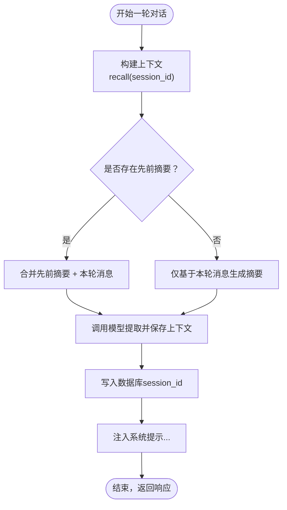
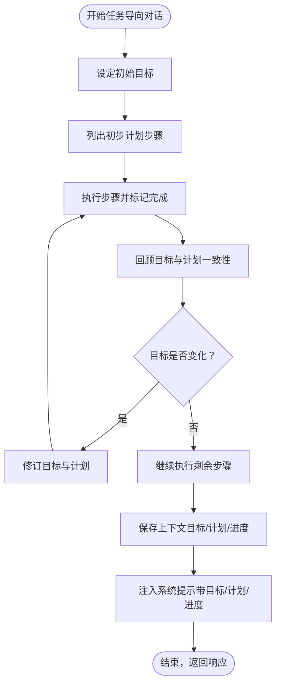
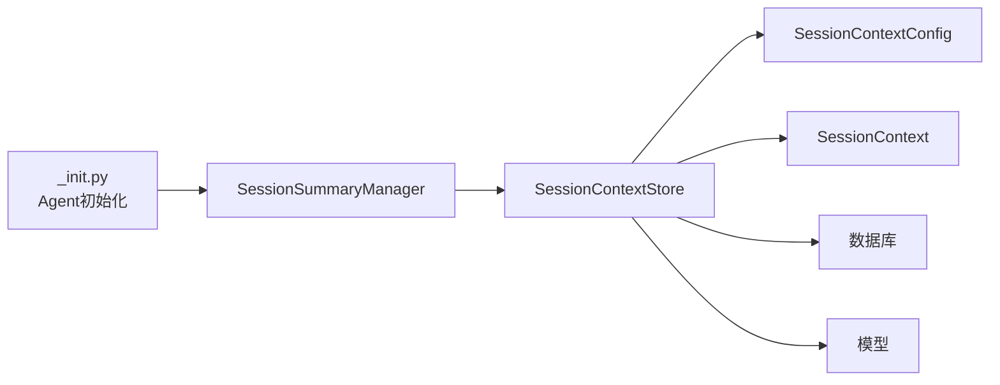

# 会话上下文学习

<cite>
**本文档引用的文件**
- [libs/agno/agno/learn/stores/session_context.py](file://libs/agno/agno/learn/stores/session_context.py)
- [libs/agno/agno/learn/config.py](file://libs/agno/agno/learn/config.py)
- [libs/agno/agno/learn/schemas.py](file://libs/agno/agno/learn/schemas.py)
- [libs/agno/agno/agent/_init.py](file://libs/agno/agno/agent/_init.py)
- [cookbook/08_learning/03_session_context/01_summary_mode.py](file://cookbook/08_learning/03_session_context/01_summary_mode.py)
- [cookbook/08_learning/03_session_context/02_planning_mode.py](file://cookbook/08_learning/03_session_context/02_planning_mode.py)
- [cookbook/08_learning/01_basics/3a_session_context_summary.py](file://cookbook/08_learning/01_basics/3a_session_context_summary.py)
- [cookbook/08_learning/01_basics/3b_session_context_planning.py](file://cookbook/08_learning/01_basics/3b_session_context_planning.py)
- [cookbook/03_teams/07_session/persistent_session.md](file://cookbook/03_teams/07_session/persistent_session.md)
- [cookbook/02_agents/14_advanced/advanced_compression.md](file://cookbook/02_agents/14_advanced/advanced_compression.md)
- [libs/agno/tests/integration/agent/test_tool_compression.py](file://libs/agno/tests/integration/agent/test_tool_compression.py)
</cite>

## 目录
1. [简介](#简介)
2. [项目结构](#项目结构)
3. [核心组件](#核心组件)
4. [架构总览](#架构总览)
5. [详细组件分析](#详细组件分析)
6. [依赖分析](#依赖分析)
7. [性能考量](#性能考量)
8. [故障排查指南](#故障排查指南)
9. [结论](#结论)
10. [附录](#附录)

## 简介
本文件围绕会话上下文学习功能，系统阐述两种模式：summary mode（摘要模式）与 planning mode（计划模式）的实现原理、使用场景与最佳实践。文档还覆盖上下文摘要生成算法的关键点（关键信息抽取、情感倾向与行为模式识别）、会话计划模式的目标设定、任务分解与资源分配思路，并结合对话系统中的实际应用案例，给出上下文窗口管理、性能优化与准确性提升的策略。

## 项目结构
与会话上下文学习直接相关的代码主要分布在以下位置：
- 学习存储与工具：会话上下文存储、配置与数据结构定义
- 示例与用法：基础与进阶示例脚本，演示摘要与计划模式
- 上下文注入与会话持久化：如何将上下文注入系统提示并持久化
- 性能与压缩：工具结果压缩与上下文压缩的集成

**图表来源**
- [libs/agno/agno/learn/stores/session_context.py:56-120](file://libs/agno/agno/learn/stores/session_context.py#L56-L120)
- [libs/agno/agno/learn/config.py:170-225](file://libs/agno/agno/learn/config.py#L170-L225)
- [libs/agno/agno/learn/schemas.py:307-399](file://libs/agno/agno/learn/schemas.py#L307-L399)
- [cookbook/08_learning/03_session_context/01_summary_mode.py:1-96](file://cookbook/08_learning/03_session_context/01_summary_mode.py#L1-L96)
- [cookbook/08_learning/03_session_context/02_planning_mode.py:1-98](file://cookbook/08_learning/03_session_context/02_planning_mode.py#L1-L98)
- [cookbook/08_learning/01_basics/3a_session_context_summary.py:1-81](file://cookbook/08_learning/01_basics/3a_session_context_summary.py#L1-L81)
- [cookbook/08_learning/01_basics/3b_session_context_planning.py:1-86](file://cookbook/08_learning/01_basics/3b_session_context_planning.py#L1-L86)
- [libs/agno/agno/agent/_init.py:155-189](file://libs/agno/agno/agent/_init.py#L155-L189)
- [cookbook/03_teams/07_session/persistent_session.md:1-42](file://cookbook/03_teams/07_session/persistent_session.md#L1-L42)
- [cookbook/02_agents/14_advanced/advanced_compression.md:31-50](file://cookbook/02_agents/14_advanced/advanced_compression.md#L31-L50)
- [libs/agno/tests/integration/agent/test_tool_compression.py:38-81](file://libs/agno/tests/integration/agent/test_tool_compression.py#L38-L81)

**章节来源**
- [libs/agno/agno/learn/stores/session_context.py:1-120](file://libs/agno/agno/learn/stores/session_context.py#L1-L120)
- [libs/agno/agno/learn/config.py:170-225](file://libs/agno/agno/learn/config.py#L170-L225)
- [libs/agno/agno/learn/schemas.py:307-399](file://libs/agno/agno/learn/schemas.py#L307-L399)
- [cookbook/08_learning/03_session_context/01_summary_mode.py:1-96](file://cookbook/08_learning/03_session_context/01_summary_mode.py#L1-L96)
- [cookbook/08_learning/03_session_context/02_planning_mode.py:1-98](file://cookbook/08_learning/03_session_context/02_planning_mode.py#L1-L98)
- [cookbook/08_learning/01_basics/3a_session_context_summary.py:1-81](file://cookbook/08_learning/01_basics/3a_session_context_summary.py#L1-L81)
- [cookbook/08_learning/01_basics/3b_session_context_planning.py:1-86](file://cookbook/08_learning/01_basics/3b_session_context_planning.py#L1-L86)
- [libs/agno/agno/agent/_init.py:155-189](file://libs/agno/agno/agent/_init.py#L155-L189)
- [cookbook/03_teams/07_session/persistent_session.md:1-42](file://cookbook/03_teams/07_session/persistent_session.md#L1-L42)
- [cookbook/02_agents/14_advanced/advanced_compression.md:31-50](file://cookbook/02_agents/14_advanced/advanced_compression.md#L31-L50)
- [libs/agno/tests/integration/agent/test_tool_compression.py:38-81](file://libs/agno/tests/integration/agent/test_tool_compression.py#L38-L81)

## 核心组件
- 会话上下文存储（SessionContextStore）
  - 作用：负责会话上下文的检索、提取与保存；支持摘要模式与计划模式；基于 session_id 进行会话级状态管理；在消息历史被截断时仍能维持连续性。
  - 关键能力：构建系统提示、格式化上下文注入、异步/同步操作、审计字段记录。
- 会话上下文配置（SessionContextConfig）
  - 作用：控制是否启用计划模式（目标、计划、进度），以及上下文的增删改查权限与提示定制。
- 会话上下文数据结构（SessionContext）
  - 作用：承载摘要、目标、计划、进度等字段；支持扩展自定义字段（如情绪、阻塞因素等）。
- 会话摘要管理器（SessionSummaryManager）
  - 作用：在代理层注入会话摘要到上下文中，确保摘要与上下文学习协同工作。

**章节来源**
- [libs/agno/agno/learn/stores/session_context.py:56-120](file://libs/agno/agno/learn/stores/session_context.py#L56-L120)
- [libs/agno/agno/learn/config.py:170-225](file://libs/agno/agno/learn/config.py#L170-L225)
- [libs/agno/agno/learn/schemas.py:307-399](file://libs/agno/agno/learn/schemas.py#L307-L399)
- [libs/agno/agno/agent/_init.py:155-189](file://libs/agno/agno/agent/_init.py#L155-L189)

## 架构总览
会话上下文学习的整体流程如下：
- 每轮对话结束后，系统根据当前消息与已有上下文，调用模型生成新的上下文摘要或计划项。
- 新上下文写入数据库（按 session_id），并在后续轮次中作为系统提示的一部分注入给模型。
- 支持摘要模式（仅摘要）与计划模式（摘要+目标+计划+进度）两种形态。

**图表来源**
- [libs/agno/agno/learn/stores/session_context.py:127-187](file://libs/agno/agno/learn/stores/session_context.py#L127-L187)
- [libs/agno/agno/learn/stores/session_context.py:494-575](file://libs/agno/agno/learn/stores/session_context.py#L494-L575)
- [libs/agno/agno/learn/stores/session_context.py:274-326](file://libs/agno/agno/learn/stores/session_context.py#L274-L326)

## 详细组件分析

### 摘要模式（Summary Mode）
- 设计理念
  - 仅维护“会话摘要”，不涉及目标与计划结构，适合通用对话的连续性需求。
  - 每轮结束后，系统基于“先前摘要 + 新消息”生成更新后的摘要，并写回数据库。
- 使用场景
  - 技术支持、知识问答、创意讨论等不需要严格任务推进的对话。
- 关键要点
  - 以 session_id 为键进行检索与写入，确保同一会话内的上下文连续。
  - 可通过指令与 Markdown 控制输出风格，便于人类阅读与理解。
- 示例路径
  - [摘要模式示例:1-96](file://cookbook/08_learning/03_session_context/01_summary_mode.py#L1-L96)
  - [摘要基础示例:1-81](file://cookbook/08_learning/01_basics/3a_session_context_summary.py#L1-L81)

**图表来源**
- [libs/agno/agno/learn/stores/session_context.py:127-187](file://libs/agno/agno/learn/stores/session_context.py#L127-L187)
- [libs/agno/agno/learn/stores/session_context.py:494-575](file://libs/agno/agno/learn/stores/session_context.py#L494-L575)
- [libs/agno/agno/learn/stores/session_context.py:188-229](file://libs/agno/agno/learn/stores/session_context.py#L188-L229)

**章节来源**
- [cookbook/08_learning/03_session_context/01_summary_mode.py:1-96](file://cookbook/08_learning/03_session_context/01_summary_mode.py#L1-L96)
- [cookbook/08_learning/01_basics/3a_session_context_summary.py:1-81](file://cookbook/08_learning/01_basics/3a_session_context_summary.py#L1-L81)
- [libs/agno/agno/learn/stores/session_context.py:127-187](file://libs/agno/agno/learn/stores/session_context.py#L127-L187)

### 计划模式（Planning Mode）
- 设计理念
  - 在摘要基础上新增“目标（Goal）”“计划（Plan）”“进度（Progress）”，用于任务导向型对话。
  - 系统提示强调“集成而非替换”，要求在保留已有信息的同时更新上下文。
- 使用场景
  - 项目管理、部署规划、实验设计等需要明确阶段性成果与下一步动作的场景。
- 关键要点
  - 目标可随对话演进而调整；计划与进度需与目标保持一致。
  - 通过工具调用保存更新后的上下文，确保结构化信息持久化。
- 示例路径
  - [计划模式示例:1-98](file://cookbook/08_learning/03_session_context/02_planning_mode.py#L1-L98)
  - [计划基础示例:1-86](file://cookbook/08_learning/01_basics/3b_session_context_planning.py#L1-L86)

**图表来源**
- [libs/agno/agno/learn/stores/session_context.py:726-822](file://libs/agno/agno/learn/stores/session_context.py#L726-L822)
- [libs/agno/agno/learn/stores/session_context.py:494-575](file://libs/agno/agno/learn/stores/session_context.py#L494-L575)

**章节来源**
- [cookbook/08_learning/03_session_context/02_planning_mode.py:1-98](file://cookbook/08_learning/03_session_context/02_planning_mode.py#L1-L98)
- [cookbook/08_learning/01_basics/3b_session_context_planning.py:1-86](file://cookbook/08_learning/01_basics/3b_session_context_planning.py#L1-L86)
- [libs/agno/agno/learn/stores/session_context.py:726-822](file://libs/agno/agno/learn/stores/session_context.py#L726-L822)

### 上下文摘要生成算法（关键信息抽取、情感分析与行为模式识别）
- 关键信息抽取
  - 输入：先前上下文与本轮消息文本。
  - 处理：系统提示引导模型聚焦“已讨论主题、已做决定、进行中的工作、待解决问题”等维度。
  - 输出：结构化摘要（摘要模式）或结构化摘要+目标+计划+进度（计划模式）。
- 情感分析与行为模式识别
  - 可通过扩展数据结构字段实现（例如在 SessionContext 中添加情绪、阻塞因素等），由模型在抽取时识别并填充。
  - 建议在系统提示中加入“注意用户情绪变化与行为模式”的指导语句，以提升抽取质量。
- 工具驱动的上下文更新
  - 使用工具调用保存上下文，确保结构化信息可靠持久化，避免纯文本抽取带来的不确定性。

**章节来源**
- [libs/agno/agno/learn/stores/session_context.py:687-822](file://libs/agno/agno/learn/stores/session_context.py#L687-L822)
- [libs/agno/agno/learn/schemas.py:307-399](file://libs/agno/agno/learn/schemas.py#L307-L399)

### 会话计划模式的应用（目标设定、任务分解与资源分配）
- 目标设定
  - 在对话初期明确目标，随后在计划模式下持续校准与细化。
- 任务分解
  - 将目标拆解为可执行的步骤，逐步推进并记录完成情况。
- 资源分配
  - 结合上下文中的“已完成事项”与“下一步动作”，合理分配时间与工具资源。
- 与历史注入结合
  - 可参考“历史注入”示例，在团队或多轮会话中引入近期对话历史，增强上下文完整性。

**章节来源**
- [cookbook/03_teams/07_session/persistent_session.md:1-42](file://cookbook/03_teams/07_session/persistent_session.md#L1-L42)
- [libs/agno/agno/learn/stores/session_context.py:726-822](file://libs/agno/agno/learn/stores/session_context.py#L726-L822)

### 对话系统中的实际应用案例
- 上下文保持
  - 通过 session_id 保证同一会话的上下文连续，断线重连后仍能回忆起先前讨论内容。
- 意图识别
  - 利用摘要与计划信息辅助模型识别用户意图（如“寻求帮助”“确认决策”“推进任务”）。
- 个性化响应
  - 将摘要与历史注入系统提示，使模型在回复中自然引用先前信息，提升个性化程度。

**章节来源**
- [cookbook/08_learning/03_session_context/01_summary_mode.py:1-96](file://cookbook/08_learning/03_session_context/01_summary_mode.py#L1-L96)
- [cookbook/08_learning/03_session_context/02_planning_mode.py:1-98](file://cookbook/08_learning/03_session_context/02_planning_mode.py#L1-L98)

## 依赖分析
- 组件耦合
  - SessionContextStore 依赖 SessionContextConfig 与 SessionContext 数据结构。
  - Agent 初始化阶段注入 SessionSummaryManager，使其与上下文学习协同工作。
- 外部依赖
  - 数据库：用于持久化上下文（支持同步/异步数据库后端）。
  - 模型：用于上下文抽取与工具调用。
- 潜在循环依赖
  - 当前模块间为单向依赖（Agent -> SessionSummaryManager -> SessionContextStore），未见循环依赖迹象。

**图表来源**
- [libs/agno/agno/agent/_init.py:155-189](file://libs/agno/agno/agent/_init.py#L155-L189)
- [libs/agno/agno/learn/stores/session_context.py:78-86](file://libs/agno/agno/learn/stores/session_context.py#L78-L86)
- [libs/agno/agno/learn/config.py:170-225](file://libs/agno/agno/learn/config.py#L170-L225)
- [libs/agno/agno/learn/schemas.py:307-399](file://libs/agno/agno/learn/schemas.py#L307-L399)

**章节来源**
- [libs/agno/agno/agent/_init.py:155-189](file://libs/agno/agno/agent/_init.py#L155-L189)
- [libs/agno/agno/learn/stores/session_context.py:78-86](file://libs/agno/agno/learn/stores/session_context.py#L78-L86)
- [libs/agno/agno/learn/config.py:170-225](file://libs/agno/agno/learn/config.py#L170-L225)
- [libs/agno/agno/learn/schemas.py:307-399](file://libs/agno/agno/learn/schemas.py#L307-L399)

## 性能考量
- 上下文窗口管理
  - 通过“摘要模式”减少系统提示长度，降低 token 消耗；在需要时再切换到“计划模式”以获得更丰富的结构化信息。
  - 参考“历史注入”示例，合理设置历史轮次数量，平衡连贯性与成本。
- 工具结果压缩
  - 对工具调用结果进行压缩，减少上下文长度，同时保留关键信息。
  - 可参考压缩测试用例，验证压缩前后内容长度与可用性。
- 模型调用频率控制
  - 仅在必要时触发上下文抽取（如每轮结束后），避免过度调用导致延迟与成本上升。

**章节来源**
- [cookbook/03_teams/07_session/persistent_session.md:1-42](file://cookbook/03_teams/07_session/persistent_session.md#L1-L42)
- [cookbook/02_agents/14_advanced/advanced_compression.md:31-50](file://cookbook/02_agents/14_advanced/advanced_compression.md#L31-L50)
- [libs/agno/tests/integration/agent/test_tool_compression.py:38-81](file://libs/agno/tests/integration/agent/test_tool_compression.py#L38-L81)

## 故障排查指南
- 无模型或数据库配置
  - 若未提供模型或数据库，上下文抽取将返回相应提示信息。请检查配置项与环境变量。
- 上下文未更新
  - 若模型未执行工具调用，上下文可能不会更新。可通过日志与返回值判断是否发生更新。
- 异步/同步操作差异
  - 确保在异步环境中使用异步方法（aget、aextract_and_save 等），避免阻塞与并发问题。
- 历史注入与上下文冲突
  - 历史注入与上下文遵循“当前消息优先”的原则；若出现冲突，请检查注入顺序与系统提示中的优先级说明。

**章节来源**
- [libs/agno/agno/learn/stores/session_context.py:517-524](file://libs/agno/agno/learn/stores/session_context.py#L517-L524)
- [libs/agno/agno/learn/stores/session_context.py:569-571](file://libs/agno/agno/learn/stores/session_context.py#L569-L571)
- [libs/agno/agno/learn/stores/session_context.py:586-593](file://libs/agno/agno/learn/stores/session_context.py#L586-L593)
- [libs/agno/agno/learn/stores/session_context.py:188-229](file://libs/agno/agno/learn/stores/session_context.py#L188-L229)

## 结论
会话上下文学习通过“摘要模式”与“计划模式”为对话系统提供了强大的连续性保障。摘要模式适用于通用对话，计划模式则更适合任务导向场景。结合历史注入、工具结果压缩与合理的上下文窗口管理，可在保证准确性的同时显著提升性能与用户体验。建议在实际项目中根据业务场景选择合适模式，并通过扩展数据结构字段（如情绪、阻塞因素）进一步增强上下文的表达力。

## 附录
- 快速上手路径
  - 摘要模式：[示例脚本:1-96](file://cookbook/08_learning/03_session_context/01_summary_mode.py#L1-L96)
  - 计划模式：[示例脚本:1-98](file://cookbook/08_learning/03_session_context/02_planning_mode.py#L1-L98)
- 配置与数据结构参考
  - [配置类定义:170-225](file://libs/agno/agno/learn/config.py#L170-L225)
  - [数据结构定义:307-399](file://libs/agno/agno/learn/schemas.py#L307-L399)
- 上下文注入与摘要管理
  - [代理初始化与摘要管理器:155-189](file://libs/agno/agno/agent/_init.py#L155-L189)
- 历史注入与会话持久化
  - [历史注入示例:1-42](file://cookbook/03_teams/07_session/persistent_session.md#L1-L42)
- 压缩与性能优化
  - [压缩架构说明:31-50](file://cookbook/02_agents/14_advanced/advanced_compression.md#L31-L50)
  - [压缩测试用例:38-81](file://libs/agno/tests/integration/agent/test_tool_compression.py#L38-L81)