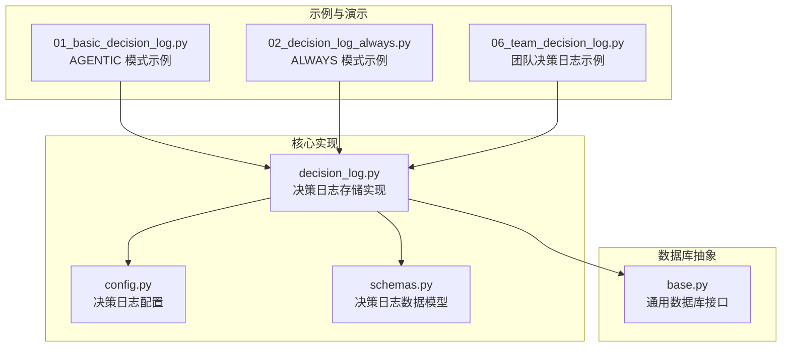
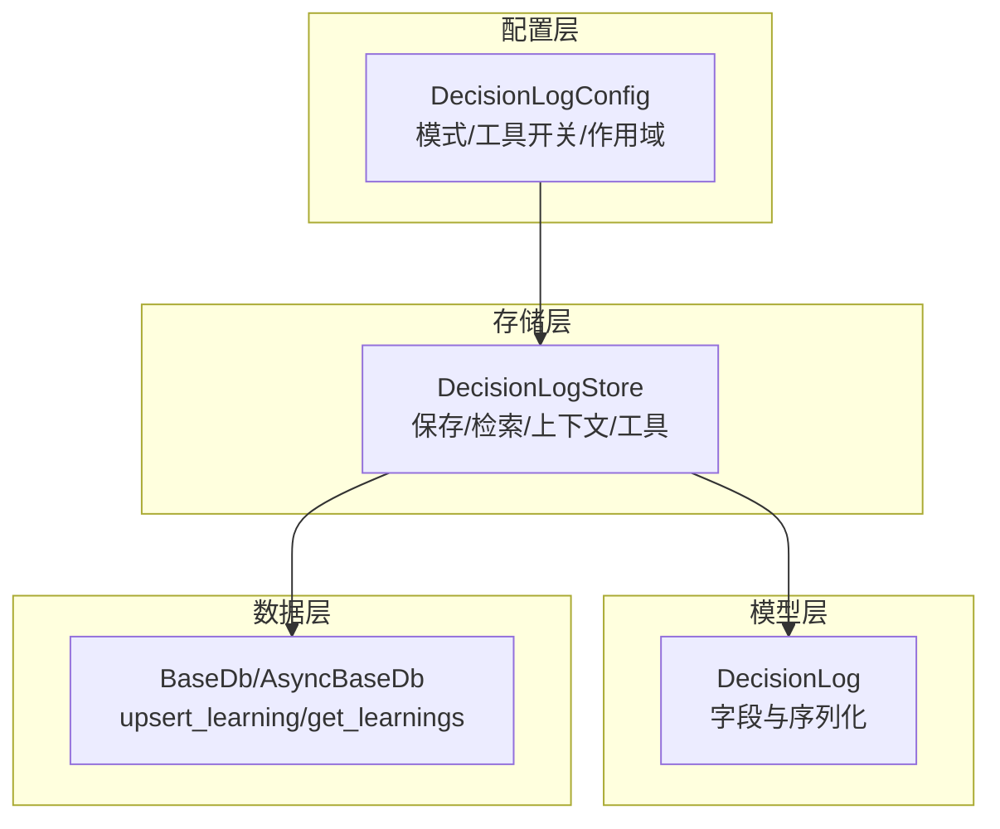
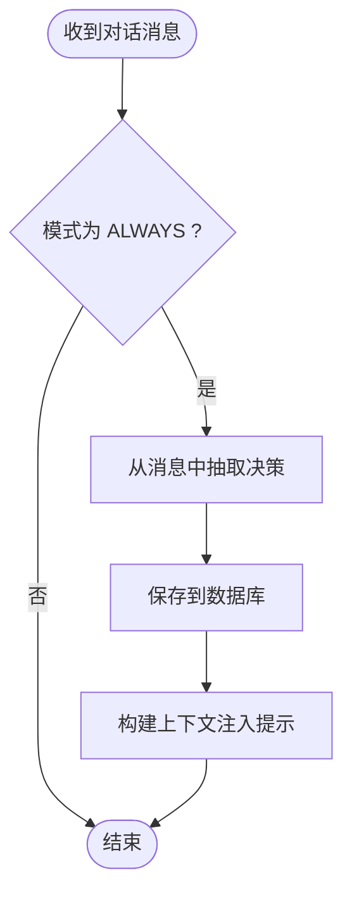
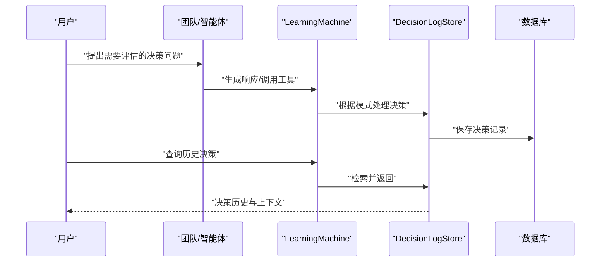
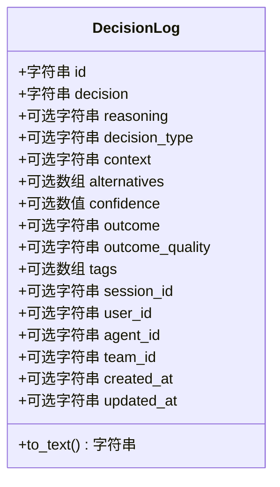
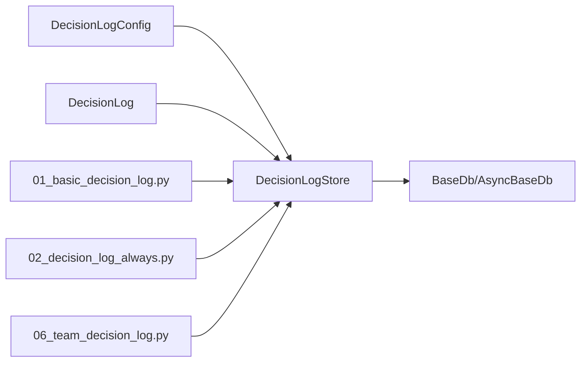

# 决策日志系统

<cite>
**本文档引用的文件**
- [01_basic_decision_log.py](file://cookbook/08_learning/09_decision_logs/01_basic_decision_log.py)
- [02_decision_log_always.py](file://cookbook/08_learning/09_decision_logs/02_decision_log_always.py)
- [06_team_decision_log.py](file://cookbook/03_teams/12_learning/06_team_decision_log.py)
- [decision_log.py](file://libs/agno/agno/learn/stores/decision_log.py)
- [config.py](file://libs/agno/agno/learn/config.py)
- [schemas.py](file://libs/agno/agno/learn/schemas.py)
- [base.py](file://libs/agno/agno/db/base.py)
</cite>

## 目录
1. [简介](#简介)
2. [项目结构](#项目结构)
3. [核心组件](#核心组件)
4. [架构总览](#架构总览)
5. [详细组件分析](#详细组件分析)
6. [依赖关系分析](#依赖关系分析)
7. [性能考虑](#性能考虑)
8. [故障排查指南](#故障排查指南)
9. [结论](#结论)
10. [附录](#附录)

## 简介
本系统提供面向智能体与团队的决策日志能力，支持两种模式：
- AGENTIC 模式：由智能体主动调用工具记录重要决策（包含推理、替代方案、上下文等），适用于高价值决策的审计与学习。
- ALWAYS 模式：框架自动从工具调用中提取决策，无需智能体显式调用工具，适用于全量工具调用追踪。

系统通过统一的学习存储接口，将决策以结构化数据持久化至数据库，并提供检索、构建上下文、反馈闭环等功能，广泛应用于模型调试、性能优化、合规审计与责任追踪。

## 项目结构
围绕决策日志的关键文件组织如下：
- 示例与演示：cookbook 中的 AGENTIC 与 ALWAYS 示例，以及团队决策日志示例
- 核心实现：决策日志存储、配置与数据模型
- 数据库抽象：通用数据库接口，支撑异步/同步访问

**图表来源**
- [01_basic_decision_log.py](file://cookbook/08_learning/09_decision_logs/01_basic_decision_log.py)
- [02_decision_log_always.py](file://cookbook/08_learning/09_decision_logs/02_decision_log_always.py)
- [06_team_decision_log.py](file://cookbook/03_teams/12_learning/06_team_decision_log.py)
- [decision_log.py](file://libs/agno/agno/learn/stores/decision_log.py)
- [config.py](file://libs/agno/agno/learn/config.py)
- [schemas.py](file://libs/agno/agno/learn/schemas.py)
- [base.py](file://libs/agno/agno/db/base.py)

**章节来源**
- [01_basic_decision_log.py](file://cookbook/08_learning/09_decision_logs/01_basic_decision_log.py)
- [02_decision_log_always.py](file://cookbook/08_learning/09_decision_logs/02_decision_log_always.py)
- [06_team_decision_log.py](file://cookbook/03_teams/12_learning/06_team_decision_log.py)
- [decision_log.py](file://libs/agno/agno/learn/stores/decision_log.py)
- [config.py](file://libs/agno/agno/learn/config.py)
- [schemas.py](file://libs/agno/agno/learn/schemas.py)
- [base.py](file://libs/agno/agno/db/base.py)

## 核心组件
- 决策日志配置（DecisionLogConfig）
  - 支持模式：ALWAYS、AGENTIC
  - 工具开关：是否暴露 log_decision、search_decisions、record_outcome 工具
  - 作用域：以 agent_id 为键进行存储与检索
- 决策日志存储（DecisionLogStore）
  - 提供保存、异步保存、检索、搜索、构建上下文、工具注册等能力
  - 在 ALWAYS 模式下从消息中抽取决策，在 AGENTIC 模式下等待工具调用
- 决策日志数据模型（DecisionLog）
  - 字段覆盖决策内容、推理、类型、上下文、替代方案、置信度、结果与标签等
  - 支持文本化便于向量检索与全文搜索
- 数据库抽象（BaseDb/AsyncBaseDb）
  - 统一 upsert_learning/get_learnings 接口，支持同步与异步实现

**章节来源**
- [config.py](file://libs/agno/agno/learn/config.py)
- [decision_log.py](file://libs/agno/agno/learn/stores/decision_log.py)
- [schemas.py](file://libs/agno/agno/learn/schemas.py)
- [base.py](file://libs/agno/agno/db/base.py)

## 架构总览
决策日志系统采用“配置驱动 + 存储实现 + 数据模型 + 数据库抽象”的分层设计，示例通过 LearningMachine 将配置注入智能体或团队，运行时根据模式自动处理决策记录与检索。

**图表来源**
- [config.py](file://libs/agno/agno/learn/config.py)
- [decision_log.py](file://libs/agno/agno/learn/stores/decision_log.py)
- [schemas.py](file://libs/agno/agno/learn/schemas.py)
- [base.py](file://libs/agno/agno/db/base.py)

## 详细组件分析

### 组件A：决策日志存储（DecisionLogStore）
- 功能要点
  - 保存与异步保存：将 DecisionLog 对象写入数据库，支持 upsert_learning
  - 检索与搜索：支持按 agent_id、session_id、决策类型、时间窗口、关键词等过滤
  - 上下文构建：将最近决策注入系统提示，辅助模型学习与一致性
  - 工具暴露：在启用时提供 log_decision、search_decisions、record_outcome 工具
  - 模式处理：ALWAYS 模式下从消息中抽取决策；AGENTIC 模式下等待工具调用
- 关键流程（ALWAYS 模式）

**图表来源**
- [decision_log.py](file://libs/agno/agno/learn/stores/decision_log.py)

**章节来源**
- [decision_log.py](file://libs/agno/agno/learn/stores/decision_log.py)

### 组件B：示例对比（AGENTIC vs ALWAYS）
- AGENTIC 模式（示例：01_basic_decision_log.py）
  - 智能体通过 log_decision 工具记录重要决策，包含推理、替代方案、上下文、置信度等
  - 适合高价值决策的审计与学习，强调“为什么这样选择”
- ALWAYS 模式（示例：02_decision_log_always.py）
  - 框架自动记录工具调用，无需智能体显式调用工具
  - 适合全量工具调用追踪，强调“做了什么选择”
- 团队决策（示例：06_team_decision_log.py）
  - 团队成员共同参与决策，使用 log_decision 记录架构、安全、合规等重大技术决策
  - 支持跨会话检索与审计

**图表来源**
- [06_team_decision_log.py](file://cookbook/03_teams/12_learning/06_team_decision_log.py)
- [01_basic_decision_log.py](file://cookbook/08_learning/09_decision_logs/01_basic_decision_log.py)
- [02_decision_log_always.py](file://cookbook/08_learning/09_decision_logs/02_decision_log_always.py)
- [decision_log.py](file://libs/agno/agno/learn/stores/decision_log.py)

**章节来源**
- [01_basic_decision_log.py](file://cookbook/08_learning/09_decision_logs/01_basic_decision_log.py)
- [02_decision_log_always.py](file://cookbook/08_learning/09_decision_logs/02_decision_log_always.py)
- [06_team_decision_log.py](file://cookbook/03_teams/12_learning/06_team_decision_log.py)

### 组件C：数据模型与上下文注入
- DecisionLog 数据模型
  - 字段覆盖决策内容、推理、类型、上下文、替代方案、置信度、结果与标签等
  - 提供 to_text 方法，便于全文检索与向量索引
- 上下文注入
  - 将最近决策以结构化文本注入系统提示，帮助模型在后续交互中保持一致性与可解释性
  - 当未启用工具时，提供引导信息，鼓励使用 log_decision 与 search_decisions

**图表来源**
- [schemas.py](file://libs/agno/agno/learn/schemas.py)

**章节来源**
- [schemas.py](file://libs/agno/agno/learn/schemas.py)
- [decision_log.py](file://libs/agno/agno/learn/stores/decision_log.py)

## 依赖关系分析
- 配置依赖
  - DecisionLogConfig 依赖 LearningMode 枚举与数据库/模型实例
- 存储依赖
  - DecisionLogStore 依赖 DecisionLogConfig、DecisionLog 数据模型与数据库抽象
- 数据库依赖
  - 通过 BaseDb/AsyncBaseDb 的 upsert_learning/get_learnings 实现统一持久化与查询
- 示例依赖
  - 示例脚本通过 LearningMachine 注入配置，驱动智能体或团队执行决策日志

**图表来源**
- [config.py](file://libs/agno/agno/learn/config.py)
- [decision_log.py](file://libs/agno/agno/learn/stores/decision_log.py)
- [schemas.py](file://libs/agno/agno/learn/schemas.py)
- [base.py](file://libs/agno/agno/db/base.py)
- [01_basic_decision_log.py](file://cookbook/08_learning/09_decision_logs/01_basic_decision_log.py)
- [02_decision_log_always.py](file://cookbook/08_learning/09_decision_logs/02_decision_log_always.py)
- [06_team_decision_log.py](file://cookbook/03_teams/12_learning/06_team_decision_log.py)

**章节来源**
- [config.py](file://libs/agno/agno/learn/config.py)
- [decision_log.py](file://libs/agno/agno/learn/stores/decision_log.py)
- [schemas.py](file://libs/agno/agno/learn/schemas.py)
- [base.py](file://libs/agno/agno/db/base.py)
- [01_basic_decision_log.py](file://cookbook/08_learning/09_decision_logs/01_basic_decision_log.py)
- [02_decision_log_always.py](file://cookbook/08_learning/09_decision_logs/02_decision_log_always.py)
- [06_team_decision_log.py](file://cookbook/03_teams/12_learning/06_team_decision_log.py)

## 性能考虑
- 存储与查询
  - 使用 upsert_learning 保证幂等写入，避免重复记录
  - 搜索时先过量拉取再过滤，减少多次往返，提高吞吐
- 上下文注入
  - 限制最近决策条数，控制提示长度，平衡上下文质量与成本
- 异步支持
  - 提供异步保存与搜索接口，适配高并发场景
- 日志级别
  - 通过 debug_mode 或环境变量切换日志级别，便于生产与调试

[本节为通用性能建议，不直接分析具体文件，故无“章节来源”]

## 故障排查指南
- 工具不可用
  - 检查 DecisionLogConfig 的工具开关（agent_can_save、agent_can_search）是否开启
  - 确认智能体已正确注入 LearningMachine 与决策日志配置
- 无法检索历史
  - 确认数据库连接正常且表存在
  - 检查过滤条件（agent_id、session_id、时间范围、关键词）是否合理
- 写入失败
  - 查看日志级别与异常输出，确认 DecisionLog 对象序列化成功
  - 检查数据库实现是否支持 upsert_learning
- 上下文未注入
  - 确认 add_learnings_to_context 开关与 _should_expose_tools 判定逻辑

**章节来源**
- [decision_log.py](file://libs/agno/agno/learn/stores/decision_log.py)
- [config.py](file://libs/agno/agno/learn/config.py)

## 结论
决策日志系统通过清晰的配置与存储抽象，实现了对智能体与团队决策的主动记录与自动追踪。AGENTIC 模式强调“为什么”，ALWAYS 模式强调“做了什么”，两者结合可满足从高价值审计到全量追踪的多样化需求。配合数据库抽象与异步能力，系统具备良好的扩展性与生产可用性。

[本节为总结性内容，不直接分析具体文件，故无“章节来源”]

## 附录

### 配置与模式速查
- AGENTIC 模式
  - 通过 log_decision 工具记录推理、替代方案、上下文与置信度
  - 适合审计、学习与行为追溯
- ALWAYS 模式
  - 自动从工具调用中抽取决策
  - 适合全量追踪与快速落地

**章节来源**
- [01_basic_decision_log.py](file://cookbook/08_learning/09_decision_logs/01_basic_decision_log.py)
- [02_decision_log_always.py](file://cookbook/08_learning/09_decision_logs/02_decision_log_always.py)

### 数据模型字段说明
- 决策标识与内容：id、decision
- 推理与上下文：reasoning、context、decision_type
- 替代方案与置信度：alternatives、confidence
- 结果与标签：outcome、outcome_quality、tags
- 作用域与时间：session_id、user_id、agent_id、team_id、created_at、updated_at

**章节来源**
- [schemas.py](file://libs/agno/agno/learn/schemas.py)