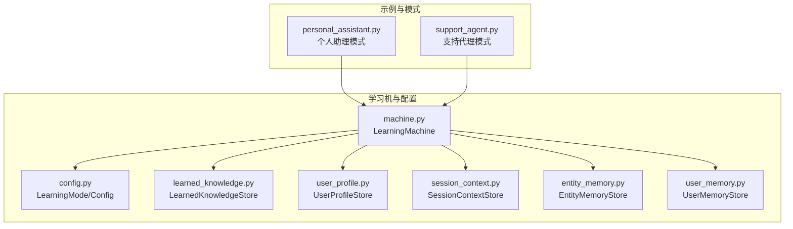
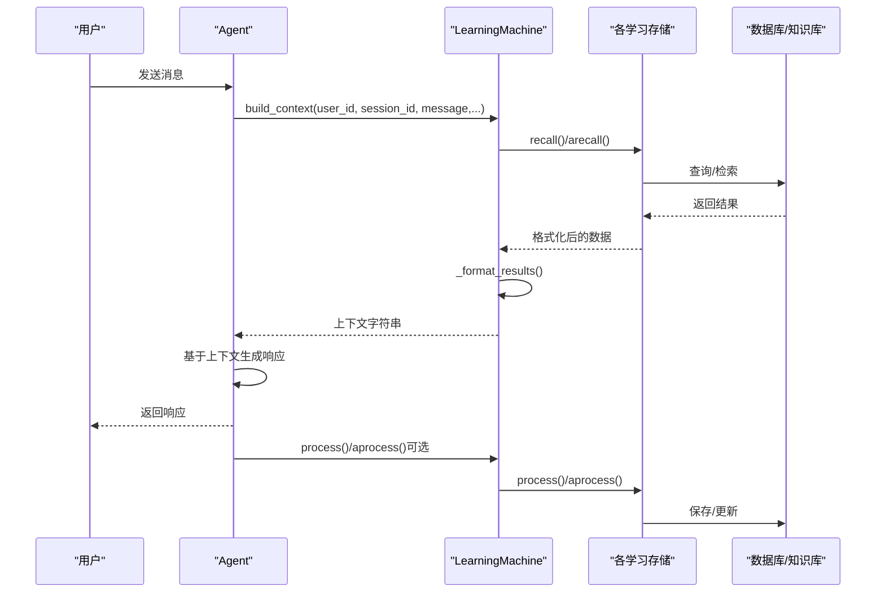
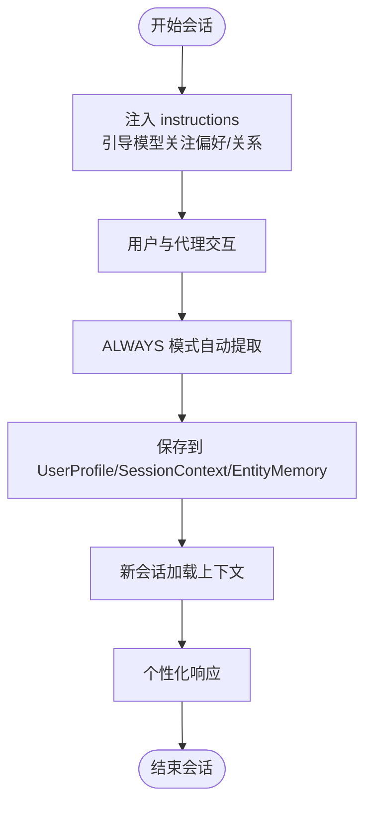
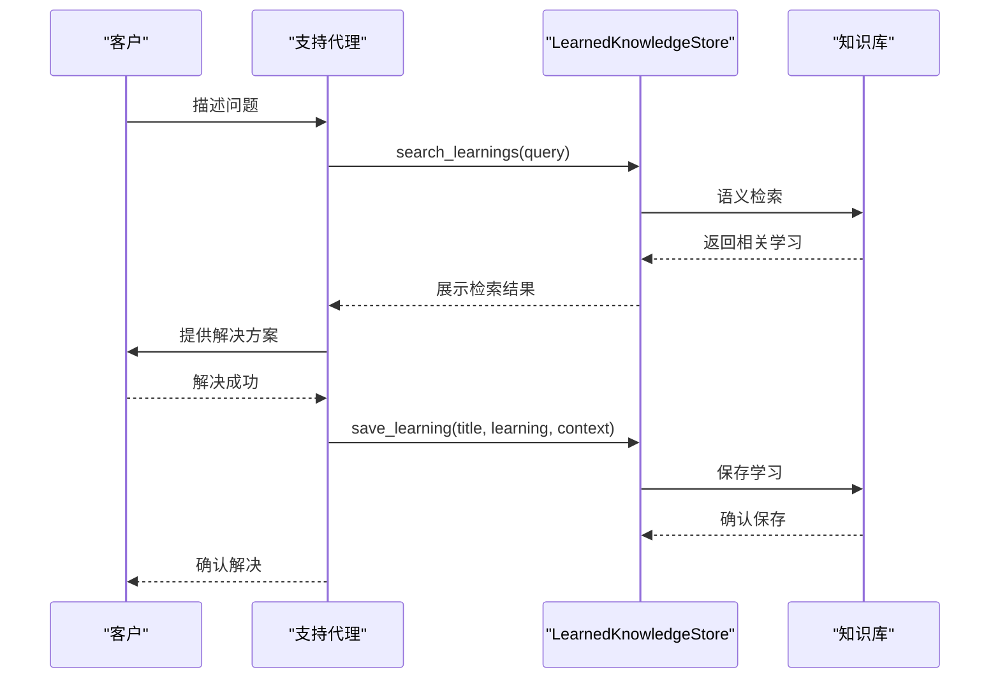
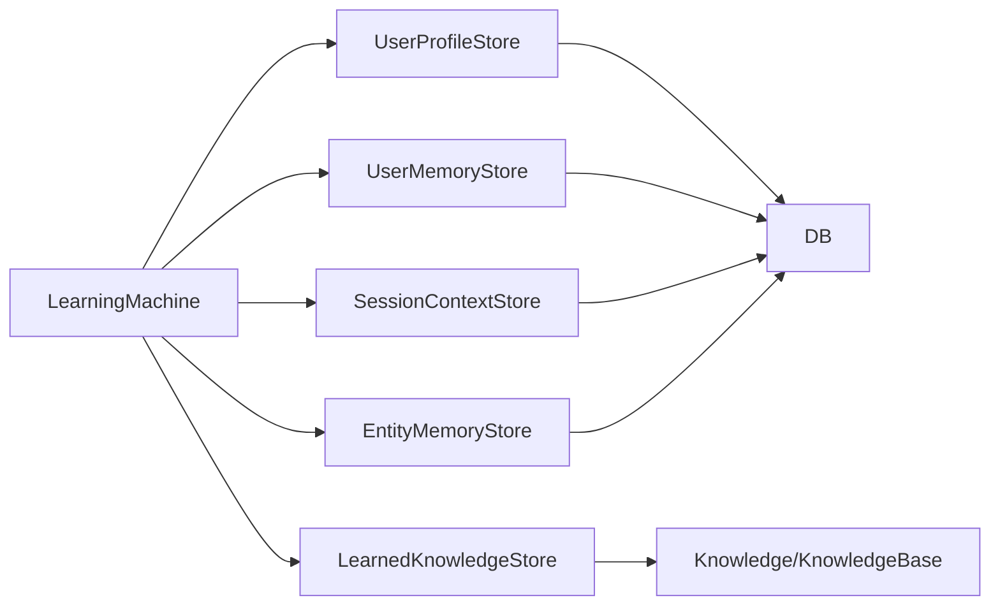

# 学习模式识别

<cite>
**本文引用的文件**
- [personal_assistant.py](file://cookbook/08_learning/07_patterns/personal_assistant.py)
- [support_agent.py](file://cookbook/08_learning/07_patterns/support_agent.py)
- [config.py](file://libs/agno/agno/learn/config.py)
- [machine.py](file://libs/agno/agno/learn/machine.py)
- [learned_knowledge.py](file://libs/agno/agno/learn/stores/learned_knowledge.py)
- [user_profile.py](file://libs/agno/agno/learn/stores/user_profile.py)
- [session_context.py](file://libs/agno/agno/learn/stores/session_context.py)
- [entity_memory.py](file://libs/agno/agno/learn/stores/entity_memory.py)
- [user_memory.py](file://libs/agno/agno/learn/stores/user_memory.py)
- [02_agentic_mode.py](file://cookbook/08_learning/02_user_profile/02_agentic_mode.py)
- [1b_user_profile_agentic.py](file://cookbook/08_learning/01_basics/1b_user_profile_agentic.py)
- [1a_user_profile_always.py](file://cookbook/08_learning/01_basics/1a_user_profile_always.py)
- [02_agentic_learn.md](file://cookbook/08_learning/00_quickstart/02_agentic_learn.md)
- [learning_machine.md](file://cookbook/03_teams/06_memory/learning_machine.md)
- [01_basic_decision_log.md](file://cookbook/08_learning/09_decision_logs/01_basic_decision_log.md)
- [state_in_router.py](file://cookbook/04_workflows/06_advanced_concepts/session_state/state_in_router.py)
- [intent_routing_with_history.py](file://cookbook/04_workflows/06_advanced_concepts/history/intent_routing_with_history.py)
</cite>

## 目录
1. [简介](#简介)
2. [项目结构](#项目结构)
3. [核心组件](#核心组件)
4. [架构总览](#架构总览)
5. [详细组件分析](#详细组件分析)
6. [依赖关系分析](#依赖关系分析)
7. [性能考虑](#性能考虑)
8. [故障排查指南](#故障排查指南)
9. [结论](#结论)
10. [附录](#附录)

## 简介
本文件围绕“学习模式识别”主题，系统梳理并阐述 Agno 学习体系中的模式识别与应用机制，重点覆盖以下方面：
- 个人助手模式与支持代理模式的实现路径与差异
- 模式识别算法与策略：行为模式分析、偏好学习、适应性调整
- 不同模式下的学习策略与参数配置：个性化程度控制、学习速度调节
- 智能客服与个性化助手的应用案例：用户行为预测、服务优化、体验提升
- 模式切换机制、性能监控与效果评估方法

## 项目结构
本仓库提供了丰富的学习模式示例与底层实现，主要分布在以下位置：
- 示例与模式：cookbook/08_learning/07_patterns 下的个人助理与支持代理示例
- 学习配置与机理：libs/agno/agno/learn 下的配置、学习机与各存储实现
- 模式对比与进阶：cookbook/08_learning/01_basics、02_user_profile、00_quickstart 等
- 团队与工作流集成：cookbook/03_teams、cookbook/04_workflows 中的路由与状态管理

图表来源
- [personal_assistant.py:34-59](file://cookbook/08_learning/07_patterns/personal_assistant.py#L34-L59)
- [support_agent.py:50-79](file://cookbook/08_learning/07_patterns/support_agent.py#L50-L79)
- [machine.py:52-95](file://libs/agno/agno/learn/machine.py#L52-L95)
- [config.py:32-45](file://libs/agno/agno/learn/config.py#L32-L45)

章节来源
- [personal_assistant.py:1-108](file://cookbook/08_learning/07_patterns/personal_assistant.py#L1-L108)
- [support_agent.py:1-124](file://cookbook/08_learning/07_patterns/support_agent.py#L1-L124)
- [machine.py:1-120](file://libs/agno/agno/learn/machine.py#L1-L120)
- [config.py:1-120](file://libs/agno/agno/learn/config.py#L1-L120)

## 核心组件
- 学习模式枚举与配置
  - LearningMode：ALWAYS、AGENTIC、PROPOSE、HITL
  - 各学习类型配置类：UserProfileConfig、UserMemoryConfig、SessionContextConfig、LearnedKnowledgeConfig、EntityMemoryConfig、DecisionLogConfig、FeedbackConfig、SelfImprovementConfig
- LearningMachine：统一协调器，负责初始化与编排各学习存储，提供上下文构建、工具暴露、处理与召回能力
- 各学习存储实现：
  - LearnedKnowledgeStore：可复用洞察的语义检索与命名空间隔离
  - UserProfileStore/UserMemoryStore：结构化/非结构化用户画像与记忆
  - SessionContextStore：会话状态摘要与规划跟踪
  - EntityMemoryStore：外部实体的事实、事件与关系图谱

章节来源
- [config.py:32-464](file://libs/agno/agno/learn/config.py#L32-L464)
- [machine.py:52-772](file://libs/agno/agno/learn/machine.py#L52-L772)
- [learned_knowledge.py:49-800](file://libs/agno/agno/learn/stores/learned_knowledge.py#L49-L800)
- [user_profile.py:60-800](file://libs/agno/agno/learn/stores/user_profile.py#L60-L800)
- [session_context.py:56-800](file://libs/agno/agno/learn/stores/session_context.py#L56-L800)
- [entity_memory.py:64-200](file://libs/agno/agno/learn/stores/entity_memory.py#L64-L200)
- [user_memory.py:55-200](file://libs/agno/agno/learn/stores/user_memory.py#L55-L200)

## 架构总览
下图展示了 LearningMachine 如何在不同模式下协调多个学习存储，并将上下文注入到代理提示词中：

图表来源
- [machine.py:350-418](file://libs/agno/agno/learn/machine.py#L350-L418)
- [machine.py:572-656](file://libs/agno/agno/learn/machine.py#L572-L656)
- [learned_knowledge.py:97-161](file://libs/agno/agno/learn/stores/learned_knowledge.py#L97-L161)
- [user_profile.py:107-125](file://libs/agno/agno/learn/stores/user_profile.py#L107-L125)
- [session_context.py:107-125](file://libs/agno/agno/learn/stores/session_context.py#L107-L125)
- [entity_memory.py:109-166](file://libs/agno/agno/learn/stores/entity_memory.py#L109-L166)

## 详细组件分析

### 个人助手模式（ALWAYS 模式）
- 设计目标：在不显式触发的情况下，持续学习并个性化用户的偏好、习惯与关系网络
- 关键特性：
  - ALWAYS 模式：自动提取用户画像、会话上下文与实体记忆
  - 多存储组合：用户画像、会话规划、实体记忆
  - 无侵入式学习：无需用户感知工具调用
- 应用流程：
  - 初始化 Agent 时启用 LearningMachine，并配置各存储为 ALWAYS
  - 通过 instructions 提示模型关注用户偏好与关系
  - 会话结束后自动进行学习提取与保存

图表来源
- [personal_assistant.py:34-59](file://cookbook/08_learning/07_patterns/personal_assistant.py#L34-L59)
- [config.py:52-104](file://libs/agno/agno/learn/config.py#L52-L104)
- [config.py:171-224](file://libs/agno/agno/learn/config.py#L171-L224)
- [config.py:290-370](file://libs/agno/agno/learn/config.py#L290-L370)

章节来源
- [personal_assistant.py:1-108](file://cookbook/08_learning/07_patterns/personal_assistant.py#L1-L108)
- [config.py:52-370](file://libs/agno/agno/learn/config.py#L52-L370)

### 支持代理模式（AGENTIC 模式）
- 设计目标：通过显式工具让代理在关键时刻决定是否保存解决方案与经验，提升透明度与可控性
- 关键特性：
  - AGENTIC 模式：代理显式调用工具保存学习
  - LearnedKnowledgeStore：语义检索与命名空间隔离（全局/组织/用户）
  - 与实体记忆结合：共享产品、工单等上下文
- 应用流程：
  - 创建支持代理时启用 LearnedKnowledgeConfig(mode=AGENTIC)
  - 代理在解决问题后调用 search_learnings 与 save_learning
  - 新用户遇到类似问题时，代理可检索并复用已有方案

图表来源
- [support_agent.py:50-79](file://cookbook/08_learning/07_patterns/support_agent.py#L50-L79)
- [learned_knowledge.py:248-311](file://libs/agno/agno/learn/stores/learned_knowledge.py#L248-L311)
- [learned_knowledge.py:731-800](file://libs/agno/agno/learn/stores/learned_knowledge.py#L731-L800)

章节来源
- [support_agent.py:1-124](file://cookbook/08_learning/07_patterns/support_agent.py#L1-L124)
- [learned_knowledge.py:1-800](file://libs/agno/agno/learn/stores/learned_knowledge.py#L1-L800)

### 模式识别算法与策略
- 行为模式分析
  - 通过 SessionContextStore 的规划模式（enable_planning）跟踪目标、计划与进度，形成行为轨迹
  - 通过 LearnedKnowledgeStore 的语义检索，发现跨会话的重复模式与最佳实践
- 偏好学习
  - UserProfileStore 与 UserMemoryStore 分别处理结构化偏好与非结构化观察
  - AGENTIC 模式下通过工具显式更新；ALWAYS 模式下自动提取
- 适应性调整
  - LearningMachine 的 build_context 将多源上下文融合，指导代理在不同场景下自适应
  - 通过命名空间控制 LearnedKnowledge 的共享边界，平衡个性化与复用

章节来源
- [session_context.py:171-224](file://libs/agno/agno/learn/stores/session_context.py#L171-L224)
- [learned_knowledge.py:230-388](file://libs/agno/agno/learn/stores/learned_knowledge.py#L230-L388)
- [user_profile.py:183-261](file://libs/agno/agno/learn/stores/user_profile.py#L183-L261)
- [user_memory.py:173-200](file://libs/agno/agno/learn/stores/user_memory.py#L173-L200)

### 参数配置与个性化控制
- 学习模式选择
  - ALWAYS：适合需要无感学习与高覆盖率的场景（如个人助理）
  - AGENTIC：适合强调可控性与可审计性的场景（如支持代理）
  - PROPOSE/HITL：预留模式，用于未来的人机协作与审批流程
- 命名空间与共享边界
  - LearnedKnowledgeStore 与 EntityMemoryStore 支持 namespace 控制（user/global/custom）
  - 通过 namespace 精细控制学习的可见范围
- 学习速度与质量
  - 通过配置 enable_planning、enable_agent_tools、schema 等参数，调节学习的粒度与质量
  - 通过 instructions 与 additional_instructions，引导模型提取更高质量的内容

章节来源
- [config.py:228-286](file://libs/agno/agno/learn/config.py#L228-L286)
- [config.py:290-370](file://libs/agno/agno/learn/config.py#L290-L370)
- [learned_knowledge.py:56-60](file://libs/agno/agno/learn/stores/learned_knowledge.py#L56-L60)
- [entity_memory.py:24-35](file://libs/agno/agno/learn/stores/entity_memory.py#L24-L35)

### 智能客服与个性化助手应用案例
- 智能客服
  - 场景：用户反复遇到登录问题
  - 流程：代理检索过往解决方案 → 提供方案 → 成功后保存学习 → 新用户遇到相似问题时自动检索复用
- 个性化助手
  - 场景：用户偏好简洁要点格式
  - 流程：代理自动提取偏好 → 保存到 UserProfile → 后续响应自然应用该偏好

章节来源
- [support_agent.py:86-124](file://cookbook/08_learning/07_patterns/support_agent.py#L86-L124)
- [02_agentic_mode.py:24-37](file://cookbook/08_learning/02_user_profile/02_agentic_mode.py#L24-L37)
- [1b_user_profile_agentic.py:26-37](file://cookbook/08_learning/01_basics/1b_user_profile_agentic.py#L26-L37)
- [1a_user_profile_always.py:26-38](file://cookbook/08_learning/01_basics/1a_user_profile_always.py#L26-L38)

### 模式切换机制
- 切换方式
  - 通过修改 LearningMachine 的配置（如 user_profile/learned_knowledge 的 mode）实现运行时切换
  - 在团队或工作流中，可通过不同的 Agent 实例或会话状态变量实现模式切换
- 切换示例
  - 基于会话状态的路由：根据交互次数或用户偏好动态选择技术专家或友好助手
  - 基于历史的路由：共享对话历史，使后续步骤能够延续上下文

章节来源
- [state_in_router.py:34-107](file://cookbook/04_workflows/06_advanced_concepts/session_state/state_in_router.py#L34-L107)
- [intent_routing_with_history.py:120-181](file://cookbook/04_workflows/06_advanced_concepts/history/intent_routing_with_history.py#L120-L181)

## 依赖关系分析
- LearningMachine 作为中枢，依赖各学习存储实现
- 各存储依赖数据库与模型（可选）进行读写与提取
- LearnedKnowledgeStore 依赖知识库（向量数据库）进行语义检索
- 模式配置类贯穿于存储初始化与工具生成

图表来源
- [machine.py:111-162](file://libs/agno/agno/learn/machine.py#L111-L162)
- [learned_knowledge.py:456-463](file://libs/agno/agno/learn/stores/learned_knowledge.py#L456-L463)
- [user_profile.py:344-352](file://libs/agno/agno/learn/stores/user_profile.py#L344-L352)
- [session_context.py:254-256](file://libs/agno/agno/learn/stores/session_context.py#L254-L256)
- [entity_memory.py:57-61](file://libs/agno/agno/learn/stores/entity_memory.py#L57-L61)

章节来源
- [machine.py:1-120](file://libs/agno/agno/learn/machine.py#L1-L120)
- [learned_knowledge.py:1-120](file://libs/agno/agno/learn/stores/learned_knowledge.py#L1-L120)
- [user_profile.py:1-120](file://libs/agno/agno/learn/stores/user_profile.py#L1-L120)
- [session_context.py:1-120](file://libs/agno/agno/learn/stores/session_context.py#L1-L120)
- [entity_memory.py:1-120](file://libs/agno/agno/learn/stores/entity_memory.py#L1-L120)

## 性能考虑
- 检索效率
  - LearnedKnowledgeStore 使用向量检索，建议合理设置命名空间过滤与查询关键词，减少无关匹配
- 存储开销
  - ALWAYS 模式下频繁提取与保存可能带来额外开销，建议在高并发场景中评估数据库与模型调用频率
- 上下文长度
  - build_context 会聚合多源上下文，注意控制每源返回数量（如 learned_knowledge 的 limit），避免上下文过长影响响应时间
- 异步处理
  - 提供异步版本的 recall/process/tools 获取，可在高吞吐场景中提升并发能力

## 故障排查指南
- 模式不支持
  - 某些存储不支持特定模式（如 UserProfileStore 不支持 PROPOSE/HITL），初始化时会发出警告
- 缺少必要依赖
  - LearnedKnowledgeStore 需要知识库实例；若未提供，搜索与保存将无法执行
- 命名空间访问
  - user 命名空间需要 user_id；否则检索会返回空结果并给出警告
- 工具不可用
  - 若未启用 agent_tools，对应存储不会暴露工具；需检查 enable_agent_tools 与 agent_can_* 配置

章节来源
- [user_profile.py:85-92](file://libs/agno/agno/learn/stores/user_profile.py#L85-L92)
- [learned_knowledge.py:751-754](file://libs/agno/agno/learn/stores/learned_knowledge.py#L751-L754)
- [learned_knowledge.py:123-127](file://libs/agno/agno/learn/stores/learned_knowledge.py#L123-L127)
- [machine.py:420-465](file://libs/agno/agno/learn/machine.py#L420-L465)

## 结论
本文件系统性地梳理了 Agno 学习模式识别的实现与应用，展示了个人助理与支持代理两种典型模式的差异与适用场景。通过 LearningMachine 的统一编排与多存储的协同，系统能够在不同模式下实现行为模式分析、偏好学习与适应性调整，并提供命名空间与工具配置等手段实现个性化与可控性平衡。结合智能客服与个性化助手的实际案例，可以有效提升用户体验与服务效率。

## 附录
- 进一步阅读
  - AGENTIC 模式的用户画像更新示例与深入讲解
  - 团队场景下的学习机配置与跨会话个性化
  - 决策日志与反馈配置（预留阶段）的思路与作用域

章节来源
- [02_agentic_learn.md:1-17](file://cookbook/08_learning/00_quickstart/02_agentic_learn.md#L1-L17)
- [learning_machine.md:1-62](file://cookbook/03_teams/06_memory/learning_machine.md#L1-L62)
- [01_basic_decision_log.md:1-43](file://cookbook/08_learning/09_decision_logs/01_basic_decision_log.md#L1-L43)