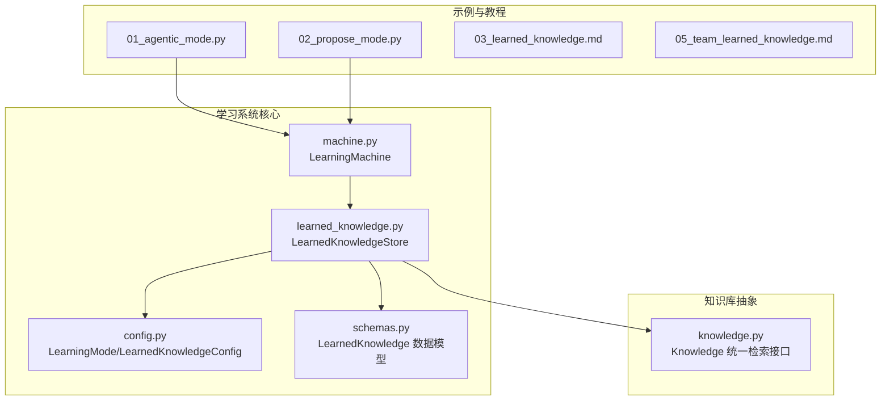
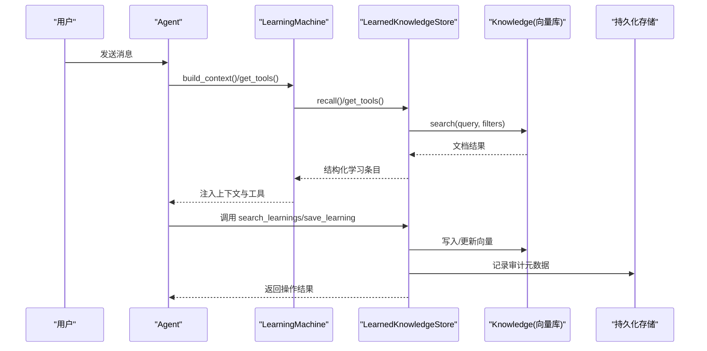
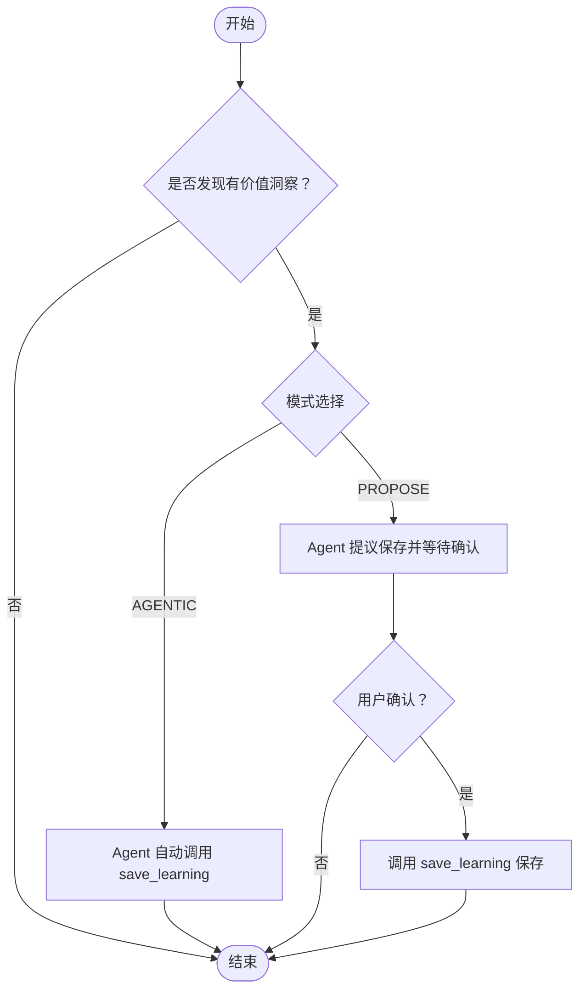
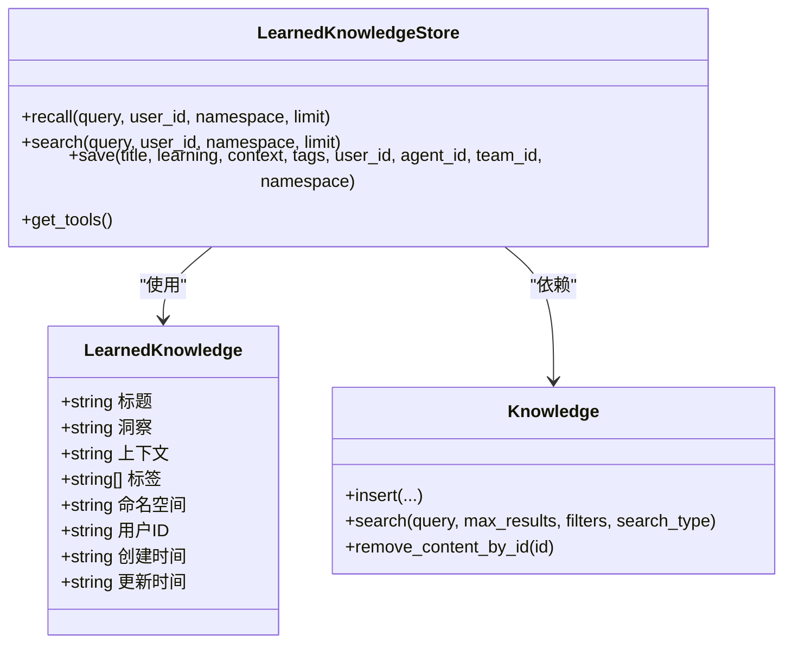
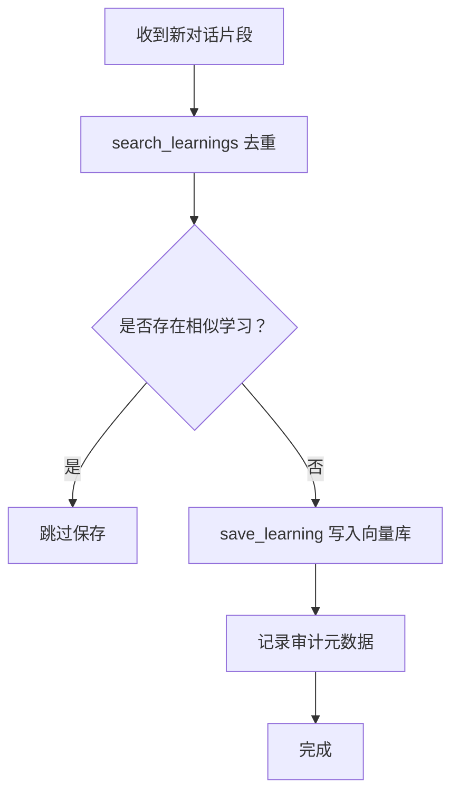
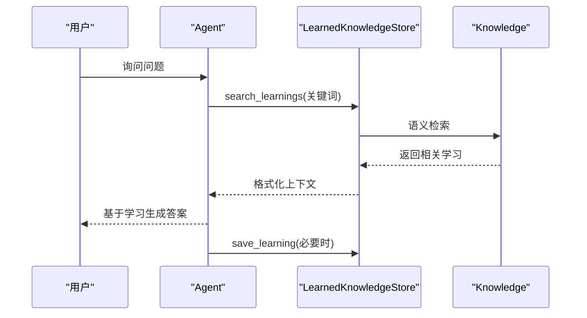
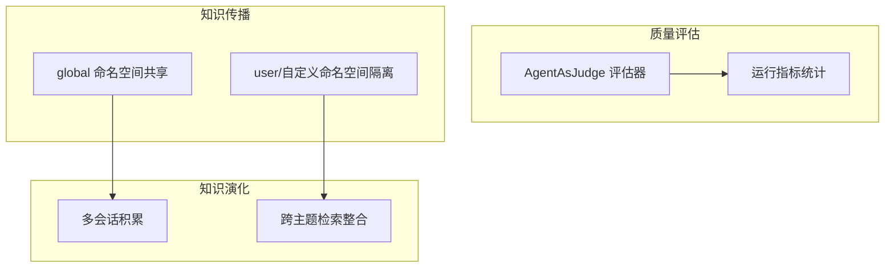
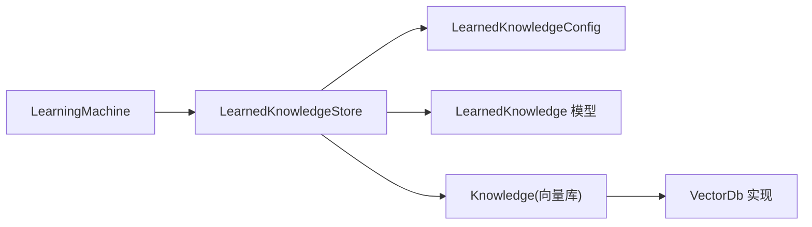

# 学习知识管理

<cite>
**本文引用的文件**
- [01_agentic_mode.py](file://cookbook/08_learning/05_learned_knowledge/01_agentic_mode.py)
- [02_propose_mode.py](file://cookbook/08_learning/05_learned_knowledge/02_propose_mode.py)
- [learned_knowledge.py](file://libs/agno/agno/learn/stores/learned_knowledge.py)
- [config.py](file://libs/agno/agno/learn/config.py)
- [machine.py](file://libs/agno/agno/learn/machine.py)
- [schemas.py](file://libs/agno/agno/learn/schemas.py)
- [knowledge.py](file://libs/agno/agno/knowledge/knowledge.py)
- [03_learned_knowledge.md](file://cookbook/08_learning/00_quickstart/03_learned_knowledge.md)
- [05_team_learned_knowledge.md](file://cookbook/03_teams/12_learning/05_team_learned_knowledge.md)
- [05_learned_knowledge.md](file://cookbook/08_learning/05_learned_knowledge/05_learned_knowledge.md)
</cite>

## 目录
1. [简介](#简介)
2. [项目结构](#项目结构)
3. [核心组件](#核心组件)
4. [架构总览](#架构总览)
5. [详细组件分析](#详细组件分析)
6. [依赖分析](#依赖分析)
7. [性能考虑](#性能考虑)
8. [故障排查指南](#故障排查指南)
9. [结论](#结论)
10. [附录](#附录)

## 简介
本文件面向“学习知识管理系统”，围绕 learned_knowledge 的两种模式（agentic mode 与 propose mode）展开，系统性阐述知识提取算法、知识更新机制、检索与推理应用、质量评估与演化等能力，并结合示例演示如何在智能问答系统中落地使用。

## 项目结构
- 示例与教程位于 cookbook/08_learning/05_learned_knowledge，包含 agentic 与 propose 两种模式的完整示例脚本与说明。
- 核心实现位于 libs/agno/agno/learn 下，涵盖配置、学习机协调器、存储层与数据模型。
- 知识库抽象位于 libs/agno/agno/knowledge，提供统一的向量检索接口与隔离搜索能力。

**图表来源**
- [01_agentic_mode.py:1-104](file://cookbook/08_learning/05_learned_knowledge/01_agentic_mode.py#L1-L104)
- [02_propose_mode.py:1-112](file://cookbook/08_learning/05_learned_knowledge/02_propose_mode.py#L1-L112)
- [config.py:32-464](file://libs/agno/agno/learn/config.py#L32-L464)
- [machine.py:52-772](file://libs/agno/agno/learn/machine.py#L52-L772)
- [learned_knowledge.py:1-800](file://libs/agno/agno/learn/stores/learned_knowledge.py#L1-L800)
- [schemas.py:419-497](file://libs/agno/agno/learn/schemas.py#L419-L497)
- [knowledge.py:40-800](file://libs/agno/agno/knowledge/knowledge.py#L40-L800)

**章节来源**
- [01_agentic_mode.py:1-104](file://cookbook/08_learning/05_learned_knowledge/01_agentic_mode.py#L1-L104)
- [02_propose_mode.py:1-112](file://cookbook/08_learning/05_learned_knowledge/02_propose_mode.py#L1-L112)
- [config.py:32-464](file://libs/agno/agno/learn/config.py#L32-L464)
- [machine.py:52-772](file://libs/agno/agno/learn/machine.py#L52-L772)
- [learned_knowledge.py:1-800](file://libs/agno/agno/learn/stores/learned_knowledge.py#L1-L800)
- [schemas.py:419-497](file://libs/agno/agno/learn/schemas.py#L419-L497)
- [knowledge.py:40-800](file://libs/agno/agno/knowledge/knowledge.py#L40-L800)

## 核心组件
- LearningMode/LearnedKnowledgeConfig：定义学习模式（ALWAYS/AGENTIC/PROPOSE/HITL）与 learned_knowledge 的配置项（知识库、命名空间、工具开关、提示词定制等）。
- LearningMachine：统一协调多个学习存储（用户画像、会话上下文、实体记忆、已学知识），提供构建上下文、工具注入、处理与维护等能力。
- LearnedKnowledgeStore：实现 learned_knowledge 的存储与检索，提供 save_learning 与 search_learnings 两大工具；支持命名空间隔离与异步操作。
- Knowledge：统一的知识库抽象，封装向量检索、内容管理与隔离搜索（isolate_vector_search）。
- LearnedKnowledge 数据模型：标准化知识条目的字段（标题、洞察、上下文、标签、命名空间等）。

**章节来源**
- [config.py:32-464](file://libs/agno/agno/learn/config.py#L32-L464)
- [machine.py:52-772](file://libs/agno/agno/learn/machine.py#L52-L772)
- [learned_knowledge.py:1-800](file://libs/agno/agno/learn/stores/learned_knowledge.py#L1-L800)
- [knowledge.py:40-800](file://libs/agno/agno/knowledge/knowledge.py#L40-L800)
- [schemas.py:419-497](file://libs/agno/agno/learn/schemas.py#L419-L497)

## 架构总览
learned_knowledge 在系统中的位置与交互如下：

**图表来源**
- [machine.py:350-496](file://libs/agno/agno/learn/machine.py#L350-L496)
- [learned_knowledge.py:481-725](file://libs/agno/agno/learn/stores/learned_knowledge.py#L481-L725)
- [knowledge.py:507-590](file://libs/agno/agno/knowledge/knowledge.py#L507-L590)

## 详细组件分析

### learned_knowledge 的两种模式：agentic mode 与 propose mode
- AGENTIC 模式
  - Agent 自主决定何时保存与检索学习；系统注入 save_learning 与 search_learnings 工具。
  - 场景：追求自动化与效率，适合高价值、可复用的洞察自动沉淀。
- PROPOSE 模式
  - Agent 先向用户提议保存，经用户确认后再执行保存；强调质量控制与可解释性。
  - 场景：对准确性与合规性要求较高，或希望保留人类决策痕迹。

**图表来源**
- [01_agentic_mode.py:40-55](file://cookbook/08_learning/05_learned_knowledge/01_agentic_mode.py#L40-L55)
- [02_propose_mode.py:41-55](file://cookbook/08_learning/05_learned_knowledge/02_propose_mode.py#L41-L55)
- [learned_knowledge.py:241-367](file://libs/agno/agno/learn/stores/learned_knowledge.py#L241-L367)

**章节来源**
- [01_agentic_mode.py:1-104](file://cookbook/08_learning/05_learned_knowledge/01_agentic_mode.py#L1-L104)
- [02_propose_mode.py:1-112](file://cookbook/08_learning/05_learned_knowledge/02_propose_mode.py#L1-L112)
- [learned_knowledge.py:241-367](file://libs/agno/agno/learn/stores/learned_knowledge.py#L241-L367)

### 知识提取算法：关键信息识别、知识分类与结构化存储
- 关键信息识别
  - LearnedKnowledgeStore 在 ALWAYS 模式下通过模型抽取“可复用洞察”与“组织上下文”两类信息，遵循非显而易见、可复用、可行动、持久性的原则。
- 知识分类
  - 以 LearnedKnowledge 数据模型为核心，包含标题、洞察、上下文、标签等字段；支持按命名空间（user/global/自定义）进行分类与隔离。
- 结构化存储
  - 通过 Knowledge 抽象对接向量数据库，将文本转换为向量并写入；同时在 contents_db 中记录元数据与审计信息。

**图表来源**
- [schemas.py:419-497](file://libs/agno/agno/learn/schemas.py#L419-L497)
- [learned_knowledge.py:481-725](file://libs/agno/agno/learn/stores/learned_knowledge.py#L481-L725)
- [knowledge.py:507-590](file://libs/agno/agno/knowledge/knowledge.py#L507-L590)

**章节来源**
- [learned_knowledge.py:1183-1212](file://libs/agno/agno/learn/stores/learned_knowledge.py#L1183-L1212)
- [schemas.py:419-497](file://libs/agno/agno/learn/schemas.py#L419-L497)
- [knowledge.py:507-590](file://libs/agno/agno/knowledge/knowledge.py#L507-L590)

### 知识更新机制：增量学习、知识融合与冲突解决
- 增量学习
  - AGENTIC/PROPOSE 模式下，Agent 在对话过程中调用 search_learnings 去重后保存新洞察；ALWAYS 模式下由后台模型自动抽取并保存。
- 知识融合
  - LearnedKnowledgeStore 在检索阶段支持命名空间过滤与后过滤，确保不同用户/团队知识的边界清晰；Knowledge 支持隔离搜索（isolate_vector_search）避免跨实例干扰。
- 冲突解决
  - 通过去重策略（检索重复后不保存）、命名空间隔离与审计字段（agent_id/team_id/user_id）实现冲突最小化与可追溯。

**图表来源**
- [learned_knowledge.py:731-779](file://libs/agno/agno/learn/stores/learned_knowledge.py#L731-L779)
- [learned_knowledge.py:553-596](file://libs/agno/agno/learn/stores/learned_knowledge.py#L553-L596)
- [knowledge.py:531-540](file://libs/agno/agno/knowledge/knowledge.py#L531-L540)

**章节来源**
- [learned_knowledge.py:731-779](file://libs/agno/agno/learn/stores/learned_knowledge.py#L731-L779)
- [learned_knowledge.py:553-596](file://libs/agno/agno/learn/stores/learned_knowledge.py#L553-L596)
- [knowledge.py:531-540](file://libs/agno/agno/knowledge/knowledge.py#L531-L540)

### 知识管理在智能问答系统中的应用示例
- 知识检索
  - Agent 在回答前调用 search_learnings，结合历史对话与当前问题进行语义检索，将相关学习注入系统提示。
- 推理应用
  - 将检索到的学习条目格式化后注入上下文，指导模型在具体场景中应用已有经验。
- 答案生成
  - 在 AGENTIC/PROPOSE 模式下，Agent 可直接保存新学习，形成“边问边学”的闭环。

**图表来源**
- [03_learned_knowledge.md:61-81](file://cookbook/08_learning/00_quickstart/03_learned_knowledge.md#L61-L81)
- [learned_knowledge.py:647-725](file://libs/agno/agno/learn/stores/learned_knowledge.py#L647-L725)
- [knowledge.py:507-590](file://libs/agno/agno/knowledge/knowledge.py#L507-L590)

**章节来源**
- [03_learned_knowledge.md:1-81](file://cookbook/08_learning/00_quickstart/03_learned_knowledge.md#L1-L81)
- [learned_knowledge.py:647-725](file://libs/agno/agno/learn/stores/learned_knowledge.py#L647-L725)
- [knowledge.py:507-590](file://libs/agno/agno/knowledge/knowledge.py#L507-L590)

### 高级功能：知识质量评估、知识传播与知识演化
- 知识质量评估
  - 可通过评估器（如 AgentAsJudge）对回答质量进行打分与归档，结合运行指标统计（主模型与评估模型的 token 使用）进行成本与效果分析。
- 知识传播
  - LearnedKnowledgeConfig 的命名空间默认为 global，实现跨用户/团队共享；也可按 user 或自定义命名空间进行隔离传播。
- 知识演化
  - 通过团队协作示例（多会话积累、跨主题检索与综合回答）体现知识在使用中不断演进与整合。

**图表来源**
- [05_team_learned_knowledge.md:42-72](file://cookbook/03_teams/12_learning/05_team_learned_knowledge.md#L42-L72)
- [config.py:228-287](file://libs/agno/agno/learn/config.py#L228-L287)

**章节来源**
- [05_team_learned_knowledge.md:1-72](file://cookbook/03_teams/12_learning/05_team_learned_knowledge.md#L1-L72)
- [config.py:228-287](file://libs/agno/agno/learn/config.py#L228-L287)

## 依赖分析
- LearningMachine 统一调度各学习存储，LearnedKnowledgeStore 依赖 Knowledge 进行向量检索，LearnedKnowledge 数据模型作为标准结构贯穿保存与检索。
- Knowledge 支持隔离搜索（isolate_vector_search），通过 linked_to 元数据实现多实例共享同一向量库时的检索隔离。

**图表来源**
- [machine.py:104-163](file://libs/agno/agno/learn/machine.py#L104-L163)
- [learned_knowledge.py:70-80](file://libs/agno/agno/learn/stores/learned_knowledge.py#L70-L80)
- [knowledge.py:40-800](file://libs/agno/agno/knowledge/knowledge.py#L40-L800)

**章节来源**
- [machine.py:104-163](file://libs/agno/agno/learn/machine.py#L104-L163)
- [learned_knowledge.py:70-80](file://libs/agno/agno/learn/stores/learned_knowledge.py#L70-L80)
- [knowledge.py:40-800](file://libs/agno/agno/knowledge/knowledge.py#L40-L800)

## 性能考虑
- 检索性能
  - 使用混合检索（向量 + BM25）提升召回质量与速度；合理设置 max_results 与 filters。
- 存储与隔离
  - 启用 isolate_vector_search 并为 Knowledge 实例设置 name，可减少无关向量扫描，提高检索效率。
- 异步接口
  - 提供异步插入与检索（ainsert/asearch），在高并发场景下降低阻塞。

[本节为通用指导，无需特定文件引用]

## 故障排查指南
- 知识库未配置
  - 若未提供 Knowledge 实例，LearnedKnowledgeStore.search 会返回空结果并记录警告；请检查配置。
- 命名空间访问
  - user 命名空间需提供 user_id；否则返回空结果。
- 搜索隔离
  - 多实例共享向量库时，启用 isolate_vector_search 并设置 name，确保检索仅限于当前实例插入的内容。

**章节来源**
- [learned_knowledge.py:751-753](file://libs/agno/agno/learn/stores/learned_knowledge.py#L751-L753)
- [learned_knowledge.py:124-126](file://libs/agno/agno/learn/stores/learned_knowledge.py#L124-L126)
- [knowledge.py:531-540](file://libs/agno/agno/knowledge/knowledge.py#L531-L540)

## 结论
learned_knowledge 通过 AGENTIC 与 PROPOSE 两种模式实现了“自动化学习”与“可控学习”的平衡；借助 LearnedKnowledgeStore 与 Knowledge 的协同，系统在语义检索、命名空间隔离与审计追踪方面具备良好工程化能力。结合团队协作与评估体系，可实现知识的质量保障、高效传播与持续演化。

[本节为总结性内容，无需特定文件引用]

## 附录
- 示例参考
  - AGENTIC 模式示例：[01_agentic_mode.py:1-104](file://cookbook/08_learning/05_learned_knowledge/01_agentic_mode.py#L1-L104)
  - PROPOSE 模式示例：[02_propose_mode.py:1-112](file://cookbook/08_learning/05_learned_knowledge/02_propose_mode.py#L1-L112)
- 配置与数据模型
  - 配置项与模式定义：[config.py:32-464](file://libs/agno/agno/learn/config.py#L32-L464)
  - 数据模型：[schemas.py:419-497](file://libs/agno/agno/learn/schemas.py#L419-L497)
- 知识库抽象
  - 统一检索与隔离搜索：[knowledge.py:507-590](file://libs/agno/agno/knowledge/knowledge.py#L507-L590)

[本节为补充材料，无需特定文件引用]