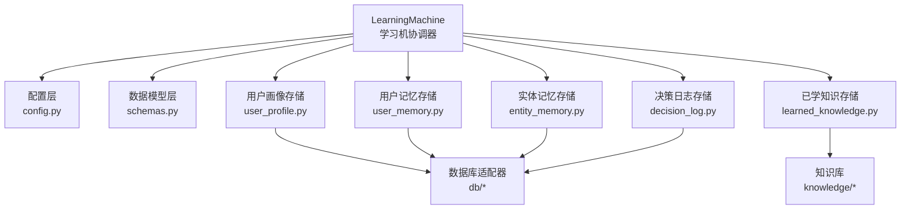
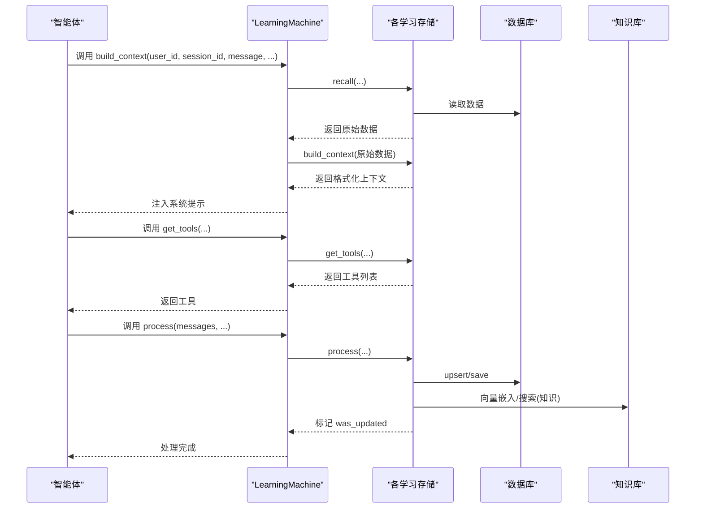
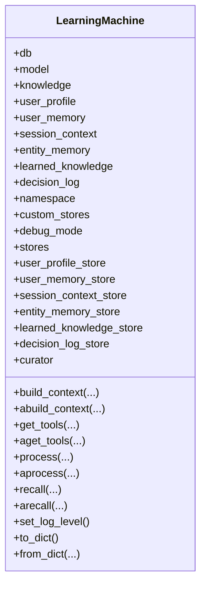
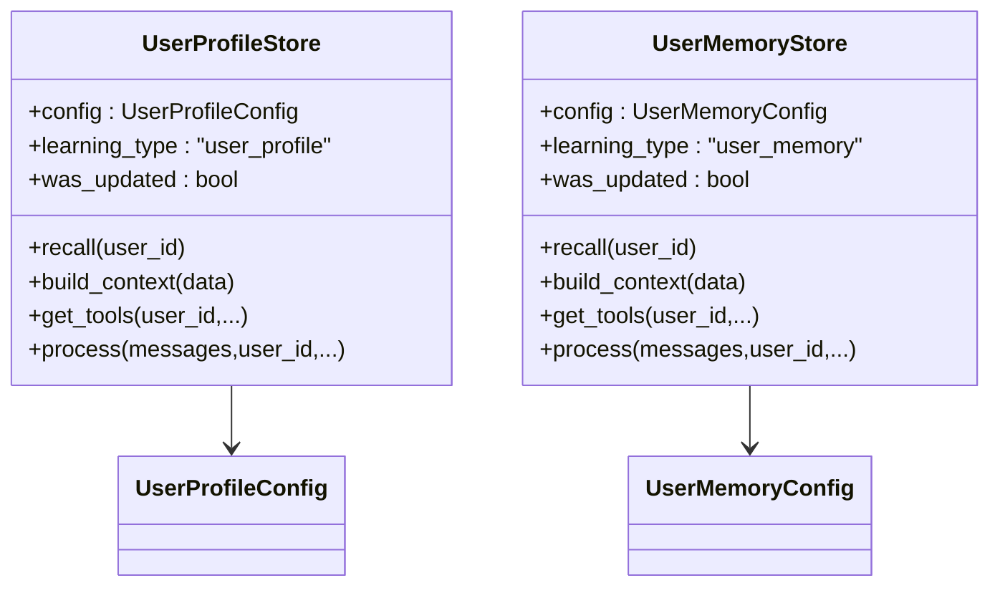
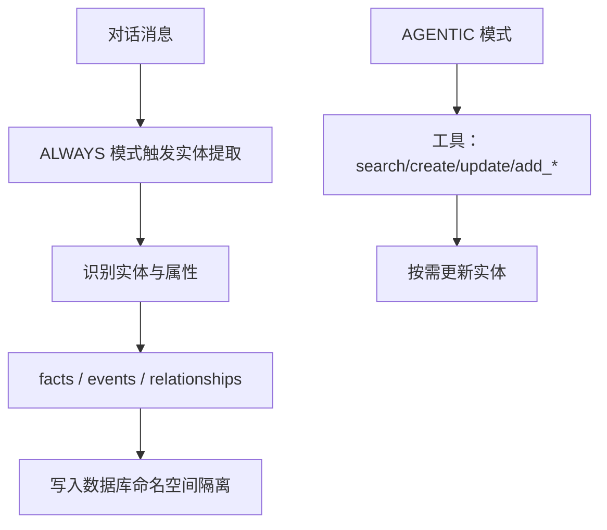
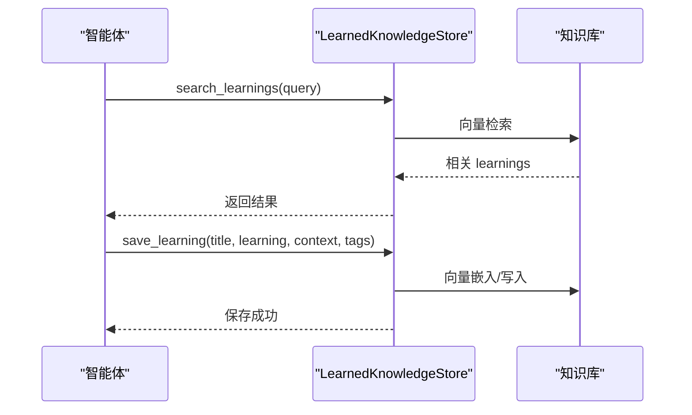
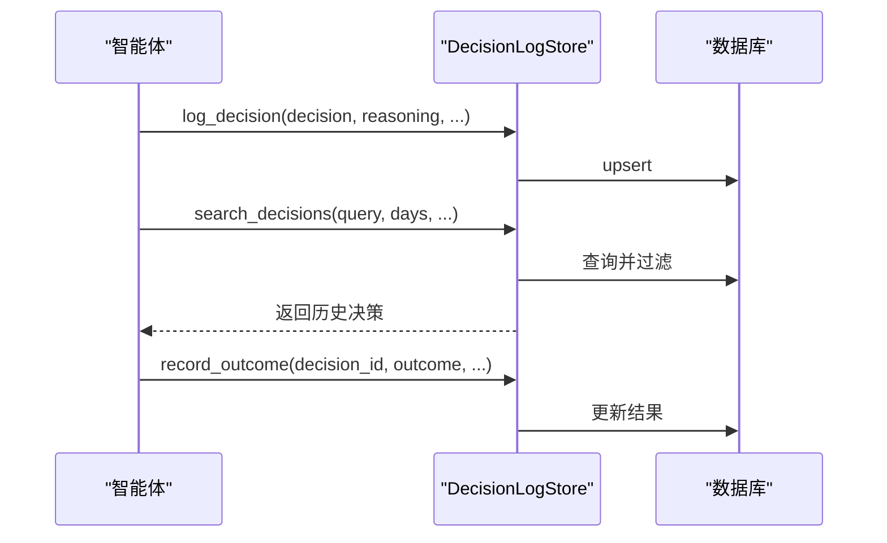
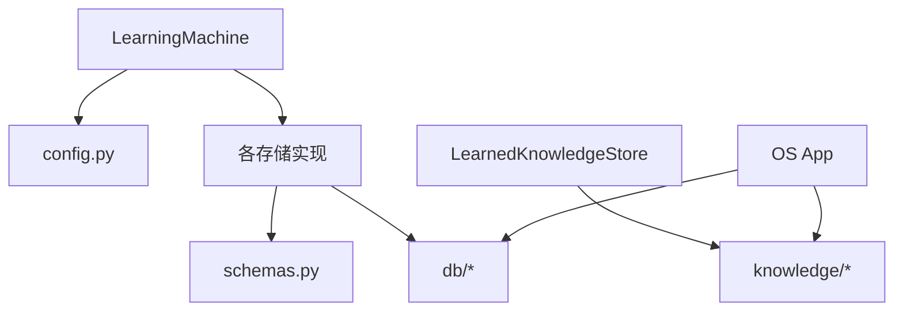

# 学习系统

<cite>
**本文引用的文件**
- [libs/agno/agno/learn/machine.py](file://libs/agno/agno/learn/machine.py)
- [libs/agno/agno/learn/config.py](file://libs/agno/agno/learn/config.py)
- [libs/agno/agno/learn/schemas.py](file://libs/agno/agno/learn/schemas.py)
- [libs/agno/agno/learn/stores/user_profile.py](file://libs/agno/agno/learn/stores/user_profile.py)
- [libs/agno/agno/learn/stores/user_memory.py](file://libs/agno/agno/learn/stores/user_memory.py)
- [libs/agno/agno/learn/stores/entity_memory.py](file://libs/agno/agno/learn/stores/entity_memory.py)
- [libs/agno/agno/learn/stores/learned_knowledge.py](file://libs/agno/agno/learn/stores/learned_knowledge.py)
- [libs/agno/agno/learn/stores/decision_log.py](file://libs/agno/agno/learn/stores/decision_log.py)
- [libs/agno/agno/knowledge/__init__.py](file://libs/agno/agno/knowledge/__init__.py)
- [libs/agno/agno/db/surrealdb/surrealdb.py](file://libs/agno/agno/db/surrealdb/surrealdb.py)
- [libs/agno/agno/db/in_memory/in_memory_db.py](file://libs/agno/agno/db/in_memory/in_memory_db.py)
- [libs/agno/agno/os/app.py](file://libs/agno/agno/os/app.py)
- [cookbook/08_learning/01_basics/5a_entity_memory_always.md](file://cookbook/08_learning/01_basics/5a_entity_memory_always.md)
- [cookbook/08_learning/04_entity_memory/01_facts_and_events.md](file://cookbook/08_learning/04_entity_memory/01_facts_and_events.md)
- [cookbook/08_learning/09_decision_logs/01_basic_decision_log.md](file://cookbook/08_learning/09_decision_logs/01_basic_decision_log.md)
- [cookbook/03_teams/12_learning/06_team_decision_log.md](file://cookbook/03_teams/12_learning/06_team_decision_log.md)
</cite>

## 目录
1. [简介](#简介)
2. [项目结构](#项目结构)
3. [核心组件](#核心组件)
4. [架构总览](#架构总览)
5. [详细组件分析](#详细组件分析)
6. [依赖分析](#依赖分析)
7. [性能考虑](#性能考虑)
8. [故障排查指南](#故障排查指南)
9. [结论](#结论)
10. [附录](#附录)

## 简介
Agno Learn 是一套面向智能体的统一学习系统，围绕“学习机（LearningMachine）”构建，支持多类型学习存储：用户画像、用户记忆、会话上下文、实体记忆、已学知识与决策日志。系统提供灵活的提取模式（ALWAYS/AGENTIC/PROPOSE/HITL），可按需启用或禁用各存储模块，并通过工具接口将学习能力无缝注入到智能体工作流中。本文档聚焦以下主题：
- 自学习配置与使用：如何启用与组合多存储模块
- 用户画像构建：画像数据收集、动态更新与个性化策略
- 实体记忆管理：实体识别、关系建立与记忆巩固
- 知识提取与管理：知识分类、更新与传播
- 会话上下文学习：上下文分析、情感识别与行为模式识别
- 高级功能：快速测试、模式识别、自定义存储与决策日志

## 项目结构
学习系统主要位于 libs/agno/agno/learn 目录下，采用“配置 + 存储 + 模型/数据库”的分层设计：
- 配置层：定义各学习类型的配置枚举与参数
- 存储层：实现具体学习类型的持久化与工具生成
- 协调层：LearningMachine 统一编排各存储模块
- 知识与数据库：知识库与数据库适配器
- 示例与用法：cookbook 中提供丰富的实战示例

图表来源
- [libs/agno/agno/learn/machine.py:52-162](file://libs/agno/agno/learn/machine.py#L52-L162)
- [libs/agno/agno/learn/config.py:32-464](file://libs/agno/agno/learn/config.py#L32-L464)
- [libs/agno/agno/learn/schemas.py:59-787](file://libs/agno/agno/learn/schemas.py#L59-L787)
- [libs/agno/agno/learn/stores/user_profile.py:61-100](file://libs/agno/agno/learn/stores/user_profile.py#L61-L100)
- [libs/agno/agno/learn/stores/user_memory.py:56-95](file://libs/agno/agno/learn/stores/user_memory.py#L56-L95)
- [libs/agno/agno/learn/stores/entity_memory.py:65-107](file://libs/agno/agno/learn/stores/entity_memory.py#L65-L107)
- [libs/agno/agno/learn/stores/learned_knowledge.py:50-95](file://libs/agno/agno/learn/stores/learned_knowledge.py#L50-L95)
- [libs/agno/agno/learn/stores/decision_log.py:50-83](file://libs/agno/agno/learn/stores/decision_log.py#L50-L83)

章节来源
- [libs/agno/agno/learn/machine.py:52-162](file://libs/agno/agno/learn/machine.py#L52-L162)
- [libs/agno/agno/learn/config.py:32-464](file://libs/agno/agno/learn/config.py#L32-L464)

## 核心组件
- LearningMachine：统一学习协调器，负责初始化与编排各学习存储，提供构建上下文、获取工具、处理对话与召回数据的能力。
- 配置层：定义 LearningMode 枚举与各学习类型的配置类（UserProfileConfig、UserMemoryConfig、SessionContextConfig、EntityMemoryConfig、LearnedKnowledgeConfig、DecisionLogConfig）。
- 存储层：实现具体学习类型的数据结构与操作（增删改查、工具生成、上下文构建、异步接口等）。
- 数据模型层：定义 UserProfile、Memories、SessionContext、EntityMemory、LearnedKnowledge 等数据结构及序列化/反序列化方法。
- 知识库与数据库：知识库用于向量检索；数据库适配器用于持久化。

章节来源
- [libs/agno/agno/learn/machine.py:52-772](file://libs/agno/agno/learn/machine.py#L52-L772)
- [libs/agno/agno/learn/config.py:32-464](file://libs/agno/agno/learn/config.py#L32-L464)
- [libs/agno/agno/learn/schemas.py:59-787](file://libs/agno/agno/learn/schemas.py#L59-L787)

## 架构总览
LearningMachine 作为中央协调器，根据配置创建并管理各学习存储实例，提供统一的 API：
- build_context/abuild_context：基于当前上下文（用户、会话、实体、知识）组装系统提示
- get_tools/aget_tools：按启用的存储动态生成工具集合
- process/aprocess：在对话结束后进行学习提取与保存
- recall/arecall：从各存储召回原始数据
- curator：内存维护（剪枝、去重等）

图表来源
- [libs/agno/agno/learn/machine.py:350-567](file://libs/agno/agno/learn/machine.py#L350-L567)
- [libs/agno/agno/learn/stores/learned_knowledge.py:731-800](file://libs/agno/agno/learn/stores/learned_knowledge.py#L731-L800)

## 详细组件分析

### LearningMachine 组件
- 初始化与懒加载：按需创建各存储实例，支持布尔、配置对象与存储实例混合输入
- 存储编排：统一暴露 recall/build_context/get_tools/process 等接口
- 异步支持：提供 a* 对应的异步版本
- 调试与序列化：支持调试日志级别设置与配置序列化/反序列化

图表来源
- [libs/agno/agno/learn/machine.py:52-162](file://libs/agno/agno/learn/machine.py#L52-L162)
- [libs/agno/agno/learn/machine.py:311-344](file://libs/agno/agno/learn/machine.py#L311-L344)

章节来源
- [libs/agno/agno/learn/machine.py:52-772](file://libs/agno/agno/learn/machine.py#L52-L772)

### 用户画像（UserProfile）与用户记忆（UserMemory）
- 用户画像（UserProfile）：结构化长期档案，支持 ALWAYS/AGENTIC 模式，可通过工具动态更新字段
- 用户记忆（UserMemory）：非结构化观察与偏好，支持 ALWAYS/AGENTIC 模式，提供增删改查与文本化上下文

图表来源
- [libs/agno/agno/learn/stores/user_profile.py:61-100](file://libs/agno/agno/learn/stores/user_profile.py#L61-L100)
- [libs/agno/agno/learn/stores/user_memory.py:56-95](file://libs/agno/agno/learn/stores/user_memory.py#L56-L95)
- [libs/agno/agno/learn/config.py:52-163](file://libs/agno/agno/learn/config.py#L52-L163)

章节来源
- [libs/agno/agno/learn/stores/user_profile.py:61-800](file://libs/agno/agno/learn/stores/user_profile.py#L61-L800)
- [libs/agno/agno/learn/stores/user_memory.py:56-800](file://libs/agno/agno/learn/stores/user_memory.py#L56-L800)
- [libs/agno/agno/learn/config.py:52-163](file://libs/agno/agno/learn/config.py#L52-L163)

### 会话上下文（SessionContext）
- 会话上下文捕获当前会话的状态、目标、计划与进度，支持 ALWAYS/AGENTIC/PROPOSE/HITL 模式
- 支持规划模式（goal/plan/progress）与工具生成

章节来源
- [libs/agno/agno/learn/config.py:171-224](file://libs/agno/agno/learn/config.py#L171-L224)
- [libs/agno/agno/learn/schemas.py:308-411](file://libs/agno/agno/learn/schemas.py#L308-L411)

### 实体记忆（EntityMemory）
- 三类记忆：事实（facts）、事件（events）、关系（relationships）
- 支持命名空间控制（user/global/custom），AGENTIC/ALWAYS 模式
- 提供实体搜索、创建、更新、添加事实/事件/关系等工具

图表来源
- [libs/agno/agno/learn/stores/entity_memory.py:65-107](file://libs/agno/agno/learn/stores/entity_memory.py#L65-L107)
- [libs/agno/agno/learn/config.py:290-370](file://libs/agno/agno/learn/config.py#L290-L370)

章节来源
- [libs/agno/agno/learn/stores/entity_memory.py:65-800](file://libs/agno/agno/learn/stores/entity_memory.py#L65-L800)
- [cookbook/08_learning/01_basics/5a_entity_memory_always.md:1-146](file://cookbook/08_learning/01_basics/5a_entity_memory_always.md#L1-L146)
- [cookbook/08_learning/04_entity_memory/01_facts_and_events.md:1-74](file://cookbook/08_learning/04_entity_memory/01_facts_and_events.md#L1-L74)

### 已学知识（LearnedKnowledge）
- 可复用的洞察与模式，支持 AGENTIC/PROPOSE/ALWAYS 模式
- 提供 search_learnings 与 save_learning 工具，支持命名空间（global/user/custom）
- 通过知识库进行语义检索与向量化存储

图表来源
- [libs/agno/agno/learn/stores/learned_knowledge.py:481-547](file://libs/agno/agno/learn/stores/learned_knowledge.py#L481-L547)
- [libs/agno/agno/learn/stores/learned_knowledge.py:731-800](file://libs/agno/agno/learn/stores/learned_knowledge.py#L731-L800)

章节来源
- [libs/agno/agno/learn/stores/learned_knowledge.py:50-800](file://libs/agno/agno/learn/stores/learned_knowledge.py#L50-L800)
- [libs/agno/agno/knowledge/__init__.py:1-9](file://libs/agno/agno/knowledge/__init__.py#L1-L9)

### 决策日志（DecisionLog）
- 记录智能体的重要决策、理由、上下文与结果，支持 AGENTIC/ALWAYS 模式
- 提供 log_decision、search_decisions、record_outcome 工具，支持按 agent_id/session_id 查询

图表来源
- [libs/agno/agno/learn/stores/decision_log.py:410-474](file://libs/agno/agno/learn/stores/decision_log.py#L410-L474)
- [libs/agno/agno/learn/stores/decision_log.py:702-783](file://libs/agno/agno/learn/stores/decision_log.py#L702-L783)

章节来源
- [libs/agno/agno/learn/stores/decision_log.py:50-800](file://libs/agno/agno/learn/stores/decision_log.py#L50-L800)
- [cookbook/08_learning/09_decision_logs/01_basic_decision_log.md:1-43](file://cookbook/08_learning/09_decision_logs/01_basic_decision_log.md#L1-L43)
- [cookbook/03_teams/12_learning/06_team_decision_log.md:41-75](file://cookbook/03_teams/12_learning/06_team_decision_log.md#L41-L75)

## 依赖分析
- 学习机依赖：配置层、存储协议、数据库与模型接口
- 存储依赖：各自配置、数据模型、数据库与知识库
- 知识库依赖：知识库协议与实现（如向量检索）
- 数据库依赖：同步/异步数据库适配器（如 PostgreSQL/SurrealDB/内存）

图表来源
- [libs/agno/agno/learn/machine.py:19-29](file://libs/agno/agno/learn/machine.py#L19-L29)
- [libs/agno/agno/learn/stores/learned_knowledge.py:45-48](file://libs/agno/agno/learn/stores/learned_knowledge.py#L45-L48)
- [libs/agno/agno/os/app.py:1141-1172](file://libs/agno/agno/os/app.py#L1141-L1172)

章节来源
- [libs/agno/agno/learn/machine.py:19-41](file://libs/agno/agno/learn/machine.py#L19-L41)
- [libs/agno/agno/os/app.py:1141-1172](file://libs/agno/agno/os/app.py#L1141-L1172)

## 性能考虑
- 模式选择：ALWAYS 模式适合需要后台自动提取的场景，但会增加计算与存储开销；AGENTIC 模式更可控，适合高精度与低开销需求
- 命名空间与过滤：合理使用命名空间（user/global/custom）与过滤条件，减少检索范围
- 异步接口：在高并发场景优先使用异步版本（aget_tools/aprocess/asearch 等）
- 知识库向量化：对大规模知识库建议使用高效的向量检索与缓存策略
- 数据库批量写入：批量 upsert/save 减少往返次数

## 故障排查指南
- 日志级别：通过 set_log_level 或环境变量 AGNO_DEBUG 控制调试日志
- 存储状态：检查 was_updated 标志判断是否发生更新
- 数据库一致性：确保知识库与数据库的 upsert/delete 接口正确实现
- 知识库命名冲突：OS App 在初始化知识库时会校验重复名称，避免内容隔离问题

章节来源
- [libs/agno/agno/learn/machine.py:698-705](file://libs/agno/agno/learn/machine.py#L698-L705)
- [libs/agno/agno/db/surrealdb/surrealdb.py:1258-1273](file://libs/agno/agno/db/surrealdb/surrealdb.py#L1258-L1273)
- [libs/agno/agno/db/in_memory/in_memory_db.py:912-944](file://libs/agno/agno/db/in_memory/in_memory_db.py#L912-L944)
- [libs/agno/agno/os/app.py:1141-1172](file://libs/agno/agno/os/app.py#L1141-L1172)

## 结论
Agno Learn 通过 LearningMachine 将多类型学习存储统一编排，结合灵活的提取模式与工具接口，实现了从用户画像、实体记忆到已学知识与决策日志的全链路自学习能力。开发者可根据业务需求选择合适的模式与存储组合，并借助知识库与数据库适配器实现高效、可扩展的学习系统。

## 附录
- 快速测试：参考 cookbook 中的示例脚本，快速验证各学习类型的启用与工具调用
- 模式识别：通过配置中的 LearningMode 与工具文档，指导智能体在不同阶段选择合适的学习策略
- 自定义存储：通过 custom_stores 参数注入自定义实现，满足特殊场景需求
- 决策日志：利用 log_decision 与 search_decisions 构建审计与反馈闭环

章节来源
- [cookbook/08_learning/01_basics/5a_entity_memory_always.md:1-146](file://cookbook/08_learning/01_basics/5a_entity_memory_always.md#L1-L146)
- [cookbook/08_learning/04_entity_memory/01_facts_and_events.md:1-74](file://cookbook/08_learning/04_entity_memory/01_facts_and_events.md#L1-L74)
- [cookbook/08_learning/09_decision_logs/01_basic_decision_log.md:1-43](file://cookbook/08_learning/09_decision_logs/01_basic_decision_log.md#L1-L43)
- [cookbook/03_teams/12_learning/06_team_decision_log.md:41-75](file://cookbook/03_teams/12_learning/06_team_decision_log.md#L41-L75)