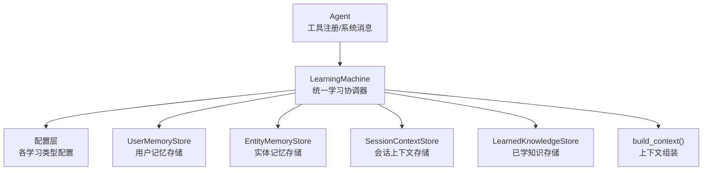
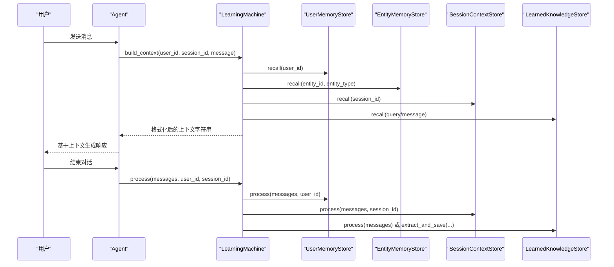
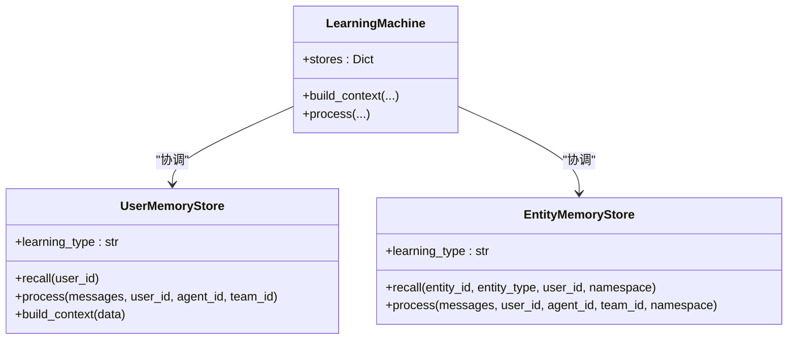
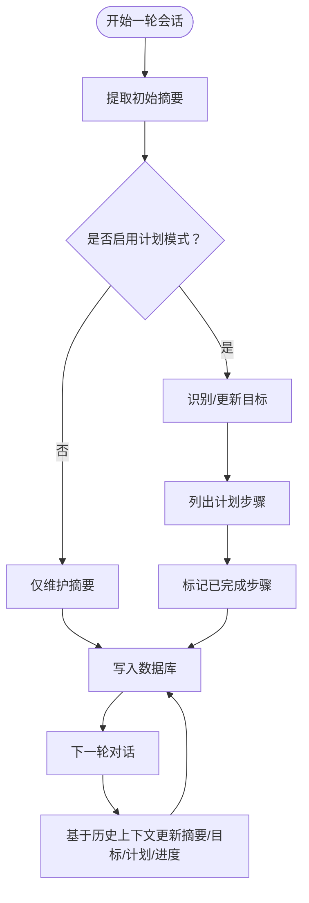
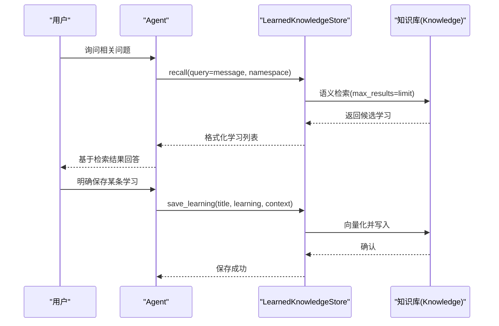
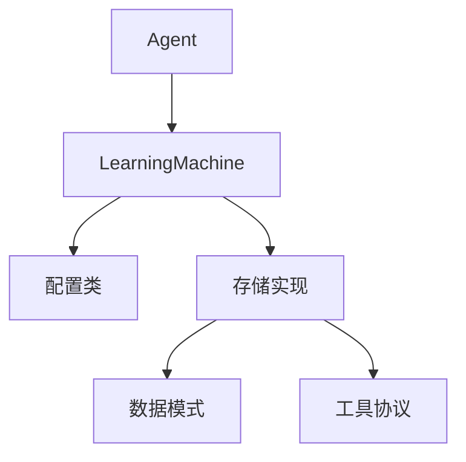

# 学习系统基础功能

<cite>
**本文档引用的文件**
- [libs/agno/agno/learn/config.py](file://libs/agno/agno/learn/config.py)
- [libs/agno/agno/learn/machine.py](file://libs/agno/agno/learn/machine.py)
- [libs/agno/agno/learn/schemas.py](file://libs/agno/agno/learn/schemas.py)
- [libs/agno/agno/learn/stores/user_memory.py](file://libs/agno/agno/learn/stores/user_memory.py)
- [libs/agno/agno/learn/stores/entity_memory.py](file://libs/agno/agno/learn/stores/entity_memory.py)
- [libs/agno/agno/learn/stores/session_context.py](file://libs/agno/agno/learn/stores/session_context.py)
- [libs/agno/agno/learn/stores/learned_knowledge.py](file://libs/agno/agno/learn/stores/learned_knowledge.py)
- [libs/agno/agno/learn/utils.py](file://libs/agno/agno/learn/utils.py)
- [libs/agno/agno/agent/agent.py](file://libs/agno/agno/agent/agent.py)
- [cookbook/08_learning/00_quickstart/01_always_learn.py](file://cookbook/08_learning/00_quickstart/01_always_learn.py)
- [cookbook/08_learning/00_quickstart/02_agentic_learn.py](file://cookbook/08_learning/00_quickstart/02_agentic_learn.py)
- [cookbook/08_learning/00_quickstart/03_learned_knowledge.py](file://cookbook/08_learning/00_quickstart/03_learned_knowledge.py)
- [cookbook/08_learning/01_basics/2b_user_memory_agentic.md](file://cookbook/08_learning/01_basics/2b_user_memory_agentic.md)
- [cookbook/08_learning/01_basics/3b_session_context_planning.md](file://cookbook/08_learning/01_basics/3b_session_context_planning.md)
- [cookbook/03_teams/12_learning/04_team_session_planning.md](file://cookbook/03_teams/12_learning/04_team_session_planning.md)
</cite>

## 目录
1. [简介](#简介)
2. [项目结构](#项目结构)
3. [核心组件](#核心组件)
4. [架构总览](#架构总览)
5. [详细组件分析](#详细组件分析)
6. [依赖分析](#依赖分析)
7. [性能考虑](#性能考虑)
8. [故障排除指南](#故障排除指南)
9. [结论](#结论)
10. [附录](#附录)

## 简介
本文件面向学习系统的基础功能模块，围绕以下主题进行系统化说明：
- 用户记忆与实体记忆的实现原理与差异
- always 模式与 agentic 模式的区别、行为特征与使用场景
- 会话上下文学习（含摘要与计划模式）的实现机制
- learned_knowledge 的提取、分类与存储策略
- 配置参数与代码示例路径，覆盖用户画像、实体记忆、会话上下文与学习知识等核心功能
- 性能优化建议与最佳实践

## 项目结构
学习系统位于 agno 库的 learn 子系统中，采用“统一学习协调器 + 多存储后端”的架构设计：
- 统一入口：LearningMachine 负责协调各学习存储、工具生成与上下文构建
- 配置层：各学习类型的配置类定义模式、提示词、权限与命名空间
- 存储层：针对不同学习类型（用户画像、用户记忆、会话上下文、实体记忆、已学知识）提供独立的存储实现
- 工具与消息集成：通过 Agent 的工具注册与系统消息拼装，将学习上下文注入到推理流程

图表来源
- [libs/agno/agno/learn/machine.py:52-162](file://libs/agno/agno/learn/machine.py#L52-L162)
- [libs/agno/agno/learn/config.py:32-464](file://libs/agno/agno/learn/config.py#L32-L464)

章节来源
- [libs/agno/agno/learn/machine.py:52-162](file://libs/agno/agno/learn/machine.py#L52-L162)
- [libs/agno/agno/learn/config.py:32-464](file://libs/agno/agno/learn/config.py#L32-L464)

## 核心组件
- LearningMode：定义学习提取模式（ALWAYS、AGENTIC、PROPOSE、HITL）
- LearningMachine：统一协调器，负责存储初始化、工具聚合、上下文构建与处理流程
- 各学习类型配置类：UserProfileConfig、UserMemoryConfig、SessionContextConfig、LearnedKnowledgeConfig、EntityMemoryConfig
- 学习存储实现：UserMemoryStore、EntityMemoryStore、SessionContextStore、LearnedKnowledgeStore
- 数据模式：UserProfile、Memories、SessionContext、LearnedKnowledge、EntityMemory

章节来源
- [libs/agno/agno/learn/config.py:32-464](file://libs/agno/agno/learn/config.py#L32-L464)
- [libs/agno/agno/learn/machine.py:52-162](file://libs/agno/agno/learn/machine.py#L52-L162)
- [libs/agno/agno/learn/schemas.py:59-200](file://libs/agno/agno/learn/schemas.py#L59-L200)

## 架构总览
学习系统的运行时流程如下：
- Agent 初始化时注入 LearningMachine
- 每次对话前，LearningMachine 根据 user_id、session_id、message 等上下文召回各存储结果，并格式化为系统提示词的一部分
- 对话结束后，LearningMachine 对各存储执行处理（ALWAYS 模式自动提取），或等待 AGENTIC 模式下的工具调用
- 会话上下文支持“摘要 + 目标 + 计划 + 进度”结构化追踪（enable_planning）

图表来源
- [libs/agno/agno/learn/machine.py:350-566](file://libs/agno/agno/learn/machine.py#L350-L566)
- [libs/agno/agno/learn/stores/user_memory.py:117-148](file://libs/agno/agno/learn/stores/user_memory.py#L117-L148)
- [libs/agno/agno/learn/stores/session_context.py:726-1248](file://libs/agno/agno/learn/stores/session_context.py#L726-L1248)
- [libs/agno/agno/learn/stores/learned_knowledge.py:163-200](file://libs/agno/agno/learn/stores/learned_knowledge.py#L163-L200)

## 详细组件分析

### 用户记忆（UserMemory）与实体记忆（EntityMemory）对比
- 用户记忆（UserMemory）
  - 存储非结构化的用户观察与上下文，跨会话持久化
  - 支持 ALWAYS 与 AGENTIC 模式；ALWAYS 模式自动提取，AGENTIC 模式通过工具显式保存
  - 作用域：按 user_id 隔离
- 实体记忆（EntityMemory）
  - 存储外部实体（公司、项目、产品、概念、系统等）的知识
  - 支持事实（facts）、事件（events）、关系（relationships）三类记忆
  - 支持 ALWAYS 与 AGENTIC 模式；ALWAYS 模式自动提取，AGENTIC 模式通过工具显式管理
  - 作用域：entity_id + entity_type + namespace（user/global/custom）

图表来源
- [libs/agno/agno/learn/stores/user_memory.py:56-200](file://libs/agno/agno/learn/stores/user_memory.py#L56-L200)
- [libs/agno/agno/learn/stores/entity_memory.py:65-200](file://libs/agno/agno/learn/stores/entity_memory.py#L65-L200)
- [libs/agno/agno/learn/machine.py:311-340](file://libs/agno/agno/learn/machine.py#L311-L340)

章节来源
- [libs/agno/agno/learn/stores/user_memory.py:56-200](file://libs/agno/agno/learn/stores/user_memory.py#L56-L200)
- [libs/agno/agno/learn/stores/entity_memory.py:65-200](file://libs/agno/agno/learn/stores/entity_memory.py#L65-L200)

### always 模式与 agentic 模式的区别与使用场景
- ALWAYS 模式
  - 行为：对话结束后自动触发后台提取，无需人工干预
  - 优点：开箱即用，覆盖面广
  - 缺点：可能产生冗余或不必要信息，缺乏精细控制
  - 典型场景：快速原型、需要全面记忆积累的场景
- AGENTIC 模式
  - 行为：通过工具显式保存/更新/删除记忆，Agent 主动决定何时提取
  - 优点：可控性强、可解释性高、避免噪声
  - 缺点：需要模型具备“自我反思”能力，工具调用需明确
  - 典型场景：强调隐私与审慎的领域、需要人类可观测性的应用

章节来源
- [libs/agno/agno/learn/config.py:32-45](file://libs/agno/agno/learn/config.py#L32-L45)
- [cookbook/08_learning/00_quickstart/01_always_learn.py:1-56](file://cookbook/08_learning/00_quickstart/01_always_learn.py#L1-L56)
- [cookbook/08_learning/00_quickstart/02_agentic_learn.py:1-62](file://cookbook/08_learning/00_quickstart/02_agentic_learn.py#L1-L62)
- [cookbook/08_learning/01_basics/2b_user_memory_agentic.md:1-36](file://cookbook/08_learning/01_basics/2b_user_memory_agentic.md#L1-L36)

### 会话上下文学习（摘要与计划模式）
- 摘要模式（Summary）
  - 维护会话摘要，确保在消息历史被截断时仍保持连续性
- 计划模式（enable_planning=True）
  - 在摘要基础上新增目标（goal）、计划步骤（plan）与进度标记（progress）
  - 每轮对话后更新进度，使团队/代理能够感知当前所处阶段
  - 提取提示词要求同时维护摘要、目标、计划与进度

图表来源
- [libs/agno/agno/learn/stores/session_context.py:726-1248](file://libs/agno/agno/learn/stores/session_context.py#L726-L1248)
- [cookbook/08_learning/01_basics/3b_session_context_planning.md:1-124](file://cookbook/08_learning/01_basics/3b_session_context_planning.md#L1-L124)
- [cookbook/03_teams/12_learning/04_team_session_planning.md:1-67](file://cookbook/03_teams/12_learning/04_team_session_planning.md#L1-L67)

章节来源
- [libs/agno/agno/learn/stores/session_context.py:726-1248](file://libs/agno/agno/learn/stores/session_context.py#L726-L1248)
- [cookbook/08_learning/01_basics/3b_session_context_planning.md:1-124](file://cookbook/08_learning/01_basics/3b_session_context_planning.md#L1-L124)
- [cookbook/03_teams/12_learning/04_team_session_planning.md:1-67](file://cookbook/03_teams/12_learning/04_team_session_planning.md#L1-L67)

### learned_knowledge 的提取与管理机制
- 存储与检索
  - 使用知识库（向量数据库）进行语义检索，支持 namespace 控制共享范围
  - 支持 AGENTIC、PROPOSE、ALWAYS 三种模式；ALWAYS 模式具备去重检测
- 知识分类与命名空间
  - namespace="global"：全局共享
  - namespace="user"：按用户私有（需要 user_id）
  - namespace="<自定义>"：按团队/项目等自定义分组
- 工具与权限
  - AGENTIC 模式下提供 search_learnings 与 save_learning 工具
  - 可通过 enable_agent_tools 与 agent_can_search/agent_can_save 控制暴露范围

图表来源
- [libs/agno/agno/learn/stores/learned_knowledge.py:97-134](file://libs/agno/agno/learn/stores/learned_knowledge.py#L97-L134)
- [libs/agno/agno/learn/stores/learned_knowledge.py:740-771](file://libs/agno/agno/learn/stores/learned_knowledge.py#L740-L771)
- [libs/agno/agno/learn/stores/learned_knowledge.py:1084-1184](file://libs/agno/agno/learn/stores/learned_knowledge.py#L1084-L1184)

章节来源
- [libs/agno/agno/learn/stores/learned_knowledge.py:97-134](file://libs/agno/agno/learn/stores/learned_knowledge.py#L97-L134)
- [libs/agno/agno/learn/stores/learned_knowledge.py:740-771](file://libs/agno/agno/learn/stores/learned_knowledge.py#L740-L771)
- [libs/agno/agno/learn/stores/learned_knowledge.py:1084-1184](file://libs/agno/agno/learn/stores/learned_knowledge.py#L1084-L1184)
- [cookbook/08_learning/00_quickstart/03_learned_knowledge.py:1-71](file://cookbook/08_learning/00_quickstart/03_learned_knowledge.py#L1-L71)

### 配置参数与代码示例路径
- LearningMode 枚举与各配置类
  - [LearningMode:32-45](file://libs/agno/agno/learn/config.py#L32-L45)
  - [UserProfileConfig:52-104](file://libs/agno/agno/learn/config.py#L52-L104)
  - [UserMemoryConfig:108-163](file://libs/agno/agno/learn/config.py#L108-L163)
  - [SessionContextConfig:171-224](file://libs/agno/agno/learn/config.py#L171-L224)
  - [LearnedKnowledgeConfig:228-286](file://libs/agno/agno/learn/config.py#L228-L286)
  - [EntityMemoryConfig:290-370](file://libs/agno/agno/learn/config.py#L290-L370)
- 示例脚本
  - [ALWAYS 模式示例:1-56](file://cookbook/08_learning/00_quickstart/01_always_learn.py#L1-L56)
  - [AGENTIC 模式示例:1-62](file://cookbook/08_learning/00_quickstart/02_agentic_learn.py#L1-L62)
  - [Learned Knowledge 示例:1-71](file://cookbook/08_learning/00_quickstart/03_learned_knowledge.py#L1-L71)
  - [会话计划模式示例:1-124](file://cookbook/08_learning/01_basics/3b_session_context_planning.md#L1-L124)
  - [团队会话计划示例:1-67](file://cookbook/03_teams/12_learning/04_team_session_planning.md#L1-L67)

章节来源
- [libs/agno/agno/learn/config.py:32-370](file://libs/agno/agno/learn/config.py#L32-L370)
- [cookbook/08_learning/00_quickstart/01_always_learn.py:1-56](file://cookbook/08_learning/00_quickstart/01_always_learn.py#L1-L56)
- [cookbook/08_learning/00_quickstart/02_agentic_learn.py:1-62](file://cookbook/08_learning/00_quickstart/02_agentic_learn.py#L1-L62)
- [cookbook/08_learning/00_quickstart/03_learned_knowledge.py:1-71](file://cookbook/08_learning/00_quickstart/03_learned_knowledge.py#L1-L71)
- [cookbook/08_learning/01_basics/3b_session_context_planning.md:1-124](file://cookbook/08_learning/01_basics/3b_session_context_planning.md#L1-L124)
- [cookbook/03_teams/12_learning/04_team_session_planning.md:1-67](file://cookbook/03_teams/12_learning/04_team_session_planning.md#L1-L67)

## 依赖分析
- LearningMachine 依赖各配置类与存储实现，通过惰性初始化注册存储
- 存储实现依赖配置类、数据模式与工具协议
- Agent 通过工具注册与系统消息拼装，消费 LearningMachine 的上下文

图表来源
- [libs/agno/agno/learn/machine.py:111-162](file://libs/agno/agno/learn/machine.py#L111-L162)
- [libs/agno/agno/learn/stores/user_memory.py:56-95](file://libs/agno/agno/learn/stores/user_memory.py#L56-L95)
- [libs/agno/agno/learn/schemas.py:59-200](file://libs/agno/agno/learn/schemas.py#L59-L200)

章节来源
- [libs/agno/agno/learn/machine.py:111-162](file://libs/agno/agno/learn/machine.py#L111-L162)
- [libs/agno/agno/learn/stores/user_memory.py:56-95](file://libs/agno/agno/learn/stores/user_memory.py#L56-L95)
- [libs/agno/agno/learn/schemas.py:59-200](file://libs/agno/agno/learn/schemas.py#L59-L200)

## 性能考虑
- 模式选择
  - ALWAYS 模式：后台并行提取，适合需要全面记忆的场景；注意控制提取频率与成本
  - AGENTIC 模式：减少不必要的提取，提升资源利用率
- 检索与去重
  - learned_knowledge 的 ALWAYS 模式内置去重逻辑，建议合理设置检索窗口与阈值
- 命名空间与过滤
  - 使用 namespace 限制检索范围，降低无关匹配带来的开销
- 日志与调试
  - debug_mode 仅用于开发调试，生产环境建议关闭以减少日志开销

## 故障排除指南
- 存储未初始化
  - 确认 LearningMachine 的存储初始化顺序与输入配置
- 提取失败
  - 检查模型与数据库连接，确认配置中的 db/model/knowledge 是否正确注入
- 上下文为空
  - 确认 recall 参数（user_id/session_id/entity_id/entity_type/namespace/query）是否齐全
- AGENTIC 模式无工具
  - 检查 enable_agent_tools 与对应工具的权限位（agent_can_update_profile/agent_can_update_memories/agent_can_save/agent_can_search 等）

章节来源
- [libs/agno/agno/learn/machine.py:350-656](file://libs/agno/agno/learn/machine.py#L350-L656)
- [libs/agno/agno/learn/stores/learned_knowledge.py:97-134](file://libs/agno/agno/learn/stores/learned_knowledge.py#L97-L134)
- [libs/agno/agno/learn/stores/user_memory.py:97-148](file://libs/agno/agno/learn/stores/user_memory.py#L97-L148)
- [libs/agno/agno/learn/stores/entity_memory.py:109-166](file://libs/agno/agno/learn/stores/entity_memory.py#L109-L166)

## 结论
学习系统通过统一的 LearningMachine 协调多种记忆与知识存储，结合 ALWAYS 与 AGENTIC 两种模式，既能满足自动化需求，又能提供精细的人工控制。会话上下文的摘要与计划模式增强了任务导向型应用的连续性与可追踪性；learned_knowledge 则实现了跨用户、跨代理的可复用知识沉淀。通过合理的配置与命名空间策略，可在保证性能的同时获得良好的可维护性。

## 附录
- Agent 与 LearningMachine 的集成入口
  - [Agent.learning 属性:694-702](file://libs/agno/agno/agent/agent.py#L694-L702)
- 数据安全与隐私
  - 使用 namespace 控制访问边界，避免敏感信息泄露
- 扩展与定制
  - 可通过自定义存储实现 LearningStore 协议扩展新的学习类型