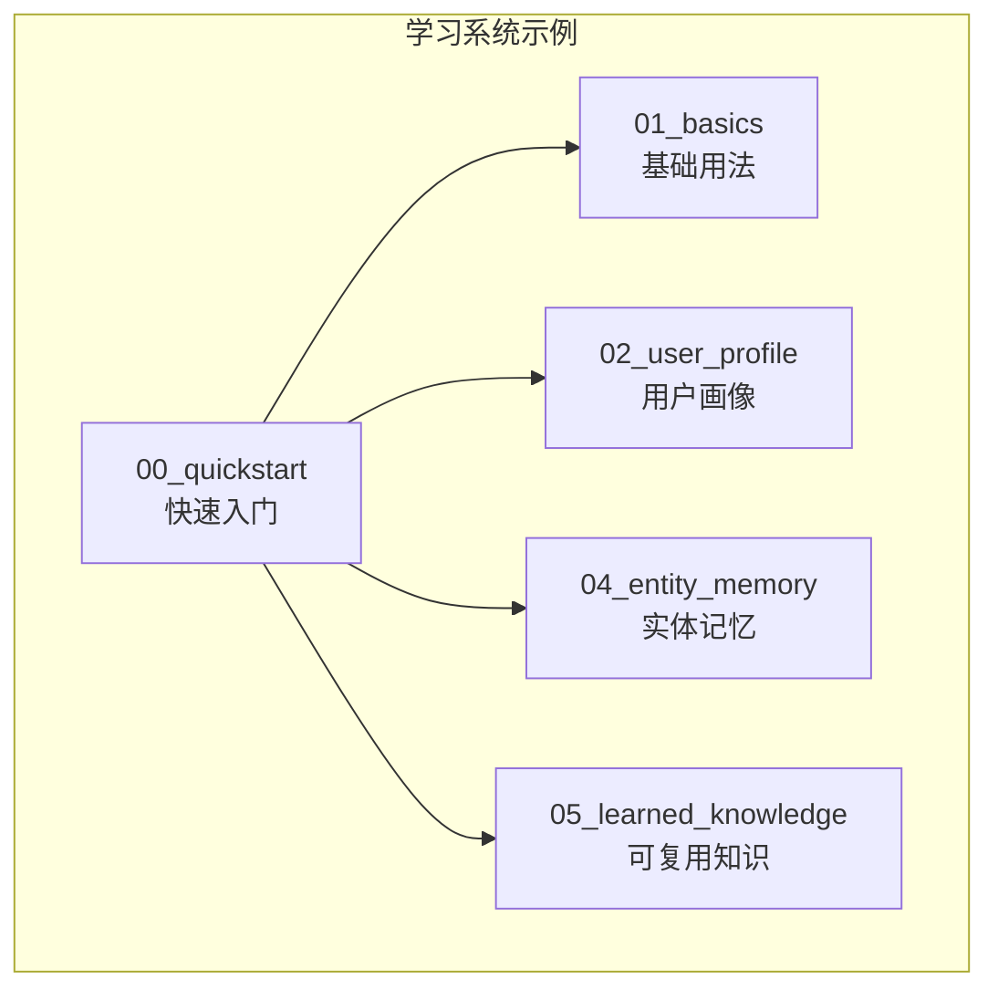
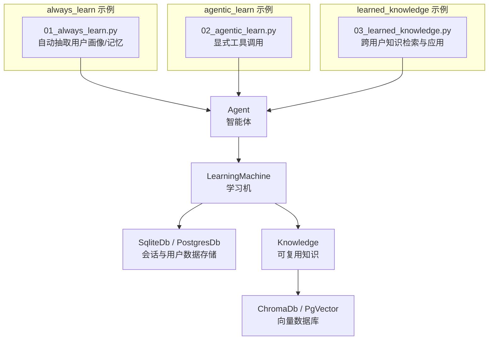
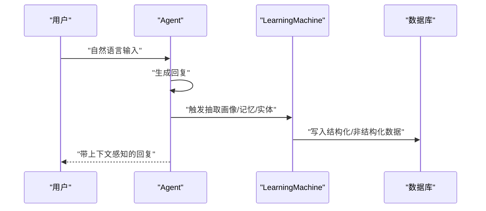
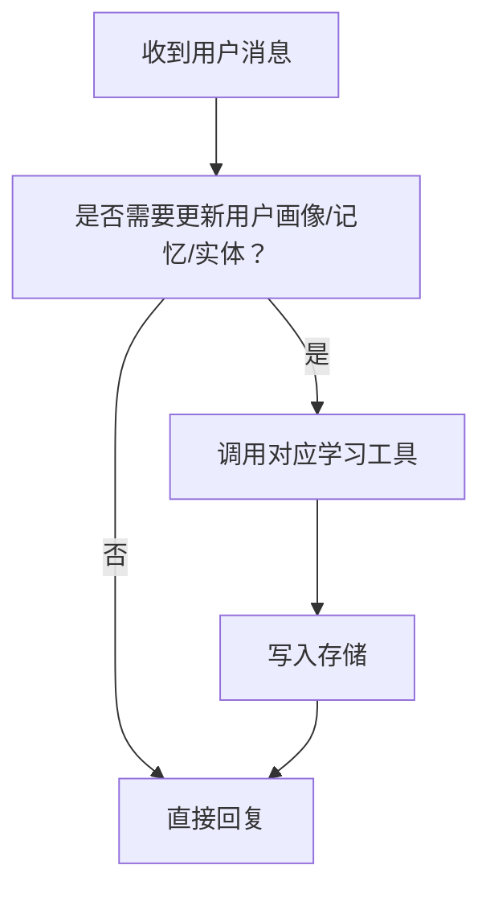
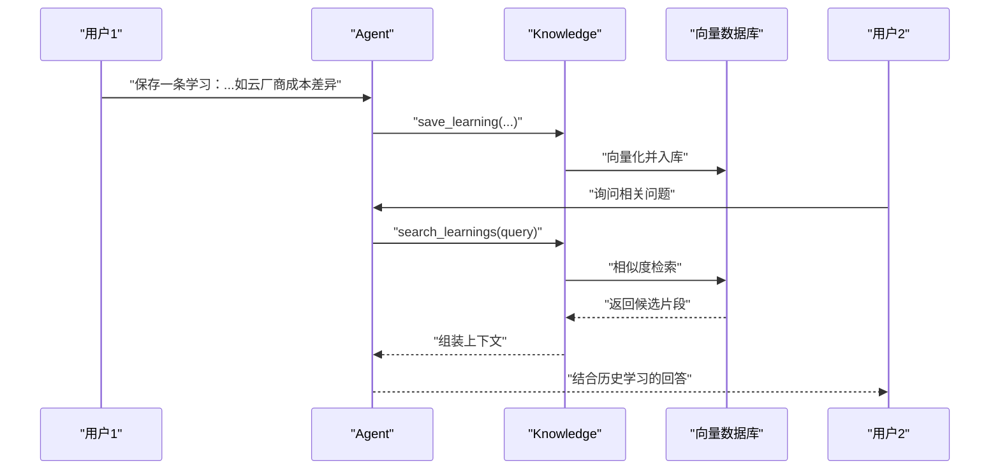
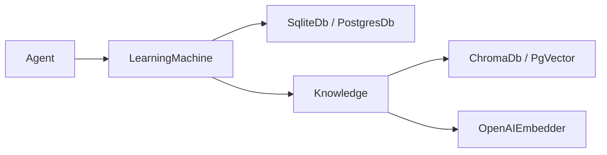

# 学习系统快速开始

<cite>
**本文引用的文件**
- [cookbook/08_learning/00_quickstart/README.md](file://cookbook/08_learning/00_quickstart/README.md)
- [cookbook/08_learning/00_quickstart/01_always_learn.py](file://cookbook/08_learning/00_quickstart/01_always_learn.py)
- [cookbook/08_learning/00_quickstart/02_agentic_learn.py](file://cookbook/08_learning/00_quickstart/02_agentic_learn.py)
- [cookbook/08_learning/00_quickstart/03_learned_knowledge.py](file://cookbook/08_learning/00_quickstart/03_learned_knowledge.py)
- [cookbook/08_learning/01_basics/README.md](file://cookbook/08_learning/01_basics/README.md)
- [cookbook/08_learning/01_basics/1a_user_profile_always.py](file://cookbook/08_learning/01_basics/1a_user_profile_always.py)
- [cookbook/08_learning/01_basics/2a_user_memory_always.py](file://cookbook/08_learning/01_basics/2a_user_memory_always.py)
- [cookbook/08_learning/01_basics/3a_session_context_summary.py](file://cookbook/08_learning/01_basics/3a_session_context_summary.py)
- [cookbook/08_learning/01_basics/4_learned_knowledge.py](file://cookbook/08_learning/01_basics/4_learned_knowledge.py)
- [cookbook/08_learning/01_basics/5a_entity_memory_always.py](file://cookbook/08_learning/01_basics/5a_entity_memory_always.py)
- [cookbook/08_learning/02_user_profile/README.md](file://cookbook/08_learning/02_user_profile/README.md)
- [cookbook/08_learning/02_user_profile/01_always_extraction.py](file://cookbook/08_learning/02_user_profile/01_always_extraction.py)
- [cookbook/08_learning/02_user_profile/02_agentic_mode.py](file://cookbook/08_learning/02_user_profile/02_agentic_mode.py)
- [cookbook/08_learning/02_user_profile/03_custom_schema.py](file://cookbook/08_learning/02_user_profile/03_custom_schema.py)
- [cookbook/08_learning/04_entity_memory/README.md](file://cookbook/08_learning/04_entity_memory/README.md)
- [cookbook/08_learning/04_entity_memory/01_facts_and_events.py](file://cookbook/08_learning/04_entity_memory/01_facts_and_events.py)
- [cookbook/08_learning/05_learned_knowledge/README.md](file://cookbook/08_learning/05_learned_knowledge/README.md)
</cite>

## 目录
1. [简介](#简介)
2. [项目结构](#项目结构)
3. [核心组件](#核心组件)
4. [架构总览](#架构总览)
5. [详细组件分析](#详细组件分析)
6. [依赖分析](#依赖分析)
7. [性能考虑](#性能考虑)
8. [故障排查指南](#故障排查指南)
9. [结论](#结论)
10. [附录](#附录)

## 简介
本章节面向希望快速上手“学习系统”的开发者，聚焦以下目标：
- 理解学习系统的基础概念与核心能力：自学习配置、用户画像、实体记忆、会话上下文、可复用的知识（learned_knowledge）。
- 掌握两种学习模式：always_learn（自动抽取）与 agentic_learn（代理式显式管理）。
- 明确 learned_knowledge 的管理流程：知识提取、向量化存储、检索与应用。
- 提供可直接运行的示例路径与关键配置项，帮助快速落地。

## 项目结构
学习系统示例位于 cookbook/08_learning 下，按“快速入门 → 基础用法 → 深入专题”分层组织。快速开始包含三个核心示例：always_learn、agentic_learn、learned_knowledge，分别演示三种基础能力的最小可用配置。

图表来源
- [cookbook/08_learning/00_quickstart/README.md:1-10](file://cookbook/08_learning/00_quickstart/README.md#L1-L10)
- [cookbook/08_learning/01_basics/README.md:1-16](file://cookbook/08_learning/01_basics/README.md#L1-L16)
- [cookbook/08_learning/02_user_profile/README.md:1-10](file://cookbook/08_learning/02_user_profile/README.md#L1-L10)
- [cookbook/08_learning/04_entity_memory/README.md:1-9](file://cookbook/08_learning/04_entity_memory/README.md#L1-L9)
- [cookbook/08_learning/05_learned_knowledge/README.md:1-9](file://cookbook/08_learning/05_learned_knowledge/README.md#L1-L9)

章节来源
- [cookbook/08_learning/00_quickstart/README.md:1-10](file://cookbook/08_learning/00_quickstart/README.md#L1-L10)
- [cookbook/08_learning/01_basics/README.md:1-16](file://cookbook/08_learning/01_basics/README.md#L1-L16)

## 核心组件
- 自学习配置（always_learn）
  - 在 Agent 初始化时启用 learning=True 或传入 LearningMachine 并设置各子模块为 LearningMode.ALWAYS，即可在响应后自动抽取用户画像、用户记忆、实体记忆等。
  - 示例路径：[01_always_learn.py:1-56](file://cookbook/08_learning/00_quickstart/01_always_learn.py#L1-L56)
- 代理式学习（agentic_learn）
  - 将 LearningMode 设为 AGENTIC，Agent 将获得显式的工具（如保存/更新用户画像、用户记忆、实体记忆），由对话上下文决定何时调用。
  - 示例路径：[02_agentic_learn.py:1-62](file://cookbook/08_learning/00_quickstart/02_agentic_learn.py#L1-L62)
- 可复用知识（learned_knowledge）
  - 需要配置 Knowledge 与向量数据库（如 Chroma、PgVector），并在 LearningMachine 中开启 learned_knowledge=LearnedKnowledgeConfig(mode=LearningMode.AGENTIC)，以支持跨用户的检索与应用。
  - 示例路径：[03_learned_knowledge.py:1-71](file://cookbook/08_learning/00_quickstart/03_learned_knowledge.py#L1-L71)、[01_learned_knowledge.py:1-86](file://cookbook/08_learning/01_basics/4_learned_knowledge.py#L1-L86)

章节来源
- [cookbook/08_learning/00_quickstart/01_always_learn.py:1-56](file://cookbook/08_learning/00_quickstart/01_always_learn.py#L1-L56)
- [cookbook/08_learning/00_quickstart/02_agentic_learn.py:1-62](file://cookbook/08_learning/00_quickstart/02_agentic_learn.py#L1-L62)
- [cookbook/08_learning/00_quickstart/03_learned_knowledge.py:1-71](file://cookbook/08_learning/00_quickstart/03_learned_knowledge.py#L1-L71)
- [cookbook/08_learning/01_basics/4_learned_knowledge.py:1-86](file://cookbook/08_learning/01_basics/4_learned_knowledge.py#L1-L86)

## 架构总览
下图展示了“快速开始”中三个核心示例的运行时交互：Agent 通过学习机（LearningMachine）对接数据库与知识库，自动或显式地抽取/存储/检索各类学习内容。

图表来源
- [cookbook/08_learning/00_quickstart/01_always_learn.py:13-27](file://cookbook/08_learning/00_quickstart/01_always_learn.py#L13-L27)
- [cookbook/08_learning/00_quickstart/02_agentic_learn.py:10-33](file://cookbook/08_learning/00_quickstart/02_agentic_learn.py#L10-L33)
- [cookbook/08_learning/00_quickstart/03_learned_knowledge.py:14-46](file://cookbook/08_learning/00_quickstart/03_learned_knowledge.py#L14-L46)

## 详细组件分析

### always_learn 模式：自动抽取
- 概念与优势
  - 启用 learning=True 或将 LearningMode.ALWAYS 应用于用户画像、用户记忆、实体记忆等模块，系统在每次响应后自动抽取并持久化。
  - 无需显式工具调用，适合追求“开箱即用”的场景。
- 关键配置点
  - 数据库选择：SqliteDb、PostgresDb 等。
  - 模型选择：OpenAIResponses 等。
  - 开启 learning=True 或具体模块的 ALWAYS 模式。
- 运行流程（序列图）

图表来源
- [cookbook/08_learning/00_quickstart/01_always_learn.py:22-27](file://cookbook/08_learning/00_quickstart/01_always_learn.py#L22-L27)
- [cookbook/08_learning/01_basics/1a_user_profile_always.py:29-38](file://cookbook/08_learning/01_basics/1a_user_profile_always.py#L29-L38)
- [cookbook/08_learning/01_basics/2a_user_memory_always.py:31-40](file://cookbook/08_learning/01_basics/2a_user_memory_always.py#L31-L40)
- [cookbook/08_learning/01_basics/5a_entity_memory_always.py:28-38](file://cookbook/08_learning/01_basics/5a_entity_memory_always.py#L28-L38)

章节来源
- [cookbook/08_learning/00_quickstart/01_always_learn.py:1-56](file://cookbook/08_learning/00_quickstart/01_always_learn.py#L1-L56)
- [cookbook/08_learning/01_basics/1a_user_profile_always.py:1-72](file://cookbook/08_learning/01_basics/1a_user_profile_always.py#L1-L72)
- [cookbook/08_learning/01_basics/2a_user_memory_always.py:1-76](file://cookbook/08_learning/01_basics/2a_user_memory_always.py#L1-L76)
- [cookbook/08_learning/01_basics/5a_entity_memory_always.py:1-82](file://cookbook/08_learning/01_basics/5a_entity_memory_always.py#L1-L82)

### agentic_learn 模式：代理式显式管理
- 概念与优势
  - 将 LearningMode.AGENTIC 应用于各模块，Agent 获得显式工具（如保存/更新用户画像、记忆、实体），在合适的对话时刻进行调用。
  - 更透明、可控，便于审计与调试。
- 关键配置点
  - 在 LearningMachine 中为用户画像、用户记忆、实体记忆等模块设置 AGENTIC 模式。
  - 可结合 instructions 指导 Agent 使用工具。
- 流程图（工具调用决策）

图表来源
- [cookbook/08_learning/00_quickstart/02_agentic_learn.py:25-33](file://cookbook/08_learning/00_quickstart/02_agentic_learn.py#L25-L33)
- [cookbook/08_learning/02_user_profile/02_agentic_mode.py:24-37](file://cookbook/08_learning/02_user_profile/02_agentic_mode.py#L24-L37)
- [cookbook/08_learning/04_entity_memory/01_facts_and_events.py:27-41](file://cookbook/08_learning/04_entity_memory/01_facts_and_events.py#L27-L41)

章节来源
- [cookbook/08_learning/00_quickstart/02_agentic_learn.py:1-62](file://cookbook/08_learning/00_quickstart/02_agentic_learn.py#L1-L62)
- [cookbook/08_learning/02_user_profile/02_agentic_mode.py:1-84](file://cookbook/08_learning/02_user_profile/02_agentic_mode.py#L1-L84)
- [cookbook/08_learning/04_entity_memory/01_facts_and_events.py:1-102](file://cookbook/08_learning/04_entity_memory/01_facts_and_events.py#L1-L102)

### learned_knowledge：可复用知识的管理与应用
- 概念与价值
  - 将通用洞察、最佳实践、领域模式等沉淀为“可复用知识”，跨用户、跨会话共享，提升整体智能体的服务质量。
- 关键配置点
  - 创建 Knowledge 实例并配置向量数据库（Chroma、PgVector 等）。
  - 在 LearningMachine 中启用 learned_knowledge=LearnedKnowledgeConfig(mode=AGENTIC)。
  - 使用 search_learnings 与 save_learning 工具进行检索与保存。
- 序列图（跨用户应用）

图表来源
- [cookbook/08_learning/00_quickstart/03_learned_knowledge.py:27-46](file://cookbook/08_learning/00_quickstart/03_learned_knowledge.py#L27-L46)
- [cookbook/08_learning/01_basics/4_learned_knowledge.py:32-53](file://cookbook/08_learning/01_basics/4_learned_knowledge.py#L32-L53)

章节来源
- [cookbook/08_learning/00_quickstart/03_learned_knowledge.py:1-71](file://cookbook/08_learning/00_quickstart/03_learned_knowledge.py#L1-L71)
- [cookbook/08_learning/01_basics/4_learned_knowledge.py:1-86](file://cookbook/08_learning/01_basics/4_learned_knowledge.py#L1-L86)

### 用户画像（UserProfile）：结构化与定制
- 结构化抽取
  - ALWAYS 模式：自动抽取姓名、昵称、角色、偏好等结构化字段。
  - AGENTIC 模式：通过工具显式更新，更易观测与控制。
- 定制 Schema
  - 通过继承 UserProfile 并定义数据类字段，实现业务域专属的画像结构。
- 示例路径
  - ALWAYS 抽取：[1a_user_profile_always.py:29-38](file://cookbook/08_learning/01_basics/1a_user_profile_always.py#L29-L38)
  - AGENTIC 更新：[02_agentic_mode.py:24-37](file://cookbook/08_learning/02_user_profile/02_agentic_mode.py#L24-L37)
  - 自定义 Schema：[03_custom_schema.py:57-67](file://cookbook/08_learning/02_user_profile/03_custom_schema.py#L57-L67)

章节来源
- [cookbook/08_learning/01_basics/1a_user_profile_always.py:1-72](file://cookbook/08_learning/01_basics/1a_user_profile_always.py#L1-L72)
- [cookbook/08_learning/02_user_profile/02_agentic_mode.py:1-84](file://cookbook/08_learning/02_user_profile/02_agentic_mode.py#L1-L84)
- [cookbook/08_learning/02_user_profile/03_custom_schema.py:1-115](file://cookbook/08_learning/02_user_profile/03_custom_schema.py#L1-L115)

### 实体记忆（EntityMemory）：事实与事件
- 区分事实（factual，时间无关）与事件（episodic，时间相关），支持命名空间隔离与跨用户共享。
- AGENTIC 模式下，Agent 可显式创建/更新实体，便于构建外部世界的共享知识库。
- 示例路径
  - 事实与事件区分：[01_facts_and_events.py:27-41](file://cookbook/08_learning/04_entity_memory/01_facts_and_events.py#L27-L41)

章节来源
- [cookbook/08_learning/04_entity_memory/01_facts_and_events.py:1-102](file://cookbook/08_learning/04_entity_memory/01_facts_and_events.py#L1-L102)

### 会话上下文（SessionContext）：摘要与规划
- 摘要模式：对当前会话进行轻量级总结，保持连贯性但不引入目标/计划结构。
- 规划模式：在摘要基础上增加目标与进度状态，适合需要推进的任务型对话。
- 示例路径
  - 摘要模式：[3a_session_context_summary.py:27-33](file://cookbook/08_learning/01_basics/3a_session_context_summary.py#L27-L33)

章节来源
- [cookbook/08_learning/01_basics/3a_session_context_summary.py:1-81](file://cookbook/08_learning/01_basics/3a_session_context_summary.py#L1-L81)

## 依赖分析
- 组件耦合
  - Agent 依赖 LearningMachine；LearningMachine 依赖数据库（Sqlite/Postgres）与知识库（Knowledge）。
  - Knowledge 依赖向量数据库（Chroma/PgVector）与嵌入模型（OpenAIEmbedder）。
- 外部依赖
  - 模型服务：OpenAIResponses。
  - 存储：SqliteDb、PostgresDb。
  - 向量检索：ChromaDb、PgVector。
- 依赖关系图

图表来源
- [cookbook/08_learning/00_quickstart/01_always_learn.py:13-27](file://cookbook/08_learning/00_quickstart/01_always_learn.py#L13-L27)
- [cookbook/08_learning/00_quickstart/03_learned_knowledge.py:14-46](file://cookbook/08_learning/00_quickstart/03_learned_knowledge.py#L14-L46)
- [cookbook/08_learning/01_basics/4_learned_knowledge.py:16-53](file://cookbook/08_learning/01_basics/4_learned_knowledge.py#L16-L53)

## 性能考虑
- 自动抽取（ALWAYS）的并发处理
  - 在响应生成的同时并行执行抽取逻辑，减少端到端延迟，但需注意数据库写入与向量索引的吞吐。
- 向量检索的代价
  - learned_knowledge 的 hybrid 搜索在召回精度与性能之间权衡，建议根据业务规模调整 top_k、过滤条件与嵌入维度。
- 数据库与索引
  - 对于高并发场景，优先选用具备连接池与索引优化的数据库（如 Postgres + pgvector）。
- 日志与可观测性
  - 建议在开发阶段开启详细日志，定位工具调用频率、向量检索耗时与存储写入延迟。

## 故障排查指南
- 无法看到工具调用
  - 确认已将相应模块设为 AGENTIC 模式，并在 instructions 中提示 Agent 使用工具。
  - 参考路径：[02_agentic_learn.py:25-33](file://cookbook/08_learning/00_quickstart/02_agentic_learn.py#L25-L33)、[02_agentic_mode.py:24-37](file://cookbook/08_learning/02_user_profile/02_agentic_mode.py#L24-L37)
- learned_knowledge 未生效
  - 检查是否正确创建 Knowledge 并配置向量数据库与嵌入器。
  - 参考路径：[03_learned_knowledge.py:27-46](file://cookbook/08_learning/00_quickstart/03_learned_knowledge.py#L27-L46)、[01_learned_knowledge.py:32-53](file://cookbook/08_learning/01_basics/4_learned_knowledge.py#L32-L53)
- 实体记忆未更新
  - AGENTIC 模式下需明确调用实体管理工具；ALWAYS 模式下需确保对话中包含足够的实体提及。
  - 参考路径：[01_facts_and_events.py:27-41](file://cookbook/08_learning/04_entity_memory/01_facts_and_events.py#L27-L41)、[5a_entity_memory_always.py:28-38](file://cookbook/08_learning/01_basics/5a_entity_memory_always.py#L28-L38)
- 数据库连接失败
  - 检查数据库连接字符串与权限；确保本地服务（如 Postgres、Chroma）已启动。
  - 参考路径：[1a_user_profile_always.py:24-38](file://cookbook/08_learning/01_basics/1a_user_profile_always.py#L24-L38)、[03_learned_knowledge.py:25-46](file://cookbook/08_learning/00_quickstart/03_learned_knowledge.py#L25-L46)

章节来源
- [cookbook/08_learning/00_quickstart/02_agentic_learn.py:25-33](file://cookbook/08_learning/00_quickstart/02_agentic_learn.py#L25-L33)
- [cookbook/08_learning/02_user_profile/02_agentic_mode.py:24-37](file://cookbook/08_learning/02_user_profile/02_agentic_mode.py#L24-L37)
- [cookbook/08_learning/00_quickstart/03_learned_knowledge.py:27-46](file://cookbook/08_learning/00_quickstart/03_learned_knowledge.py#L27-L46)
- [cookbook/08_learning/01_basics/4_learned_knowledge.py:32-53](file://cookbook/08_learning/01_basics/4_learned_knowledge.py#L32-L53)
- [cookbook/08_learning/04_entity_memory/01_facts_and_events.py:27-41](file://cookbook/08_learning/04_entity_memory/01_facts_and_events.py#L27-L41)
- [cookbook/08_learning/01_basics/5a_entity_memory_always.py:28-38](file://cookbook/08_learning/01_basics/5a_entity_memory_always.py#L28-L38)

## 结论
- 快速上手建议
  - 先用 always_learn 模式体验自动抽取的便捷；再切换到 agentic_learn 模式掌握工具调用时机。
  - 引入 learned_knowledge 以沉淀跨用户的价值点，结合向量检索提升回答质量。
- 最佳实践
  - 明确学习模块的边界（画像/记忆/实体/知识），按需启用 AGENTIC 以增强可控性。
  - 在生产环境优先采用 Postgres + pgvector 或 Chroma 等成熟方案，并关注检索与写入的性能平衡。

## 附录
- 示例清单与用途
  - [01_always_learn.py:1-56](file://cookbook/08_learning/00_quickstart/01_always_learn.py#L1-L56)：自动抽取用户画像与记忆
  - [02_agentic_learn.py:1-62](file://cookbook/08_learning/00_quickstart/02_agentic_learn.py#L1-L62)：显式工具驱动的代理式学习
  - [03_learned_knowledge.py:1-71](file://cookbook/08_learning/00_quickstart/03_learned_knowledge.py#L1-L71)：跨用户可复用知识的检索与应用
  - [1a_user_profile_always.py:1-72](file://cookbook/08_learning/01_basics/1a_user_profile_always.py#L1-L72)：用户画像自动抽取
  - [2a_user_memory_always.py:1-76](file://cookbook/08_learning/01_basics/2a_user_memory_always.py#L1-L76)：用户记忆自动抽取
  - [3a_session_context_summary.py:1-81](file://cookbook/08_learning/01_basics/3a_session_context_summary.py#L1-L81)：会话上下文摘要
  - [4_learned_knowledge.py:1-86](file://cookbook/08_learning/01_basics/4_learned_knowledge.py#L1-L86)：learned_knowledge 基础示例
  - [5a_entity_memory_always.py:1-82](file://cookbook/08_learning/01_basics/5a_entity_memory_always.py#L1-L82)：实体记忆自动抽取
  - [01_always_extraction.py:1-96](file://cookbook/08_learning/02_user_profile/01_always_extraction.py#L1-L96)：逐步构建用户画像
  - [02_agentic_mode.py:1-84](file://cookbook/08_learning/02_user_profile/02_agentic_mode.py#L1-L84)：显式更新用户画像
  - [03_custom_schema.py:1-115](file://cookbook/08_learning/02_user_profile/03_custom_schema.py#L1-L115)：自定义用户画像 Schema
  - [01_facts_and_events.py:1-102](file://cookbook/08_learning/04_entity_memory/01_facts_and_events.py#L1-L102)：事实与事件区分