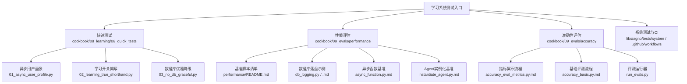
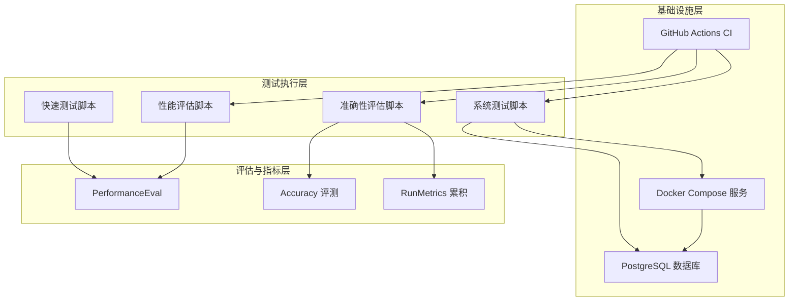
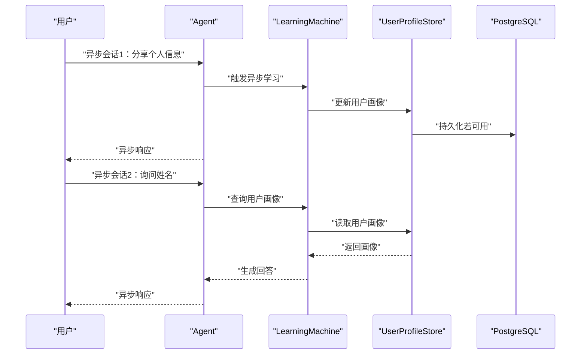
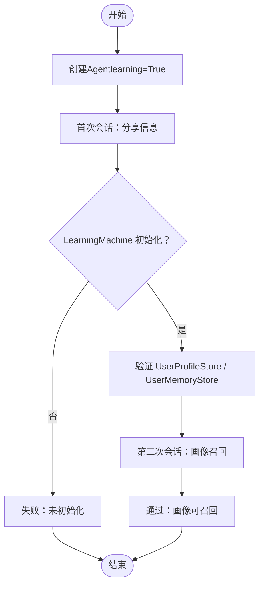
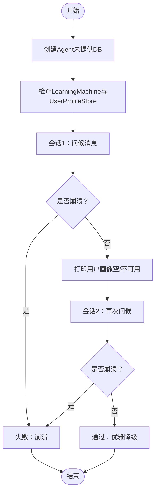
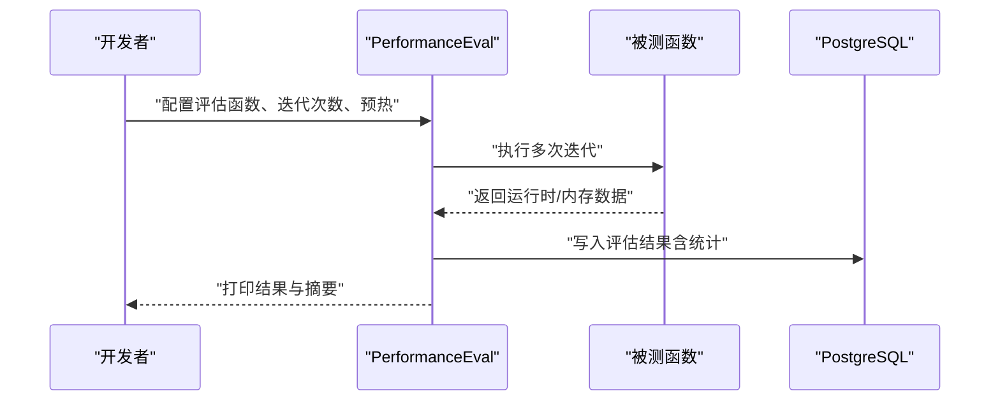
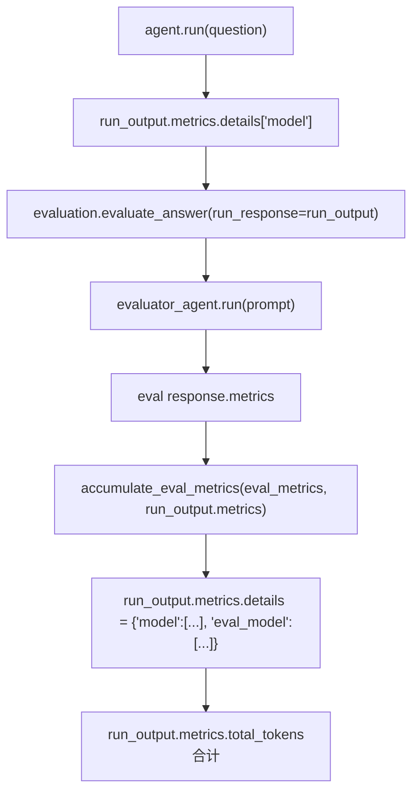
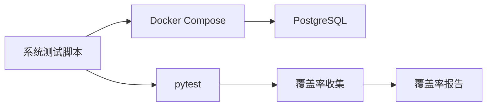

# 学习系统测试

<cite>
**本文引用的文件**
- [01_async_user_profile.py](file://cookbook/08_learning/06_quick_tests/01_async_user_profile.py)
- [02_learning_true_shorthand.py](file://cookbook/08_learning/06_quick_tests/02_learning_true_shorthand.py)
- [03_no_db_graceful.py](file://cookbook/08_learning/06_quick_tests/03_no_db_graceful.py)
- [README.md](file://cookbook/08_learning/06_quick_tests/README.md)
- [run_tests.sh](file://libs/agno/tests/system/run_tests.sh)
- [conftest.py](file://libs/agno/tests/system/tests/conftest.py)
- [test.yml](file://.github/workflows/test.yml)
- [db_logging.py](file://cookbook/09_evals/performance/db_logging.py)
- [db_logging.py.md](file://cookbook/09_evals/performance/db_logging.py.md)
- [performance/README.md](file://cookbook/09_evals/performance/README.md)
- [async_function.py.md](file://cookbook/09_evals/performance/async_function.py.md)
- [instantiate_agent.py.md](file://cookbook/09_evals/performance/instantiate_agent.py.md)
- [accuracy_eval_metrics.py.md](file://cookbook/09_evals/accuracy/accuracy_eval_metrics.py.md)
- [accuracy_basic.py.md](file://cookbook/09_evals/accuracy/accuracy_basic.py.md)
- [run_evals.py](file://cookbook/01_demo/evals/run_evals.py)
- [pyproject.toml](file://pyproject.toml)
</cite>

## 目录
1. [简介](#简介)
2. [项目结构](#项目结构)
3. [核心组件](#核心组件)
4. [架构总览](#架构总览)
5. [详细组件分析](#详细组件分析)
6. [依赖分析](#依赖分析)
7. [性能考量](#性能考量)
8. [故障排查指南](#故障排查指南)
9. [结论](#结论)
10. [附录](#附录)

## 简介
本文件面向学习系统的测试工作，聚焦以下三类快速测试与验证场景：
- 异步用户画像测试：验证异步路径下的用户画像学习与召回是否正常。
- 学习开关简写测试：验证 learning=True 的简写配置是否等价于显式配置。
- 数据库优雅降级测试：验证在未提供数据库的情况下，学习功能应优雅降级而不崩溃。

同时，文档覆盖性能基准测试、功能验证与边界条件测试的配置与执行方法，并给出测试结果的分析与解读建议，以及测试自动化与持续集成的实现方案与实用技巧。

## 项目结构
学习系统测试主要分布在以下位置：
- 快速测试脚本位于 cookbook/08_learning/06_quick_tests，包含三个独立的验证脚本。
- 性能评估示例位于 cookbook/09_evals/performance，提供多种基准测试与数据库落盘能力。
- 准确性评估示例位于 cookbook/09_evals/accuracy，提供评测指标累积与人工/自动评估流程。
- 系统测试与CI配置位于 libs/agno/tests/system 与 .github/workflows。

图表来源
- [README.md:1-11](file://cookbook/08_learning/06_quick_tests/README.md#L1-L11)
- [performance/README.md:1-19](file://cookbook/09_evals/performance/README.md#L1-L19)
- [db_logging.py.md:1-64](file://cookbook/09_evals/performance/db_logging.py.md#L1-L64)
- [accuracy_eval_metrics.py.md:20-159](file://cookbook/09_evals/accuracy/accuracy_eval_metrics.py.md#L20-L159)
- [run_evals.py:105-183](file://cookbook/01_demo/evals/run_evals.py#L105-L183)

章节来源
- [README.md:1-11](file://cookbook/08_learning/06_quick_tests/README.md#L1-L11)
- [performance/README.md:1-19](file://cookbook/09_evals/performance/README.md#L1-L19)

## 核心组件
- 异步用户画像测试：验证异步打印响应与用户画像存储的正确性与一致性。
- 学习开关简写测试：验证 learning=True 是否自动生成默认学习机并注入数据库与模型。
- 数据库优雅降级测试：验证在未提供数据库时，系统仍可正常响应但跳过持久化。
- 性能评估：提供多类基准测试（如实例化、响应、团队协作等），支持数据库落盘与统计汇总。
- 准确性评估：提供评测指标累积与评测流程，支持将评测模型的token计入父指标。
- 系统测试与CI：提供容器编排、服务健康检查、pytest运行与覆盖率收集。

章节来源
- [01_async_user_profile.py:1-80](file://cookbook/08_learning/06_quick_tests/01_async_user_profile.py#L1-L80)
- [02_learning_true_shorthand.py:1-109](file://cookbook/08_learning/06_quick_tests/02_learning_true_shorthand.py#L1-L109)
- [03_no_db_graceful.py:1-100](file://cookbook/08_learning/06_quick_tests/03_no_db_graceful.py#L1-L100)
- [db_logging.py:1-48](file://cookbook/09_evals/performance/db_logging.py#L1-L48)
- [run_tests.sh:1-121](file://libs/agno/tests/system/run_tests.sh#L1-L121)
- [test.yml:108-141](file://.github/workflows/test.yml#L108-L141)

## 架构总览
下图展示了学习系统测试的整体架构与关键交互：

图表来源
- [db_logging.py:1-48](file://cookbook/09_evals/performance/db_logging.py#L1-L48)
- [run_tests.sh:61-100](file://libs/agno/tests/system/run_tests.sh#L61-L100)
- [test.yml:108-141](file://.github/workflows/test.yml#L108-L141)

## 详细组件分析

### 异步用户画像测试
- 目标：验证异步路径（aprint_response）下的用户画像学习与召回。
- 关键点：
  - 使用异步事件循环启动两次会话，分别进行信息分享与姓名召回。
  - 通过用户画像存储打印接口验证持久化状态。
  - 验证异步任务在后台学习模式下的行为一致性。
- 执行步骤：
  - 准备PostgreSQL数据库连接与OpenAI模型。
  - 创建启用学习机的Agent（Always模式）。
  - 第一次异步会话：分享个人信息；第二次异步会话：提问姓名以触发召回。
  - 输出两次会话后的用户画像状态。
- 结果解读：
  - 若两次会话均成功且画像中包含已分享信息，则通过。
  - 若出现异常或画像为空，则需检查异步路径与存储初始化。

图表来源
- [01_async_user_profile.py:44-76](file://cookbook/08_learning/06_quick_tests/01_async_user_profile.py#L44-L76)

章节来源
- [01_async_user_profile.py:1-80](file://cookbook/08_learning/06_quick_tests/01_async_user_profile.py#L1-L80)

### 学习开关简写测试
- 目标：验证 learning=True 是否等价于显式配置默认学习机。
- 关键点：
  - learning=True 自动生成默认学习机，注入数据库与模型。
  - 验证用户画像与用户记忆存储在首次运行后被正确初始化。
  - 验证简写配置与显式配置在功能上一致。
- 执行步骤：
  - 使用learning=True创建Agent。
  - 第一次会话：分享个人信息以触发学习机初始化。
  - 验证LearningMachine、UserProfileStore、UserMemoryStore存在且可打印。
  - 第二次会话：提问以验证画像召回。
- 结果解读：
  - 若所有组件均初始化成功且画像可召回，则简写有效。
  - 若缺失任一组件或无法召回，则需检查简写逻辑与注入策略。

图表来源
- [02_learning_true_shorthand.py:27-108](file://cookbook/08_learning/06_quick_tests/02_learning_true_shorthand.py#L27-L108)

章节来源
- [02_learning_true_shorthand.py:1-109](file://cookbook/08_learning/06_quick_tests/02_learning_true_shorthand.py#L1-L109)

### 数据库优雅降级测试
- 目标：验证在未提供数据库时，学习功能应优雅降级。
- 关键点：
  - 显式启用学习机但不提供数据库。
  - 系统应正常响应用户消息，但跳过持久化。
  - 验证两次会话均不崩溃。
- 执行步骤：
  - 创建Agent时不传入db参数。
  - 第一次会话：发送问候消息，确保不崩溃。
  - 打印用户画像（应为空或不可用）。
  - 第二次会话：再次发送消息，确保不崩溃。
- 结果解读：
  - 若两次会话均成功且系统未崩溃，则通过。
  - 若出现异常或日志提示持久化失败，则需优化降级策略。

图表来源
- [03_no_db_graceful.py:40-99](file://cookbook/08_learning/06_quick_tests/03_no_db_graceful.py#L40-L99)

章节来源
- [03_no_db_graceful.py:1-100](file://cookbook/08_learning/06_quick_tests/03_no_db_graceful.py#L1-L100)

### 性能基准测试
- 目标：评估不同场景下的运行时与内存开销，支持数据库落盘与统计汇总。
- 关键能力：
  - 多类基准脚本：异步函数、Agent实例化、响应、团队协作等。
  - 数据库落盘：将评估结果写入PostgreSQL表，便于长期追踪。
  - 统计汇总：提供平均值、最小值、最大值、标准差、中位数、P95等指标。
- 执行步骤（以数据库落盘为例）：
  - 准备PostgreSQL数据库与表。
  - 定义被测函数（如简单响应）。
  - 创建PerformanceEval实例，配置迭代次数与预热轮次。
  - 执行run()，打印结果与摘要。
- 结果解读：
  - 关注运行时间与内存使用的变化趋势。
  - 对比不同配置或版本的差异，定位性能回归点。

图表来源
- [db_logging.py:1-48](file://cookbook/09_evals/performance/db_logging.py#L1-L48)
- [db_logging.py.md:21-62](file://cookbook/09_evals/performance/db_logging.py.md#L21-L62)

章节来源
- [performance/README.md:1-19](file://cookbook/09_evals/performance/README.md#L1-L19)
- [db_logging.py:1-48](file://cookbook/09_evals/performance/db_logging.py#L1-L48)
- [db_logging.py.md:1-64](file://cookbook/09_evals/performance/db_logging.py.md#L1-L64)
- [async_function.py.md:105-112](file://cookbook/09_evals/performance/async_function.py.md#L105-L112)
- [instantiate_agent.py.md:55-61](file://cookbook/09_evals/performance/instantiate_agent.py.md#L55-L61)

### 准确性评估与指标累积
- 目标：对回答质量进行评测，并将评测模型的token使用累积到父指标中。
- 关键流程：
  - 手动运行Agent并获取run_output。
  - 构建评测Agent与输入，调用evaluate_answer。
  - 将评测模型的metrics累积到run_output.metrics中。
  - 查看details中的model与eval_model两类指标，计算合计。
- 执行步骤：
  - 运行Agent得到run_output。
  - 获取评测Agent与期望输出，组装评测输入。
  - 调用evaluate_answer并将run_output作为run_response传入。
  - 打印run_output.metrics.total_tokens。
- 结果解读：
  - total_tokens为Agent与评测模型的合计，用于成本与性能综合评估。

图表来源
- [accuracy_eval_metrics.py.md:135-150](file://cookbook/09_evals/accuracy/accuracy_eval_metrics.py.md#L135-L150)
- [accuracy_basic.py.md:101-137](file://cookbook/09_evals/accuracy/accuracy_basic.py.md#L101-L137)

章节来源
- [accuracy_eval_metrics.py.md:20-159](file://cookbook/09_evals/accuracy/accuracy_eval_metrics.py.md#L20-L159)
- [accuracy_basic.py.md:101-137](file://cookbook/09_evals/accuracy/accuracy_basic.py.md#L101-L137)
- [run_evals.py:105-183](file://cookbook/01_demo/evals/run_evals.py#L105-L183)

## 依赖分析
- 测试脚本依赖：
  - Agent、LearningMachine、UserProfileConfig、LearningMode等学习系统组件。
  - PostgreSQL数据库用于持久化与性能评估落盘。
  - Pytest与Docker Compose用于系统测试与服务健康检查。
- CI与覆盖率：
  - GitHub Actions按矩阵运行风格检查与单元测试。
  - 收集覆盖率并输出到JSON文件供后续处理。

图表来源
- [run_tests.sh:61-100](file://libs/agno/tests/system/run_tests.sh#L61-L100)
- [test.yml:108-141](file://.github/workflows/test.yml#L108-L141)

章节来源
- [run_tests.sh:1-121](file://libs/agno/tests/system/run_tests.sh#L1-L121)
- [test.yml:108-141](file://.github/workflows/test.yml#L108-L141)
- [pyproject.toml:1-15](file://pyproject.toml#L1-L15)

## 性能考量
- 基准测试选择：
  - 根据场景选择合适的基准脚本（如实例化、响应、团队协作、异步函数）。
  - 在数据库可用时启用落盘，便于长期追踪与对比。
- 指标关注：
  - 平均运行时间、内存使用、P95延迟等。
  - 对比不同配置（模型、工具数量、并发用户数）下的变化。
- 稳定性检查：
  - 观察标准差与极值，识别异常波动。
  - 在多轮迭代与预热后采集稳定指标。

## 故障排查指南
- 异步路径问题：
  - 确认异步事件循环正确启动与关闭。
  - 检查异步任务是否在后台学习模式下被调度。
- 学习开关简写问题：
  - 首次运行后才初始化学习机，确保有足够上下文触发。
  - 核对数据库与模型注入是否成功。
- 数据库优雅降级问题：
  - 确保在未提供DB时，系统路径不尝试持久化。
  - 检查异常捕获与日志输出，避免静默失败。
- 系统测试问题：
  - 检查容器健康状态与端口映射。
  - 确认环境变量（如OPENAI_API_KEY）已正确加载。
- CI问题：
  - 关注Python版本与依赖安装顺序。
  - 核对覆盖率收集与报告生成步骤。

章节来源
- [01_async_user_profile.py:44-76](file://cookbook/08_learning/06_quick_tests/01_async_user_profile.py#L44-L76)
- [02_learning_true_shorthand.py:54-86](file://cookbook/08_learning/06_quick_tests/02_learning_true_shorthand.py#L54-L86)
- [03_no_db_graceful.py:59-94](file://cookbook/08_learning/06_quick_tests/03_no_db_graceful.py#L59-L94)
- [run_tests.sh:17-28](file://libs/agno/tests/system/run_tests.sh#L17-L28)
- [test.yml:128-140](file://.github/workflows/test.yml#L128-L140)

## 结论
通过上述三类快速测试与性能/准确性评估，可以全面验证学习系统在异步路径、简写配置与数据库缺失等关键场景下的正确性与鲁棒性。配合数据库落盘与CI流水线，能够持续监控性能与质量指标，保障系统在演进过程中的稳定性与可靠性。

## 附录
- 测试自动化与持续集成建议：
  - 在本地使用系统测试脚本一键启动服务并运行pytest。
  - 在CI中按矩阵运行风格检查与单元测试，收集覆盖率并输出报告。
  - 将性能评估结果写入数据库，建立历史趋势对比。
- 测试数据准备：
  - 使用PostgreSQL作为默认持久化存储，确保评估与评测数据可追溯。
  - 为不同场景准备最小化的测试数据集，缩短执行时间。
- 报告生成：
  - 使用评测运行器汇总通过率、失败数与平均耗时，生成可视化摘要。