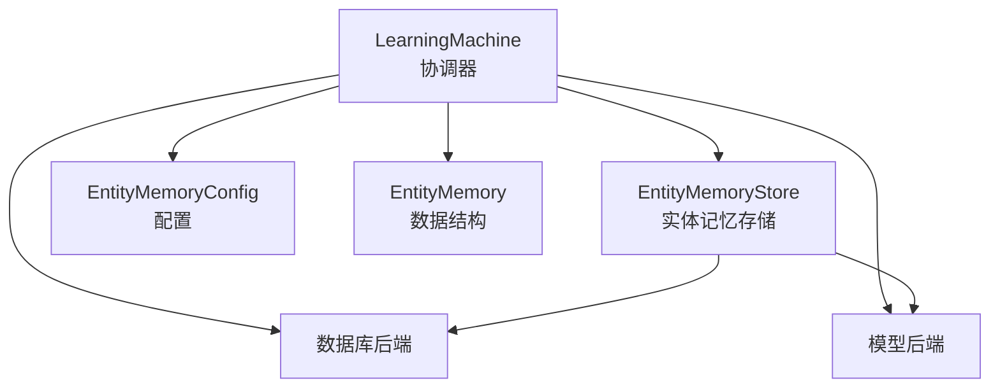
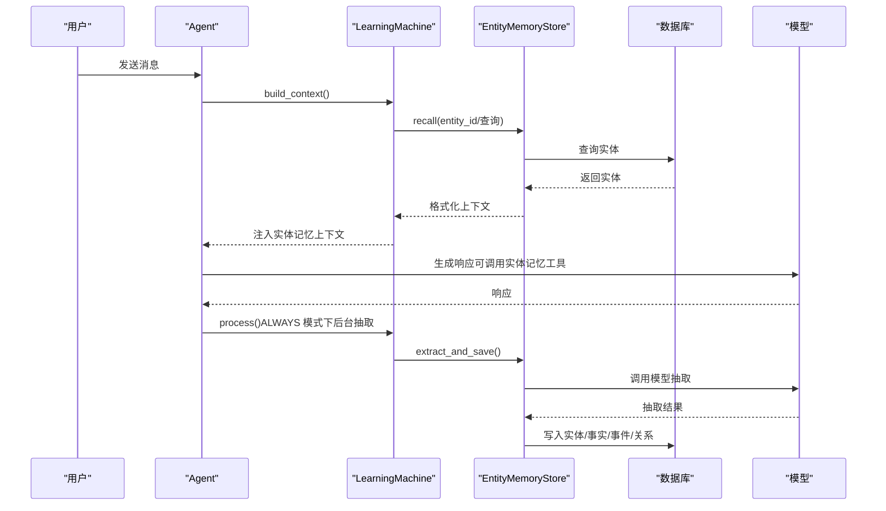
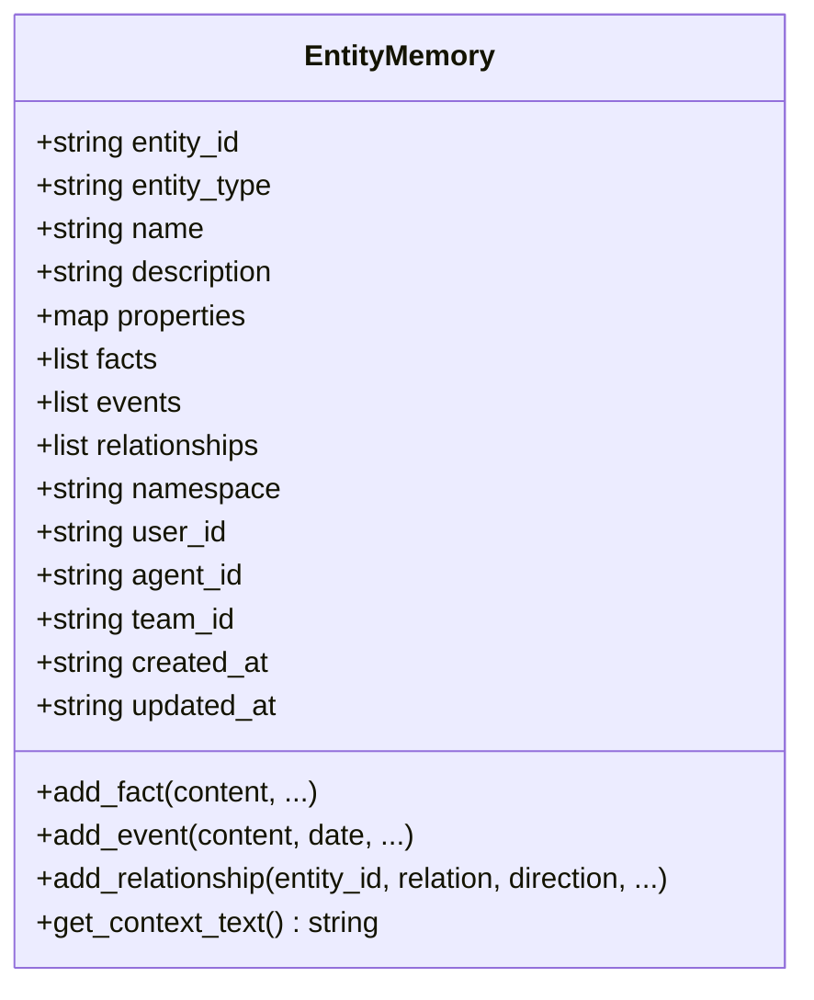
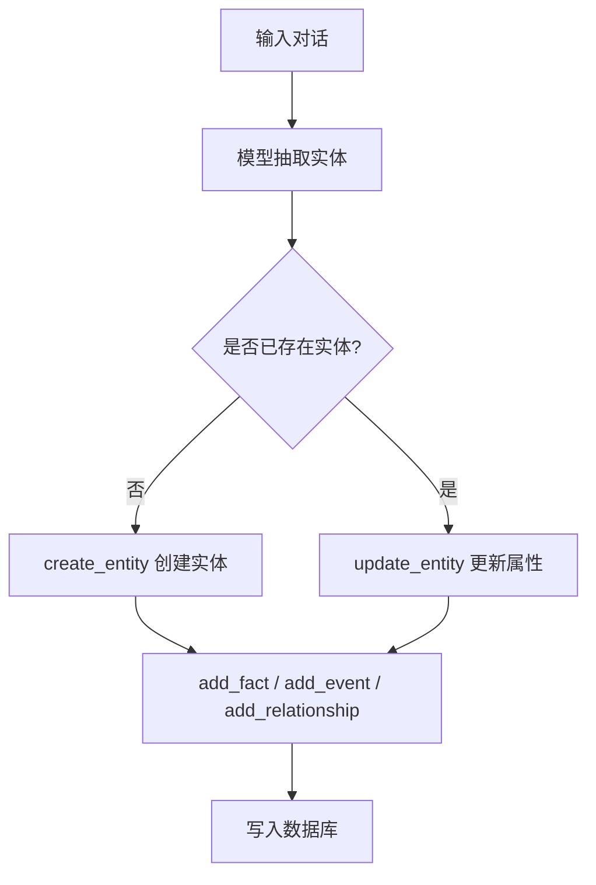
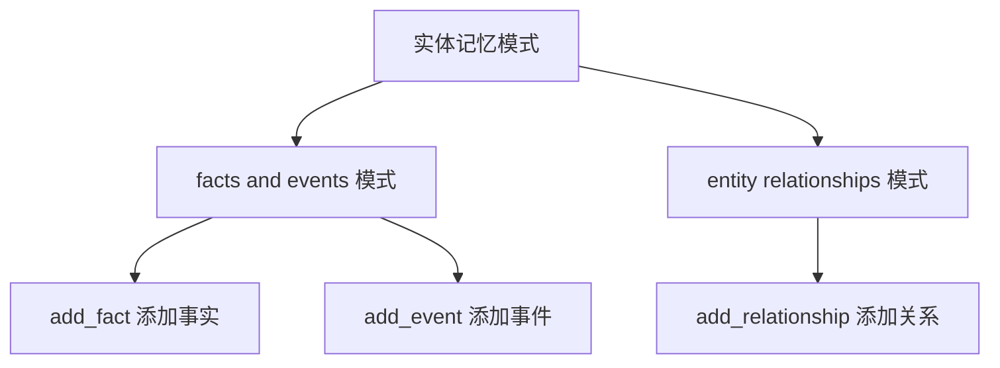
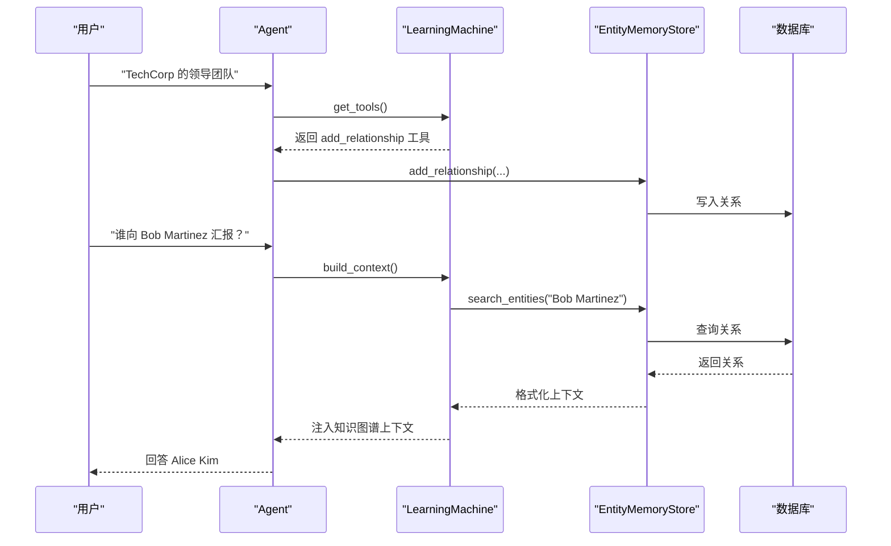
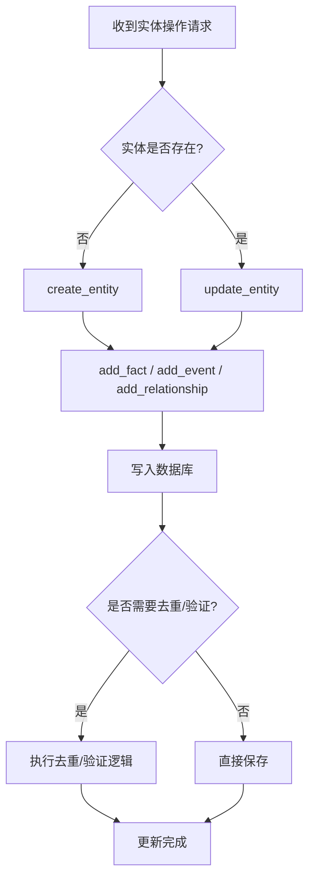
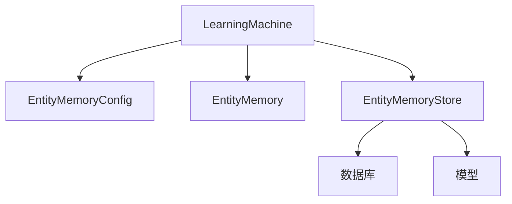

# 实体记忆系统

<cite>
**本文档引用的文件**
- [entity_memory.py](file://libs/agno/agno/learn/stores/entity_memory.py)
- [config.py](file://libs/agno/agno/learn/config.py)
- [schemas.py](file://libs/agno/agno/learn/schemas.py)
- [machine.py](file://libs/agno/agno/learn/machine.py)
- [01_facts_and_events.py](file://cookbook/08_learning/04_entity_memory/01_facts_and_events.py)
- [02_entity_relationships.py](file://cookbook/08_learning/04_entity_memory/02_entity_relationships.py)
- [5a_entity_memory_always.py](file://cookbook/08_learning/01_basics/5a_entity_memory_always.py)
- [5b_entity_memory_agentic.py](file://cookbook/08_learning/01_basics/5b_entity_memory_agentic.py)
</cite>

## 目录
1. [简介](#简介)
2. [项目结构](#项目结构)
3. [核心组件](#核心组件)
4. [架构总览](#架构总览)
5. [详细组件分析](#详细组件分析)
6. [依赖关系分析](#依赖关系分析)
7. [性能考虑](#性能考虑)
8. [故障排除指南](#故障排除指南)
9. [结论](#结论)
10. [附录](#附录)

## 简介
本文件系统化阐述实体记忆系统的设计与实现，覆盖以下主题：
- 实体识别、关系建立与记忆巩固机制
- facts and events 模式与 entity relationships 模式的差异与适用场景
- 实体记忆数据结构设计（实体属性、关系类型、时间戳管理）
- 在知识图谱构建中的应用（实体链接、关系抽取、知识推理）
- 实体去重、关系验证与记忆更新的算法思路
- 性能优化与存储策略

## 项目结构
实体记忆系统位于学习型智能体框架中，采用“统一学习机 + 多存储后端”的架构。核心文件分布如下：
- 存储层：实体记忆存储实现（EntityMemoryStore）
- 配置层：实体记忆配置（EntityMemoryConfig）与学习模式枚举（LearningMode）
- 模式层：实体记忆数据结构（EntityMemory）与工具方法
- 协调层：学习机（LearningMachine）负责上下文组装、工具注入与后台处理
- 示例层：cookbook 中提供 facts/events 与 relationships 的深入示例

图表来源
- [machine.py:52-270](file://libs/agno/agno/learn/machine.py#L52-L270)
- [entity_memory.py:64-108](file://libs/agno/agno/learn/stores/entity_memory.py#L64-L108)
- [config.py:290-371](file://libs/agno/agno/learn/config.py#L290-L371)
- [schemas.py:504-588](file://libs/agno/agno/learn/schemas.py#L504-L588)

章节来源
- [machine.py:52-270](file://libs/agno/agno/learn/machine.py#L52-L270)
- [entity_memory.py:64-108](file://libs/agno/agno/learn/stores/entity_memory.py#L64-L108)
- [config.py:290-371](file://libs/agno/agno/learn/config.py#L290-L371)
- [schemas.py:504-588](file://libs/agno/agno/learn/schemas.py#L504-L588)

## 核心组件
- 实体记忆存储（EntityMemoryStore）：提供实体检索、上下文构建、工具注册与后台提取能力；支持 AGENTIC 与 ALWAYS 两种模式。
- 实体记忆配置（EntityMemoryConfig）：控制命名空间、工具开关、模式与提示词等。
- 实体记忆数据结构（EntityMemory）：定义实体的属性、facts、events、relationships 与时间戳字段。
- 学习机（LearningMachine）：统一协调各学习存储，负责上下文拼装、工具注入与后台处理。

章节来源
- [entity_memory.py:64-108](file://libs/agno/agno/learn/stores/entity_memory.py#L64-L108)
- [config.py:290-371](file://libs/agno/agno/learn/config.py#L290-L371)
- [schemas.py:504-588](file://libs/agno/agno/learn/schemas.py#L504-L588)
- [machine.py:52-163](file://libs/agno/agno/learn/machine.py#L52-L163)

## 架构总览
实体记忆系统通过 LearningMachine 将实体检索、上下文注入与工具调用整合，支持两种工作流：
- ALWAYS 模式：后台自动从对话中抽取实体信息并持久化
- AGENTIC 模式：通过工具显式管理实体（创建、更新、添加 facts/events/relationships）

图表来源
- [machine.py:350-420](file://libs/agno/agno/learn/machine.py#L350-L420)
- [entity_memory.py:168-228](file://libs/agno/agno/learn/stores/entity_memory.py#L168-L228)
- [entity_memory.py:2635-2732](file://libs/agno/agno/learn/stores/entity_memory.py#L2635-L2732)

章节来源
- [machine.py:350-420](file://libs/agno/agno/learn/machine.py#L350-L420)
- [entity_memory.py:168-228](file://libs/agno/agno/learn/stores/entity_memory.py#L168-L228)
- [entity_memory.py:2635-2732](file://libs/agno/agno/learn/stores/entity_memory.py#L2635-L2732)

## 详细组件分析

### 实体记忆数据结构设计
实体记忆以 EntityMemory 为核心数据结构，包含：
- 核心属性：entity_id、entity_type、name、description、properties
- 语义记忆（facts）：无时间戳的事实集合
- 情节记忆（events）：带时间戳的事件集合
- 关系图（relationships）：与其他实体的连接边
- 作用域与审计：namespace、user_id、agent_id、team_id、created_at、updated_at

图表来源
- [schemas.py:504-588](file://libs/agno/agno/learn/schemas.py#L504-L588)
- [schemas.py:624-687](file://libs/agno/agno/learn/schemas.py#L624-L687)
- [schemas.py:718-748](file://libs/agno/agno/learn/schemas.py#L718-L748)

章节来源
- [schemas.py:504-588](file://libs/agno/agno/learn/schemas.py#L504-L588)
- [schemas.py:624-687](file://libs/agno/agno/learn/schemas.py#L624-L687)
- [schemas.py:718-748](file://libs/agno/agno/learn/schemas.py#L718-L748)

### 实体识别与关系建立流程
- 实体识别：在对话中识别出公司、人物、项目等外部实体
- 关系建立：通过 add_relationship 工具建立实体间的连接边
- 记忆巩固：facts/events 作为语义与情节记忆被持久化

图表来源
- [entity_memory.py:2635-2732](file://libs/agno/agno/learn/stores/entity_memory.py#L2635-L2732)
- [entity_memory.py:399-506](file://libs/agno/agno/learn/stores/entity_memory.py#L399-L506)
- [entity_memory.py:1471-1546](file://libs/agno/agno/learn/stores/entity_memory.py#L1471-L1546)

章节来源
- [entity_memory.py:2635-2732](file://libs/agno/agno/learn/stores/entity_memory.py#L2635-L2732)
- [entity_memory.py:399-506](file://libs/agno/agno/learn/stores/entity_memory.py#L399-L506)
- [entity_memory.py:1471-1546](file://libs/agno/agno/learn/stores/entity_memory.py#L1471-L1546)

### facts and events 模式 vs entity relationships 模式
- facts and events 模式：强调“事实”（无时间戳）与“事件”（有时间戳）两类记忆，适合描述实体的静态属性与动态变化
- entity relationships 模式：强调实体之间的连接关系，适合构建知识图谱与进行关系推理

图表来源
- [01_facts_and_events.py:1-102](file://cookbook/08_learning/04_entity_memory/01_facts_and_events.py#L1-L102)
- [02_entity_relationships.py:1-101](file://cookbook/08_learning/04_entity_memory/02_entity_relationships.py#L1-L101)
- [entity_memory.py:985-1043](file://libs/agno/agno/learn/stores/entity_memory.py#L985-L1043)
- [entity_memory.py:1337-1400](file://libs/agno/agno/learn/stores/entity_memory.py#L1337-L1400)
- [entity_memory.py:1471-1546](file://libs/agno/agno/learn/stores/entity_memory.py#L1471-L1546)

章节来源
- [01_facts_and_events.py:1-102](file://cookbook/08_learning/04_entity_memory/01_facts_and_events.py#L1-L102)
- [02_entity_relationships.py:1-101](file://cookbook/08_learning/04_entity_memory/02_entity_relationships.py#L1-L101)
- [entity_memory.py:985-1043](file://libs/agno/agno/learn/stores/entity_memory.py#L985-L1043)
- [entity_memory.py:1337-1400](file://libs/agno/agno/learn/stores/entity_memory.py#L1337-L1400)
- [entity_memory.py:1471-1546](file://libs/agno/agno/learn/stores/entity_memory.py#L1471-L1546)

### 实体记忆在知识图谱构建中的应用
- 实体链接：通过 search_entities 将自然语言中的提及映射到已存在的实体
- 关系抽取：通过 add_relationship 建立实体间的角色、所有权、技术依赖等关系
- 知识推理：基于关系图进行路径查询与推断（例如“谁向 Bob Martinez 汇报”）

图表来源
- [entity_memory.py:425-506](file://libs/agno/agno/learn/stores/entity_memory.py#L425-L506)
- [entity_memory.py:1471-1546](file://libs/agno/agno/learn/stores/entity_memory.py#L1471-L1546)
- [02_entity_relationships.py:53-101](file://cookbook/08_learning/04_entity_memory/02_entity_relationships.py#L53-L101)

章节来源
- [entity_memory.py:425-506](file://libs/agno/agno/learn/stores/entity_memory.py#L425-L506)
- [entity_memory.py:1471-1546](file://libs/agno/agno/learn/stores/entity_memory.py#L1471-L1546)
- [02_entity_relationships.py:53-101](file://cookbook/08_learning/04_entity_memory/02_entity_relationships.py#L53-L101)

### 实体去重、关系验证与记忆更新
- 实体去重：通过 entity_id 与 entity_type 唯一标识实体；新增实体前先查询是否存在
- 关系验证：在添加关系时校验实体存在性与方向一致性
- 记忆更新：提供 update_fact、delete_fact、add_event 等工具，支持对 facts/events 的增删改

图表来源
- [entity_memory.py:719-787](file://libs/agno/agno/learn/stores/entity_memory.py#L719-L787)
- [entity_memory.py:863-920](file://libs/agno/agno/learn/stores/entity_memory.py#L863-L920)
- [entity_memory.py:985-1043](file://libs/agno/agno/learn/stores/entity_memory.py#L985-L1043)
- [entity_memory.py:1109-1163](file://libs/agno/agno/learn/stores/entity_memory.py#L1109-L1163)
- [entity_memory.py:1225-1276](file://libs/agno/agno/learn/stores/entity_memory.py#L1225-L1276)

章节来源
- [entity_memory.py:719-787](file://libs/agno/agno/learn/stores/entity_memory.py#L719-L787)
- [entity_memory.py:863-920](file://libs/agno/agno/learn/stores/entity_memory.py#L863-L920)
- [entity_memory.py:985-1043](file://libs/agno/agno/learn/stores/entity_memory.py#L985-L1043)
- [entity_memory.py:1109-1163](file://libs/agno/agno/learn/stores/entity_memory.py#L1109-L1163)
- [entity_memory.py:1225-1276](file://libs/agno/agno/learn/stores/entity_memory.py#L1225-L1276)

### 模式与工具详解
- ALWAYS 模式：后台自动抽取实体信息，无需人工干预
- AGENTIC 模式：通过工具显式管理实体，适合需要精细控制的场景
- 工具集：search_entities、create_entity、update_entity、add_fact、update_fact、delete_fact、add_event、add_relationship

章节来源
- [config.py:32-45](file://libs/agno/agno/learn/config.py#L32-L45)
- [entity_memory.py:399-506](file://libs/agno/agno/learn/stores/entity_memory.py#L399-L506)
- [entity_memory.py:508-597](file://libs/agno/agno/learn/stores/entity_memory.py#L508-L597)
- [5a_entity_memory_always.py:1-146](file://cookbook/08_learning/01_basics/5a_entity_memory_always.py#L1-L146)
- [5b_entity_memory_agentic.py:1-122](file://cookbook/08_learning/01_basics/5b_entity_memory_agentic.py#L1-L122)

## 依赖关系分析
- LearningMachine 依赖 EntityMemoryStore、EntityMemoryConfig、EntityMemory 等模块
- EntityMemoryStore 依赖数据库与模型后端，提供检索、上下文构建与工具注册
- 实体记忆工具链围绕 EntityMemory 数据结构展开，确保 facts/events/relationships 的一致性

图表来源
- [machine.py:52-163](file://libs/agno/agno/learn/machine.py#L52-L163)
- [entity_memory.py:64-108](file://libs/agno/agno/learn/stores/entity_memory.py#L64-L108)
- [config.py:290-371](file://libs/agno/agno/learn/config.py#L290-L371)
- [schemas.py:504-588](file://libs/agno/agno/learn/schemas.py#L504-L588)

章节来源
- [machine.py:52-163](file://libs/agno/agno/learn/machine.py#L52-L163)
- [entity_memory.py:64-108](file://libs/agno/agno/learn/stores/entity_memory.py#L64-L108)
- [config.py:290-371](file://libs/agno/agno/learn/config.py#L290-L371)
- [schemas.py:504-588](file://libs/agno/agno/learn/schemas.py#L504-L588)

## 性能考虑
- 模型调用成本：后台抽取与工具调用均涉及模型推理，建议在批量或高频场景中进行缓存与限流
- 数据库写入：聚合多条变更后再批量写入，减少事务开销
- 上下文大小控制：通过限制返回实体数量与字段长度，避免上下文过长影响响应质量
- 异步处理：优先使用异步接口（aprocess、arecall、aget_tools）提升并发吞吐

## 故障排除指南
- 模式不支持：PROPOSE/HITL 模式在实体记忆存储中会被降级为 ALWAYS
- 命名空间错误：当 namespace="user" 时必须提供 user_id
- 工具不可用：在 AGENTIC 模式下需启用相应工具开关
- 抽取失败：检查模型与数据库配置，确认系统消息与提示词设置

章节来源
- [entity_memory.py:87-94](file://libs/agno/agno/learn/stores/entity_memory.py#L87-L94)
- [entity_memory.py:132-142](file://libs/agno/agno/learn/stores/entity_memory.py#L132-L142)
- [entity_memory.py:354-367](file://libs/agno/agno/learn/stores/entity_memory.py#L354-L367)

## 结论
实体记忆系统通过清晰的数据结构与灵活的工作模式，实现了对外部实体的结构化记忆与知识图谱构建。ALWAYS 模式适合自动化场景，AGENTIC 模式适合精细化控制。配合去重、验证与更新机制，系统能够在保证准确性的同时持续巩固与扩展知识。

## 附录
- 示例参考
  - facts and events：[01_facts_and_events.py:1-102](file://cookbook/08_learning/04_entity_memory/01_facts_and_events.py#L1-L102)
  - entity relationships：[02_entity_relationships.py:1-101](file://cookbook/08_learning/04_entity_memory/02_entity_relationships.py#L1-L101)
  - ALWAYS 模式基础：[5a_entity_memory_always.py:1-146](file://cookbook/08_learning/01_basics/5a_entity_memory_always.py#L1-L146)
  - AGENTIC 模式基础：[5b_entity_memory_agentic.py:1-122](file://cookbook/08_learning/01_basics/5b_entity_memory_agentic.py#L1-L122)