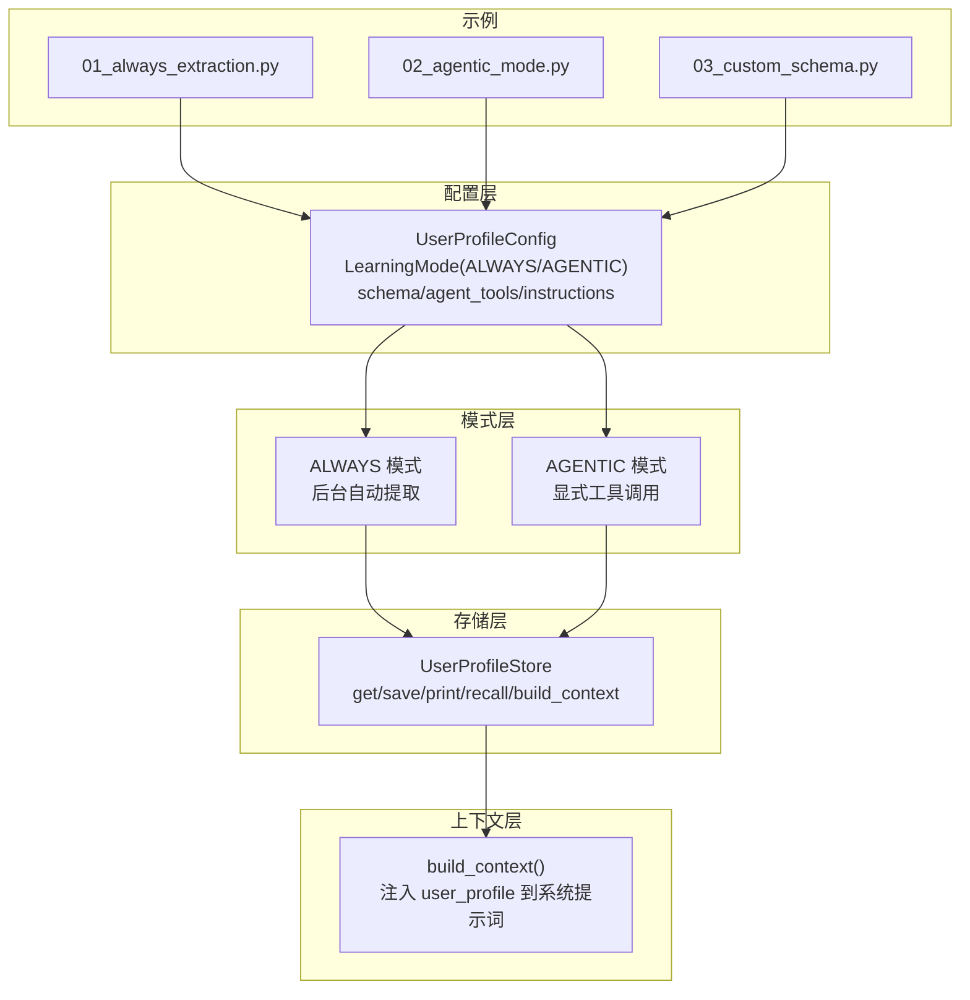
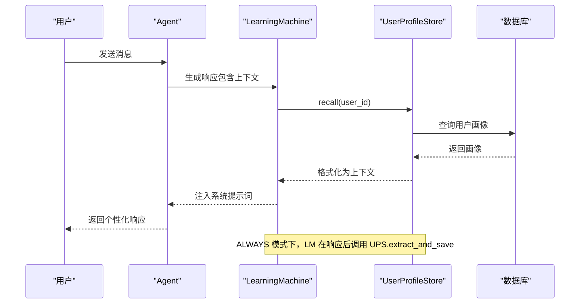
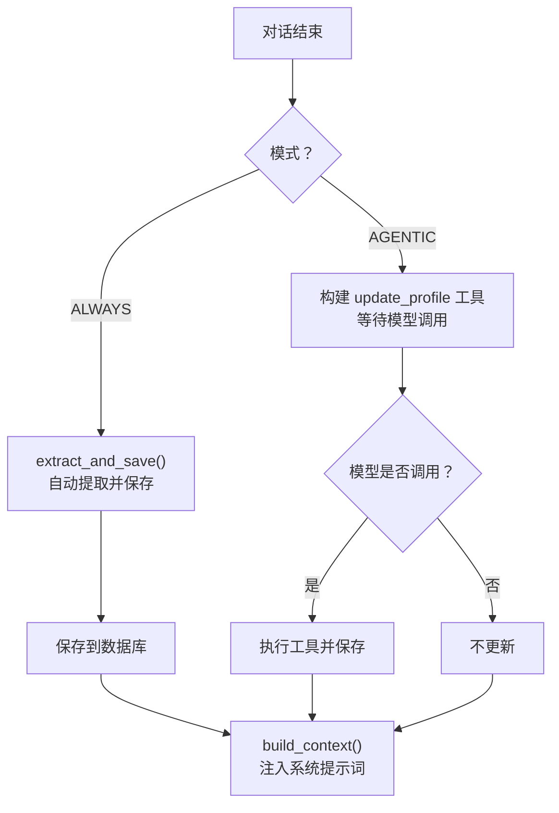
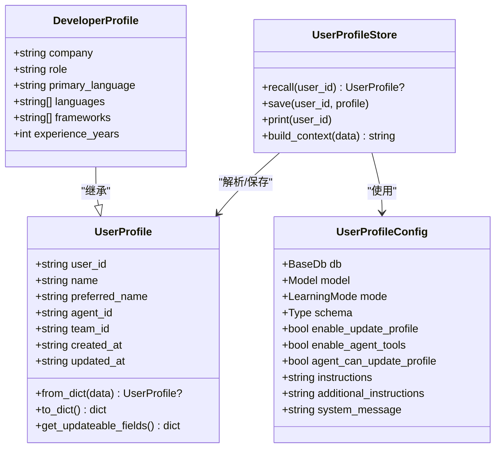
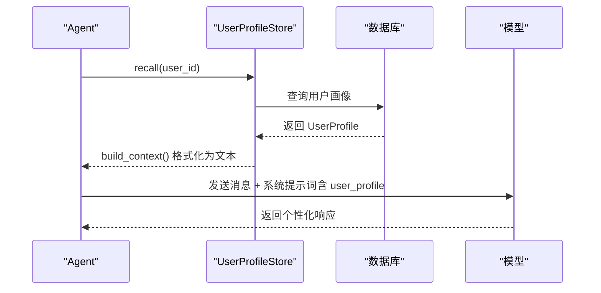
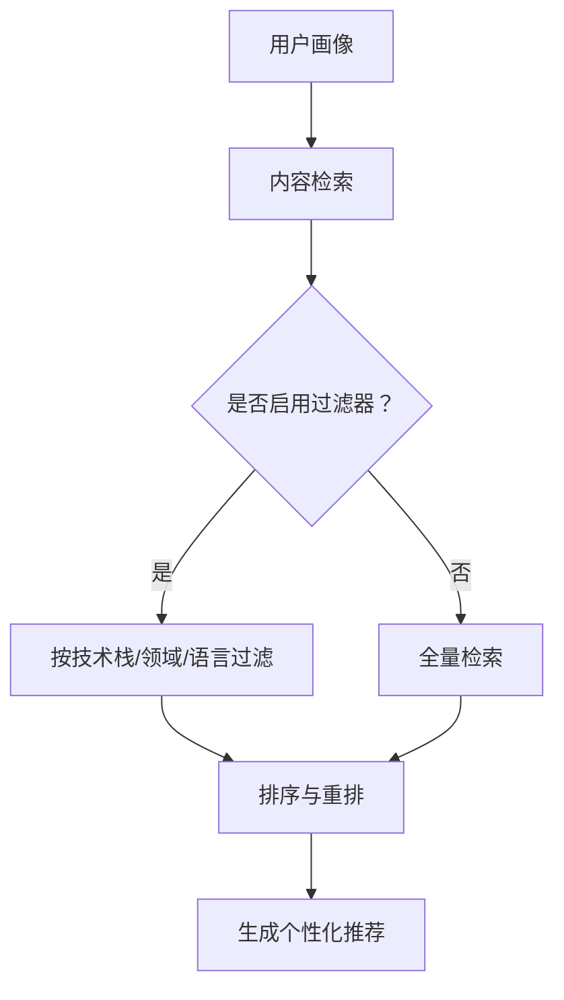
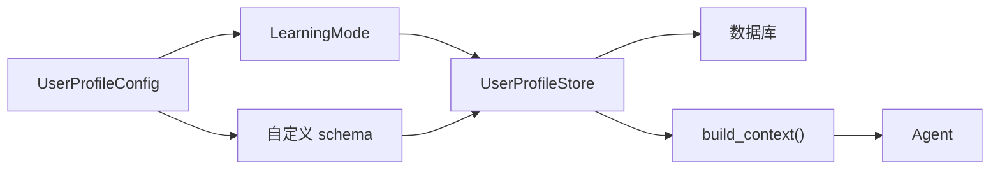

# 用户画像系统

<cite>
**本文引用的文件**
- [01_always_extraction.py](file://cookbook/08_learning/02_user_profile/01_always_extraction.py)
- [02_agentic_mode.py](file://cookbook/08_learning/02_user_profile/02_agentic_mode.py)
- [03_custom_schema.py](file://cookbook/08_learning/02_user_profile/03_custom_schema.py)
- [schemas.py](file://libs/agno/agno/learn/schemas.py)
- [config.py](file://libs/agno/agno/learn/config.py)
- [user_profile.py](file://libs/agno/agno/learn/stores/user_profile.py)
- [machine.py](file://libs/agno/agno/learn/machine.py)
- [personal_assistant.md](file://cookbook/08_learning/07_patterns/personal_assistant.md)
- [filtering.md](file://cookbook/07_knowledge/filters/filtering.md)
- [09_evals/performance/response_with_storage.py.md](file://cookbook/09_evals/performance/response_with_storage.py.md)
- [03_teams/01_quickstart/09_caching.md](file://cookbook/03_teams/01_quickstart/09_caching.md)
- [gemini_3/16_prompt_caching.py](file://cookbook/gemini_3/16_prompt_caching.py)
</cite>

## 目录
1. [简介](#简介)
2. [项目结构](#项目结构)
3. [核心组件](#核心组件)
4. [架构总览](#架构总览)
5. [详细组件分析](#详细组件分析)
6. [依赖分析](#依赖分析)
7. [性能考虑](#性能考虑)
8. [故障排查指南](#故障排查指南)
9. [结论](#结论)
10. [附录](#附录)

## 简介
本文件面向“用户画像系统”的使用者与维护者，系统性阐述如何基于 Agno 学习体系构建与运营用户画像，覆盖以下主题：
- 画像数据的采集、存储与更新机制
- always extraction 模式与 agentic mode 的实现差异与适用场景
- 自定义 schema 的定义与使用（字段类型、描述、验证与转换）
- 个性化推荐中的典型应用（内容过滤、偏好预测、交互优化）
- 画像更新策略、隐私保护与性能优化的最佳实践

## 项目结构
用户画像能力由“配置层”“模式层”“存储层”“上下文注入层”协同实现：
- 配置层：定义学习模式、启用工具、提示词定制等
- 模式层：ALWAYS/AGENTIC 等模式驱动提取与更新
- 存储层：UserProfileStore 负责结构化字段的持久化与检索
- 上下文注入层：将用户画像注入到系统提示词，供模型生成个性化响应

图表来源
- [config.py:52-104](file://libs/agno/agno/learn/config.py#L52-L104)
- [user_profile.py:60-105](file://libs/agno/agno/learn/stores/user_profile.py#L60-L105)
- [01_always_extraction.py:26-35](file://cookbook/08_learning/02_user_profile/01_always_extraction.py#L26-L35)
- [02_agentic_mode.py:24-37](file://cookbook/08_learning/02_user_profile/02_agentic_mode.py#L24-L37)
- [03_custom_schema.py:16-21](file://cookbook/08_learning/02_user_profile/03_custom_schema.py#L16-L21)

章节来源
- [config.py:52-104](file://libs/agno/agno/learn/config.py#L52-L104)
- [user_profile.py:60-105](file://libs/agno/agno/learn/stores/user_profile.py#L60-L105)
- [01_always_extraction.py:26-35](file://cookbook/08_learning/02_user_profile/01_always_extraction.py#L26-L35)
- [02_agentic_mode.py:24-37](file://cookbook/08_learning/02_user_profile/02_agentic_mode.py#L24-L37)
- [03_custom_schema.py:16-21](file://cookbook/08_learning/02_user_profile/03_custom_schema.py#L16-L21)

## 核心组件
- 用户画像配置（UserProfileConfig）
  - 控制学习模式（ALWAYS/AGENTIC）、是否暴露工具、系统提示词、自定义 schema 等
- 用户画像存储（UserProfileStore）
  - 支持结构化字段的读取、保存、打印、异步操作与工具构建
  - 在 ALWAYS 模式下自动提取，在 AGENTIC 模式下通过工具显式更新
- 数据模型（UserProfile 及其扩展）
  - 以 dataclass 为基础，支持字段描述 metadata 用于指导 LLM 提取
- 学习机（LearningMachine）
  - 协调多个学习存储（用户画像、会话上下文、实体记忆、已学知识等）

章节来源
- [config.py:52-104](file://libs/agno/agno/learn/config.py#L52-L104)
- [schemas.py:59-171](file://libs/agno/agno/learn/schemas.py#L59-L171)
- [user_profile.py:60-105](file://libs/agno/agno/learn/stores/user_profile.py#L60-L105)
- [machine.py:52-99](file://libs/agno/agno/learn/machine.py#L52-L99)

## 架构总览
用户画像在系统中的工作流如下：
- ALWAYS 模式：每次对话后，系统自动调用模型从消息中抽取结构化字段，写入数据库
- AGENTIC 模式：模型通过工具显式更新用户画像字段；用户可见工具调用
- 自定义 schema：通过继承 UserProfile 并添加字段描述，指导 LLM 提取特定领域信息
- 上下文注入：在生成响应前，将用户画像格式化注入系统提示词，提升个性化程度

图表来源
- [machine.py:104-162](file://libs/agno/agno/learn/machine.py#L104-L162)
- [user_profile.py:127-181](file://libs/agno/agno/learn/stores/user_profile.py#L127-L181)
- [user_profile.py:183-200](file://libs/agno/agno/learn/stores/user_profile.py#L183-L200)

## 详细组件分析

### ALWAYS 模式与 AGENTIC 模式的实现差异
- ALWAYS 模式
  - 特点：后台自动提取，用户不可见工具调用
  - 触发：LearningMachine.process 或 aprocess 在 ALWAYS 模式下调用 extract_and_save
  - 适用：需要持续、无感知地构建用户画像的场景
- AGENTIC 模式
  - 特点：显式工具调用，用户可观察到工具执行
  - 触发：模型调用 update_profile 工具，UserProfileStore 构建工具并执行保存
  - 适用：需要透明度与可控性的场景，如用户主动修正或补充信息

图表来源
- [user_profile.py:127-181](file://libs/agno/agno/learn/stores/user_profile.py#L127-L181)
- [user_profile.py:869-898](file://libs/agno/agno/learn/stores/user_profile.py#L869-L898)
- [user_profile.py:183-200](file://libs/agno/agno/learn/stores/user_profile.py#L183-L200)

章节来源
- [01_always_extraction.py:26-35](file://cookbook/08_learning/02_user_profile/01_always_extraction.py#L26-L35)
- [02_agentic_mode.py:24-37](file://cookbook/08_learning/02_user_profile/02_agentic_mode.py#L24-L37)
- [user_profile.py:127-181](file://libs/agno/agno/learn/stores/user_profile.py#L127-L181)
- [user_profile.py:869-898](file://libs/agno/agno/learn/stores/user_profile.py#L869-L898)

### 自定义 schema 的定义与使用
- 基础 schema：UserProfile 提供标准字段（名称、昵称等），并支持通过 metadata 描述字段用途
- 扩展 schema：继承 UserProfile，新增业务相关字段（如公司、角色、主语言、技术栈、经验年限等）
- 使用方式：在 UserProfileConfig 中指定 schema，UserProfileStore 将使用该 schema 进行解析与保存
- 字段验证与转换：from_dict_safe/to_dict_safe 负责安全解析与序列化，忽略未知字段，确保鲁棒性

图表来源
- [schemas.py:59-171](file://libs/agno/agno/learn/schemas.py#L59-L171)
- [config.py:52-104](file://libs/agno/agno/learn/config.py#L52-L104)
- [user_profile.py:60-105](file://libs/agno/agno/learn/stores/user_profile.py#L60-L105)
- [03_custom_schema.py:27-44](file://cookbook/08_learning/02_user_profile/03_custom_schema.py#L27-L44)

章节来源
- [schemas.py:59-171](file://libs/agno/agno/learn/schemas.py#L59-L171)
- [config.py:52-104](file://libs/agno/agno/learn/config.py#L52-L104)
- [user_profile.py:60-105](file://libs/agno/agno/learn/stores/user_profile.py#L60-L105)
- [03_custom_schema.py:27-44](file://cookbook/08_learning/02_user_profile/03_custom_schema.py#L27-L44)

### 上下文注入与个性化响应
- build_context：将用户画像格式化为字符串，注入到系统提示词中，使模型在生成响应时考虑用户特征
- 示例：在开发者画像中包含技术栈后，模型能给出更贴合的技术建议

图表来源
- [user_profile.py:183-200](file://libs/agno/agno/learn/stores/user_profile.py#L183-L200)
- [user_profile.py:1050-1084](file://libs/agno/agno/learn/stores/user_profile.py#L1050-L1084)

章节来源
- [user_profile.py:183-200](file://libs/agno/agno/learn/stores/user_profile.py#L183-L200)
- [user_profile.py:1050-1084](file://libs/agno/agno/learn/stores/user_profile.py#L1050-L1084)
- [03_custom_schema.py:109-114](file://cookbook/08_learning/02_user_profile/03_custom_schema.py#L109-L114)

### 个性化推荐的应用示例
- 内容过滤：结合用户画像中的偏好字段（如技术栈、语言、领域），在检索阶段进行过滤
- 偏好预测：利用长期稳定的结构化字段（如角色、经验年限）推断用户对内容类型的倾向
- 交互优化：根据用户画像动态调整提示词风格、术语选择与示例类型，提升理解与满意度

图表来源
- [filtering.md:84-127](file://cookbook/07_knowledge/filters/filtering.md#L84-L127)

章节来源
- [filtering.md:84-127](file://cookbook/07_knowledge/filters/filtering.md#L84-L127)

## 依赖分析
- 配置与模式
  - UserProfileConfig 决定是否启用工具、系统提示词与 schema
  - LearningMode 控制提取行为（ALWAYS/AGENTIC）
- 存储与工具
  - UserProfileStore 负责数据读写、工具构建与上下文注入
  - 通过 from_dict_safe/to_dict_safe 实现 schema 解析与序列化
- 学习机协调
  - LearningMachine 统一管理各学习存储，按需初始化与调用

图表来源
- [config.py:52-104](file://libs/agno/agno/learn/config.py#L52-L104)
- [user_profile.py:60-105](file://libs/agno/agno/learn/stores/user_profile.py#L60-L105)
- [machine.py:111-162](file://libs/agno/agno/learn/machine.py#L111-L162)

章节来源
- [config.py:52-104](file://libs/agno/agno/learn/config.py#L52-L104)
- [user_profile.py:60-105](file://libs/agno/agno/learn/stores/user_profile.py#L60-L105)
- [machine.py:111-162](file://libs/agno/agno/learn/machine.py#L111-L162)

## 性能考虑
- 缓存与预热
  - 大文档/长上下文可利用提示缓存（Prompt Caching）降低重复计算成本
  - 团队示例展示了多层缓存（LLM 层 + 应用层）的收益
- 存储开销
  - 评估读写次数与延迟，避免在高频对话中频繁全量写入
  - 使用增量更新与条件保存，减少不必要的数据库操作
- 评测与监控
  - 使用内置性能评测脚本对比不同配置下的吞吐与延迟
  - 结合日志级别与指标收集，定位瓶颈

章节来源
- [09_evals/performance/response_with_storage.py.md:46-70](file://cookbook/09_evals/performance/response_with_storage.py.md#L46-L70)
- [03_teams/01_quickstart/09_caching.md:29-52](file://cookbook/03_teams/01_quickstart/09_caching.md#L29-L52)
- [gemini_3/16_prompt_caching.py:111-126](file://cookbook/gemini_3/16_prompt_caching.py#L111-L126)

## 故障排查指南
- 模型未提供
  - ALWAYS 模式需要模型实例；若未提供，UserProfileStore 会返回提示信息
- 数据库未提供
  - 若未配置数据库，保存操作会被跳过；可通过异步版本或检查配置修复
- 字段缺失或解析失败
  - from_dict_safe/to_dict_safe 对异常有容错；检查 schema 字段与 metadata 是否正确
- 工具未触发
  - AGENTIC 模式需确保模型具备调用 update_profile 的能力；检查 agent 的工具暴露设置与系统提示词

章节来源
- [user_profile.py:910-917](file://libs/agno/agno/learn/stores/user_profile.py#L910-L917)
- [user_profile.py:715-752](file://libs/agno/agno/learn/stores/user_profile.py#L715-L752)
- [user_profile.py:448-458](file://libs/agno/agno/learn/stores/user_profile.py#L448-L458)

## 结论
用户画像系统通过 ALWAYS/AGENTIC 两种模式实现灵活的数据采集，配合自定义 schema 与上下文注入，能够有效支撑个性化推荐与交互优化。结合缓存、评测与隐私保护机制，可在保证性能的同时满足合规要求。

## 附录
- 最佳实践清单
  - 明确模式选择：后台无感采集选 ALWAYS，透明可控选 AGENTIC
  - 设计清晰 schema：字段带描述，便于 LLM 理解与提取
  - 控制更新频率：避免过度写入，采用增量更新策略
  - 引入过滤与缓存：在检索与提示阶段降低延迟
  - 加强隐私保护：启用 PII 检测与脱敏策略，必要时使用零数据留存模式
  - 持续评测：定期评估响应质量与性能指标，迭代优化