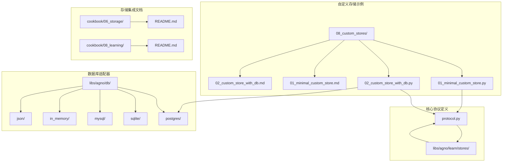
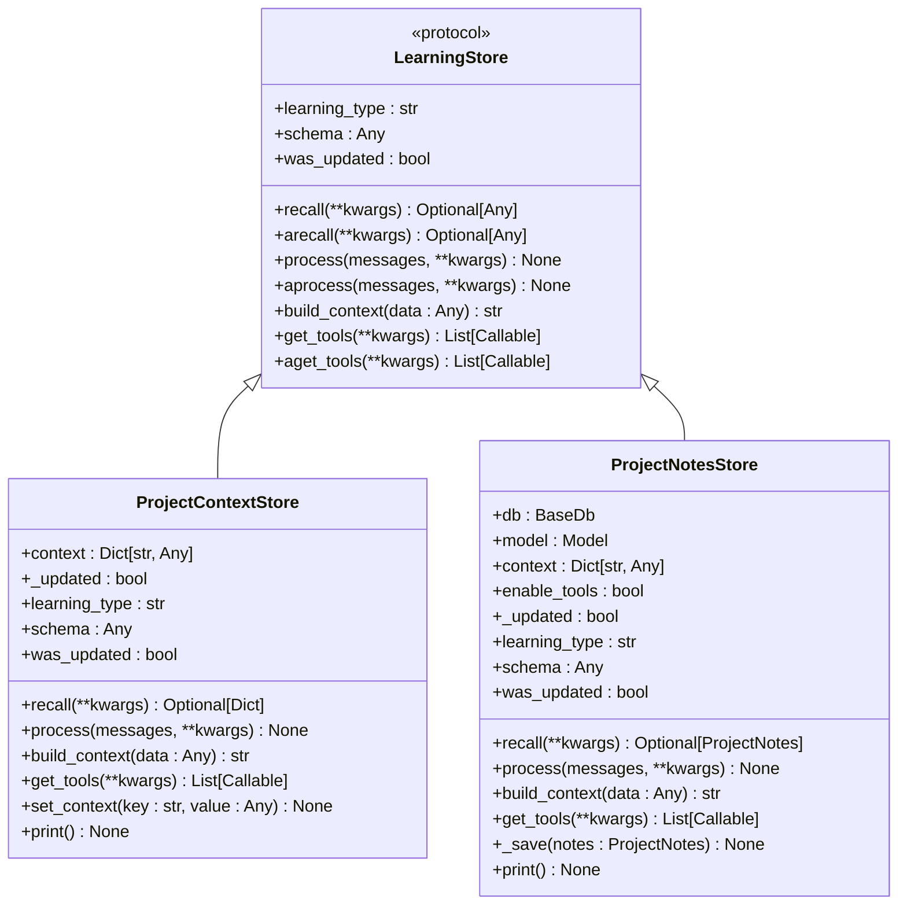
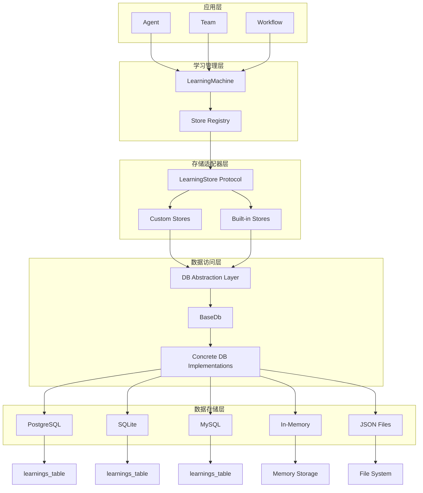
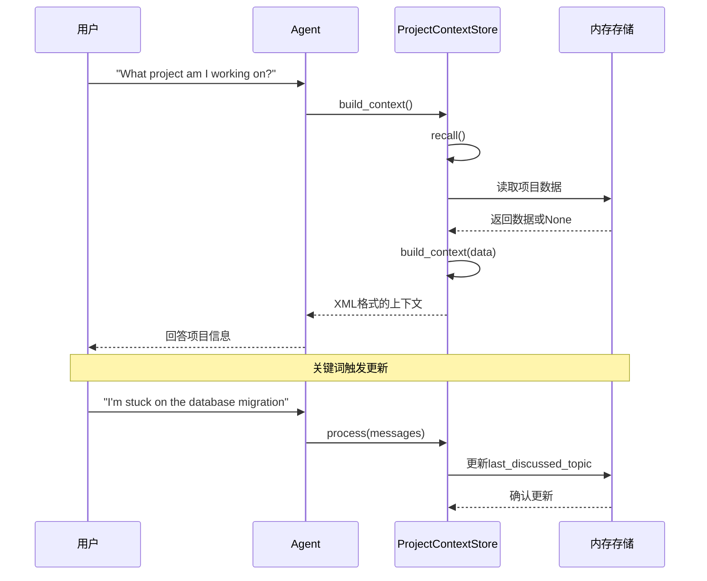
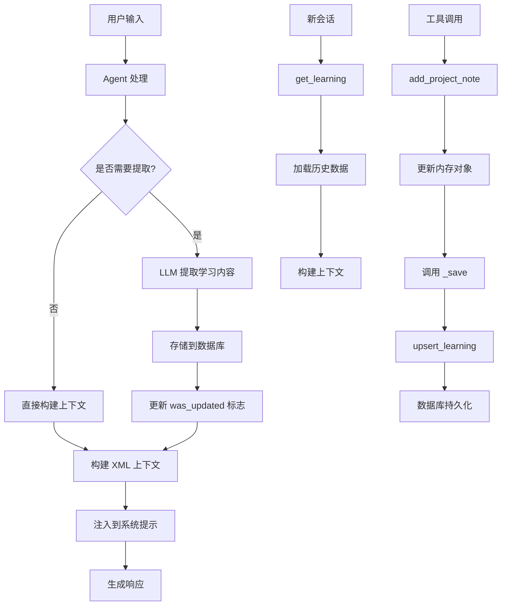
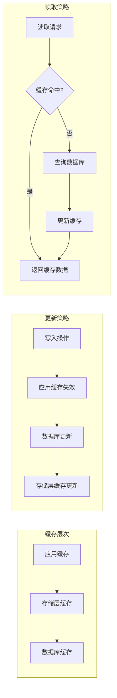
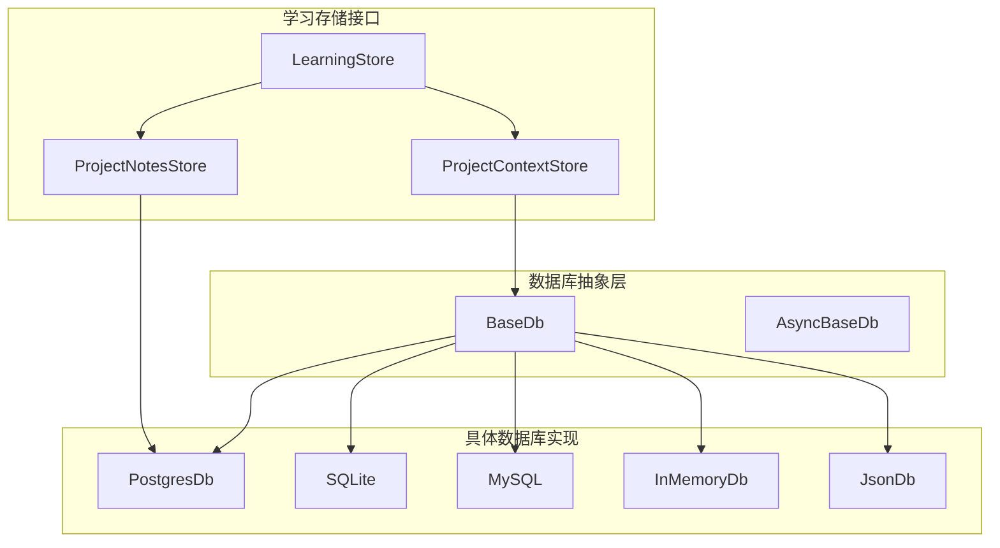
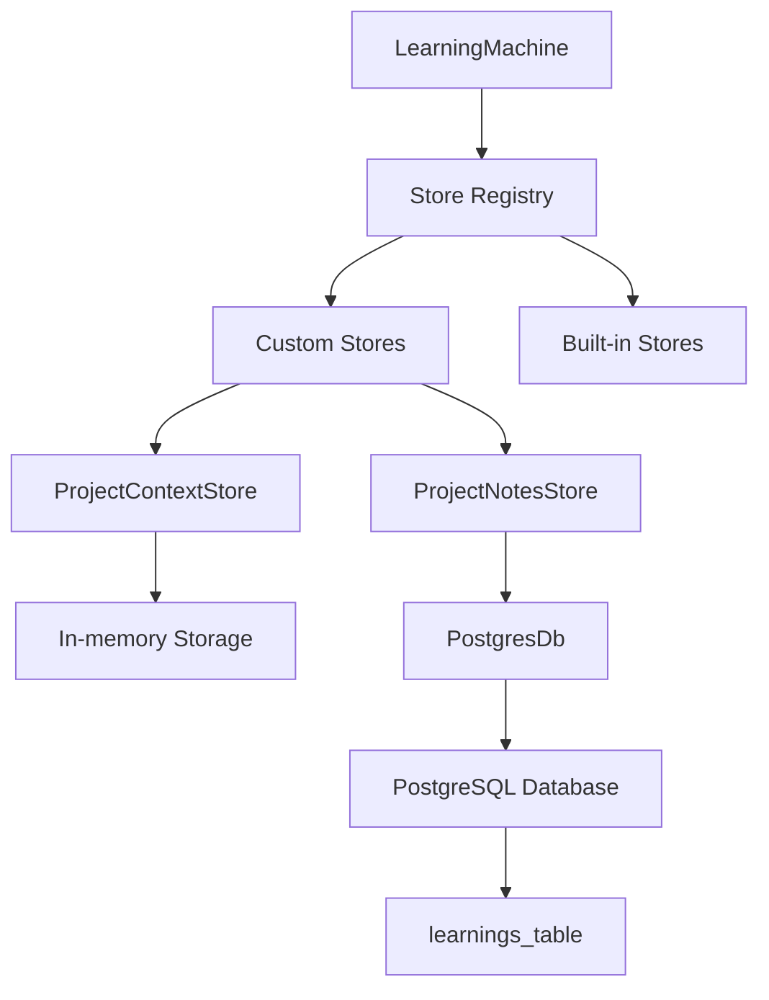

# 自定义存储实现

<cite>
**本文档引用的文件**
- [01_minimal_custom_store.py](file://cookbook/08_learning/08_custom_stores/01_minimal_custom_store.py)
- [01_minimal_custom_store.md](file://cookbook/08_learning/08_custom_stores/01_minimal_custom_store.md)
- [02_custom_store_with_db.py](file://cookbook/08_learning/08_custom_stores/02_custom_store_with_db.py)
- [02_custom_store_with_db.md](file://cookbook/08_learning/08_custom_stores/02_custom_store_with_db.md)
- [protocol.py](file://libs/agno/agno/learn/stores/protocol.py)
- [postgres.py](file://libs/agno/agno/db/postgres/postgres.py)
- [sqlite.py](file://libs/agno/agno/db/sqlite/sqlite.py)
- [mysql.py](file://libs/agno/agno/db/mysql/mysql.py)
- [in_memory_db.py](file://libs/agno/agno/db/in_memory/in_memory_db.py)
- [json_db.py](file://libs/agno/agno/db/json/json_db.py)
- [README.md](file://cookbook/06_storage/README.md)
- [README.md](file://cookbook/08_learning/README.md)
</cite>

## 目录
1. [简介](#简介)
2. [项目结构](#项目结构)
3. [核心组件](#核心组件)
4. [架构概览](#架构概览)
5. [详细组件分析](#详细组件分析)
6. [依赖分析](#依赖分析)
7. [性能考虑](#性能考虑)
8. [故障排除指南](#故障排除指南)
9. [结论](#结论)
10. [附录](#附录)

## 简介

本文档深入介绍了 Agno 框架中自定义学习存储的开发方法。Agno 的学习存储系统允许开发者创建可插拔的知识存储组件，用于在智能体交互过程中捕获、存储和重用各种类型的上下文信息。

学习存储系统的核心优势在于其统一的抽象接口，使得开发者可以轻松地在内存存储、关系型数据库、NoSQL 数据库和分布式存储系统之间切换，而无需修改上层应用逻辑。

## 项目结构

自定义存储实现主要分布在以下目录中：

**图表来源**
- [01_minimal_custom_store.py:1-234](file://cookbook/08_learning/08_custom_stores/01_minimal_custom_store.py#L1-L234)
- [02_custom_store_with_db.py:1-404](file://cookbook/08_learning/08_custom_stores/02_custom_store_with_db.py#L1-L404)
- [protocol.py:1-118](file://libs/agno/agno/learn/stores/protocol.py#L1-L118)

**章节来源**
- [01_minimal_custom_store.py:1-234](file://cookbook/08_learning/08_custom_stores/01_minimal_custom_store.py#L1-L234)
- [02_custom_store_with_db.py:1-404](file://cookbook/08_learning/08_custom_stores/02_custom_store_with_db.py#L1-L404)
- [protocol.py:1-118](file://libs/agno/agno/learn/stores/protocol.py#L1-L118)

## 核心组件

### LearningStore 协议接口

LearningStore 协议定义了所有学习存储必须实现的标准接口：

**图表来源**
- [protocol.py:15-118](file://libs/agno/agno/learn/stores/protocol.py#L15-L118)
- [01_minimal_custom_store.py:30-172](file://cookbook/08_learning/08_custom_stores/01_minimal_custom_store.py#L30-L172)
- [02_custom_store_with_db.py:51-328](file://cookbook/08_learning/08_custom_stores/02_custom_store_with_db.py#L51-L328)

### 存储类型分类

根据实现方式的不同，自定义存储可以分为两大类：

1. **内存存储（Minimal Custom Store）**
   - 使用内存字典进行数据存储
   - 适合开发测试和原型验证
   - 数据在进程重启后丢失

2. **数据库存储（Custom Store with DB）**
   - 使用统一的数据库抽象层进行持久化
   - 支持多种数据库后端
   - 数据具有持久性和可靠性

**章节来源**
- [01_minimal_custom_store.py:26-27](file://cookbook/08_learning/08_custom_stores/01_minimal_custom_store.py#L26-L27)
- [02_custom_store_with_db.py:59-66](file://cookbook/08_learning/08_custom_stores/02_custom_store_with_db.py#L59-L66)

## 架构概览

Agno 的学习存储系统采用分层架构设计，确保了高度的模块化和可扩展性：

**图表来源**
- [protocol.py:15-118](file://libs/agno/agno/learn/stores/protocol.py#L15-L118)
- [postgres.py:60-91](file://libs/agno/agno/db/postgres/postgres.py#L60-L91)
- [README.md:1-55](file://cookbook/06_storage/README.md#L1-L55)

## 详细组件分析

### 最小自定义存储实现

最小自定义存储展示了最基本的实现模式，使用内存存储来演示 LearningStore 协议的所有必需方法。

#### 核心实现要点

1. **协议实现**：完整实现了 LearningStore 协议的所有必需方法
2. **上下文传递**：通过构造函数接收自定义上下文参数
3. **状态管理**：使用内部标志跟踪存储更新状态
4. **异步支持**：提供了完整的异步方法实现

#### 数据流分析

**图表来源**
- [01_minimal_custom_store.py:63-126](file://cookbook/08_learning/08_custom_stores/01_minimal_custom_store.py#L63-L126)
- [01_minimal_custom_store.py:149-171](file://cookbook/08_learning/08_custom_stores/01_minimal_custom_store.py#L149-L171)

**章节来源**
- [01_minimal_custom_store.py:30-172](file://cookbook/08_learning/08_custom_stores/01_minimal_custom_store.py#L30-L172)
- [01_minimal_custom_store.md:18-106](file://cookbook/08_learning/08_custom_stores/01_minimal_custom_store.md#L18-L106)

### 带数据库的自定义存储实现

带数据库的自定义存储展示了如何利用 Agno 的统一数据库抽象层实现持久化存储。

#### 数据库集成机制

1. **统一接口**：使用 `get_learning` 和 `upsert_learning` API
2. **命名空间隔离**：通过 `namespace` 参数实现数据隔离
3. **工具集成**：提供 AGENTIC 工具供智能体主动管理数据
4. **模式验证**：使用数据类进行结构化数据存储

#### 存储流程分析

**图表来源**
- [02_custom_store_with_db.py:88-144](file://cookbook/08_learning/08_custom_stores/02_custom_store_with_db.py#L88-L144)
- [02_custom_store_with_db.py:273-299](file://cookbook/08_learning/08_custom_stores/02_custom_store_with_db.py#L273-L299)

**章节来源**
- [02_custom_store_with_db.py:51-328](file://cookbook/08_learning/08_custom_stores/02_custom_store_with_db.py#L51-L328)
- [02_custom_store_with_db.md:18-86](file://cookbook/08_learning/08_custom_stores/02_custom_store_with_db.md#L18-L86)

### 存储适配器设计模式

#### 数据转换模式

存储适配器采用了灵活的数据转换机制：

1. **Schema 验证**：使用数据类进行结构化存储
2. **上下文格式化**：将存储数据转换为智能体可理解的格式
3. **异步处理**：支持同步和异步两种处理模式

#### 缓存策略

#### 并发控制

存储适配器通过以下机制实现并发控制：

1. **原子操作**：数据库层面的事务保证
2. **锁机制**：针对热点数据的互斥访问
3. **版本控制**：防止并发更新冲突
4. **重试机制**：网络异常时的自动重试

**章节来源**
- [protocol.py:28-46](file://libs/agno/agno/learn/stores/protocol.py#L28-L46)
- [02_custom_store_with_db.py:273-299](file://cookbook/08_learning/08_custom_stores/02_custom_store_with_db.py#L273-L299)

## 依赖分析

### 数据库适配器依赖关系

**图表来源**
- [postgres.py:60-91](file://libs/agno/agno/db/postgres/postgres.py#L60-L91)
- [sqlite.py:4266-4309](file://libs/agno/agno/db/sqlite/sqlite.py#L4266-L4309)
- [mysql.py:2998-3029](file://libs/agno/agno/db/mysql/mysql.py#L2998-L3029)
- [in_memory_db.py:1354-1385](file://libs/agno/agno/db/in_memory/in_memory_db.py#L1354-L1385)
- [json_db.py:1835-1850](file://libs/agno/agno/db/json/json_db.py#L1835-L1850)

### 学习存储依赖关系

**图表来源**
- [01_minimal_custom_store.py:178-195](file://cookbook/08_learning/08_custom_stores/01_minimal_custom_store.py#L178-L195)
- [02_custom_store_with_db.py:334-354](file://cookbook/08_learning/08_custom_stores/02_custom_store_with_db.py#L334-L354)

**章节来源**
- [README.md:35-47](file://cookbook/06_storage/README.md#L35-L47)
- [README.md:1-404](file://cookbook/08_learning/README.md#L1-L404)

## 性能考虑

### 存储性能优化

1. **批量操作**：对于频繁的存储操作，考虑使用批量插入和更新
2. **索引优化**：为常用的查询字段建立适当的数据库索引
3. **连接池管理**：合理配置数据库连接池大小
4. **缓存策略**：实现多级缓存减少数据库访问频率

### 数据一致性保证

1. **事务处理**：对于需要强一致性的操作使用数据库事务
2. **版本控制**：实现乐观锁防止并发更新冲突
3. **数据校验**：在存储前进行数据完整性检查
4. **回滚机制**：实现失败后的数据恢复机制

### 扩展性设计

1. **插件架构**：保持存储适配器的独立性，便于添加新的存储后端
2. **配置驱动**：通过配置文件控制存储行为，避免硬编码
3. **监控指标**：添加存储性能和错误率的监控指标
4. **日志记录**：完善存储操作的日志记录机制

## 故障排除指南

### 常见问题及解决方案

#### 存储接口实现问题

**问题**：自定义存储无法正常工作
**解决方案**：
1. 确保完整实现 LearningStore 协议的所有必需方法
2. 检查 `learning_type` 属性的唯一性
3. 验证 `schema` 属性的正确性

#### 数据库连接问题

**问题**：数据库连接失败或超时
**解决方案**：
1. 检查数据库连接字符串的正确性
2. 验证数据库服务的可用性
3. 检查网络连接和防火墙设置

#### 数据一致性问题

**问题**：并发环境下数据不一致
**解决方案**：
1. 实现适当的锁机制
2. 使用数据库事务保证原子性
3. 添加重试逻辑处理临时性错误

**章节来源**
- [protocol.py:28-117](file://libs/agno/agno/learn/stores/protocol.py#L28-L117)
- [postgres.py:4437-4480](file://libs/agno/agno/db/postgres/postgres.py#L4437-L4480)

## 结论

Agno 的自定义存储系统通过标准化的 LearningStore 协议和统一的数据库抽象层，为开发者提供了一个强大而灵活的学习存储解决方案。该系统支持从简单的内存存储到复杂的分布式数据库存储，满足不同场景下的需求。

通过本文档介绍的实现模式和最佳实践，开发者可以快速构建高质量的自定义存储组件，为智能体应用提供强大的知识管理能力。

## 附录

### 数据格式规范

#### 学习数据结构

| 字段 | 类型 | 描述 | 必需 |
|------|------|------|------|
| id | str | 学习记录的唯一标识符 | 是 |
| learning_type | str | 学习类型标识符 | 是 |
| content | dict | 学习内容的结构化数据 | 是 |
| user_id | str | 关联的用户标识符 | 否 |
| agent_id | str | 关联的智能体标识符 | 否 |
| team_id | str | 关联的团队标识符 | 否 |
| session_id | str | 关联的会话标识符 | 否 |
| namespace | str | 命名空间用于数据隔离 | 否 |
| entity_id | str | 关联的实体标识符 | 否 |
| entity_type | str | 实体类型 | 否 |
| metadata | dict | 元数据信息 | 否 |

### 访问模式设计

#### 命名空间设计原则

1. **用户级别**：使用 `user:{user_id}` 格式
2. **会话级别**：使用 `session:{session_id}` 格式  
3. **项目级别**：使用 `project:{project_id}` 格式
4. **全局级别**：使用 `global` 或自定义命名空间

#### 查询优化建议

1. **索引策略**：为 `learning_type` 和 `namespace` 字段建立复合索引
2. **分页查询**：对于大量数据使用分页查询避免内存溢出
3. **条件过滤**：合理使用 WHERE 条件减少查询结果集
4. **连接复用**：复用数据库连接减少连接开销