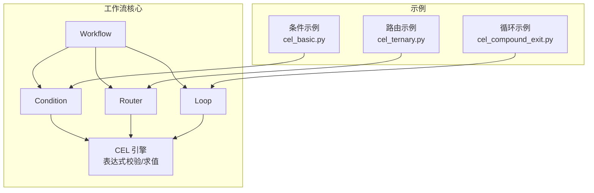
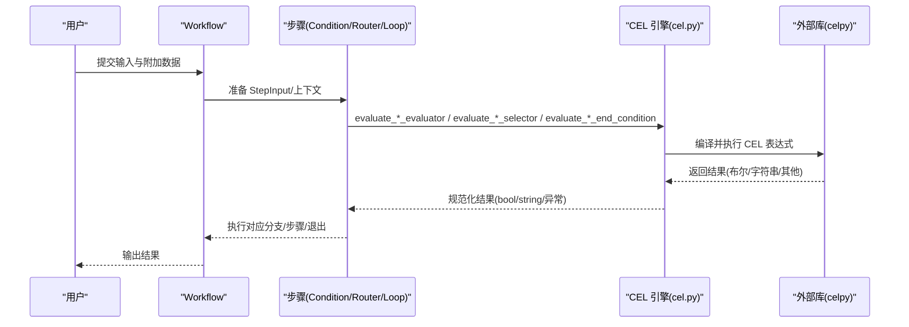
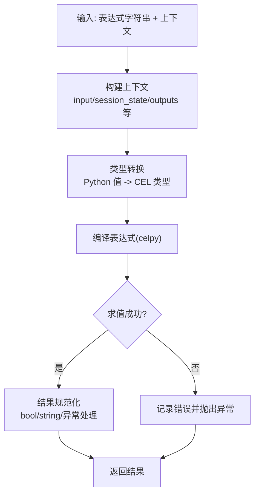
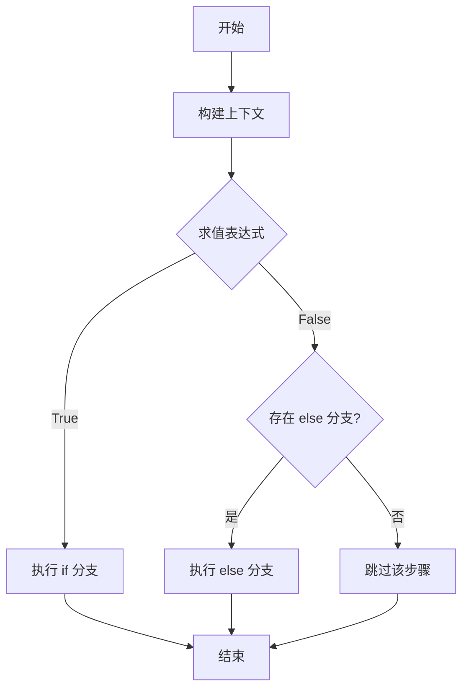
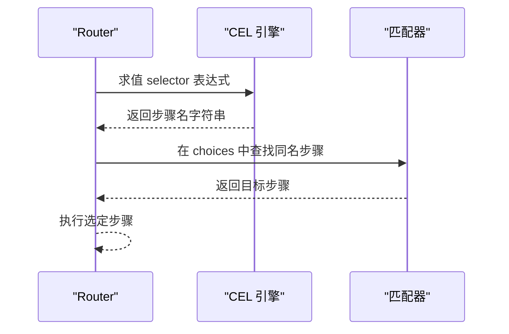
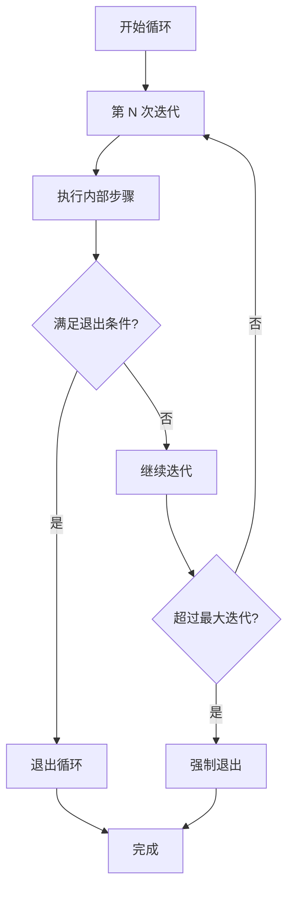
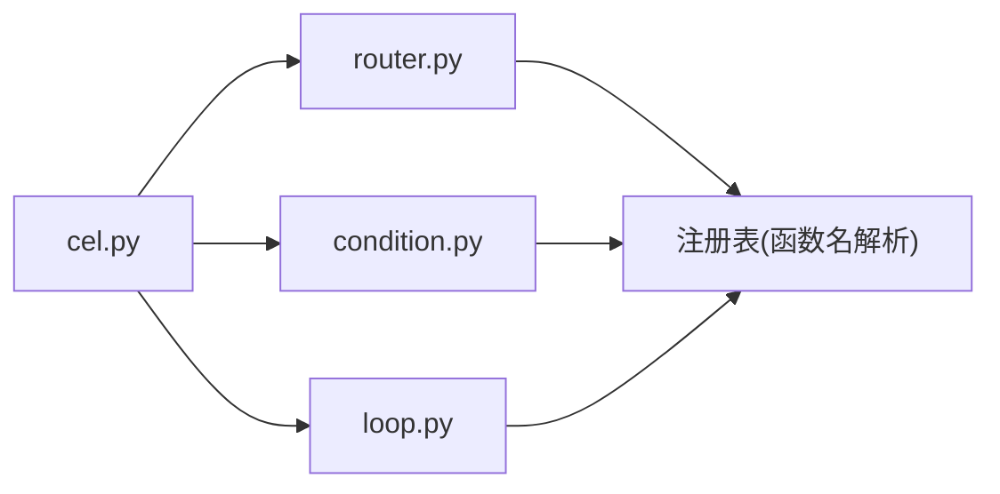

# CEL 表达式

<cite>
**本文引用的文件**
- [cel.py](file://libs/agno/agno/workflow/cel.py)
- [condition.py](file://libs/agno/agno/workflow/condition.py)
- [router.py](file://libs/agno/agno/workflow/router.py)
- [loop.py](file://libs/agno/agno/workflow/loop.py)
- [__init__.py](file://libs/agno/agno/workflow/__init__.py)
- [cel_basic.py](file://cookbook/04_workflows/07_cel_expressions/condition/cel_basic.py)
- [cel_ternary.py](file://cookbook/04_workflows/07_cel_expressions/router/cel_ternary.py)
- [cel_session_state.py](file://cookbook/04_workflows/07_cel_expressions/condition/cel_session_state.py)
- [cel_additional_data.py](file://cookbook/04_workflows/07_cel_expressions/condition/cel_additional_data.py)
- [cel_previous_step.py](file://cookbook/04_workflows/07_cel_expressions/condition/cel_previous_step.py)
- [cel_compound_exit.py](file://cookbook/04_workflows/07_cel_expressions/loop/cel_compound_exit.py)
- [cel_compound_exit.md](file://cookbook/04_workflows/07_cel_expressions/loop/cel_compound_exit.md)
- [cel_ternary.md](file://cookbook/04_workflows/07_cel_expressions/router/cel_ternary.md)
- [cel_basic.md](file://cookbook/04_workflows/07_cel_expressions/condition/cel_basic.md)
</cite>

## 目录
1. [简介](#简介)
2. [项目结构](#项目结构)
3. [核心组件](#核心组件)
4. [架构总览](#架构总览)
5. [详细组件分析](#详细组件分析)
6. [依赖分析](#依赖分析)
7. [性能考虑](#性能考虑)
8. [故障排查指南](#故障排查指南)
9. [结论](#结论)
10. [附录](#附录)

## 简介
本章节面向 Agno Learn 的工作流系统，系统化介绍 CEL（Common Expression Language）表达式在工作流中的应用。CEL 是一种简洁、可移植、非图灵完备的语言，适合在工作流中进行条件判断、路由选择与循环退出控制。Agno 将 CEL 集成到 Condition、Router 和 Loop 等关键步骤中，通过字符串形式的表达式替代传统 Python 函数，降低配置复杂度并提升可维护性。

CEL 的核心能力包括：
- 条件表达式：用于分支决策（如紧急请求、优先级、重试计数、前序步骤输出等）
- 路由选择：通过三元运算符或表达式返回步骤名，自动匹配 choices
- 循环控制：以复合条件控制迭代退出，结合“是否全部成功”和“迭代次数”等变量
- 类型系统与上下文：内置字符串、布尔、整数、浮点、列表、映射等类型，并提供丰富的上下文变量

## 项目结构
与 CEL 表达式相关的核心代码位于工作流模块中，示例代码位于 cookbook 的相应子目录。下图展示了 CEL 在工作流中的位置与依赖关系：

图表来源
- [cel.py:1-300](file://libs/agno/agno/workflow/cel.py#L1-L300)
- [condition.py:41-135](file://libs/agno/agno/workflow/condition.py#L41-L135)
- [router.py:83-90](file://libs/agno/agno/workflow/router.py#L83-L90)
- [loop.py:40-75](file://libs/agno/agno/workflow/loop.py#L40-L75)
- [cel_basic.py:42-56](file://cookbook/04_workflows/07_cel_expressions/condition/cel_basic.py#L42-L56)
- [cel_ternary.py:43-55](file://cookbook/04_workflows/07_cel_expressions/router/cel_ternary.py#L43-L55)
- [cel_compound_exit.py:42-55](file://cookbook/04_workflows/07_cel_expressions/loop/cel_compound_exit.py#L42-L55)

章节来源
- [cel.py:1-300](file://libs/agno/agno/workflow/cel.py#L1-L300)
- [condition.py:41-135](file://libs/agno/agno/workflow/condition.py#L41-L135)
- [router.py:83-90](file://libs/agno/agno/workflow/router.py#L83-L90)
- [loop.py:40-75](file://libs/agno/agno/workflow/loop.py#L40-L75)
- [cel_basic.py:1-70](file://cookbook/04_workflows/07_cel_expressions/condition/cel_basic.py#L1-L70)
- [cel_ternary.py:1-67](file://cookbook/04_workflows/07_cel_expressions/router/cel_ternary.py#L1-L67)
- [cel_compound_exit.py:1-67](file://cookbook/04_workflows/07_cel_expressions/loop/cel_compound_exit.py#L1-L67)

## 核心组件
- 表达式引擎与上下文
  - 提供 CEL 表达式校验、条件求值、路由选择求值、循环结束条件求值等能力
  - 将 Python 值转换为 CEL 兼容类型，并构建求值上下文
- 条件步骤（Condition）
  - 支持 evaluator 为函数、布尔或 CEL 表达式字符串
  - 上下文变量：input、previous_step_content、previous_step_outputs、additional_data、session_state
- 路由步骤（Router）
  - 支持 selector 为函数、列表或 CEL 表达式字符串
  - 上下文变量：input、previous_step_content、previous_step_outputs、additional_data、session_state、step_choices
- 循环步骤（Loop）
  - 支持 end_condition 为函数或 CEL 表达式字符串
  - 上下文变量：current_iteration、max_iterations、all_success、last_step_content、step_outputs

章节来源
- [cel.py:68-300](file://libs/agno/agno/workflow/cel.py#L68-L300)
- [condition.py:41-135](file://libs/agno/agno/workflow/condition.py#L41-L135)
- [router.py:83-90](file://libs/agno/agno/workflow/router.py#L83-L90)
- [loop.py:40-75](file://libs/agno/agno/workflow/loop.py#L40-L75)

## 架构总览
下图展示了 CEL 在工作流中的执行路径：用户配置表达式字符串，工作流在运行时构建上下文并调用 CEL 引擎求值，最终驱动条件分支、路由选择或循环退出。

图表来源
- [cel.py:159-198](file://libs/agno/agno/workflow/cel.py#L159-L198)
- [condition.py:163-200](file://libs/agno/agno/workflow/condition.py#L163-L200)
- [router.py:202-269](file://libs/agno/agno/workflow/router.py#L202-L269)
- [loop.py:166-200](file://libs/agno/agno/workflow/loop.py#L166-L200)

## 详细组件分析

### 表达式引擎与上下文（cel.py）
- 功能要点
  - 表达式校验：compile 并捕获异常，便于 UI 或配置阶段提前发现问题
  - 表达式识别：通过正则与关键字集合判断字符串是否为 CEL 表达式
  - 条件求值：将表达式结果强制转为布尔
  - 路由选择求值：将表达式结果强制转为字符串（用于匹配步骤名）
  - 类型转换：将 Python 值递归转换为 CEL 类型（None、bool、int、float、str、list、dict）
  - 上下文构建：为不同步骤类型构建一致的上下文变量集
- 关键上下文变量
  - Condition/Router：input、previous_step_content、previous_step_outputs、additional_data、session_state
  - Router：step_choices（可用步骤名列表）
  - Loop：current_iteration、max_iterations、all_success、last_step_content、step_outputs

图表来源
- [cel.py:159-198](file://libs/agno/agno/workflow/cel.py#L159-L198)
- [cel.py:200-227](file://libs/agno/agno/workflow/cel.py#L200-L227)
- [cel.py:229-300](file://libs/agno/agno/workflow/cel.py#L229-L300)

章节来源
- [cel.py:68-300](file://libs/agno/agno/workflow/cel.py#L68-L300)

### 条件步骤（Condition）
- 支持 evaluator 为函数、布尔或 CEL 表达式字符串
- 上下文变量：input、previous_step_content、previous_step_outputs、additional_data、session_state
- 示例场景
  - 基于输入内容判断（如包含特定关键词）
  - 基于会话状态（如重试计数）
  - 基于附加数据（如优先级）

图表来源
- [condition.py:41-135](file://libs/agno/agno/workflow/condition.py#L41-L135)
- [cel.py:99-114](file://libs/agno/agno/workflow/cel.py#L99-L114)

章节来源
- [condition.py:41-135](file://libs/agno/agno/workflow/condition.py#L41-L135)
- [cel_basic.py:42-56](file://cookbook/04_workflows/07_cel_expressions/condition/cel_basic.py#L42-L56)
- [cel_session_state.py:70-87](file://cookbook/04_workflows/07_cel_expressions/condition/cel_session_state.py#L70-L87)
- [cel_additional_data.py:42-56](file://cookbook/04_workflows/07_cel_expressions/condition/cel_additional_data.py#L42-L56)
- [cel_previous_step.py:52-67](file://cookbook/04_workflows/07_cel_expressions/condition/cel_previous_step.py#L52-L67)

### 路由步骤（Router）
- 支持 selector 为函数、列表或 CEL 表达式字符串
- 三元运算符示例：根据输入内容返回步骤名，Router 自动匹配 choices
- 上下文变量：input、previous_step_content、previous_step_outputs、additional_data、session_state、step_choices

图表来源
- [router.py:83-90](file://libs/agno/agno/workflow/router.py#L83-L90)
- [cel.py:136-157](file://libs/agno/agno/workflow/cel.py#L136-L157)

章节来源
- [router.py:83-90](file://libs/agno/agno/workflow/router.py#L83-L90)
- [cel_ternary.py:43-55](file://cookbook/04_workflows/07_cel_expressions/router/cel_ternary.py#L43-L55)
- [cel_ternary.md:19-30](file://cookbook/04_workflows/07_cel_expressions/router/cel_ternary.md#L19-L30)

### 循环步骤（Loop）
- 支持 end_condition 为函数或 CEL 表达式字符串
- 上下文变量：current_iteration、max_iterations、all_success、last_step_content、step_outputs
- 复合退出条件示例：当 all_success 为真且 current_iteration 达到阈值时退出

图表来源
- [loop.py:40-75](file://libs/agno/agno/workflow/loop.py#L40-L75)
- [cel.py:116-134](file://libs/agno/agno/workflow/cel.py#L116-L134)
- [cel_compound_exit.md:20-38](file://cookbook/04_workflows/07_cel_expressions/loop/cel_compound_exit.md#L20-L38)

章节来源
- [loop.py:40-75](file://libs/agno/agno/workflow/loop.py#L40-L75)
- [cel_compound_exit.py:42-55](file://cookbook/04_workflows/07_cel_expressions/loop/cel_compound_exit.py#L42-L55)
- [cel_compound_exit.md:18-38](file://cookbook/04_workflows/07_cel_expressions/loop/cel_compound_exit.md#L18-L38)

### 类型系统与上下文变量
- 类型系统
  - 基本类型：布尔、整数、浮点、字符串
  - 复合类型：列表、映射（字典）
  - 转换规则：None 保持；数字与字符串按需转换；列表/映射递归转换
- 上下文变量（Condition/Router）
  - input：当前输入内容（字符串）
  - previous_step_content：前一步输出内容（字符串）
  - previous_step_outputs：前序步骤输出映射（step_name -> 内容字符串）
  - additional_data：附加数据（字典）
  - session_state：会话状态（字典）
  - step_choices（Router 专用）：可用步骤名列表
- 上下文变量（Loop）
  - current_iteration：当前迭代次数（从 1 开始）
  - max_iterations：最大迭代次数
  - all_success：当前迭代是否全部成功
  - last_step_content：当前迭代最后一步内容
  - step_outputs：当前迭代各步骤输出映射

章节来源
- [cel.py:200-227](file://libs/agno/agno/workflow/cel.py#L200-L227)
- [cel.py:229-300](file://libs/agno/agno/workflow/cel.py#L229-L300)
- [condition.py:54-66](file://libs/agno/agno/workflow/condition.py#L54-L66)
- [router.py:146-153](file://libs/agno/agno/workflow/router.py#L146-L153)
- [loop.py:48-61](file://libs/agno/agno/workflow/loop.py#L48-L61)

### 执行环境与函数注册
- 执行环境
  - 通过构建上下文将 input、session_state、previous_step_* 等变量注入 CEL
  - 使用 celpy 的 Environment/Program 执行表达式
- 函数注册
  - Router/Condition/Loop 支持 selector/evaluator 为函数名字符串，通过注册表查找函数
  - 若为纯标识符（不含运算符/括号等），则视为函数名而非 CEL 表达式

章节来源
- [router.py:238-253](file://libs/agno/agno/workflow/router.py#L238-L253)
- [condition.py:197-200](file://libs/agno/agno/workflow/condition.py#L197-L200)
- [cel.py:87-97](file://libs/agno/agno/workflow/cel.py#L87-L97)

### 语法与示例（来自示例代码）
- 条件表达式
  - 基于输入内容：如 input.contains("urgent")
  - 基于会话状态：如 session_state.retry_count <= 3
  - 基于附加数据：如 additional_data.priority > 5
  - 基于前序输出：如 previous_step_content.contains("TECHNICAL")
- 路由选择
  - 三元运算符：input.contains("video") ? "Video Handler" : "Image Handler"
- 循环退出
  - 复合条件：all_success && current_iteration >= 2

章节来源
- [cel_basic.py:47-47](file://cookbook/04_workflows/07_cel_expressions/condition/cel_basic.py#L47-L47)
- [cel_session_state.py:76-76](file://cookbook/04_workflows/07_cel_expressions/condition/cel_session_state.py#L76-L76)
- [cel_additional_data.py:47-47](file://cookbook/04_workflows/07_cel_expressions/condition/cel_additional_data.py#L47-L47)
- [cel_previous_step.py:58-58](file://cookbook/04_workflows/07_cel_expressions/condition/cel_previous_step.py#L58-L58)
- [cel_ternary.py:48-48](file://cookbook/04_workflows/07_cel_expressions/router/cel_ternary.py#L48-L48)
- [cel_compound_exit.md:22-31](file://cookbook/04_workflows/07_cel_expressions/loop/cel_compound_exit.md#L22-L31)

## 依赖分析
- 模块耦合
  - 工作流核心模块（condition.py、router.py、loop.py）依赖 cel.py 提供的表达式求值能力
  - 表达式引擎对 celpy 存在可选依赖，未安装时提供明确提示
- 外部依赖
  - celpy：CEL 编译与执行
  - Python 标准库：json、re、typing 等

图表来源
- [cel.py:12-29](file://libs/agno/agno/workflow/cel.py#L12-L29)
- [router.py:238-253](file://libs/agno/agno/workflow/router.py#L238-L253)
- [condition.py:197-200](file://libs/agno/agno/workflow/condition.py#L197-L200)
- [loop.py:197-200](file://libs/agno/agno/workflow/loop.py#L197-L200)

章节来源
- [cel.py:12-29](file://libs/agno/agno/workflow/cel.py#L12-L29)
- [router.py:238-253](file://libs/agno/agno/workflow/router.py#L238-L253)
- [condition.py:197-200](file://libs/agno/agno/workflow/condition.py#L197-L200)
- [loop.py:197-200](file://libs/agno/agno/workflow/loop.py#L197-L200)

## 性能考虑
- 表达式缓存与预编译
  - 对相同表达式可复用 Program 对象，避免重复编译
  - 在高频场景下，建议对表达式进行去重与缓存管理
- 执行计划
  - 将复杂表达式拆分为多个简单表达式，减少单次求值开销
  - 合理利用上下文变量，避免不必要的字符串拼接与转换
- 资源隔离
  - 在并发运行多个工作流时，注意 CEL 环境的线程安全与资源释放

## 故障排查指南
- 安装与可用性
  - 若未安装 cel-python，将无法使用 CEL 表达式，需先安装
- 表达式校验
  - 使用 validate_cel_expression 在保存或加载配置前进行语法校验
- 常见问题
  - 变量类型不匹配：确保使用正确的类型（如字符串比较、布尔运算）
  - 上下文缺失：确认 input、session_state、previous_step_* 等变量是否按预期设置
  - 路由选择失败：确认 selector 返回的步骤名与 choices 中的 name 一致
  - 循环退出异常：核对 current_iteration、all_success 等变量的含义与边界

章节来源
- [cel.py:68-85](file://libs/agno/agno/workflow/cel.py#L68-L85)
- [cel.py:160-172](file://libs/agno/agno/workflow/cel.py#L160-L172)
- [__init__.py:1-37](file://libs/agno/agno/workflow/__init__.py#L1-L37)

## 结论
CEL 表达式为 Agno 工作流提供了简洁、可配置的逻辑控制能力。通过统一的上下文变量与类型转换机制，开发者可以在不编写 Python 代码的情况下实现条件分支、动态路由与循环控制。配合表达式校验与清晰的错误提示，CEL 能够在保证易用性的同时，满足复杂业务场景的需求。

## 附录
- 快速参考
  - 条件步骤：evaluator 支持函数、布尔、CEL 表达式字符串
  - 路由步骤：selector 支持函数、列表、CEL 表达式字符串
  - 循环步骤：end_condition 支持函数、CEL 表达式字符串
  - 上下文变量：input、previous_step_content、previous_step_outputs、additional_data、session_state、step_choices（Router）、current_iteration、max_iterations、all_success、last_step_content、step_outputs（Loop）