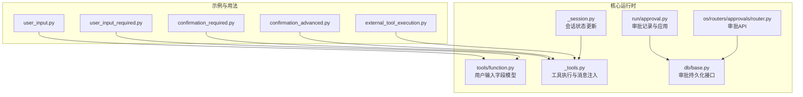
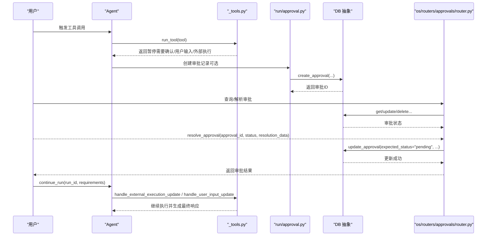
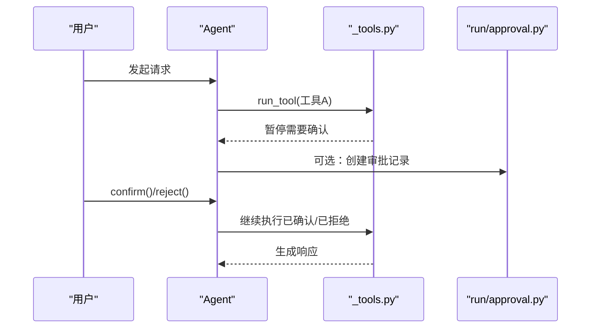
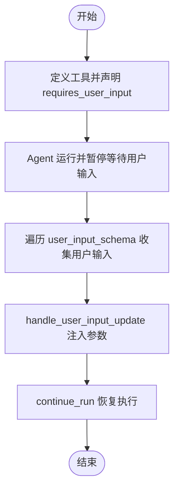
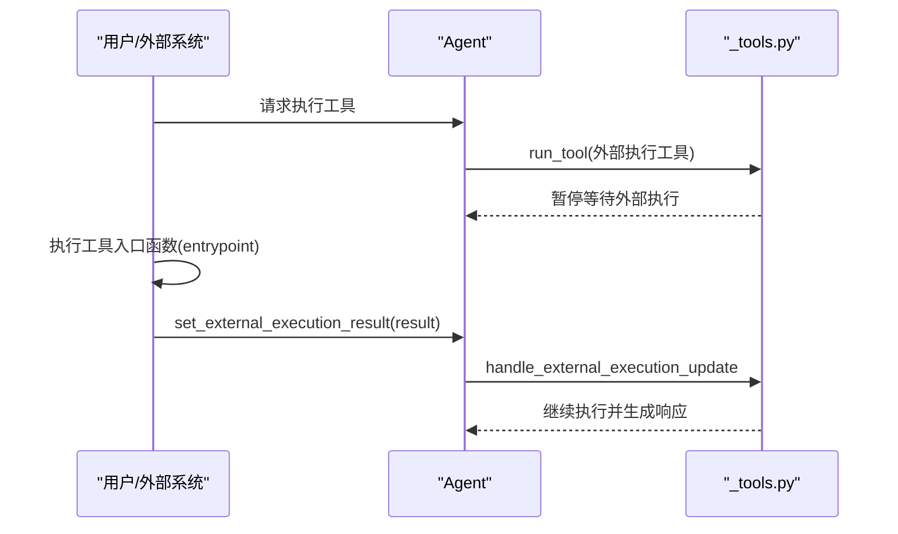
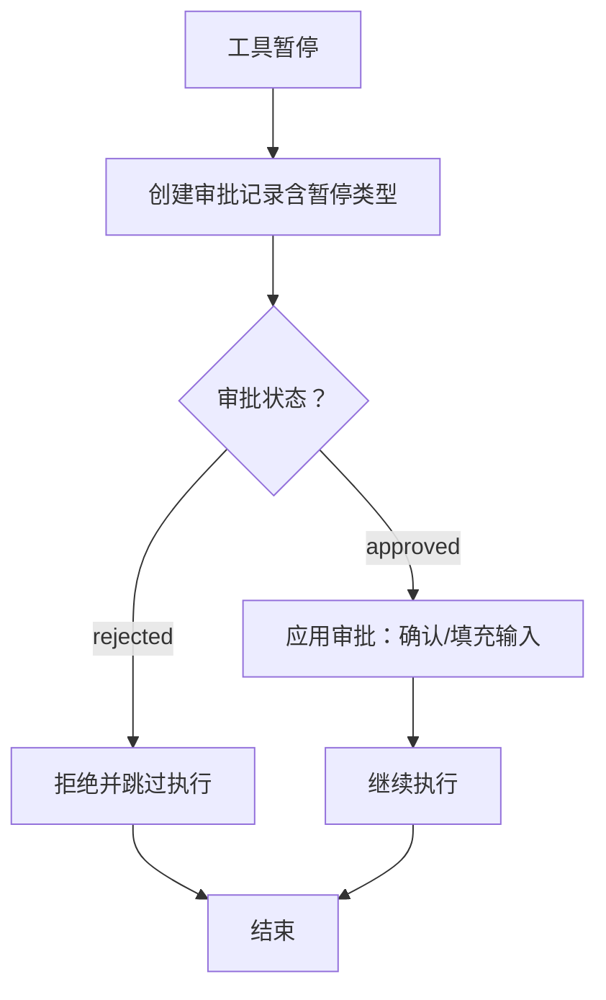
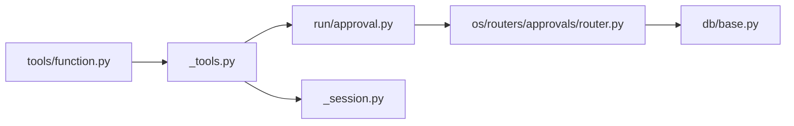

# 人机协作

<cite>
**本文引用的文件**
- [cookbook/02_agents/10_human_in_the_loop/confirmation_required.py](file://cookbook/02_agents/10_human_in_the_loop/confirmation_required.py)
- [cookbook/02_agents/10_human_in_the_loop/confirmation_advanced.py](file://cookbook/02_agents/10_human_in_the_loop/confirmation_advanced.py)
- [cookbook/02_agents/10_human_in_the_loop/user_input.py](file://cookbook/02_agents/10_human_in_the_loop/user_input.py)
- [cookbook/02_agents/10_human_in_the_loop/user_input_required.py](file://cookbook/02_agents/10_human_in_the_loop/user_input_required.py)
- [cookbook/02_agents/10_human_in_the_loop/external_tool_execution.py](file://cookbook/02_agents/10_human_in_the_loop/external_tool_execution.py)
- [libs/agno/agno/tools/function.py](file://libs/agno/agno/tools/function.py)
- [libs/agno/agno/agent/_tools.py](file://libs/agno/agno/agent/_tools.py)
- [libs/agno/agno/run/approval.py](file://libs/agno/agno/run/approval.py)
- [libs/agno/agno/os/routers/approvals/router.py](file://libs/agno/agno/os/routers/approvals/router.py)
- [libs/agno/agno/db/base.py](file://libs/agno/agno/db/base.py)
- [libs/agno/agno/agent/_session.py](file://libs/agno/agno/agent/_session.py)
- [cookbook/02_agents/05_state_and_session/session_state_manual_update.md](file://cookbook/02_agents/05_state_and_session/session_state_manual_update.md)
- [cookbook/02_agents/05_state_and_session/session_state_events.md](file://cookbook/02_agents/05_state_and_session/session_state_events.md)
- [cookbook/04_workflows/06_advanced_concepts/session_state/state_in_router.py](file://cookbook/04_workflows/06_advanced_concepts/session_state/state_in_router.py)
- [cookbook/00_quickstart/human_in_the_loop.md](file://cookbook/00_quickstart/human_in_the_loop.md)
</cite>

## 目录
1. [简介](#简介)
2. [项目结构](#项目结构)
3. [核心组件](#核心组件)
4. [架构总览](#架构总览)
5. [详细组件分析](#详细组件分析)
6. [依赖分析](#依赖分析)
7. [性能考虑](#性能考虑)
8. [故障排查指南](#故障排查指南)
9. [结论](#结论)
10. [附录](#附录)

## 简介
本章节面向 Agno Learn 的“人机协作”能力，系统化阐述工作流中的人工确认、用户输入与外部工具执行三大机制的设计与实现。文档覆盖以下主题：
- 人工确认：确认触发、用户交互、决策处理与继续执行
- 用户输入：输入收集、校验、数据转换与状态更新
- 外部工具执行：工具调用、结果注入与错误恢复
- 权限控制与审计：基于审批的访问控制与审计日志
- 工作流集成：在多智能体与工作流中嵌入协作元素
- 用户体验：界面优化、交互流畅性与反馈机制
- 监控与分析：协作效率与用户满意度的度量与优化建议

## 项目结构
围绕人机协作，仓库提供了两类资源：
- 示例与用法：位于 cookbook/02_agents/10_human_in_the_loop 与 cookbook/03_teams/20_human_in_the_loop，演示确认、用户输入、外部工具执行等场景
- 核心运行时与基础设施：位于 libs/agno/agno 下，包含工具函数模型、工具执行逻辑、审批与路由接口、数据库抽象等

图表来源
- [cookbook/02_agents/10_human_in_the_loop/confirmation_required.py:1-96](file://cookbook/02_agents/10_human_in_the_loop/confirmation_required.py#L1-L96)
- [cookbook/02_agents/10_human_in_the_loop/user_input.py:1-145](file://cookbook/02_agents/10_human_in_the_loop/user_input.py#L1-L145)
- [cookbook/02_agents/10_human_in_the_loop/external_tool_execution.py:1-72](file://cookbook/02_agents/10_human_in_the_loop/external_tool_execution.py#L1-L72)
- [libs/agno/agno/tools/function.py:40-200](file://libs/agno/agno/tools/function.py#L40-L200)
- [libs/agno/agno/agent/_tools.py:511-679](file://libs/agno/agno/agent/_tools.py#L511-L679)
- [libs/agno/agno/run/approval.py:1-200](file://libs/agno/agno/run/approval.py#L1-L200)
- [libs/agno/agno/os/routers/approvals/router.py:1-172](file://libs/agno/agno/os/routers/approvals/router.py#L1-L172)
- [libs/agno/agno/db/base.py:1761-1814](file://libs/agno/agno/db/base.py#L1761-L1814)
- [libs/agno/agno/agent/_session.py:505-518](file://libs/agno/agno/agent/_session.py#L505-L518)

章节来源
- [cookbook/02_agents/10_human_in_the_loop/confirmation_required.py:1-96](file://cookbook/02_agents/10_human_in_the_loop/confirmation_required.py#L1-L96)
- [cookbook/02_agents/10_human_in_the_loop/user_input.py:1-145](file://cookbook/02_agents/10_human_in_the_loop/user_input.py#L1-L145)
- [cookbook/02_agents/10_human_in_the_loop/external_tool_execution.py:1-72](file://cookbook/02_agents/10_human_in_the_loop/external_tool_execution.py#L1-L72)
- [libs/agno/agno/tools/function.py:40-200](file://libs/agno/agno/tools/function.py#L40-L200)
- [libs/agno/agno/agent/_tools.py:511-679](file://libs/agno/agno/agent/_tools.py#L511-L679)
- [libs/agno/agno/run/approval.py:1-200](file://libs/agno/agno/run/approval.py#L1-L200)
- [libs/agno/agno/os/routers/approvals/router.py:1-172](file://libs/agno/agno/os/routers/approvals/router.py#L1-L172)
- [libs/agno/agno/db/base.py:1761-1814](file://libs/agno/agno/db/base.py#L1761-L1814)
- [libs/agno/agno/agent/_session.py:505-518](file://libs/agno/agno/agent/_session.py#L505-L518)

## 核心组件
- 工具函数模型与用户输入字段
  - UserInputField：用于定义用户输入字段的名称、类型、描述与默认值，并支持序列化/反序列化
  - Function：封装函数名、参数模式、入口函数、是否需要确认/用户输入/外部执行、审批类型等元信息
- 工具执行与消息注入
  - handle_external_execution_update：当外部执行完成时，将结果注入 run_messages 并清除外部执行标记
  - handle_user_input_update：将用户输入字段值写回到工具参数中
  - run_tool：执行工具调用并将结果消息附加到 run_messages
- 审批与权限控制
  - run/approval.py：根据暂停类型（确认/用户输入/外部执行）构建审批记录；在批准后对工具进行确认或填充用户输入
  - os/routers/approvals/router.py：提供审批查询、计数、状态查询、解析与删除的 API
  - db/base.py：定义审批持久化接口（创建、查询、更新、删除、计数等），具体实现需由数据库适配器提供
- 会话状态与事件
  - _session.py：提供会话状态的更新与持久化
  - session_state_events.md：说明通过事件流获取最终会话状态的能力

章节来源
- [libs/agno/agno/tools/function.py:40-200](file://libs/agno/agno/tools/function.py#L40-L200)
- [libs/agno/agno/agent/_tools.py:511-679](file://libs/agno/agno/agent/_tools.py#L511-L679)
- [libs/agno/agno/run/approval.py:1-200](file://libs/agno/agno/run/approval.py#L1-L200)
- [libs/agno/agno/os/routers/approvals/router.py:1-172](file://libs/agno/agno/os/routers/approvals/router.py#L1-L172)
- [libs/agno/agno/db/base.py:1761-1814](file://libs/agno/agno/db/base.py#L1761-L1814)
- [libs/agno/agno/agent/_session.py:505-518](file://libs/agno/agno/agent/_session.py#L505-L518)

## 架构总览
下图展示了从工具调用到人工介入再到继续执行的整体流程，以及审批与审计在其中的作用。

图表来源
- [libs/agno/agno/agent/_tools.py:511-679](file://libs/agno/agno/agent/_tools.py#L511-L679)
- [libs/agno/agno/run/approval.py:152-200](file://libs/agno/agno/run/approval.py#L152-L200)
- [libs/agno/agno/os/routers/approvals/router.py:128-171](file://libs/agno/agno/os/routers/approvals/router.py#L128-L171)
- [libs/agno/agno/db/base.py:1761-1814](file://libs/agno/agno/db/base.py#L1761-L1814)

## 详细组件分析

### 人工确认（requires_confirmation）
- 流程设计
  - 工具声明 requires_confirmation=True 后，模型调用该工具时会暂停，等待用户确认
  - 用户可在命令行中选择“是/否”，随后调用 requirement.confirm()/requirement.reject()，再通过 agent.continue_run() 恢复执行
- 关键实现要点
  - 工具装饰器与暂停条件判断
  - 用户交互与决策处理
  - 继续执行时的工具状态更新
- 实战示例路径
  - [cookbook/02_agents/10_human_in_the_loop/confirmation_required.py:23-87](file://cookbook/02_agents/10_human_in_the_loop/confirmation_required.py#L23-L87)
  - [cookbook/02_agents/10_human_in_the_loop/confirmation_advanced.py:23-95](file://cookbook/02_agents/10_human_in_the_loop/confirmation_advanced.py#L23-L95)

图表来源
- [libs/agno/agno/agent/_tools.py:622-679](file://libs/agno/agno/agent/_tools.py#L622-L679)
- [libs/agno/agno/run/approval.py:1-200](file://libs/agno/agno/run/approval.py#L1-L200)
- [cookbook/02_agents/10_human_in_the_loop/confirmation_required.py:66-87](file://cookbook/02_agents/10_human_in_the_loop/confirmation_required.py#L66-L87)

章节来源
- [cookbook/02_agents/10_human_in_the_loop/confirmation_required.py:1-96](file://cookbook/02_agents/10_human_in_the_loop/confirmation_required.py#L1-L96)
- [cookbook/02_agents/10_human_in_the_loop/confirmation_advanced.py:1-97](file://cookbook/02_agents/10_human_in_the_loop/confirmation_advanced.py#L1-L97)
- [libs/agno/agno/agent/_tools.py:622-679](file://libs/agno/agno/agent/_tools.py#L622-L679)
- [libs/agno/agno/run/approval.py:1-200](file://libs/agno/agno/run/approval.py#L1-L200)

### 用户输入（requires_user_input）
- 收集与处理
  - 工具声明 requires_user_input=True，并可指定 user_input_fields 以限定需要用户提供的字段
  - 运行时通过 requirement.user_input_schema 获取字段定义，逐项收集用户输入并写回字段值
  - handle_user_input_update 将字段值注入工具参数，随后继续执行
- 数据转换与状态更新
  - UserInputField 支持类型映射与序列化/反序列化，便于跨模块传递
  - 会话状态可通过手动更新与事件流感知，确保后续推理上下文一致
- 实战示例路径
  - [cookbook/02_agents/10_human_in_the_loop/user_input.py:77-108](file://cookbook/02_agents/10_human_in_the_loop/user_input.py#L77-L108)
  - [cookbook/02_agents/10_human_in_the_loop/user_input_required.py:50-77](file://cookbook/02_agents/10_human_in_the_loop/user_input_required.py#L50-L77)
  - [libs/agno/agno/tools/function.py:40-71](file://libs/agno/agno/tools/function.py#L40-L71)
  - [libs/agno/agno/agent/_session.py:505-518](file://libs/agno/agno/agent/_session.py#L505-L518)

图表来源
- [libs/agno/agno/tools/function.py:40-71](file://libs/agno/agno/tools/function.py#L40-L71)
- [libs/agno/agno/agent/_tools.py:536-541](file://libs/agno/agno/agent/_tools.py#L536-L541)
- [cookbook/02_agents/10_human_in_the_loop/user_input.py:77-108](file://cookbook/02_agents/10_human_in_the_loop/user_input.py#L77-L108)

章节来源
- [cookbook/02_agents/10_human_in_the_loop/user_input.py:1-145](file://cookbook/02_agents/10_human_in_the_loop/user_input.py#L1-L145)
- [cookbook/02_agents/10_human_in_the_loop/user_input_required.py:1-82](file://cookbook/02_agents/10_human_in_the_loop/user_input_required.py#L1-L82)
- [libs/agno/agno/tools/function.py:40-71](file://libs/agno/agno/tools/function.py#L40-L71)
- [libs/agno/agno/agent/_session.py:505-518](file://libs/agno/agno/agent/_session.py#L505-L518)

### 外部工具执行（external_execution）
- 执行与结果注入
  - 工具声明 external_execution=True 后，Agent 不直接执行该工具，而是暂停并等待外部执行
  - 用户或外部系统执行工具入口函数，调用 requirement.set_external_execution_result(result) 注入结果
  - handle_external_execution_update 将结果作为工具消息加入 run_messages，并清除外部执行标记
- 错误恢复
  - 若未设置结果即尝试继续，将抛出异常提示无法继续
- 实战示例路径
  - [cookbook/02_agents/10_human_in_the_loop/external_tool_execution.py:50-67](file://cookbook/02_agents/10_human_in_the_loop/external_tool_execution.py#L50-L67)
  - [libs/agno/agno/agent/_tools.py:511-534](file://libs/agno/agno/agent/_tools.py#L511-L534)

图表来源
- [libs/agno/agno/agent/_tools.py:511-534](file://libs/agno/agno/agent/_tools.py#L511-L534)
- [cookbook/02_agents/10_human_in_the_loop/external_tool_execution.py:50-67](file://cookbook/02_agents/10_human_in_the_loop/external_tool_execution.py#L50-L67)

章节来源
- [cookbook/02_agents/10_human_in_the_loop/external_tool_execution.py:1-72](file://cookbook/02_agents/10_human_in_the_loop/external_tool_execution.py#L1-L72)
- [libs/agno/agno/agent/_tools.py:511-534](file://libs/agno/agno/agent/_tools.py#L511-L534)

### 权限控制与审计（审批）
- 审批类型
  - required：阻塞式审批，必须经审批后才能继续
  - audit：非阻塞审计，仅记录审计日志，不影响执行
- 审批记录与应用
  - run/approval.py 在暂停时创建审批记录，包含暂停类型（确认/用户输入/外部执行）、工具名与参数、来源类型（agent/team/workflow）等
  - 审批解析后，对工具进行确认或填充用户输入字段
- API 与持久化
  - os/routers/approvals/router.py 提供审批列表、计数、状态查询、解析与删除接口
  - db/base.py 定义审批持久化接口，需由具体数据库适配器实现
- 实战示例路径
  - [libs/agno/agno/run/approval.py:152-200](file://libs/agno/agno/run/approval.py#L152-L200)
  - [libs/agno/agno/os/routers/approvals/router.py:128-171](file://libs/agno/agno/os/routers/approvals/router.py#L128-L171)
  - [libs/agno/agno/db/base.py:1761-1814](file://libs/agno/agno/db/base.py#L1761-L1814)

图表来源
- [libs/agno/agno/run/approval.py:332-352](file://libs/agno/agno/run/approval.py#L332-L352)
- [libs/agno/agno/os/routers/approvals/router.py:128-171](file://libs/agno/agno/os/routers/approvals/router.py#L128-L171)

章节来源
- [libs/agno/agno/run/approval.py:1-200](file://libs/agno/agno/run/approval.py#L1-L200)
- [libs/agno/agno/os/routers/approvals/router.py:1-172](file://libs/agno/agno/os/routers/approvals/router.py#L1-L172)
- [libs/agno/agno/db/base.py:1761-1814](file://libs/agno/agno/db/base.py#L1761-L1814)

### 工作流中的集成与状态管理
- 会话状态更新
  - 通过 agent.update_session_state 将更新写回数据库与内存，确保后续推理上下文一致
  - 事件流可捕获 RunCompletedEvent 中的最终会话状态，便于调试与观测
- 路由与偏好设置
  - 在工作流中可根据会话状态动态路由到不同步骤或代理偏好
- 实战示例路径
  - [libs/agno/agno/agent/_session.py:505-518](file://libs/agno/agno/agent/_session.py#L505-L518)
  - [cookbook/02_agents/05_state_and_session/session_state_manual_update.md:64-86](file://cookbook/02_agents/05_state_and_session/session_state_manual_update.md#L64-L86)
  - [cookbook/02_agents/05_state_and_session/session_state_events.md:20-44](file://cookbook/02_agents/05_state_and_session/session_state_events.md#L20-L44)
  - [cookbook/04_workflows/06_advanced_concepts/session_state/state_in_router.py:34-66](file://cookbook/04_workflows/06_advanced_concepts/session_state/state_in_router.py#L34-L66)

章节来源
- [libs/agno/agno/agent/_session.py:505-518](file://libs/agno/agno/agent/_session.py#L505-L518)
- [cookbook/02_agents/05_state_and_session/session_state_manual_update.md:64-86](file://cookbook/02_agents/05_state_and_session/session_state_manual_update.md#L64-L86)
- [cookbook/02_agents/05_state_and_session/session_state_events.md:20-44](file://cookbook/02_agents/05_state_and_session/session_state_events.md#L20-L44)
- [cookbook/04_workflows/06_advanced_concepts/session_state/state_in_router.py:34-66](file://cookbook/04_workflows/06_advanced_concepts/session_state/state_in_router.py#L34-L66)

## 依赖分析
- 组件耦合
  - 工具层（tools/function.py）与运行时（agent/_tools.py）通过工具执行对象与消息注入解耦
  - 审批层（run/approval.py）与路由层（os/routers/approvals/router.py）通过数据库抽象（db/base.py）解耦
- 外部依赖
  - 示例中使用 httpx、subprocess 等库，但这些属于示例范畴，核心运行时不直接依赖
- 循环依赖
  - 当前结构清晰，未见循环依赖迹象

图表来源
- [libs/agno/agno/tools/function.py:132-200](file://libs/agno/agno/tools/function.py#L132-L200)
- [libs/agno/agno/agent/_tools.py:511-679](file://libs/agno/agno/agent/_tools.py#L511-L679)
- [libs/agno/agno/run/approval.py:1-200](file://libs/agno/agno/run/approval.py#L1-L200)
- [libs/agno/agno/os/routers/approvals/router.py:1-172](file://libs/agno/agno/os/routers/approvals/router.py#L1-L172)
- [libs/agno/agno/db/base.py:1761-1814](file://libs/agno/agno/db/base.py#L1761-L1814)
- [libs/agno/agno/agent/_session.py:505-518](file://libs/agno/agno/agent/_session.py#L505-L518)

章节来源
- [libs/agno/agno/tools/function.py:132-200](file://libs/agno/agno/tools/function.py#L132-L200)
- [libs/agno/agno/agent/_tools.py:511-679](file://libs/agno/agno/agent/_tools.py#L511-L679)
- [libs/agno/agno/run/approval.py:1-200](file://libs/agno/agno/run/approval.py#L1-L200)
- [libs/agno/agno/os/routers/approvals/router.py:1-172](file://libs/agno/agno/os/routers/approvals/router.py#L1-L172)
- [libs/agno/agno/db/base.py:1761-1814](file://libs/agno/agno/db/base.py#L1761-L1814)
- [libs/agno/agno/agent/_session.py:505-518](file://libs/agno/agno/agent/_session.py#L505-L518)

## 性能考虑
- 工具执行与消息注入
  - 外部执行与用户输入注入均通过消息注入完成，避免重复计算
  - 建议在工具入口函数中进行必要的轻量级校验，减少不必要的网络/IO
- 审批与数据库交互
  - 审批创建与解析应尽量批量处理，减少数据库往返
  - 对高频审批场景，建议使用异步接口与连接池
- 会话状态更新
  - 手动更新后应避免频繁读写，采用批处理或事件驱动更新策略

## 故障排查指南
- 外部执行未设置结果
  - 现象：继续执行时报错提示工具需要外部执行且无法继续
  - 处理：确保在外部执行完成后调用 set_external_execution_result 注入结果
  - 参考路径：[libs/agno/agno/agent/_tools.py:532-534](file://libs/agno/agno/agent/_tools.py#L532-L534)
- 审批解析冲突
  - 现象：解析失败或状态已是已解析
  - 处理：检查 expected_status 与当前状态一致性，确认审批存在
  - 参考路径：[libs/agno/agno/os/routers/approvals/router.py:142-157](file://libs/agno/agno/os/routers/approvals/router.py#L142-L157)
- 审批持久化未实现
  - 现象：数据库适配器未实现审批方法
  - 处理：实现 db/base.py 中定义的审批接口或切换支持的适配器
  - 参考路径：[libs/agno/agno/db/base.py:1761-1814](file://libs/agno/agno/db/base.py#L1761-L1814)
- 会话状态未生效
  - 现象：后续推理未感知到状态变化
  - 处理：确认通过 update_session_state 写回并持久化，必要时启用事件流观察最终状态
  - 参考路径：[libs/agno/agno/agent/_session.py:505-518](file://libs/agno/agno/agent/_session.py#L505-L518)

章节来源
- [libs/agno/agno/agent/_tools.py:532-534](file://libs/agno/agno/agent/_tools.py#L532-L534)
- [libs/agno/agno/os/routers/approvals/router.py:142-157](file://libs/agno/agno/os/routers/approvals/router.py#L142-L157)
- [libs/agno/agno/db/base.py:1761-1814](file://libs/agno/agno/db/base.py#L1761-L1814)
- [libs/agno/agno/agent/_session.py:505-518](file://libs/agno/agno/agent/_session.py#L505-L518)

## 结论
Agno Learn 的人机协作通过“确认/输入/外部执行”三类暂停机制与审批体系，实现了可控、可观测、可审计的人机协同。配合会话状态与事件流，开发者可以在多智能体与工作流中灵活嵌入协作元素，并通过 API 与数据库抽象实现统一的权限控制与审计能力。建议在生产环境中结合异步与批处理策略优化性能，并通过事件流与审批 API 建立完善的监控与分析体系。

## 附录
- 快速参考路径
  - 人工确认：[cookbook/02_agents/10_human_in_the_loop/confirmation_required.py:66-87](file://cookbook/02_agents/10_human_in_the_loop/confirmation_required.py#L66-L87)
  - 用户输入：[cookbook/02_agents/10_human_in_the_loop/user_input.py:77-108](file://cookbook/02_agents/10_human_in_the_loop/user_input.py#L77-L108)
  - 外部执行：[cookbook/02_agents/10_human_in_the_loop/external_tool_execution.py:50-67](file://cookbook/02_agents/10_human_in_the_loop/external_tool_execution.py#L50-L67)
  - 审批 API：[libs/agno/agno/os/routers/approvals/router.py:128-171](file://libs/agno/agno/os/routers/approvals/router.py#L128-L171)
  - 审批持久化接口：[libs/agno/agno/db/base.py:1761-1814](file://libs/agno/agno/db/base.py#L1761-L1814)
  - 会话状态更新：[libs/agno/agno/agent/_session.py:505-518](file://libs/agno/agno/agent/_session.py#L505-L518)
  - 架构概览（快速入门）：[cookbook/00_quickstart/human_in_the_loop.md:25-54](file://cookbook/00_quickstart/human_in_the_loop.md#L25-L54)