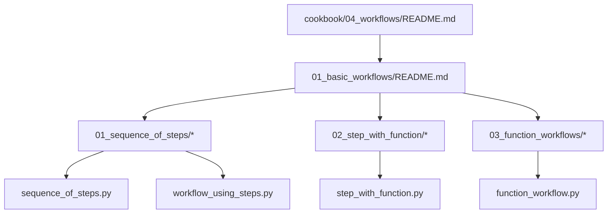
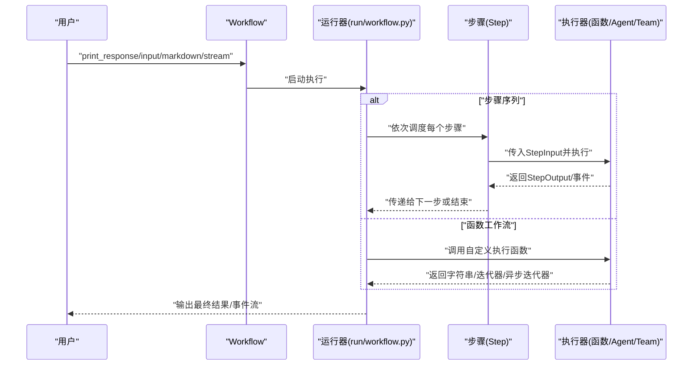
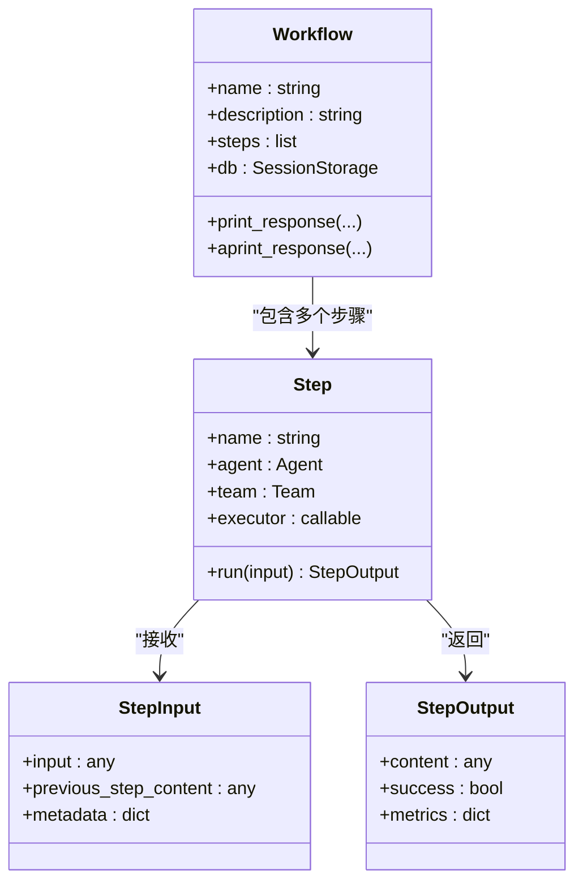
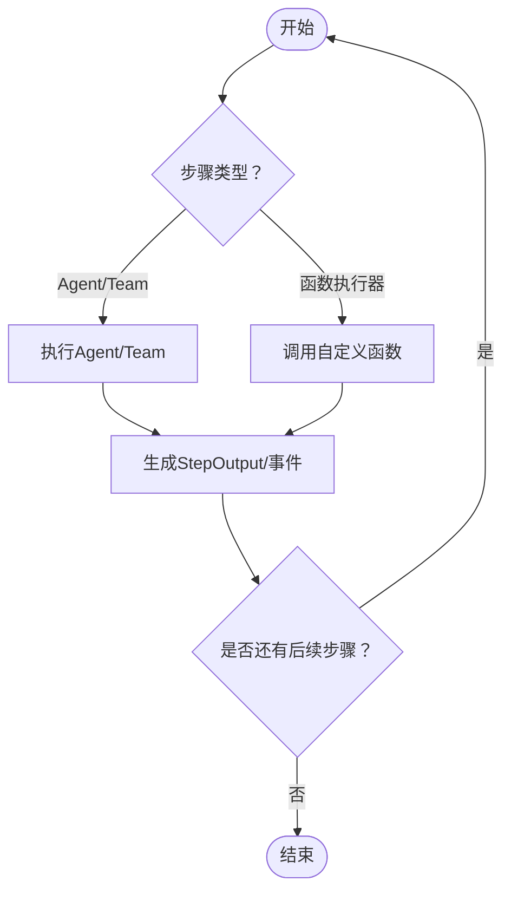
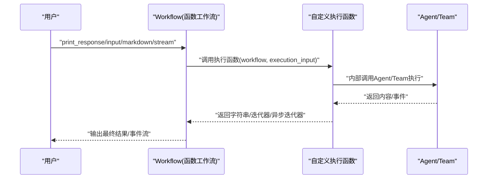
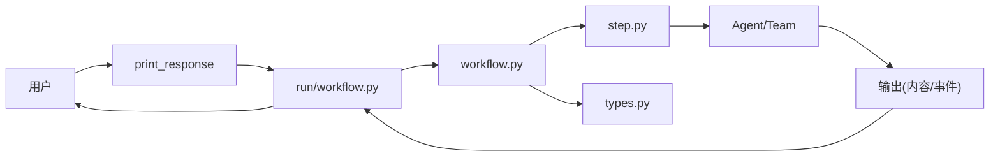

# 基础工作流

<cite>
**本文引用的文件**
- [cookbook/04_workflows/README.md](file://cookbook/04_workflows/README.md)
- [cookbook/04_workflows/01_basic_workflows/README.md](file://cookbook/04_workflows/01_basic_workflows/README.md)
- [cookbook/04_workflows/01_basic_workflows/01_sequence_of_steps/README.md](file://cookbook/04_workflows/01_basic_workflows/01_sequence_of_steps/README.md)
- [cookbook/04_workflows/01_basic_workflows/01_sequence_of_steps/sequence_of_steps.py](file://cookbook/04_workflows/01_basic_workflows/01_sequence_of_steps/sequence_of_steps.py)
- [cookbook/04_workflows/01_basic_workflows/01_sequence_of_steps/workflow_using_steps.py](file://cookbook/04_workflows/01_basic_workflows/01_sequence_of_steps/workflow_using_steps.py)
- [cookbook/04_workflows/01_basic_workflows/02_step_with_function/README.md](file://cookbook/04_workflows/01_basic_workflows/02_step_with_function/README.md)
- [cookbook/04_workflows/01_basic_workflows/02_step_with_function/step_with_function.py](file://cookbook/04_workflows/01_basic_workflows/02_step_with_function/step_with_function.py)
- [cookbook/04_workflows/01_basic_workflows/03_function_workflows/function_workflow.py](file://cookbook/04_workflows/01_basic_workflows/03_function_workflows/function_workflow.py)
- [libs/agno/agno/workflow/workflow.py](file://libs/agno/agno/workflow/workflow.py)
- [libs/agno/agno/workflow/step.py](file://libs/agno/agno/workflow/step.py)
- [libs/agno/agno/workflow/types.py](file://libs/agno/agno/workflow/types.py)
- [libs/agno/agno/run/workflow.py](file://libs/agno/agno/run/workflow.py)
- [libs/agno/agno/session/workflow.py](file://libs/agno/agno/session/workflow.py)
- [libs/agno/agno/utils/print_response/workflow.py](file://libs/agno/agno/utils/print_response/workflow.py)
- [libs/agno/agno/api/workflow.py](file://libs/agno/agno/api/workflow.py)
- [libs/agno/agno/tools/workflow.py](file://libs/agno/agno/tools/workflow.py)
</cite>

## 目录
1. [引言](#引言)
2. [项目结构](#项目结构)
3. [核心组件](#核心组件)
4. [架构总览](#架构总览)
5. [详细组件分析](#详细组件分析)
6. [依赖分析](#依赖分析)
7. [性能考虑](#性能考虑)
8. [故障排查指南](#故障排查指南)
9. [结论](#结论)
10. [附录](#附录)

## 引言
本章节面向希望在 Agno Learn 中构建与运行“基础工作流”的开发者，系统讲解工作流的基本概念、核心架构、创建与配置方法、执行机制（含步骤间依赖、参数传递与返回值处理）、函数工作流的使用方式（函数包装、参数校验与结果处理），并提供可直接参考的示例路径。同时覆盖工作流生命周期（初始化、执行、暂停与恢复）以及调试与监控能力，帮助读者快速上手并优化工作流性能。

## 项目结构
Agno Learn 的工作流示例主要集中在 cookbook/04_workflows 目录下，按主题划分为“基础工作流”“条件执行”“循环执行”“并行执行”“条件分支”“高级概念”“CEL 表达式”等子目录；其中“基础工作流”包含顺序步骤、函数步骤与函数工作流三类入门示例，分别演示了从“步骤序列”到“自定义函数执行器”，再到“单函数工作流”的完整路径。

图表来源
- [cookbook/04_workflows/README.md:1-19](file://cookbook/04_workflows/README.md#L1-L19)
- [cookbook/04_workflows/01_basic_workflows/README.md:1-100](file://cookbook/04_workflows/01_basic_workflows/README.md#L1-L100)
- [cookbook/04_workflows/01_basic_workflows/01_sequence_of_steps/README.md:1-17](file://cookbook/04_workflows/01_basic_workflows/01_sequence_of_steps/README.md#L1-L17)
- [cookbook/04_workflows/01_basic_workflows/02_step_with_function/README.md:1-14](file://cookbook/04_workflows/01_basic_workflows/02_step_with_function/README.md#L1-L14)

章节来源
- [cookbook/04_workflows/README.md:1-19](file://cookbook/04_workflows/README.md#L1-L19)
- [cookbook/04_workflows/01_basic_workflows/README.md:1-100](file://cookbook/04_workflows/01_basic_workflows/README.md#L1-L100)

## 核心组件
- 工作流（Workflow）
  - 负责编排步骤或函数执行，支持同步、异步、流式输出与事件回调。
  - 支持数据库会话存储、Markdown 输出、事件流等能力。
- 步骤（Step）
  - 工作流中的最小执行单元，可绑定 Agent、Team 或自定义执行器函数。
  - 支持同步、同步流式、异步流式三种执行模式。
- 执行输入/输出类型（WorkflowExecutionInput、StepInput、StepOutput）
  - 统一工作流与步骤的输入输出契约，便于参数传递与返回值处理。
- 运行时与工具
  - run/workflow.py 提供 run/aprun/arun 等运行入口与事件流支持。
  - utils/print_response/workflow.py 提供 print_response/aprint_response 的便捷输出。
  - api/workflow.py、tools/workflow.py、session/workflow.py 提供 API、工具与会话层的集成。

章节来源
- [libs/agno/agno/workflow/workflow.py:1-200](file://libs/agno/agno/workflow/workflow.py#L1-L200)
- [libs/agno/agno/workflow/step.py:1-200](file://libs/agno/agno/workflow/step.py#L1-L200)
- [libs/agno/agno/workflow/types.py:1-200](file://libs/agno/agno/workflow/types.py#L1-L200)
- [libs/agno/agno/run/workflow.py:1-200](file://libs/agno/agno/run/workflow.py#L1-L200)
- [libs/agno/agno/utils/print_response/workflow.py:1-200](file://libs/agno/agno/utils/print_response/workflow.py#L1-L200)
- [libs/agno/agno/api/workflow.py:1-200](file://libs/agno/agno/api/workflow.py#L1-L200)
- [libs/agno/agno/tools/workflow.py:1-200](file://libs/agno/agno/tools/workflow.py#L1-L200)
- [libs/agno/agno/session/workflow.py:1-200](file://libs/agno/agno/session/workflow.py#L1-L200)

## 架构总览
下图展示了从调用入口到具体执行器的端到端流程：调用 print_response/aprint_response 后，进入 run/workflow.py 的运行器，根据 Workflow 配置选择步骤序列或函数执行器，逐步完成参数传递、事件回调与结果聚合。

图表来源
- [libs/agno/agno/run/workflow.py:1-200](file://libs/agno/agno/run/workflow.py#L1-L200)
- [libs/agno/agno/workflow/workflow.py:1-200](file://libs/agno/agno/workflow/workflow.py#L1-L200)
- [libs/agno/agno/workflow/step.py:1-200](file://libs/agno/agno/workflow/step.py#L1-L200)

## 详细组件分析

### 工作流（Workflow）与步骤（Step）
- 工作流
  - 支持以步骤列表或单个执行函数作为入口。
  - 支持数据库会话存储、Markdown 输出、事件流与流式输出。
  - 提供 print_response/aprint_response 等便捷接口。
- 步骤
  - 可绑定 Agent、Team 或自定义执行器函数。
  - 支持同步、同步流式、异步流式三种执行模式。
  - 输入输出通过 StepInput/StepOutput 统一，便于跨步骤传递数据。

图表来源
- [libs/agno/agno/workflow/workflow.py:1-200](file://libs/agno/agno/workflow/workflow.py#L1-L200)
- [libs/agno/agno/workflow/step.py:1-200](file://libs/agno/agno/workflow/step.py#L1-L200)
- [libs/agno/agno/workflow/types.py:1-200](file://libs/agno/agno/workflow/types.py#L1-L200)

章节来源
- [libs/agno/agno/workflow/workflow.py:1-200](file://libs/agno/agno/workflow/workflow.py#L1-L200)
- [libs/agno/agno/workflow/step.py:1-200](file://libs/agno/agno/workflow/step.py#L1-L200)
- [libs/agno/agno/workflow/types.py:1-200](file://libs/agno/agno/workflow/types.py#L1-L200)

### 步骤定义与执行控制
- 顺序步骤
  - 使用 Steps 将多个 Step 按序组合，前一步的输出可作为后一步的输入。
  - 示例路径：[workflow_using_steps.py:1-92](file://cookbook/04_workflows/01_basic_workflows/01_sequence_of_steps/workflow_using_steps.py#L1-L92)
- 函数步骤
  - 通过 executor 参数注入自定义函数，函数接收 StepInput 并返回 StepOutput。
  - 支持同步、同步流式、异步流式三种模式。
  - 示例路径：[step_with_function.py:1-309](file://cookbook/04_workflows/01_basic_workflows/02_step_with_function/step_with_function.py#L1-L309)
- 自定义步骤（附加数据/类）
  - 可在函数中读取 StepInput 的附加字段，或封装为类以复用逻辑。
  - 示例路径：[step_with_function.py:1-309](file://cookbook/04_workflows/01_basic_workflows/02_step_with_function/step_with_function.py#L1-L309)

图表来源
- [libs/agno/agno/workflow/step.py:1-200](file://libs/agno/agno/workflow/step.py#L1-L200)
- [libs/agno/agno/workflow/types.py:1-200](file://libs/agno/agno/workflow/types.py#L1-L200)

章节来源
- [cookbook/04_workflows/01_basic_workflows/01_sequence_of_steps/workflow_using_steps.py:1-92](file://cookbook/04_workflows/01_basic_workflows/01_sequence_of_steps/workflow_using_steps.py#L1-L92)
- [cookbook/04_workflows/01_basic_workflows/02_step_with_function/step_with_function.py:1-309](file://cookbook/04_workflows/01_basic_workflows/02_step_with_function/step_with_function.py#L1-L309)

### 函数工作流（单函数执行）
- 使用单个执行函数替代步骤列表，函数签名接收 Workflow 与 WorkflowExecutionInput，返回字符串、迭代器或异步迭代器。
- 支持同步、同步流式、异步、异步流式四种模式。
- 示例路径：
  - [function_workflow.py:1-268](file://cookbook/04_workflows/01_basic_workflows/03_function_workflows/function_workflow.py#L1-L268)

图表来源
- [libs/agno/agno/workflow/workflow.py:1-200](file://libs/agno/agno/workflow/workflow.py#L1-L200)
- [libs/agno/agno/run/workflow.py:1-200](file://libs/agno/agno/run/workflow.py#L1-L200)
- [cookbook/04_workflows/01_basic_workflows/03_function_workflows/function_workflow.py:1-268](file://cookbook/04_workflows/01_basic_workflows/03_function_workflows/function_workflow.py#L1-L268)

章节来源
- [cookbook/04_workflows/01_basic_workflows/03_function_workflows/function_workflow.py:1-268](file://cookbook/04_workflows/01_basic_workflows/03_function_workflows/function_workflow.py#L1-L268)

### 参数传递与返回值处理
- 步骤间参数
  - StepInput 包含 input 与 previous_step_content，用于在步骤链路中传递上下文。
  - StepOutput 包含 content、success、metrics 等字段，统一返回格式。
- 函数工作流参数
  - WorkflowExecutionInput 提供输入内容，执行函数可自由组织内部提示词与调用链。
- 返回值处理
  - 支持直接字符串、迭代器（含事件）与异步迭代器（含事件），运行器自动聚合与输出。

章节来源
- [libs/agno/agno/workflow/types.py:1-200](file://libs/agno/agno/workflow/types.py#L1-L200)
- [libs/agno/agno/run/workflow.py:1-200](file://libs/agno/agno/run/workflow.py#L1-L200)

### 生命周期管理（初始化、执行、暂停与恢复）
- 初始化
  - 创建 Workflow 实例，配置 name/description/steps/db 等参数。
- 执行
  - 调用 print_response/aprint_response/arun 等接口触发执行。
  - 支持同步、异步、流式与事件流。
- 暂停与恢复
  - 当前示例侧重顺序与函数工作流，未显式暴露暂停/恢复 API；如需细粒度控制，可在自定义执行函数中自行实现状态持久化与断点续跑策略。
- 会话与存储
  - 通过 db 参数接入会话存储（如 SQLite/内存库），实现工作流状态持久化与查询。

章节来源
- [libs/agno/agno/session/workflow.py:1-200](file://libs/agno/agno/session/workflow.py#L1-L200)
- [libs/agno/agno/run/workflow.py:1-200](file://libs/agno/agno/run/workflow.py#L1-L200)

### 调试与监控
- 事件流
  - run/workflow.py 提供 run/aprun/arun 接口，支持 stream 与 stream_events，可实时观察条件执行、步骤开始/完成、工作流开始/完成等事件。
- Markdown 输出
  - print_response/aprint_response 支持 markdown 参数，便于在终端查看结构化输出。
- 会话指标
  - 示例路径：[workflow_with_session_metrics.py](file://cookbook/04_workflows/01_basic_workflows/01_sequence_of_steps/workflow_with_session_metrics.py)
- 自定义日志
  - 在自定义执行函数中打印中间结果，结合事件流进行定位。

章节来源
- [libs/agno/agno/run/workflow.py:1-200](file://libs/agno/agno/run/workflow.py#L1-L200)
- [libs/agno/agno/utils/print_response/workflow.py:1-200](file://libs/agno/agno/utils/print_response/workflow.py#L1-L200)
- [cookbook/04_workflows/01_basic_workflows/01_sequence_of_steps/workflow_with_session_metrics.py:1-200](file://cookbook/04_workflows/01_basic_workflows/01_sequence_of_steps/workflow_with_session_metrics.py#L1-L200)

## 依赖分析
- 组件耦合
  - Workflow 依赖 run/workflow.py 的运行器实现；Step 依赖 types.py 的输入输出类型；运行器再依赖 Agent/Team 的执行能力。
- 外部依赖
  - 数据库会话存储（如 SQLite）用于持久化工作流状态。
  - 工具模块（如 WebSearchTools、HackerNewsTools）为 Agent/Team 提供外部能力。
- 典型调用链
  - 用户调用 print_response → run/workflow.py → Workflow → Step/函数执行器 → Agent/Team → 返回 StepOutput/事件 → 聚合输出。

图表来源
- [libs/agno/agno/run/workflow.py:1-200](file://libs/agno/agno/run/workflow.py#L1-L200)
- [libs/agno/agno/workflow/workflow.py:1-200](file://libs/agno/agno/workflow/workflow.py#L1-L200)
- [libs/agno/agno/workflow/step.py:1-200](file://libs/agno/agno/workflow/step.py#L1-L200)
- [libs/agno/agno/workflow/types.py:1-200](file://libs/agno/agno/workflow/types.py#L1-L200)

## 性能考虑
- 流式输出与事件流
  - 对长耗时步骤建议开启 stream/stream_events，以便尽早感知进度并降低等待时间。
- 异步执行
  - 对 IO 密集型步骤优先采用异步 run/arun，提升并发吞吐。
- 会话存储
  - 合理设置 db 参数，避免频繁落盘；对高频读写场景可考虑内存型存储或缓存策略。
- 步骤拆分
  - 将复杂任务拆分为多个小步骤，便于并行与重试；同时减少单步失败影响范围。

## 故障排查指南
- 无输出或卡死
  - 检查是否正确传入 input；确认 Agent/Team 的工具可用性与模型配置。
- 事件流不完整
  - 确认 run 接口已启用 stream 与 stream_events；检查自定义执行函数是否正确产出事件。
- 结果格式异常
  - 确保 StepOutput 的 content/success 字段符合预期；函数工作流返回类型应与接口匹配（字符串/迭代器/异步迭代器）。
- 会话状态丢失
  - 确认 db 配置有效且具备写权限；必要时切换更稳定的存储后端。

章节来源
- [libs/agno/agno/run/workflow.py:1-200](file://libs/agno/agno/run/workflow.py#L1-L200)
- [libs/agno/agno/workflow/types.py:1-200](file://libs/agno/agno/workflow/types.py#L1-L200)

## 结论
Agno Learn 的基础工作流以 Workflow 为核心，通过 Step 串联 Agent/Team 或自定义执行器，形成灵活的执行管线。示例覆盖顺序步骤、函数步骤与函数工作流三大模式，配合事件流与会话存储，满足从入门到进阶的多种需求。建议在实践中遵循“小步骤、强事件、可流式”的原则，结合会话存储与指标监控，持续优化工作流的稳定性与性能。

## 附录
- 快速上手清单
  - 选择示例：顺序步骤 → 函数步骤 → 函数工作流
  - 关键接口：print_response、aprint_response、arun、run（stream/stream_events）
  - 类型参考：WorkflowExecutionInput、StepInput、StepOutput
- 示例索引
  - 顺序步骤：[sequence_of_steps.py:1-207](file://cookbook/04_workflows/01_basic_workflows/01_sequence_of_steps/sequence_of_steps.py#L1-L207)
  - 步骤+函数：[step_with_function.py:1-309](file://cookbook/04_workflows/01_basic_workflows/02_step_with_function/step_with_function.py#L1-L309)
  - 函数工作流：[function_workflow.py:1-268](file://cookbook/04_workflows/01_basic_workflows/03_function_workflows/function_workflow.py#L1-L268)