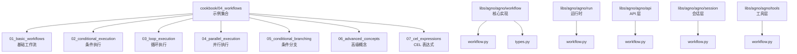
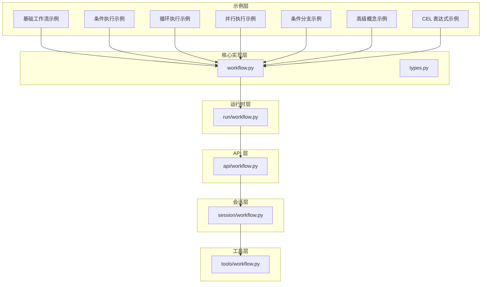
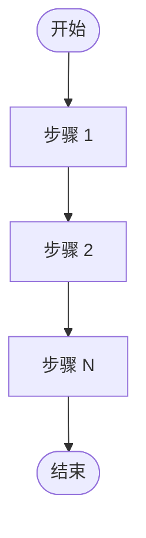
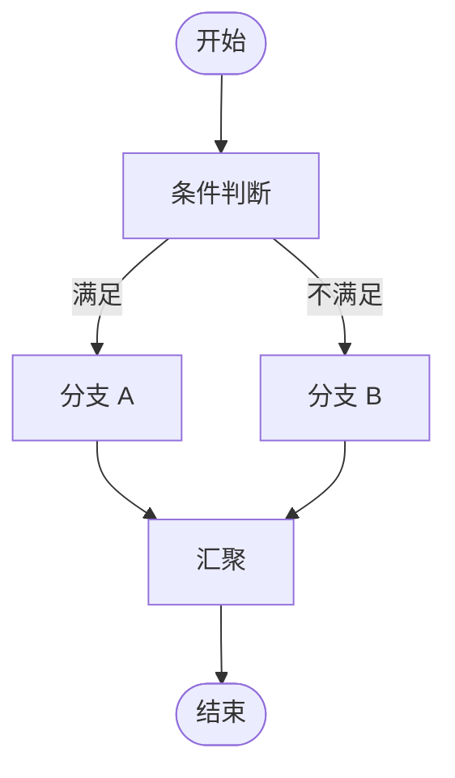
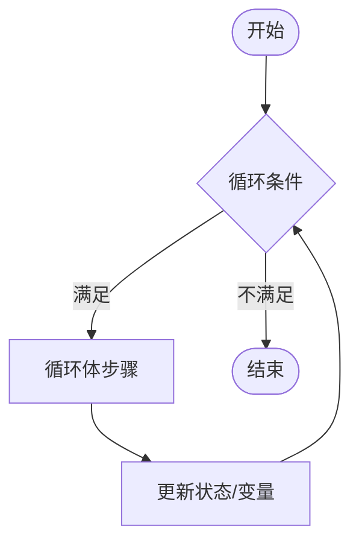
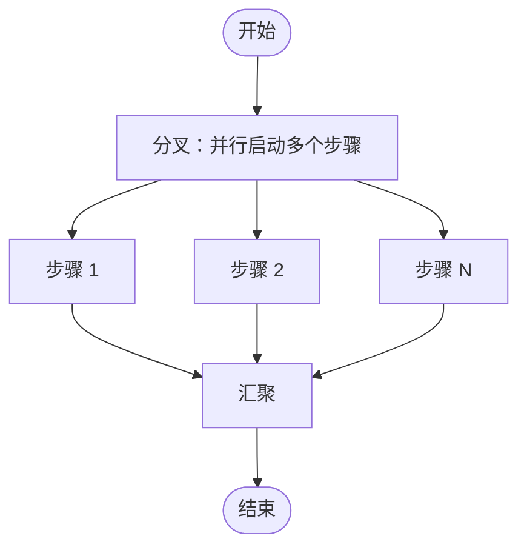
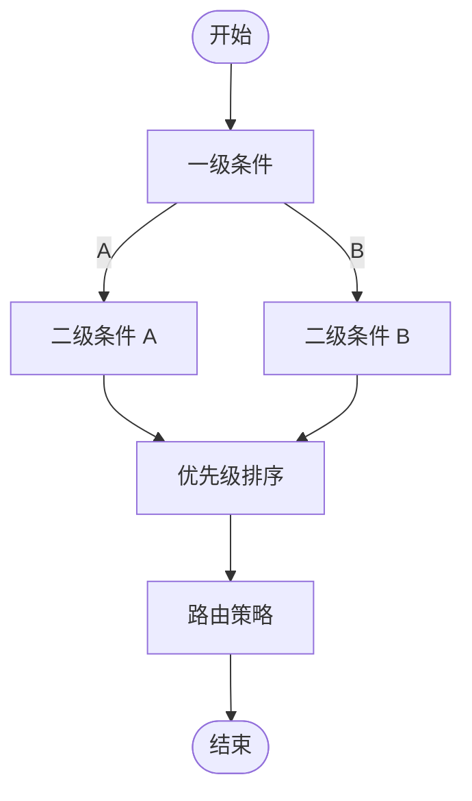
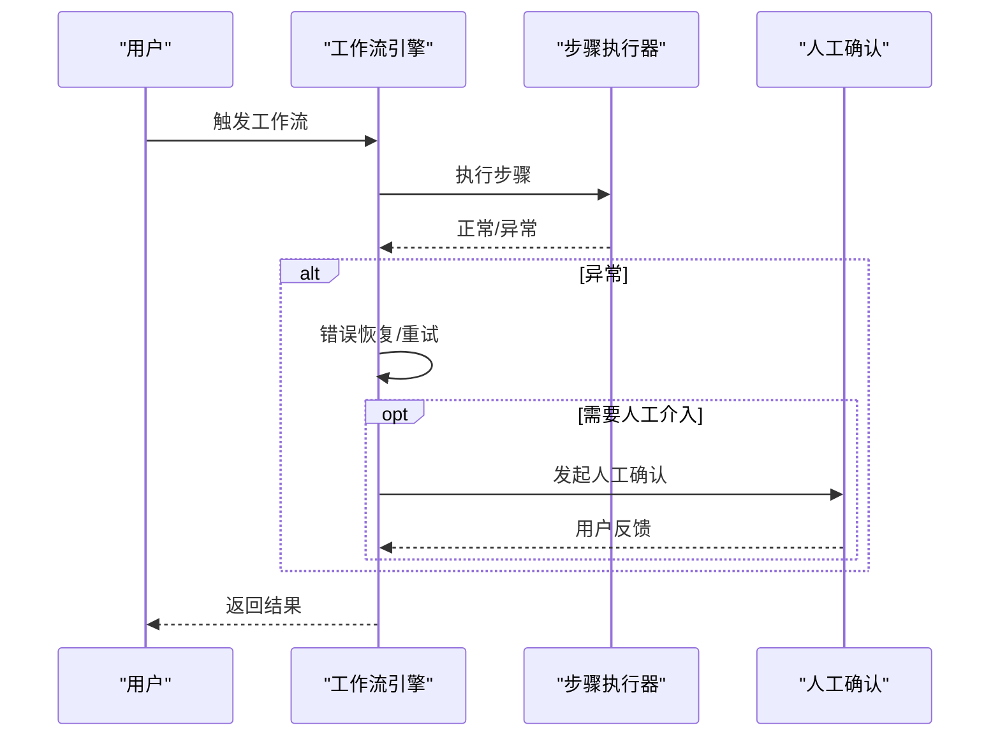
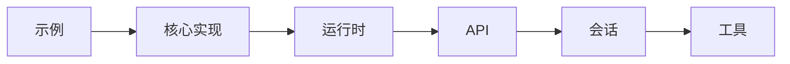

# 工作流系统

<cite>
**本文引用的文件**
- [cookbook/04_workflows/README.md](file://cookbook/04_workflows/README.md)
- [libs/agno/agno/workflow/workflow.py](file://libs/agno/agno/workflow/workflow.py)
- [libs/agno/agno/run/workflow.py](file://libs/agno/agno/run/workflow.py)
- [libs/agno/agno/api/workflow.py](file://libs/agno/agno/api/workflow.py)
- [libs/agno/agno/session/workflow.py](file://libs/agno/agno/session/workflow.py)
- [libs/agno/agno/tools/workflow.py](file://libs/agno/agno/tools/workflow.py)
- [libs/agno/agno/workflow/types.py](file://libs/agno/agno/workflow/types.py)
- [cookbook/00_quickstart/sequential_workflow.py](file://cookbook/00_quickstart/sequential_workflow.py)
- [cookbook/04_workflows/01_basic_workflows/01_sequence_of_steps/workflow_using_steps.py](file://cookbook/04_workflows/01_basic_workflows/01_sequence_of_steps/workflow_using_steps.py)
- [cookbook/04_workflows/01_basic_workflows/01_sequence_of_steps/workflow_using_steps_nested.py](file://cookbook/04_workflows/01_basic_workflows/01_sequence_of_steps/workflow_using_steps_nested.py)
- [cookbook/04_workflows/01_basic_workflows/01_sequence_of_steps/workflow_with_file_input.py](file://cookbook/04_workflows/01_basic_workflows/01_sequence_of_steps/workflow_with_file_input.py)
- [cookbook/04_workflows/01_basic_workflows/01_sequence_of_steps/workflow_with_session_metrics.py](file://cookbook/04_workflows/01_basic_workflows/01_sequence_of_steps/workflow_with_session_metrics.py)
- [cookbook/04_workflows/01_basic_workflows/03_function_workflows/function_workflow.py](file://cookbook/04_workflows/01_basic_workflows/03_function_workflows/function_workflow.py)
- [cookbook/04_workflows/02_conditional_execution/conditional_execution.py](file://cookbook/04_workflows/02_conditional_execution/conditional_execution.py)
- [cookbook/04_workflows/02_conditional_execution/conditional_execution_with_cel.py](file://cookbook/04_workflows/02_conditional_execution/conditional_execution_with_cel.py)
- [cookbook/04_workflows/03_loop_execution/loop_execution.py](file://cookbook/04_workflows/03_loop_execution/loop_execution.py)
- [cookbook/04_workflows/03_loop_execution/loop_execution_with_exit_condition.py](file://cookbook/04_workflows/03_loop_execution/loop_execution_with_exit_condition.py)
- [cookbook/04_workflows/03_loop_execution/loop_execution_with_timeout.py](file://cookbook/04_workflows/03_loop_execution/loop_execution_with_timeout.py)
- [cookbook/04_workflows/04_parallel_execution/parallel_execution.py](file://cookbook/04_workflows/04_parallel_execution/parallel_execution.py)
- [cookbook/04_workflows/04_parallel_execution/parallel_execution_with_sync.py](file://cookbook/04_workflows/04_parallel_execution/parallel_execution_with_sync.py)
- [cookbook/04_workflows/05_conditional_branching/conditional_branching.py](file://cookbook/04_workflows/05_conditional_branching/conditional_branching.py)
- [cookbook/04_workflows/05_conditional_branching/conditional_branching_with_priorities.py](file://cookbook/04_workflows/05_conditional_branching/conditional_branching_with_priorities.py)
- [cookbook/04_workflows/05_conditional_branching/conditional_branching_with_routing_strategy.py](file://cookbook/04_workflows/05_conditional_branching/conditional_branching_with_routing_strategy.py)
- [cookbook/04_workflows/06_advanced_concepts/file_propagation/file_generation_workflow.py](file://cookbook/04_workflows/06_advanced_concepts/file_propagation/file_generation_workflow.py)
- [cookbook/04_workflows/06_advanced_concepts/run_control/remote_workflow.py](file://cookbook/04_workflows/06_advanced_concepts/run_control/remote_workflow.py)
- [cookbook/04_workflows/06_advanced_concepts/run_control/workflow_cli.py](file://cookbook/04_workflows/06_advanced_concepts/run_control/workflow_cli.py)
- [cookbook/04_workflows/06_advanced_concepts/run_control/workflow_serialization.py](file://cookbook/04_workflows/06_advanced_concepts/run_control/workflow_serialization.py)
- [cookbook/04_workflows/06_advanced_concepts/tools/workflow_tools.py](file://cookbook/04_workflows/06_advanced_concepts/tools/workflow_tools.py)
- [cookbook/04_workflows/06_advanced_concepts/workflow_agent/basic_workflow_agent.py](file://cookbook/04_workflows/06_advanced_concepts/workflow_agent/basic_workflow_agent.py)
- [cookbook/04_workflows/06_advanced_concepts/workflow_agent/workflow_agent_with_condition.py](file://cookbook/04_workflows/06_advanced_concepts/workflow_agent/workflow_agent_with_condition.py)
- [cookbook/04_workflows/07_cel_expressions/cel_expressions.py](file://cookbook/04_workflows/07_cel_expressions/cel_expressions.py)
- [cookbook/04_workflows/07_cel_expressions/cel_expressions_with_variables.py](file://cookbook/04_workflows/07_cel_expressions/cel_expressions_with_variables.py)
- [cookbook/05_agent_os/client/07_run_workflows.py](file://cookbook/05_agent_os/client/07_run_workflows.py)
- [cookbook/01_demo/workflows/daily_brief/workflow.py](file://cookbook/01_demo/workflows/daily_brief/workflow.py)
</cite>

## 目录
1. [简介](#简介)
2. [项目结构](#项目结构)
3. [核心组件](#核心组件)
4. [架构总览](#架构总览)
5. [详细组件分析](#详细组件分析)
6. [依赖关系分析](#依赖关系分析)
7. [性能考虑](#性能考虑)
8. [故障排查指南](#故障排查指南)
9. [结论](#结论)
10. [附录](#附录)

## 简介
本文件面向 Agno Learn 的工作流系统，系统性梳理工作流的创建、配置与执行机制，覆盖顺序执行、步骤组合、函数工作流、条件执行、循环执行、并行执行、条件分支、高级概念（异常处理、错误恢复、超时控制、CEL 表达式、人机协作）等主题。文档以仓库中的示例与核心模块为依据，提供从入门到进阶的完整学习路径与实践参考。

## 项目结构
工作流相关示例集中在 cookbook/04_workflows 目录下，按功能域划分为基础工作流、条件执行、循环执行、并行执行、条件分支、高级概念、CEL 表达式等子目录；同时在 libs/agno/agno 下存在运行时与 API 层面的工作流实现文件，用于支撑示例与生产场景。

图表来源
- [cookbook/04_workflows/README.md:1-19](file://cookbook/04_workflows/README.md#L1-L19)
- [libs/agno/agno/workflow/workflow.py](file://libs/agno/agno/workflow/workflow.py)
- [libs/agno/agno/run/workflow.py](file://libs/agno/agno/run/workflow.py)
- [libs/agno/agno/api/workflow.py](file://libs/agno/agno/api/workflow.py)
- [libs/agno/agno/session/workflow.py](file://libs/agno/agno/session/workflow.py)
- [libs/agno/agno/tools/workflow.py](file://libs/agno/agno/tools/workflow.py)

章节来源
- [cookbook/04_workflows/README.md:1-19](file://cookbook/04_workflows/README.md#L1-L19)

## 核心组件
- 工作流核心实现：libs/agno/agno/workflow/workflow.py 提供工作流的基础数据结构、步骤定义与执行控制接口。
- 类型定义：libs/agno/agno/workflow/types.py 定义工作流与步骤的关键类型，确保配置与运行时的一致性。
- 运行时：libs/agno/agno/run/workflow.py 提供工作流的调度、状态管理与执行引擎能力。
- API 层：libs/agno/agno/api/workflow.py 提供对外暴露的工作流服务端点与调用入口。
- 会话层：libs/agno/agno/session/workflow.py 将工作流与会话上下文绑定，支持状态持久化与多轮交互。
- 工具层：libs/agno/agno/tools/workflow.py 将工具与工作流结合，实现可复用的步骤单元。

章节来源
- [libs/agno/agno/workflow/workflow.py](file://libs/agno/agno/workflow/workflow.py)
- [libs/agno/agno/workflow/types.py](file://libs/agno/agno/workflow/types.py)
- [libs/agno/agno/run/workflow.py](file://libs/agno/agno/run/workflow.py)
- [libs/agno/agno/api/workflow.py](file://libs/agno/agno/api/workflow.py)
- [libs/agno/agno/session/workflow.py](file://libs/agno/agno/session/workflow.py)
- [libs/agno/agno/tools/workflow.py](file://libs/agno/agno/tools/workflow.py)

## 架构总览
工作流系统采用分层设计：示例层（cookbook）、运行时层（run）、API 层（api）、会话层（session）、工具层（tools），以及核心实现层（workflow）。示例通过统一的类型与运行时接口驱动执行，API 层负责对外服务，会话层负责状态与上下文管理，工具层提供可复用的步骤能力。

图表来源
- [libs/agno/agno/workflow/workflow.py](file://libs/agno/agno/workflow/workflow.py)
- [libs/agno/agno/workflow/types.py](file://libs/agno/agno/workflow/types.py)
- [libs/agno/agno/run/workflow.py](file://libs/agno/agno/run/workflow.py)
- [libs/agno/agno/api/workflow.py](file://libs/agno/agno/api/workflow.py)
- [libs/agno/agno/session/workflow.py](file://libs/agno/agno/session/workflow.py)
- [libs/agno/agno/tools/workflow.py](file://libs/agno/agno/tools/workflow.py)

## 详细组件分析

### 基础工作流：顺序执行与步骤组合
- 概念与目标：通过线性步骤编排实现任务自动化，强调步骤的顺序性与组合能力。
- 关键点
  - 步骤定义：每个步骤包含输入、输出与执行逻辑，支持文件输入与会话指标采集。
  - 组合方式：支持平铺步骤与嵌套步骤，便于构建复杂流程。
  - 函数工作流：以函数作为步骤单元，简化业务逻辑封装与复用。
- 示例参考
  - 平铺步骤序列：[workflow_using_steps.py](file://cookbook/04_workflows/01_basic_workflows/01_sequence_of_steps/workflow_using_steps.py)
  - 嵌套步骤序列：[workflow_using_steps_nested.py](file://cookbook/04_workflows/01_basic_workflows/01_sequence_of_steps/workflow_using_steps_nested.py)
  - 文件输入：[workflow_with_file_input.py](file://cookbook/04_workflows/01_basic_workflows/01_sequence_of_steps/workflow_with_file_input.py)
  - 会话指标：[workflow_with_session_metrics.py](file://cookbook/04_workflows/01_basic_workflows/01_sequence_of_steps/workflow_with_session_metrics.py)
  - 函数工作流：[function_workflow.py](file://cookbook/04_workflows/01_basic_workflows/03_function_workflows/function_workflow.py)
  - 快速开始顺序工作流：[sequential_workflow.py](file://cookbook/00_quickstart/sequential_workflow.py)

图表来源
- [libs/agno/agno/workflow/workflow.py](file://libs/agno/agno/workflow/workflow.py)

章节来源
- [cookbook/04_workflows/01_basic_workflows/01_sequence_of_steps/workflow_using_steps.py](file://cookbook/04_workflows/01_basic_workflows/01_sequence_of_steps/workflow_using_steps.py)
- [cookbook/04_workflows/01_basic_workflows/01_sequence_of_steps/workflow_using_steps_nested.py](file://cookbook/04_workflows/01_basic_workflows/01_sequence_of_steps/workflow_using_steps_nested.py)
- [cookbook/04_workflows/01_basic_workflows/01_sequence_of_steps/workflow_with_file_input.py](file://cookbook/04_workflows/01_basic_workflows/01_sequence_of_steps/workflow_with_file_input.py)
- [cookbook/04_workflows/01_basic_workflows/01_sequence_of_steps/workflow_with_session_metrics.py](file://cookbook/04_workflows/01_basic_workflows/01_sequence_of_steps/workflow_with_session_metrics.py)
- [cookbook/04_workflows/01_basic_workflows/03_function_workflows/function_workflow.py](file://cookbook/04_workflows/01_basic_workflows/03_function_workflows/function_workflow.py)
- [cookbook/00_quickstart/sequential_workflow.py](file://cookbook/00_quickstart/sequential_workflow.py)

### 条件执行：条件判断、分支逻辑与动态路由
- 概念与目标：根据条件表达式动态选择执行路径，支持静态条件与 CEL 表达式。
- 关键点
  - 条件判断：基于布尔表达式或 CEL 表达式决定下一步骤。
  - 分支逻辑：多路分支与默认分支，确保流程健壮性。
  - 动态路由：运行时根据上下文变量动态选择路由。
- 示例参考
  - 条件执行基础：[conditional_execution.py](file://cookbook/04_workflows/02_conditional_execution/conditional_execution.py)
  - CEL 条件：[conditional_execution_with_cel.py](file://cookbook/04_workflows/02_conditional_execution/conditional_execution_with_cel.py)

图表来源
- [libs/agno/agno/workflow/workflow.py](file://libs/agno/agno/workflow/workflow.py)

章节来源
- [cookbook/04_workflows/02_conditional_execution/conditional_execution.py](file://cookbook/04_workflows/02_conditional_execution/conditional_execution.py)
- [cookbook/04_workflows/02_conditional_execution/conditional_execution_with_cel.py](file://cookbook/04_workflows/02_conditional_execution/conditional_execution_with_cel.py)

### 循环执行：循环控制、条件退出与无限循环防护
- 概念与目标：重复执行一组步骤直至满足退出条件，提供超时保护与安全退出。
- 关键点
  - 循环控制：计数器、阈值与迭代变量管理。
  - 条件退出：基于状态或结果的动态退出。
  - 超时控制：防止无限循环，保障系统稳定性。
- 示例参考
  - 循环执行基础：[loop_execution.py](file://cookbook/04_workflows/03_loop_execution/loop_execution.py)
  - 退出条件：[loop_execution_with_exit_condition.py](file://cookbook/04_workflows/03_loop_execution/loop_execution_with_exit_condition.py)
  - 超时控制：[loop_execution_with_timeout.py](file://cookbook/04_workflows/03_loop_execution/loop_execution_with_timeout.py)

图表来源
- [libs/agno/agno/workflow/workflow.py](file://libs/agno/agno/workflow/workflow.py)

章节来源
- [cookbook/04_workflows/03_loop_execution/loop_execution.py](file://cookbook/04_workflows/03_loop_execution/loop_execution.py)
- [cookbook/04_workflows/03_loop_execution/loop_execution_with_exit_condition.py](file://cookbook/04_workflows/03_loop_execution/loop_execution_with_exit_condition.py)
- [cookbook/04_workflows/03_loop_execution/loop_execution_with_timeout.py](file://cookbook/04_workflows/03_loop_execution/loop_execution_with_timeout.py)

### 并行执行：并行步骤、同步机制与资源管理
- 概念与目标：同时执行多个步骤，通过同步机制保证收敛与一致性。
- 关键点
  - 并行步骤：多分支并发执行。
  - 同步机制：等待所有分支完成或部分完成。
  - 资源管理：并发度控制与资源隔离。
- 示例参考
  - 并行执行基础：[parallel_execution.py](file://cookbook/04_workflows/04_parallel_execution/parallel_execution.py)
  - 并行同步：[parallel_execution_with_sync.py](file://cookbook/04_workflows/04_parallel_execution/parallel_execution_with_sync.py)

图表来源
- [libs/agno/agno/workflow/workflow.py](file://libs/agno/agno/workflow/workflow.py)

章节来源
- [cookbook/04_workflows/04_parallel_execution/parallel_execution.py](file://cookbook/04_workflows/04_parallel_execution/parallel_execution.py)
- [cookbook/04_workflows/04_parallel_execution/parallel_execution_with_sync.py](file://cookbook/04_workflows/04_parallel_execution/parallel_execution_with_sync.py)

### 条件分支：嵌套条件、优先级控制与路由策略
- 概念与目标：在复杂业务中实现多层条件与优先级，确保路由正确与可维护性。
- 关键点
  - 嵌套条件：条件内再嵌套条件，形成树状决策。
  - 优先级控制：高优条件优先匹配，避免误判。
  - 路由策略：基于权重、规则或动态策略选择最优路径。
- 示例参考
  - 条件分支基础：[conditional_branching.py](file://cookbook/04_workflows/05_conditional_branching/conditional_branching.py)
  - 优先级控制：[conditional_branching_with_priorities.py](file://cookbook/04_workflows/05_conditional_branching/conditional_branching_with_priorities.py)
  - 路由策略：[conditional_branching_with_routing_strategy.py](file://cookbook/04_workflows/05_conditional_branching/conditional_branching_with_routing_strategy.py)

图表来源
- [libs/agno/agno/workflow/workflow.py](file://libs/agno/agno/workflow/workflow.py)

章节来源
- [cookbook/04_workflows/05_conditional_branching/conditional_branching.py](file://cookbook/04_workflows/05_conditional_branching/conditional_branching.py)
- [cookbook/04_workflows/05_conditional_branching/conditional_branching_with_priorities.py](file://cookbook/04_workflows/05_conditional_branching/conditional_branching_with_priorities.py)
- [cookbook/04_workflows/05_conditional_branching/conditional_branching_with_routing_strategy.py](file://cookbook/04_workflows/05_conditional_branching/conditional_branching_with_routing_strategy.py)

### 高级概念：异常处理、错误恢复、超时控制、CEL 表达式、人机协作
- 异常处理与错误恢复：在步骤失败时进行降级、重试或回滚，保持流程可用性。
- 超时控制：为步骤与整体流程设置上限，防止阻塞与资源耗尽。
- CEL 表达式：在条件与路由中使用 CEL 进行灵活计算与判断。
- 人机协作：在关键节点引入人工确认与反馈，提升安全性与可控性。
- 示例参考
  - 文件传播与生成：[file_generation_workflow.py](file://cookbook/04_workflows/06_advanced_concepts/file_propagation/file_generation_workflow.py)
  - 远程运行与序列化：[remote_workflow.py](file://cookbook/04_workflows/06_advanced_concepts/run_control/remote_workflow.py)、[workflow_serialization.py](file://cookbook/04_workflows/06_advanced_concepts/run_control/workflow_serialization.py)、[workflow_cli.py](file://cookbook/04_workflows/06_advanced_concepts/run_control/workflow_cli.py)
  - 工具集成：[workflow_tools.py](file://cookbook/04_workflows/06_advanced_concepts/tools/workflow_tools.py)
  - 工作流代理与条件：[basic_workflow_agent.py](file://cookbook/04_workflows/06_advanced_concepts/workflow_agent/basic_workflow_agent.py)、[workflow_agent_with_condition.py](file://cookbook/04_workflows/06_advanced_concepts/workflow_agent/workflow_agent_with_condition.py)
  - CEL 表达式：[cel_expressions.py](file://cookbook/04_workflows/07_cel_expressions/cel_expressions.py)、[cel_expressions_with_variables.py](file://cookbook/04_workflows/07_cel_expressions/cel_expressions_with_variables.py)

图表来源
- [libs/agno/agno/workflow/workflow.py](file://libs/agno/agno/workflow/workflow.py)
- [libs/agno/agno/run/workflow.py](file://libs/agno/agno/run/workflow.py)

章节来源
- [cookbook/04_workflows/06_advanced_concepts/file_propagation/file_generation_workflow.py](file://cookbook/04_workflows/06_advanced_concepts/file_propagation/file_generation_workflow.py)
- [cookbook/04_workflows/06_advanced_concepts/run_control/remote_workflow.py](file://cookbook/04_workflows/06_advanced_concepts/run_control/remote_workflow.py)
- [cookbook/04_workflows/06_advanced_concepts/run_control/workflow_serialization.py](file://cookbook/04_workflows/06_advanced_concepts/run_control/workflow_serialization.py)
- [cookbook/04_workflows/06_advanced_concepts/run_control/workflow_cli.py](file://cookbook/04_workflows/06_advanced_concepts/run_control/workflow_cli.py)
- [cookbook/04_workflows/06_advanced_concepts/tools/workflow_tools.py](file://cookbook/04_workflows/06_advanced_concepts/tools/workflow_tools.py)
- [cookbook/04_workflows/06_advanced_concepts/workflow_agent/basic_workflow_agent.py](file://cookbook/04_workflows/06_advanced_concepts/workflow_agent/basic_workflow_agent.py)
- [cookbook/04_workflows/06_advanced_concepts/workflow_agent/workflow_agent_with_condition.py](file://cookbook/04_workflows/06_advanced_concepts/workflow_agent/workflow_agent_with_condition.py)
- [cookbook/04_workflows/07_cel_expressions/cel_expressions.py](file://cookbook/04_workflows/07_cel_expressions/cel_expressions.py)
- [cookbook/04_workflows/07_cel_expressions/cel_expressions_with_variables.py](file://cookbook/04_workflows/07_cel_expressions/cel_expressions_with_variables.py)

### 实际应用场景
- 日常简报工作流：演示多步骤编排与会话上下文的结合，参考 [daily_brief workflow](file://cookbook/01_demo/workflows/daily_brief/workflow.py)。
- Agent OS 客户端运行：通过客户端接口触发工作流，参考 [07_run_workflows.py](file://cookbook/05_agent_os/client/07_run_workflows.py)。

章节来源
- [cookbook/01_demo/workflows/daily_brief/workflow.py](file://cookbook/01_demo/workflows/daily_brief/workflow.py)
- [cookbook/05_agent_os/client/07_run_workflows.py](file://cookbook/05_agent_os/client/07_run_workflows.py)

## 依赖关系分析
- 组件耦合
  - 示例层依赖核心实现层（workflow.py 与 types.py）提供的类型与接口。
  - 运行时层对核心实现层进行扩展，提供调度与状态管理。
  - API 层与会话层分别面向外部服务与上下文管理，向上游提供统一入口。
  - 工具层为工作流提供可复用步骤，增强组合能力。
- 外部依赖
  - 示例中广泛使用 CEL 表达式与人机协作工具，体现对表达式语言与外部交互的支持。
- 潜在风险
  - 并发与超时：需在运行时层严格控制并发度与超时时间，避免资源耗尽。
  - 条件复杂度：嵌套条件与优先级可能导致可读性下降，建议拆分与注释。

图表来源
- [libs/agno/agno/workflow/workflow.py](file://libs/agno/agno/workflow/workflow.py)
- [libs/agno/agno/run/workflow.py](file://libs/agno/agno/run/workflow.py)
- [libs/agno/agno/api/workflow.py](file://libs/agno/agno/api/workflow.py)
- [libs/agno/agno/session/workflow.py](file://libs/agno/agno/session/workflow.py)
- [libs/agno/agno/tools/workflow.py](file://libs/agno/agno/tools/workflow.py)

章节来源
- [libs/agno/agno/workflow/workflow.py](file://libs/agno/agno/workflow/workflow.py)
- [libs/agno/agno/run/workflow.py](file://libs/agno/agno/run/workflow.py)
- [libs/agno/agno/api/workflow.py](file://libs/agno/agno/api/workflow.py)
- [libs/agno/agno/session/workflow.py](file://libs/agno/agno/session/workflow.py)
- [libs/agno/agno/tools/workflow.py](file://libs/agno/agno/tools/workflow.py)

## 性能考虑
- 并发与吞吐
  - 控制并行度，避免过度并发导致资源争用。
  - 使用异步与队列机制提升吞吐，降低等待时间。
- 超时与重试
  - 为长耗时步骤设置超时，防止阻塞。
  - 对易失败步骤启用指数退避重试，提高成功率。
- 内存与状态
  - 限制会话状态大小，定期清理历史数据。
  - 使用增量更新与懒加载减少内存占用。
- 可观测性
  - 在关键节点埋点，记录耗时、错误率与并发度。
  - 结合会话指标与文件输入，定位性能瓶颈。

## 故障排查指南
- 常见问题
  - 步骤失败：检查输入参数、工具可用性与权限。
  - 条件不生效：核对 CEL 表达式语法与变量作用域。
  - 并发死锁：检查同步点与资源竞争，必要时调整并发策略。
  - 超时退出：增加超时阈值或优化步骤实现。
- 排查步骤
  - 启用调试日志，定位失败步骤与异常栈。
  - 使用序列化与 CLI 工具复现问题，验证修复。
  - 对比远程运行与本地运行差异，排除环境因素。
- 相关示例
  - 序列化与 CLI：[workflow_serialization.py](file://cookbook/04_workflows/06_advanced_concepts/run_control/workflow_serialization.py)、[workflow_cli.py](file://cookbook/04_workflows/06_advanced_concepts/run_control/workflow_cli.py)
  - 远程运行：[remote_workflow.py](file://cookbook/04_workflows/06_advanced_concepts/run_control/remote_workflow.py)

章节来源
- [cookbook/04_workflows/06_advanced_concepts/run_control/workflow_serialization.py](file://cookbook/04_workflows/06_advanced_concepts/run_control/workflow_serialization.py)
- [cookbook/04_workflows/06_advanced_concepts/run_control/workflow_cli.py](file://cookbook/04_workflows/06_advanced_concepts/run_control/workflow_cli.py)
- [cookbook/04_workflows/06_advanced_concepts/run_control/remote_workflow.py](file://cookbook/04_workflows/06_advanced_concepts/run_control/remote_workflow.py)

## 结论
Agno Learn 的工作流系统通过清晰的分层设计与丰富的示例，覆盖了从基础顺序执行到高级条件分支、并行与循环的全场景需求。配合 CEL 表达式、人机协作与运行时控制，能够满足复杂业务的编排与治理要求。建议在实践中遵循“小步快跑、可观测先行”的原则，逐步完善异常处理、超时控制与并发策略，持续优化性能与可靠性。

## 附录
- 快速开始：顺序工作流示例与基本步骤组合。
- 进阶实践：条件执行、循环执行、并行执行与条件分支的组合使用。
- 高级特性：CEL 表达式、文件传播、远程运行与 CLI 工具链。
- 生产建议：并发度控制、超时与重试策略、状态清理与可观测性埋点。