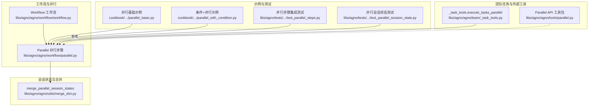
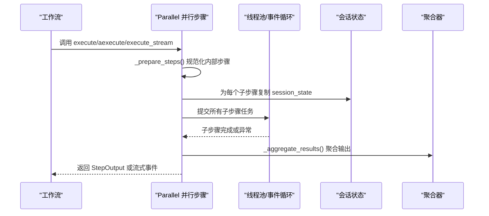
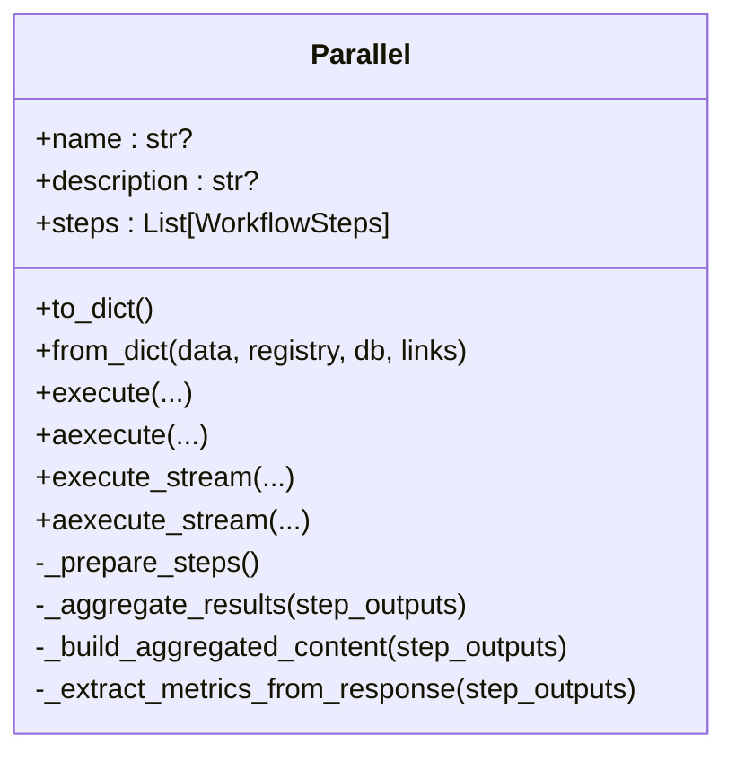
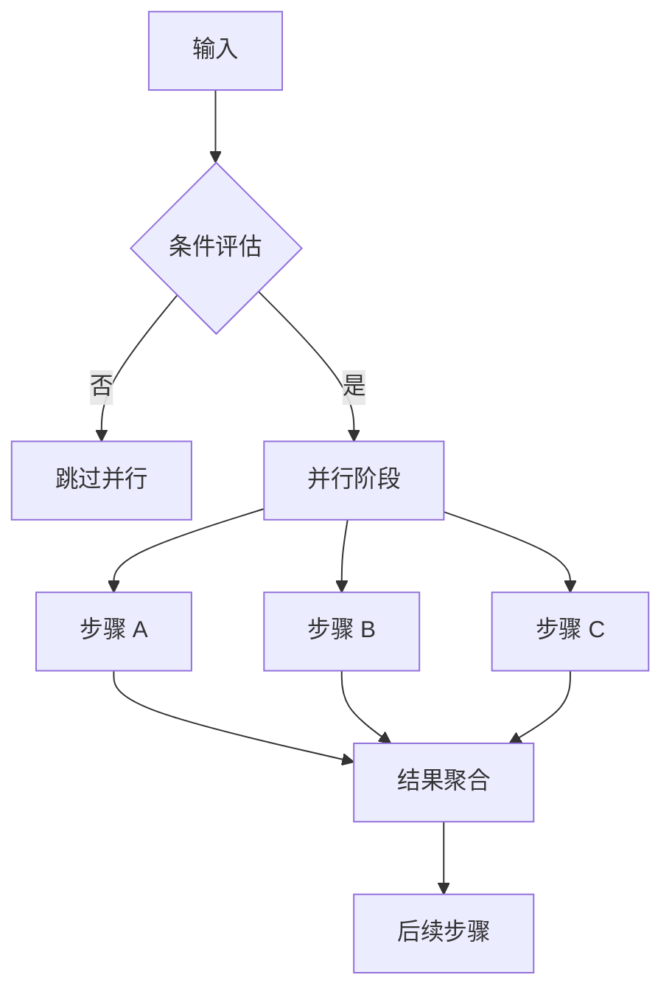
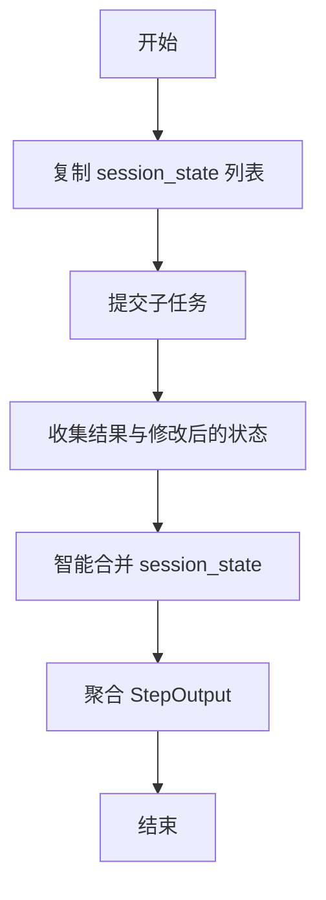
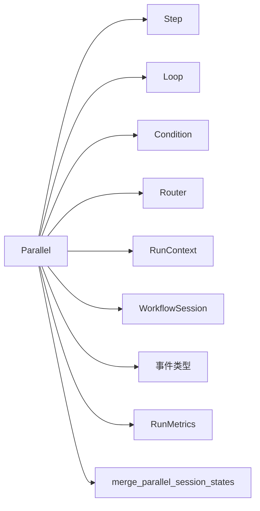

# 并行执行

<cite>
**本文引用的文件**
- [libs/agno/agno/workflow/parallel.py](file://libs/agno/agno/workflow/parallel.py)
- [libs/agno/agno/utils/merge_dict.py](file://libs/agno/agno/utils/merge_dict.py)
- [libs/agno/tests/integration/workflows/test_parallel_steps.py](file://libs/agno/tests/integration/workflows/test_parallel_steps.py)
- [libs/agno/tests/integration/workflows/test_parallel_session_state.py](file://libs/agno/tests/integration/workflows/test_parallel_session_state.py)
- [libs/agno/tests/integration/workflows/test_access_multiple_previous_steps_outputs.py](file://libs/agno/tests/integration/workflows/test_access_multiple_previous_steps_outputs.py)
- [libs/agno/agno/team/_task_tools.py](file://libs/agno/agno/team/_task_tools.py)
- [libs/agno/agno/tools/parallel.py](file://libs/agno/agno/tools/parallel.py)
- [cookbook/04_workflows/04_parallel_execution/parallel_basic.py](file://cookbook/04_workflows/04_parallel_execution/parallel_basic.py)
- [cookbook/04_workflows/04_parallel_execution/parallel_with_condition.py](file://cookbook/04_workflows/04_parallel_execution/parallel_with_condition.py)
</cite>

## 目录
1. [简介](#简介)
2. [项目结构](#项目结构)
3. [核心组件](#核心组件)
4. [架构总览](#架构总览)
5. [详细组件分析](#详细组件分析)
6. [依赖分析](#依赖分析)
7. [性能考虑](#性能考虑)
8. [故障排查指南](#故障排查指南)
9. [结论](#结论)
10. [附录](#附录)

## 简介
本文件系统性阐述 Agno Learn 中“并行执行”的架构设计与实现原理，覆盖以下主题：
- 并行步骤、同步机制与资源管理
- 并行类型与模式：完全并行、条件并行、混合并行
- 协调机制：任务调度、状态同步、结果聚合
- 资源控制：并发限制、资源池管理、负载均衡
- 错误处理：部分失败处理、重试机制、降级策略
- 性能优化：任务分解、异步处理、缓存策略
- 监控与调试：事件流、日志、指标采集

目标是帮助开发者在不深入源码的前提下，理解并高效使用并行执行能力，同时为高级用户深入定制提供清晰的参考。

## 项目结构
并行执行的核心位于工作流模块中，围绕 Parallel 步骤展开，配套有会话状态合并工具、测试用例与示例工作流。

**图表来源**
- [libs/agno/agno/workflow/parallel.py:42-93](file://libs/agno/agno/workflow/parallel.py#L42-L93)
- [libs/agno/agno/utils/merge_dict.py:23-41](file://libs/agno/agno/utils/merge_dict.py#L23-L41)
- [cookbook/04_workflows/04_parallel_execution/parallel_basic.py:1-68](file://cookbook/04_workflows/04_parallel_execution/parallel_basic.py#L1-L68)
- [cookbook/04_workflows/04_parallel_execution/parallel_with_condition.py:1-183](file://cookbook/04_workflows/04_parallel_execution/parallel_with_condition.py#L1-L183)
- [libs/agno/tests/integration/workflows/test_parallel_steps.py:1-816](file://libs/agno/tests/integration/workflows/test_parallel_steps.py#L1-L816)
- [libs/agno/tests/integration/workflows/test_parallel_session_state.py:1-876](file://libs/agno/tests/integration/workflows/test_parallel_session_state.py#L1-L876)
- [libs/agno/agno/team/_task_tools.py:647-659](file://libs/agno/agno/team/_task_tools.py#L647-L659)
- [libs/agno/agno/tools/parallel.py:1-308](file://libs/agno/agno/tools/parallel.py#L1-L308)

**章节来源**
- [libs/agno/agno/workflow/parallel.py:42-93](file://libs/agno/agno/workflow/parallel.py#L42-L93)
- [libs/agno/agno/utils/merge_dict.py:23-41](file://libs/agno/agno/utils/merge_dict.py#L23-L41)
- [cookbook/04_workflows/04_parallel_execution/parallel_basic.py:1-68](file://cookbook/04_workflows/04_parallel_execution/parallel_basic.py#L1-L68)
- [cookbook/04_workflows/04_parallel_execution/parallel_with_condition.py:1-183](file://cookbook/04_workflows/04_parallel_execution/parallel_with_condition.py#L1-L183)
- [libs/agno/tests/integration/workflows/test_parallel_steps.py:1-816](file://libs/agno/tests/integration/workflows/test_parallel_steps.py#L1-L816)
- [libs/agno/tests/integration/workflows/test_parallel_session_state.py:1-876](file://libs/agno/tests/integration/workflows/test_parallel_session_state.py#L1-L876)
- [libs/agno/agno/team/_task_tools.py:647-659](file://libs/agno/agno/team/_task_tools.py#L647-L659)
- [libs/agno/agno/tools/parallel.py:1-308](file://libs/agno/agno/tools/parallel.py#L1-L308)

## 核心组件
- Parallel 并行步骤：支持同步/异步/流式执行，内部步骤可为函数、Step、Agent、Team、Loop、Condition、Router 或嵌套 Parallel；负责准备步骤、并发执行、结果聚合与事件流产出。
- 会话状态合并：智能合并多个并行步骤对 session_state 的修改，避免覆盖与竞态。
- 工作流集成：作为工作流中的一个步骤节点，与条件、循环、路由等组合形成复杂流程。
- 团队任务并行：团队层面对独立任务进行并发执行的工具方法，体现“并行”在不同抽象层级的应用。

**章节来源**
- [libs/agno/agno/workflow/parallel.py:42-93](file://libs/agno/agno/workflow/parallel.py#L42-L93)
- [libs/agno/agno/utils/merge_dict.py:23-41](file://libs/agno/agno/utils/merge_dict.py#L23-L41)
- [libs/agno/agno/team/_task_tools.py:647-659](file://libs/agno/agno/team/_task_tools.py#L647-L659)

## 架构总览
并行执行在同步、异步与流式三种模式下运行，均通过“准备步骤→并发执行→结果聚合→事件产出”的统一流程完成。

**图表来源**
- [libs/agno/agno/workflow/parallel.py:130-153](file://libs/agno/agno/workflow/parallel.py#L130-L153)
- [libs/agno/agno/workflow/parallel.py:286-396](file://libs/agno/agno/workflow/parallel.py#L286-L396)
- [libs/agno/agno/workflow/parallel.py:617-726](file://libs/agno/agno/workflow/parallel.py#L617-L726)
- [libs/agno/agno/workflow/parallel.py:417-597](file://libs/agno/agno/workflow/parallel.py#L417-L597)

## 详细组件分析

### Parallel 类与执行模型
- 初始化与序列化：支持多种调用形式（名称可前置或后置），并可从字典反序列化。
- 步骤准备：将可调用对象、Agent、Team、Step、Steps、Loop、Parallel、Condition、Router 统一包装为 Step。
- 执行模式：
  - 同步 execute：ThreadPoolExecutor 并发执行，按原始索引收集结果，合并 session_state。
  - 异步 aexecute：asyncio.gather 并发执行，异常以 StepOutput 形式记录，保留顺序。
  - 流式 execute_stream/aexecute_stream：事件队列驱动，边执行边产出事件，最终聚合 StepOutput。
- 结果聚合：构建包含各子步骤内容的汇总文本，合并媒体资源，提取并累加指标，传播 stop 标志。
- 事件流：在流式模式下产出“并行开始/完成”事件，便于上层可观测性。

**图表来源**
- [libs/agno/agno/workflow/parallel.py:42-93](file://libs/agno/agno/workflow/parallel.py#L42-L93)
- [libs/agno/agno/workflow/parallel.py:130-221](file://libs/agno/agno/workflow/parallel.py#L130-L221)
- [libs/agno/agno/workflow/parallel.py:268-396](file://libs/agno/agno/workflow/parallel.py#L268-L396)
- [libs/agno/agno/workflow/parallel.py:599-726](file://libs/agno/agno/workflow/parallel.py#L599-L726)
- [libs/agno/agno/workflow/parallel.py:398-597](file://libs/agno/agno/workflow/parallel.py#L398-L597)
- [libs/agno/agno/workflow/parallel.py:728-912](file://libs/agno/agno/workflow/parallel.py#L728-L912)

**章节来源**
- [libs/agno/agno/workflow/parallel.py:42-93](file://libs/agno/agno/workflow/parallel.py#L42-L93)
- [libs/agno/agno/workflow/parallel.py:130-221](file://libs/agno/agno/workflow/parallel.py#L130-L221)
- [libs/agno/agno/workflow/parallel.py:268-396](file://libs/agno/agno/workflow/parallel.py#L268-L396)
- [libs/agno/agno/workflow/parallel.py:599-726](file://libs/agno/agno/workflow/parallel.py#L599-L726)
- [libs/agno/agno/workflow/parallel.py:398-597](file://libs/agno/agno/workflow/parallel.py#L398-L597)
- [libs/agno/agno/workflow/parallel.py:728-912](file://libs/agno/agno/workflow/parallel.py#L728-L912)

### 并行类型与模式
- 完全并行：多个独立步骤在同一阶段并行执行，互不阻塞，适合 I/O 密集型任务。
- 条件并行：在条件分支中嵌入并行，仅当条件满足时才执行并行，提升灵活性。
- 混合并行：与循环、路由、条件等组合，形成复杂工作流拓扑。

**图表来源**
- [cookbook/04_workflows/04_parallel_execution/parallel_with_condition.py:133-160](file://cookbook/04_workflows/04_parallel_execution/parallel_with_condition.py#L133-L160)

**章节来源**
- [cookbook/04_workflows/04_parallel_execution/parallel_basic.py:34-41](file://cookbook/04_workflows/04_parallel_execution/parallel_basic.py#L34-L41)
- [cookbook/04_workflows/04_parallel_execution/parallel_with_condition.py:133-160](file://cookbook/04_workflows/04_parallel_execution/parallel_with_condition.py#L133-L160)

### 协调机制：任务调度、状态同步与结果聚合
- 任务调度：同步模式使用 ThreadPoolExecutor，异步模式使用 asyncio.gather；流式模式使用线程/事件循环与队列。
- 状态同步：为每个子步骤复制 session_state，避免共享可变状态导致的竞争；执行完成后通过智能合并函数将实际变化写回。
- 结果聚合：构建汇总内容、合并媒体与指标、传播 stop 标志，保证上层流程正确终止或继续。

**图表来源**
- [libs/agno/agno/workflow/parallel.py:286-396](file://libs/agno/agno/workflow/parallel.py#L286-L396)
- [libs/agno/agno/workflow/parallel.py:617-726](file://libs/agno/agno/workflow/parallel.py#L617-L726)
- [libs/agno/agno/utils/merge_dict.py:23-41](file://libs/agno/agno/utils/merge_dict.py#L23-L41)

**章节来源**
- [libs/agno/agno/workflow/parallel.py:286-396](file://libs/agno/agno/workflow/parallel.py#L286-L396)
- [libs/agno/agno/workflow/parallel.py:617-726](file://libs/agno/agno/workflow/parallel.py#L617-L726)
- [libs/agno/agno/utils/merge_dict.py:23-41](file://libs/agno/agno/utils/merge_dict.py#L23-L41)

### 资源控制：并发限制、资源池与负载均衡
- 并发限制：同步模式默认以子步骤数量为 max_workers，建议根据 CPU/I-O 与外部服务限流策略调整；异步模式受事件循环与外部 API 速率限制影响。
- 资源池：线程池由 Python concurrent.futures 提供；外部 API（如搜索引擎）需遵循其配额与速率限制。
- 负载均衡：通过拆分大任务为多个小并行步骤，结合流式输出降低首屏延迟。

**章节来源**
- [libs/agno/agno/workflow/parallel.py:341-347](file://libs/agno/agno/workflow/parallel.py#L341-L347)
- [libs/agno/agno/workflow/parallel.py:517-523](file://libs/agno/agno/workflow/parallel.py#L517-L523)

### 错误处理：部分失败、重试与降级
- 部分失败：单个子步骤异常会被捕获并转换为 StepOutput.success=False，不影响其他步骤执行。
- 重试：可在子步骤层面实现指数退避重试；并行容器本身不内置重试逻辑。
- 降级：当外部依赖不可用时，返回预设兜底内容并标记失败，确保整体流程可控。

**章节来源**
- [libs/agno/agno/workflow/parallel.py:324-336](file://libs/agno/agno/workflow/parallel.py#L324-L336)
- [libs/agno/agno/workflow/parallel.py:654-666](file://libs/agno/agno/workflow/parallel.py#L654-L666)

### 性能优化：任务分解、异步与缓存
- 任务分解：将耗时操作拆分为多个独立子步骤，充分利用并行。
- 异步处理：优先使用 aexecute/aexecute_stream，减少线程切换开销。
- 缓存策略：对外部 API 使用请求级缓存与结果去重，避免重复调用。

**章节来源**
- [libs/agno/agno/workflow/parallel.py:617-726](file://libs/agno/agno/workflow/parallel.py#L617-L726)
- [libs/agno/agno/tools/parallel.py:1-308](file://libs/agno/agno/tools/parallel.py#L1-L308)

### 监控与调试：事件流、日志与指标
- 事件流：流式执行期间产出“并行开始/完成”事件，便于前端实时渲染与后端可观测性。
- 日志：并行开始/结束与子步骤完成均有调试日志，辅助定位问题。
- 指标：聚合 RunMetrics，便于统计吞吐与成本。

**章节来源**
- [libs/agno/agno/workflow/parallel.py:435-447](file://libs/agno/agno/workflow/parallel.py#L435-L447)
- [libs/agno/agno/workflow/parallel.py:584-597](file://libs/agno/agno/workflow/parallel.py#L584-L597)
- [libs/agno/agno/workflow/parallel.py:765-777](file://libs/agno/agno/workflow/parallel.py#L765-L777)
- [libs/agno/agno/workflow/parallel.py:898-911](file://libs/agno/agno/workflow/parallel.py#L898-L911)

## 依赖分析
- 内部依赖：Parallel 依赖 Step、Agent、Team、Loop、Condition、Router、RunContext、RunMetrics、WorkflowSession、事件类型等。
- 外部依赖：concurrent.futures（线程池）、asyncio（异步）、上下文变量传播（copy_context）。
- 工具函数：merge_parallel_session_states 用于安全合并并行修改。

**图表来源**
- [libs/agno/agno/workflow/parallel.py:130-153](file://libs/agno/agno/workflow/parallel.py#L130-L153)
- [libs/agno/agno/workflow/parallel.py:223-244](file://libs/agno/agno/workflow/parallel.py#L223-L244)
- [libs/agno/agno/utils/merge_dict.py:23-41](file://libs/agno/agno/utils/merge_dict.py#L23-L41)

**章节来源**
- [libs/agno/agno/workflow/parallel.py:130-153](file://libs/agno/agno/workflow/parallel.py#L130-L153)
- [libs/agno/agno/utils/merge_dict.py:23-41](file://libs/agno/agno/utils/merge_dict.py#L23-L41)

## 性能考虑
- 并发度权衡：过多并发可能触发外部服务限流或本地资源争用，应结合压测与监控动态调整。
- I/O 与 CPU：I/O 密集场景优先并行；CPU 密集场景需谨慎，避免 GIL 争用。
- 流式输出：尽早产出中间事件，改善用户体验与可观测性。
- 指标聚合：利用 RunMetrics 追踪耗时与 Token 使用，识别瓶颈。

[本节为通用指导，无需特定文件引用]

## 故障排查指南
- 并行步骤未执行：检查 stop 标志是否被上游设置，确认工作流在遇到 stop=True 时提前终止。
- 会话状态冲突：确认是否对同一键进行了并发修改；使用智能合并函数避免覆盖。
- 上下文变量丢失：确保使用 copy_context().run 提交任务，保障 contextvar 在子线程可用。
- 外部依赖失败：查看异常 StepOutput 的 error 字段，必要时在子步骤内实现重试与降级。

**章节来源**
- [libs/agno/tests/integration/workflows/test_parallel_steps.py:387-423](file://libs/agno/tests/integration/workflows/test_parallel_steps.py#L387-L423)
- [libs/agno/tests/integration/workflows/test_parallel_session_state.py:388-427](file://libs/agno/tests/integration/workflows/test_parallel_session_state.py#L388-L427)
- [libs/agno/agno/workflow/parallel.py:344-347](file://libs/agno/agno/workflow/parallel.py#L344-L347)

## 结论
Agno Learn 的并行执行以 Parallel 为核心，提供了统一的同步/异步/流式执行接口，配合会话状态智能合并与事件流，既能满足高吞吐需求，又保持了良好的可观测性与可维护性。通过合理拆分任务、控制并发度与引入缓存，可进一步提升性能与稳定性。

[本节为总结，无需特定文件引用]

## 附录

### 示例与最佳实践路径
- 基础并行工作流：[parallel_basic.py:34-68](file://cookbook/04_workflows/04_parallel_execution/parallel_basic.py#L34-L68)
- 条件+并行工作流：[parallel_with_condition.py:133-183](file://cookbook/04_workflows/04_parallel_execution/parallel_with_condition.py#L133-L183)
- 直接调用并行步骤（同步/异步/流式）：[test_parallel_steps.py:54-134](file://libs/agno/tests/integration/workflows/test_parallel_steps.py#L54-L134)
- 并行会话状态修改与合并：[test_parallel_session_state.py:15-190](file://libs/agno/tests/integration/workflows/test_parallel_session_state.py#L15-L190)
- 访问多步骤输出（并行结果聚合后使用）：[test_access_multiple_previous_steps_outputs.py:61-97](file://libs/agno/tests/integration/workflows/test_access_multiple_previous_steps_outputs.py#L61-L97)
- 团队任务并行（线程池）：[_task_tools.execute_tasks_parallel:647-659](file://libs/agno/agno/team/_task_tools.py#L647-L659)
- 外部并行 API 工具（搜索引擎/抽取）：[parallel.py:1-308](file://libs/agno/agno/tools/parallel.py#L1-L308)