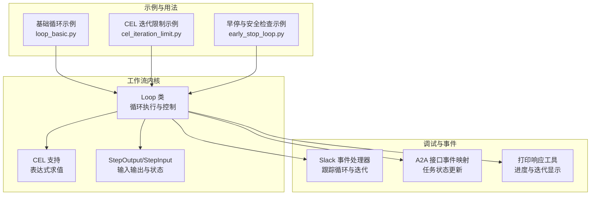
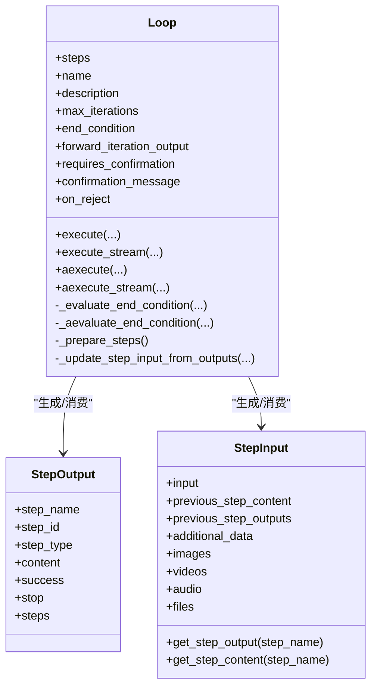
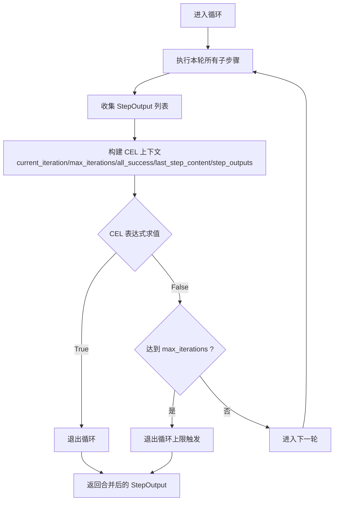
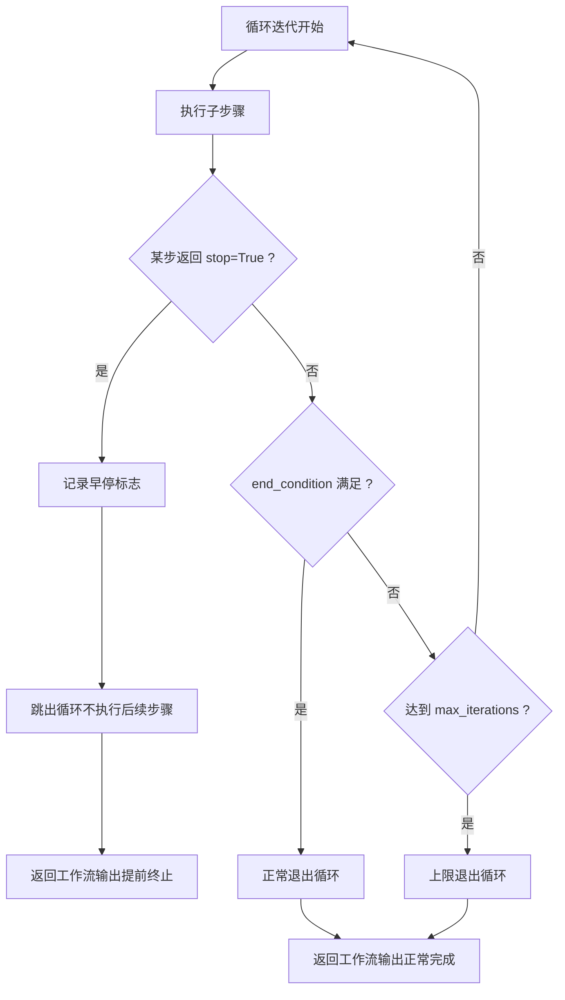
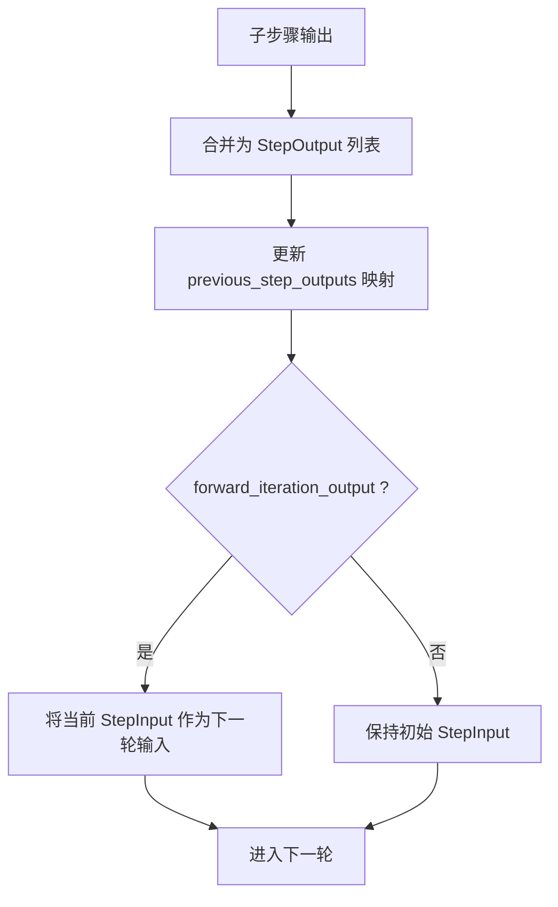
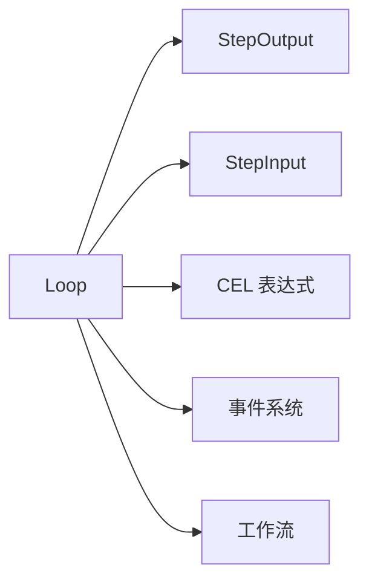

# 循环执行

<cite>
**本文引用的文件**
- [libs/agno/agno/workflow/loop.py](file://libs/agno/agno/workflow/loop.py)
- [libs/agno/agno/workflow/cel.py](file://libs/agno/agno/workflow/cel.py)
- [libs/agno/agno/workflow/types.py](file://libs/agno/agno/workflow/types.py)
- [cookbook/04_workflows/03_loop_execution/loop_basic.md](file://cookbook/04_workflows/03_loop_execution/loop_basic.md)
- [cookbook/04_workflows/03_loop_execution/loop_basic.py](file://cookbook/04_workflows/03_loop_execution/loop_basic.py)
- [cookbook/04_workflows/07_cel_expressions/loop/cel_iteration_limit.md](file://cookbook/04_workflows/07_cel_expressions/loop/cel_iteration_limit.md)
- [cookbook/04_workflows/06_advanced_concepts/early_stopping/early_stop_loop.md](file://cookbook/04_workflows/06_advanced_concepts/early_stopping/early_stop_loop.md)
- [cookbook/04_workflows/06_advanced_concepts/early_stopping/early_stop_loop.py](file://cookbook/04_workflows/06_advanced_concepts/early_stopping/early_stop_loop.py)
- [libs/agno/agno/os/interfaces/slack/events.py](file://libs/agno/agno/os/interfaces/slack/events.py)
- [libs/agno/agno/os/interfaces/a2a/utils.py](file://libs/agno/agno/os/interfaces/a2a/utils.py)
- [libs/agno/agno/utils/print_response/workflow.py](file://libs/agno/agno/utils/print_response/workflow.py)
- [libs/agno/tests/integration/workflows/test_streaming_events.py](file://libs/agno/tests/integration/workflows/test_streaming_events.py)
</cite>

## 目录
1. [简介](#简介)
2. [项目结构](#项目结构)
3. [核心组件](#核心组件)
4. [架构总览](#架构总览)
5. [详细组件分析](#详细组件分析)
6. [依赖分析](#依赖分析)
7. [性能考虑](#性能考虑)
8. [故障排查指南](#故障排查指南)
9. [结论](#结论)
10. [附录](#附录)

## 简介
本章节系统性阐述 Agno Learn 的循环执行能力，围绕 Loop 步骤的实现机制与应用实践展开，覆盖循环控制、迭代处理、状态管理、安全机制、性能优化与调试监控等主题。读者将理解如何在工作流中使用基础循环、条件循环与计数循环，掌握 end_condition 的多种表达方式（函数/CEL），以及如何通过 forward_iteration_output、HITL 等特性实现灵活的状态维护与交互控制。

## 项目结构
与循环执行相关的核心代码位于 workflow 子模块，示例与用法集中在 cookbook 的 workflows 示例中；事件流与调试输出由 OS 接口与打印响应工具提供支撑。



**图表来源**
- [libs/agno/agno/workflow/loop.py:40-454](file://libs/agno/agno/workflow/loop.py#L40-L454)
- [libs/agno/agno/workflow/cel.py:116-133](file://libs/agno/agno/workflow/cel.py#L116-L133)
- [libs/agno/agno/workflow/types.py:99-200](file://libs/agno/agno/workflow/types.py#L99-L200)
- [cookbook/04_workflows/03_loop_execution/loop_basic.py:78-90](file://cookbook/04_workflows/03_loop_execution/loop_basic.py#L78-L90)
- [cookbook/04_workflows/07_cel_expressions/loop/cel_iteration_limit.py:35-48](file://cookbook/04_workflows/07_cel_expressions/loop/cel_iteration_limit.py#L35-L48)
- [cookbook/04_workflows/06_advanced_concepts/early_stopping/early_stop_loop.py:94-110](file://cookbook/04_workflows/06_advanced_concepts/early_stopping/early_stop_loop.py#L94-L110)
- [libs/agno/agno/os/interfaces/slack/events.py:322-341](file://libs/agno/agno/os/interfaces/slack/events.py#L322-L341)
- [libs/agno/agno/os/interfaces/a2a/utils.py:537-580](file://libs/agno/agno/os/interfaces/a2a/utils.py#L537-L580)
- [libs/agno/agno/utils/print_response/workflow.py:1278-1300](file://libs/agno/agno/utils/print_response/workflow.py#L1278-L1300)

**章节来源**
- [libs/agno/agno/workflow/loop.py:40-454](file://libs/agno/agno/workflow/loop.py#L40-L454)
- [libs/agno/agno/workflow/cel.py:116-133](file://libs/agno/agno/workflow/cel.py#L116-L133)
- [libs/agno/agno/workflow/types.py:99-200](file://libs/agno/agno/workflow/types.py#L99-L200)
- [cookbook/04_workflows/03_loop_execution/loop_basic.md:1-122](file://cookbook/04_workflows/03_loop_execution/loop_basic.md#L1-L122)
- [cookbook/04_workflows/07_cel_expressions/loop/cel_iteration_limit.md:1-60](file://cookbook/04_workflows/07_cel_expressions/loop/cel_iteration_limit.md#L1-L60)
- [cookbook/04_workflows/06_advanced_concepts/early_stopping/early_stop_loop.md:1-98](file://cookbook/04_workflows/06_advanced_concepts/early_stopping/early_stop_loop.md#L1-L98)

## 核心组件
- Loop 步骤：封装一组步骤的重复执行，支持 end_condition 与 max_iterations 控制，可选择将每轮输出转发至下一轮，支持同步/异步执行与流式事件输出。
- CEL 表达式：为 end_condition 提供声明式条件判断能力，内置 current_iteration、max_iterations、all_success、last_step_content、step_outputs 等上下文变量。
- StepOutput/StepInput：统一承载每步执行结果与输入，支持 previous_step_outputs 递归查询、媒体附件与嵌套步骤输出列表，用于循环内的状态维护与跨步骤数据传递。
- 事件与调试：提供 LoopExecutionStarted/Completed、LoopIterationStarted/Completed 等事件，便于外部系统跟踪循环生命周期与迭代进度。

**章节来源**
- [libs/agno/agno/workflow/loop.py:40-136](file://libs/agno/agno/workflow/loop.py#L40-L136)
- [libs/agno/agno/workflow/cel.py:116-133](file://libs/agno/agno/workflow/cel.py#L116-L133)
- [libs/agno/agno/workflow/types.py:99-200](file://libs/agno/agno/workflow/types.py#L99-L200)
- [libs/agno/agno/workflow/loop.py:473-654](file://libs/agno/agno/workflow/loop.py#L473-L654)
- [libs/agno/agno/workflow/loop.py:782-782](file://libs/agno/agno/workflow/loop.py#L782-L782)

## 架构总览
下图展示了 Loop 在工作流中的位置与与子步骤、CEL、事件系统的关系。

```mermaid
sequenceDiagram
participant WF as "工作流"
participant LOOP as "Loop 步骤"
participant STEP as "子步骤"
participant CEL as "CEL 表达式引擎"
participant EVT as "事件系统"
WF->>LOOP : 调用 execute()/aexecute()
LOOP->>LOOP : 准备步骤列表
loop 每轮迭代
LOOP->>STEP : 依次执行子步骤
STEP-->>LOOP : 返回 StepOutput
LOOP->>LOOP : 更新输入可转发输出
end
LOOP->>CEL : 评估 end_condition
alt 条件满足或达到 max_iterations
LOOP-->>WF : 返回合并后的 StepOutput
else 继续下一轮
LOOP->>LOOP : 进入下一轮
end
LOOP->>EVT : 发送开始/迭代/完成事件可选
```

**图表来源**
- [libs/agno/agno/workflow/loop.py:369-454](file://libs/agno/agno/workflow/loop.py#L369-L454)
- [libs/agno/agno/workflow/loop.py:473-654](file://libs/agno/agno/workflow/loop.py#L473-L654)
- [libs/agno/agno/workflow/loop.py:765-782](file://libs/agno/agno/workflow/loop.py#L765-L782)
- [libs/agno/agno/workflow/cel.py:116-133](file://libs/agno/agno/workflow/cel.py#L116-L133)

## 详细组件分析

### Loop 类与执行控制
- 循环控制
  - max_iterations：最大迭代次数，防止无限循环。
  - end_condition：支持函数或 CEL 表达式；函数接收本轮所有 StepOutput 列表；CEL 表达式可访问 current_iteration、max_iterations、all_success、last_step_content、step_outputs 等上下文。
  - forward_iteration_output：是否将每轮输出作为下一轮输入，实现“滚雪球”式的增量处理。
  - requires_confirmation/on_reject：人类在环（HITL）确认，支持跳过、取消或分支处理。
- 迭代处理
  - 同步/异步执行 execute()/aexecute() 与流式 execute_stream()/aexecute_stream()。
  - 每轮收集 iteration_results，支持 StepOutput.steps 嵌套（如 Parallel/Condition）。
  - 早停：若任一步返回 stop=True，则立即终止循环并传播到工作流。
- 状态维护
  - 使用 StepInput.previous_step_outputs 与 previous_step_content 保存每轮输出，支持递归查询与内容聚合。
  - 支持媒体附件(images/videos/audio/files)在每步间传递与累积。



**图表来源**
- [libs/agno/agno/workflow/loop.py:40-136](file://libs/agno/agno/workflow/loop.py#L40-L136)
- [libs/agno/agno/workflow/types.py:99-200](file://libs/agno/agno/workflow/types.py#L99-L200)

**章节来源**
- [libs/agno/agno/workflow/loop.py:349-454](file://libs/agno/agno/workflow/loop.py#L349-L454)
- [libs/agno/agno/workflow/loop.py:456-654](file://libs/agno/agno/workflow/loop.py#L456-L654)
- [libs/agno/agno/workflow/loop.py:656-763](file://libs/agno/agno/workflow/loop.py#L656-L763)
- [libs/agno/agno/workflow/loop.py:765-782](file://libs/agno/agno/workflow/loop.py#L765-L782)
- [libs/agno/agno/workflow/types.py:99-200](file://libs/agno/agno/workflow/types.py#L99-L200)

### 条件循环与 CEL 表达式
- end_condition 支持函数与 CEL 表达式两种形态：
  - 函数：传入 List[StepOutput]，返回布尔值。
  - CEL：通过 evaluate_cel_loop_end_condition 注入上下文变量，支持基于内容长度、成功状态、迭代次数等条件的动态判断。
- 常用上下文变量
  - current_iteration：当前迭代编号（1-indexed，完成之后）。
  - max_iterations：配置的最大迭代次数。
  - all_success：本轮所有子步骤是否均成功。
  - last_step_content：本轮最后一个子步骤的内容。
  - step_outputs：Map[step_name, content]，本轮各子步骤内容映射。
- 示例要点
  - 使用 current_iteration >= N 实现“至少 N 次、最多 M 次”的精确控制，实际退出以两者较小者为准。
  - end_condition 与 max_iterations 可组合使用，确保既满足业务条件又避免无限循环。



**图表来源**
- [libs/agno/agno/workflow/cel.py:116-133](file://libs/agno/agno/workflow/cel.py#L116-L133)
- [libs/agno/agno/workflow/cel.py:269-299](file://libs/agno/agno/workflow/cel.py#L269-L299)
- [libs/agno/agno/workflow/loop.py:426-428](file://libs/agno/agno/workflow/loop.py#L426-L428)

**章节来源**
- [libs/agno/agno/workflow/cel.py:116-133](file://libs/agno/agno/workflow/cel.py#L116-L133)
- [libs/agno/agno/workflow/cel.py:269-299](file://libs/agno/agno/workflow/cel.py#L269-L299)
- [cookbook/04_workflows/07_cel_expressions/loop/cel_iteration_limit.md:1-60](file://cookbook/04_workflows/07_cel_expressions/loop/cel_iteration_limit.md#L1-L60)

### 早停与安全机制
- 早停机制
  - 任一步返回 StepOutput(stop=True) 时，循环立即终止，并将 stop 标记传播到工作流，阻止后续步骤执行。
- 安全检查示例
  - 在循环内插入安全检查步骤，若检测到敏感内容则返回 stop=True，从而提前终止整个工作流。
- 与 end_condition 的关系
  - end_condition 控制“业务条件满足即停”，stop=True 控制“安全风险即停”。二者互不影响，但都会导致循环提前结束。



**图表来源**
- [libs/agno/agno/workflow/loop.py:403-416](file://libs/agno/agno/workflow/loop.py#L403-L416)
- [libs/agno/agno/workflow/loop.py:565-580](file://libs/agno/agno/workflow/loop.py#L565-L580)
- [cookbook/04_workflows/06_advanced_concepts/early_stopping/early_stop_loop.md:68-98](file://cookbook/04_workflows/06_advanced_concepts/early_stopping/early_stop_loop.md#L68-L98)

**章节来源**
- [libs/agno/agno/workflow/loop.py:403-416](file://libs/agno/agno/workflow/loop.py#L403-L416)
- [libs/agno/agno/workflow/loop.py:565-580](file://libs/agno/agno/workflow/loop.py#L565-L580)
- [cookbook/04_workflows/06_advanced_concepts/early_stopping/early_stop_loop.md:1-98](file://cookbook/04_workflows/06_advanced_concepts/early_stopping/early_stop_loop.md#L1-L98)

### 状态维护与上下文传递
- 循环变量与上下文
  - current_iteration：由循环引擎在每次迭代后更新，供 CEL 与 end_condition 使用。
  - step_outputs：本轮各子步骤内容映射，便于按步骤名检索。
  - all_success/last_step_content：快速判断本轮整体成功与最后一步内容。
- 输入更新策略
  - _update_step_input_from_outputs 会将多步输出合并，保留最新内容与媒体附件，并写入 previous_step_outputs，供后续步骤查询。
  - forward_iteration_output=true 时，将当前轮次的 StepInput 作为下一轮输入，形成“增量上下文”。



**图表来源**
- [libs/agno/agno/workflow/loop.py:308-347](file://libs/agno/agno/workflow/loop.py#L308-L347)
- [libs/agno/agno/workflow/loop.py:418-421](file://libs/agno/agno/workflow/loop.py#L418-L421)
- [libs/agno/agno/workflow/loop.py:620-622](file://libs/agno/agno/workflow/loop.py#L620-L622)

**章节来源**
- [libs/agno/agno/workflow/loop.py:308-347](file://libs/agno/agno/workflow/loop.py#L308-L347)
- [libs/agno/agno/workflow/loop.py:418-421](file://libs/agno/agno/workflow/loop.py#L418-L421)
- [libs/agno/agno/workflow/loop.py:620-622](file://libs/agno/agno/workflow/loop.py#L620-L622)

### 实用示例与工作流集成
- 基础循环
  - 使用 end_condition 函数判断内容长度是否达标，max_iterations 作为安全上限。
  - 示例路径：[cookbook/04_workflows/03_loop_execution/loop_basic.py:78-90](file://cookbook/04_workflows/03_loop_execution/loop_basic.py#L78-L90)
- CEL 迭代限制
  - 使用 current_iteration >= N 精确控制退出时机，结合 max_iterations 形成“至少/最多”的边界。
  - 示例路径：[cookbook/04_workflows/07_cel_expressions/loop/cel_iteration_limit.py:35-48](file://cookbook/04_workflows/07_cel_expressions/loop/cel_iteration_limit.py#L35-L48)
- 早停与安全检查
  - 在循环中加入安全检查步骤，一旦检测到敏感内容即 stop=True，提前终止工作流。
  - 示例路径：[cookbook/04_workflows/06_advanced_concepts/early_stopping/early_stop_loop.py:94-110](file://cookbook/04_workflows/06_advanced_concepts/early_stopping/early_stop_loop.py#L94-L110)

**章节来源**
- [cookbook/04_workflows/03_loop_execution/loop_basic.md:1-122](file://cookbook/04_workflows/03_loop_execution/loop_basic.md#L1-L122)
- [cookbook/04_workflows/07_cel_expressions/loop/cel_iteration_limit.md:1-60](file://cookbook/04_workflows/07_cel_expressions/loop/cel_iteration_limit.md#L1-L60)
- [cookbook/04_workflows/06_advanced_concepts/early_stopping/early_stop_loop.md:1-98](file://cookbook/04_workflows/06_advanced_concepts/early_stopping/early_stop_loop.md#L1-L98)

## 依赖分析
- Loop 与 StepOutput/StepInput
  - Loop 在执行过程中频繁读取/写入 StepOutput.content/success/stop 与 StepInput.previous_step_outputs，形成强耦合的数据通道。
- Loop 与 CEL
  - end_condition 为 CEL 时，依赖 evaluate_cel_loop_end_condition 注入上下文变量，要求安装 cel-python。
- Loop 与事件系统
  - execute_stream/aexecute_stream 产出 LoopExecution/Iteration 事件，供外部系统订阅与可视化。
- Loop 与工作流
  - 循环结束后将所有迭代结果扁平化为单一 StepOutput.steps 列表，作为后续步骤的输入来源之一。



**图表来源**
- [libs/agno/agno/workflow/loop.py:349-454](file://libs/agno/agno/workflow/loop.py#L349-L454)
- [libs/agno/agno/workflow/loop.py:473-654](file://libs/agno/agno/workflow/loop.py#L473-L654)
- [libs/agno/agno/workflow/cel.py:116-133](file://libs/agno/agno/workflow/cel.py#L116-L133)

**章节来源**
- [libs/agno/agno/workflow/loop.py:349-454](file://libs/agno/agno/workflow/loop.py#L349-L454)
- [libs/agno/agno/workflow/loop.py:473-654](file://libs/agno/agno/workflow/loop.py#L473-L654)
- [libs/agno/agno/workflow/cel.py:116-133](file://libs/agno/agno/workflow/cel.py#L116-L133)

## 性能考虑
- 批量处理
  - 在循环内使用 Parallel 步骤并行执行多个子步骤，缩短单轮耗时；end_condition 可对聚合输出进行评估。
  - 示例参考：[cookbook/04_workflows/03_loop_execution/loop_with_parallel.md:33-92](file://cookbook/04_workflows/03_loop_execution/loop_with_parallel.md#L33-L92)
- 异步执行
  - 使用 aexecute/aexecute_stream 处理 IO 密集型子步骤，提升吞吐；注意 CEL 表达式求值仍需在主线程或受限环境中进行。
- 并发控制
  - 通过 max_iterations 与 end_condition 双重约束，避免无限循环；合理设置 max_iterations 与 CEL 条件，减少无效迭代。
- 资源限制
  - 利用 stop=True 快速早停，避免资源浪费；对长耗时子步骤设置超时策略（在具体子步骤中实现）。

[本节为通用指导，无需特定文件来源]

## 故障排查指南
- 事件开关与可见性
  - 仅当 stream_events=True 时，LoopExecution/Iteration 事件才会被产出；否则仅返回最终 StepOutput。
  - 参考测试用例：[libs/agno/tests/integration/workflows/test_streaming_events.py:424-439](file://libs/agno/tests/integration/workflows/test_streaming_events.py#L424-L439)
- 事件消费与可视化
  - Slack/A2A 接口将 Loop 事件映射为任务状态更新，可用于前端实时展示循环进度。
  - 参考实现：
    - [libs/agno/agno/os/interfaces/slack/events.py:322-341](file://libs/agno/agno/os/interfaces/slack/events.py#L322-L341)
    - [libs/agno/agno/os/interfaces/a2a/utils.py:537-580](file://libs/agno/agno/os/interfaces/a2a/utils.py#L537-L580)
- 打印响应工具
  - print_response 工具在收到 LoopIterationStarted/Completed 事件时更新界面状态，便于本地调试。
  - 参考实现：[libs/agno/agno/utils/print_response/workflow.py:1278-1300](file://libs/agno/agno/utils/print_response/workflow.py#L1278-L1300)
- CEL 表达式问题
  - 若未安装 cel-python，CEL end_condition 将被忽略并记录警告；请安装依赖后重试。
  - 参考实现：[libs/agno/agno/workflow/cel.py:230-241](file://libs/agno/agno/workflow/cel.py#L230-L241)

**章节来源**
- [libs/agno/tests/integration/workflows/test_streaming_events.py:424-439](file://libs/agno/tests/integration/workflows/test_streaming_events.py#L424-L439)
- [libs/agno/agno/os/interfaces/slack/events.py:322-341](file://libs/agno/agno/os/interfaces/slack/events.py#L322-L341)
- [libs/agno/agno/os/interfaces/a2a/utils.py:537-580](file://libs/agno/agno/os/interfaces/a2a/utils.py#L537-L580)
- [libs/agno/agno/utils/print_response/workflow.py:1278-1300](file://libs/agno/agno/utils/print_response/workflow.py#L1278-L1300)
- [libs/agno/agno/workflow/cel.py:230-241](file://libs/agno/agno/workflow/cel.py#L230-L241)

## 结论
Agno Learn 的 Loop 步骤提供了灵活而强大的循环执行能力：通过 end_condition（函数/CEL）、max_iterations、forward_iteration_output、HITL 等特性，既能满足“质量驱动”的条件循环，也能实现“计数驱动”的固定迭代；结合事件系统与调试工具，可实现可观测、可回溯的工作流执行过程。建议在复杂场景中优先采用 CEL 表达式与早停机制，确保安全性与性能的平衡。

[本节为总结性内容，无需特定文件来源]

## 附录
- 相关示例文件
  - 基础循环：[cookbook/04_workflows/03_loop_execution/loop_basic.md:1-122](file://cookbook/04_workflows/03_loop_execution/loop_basic.md#L1-L122)
  - CEL 迭代限制：[cookbook/04_workflows/07_cel_expressions/loop/cel_iteration_limit.md:1-60](file://cookbook/04_workflows/07_cel_expressions/loop/cel_iteration_limit.md#L1-L60)
  - 早停与安全检查：[cookbook/04_workflows/06_advanced_concepts/early_stopping/early_stop_loop.md:1-98](file://cookbook/04_workflows/06_advanced_concepts/early_stopping/early_stop_loop.md#L1-L98)
- 核心实现文件
  - Loop 类与执行逻辑：[libs/agno/agno/workflow/loop.py:40-454](file://libs/agno/agno/workflow/loop.py#L40-L454)
  - CEL 表达式支持：[libs/agno/agno/workflow/cel.py:116-133](file://libs/agno/agno/workflow/cel.py#L116-L133)
  - StepOutput/StepInput 数据结构：[libs/agno/agno/workflow/types.py:99-200](file://libs/agno/agno/workflow/types.py#L99-L200)

[本节为补充信息，无需特定文件来源]